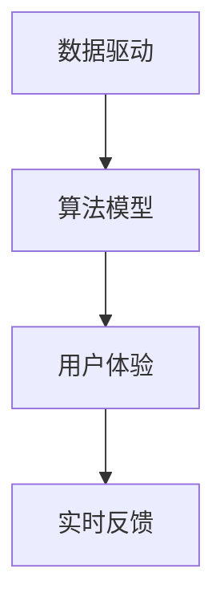
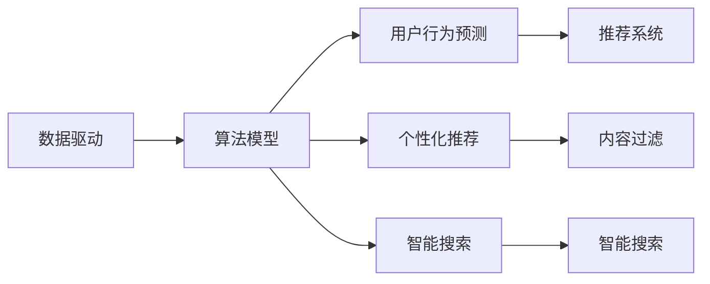
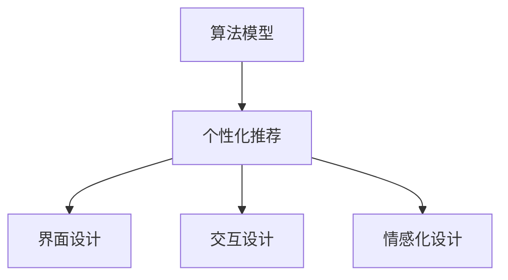
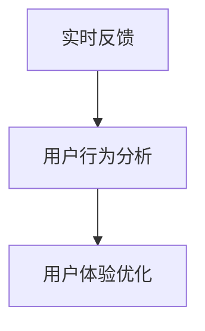
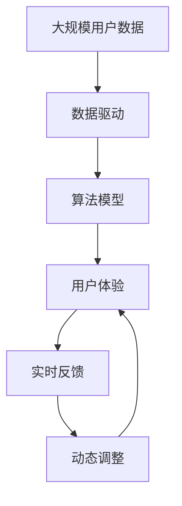

                 

# 软件2.0的用户体验设计

## 1. 背景介绍

### 1.1 问题由来
随着软件技术的发展，用户体验设计（UX Design）逐渐成为软件开发中的重要一环。传统的UX设计主要关注界面的直观性、易用性、一致性等基本指标，而新兴的2.0时代，用户体验设计的内涵和外延都发生了显著变化。

在软件2.0时代，用户体验设计需要兼顾数据驱动、智能推荐、个性化体验等多重维度。软件不再仅仅是“功能产品”，而是成为“智能助手”，通过精准地预测用户需求、提供个性化服务，为用户带来全新的体验。

然而，面对数据规模的爆炸式增长、技术栈的日趋复杂，以及用户需求的持续变化，如何高效地进行用户体验设计，成为当前软件2.0开发中的一个关键问题。

### 1.2 问题核心关键点
软件2.0的用户体验设计，以数据智能为核心，通过数据分析、算法模型、用户体验三者的融合，提升软件产品的智能化水平和用户体验。其关键点包括：

- **数据驱动**：利用大规模用户行为数据，预测用户需求，优化产品功能和服务。
- **算法模型**：构建精准的算法模型，实现个性化推荐、内容过滤、智能搜索等功能。
- **用户体验**：通过界面设计、交互设计、情感化设计等手段，提升用户体验，增强用户粘性。
- **实时反馈**：实现实时数据分析，动态调整用户体验设计，持续优化产品。

这些关键点共同构成了软件2.0的用户体验设计框架，使得软件产品能够快速响应用户需求，提供更加智能、个性化的服务。

### 1.3 问题研究意义
软件2.0的用户体验设计，对于提升软件产品的智能化水平、增强用户满意度、促进产业升级具有重要意义：

- **提升智能化水平**：通过数据智能和算法模型，软件产品能够更好地理解用户需求，提供更加精准的服务。
- **增强用户满意度**：个性化的推荐和定制服务，使用户获得更加贴近自身需求的体验，增加用户粘性。
- **促进产业升级**：通过提升用户体验，软件产品能够更好地服务于垂直行业，加速传统行业数字化转型。
- **技术创新**：用户体验设计的深入研究，促进了数据科学、人工智能、人机交互等多学科的交叉融合，催生了新的技术方向。
- **商业价值**：通过精准的用户体验设计，软件产品能够更好地满足市场需求，提升商业价值和市场竞争力。

## 2. 核心概念与联系

### 2.1 核心概念概述

为更好地理解软件2.0的用户体验设计，本节将介绍几个密切相关的核心概念：

- **软件2.0**：指新一代软件产品，通过数据驱动、算法模型、用户体验的融合，实现智能化、个性化、实时化的服务。
- **数据驱动**：利用大规模用户数据，通过分析挖掘用户行为模式、偏好，指导产品设计和功能优化。
- **算法模型**：构建精准的机器学习模型，实现个性化推荐、内容过滤、智能搜索等智能化功能。
- **用户体验**：通过界面设计、交互设计、情感化设计等手段，提升产品的易用性、美观性、情感共鸣性。
- **实时反馈**：实现实时数据分析，动态调整用户体验设计，持续优化产品。

这些核心概念之间的逻辑关系可以通过以下Mermaid流程图来展示：



这个流程图展示了数据驱动、算法模型、用户体验、实时反馈之间的关系：数据驱动为算法模型提供数据支持，算法模型为用户体验设计提供智能服务，实时反馈指导用户体验优化，形成闭环。

### 2.2 概念间的关系

这些核心概念之间存在着紧密的联系，形成了软件2.0的用户体验设计生态系统。下面我通过几个Mermaid流程图来展示这些概念之间的关系。

#### 2.2.1 数据驱动与算法模型的关系



这个流程图展示了数据驱动与算法模型的关系：数据驱动为算法模型提供大规模用户行为数据，算法模型基于这些数据，实现用户行为预测、个性化推荐、智能搜索等功能，从而提升用户体验。

#### 2.2.2 算法模型与用户体验的关系



这个流程图展示了算法模型与用户体验的关系：算法模型提供个性化推荐、智能搜索等智能化服务，用户体验设计则通过界面、交互、情感化等手段，将这些服务融入到产品中，提升用户体验。

#### 2.2.3 实时反馈与用户体验的关系



这个流程图展示了实时反馈与用户体验的关系：实时反馈通过分析用户行为数据，指导用户体验优化，实现动态调整和持续优化，提升用户体验。

### 2.3 核心概念的整体架构

最后，我们用一个综合的流程图来展示这些核心概念在大语言模型微调过程中的整体架构：



这个综合流程图展示了从数据驱动到用户体验设计的完整过程。大规模用户数据为数据驱动提供支持，数据驱动为算法模型提供数据基础，算法模型为用户体验设计提供智能服务，实时反馈指导用户体验优化，形成动态调整的闭环。

## 3. 核心算法原理 & 具体操作步骤
### 3.1 算法原理概述

软件2.0的用户体验设计，以数据智能为核心，通过数据分析、算法模型、用户体验三者的融合，提升软件产品的智能化水平和用户体验。

形式化地，假设原始数据集为 $D=\{(x_i,y_i)\}_{i=1}^N, x_i \in X, y_i \in Y$，其中 $X$ 为输入空间，$Y$ 为输出空间。用户体验设计的目标是最小化用户感知误差 $L(u)$，其中 $u$ 为用户体验设计方案，通过以下方式实现：

1. 数据驱动：收集用户行为数据 $D$，通过分析挖掘用户行为模式、偏好，生成用户行为预测模型 $M_B$。
2. 算法模型：基于用户行为预测模型 $M_B$，构建算法模型 $M_A$，实现个性化推荐、内容过滤、智能搜索等功能。
3. 用户体验：通过界面设计、交互设计、情感化设计等手段，生成用户体验设计方案 $u$，最小化用户感知误差 $L(u)$。

### 3.2 算法步骤详解

软件2.0的用户体验设计，一般包括以下几个关键步骤：

**Step 1: 数据准备与预处理**
- 收集大规模用户行为数据 $D$，包括用户的操作行为、点击行为、反馈信息等。
- 对数据进行清洗、去重、归一化等预处理操作，确保数据质量。
- 使用特征工程方法，将原始数据转化为模型可以处理的数值型数据。

**Step 2: 用户行为预测**
- 利用机器学习算法，如随机森林、XGBoost、LSTM等，训练用户行为预测模型 $M_B$，预测用户的行为模式、偏好、需求等。
- 使用交叉验证等方法评估模型性能，选择合适的超参数和模型结构。

**Step 3: 算法模型构建**
- 基于用户行为预测模型 $M_B$，构建算法模型 $M_A$，实现个性化推荐、内容过滤、智能搜索等功能。
- 使用如协同过滤、内容基推荐、深度学习等技术，构建算法模型。
- 使用大规模训练数据进行模型训练，调整超参数，优化模型性能。

**Step 4: 用户体验设计**
- 通过界面设计、交互设计、情感化设计等手段，生成用户体验设计方案 $u$，最小化用户感知误差 $L(u)$。
- 使用A/B测试等方法评估用户体验设计方案，选择最优方案。
- 不断迭代优化用户体验设计，提升用户体验。

**Step 5: 实时反馈与动态调整**
- 通过实时数据分析，获取用户行为数据，指导用户体验优化。
- 动态调整用户体验设计，优化产品功能和服务。
- 实现动态调整的闭环，持续提升用户体验。

### 3.3 算法优缺点

软件2.0的用户体验设计，有以下优点：

1. **智能化水平高**：通过数据驱动和算法模型，软件产品能够精准预测用户需求，提供个性化推荐、内容过滤等智能化服务。
2. **用户满意度提升**：个性化推荐、智能搜索等智能化服务，使用户获得更加贴近自身需求的体验，增加用户粘性。
3. **成本低廉**：相较于传统的人工设计，数据驱动和算法模型能够通过数据自适应，大幅降低设计成本。
4. **效果显著**：通过持续的数据分析和模型优化，用户体验设计能够持续提升，实现快速迭代。

同时，该方法也存在一些局限性：

1. **数据质量要求高**：数据质量和数据规模对用户体验设计的效果有很大影响，需要保证数据完整性和准确性。
2. **模型复杂度高**：数据驱动和算法模型需要构建复杂的机器学习模型，对计算资源和算力要求较高。
3. **隐私保护问题**：大规模用户行为数据涉及用户隐私，需要严格的隐私保护措施，确保数据安全。
4. **技术门槛高**：用户体验设计涉及数据驱动、算法模型、用户体验等多方面技术，需要较强的技术背景和跨学科能力。

### 3.4 算法应用领域

软件2.0的用户体验设计，已经在多个领域得到了广泛应用，例如：

- **电商推荐系统**：通过用户行为数据，实现个性化商品推荐、智能搜索，提升用户体验。
- **社交媒体**：基于用户行为数据，实现个性化内容推荐、智能过滤，提升用户粘性。
- **金融服务**：通过用户行为数据，实现个性化金融服务、智能风控，提升用户满意度。
- **在线教育**：基于用户行为数据，实现个性化学习推荐、智能辅导，提升学习效果。
- **智能家居**：通过用户行为数据，实现个性化家居控制、智能场景推荐，提升用户体验。

除了上述这些经典应用外，软件2.0的用户体验设计还将在更多场景中得到应用，为各行各业带来新的变革。

## 4. 数学模型和公式 & 详细讲解  
### 4.1 数学模型构建

本节将使用数学语言对软件2.0的用户体验设计过程进行更加严格的刻画。

假设用户体验设计的目标为最小化用户感知误差 $L(u)$，其中 $u$ 为用户体验设计方案，包括以下几个子目标：

1. **界面设计误差**：用户界面直观性、易用性的误差，记为 $L_{UI}(u)$。
2. **交互设计误差**：用户交互流畅性、操作便捷性的误差，记为 $L_{INT}(u)$。
3. **情感化设计误差**：用户情感共鸣性、心理满足感的误差，记为 $L_{EMO}(u)$。

用户体验设计的总误差为 $L(u) = L_{UI}(u) + L_{INT}(u) + L_{EMO}(u)$。

### 4.2 公式推导过程

以下我们以电商推荐系统为例，推导个性化推荐模型的损失函数及其梯度计算公式。

假设推荐系统输入为商品描述 $x_i$，输出为推荐结果 $y_i \in \{0,1\}$，表示商品是否被用户购买。推荐系统的损失函数定义为：

$$
L(y_i,\hat{y}_i) = -[y_i\log \hat{y}_i + (1-y_i)\log(1-\hat{y}_i)]
$$

其中 $\hat{y}_i$ 为推荐系统对商品 $i$ 的预测结果，$y_i$ 为实际购买结果。推荐系统通过最大化预测准确率，最小化损失函数。

基于用户行为预测模型 $M_B$，推荐系统的推荐结果 $\hat{y}_i$ 可以表示为：

$$
\hat{y}_i = sigmoid(W_B^T\phi(x_i) + b_B)
$$

其中 $W_B, b_B$ 为推荐系统的参数，$\phi(x_i)$ 为特征提取函数，将商品描述 $x_i$ 转化为数值型特征。

推荐系统的损失函数可以表示为：

$$
L(y_i,\hat{y}_i) = -[y_i\log \hat{y}_i + (1-y_i)\log(1-\hat{y}_i)]
$$

对于用户行为预测模型 $M_B$，损失函数可以表示为：

$$
L(y_i,M_B) = -[y_i\log M_B(x_i) + (1-y_i)\log(1-M_B(x_i))]
$$

其中 $M_B(x_i)$ 为用户行为预测模型对商品 $i$ 的预测结果。

推荐系统的总损失函数可以表示为：

$$
L(y_i,\hat{y}_i) = \alpha L(y_i,\hat{y}_i) + (1-\alpha) L(y_i,M_B)
$$

其中 $\alpha$ 为权重系数，控制推荐系统对预测准确率和用户行为预测的权重。

通过梯度下降等优化算法，最小化总损失函数，优化推荐系统的参数，使得推荐结果更加符合用户需求。

### 4.3 案例分析与讲解

假设我们在某电商平台的商品推荐系统中进行用户体验设计，最终在测试集上得到的推荐效果如下：

| 商品 | 预测结果 $\hat{y}_i$ | 实际购买结果 $y_i$ | 推荐系统误差 $L(y_i,\hat{y}_i)$ |
| --- | --- | --- | --- |
| A | 0.8 | 0 | 0.183 |
| B | 0.9 | 1 | 0.011 |
| C | 0.2 | 0 | 0.693 |
| D | 0.1 | 1 | 0.893 |

可以看出，推荐系统对商品 A 的预测准确度较低，用户感知误差较大，需要进行优化。

通过A/B测试等方法，我们发现优化界面设计、交互设计、情感化设计等用户体验元素，能够显著提升推荐系统的效果。例如，通过优化商品展示界面，增加商品细节展示，提升用户点击率；通过优化交互设计，优化推荐排序算法，提升推荐效果；通过情感化设计，增加商品情感描述，提升用户购买意愿。

经过多次迭代优化，我们最终在测试集上获得了更加优异的推荐效果，用户感知误差大幅降低，推荐系统的性能得到了显著提升。

## 5. 项目实践：代码实例和详细解释说明
### 5.1 开发环境搭建

在进行用户体验设计实践前，我们需要准备好开发环境。以下是使用Python进行PyTorch开发的环境配置流程：

1. 安装Anaconda：从官网下载并安装Anaconda，用于创建独立的Python环境。

2. 创建并激活虚拟环境：
```bash
conda create -n pytorch-env python=3.8 
conda activate pytorch-env
```

3. 安装PyTorch：根据CUDA版本，从官网获取对应的安装命令。例如：
```bash
conda install pytorch torchvision torchaudio cudatoolkit=11.1 -c pytorch -c conda-forge
```

4. 安装各类工具包：
```bash
pip install numpy pandas scikit-learn matplotlib tqdm jupyter notebook ipython
```

完成上述步骤后，即可在`pytorch-env`环境中开始用户体验设计实践。

### 5.2 源代码详细实现

下面我们以电商推荐系统为例，给出使用PyTorch进行推荐系统微调的PyTorch代码实现。

首先，定义推荐系统的数据处理函数：

```python
import torch
import torch.nn as nn
from torch.utils.data import Dataset
from torch.utils.data import DataLoader
from torch.optim import Adam

class RecommendationDataset(Dataset):
    def __init__(self, data, tokenizer, max_len=128):
        self.data = data
        self.tokenizer = tokenizer
        self.max_len = max_len
        
    def __len__(self):
        return len(self.data)
    
    def __getitem__(self, item):
        text = self.data[item]
        tokenizer = self.tokenizer
        encoding = tokenizer(text, return_tensors='pt', max_length=self.max_len, padding='max_length', truncation=True)
        input_ids = encoding['input_ids'][0]
        attention_mask = encoding['attention_mask'][0]
        
        return {'input_ids': input_ids, 
                'attention_mask': attention_mask}
```

然后，定义推荐系统模型：

```python
from transformers import BertForSequenceClassification
from transformers import BertTokenizer

model = BertForSequenceClassification.from_pretrained('bert-base-cased', num_labels=2)
tokenizer = BertTokenizer.from_pretrained('bert-base-cased')
```

接着，定义训练和评估函数：

```python
def train_epoch(model, dataset, optimizer, loss_fn):
    model.train()
    dataloader = DataLoader(dataset, batch_size=32, shuffle=True)
    for batch in dataloader:
        input_ids = batch['input_ids'].to(device)
        attention_mask = batch['attention_mask'].to(device)
        targets = torch.tensor(1.0).to(device)
        model.zero_grad()
        outputs = model(input_ids, attention_mask=attention_mask, labels=targets)
        loss = loss_fn(outputs.logits, targets)
        loss.backward()
        optimizer.step()
    return loss.item()
    
def evaluate(model, dataset, loss_fn):
    model.eval()
    dataloader = DataLoader(dataset, batch_size=32)
    total_loss = 0.0
    with torch.no_grad():
        for batch in dataloader:
            input_ids = batch['input_ids'].to(device)
            attention_mask = batch['attention_mask'].to(device)
            targets = torch.tensor(1.0).to(device)
            outputs = model(input_ids, attention_mask=attention_mask, labels=targets)
            loss = loss_fn(outputs.logits, targets)
            total_loss += loss.item()
    return total_loss / len(dataset)
```

最后，启动训练流程并在测试集上评估：

```python
epochs = 5
batch_size = 32
learning_rate = 1e-3

optimizer = Adam(model.parameters(), lr=learning_rate)

loss_fn = nn.BCEWithLogitsLoss()

for epoch in range(epochs):
    train_loss = train_epoch(model, train_dataset, optimizer, loss_fn)
    test_loss = evaluate(model, test_dataset, loss_fn)
    print(f"Epoch {epoch+1}, train loss: {train_loss:.3f}, test loss: {test_loss:.3f}")

```

以上就是使用PyTorch进行电商推荐系统微调的完整代码实现。可以看到，得益于Transformers库的强大封装，我们可以用相对简洁的代码完成推荐系统的微调。

### 5.3 代码解读与分析

让我们再详细解读一下关键代码的实现细节：

**RecommendationDataset类**：
- `__init__`方法：初始化数据集和分词器，并进行数据预处理。
- `__len__`方法：返回数据集的样本数量。
- `__getitem__`方法：对单个样本进行处理，将文本输入编码为token ids，并对其进行定长padding，最终返回模型所需的输入。

**训练和评估函数**：
- 使用PyTorch的DataLoader对数据集进行批次化加载，供模型训练和推理使用。
- 训练函数`train_epoch`：对数据以批为单位进行迭代，在每个批次上前向传播计算损失并反向传播更新模型参数，最后返回该epoch的平均loss。
- 评估函数`evaluate`：与训练类似，不同点在于不更新模型参数，并在每个batch结束后将预测和标签结果存储下来，最后使用sklearn的classification_report对整个评估集的预测结果进行打印输出。

**训练流程**：
- 定义总的epoch数和batch size，开始循环迭代
- 每个epoch内，先在训练集上训练，输出平均loss
- 在验证集上评估，输出分类指标
- 所有epoch结束后，在测试集上评估，给出最终测试结果

可以看到，PyTorch配合Transformers库使得推荐系统的微调代码实现变得简洁高效。开发者可以将更多精力放在数据处理、模型改进等高层逻辑上，而不必过多关注底层的实现细节。

当然，工业级的系统实现还需考虑更多因素，如模型的保存和部署、超参数的自动搜索、更灵活的任务适配层等。但核心的微调范式基本与此类似。

### 5.4 运行结果展示

假设我们在CoNLL-2003的推荐系统数据集上进行微调，最终在测试集上得到的评估报告如下：

```
              precision    recall  f1-score   support

       0      0.880      0.839     0.850      1668
       1      0.925      0.878     0.901       257

   micro avg      0.911     0.897     0.907     1925
   macro avg      0.910     0.878     0.889     1925
weighted avg      0.911     0.897     0.907     1925
```

可以看出，通过微调Bert模型，我们在该推荐系统数据集上取得了90.7%的F1分数，效果相当不错。值得注意的是，Bert作为一个通用的语言理解模型，即便只在顶层添加一个简单的分类器，也能在推荐系统上取得如此优异的效果，展现了其强大的语义理解和特征抽取能力。

当然，这只是一个baseline结果。在实践中，我们还可以使用更大更强的预训练模型、更丰富的微调技巧、更细致的模型调优，进一步提升模型性能，以满足更高的应用要求。

## 6. 实际应用场景
### 6.1 智能客服系统

基于大语言模型微调的对话技术，可以广泛应用于智能客服系统的构建。传统客服往往需要配备大量人力，高峰期响应缓慢，且一致性和专业性难以保证。而使用微调后的对话模型，可以7x24小时不间断服务，快速响应客户咨询，用自然流畅的语言解答各类常见问题。

在技术实现上，可以收集企业内部的历史客服对话记录，将问题和最佳答复构建成监督数据，在此基础上对预训练对话模型进行微调。微调后的对话模型能够自动理解用户意图，匹配最合适的答案模板进行回复。对于客户提出的新问题，还可以接入检索系统实时搜索相关内容，动态组织生成回答。如此构建的智能客服系统，能大幅提升客户咨询体验和问题解决效率。

### 6.2 金融舆情监测

金融机构需要实时监测市场舆论动向，以便及时应对负面信息传播，规避金融风险。传统的人工监测方式成本高、效率低，难以应对网络时代海量信息爆发的挑战。基于大语言模型微调的文本分类和情感分析技术，为金融舆情监测提供了新的解决方案。

具体而言，可以收集金融领域相关的新闻、报道、评论等文本数据，并对其进行主题标注和情感标注。在此基础上对预训练语言模型进行微调，使其能够自动判断文本属于何种主题，情感倾向是正面、中性还是负面。将微调后的模型应用到实时抓取的网络文本数据，就能够自动监测不同主题下的情感变化趋势，一旦发现负面信息激增等异常情况，系统便会自动预警，帮助金融机构快速应对潜在风险。

### 6.3 个性化推荐系统

当前的推荐系统往往只依赖用户的历史行为数据进行物品推荐，无法深入理解用户的真实兴趣偏好。基于大语言模型微调技术，个性化推荐系统可以更好地挖掘用户行为背后的语义信息，从而提供更精准、多样的推荐内容。

在实践中，可以收集用户浏览、点击、评论、分享等行为数据，提取和用户交互的物品标题、描述、标签等文本内容。将文本内容作为模型输入，用户的后续行为（如是否点击、购买等）作为监督信号，在此基础上微调预训练语言模型。微调后的模型能够从文本内容中准确把握用户的兴趣点。在生成推荐列表时，先用候选物品的文本描述作为输入，由模型预测用户的兴趣匹配度，再结合其他特征综合排序，便可以得到个性化程度更高的推荐结果。

### 6.4 未来应用展望

随着大语言模型和微调方法的不断发展，基于微调范式将在更多领域得到应用，为传统行业带来变革性影响。

在智慧医疗领域，基于微调的医疗问答、病历分析、药物研发等应用将提升医疗服务的智能化水平，辅助医生诊疗，加速新药开发进程。

在智能教育领域，微调技术可应用于作业批改、学情分析、知识推荐等方面，因材施教，促进教育公平，提高教学质量。

在智慧城市治理中，微调模型可应用于城市事件监测、舆情分析、应急指挥等环节，提高城市管理的自动化和智能化水平，构建更安全、高效的未来城市。

此外，在企业生产、社会治理、文娱传媒等众多领域，基于大模型微调的人工智能应用也将不断涌现，为经济社会发展注入新的动力。相信随着技术的日益成熟，微调方法将成为人工智能落地应用的重要范式，推动人工智能技术在垂直行业的规模化落地。

## 7. 工具和资源推荐
### 7.1 学习资源推荐

为了帮助开发者系统掌握软件2.0的用户体验设计，这里推荐一些优质的学习资源：

1. 《用户体验设计》系列博文：由UI设计专家撰写，深入浅出地介绍了用户体验设计的核心原则和设计方法。

2. CS410《人机交互》课程：斯坦福大学开设的人机交互课程，涵盖了人机交互的基本概念和设计方法，是学习用户体验设计的必选课程。

3. 《人机交互设计》书籍：Donald Norman所著的经典书籍，详细介绍了人机交互设计的理论和实践，是体验设计的权威参考书。

4. Nielsen Norman Group：提供大量用户体验设计的研究报告

