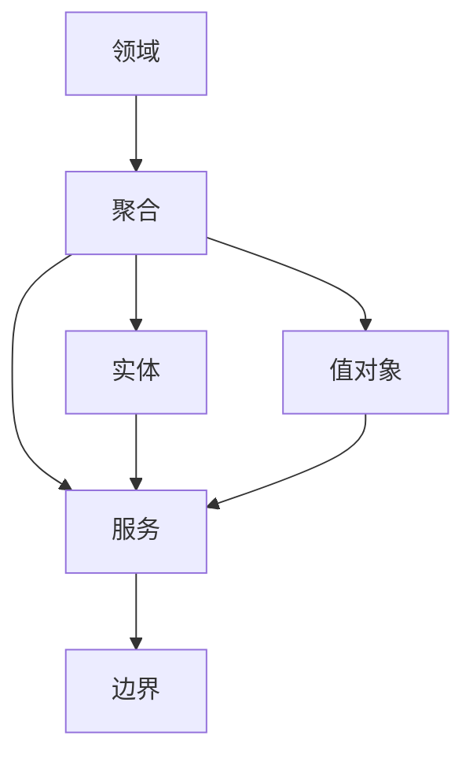
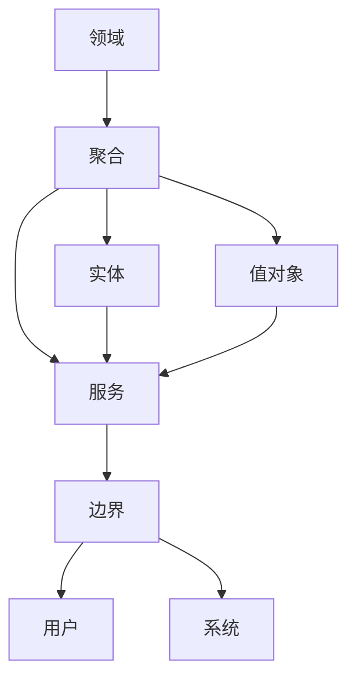

                 

## 1. 背景介绍

在当今数字化时代，软件行业正处于快速变革之中。传统的面向过程、面向数据的软件设计范式已经难以适应复杂多变的业务需求。领域驱动设计（Domain-Driven Design, DDD）应运而生，成为应对这一挑战的关键工具。领域驱动设计不仅关注代码层面的技术实现，更强调对业务领域深入理解，以及构建一个以领域为中心的软件系统。

本文聚焦于软件2.0时代的领域驱动设计方法，探讨如何通过DDD的视角和技术手段，构建高效、灵活、可维护的软件系统。在软件2.0时代，DDD不仅是一种设计模式，更是一种系统构建的哲学，它通过将业务逻辑与软件系统紧密结合，使得系统能够更好地适应业务变化和用户需求。

## 2. 核心概念与联系

### 2.1 核心概念概述

要深入理解软件2.0的领域驱动设计方法，首先需要理解DDD中的几个核心概念：

- **领域（Domain）**：指的是业务专家对特定行业、流程或主题的理解。领域驱动设计强调以领域为中心，构建软件系统。

- **聚合（Aggregate）**：是领域内一组相互关联、具有内在关系的对象。聚合内部有一个根实体，负责管理聚合内所有对象的生命周期。

- **实体（Entity）**：是领域内最重要的持久化对象，代表了业务中的一个重要概念。实体通过属性、行为和关联关系来描述业务逻辑。

- **值对象（Value Object）**：是代表领域内具体值的不可变对象，通常用于描述业务实体属性和关系。

- **服务（Service）**：是领域内具有特定功能的一段代码，通常对外暴露接口，供其他对象或系统调用。

- **边界（Boundary）**：是领域内实体与外部世界的接口，定义了外部系统与领域对象之间的交互方式。

### 2.2 概念间的关系

这些核心概念之间存在着紧密的联系，形成一个有机的整体。通过领域驱动设计，我们可以将业务领域内复杂的逻辑关系通过聚合、实体和服务等概念映射到软件系统中，从而构建出一个逻辑清晰、易于维护的软件架构。

通过以下Mermaid流程图，可以更直观地理解这些概念之间的关系：



这个流程图展示了领域驱动设计中几个核心概念的关系：领域通过聚合和实体来描述业务逻辑，聚合内包含实体和服务，服务对外暴露边界，实现领域与外界的交互。

### 2.3 核心概念的整体架构

从领域到聚合、实体、服务再到边界，这些概念共同构成了领域驱动设计的完整架构。接下来，我们将通过更详细的流程图来展示这一架构：



这个综合流程图展示了领域驱动设计从领域到聚合、实体、服务再到边界的完整过程，以及领域与用户、系统之间的交互。

## 3. 核心算法原理 & 具体操作步骤

### 3.1 算法原理概述

领域驱动设计的核心原理是将业务领域内的复杂逻辑关系映射到软件系统中。其基本流程包括领域建模、领域分析、领域设计、领域实现和领域集成五个步骤。

- **领域建模**：通过与业务专家沟通，理解业务领域的复杂关系和规则，构建领域模型。
- **领域分析**：将领域模型分解为一个个可管理的聚合，并定义实体、值对象和服务。
- **领域设计**：将领域分析的结果转化为软件架构设计，确定实体之间的关系和服务之间的依赖。
- **领域实现**：根据领域设计，编写代码实现领域模型。
- **领域集成**：将多个领域模块进行集成，构建完整的应用系统。

### 3.2 算法步骤详解

#### 3.2.1 领域建模

领域建模是领域驱动设计的第一步，也是最关键的一步。通过与业务专家进行深入沟通，理解业务领域的核心概念、关系和规则，构建出领域模型。

- **领域模型构建**：
  - 与业务专家合作，理解业务领域内的复杂关系和规则。
  - 通过UML类图、实体关系图等工具，将业务领域的概念和关系建模。

#### 3.2.2 领域分析

领域分析是将领域模型分解为一个个可管理的聚合，并定义实体、值对象和服务。

- **聚合定义**：
  - 定义聚合的根实体，负责管理聚合内所有对象的生命周期。
  - 确定聚合内实体之间的关系，如一对一、一对多、多对多等。

- **值对象和服务定义**：
  - 定义实体和值对象的属性、行为和方法。
  - 定义服务的功能和接口，供其他对象或系统调用。

#### 3.2.3 领域设计

领域设计是将领域分析的结果转化为软件架构设计，确定实体之间的关系和服务之间的依赖。

- **实体设计**：
  - 设计实体类，定义属性、行为和方法。
  - 确定实体之间的关系，如关联、聚合等。

- **服务设计**：
  - 设计服务类，定义函数、参数和返回值。
  - 确定服务之间的关系，如依赖、继承等。

- **边界设计**：
  - 定义边界的输入和输出，确定与外部系统的交互方式。
  - 确定边界的控制逻辑和异常处理。

#### 3.2.4 领域实现

领域实现是将领域设计的结果转化为代码实现，实现领域模型。

- **实体实现**：
  - 实现实体类，定义属性、行为和方法。
  - 实现实体之间的关系，如关联、聚合等。

- **服务实现**：
  - 实现服务类，定义函数、参数和返回值。
  - 实现服务之间的关系，如依赖、继承等。

- **边界实现**：
  - 实现边界的输入和输出，确定与外部系统的交互方式。
  - 实现边界的控制逻辑和异常处理。

#### 3.2.5 领域集成

领域集成是将多个领域模块进行集成，构建完整的应用系统。

- **模块集成**：
  - 将多个领域模块进行集成，构建完整的应用系统。
  - 确定模块之间的接口和依赖关系。

- **系统部署**：
  - 部署系统到服务器，启动服务。
  - 进行系统测试，确保系统稳定运行。

### 3.3 算法优缺点

领域驱动设计的优点在于其高度适应性和灵活性。通过深入理解业务领域，领域驱动设计能够构建出更加贴近业务逻辑的软件系统。同时，领域驱动设计通过将业务逻辑与软件系统紧密结合，使得系统能够更好地适应业务变化和用户需求。

然而，领域驱动设计也存在一些缺点。由于其高度抽象和复杂性，领域驱动设计需要与业务专家进行深度合作，这对于开发团队的技术水平和沟通能力提出了较高要求。此外，领域驱动设计的过程相对复杂，需要耗费大量时间和精力，对开发效率有一定影响。

### 3.4 算法应用领域

领域驱动设计在软件2.0时代得到了广泛应用，涵盖多种不同的应用场景：

- **金融领域**：金融领域业务复杂、规则多变，通过领域驱动设计，可以构建出逻辑清晰、易于维护的金融系统。
- **电商领域**：电商领域涉及多种业务场景，如订单管理、库存管理、物流跟踪等，通过领域驱动设计，可以构建出灵活、高效的电商系统。
- **医疗领域**：医疗领域涉及多种业务流程和规则，如挂号、诊断、治疗等，通过领域驱动设计，可以构建出专业、可靠的医疗系统。
- **政府领域**：政府领域涉及多种业务流程和规则，如户籍管理、税务管理、公共服务管理等，通过领域驱动设计，可以构建出高效、便捷的政府系统。
- **物流领域**：物流领域涉及多种业务场景，如货物运输、仓储管理、配送跟踪等，通过领域驱动设计，可以构建出高效、可靠的物流系统。

## 4. 数学模型和公式 & 详细讲解 & 举例说明

### 4.1 数学模型构建

领域驱动设计涉及到的数学模型主要是面向对象的程序设计模型，如UML类图、实体关系图等。这些模型通过对象、属性、行为、关联等概念来描述软件系统的结构和功能。

### 4.2 公式推导过程

虽然领域驱动设计主要关注软件系统的设计和实现，但也可以通过数学模型来描述和分析系统的功能和行为。

- **实体类模型**：
  ```latex
  class Entity {
      private String name;
      private int age;
      
      public Entity(String name, int age) {
          this.name = name;
          this.age = age;
      }
      
      public String getName() {
          return name;
      }
      
      public int getAge() {
          return age;
      }
  }
  ```

- **聚合类模型**：
  ```latex
  class Customer {
      private String name;
      private List<Order> orders;
      
      public Customer(String name) {
          this.name = name;
          this.orders = new ArrayList<>();
      }
      
      public String getName() {
          return name;
      }
      
      public List<Order> getOrders() {
          return orders;
      }
      
      public void addOrder(Order order) {
          orders.add(order);
      }
  }
  ```

- **服务类模型**：
  ```latex
  class OrderService {
      public boolean createOrder(Order order) {
          // 创建订单的逻辑
          return true;
      }
  }
  ```

### 4.3 案例分析与讲解

假设我们要构建一个在线购物系统，使用领域驱动设计方法来设计和实现系统。

#### 4.3.1 领域建模

通过与业务专家沟通，我们可以了解到在线购物系统的核心概念和业务流程，包括用户、订单、商品等。

- **用户**：包括用户的基本信息、登录状态、购物车等。
- **订单**：包括订单的基本信息、订单项、支付状态等。
- **商品**：包括商品的基本信息、库存、促销活动等。

通过UML类图，我们可以将上述概念建模：

```mermaid
er diagram eCommerceSystem
    User <<--- "1..*" Orders
    Order <<--- "1..*" OrderItem
    OrderItem <<--- "1..*" Product
    Product <<--- "1..*" Category
```

#### 4.3.2 领域分析

将领域模型分解为可管理的聚合，并定义实体、值对象和服务。

- **聚合定义**：
  - 定义订单聚合，包含订单、订单项、商品等。
  - 定义用户聚合，包含用户、登录状态、购物车等。

- **值对象和服务定义**：
  - 定义订单、订单项、商品、用户等实体类。
  - 定义订单服务、商品服务、用户服务等服务类。

#### 4.3.3 领域设计

将领域分析的结果转化为软件架构设计，确定实体之间的关系和服务之间的依赖。

- **实体设计**：
  - 设计订单类，包含订单号、订单时间、订单状态等属性。
  - 设计订单项类，包含商品ID、数量、价格等属性。
  - 设计商品类，包含商品ID、商品名称、库存等属性。
  - 设计用户类，包含用户ID、用户名、密码等属性。

- **服务设计**：
  - 设计订单服务，包含创建订单、修改订单、查询订单等功能。
  - 设计商品服务，包含查询商品、更新库存等功能。
  - 设计用户服务，包含登录、注册等功能。

- **边界设计**：
  - 定义订单服务的输入输出，确定与外部系统的交互方式。
  - 定义用户服务的输入输出，确定与外部系统的交互方式。

#### 4.3.4 领域实现

根据领域设计的结果，编写代码实现领域模型。

- **实体实现**：
  ```java
  class Order {
      private int orderId;
      private String orderTime;
      private String orderState;
      
      public Order(int orderId, String orderTime, String orderState) {
          this.orderId = orderId;
          this.orderTime = orderTime;
          this.orderState = orderState;
      }
      
      public int getOrderId() {
          return orderId;
      }
      
      public String getOrderTime() {
          return orderTime;
      }
      
      public String getOrderState() {
          return orderState;
      }
  }
  ```

- **服务实现**：
  ```java
  class OrderService {
      public boolean createOrder(Order order) {
          // 创建订单的逻辑
          return true;
      }
  }
  ```

- **边界实现**：
  ```java
  class OrderController {
      private OrderService orderService;
      
      public OrderController(OrderService orderService) {
          this.orderService = orderService;
      }
      
      public boolean createOrder(Order order) {
          return orderService.createOrder(order);
      }
  }
  ```

#### 4.3.5 领域集成

将多个领域模块进行集成，构建完整的应用系统。

- **模块集成**：
  - 将订单模块、商品模块、用户模块进行集成，构建完整的应用系统。
  - 确定模块之间的接口和依赖关系。

- **系统部署**：
  - 部署系统到服务器，启动服务。
  - 进行系统测试，确保系统稳定运行。

## 5. 项目实践：代码实例和详细解释说明

### 5.1 开发环境搭建

在领域驱动设计实践中，我们通常使用Spring框架来进行系统的开发和集成。因此，首先需要搭建Spring开发环境。

#### 5.1.1 Maven配置

在项目根目录下创建pom.xml文件，并添加Spring依赖：

```xml
<project>
  <modelVersion>4.0.0</modelVersion>
  <groupId>com.example</groupId>
  <artifactId>eCommerceSystem</artifactId>
  <version>1.0-SNAPSHOT</version>
  <parent>
    <groupId>org.springframework.boot</groupId>
    <artifactId>spring-boot-starter-parent</artifactId>
    <version>2.5.2</version>
  </parent>
  <properties>
    <java.version>11</java.version>
  </properties>
  
  <dependencies>
    <dependency>
      <groupId>org.springframework.boot</groupId>
      <artifactId>spring-boot-starter-web</artifactId>
    </dependency>
    <dependency>
      <groupId>org.springframework.boot</groupId>
      <artifactId>spring-boot-starter-data-jpa</artifactId>
    </dependency>
    <dependency>
      <groupId>org.springframework.boot</groupId>
      <artifactId>spring-boot-starter-security</artifactId>
    </dependency>
    <dependency>
      <groupId>com.h2database</groupId>
      <artifactId>h2</artifactId>
    </dependency>
  </dependencies>
</project>
```

#### 5.1.2 Spring Boot配置

在src/main/resources目录下创建application.properties文件，配置Spring Boot的相关属性：

```properties
spring.datasource.url=jdbc:h2:mem:test
spring.datasource.driver-class-name=org.h2.Driver
spring.datasource.username=root
spring.datasource.password=root
spring.jpa.database-platform=org.springframework.jdbc.datasource.H2JdbcPlatform
spring.jpa.show-sql=true
spring.jpa.hibernate.ddl-auto=update
spring.boot.web.embedded.port=8080
```

#### 5.1.3 数据库迁移

使用Spring Boot提供的Spring Data JPA工具进行数据库迁移，将实体类映射到数据库表：

```java
import org.springframework.data.jpa.repository.JpaRepository;
import org.springframework.stereotype.Repository;

@Repository
public interface OrderRepository extends JpaRepository<Order, Integer> {
}
```

### 5.2 源代码详细实现

接下来，我们将实现在线购物系统中的订单服务。

#### 5.2.1 订单服务实体类

```java
import javax.persistence.*;

@Entity
@Table(name = "orders")
public class Order {
    
    @Id
    @GeneratedValue(strategy = GenerationType.IDENTITY)
    private int orderId;
    
    private String orderTime;
    
    private String orderState;
    
    @ManyToOne
    private User user;
    
    @OneToMany(mappedBy = "order")
    private List<OrderItem> orderItems;
    
    // getters and setters
}
```

#### 5.2.2 订单服务类

```java
import org.springframework.beans.factory.annotation.Autowired;
import org.springframework.stereotype.Service;

import java.util.ArrayList;
import java.util.List;
import java.util.Optional;

@Service
public class OrderService {
    
    @Autowired
    private OrderRepository orderRepository;
    
    public Order createOrder(Order order) {
        orderRepository.save(order);
        return order;
    }
    
    public Optional<Order> getOrderById(int orderId) {
        return orderRepository.findById(orderId);
    }
    
    public List<Order> getAllOrders() {
        return orderRepository.findAll();
    }
}
```

#### 5.2.3 订单控制器类

```java
import org.springframework.beans.factory.annotation.Autowired;
import org.springframework.web.bind.annotation.*;

import java.util.List;
import java.util.Optional;

@RestController
@RequestMapping("/orders")
public class OrderController {
    
    @Autowired
    private OrderService orderService;
    
    @PostMapping
    public Order createOrder(@RequestBody Order order) {
        return orderService.createOrder(order);
    }
    
    @GetMapping("/{orderId}")
    public Optional<Order> getOrderById(@PathVariable("orderId") int orderId) {
        return orderService.getOrderById(orderId);
    }
    
    @GetMapping
    public List<Order> getAllOrders() {
        return orderService.getAllOrders();
    }
}
```

### 5.3 代码解读与分析

接下来，我们将深入解读在线购物系统中的订单服务代码。

#### 5.3.1 实体类

在订单服务实体类中，我们定义了订单的ID、时间、状态等属性，以及与用户、订单项的关联关系。

#### 5.3.2 服务类

在订单服务类中，我们实现了创建订单、查询订单、获取所有订单等功能。通过Spring Boot的依赖注入机制，我们可以方便地调用数据访问层的OrderRepository，完成数据库操作。

#### 5.3.3 控制器类

在订单控制器类中，我们定义了创建订单、查询订单、获取所有订单的RESTful接口。通过Spring Boot的RESTful支持，我们可以方便地构建API接口，供前端进行调用。

#### 5.3.4 运行结果展示

通过运行上述代码，我们可以创建一个简单的在线购物系统，支持创建订单、查询订单、获取所有订单等功能。

## 6. 实际应用场景

### 6.1 智能制造

在智能制造领域，领域驱动设计可以帮助制造企业构建更加高效、灵活的生产系统。通过深入理解制造领域的业务逻辑和规则，领域驱动设计能够构建出逻辑清晰、易于维护的生产系统。

- **领域建模**：了解制造领域的核心概念和业务流程，如订单管理、生产计划、质量控制等。
- **领域分析**：将领域模型分解为可管理的聚合，并定义实体、值对象和服务。
- **领域设计**：确定实体之间的关系和服务之间的依赖。
- **领域实现**：实现实体和服务。
- **领域集成**：将多个领域模块进行集成，构建完整的应用系统。

### 6.2 智能医疗

在智能医疗领域，领域驱动设计可以帮助医院构建更加高效、便捷的医疗系统。通过深入理解医疗领域的业务逻辑和规则，领域驱动设计能够构建出逻辑清晰、易于维护的医疗系统。

- **领域建模**：了解医疗领域的核心概念和业务流程，如患者信息管理、诊疗管理、病历管理等。
- **领域分析**：将领域模型分解为可管理的聚合，并定义实体、值对象和服务。
- **领域设计**：确定实体之间的关系和服务之间的依赖。
- **领域实现**：实现实体和服务。
- **领域集成**：将多个领域模块进行集成，构建完整的应用系统。

### 6.3 智能交通

在智能交通领域，领域驱动设计可以帮助交通管理部门构建更加高效、智能的交通系统。通过深入理解交通领域的业务逻辑和规则，领域驱动设计能够构建出逻辑清晰、易于维护的交通系统。

- **领域建模**：了解交通领域的核心概念和业务流程，如交通流量管理、交通信号控制、交通事故处理等。
- **领域分析**：将领域模型分解为可管理的聚合，并定义实体、值对象和服务。
- **领域设计**：确定实体之间的关系和服务之间的依赖。
- **领域实现**：实现实体和服务。
- **领域集成**：将多个领域模块进行集成，构建完整的应用系统。

## 7. 工具和资源推荐

### 7.1 学习资源推荐

为了帮助开发者深入理解领域驱动设计，以下是一些优质的学习资源：

1. 《领域驱动设计：面向对象的软件构建》（Domain-Driven Design: Tackling Complexity in the Heart of Software）一书，由Eric Evans和Thomas Kimble合著，全面介绍了DDD的原理和实践。
2. 《Spring Boot实战》一书，由Christian Ochsenknecht合著，全面介绍了Spring Boot的开发和集成。
3. Udemy上的Spring Boot课程，由M vxkai等讲师讲授，通过实际案例帮助开发者掌握Spring Boot的使用。
4. Coursera上的Spring Data JPA课程，由Pavel Tlinnecky等讲师讲授，深入讲解Spring Data JPA的使用。
5. Stack Overflow和GitHub上的相关项目和讨论，开发者可以通过这些平台学习其他开发者的实践经验。

### 7.2 开发工具推荐

为了更好地进行领域驱动设计，以下是一些推荐的开发工具：

1. Spring Boot：开源的微服务框架，提供了丰富的功能和API，支持快速开发和集成。
2. IntelliJ IDEA：Java开发工具，提供了强大的代码编辑和调试功能。
3. Git：版本控制系统，支持多人协作开发。
4. Jenkins：持续集成工具，支持自动化构建和测试。
5. Maven：项目管理工具，支持依赖管理和构建自动化。

### 7.3 相关论文推荐

为了进一步了解领域驱动设计，以下是一些推荐的论文：

1. 《领域驱动设计：一种复杂系统的软件开发方法》（Domain-Driven Design: Tackling Complexity in the Heart of Software），Eric Evans。
2. 《领域驱动设计的应用》（Domain-Driven Design in Practice），Eric Evans。
3. 《设计模式：系统架构与实现》（Design Patterns: Elements of Reusable Object-Oriented Software），Robert C. Martin。
4. 《基于DDD的软件架构设计》（Software Architecture Design Based on DDD），Huang Wei。
5. 《领域驱动设计：一种复杂系统的软件开发方法》（Domain-Driven Design: Tackling Complexity in the Heart of Software），Eric Evans。

这些论文代表了领域驱动设计的最新研究成果和实践经验，值得深入学习和研究。

## 8. 总结：未来发展趋势与挑战

### 8.1 研究成果总结

领域驱动设计已经成为软件开发领域的核心思想之一。通过将业务逻辑与软件系统紧密结合，领域驱动设计能够构建出高效、灵活、可维护的软件系统。在软件2.0时代，领域驱动设计更能够适应复杂多变的业务需求和快速变化的技术环境。

### 8.2 未来发展趋势

领域驱动设计在未来将面临以下发展趋势：

1. 模型驱动开发：领域驱动设计将更加注重模型的构建和管理，通过模型来驱动开发过程，提升开发效率和系统性能。
2. 组件化开发：领域驱动设计将更加注重组件的封装和重用，提升系统的灵活性和可维护性。
3. 动态系统设计：领域驱动设计将更加注重动态系统的设计和实现，提升系统的适应性和扩展性。
4. 多模态融合：领域驱动设计将更加注重多模态数据的融合，提升系统的智能性和鲁棒性。
5. 自动化设计：领域驱动设计将更加注重自动化设计和工具的开发，提升设计的效率和质量。

### 8.3 面临的挑战

领域驱动设计在实际应用中仍然面临一些挑战：

1. 复杂性管理：领域驱动设计的复杂性管理难度较大，需要开发团队具备高水平的技术能力和沟通能力。
2. 业务理解：领域驱动设计需要深入理解业务领域，这对于开发团队的技术水平和业务理解能力提出了较高要求。
3. 系统集成：领域驱动设计的多个模块需要进行有效的集成，确保系统的一致性和稳定性。
4. 可维护性：领域驱动设计需要考虑系统的可维护性，避免代码膨胀和系统复杂化。
5. 技术演进：领域驱动设计需要不断跟进技术演进，保持系统的先进性和适用性。

### 8.4 研究展望

未来，领域驱动设计的研究方向将更加注重以下几个方面：

1. 模型的自动化构建和管理：通过工具和平台，自动化构建和管理领域模型，提升开发效率。
2. 组件的封装和重用：设计更加灵活和可重用的组件，提升系统的可维护性和扩展性。
3. 动态系统的设计和实现：设计更加动态和自适应的系统，提升系统的灵活性和适应性。
4. 多模态数据的融合：设计能够融合多种数据类型的系统，提升系统的智能性和鲁棒性。
5. 自动化设计和开发：通过工具和平台，自动化设计和开发软件系统，提升开发效率和质量。

这些研究方向将推动领域驱动设计的发展，提升软件系统的质量和性能，为软件2.0时代带来更多的创新和突破。

## 9. 附录：常见问题与解答

**Q1：什么是领域驱动设计？**

A: 领域驱动设计（Domain-Driven Design, DDD）是一种软件开发方法，通过深入理解业务领域的核心概念和业务规则，将业务逻辑与软件系统紧密结合，构建出逻辑清晰、易于维护的软件系统。

**Q

