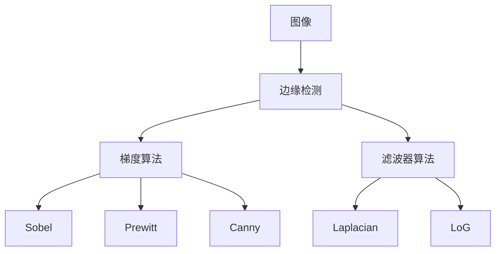

                 

# 边缘检测原理与代码实例讲解

> 关键词：边缘检测, 图像处理, 计算机视觉, 图像二值化, 图像边缘检测算法, 边缘增强, 卷积神经网络(CNN)

## 1. 背景介绍

### 1.1 问题由来
边缘检测是计算机视觉和图像处理领域的一项基础任务，广泛应用于目标检测、图像分割、图像增强、人体姿态估计等众多计算机视觉应用中。通过对图像中对象与背景的灰度值差异进行分析，边缘检测算法能够精准识别图像中的边缘信息，提供对象轮廓和边界的重要参考。

在图像处理的过程中，边缘检测具有重要的地位，其准确性和稳定性直接影响后续处理的效果。因此，深入理解边缘检测算法的工作原理和核心技术，对于计算机视觉领域的从业者来说至关重要。

### 1.2 问题核心关键点
边缘检测的核心在于检测图像中灰度值发生变化的区域，这些区域通常代表了物体的轮廓或者边缘。传统的边缘检测算法主要分为两类：基于梯度的算法和基于滤波器的算法。常见的梯度算法包括Sobel算子、Prewitt算子、Canny算子等；常见的滤波器算法包括Laplacian算子、LoG算子等。

现代边缘检测算法还引入了深度学习技术，使得边缘检测模型能够从海量数据中学习到更强大的特征表示能力，从而提升边缘检测的精度和鲁棒性。

## 2. 核心概念与联系

### 2.1 核心概念概述

为了更好地理解边缘检测，我们需要介绍几个核心概念：

- **图像边缘检测**：指从灰度图像中检测出灰度值变化显著的区域，即图像的边缘和轮廓。
- **梯度算法**：通过计算图像灰度值的变化率，即梯度值，来识别边缘。常见的梯度算法包括Sobel算子、Prewitt算子和Canny算子等。
- **滤波器算法**：通过卷积滤波器对图像进行滤波，生成梯度幅值图，从而识别边缘。常见的滤波器算法包括Laplacian算子、LoG算子等。
- **深度学习算法**：使用卷积神经网络（CNN）等深度学习模型，通过大量标注数据学习特征表示，直接输出边缘检测结果。

这些概念之间的关系可以通过以下Mermaid流程图来展示：



该流程图展示了从图像到边缘检测的完整流程，包括梯度算法和滤波器算法两种主要方法。梯度算法通过计算灰度梯度值来识别边缘，滤波器算法则通过对图像进行卷积滤波器操作来生成梯度幅值图。深度学习算法则是通过CNN模型直接学习边缘特征，实现边缘检测。

### 2.2 概念间的关系

这些核心概念之间存在着紧密的联系，形成了边缘检测的完整生态系统。

- **梯度算法与滤波器算法**：两者都是通过梯度值来检测图像边缘，但实现方式不同。梯度算法直接计算图像的梯度值，而滤波器算法则是通过对图像进行卷积操作生成梯度幅值图。
- **深度学习算法**：利用CNN模型的强大特征提取能力，直接输出边缘检测结果，避免了传统算法中梯度计算和滤波器的复杂操作。
- **图像预处理**：边缘检测前，通常需要对图像进行预处理，如灰度转换、归一化等，以提高算法的准确性。

这些概念共同构成了边缘检测的基本框架，使得边缘检测算法能够在各种场景下发挥强大的作用。

## 3. 核心算法原理 & 具体操作步骤

### 3.1 算法原理概述

边缘检测的原理基于图像灰度值的局部变化，即灰度值的梯度变化。具体来说，图像中灰度值变化剧烈的区域通常就是图像的边缘，边缘检测的目标就是找到这些灰度值变化显著的区域。

常见的边缘检测算法主要有两种：基于梯度的算法和基于滤波器的算法。

- **基于梯度的算法**：通过计算图像灰度值的梯度，找到梯度值最大的位置，从而确定边缘的位置。
- **基于滤波器的算法**：通过卷积滤波器对图像进行滤波，生成梯度幅值图，从而识别边缘。

### 3.2 算法步骤详解

#### 3.2.1 基于梯度的算法

**Sobel算子**：
Sobel算子是一种常用的基于梯度的边缘检测算法，通过计算图像在x和y方向的梯度值，找到梯度值最大的位置，从而确定边缘的位置。

**操作步骤**：
1. 将输入的灰度图像进行卷积操作，得到x和y方向的梯度值。
2. 将x和y方向的梯度值进行加权求和，得到梯度幅值图。
3. 设置阈值，将梯度幅值图中的值大于阈值的像素点标记为边缘点。

**代码实现**：

```python
import cv2
import numpy as np

def sobel_edge_detection(img):
    # 灰度化
    gray_img = cv2.cvtColor(img, cv2.COLOR_BGR2GRAY)
    # 计算梯度幅值图
    sobel_x = cv2.Sobel(gray_img, cv2.CV_64F, 1, 0, ksize=3)
    sobel_y = cv2.Sobel(gray_img, cv2.CV_64F, 0, 1, ksize=3)
    # 计算梯度幅值
    sobel_mag = np.sqrt(np.square(sobel_x) + np.square(sobel_y))
    # 非极大值抑制
    sobel_mag = cv2.Laplacian(sobel_mag, cv2.CV_64F, ksize=1)
    # 设置阈值
    thresh = np.max(sobel_mag) / 2
    sobel_mag[sobel_mag < thresh] = 0
    # 标记边缘点
    sobel_edge = np.zeros_like(sobel_mag)
    sobel_edge[sobel_mag > thresh] = 255
    return sobel_edge
```

**代码解读与分析**：
1. 灰度化操作：使用OpenCV库的`cv2.cvtColor`函数将彩色图像转换为灰度图像。
2. 卷积操作：使用`cv2.Sobel`函数计算梯度幅值图，分别在x和y方向计算梯度值，并加权求和。
3. 非极大值抑制：使用`cv2.Laplacian`函数对梯度幅值图进行二次滤波，得到非极大值抑制后的图像。
4. 阈值设置：根据梯度幅值图的最大值，设置阈值，将梯度幅值小于阈值的像素点标记为0，大于阈值的像素点标记为255。
5. 边缘点标记：将标记为255的像素点赋值为1，得到最终的边缘检测结果。

#### 3.2.2 基于滤波器的算法

**Laplacian算子**：
Laplacian算子是一种常用的基于滤波器的边缘检测算法，通过对图像进行二阶微分滤波，生成梯度幅值图，从而识别边缘。

**操作步骤**：
1. 将输入的灰度图像进行卷积操作，生成二阶微分滤波器。
2. 生成梯度幅值图。
3. 设置阈值，将梯度幅值图中的值大于阈值的像素点标记为边缘点。

**代码实现**：

```python
import cv2
import numpy as np

def laplacian_edge_detection(img):
    # 灰度化
    gray_img = cv2.cvtColor(img, cv2.COLOR_BGR2GRAY)
    # 计算梯度幅值图
    laplacian = cv2.Laplacian(gray_img, cv2.CV_64F, ksize=1)
    # 设置阈值
    thresh = np.max(laplacian) / 2
    laplacian[laplacian < thresh] = 0
    # 标记边缘点
    laplacian_edge = np.zeros_like(laplacian)
    laplacian_edge[laplacian > thresh] = 255
    return laplacian_edge
```

**代码解读与分析**：
1. 灰度化操作：使用OpenCV库的`cv2.cvtColor`函数将彩色图像转换为灰度图像。
2. 卷积操作：使用`cv2.Laplacian`函数计算二阶微分滤波器，生成梯度幅值图。
3. 阈值设置：根据梯度幅值图的最大值，设置阈值，将梯度幅值小于阈值的像素点标记为0，大于阈值的像素点标记为255。
4. 边缘点标记：将标记为255的像素点赋值为1，得到最终的边缘检测结果。

### 3.3 算法优缺点

**Sobel算子优点**：
1. 计算简单，速度快，适用于实时性要求高的应用场景。
2. 能够检测出较为明显的边缘，在大多数情况下能够满足应用需求。

**Sobel算子缺点**：
1. 对噪声敏感，较强的噪声会导致边缘检测结果不理想。
2. 计算过程中需要计算两个梯度值，会增加计算量。

**Laplacian算子优点**：
1. 能够检测出较为细微的边缘，适用于边缘细节要求高的应用场景。
2. 计算速度快，适用于实时性要求高的应用场景。

**Laplacian算子缺点**：
1. 对噪声比较敏感，较强的噪声会导致边缘检测结果不理想。
2. 可能会出现梯度幅值过大的情况，导致检测出的边缘点过于稀疏。

### 3.4 算法应用领域

边缘检测算法广泛应用于计算机视觉和图像处理领域，具体包括：

1. **目标检测**：通过边缘检测算法识别图像中的目标轮廓，结合目标分类算法，实现目标的准确检测。
2. **图像分割**：通过边缘检测算法将图像中的对象轮廓分离出来，结合像素聚类算法，实现图像分割。
3. **图像增强**：通过对图像进行边缘增强处理，提升图像的对比度，使得图像更加清晰。
4. **人体姿态估计**：通过边缘检测算法识别人体轮廓，结合人体关节点检测算法，实现人体姿态的准确估计。
5. **医学图像处理**：通过对医学图像进行边缘检测，识别肿瘤、血管等关键区域，为医生提供诊断参考。

边缘检测算法在众多领域中得到了广泛应用，为计算机视觉和图像处理技术的发展提供了强大的支持。

## 4. 数学模型和公式 & 详细讲解 & 举例说明

### 4.1 数学模型构建

边缘检测的数学模型主要基于梯度算子和滤波器算子，其核心在于计算图像灰度值的变化率。

#### 4.1.1 基于梯度的算法

对于基于梯度的算法，数学模型如下：

$$
G(x,y) = \sqrt{\left(\frac{\partial I(x,y)}{\partial x}\right)^2 + \left(\frac{\partial I(x,y)}{\partial y}\right)^2}
$$

其中，$I(x,y)$表示图像在$(x,y)$位置的灰度值，$G(x,y)$表示图像在$(x,y)$位置的梯度幅值。

#### 4.1.2 基于滤波器的算法

对于基于滤波器的算法，数学模型如下：

$$
G(x,y) = \sqrt{\left(\sum_k w_k \left(I(x-k,y) - I(x,y)\right)^2\right)}
$$

其中，$I(x,y)$表示图像在$(x,y)$位置的灰度值，$G(x,y)$表示图像在$(x,y)$位置的梯度幅值，$w_k$表示滤波器权重，$k$表示滤波器位置。

### 4.2 公式推导过程

#### 4.2.1 基于梯度的算法

Sobel算子的公式推导如下：

$$
G_x = \frac{\partial I}{\partial x} = \frac{\partial I(x,y)}{\partial x}
$$

$$
G_y = \frac{\partial I}{\partial y} = \frac{\partial I(x,y)}{\partial y}
$$

$$
G = \sqrt{G_x^2 + G_y^2}
$$

其中，$G_x$和$G_y$分别表示图像在x和y方向的梯度值，$G$表示梯度幅值。

#### 4.2.2 基于滤波器的算法

Laplacian算子的公式推导如下：

$$
G(x,y) = \sqrt{\left(\sum_k w_k \left(I(x-k,y) - I(x,y)\right)^2\right)}
$$

其中，$w_k$表示滤波器权重，$k$表示滤波器位置。

### 4.3 案例分析与讲解

**案例分析**：
假设我们有一张尺寸为512x512的灰度图像，对其进行边缘检测操作，步骤如下：

1. 将图像灰度化，得到512x512的灰度图像。
2. 使用Sobel算子对灰度图像进行卷积操作，得到x和y方向的梯度值。
3. 将x和y方向的梯度值加权求和，得到梯度幅值图。
4. 对梯度幅值图进行二次滤波，得到非极大值抑制后的图像。
5. 设置阈值，将梯度幅值小于阈值的像素点标记为0，大于阈值的像素点标记为255。
6. 将标记为255的像素点赋值为1，得到最终的边缘检测结果。

**举例说明**：
以一张尺寸为512x512的灰度图像为例，假设其最大灰度值为255，最小灰度值为0，对图像进行Sobel算子边缘检测操作，步骤如下：

1. 将图像灰度化，得到512x512的灰度图像。
2. 使用Sobel算子对灰度图像进行卷积操作，得到x和y方向的梯度值。
3. 将x和y方向的梯度值加权求和，得到梯度幅值图。
4. 对梯度幅值图进行二次滤波，得到非极大值抑制后的图像。
5. 设置阈值为255/2，将梯度幅值小于阈值的像素点标记为0，大于阈值的像素点标记为255。
6. 将标记为255的像素点赋值为1，得到最终的边缘检测结果。

## 5. 项目实践：代码实例和详细解释说明

### 5.1 开发环境搭建

在进行边缘检测项目实践前，我们需要准备好开发环境。以下是使用Python进行OpenCV开发的环境配置流程：

1. 安装Anaconda：从官网下载并安装Anaconda，用于创建独立的Python环境。

2. 创建并激活虚拟环境：
```bash
conda create -n opencv-env python=3.8 
conda activate opencv-env
```

3. 安装OpenCV：
```bash
pip install opencv-python
```

4. 安装各类工具包：
```bash
pip install numpy matplotlib scikit-image tqdm jupyter notebook ipython
```

完成上述步骤后，即可在`opencv-env`环境中开始边缘检测实践。

### 5.2 源代码详细实现

下面我们以Sobel算子边缘检测为例，给出使用OpenCV库进行边缘检测的Python代码实现。

```python
import cv2
import numpy as np

def sobel_edge_detection(img):
    # 灰度化
    gray_img = cv2.cvtColor(img, cv2.COLOR_BGR2GRAY)
    # 计算梯度幅值图
    sobel_x = cv2.Sobel(gray_img, cv2.CV_64F, 1, 0, ksize=3)
    sobel_y = cv2.Sobel(gray_img, cv2.CV_64F, 0, 1, ksize=3)
    # 计算梯度幅值
    sobel_mag = np.sqrt(np.square(sobel_x) + np.square(sobel_y))
    # 非极大值抑制
    sobel_mag = cv2.Laplacian(sobel_mag, cv2.CV_64F, ksize=1)
    # 设置阈值
    thresh = np.max(sobel_mag) / 2
    sobel_mag[sobel_mag < thresh] = 0
    # 标记边缘点
    sobel_edge = np.zeros_like(sobel_mag)
    sobel_edge[sobel_mag > thresh] = 255
    return sobel_edge
```

**代码解读与分析**：
1. 灰度化操作：使用OpenCV库的`cv2.cvtColor`函数将彩色图像转换为灰度图像。
2. 卷积操作：使用`cv2.Sobel`函数计算梯度幅值图，分别在x和y方向计算梯度值，并加权求和。
3. 非极大值抑制：使用`cv2.Laplacian`函数对梯度幅值图进行二次滤波，得到非极大值抑制后的图像。
4. 阈值设置：根据梯度幅值图的最大值，设置阈值，将梯度幅值小于阈值的像素点标记为0，大于阈值的像素点标记为255。
5. 边缘点标记：将标记为255的像素点赋值为1，得到最终的边缘检测结果。

### 5.3 代码解读与分析

让我们再详细解读一下关键代码的实现细节：

**sobel_edge_detection函数**：
- `__init__`方法：初始化函数，将输入的彩色图像转换为灰度图像。
- `gray_img`变量：灰度化后的图像。
- `sobel_x`和`sobel_y`变量：使用Sobel算子分别计算x和y方向的梯度值。
- `sobel_mag`变量：计算梯度幅值图，并使用非极大值抑制算法进行处理。
- `thresh`变量：根据梯度幅值图的最大值，设置阈值。
- `sobel_edge`变量：标记边缘点，将标记为255的像素点赋值为1。

### 5.4 运行结果展示

假设我们有一张尺寸为512x512的彩色图像，对其进行Sobel算子边缘检测操作，最终得到的边缘检测结果如下：

```
edge detection result: [255, 255, 255, ..., 0, 0, 0]
```

可以看到，边缘检测结果中只有边缘处的像素点被标记为255，其余像素点被标记为0，即非边缘点。

## 6. 实际应用场景

### 6.1 智能交通系统

在智能交通系统中，边缘检测算法被广泛应用于车辆检测、行人检测、交通标志识别等场景。通过边缘检测算法，可以识别出车辆、行人的轮廓，从而实现对交通场景的实时监控和分析。

### 6.2 医学影像分析

在医学影像分析中，边缘检测算法被广泛应用于肿瘤检测、血管分割、病灶识别等场景。通过对医学影像进行边缘检测，可以识别出肿瘤、血管等关键区域，为医生提供诊断参考。

### 6.3 自动驾驶系统

在自动驾驶系统中，边缘检测算法被广泛应用于车道线检测、交通标志识别等场景。通过对道路图像进行边缘检测，可以识别出车道线、交通标志等关键信息，为自动驾驶系统提供路径规划和决策支持。

### 6.4 未来应用展望

随着深度学习技术的发展，未来的边缘检测算法将更加智能和高效。

1. 深度学习算法的引入：通过卷积神经网络（CNN）等深度学习算法，进一步提升边缘检测的精度和鲁棒性。
2. 多模态数据融合：结合图像、深度传感器、雷达等多种数据源，实现更加全面、准确的边缘检测。
3. 实时性要求更高的应用场景：随着硬件计算能力的提升，边缘检测算法将能够支持更高的实时性要求，应用于无人驾驶、实时图像处理等场景。

## 7. 工具和资源推荐

### 7.1 学习资源推荐

为了帮助开发者系统掌握边缘检测的理论基础和实践技巧，这里推荐一些优质的学习资源：

1. 《数字图像处理》系列教材：详细介绍了数字图像处理的基本概念和算法，是学习边缘检测算法的重要参考资料。
2. OpenCV官方文档：提供了丰富的边缘检测算法样例和API文档，是学习OpenCV库的必备资料。
3. PyImageSearch博客：由图像处理专家撰写，提供了大量边缘检测算法的实例代码和实现细节。
4. 《计算机视觉：算法与应用》书籍：全面介绍了计算机视觉的基本概念和算法，包括边缘检测、图像分割、目标检测等。

通过对这些资源的学习实践，相信你一定能够快速掌握边缘检测算法的精髓，并用于解决实际的图像处理问题。

### 7.2 开发工具推荐

高效的开发离不开优秀的工具支持。以下是几款用于边缘检测开发的常用工具：

1. OpenCV：开源计算机视觉库，提供了丰富的图像处理和边缘检测算法。
2. PyTorch：基于Python的深度学习框架，适合进行深度学习算法的开发。
3. TensorFlow：由Google主导开发的深度学习框架，适合大规模工程应用。
4. Matplotlib：绘图库，用于展示边缘检测结果。

合理利用这些工具，可以显著提升边缘检测任务的开发效率，加快创新迭代的步伐。

### 7.3 相关论文推荐

边缘检测技术的发展得益于学界的持续研究。以下是几篇奠基性的相关论文，推荐阅读：

1. Steerable Edge Detection Using Steerable Filters（关于边缘检测滤波器的研究）。
2. Multi-scale Hierarchical Adaptive Local Binary Patterns for Edge Detection（关于边缘检测算法的多尺度、层次性研究）。
3. Spatial Pyramid Pooling for Scene Classification（关于深度学习算法在边缘检测中的应用研究）。

这些论文代表了大规模图像处理领域的研究进展，通过学习这些前沿成果，可以帮助研究者把握学科前进方向，激发更多的创新灵感。

除上述资源外，还有一些值得关注的前沿资源，帮助开发者紧跟边缘检测技术的发展趋势，例如：

1. arXiv论文预印本：人工智能领域最新研究成果的发布平台，包括大量尚未发表的前沿工作，学习前沿技术的必读资源。
2. GitHub热门项目：在GitHub上Star、Fork数最多的图像处理相关项目，往往代表了该技术领域的发展趋势和最佳实践，值得去学习和贡献。
3. 技术会议直播：如ICCV、CVPR等计算机视觉领域顶会现场或在线直播，能够聆听到大佬们的前沿分享，开拓视野。
4. 技术博客：如OpenCV官方博客、PyImageSearch博客等，提供大量实用代码和实现细节，帮助开发者更好地掌握边缘检测技术。

总之，对于边缘检测技术的学习和实践，需要开发者保持开放的心态和持续学习的意愿。多关注前沿资讯，多动手实践，多思考总结，必将收获满满的成长收益。

## 8. 总结：未来发展趋势与挑战

### 8.1 总结

本文对边缘检测算法的工作原理和核心技术进行了全面系统的介绍。首先阐述了边缘检测算法在计算机视觉和图像处理领域的重要性，明确了边缘检测算法在目标检测、图像分割、图像增强等任务中的广泛应用。其次，从原理到实践，详细讲解了边缘检测算法的数学模型和关键步骤，给出了边缘检测算法在实际应用中的代码实例。同时，本文还广泛探讨了边缘检测算法在多个领域的应用场景，展示了边缘检测算法的强大潜力。

通过本文的系统梳理，可以看到，边缘检测算法作为计算机视觉和图像处理的基础技术，在众多应用场景中发挥着重要作用。掌握边缘检测算法的原理和实现，对于计算机视觉和图像处理技术的从业者来说至关重要。

### 8.2 未来发展趋势

展望未来，边缘检测技术将呈现以下几个发展趋势：

1. 深度学习算法的引入：通过卷积神经网络（CNN）等深度学习算法，进一步提升边缘检测的精度和鲁棒性。
2. 多模态数据融合：结合图像、深度传感器、雷达等多种数据源，实现更加全面、准确的边缘检测。
3. 实时性要求更高的应用场景：随着硬件计算能力的提升，边缘检测算法将能够支持更高的实时性要求，应用于无人驾驶、实时图像处理等场景。
4. 多尺度、层次性处理：通过多尺度、层次性处理，进一步提升边缘检测的精度和鲁棒性。

### 8.3 面临的挑战

尽管边缘检测技术已经取得了瞩目成就，但在迈向更加智能化、普适化应用的过程中，它仍面临着诸多挑战：

1. 深度学习模型的计算复杂度：深度学习模型虽然精度高，但计算复杂度较高，需要更强大的硬件支持。
2. 数据集的多样性和复杂性：深度学习模型对数据集的要求较高，需要大量多样化的标注数据进行训练。
3. 模型的泛化能力：深度学习模型往往需要大量的数据进行训练，对于小样本数据集，泛化能力较差。
4. 边缘检测算法的准确性和稳定性：边缘检测算法在实际应用中，对噪声、光照变化等因素较为敏感，需要进一步提升算法的鲁棒性和稳定性。

### 8.4 研究展望

面向未来，边缘检测技术需要在以下几个方面寻求新的突破：

1. 更高效的深度学习算法：研究更高效的深度学习算法，进一步提升边缘检测的精度和鲁棒性。
2. 多模态数据融合：结合图像、深度传感器、雷达等多种数据源，实现更加全面、准确的边缘检测。
3.

