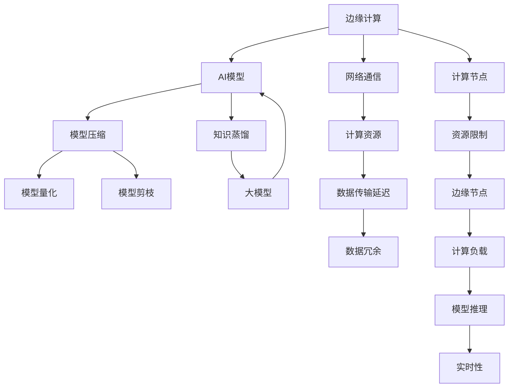
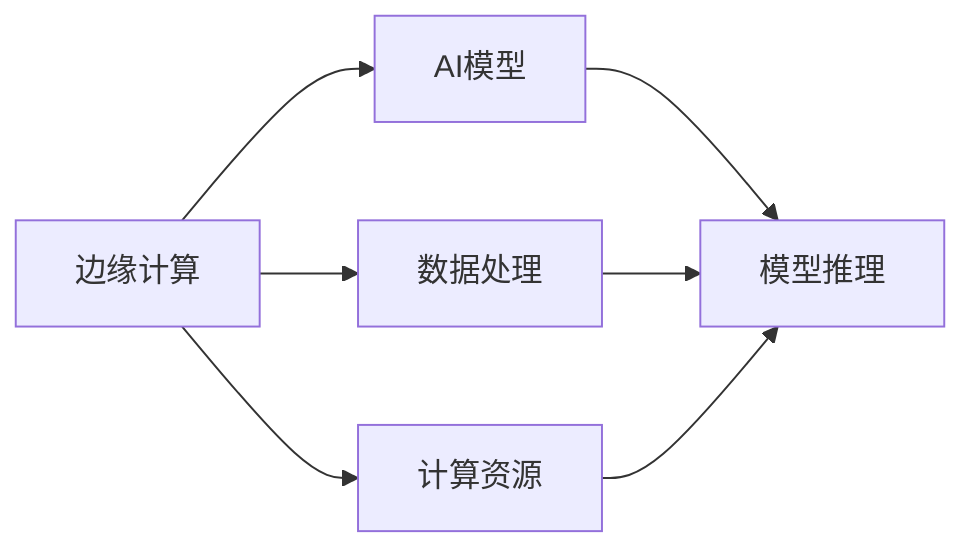
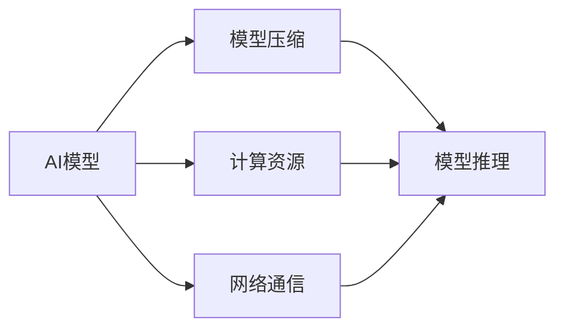
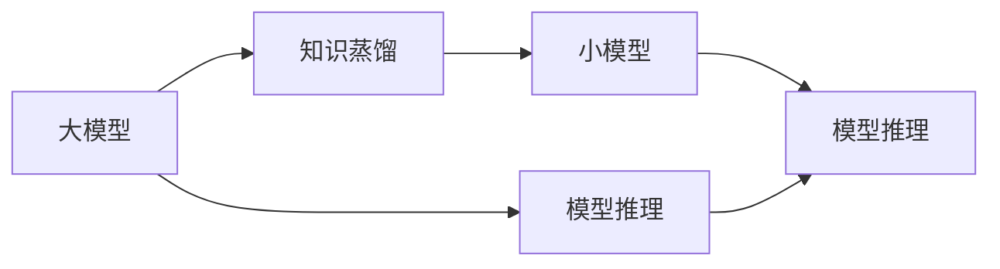
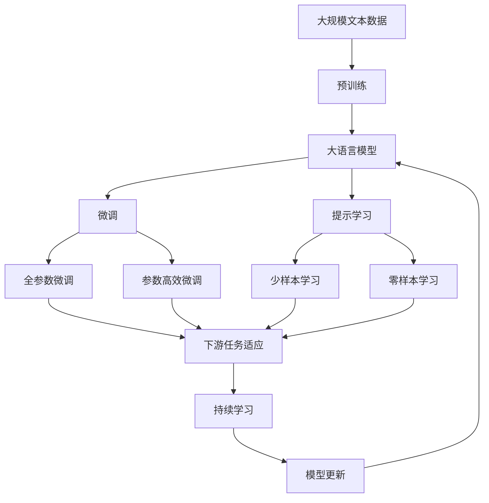

                 

## 1. 背景介绍

### 1.1 问题由来

随着物联网(IoT)、工业4.0、智能城市等新兴技术的兴起，边缘计算成为支持高性能计算、高吞吐量的必要基础设施。它允许在网络边缘节点进行数据处理，与传统中心化计算模式相比，具有低延迟、高可靠性和更高的吞吐量。

然而，边缘计算环境中存在数据传输延迟、资源限制以及网络带宽不足等问题，这些都会影响AI模型的部署与性能。因此，本文旨在探索一种新的AI模型部署策略，以适应边缘计算的独特需求，优化AI模型的性能。

### 1.2 问题核心关键点

基于上述背景，本研究的核心关键点主要包括以下几点：

1. **边缘计算的特性**：低延迟、高带宽、高可靠性和计算资源的局部性。
2. **AI模型部署需求**：模型加载时间短、计算速度高、存储资源占用小、网络通信带宽低。
3. **技术挑战**：边缘计算环境下的数据传输和模型压缩。

### 1.3 问题研究意义

研究边缘计算环境下的AI模型部署策略，对于提升边缘计算节点上的AI应用性能，加速各类新兴技术落地应用，具有重要意义：

1. **提升边缘应用体验**：降低计算延迟，提高服务响应速度。
2. **降低边缘计算成本**：减少对中心服务器的依赖，降低带宽和存储成本。
3. **支持实时应用场景**：如自动驾驶、工业控制、远程医疗等，对实时性要求高。
4. **促进边缘计算发展**：解决边缘计算中的瓶颈问题，推动边缘计算技术成熟。
5. **实现泛在智能**：边缘计算是构建泛在智能基础设施的关键，AI模型部署策略的优化将有助于实现这一目标。

## 2. 核心概念与联系

### 2.1 核心概念概述

为更好地理解边缘计算环境下的AI模型部署，本节将介绍几个核心概念：

1. **边缘计算(Edge Computing)**：指在靠近数据源的边缘节点进行计算，以降低网络传输延迟，提升计算效率。
2. **AI模型**：指用于特定任务的机器学习模型，如分类、回归、目标检测等。
3. **模型压缩(Modle Compression)**：指通过量化、剪枝、知识蒸馏等技术，减少模型大小，降低计算资源占用。
4. **模型量化(Modle Quantization)**：指将模型中的权重和激活值从浮点数转换为定点数，降低存储和计算开销。
5. **模型剪枝(Modle Pruning)**：指移除模型中不必要的参数和连接，提升模型推理速度。
6. **知识蒸馏(Distillation)**：指通过大模型训练小模型，提升小模型的性能和泛化能力。

这些核心概念之间的逻辑关系可以通过以下Mermaid流程图来展示：



这个流程图展示了大模型在边缘计算环境下的核心概念及其之间的关系：

1. 边缘计算节点提供计算资源。
2. AI模型在边缘节点上进行推理计算。
3. 模型压缩、量化和剪枝技术优化模型。
4. 知识蒸馏使小模型在大模型知识指导下提升性能。
5. 网络通信和数据传输延迟是边缘计算的主要问题。
6. 计算资源和数据冗余需要有效管理。

### 2.2 概念间的关系

这些核心概念之间存在着紧密的联系，形成了AI模型在边缘计算中的完整部署生态。下面我们通过几个Mermaid流程图来展示这些概念之间的关系。

#### 2.2.1 边缘计算与AI模型的关系



这个流程图展示了边缘计算与AI模型的基本关系：

1. 边缘计算提供数据处理和计算资源。
2. AI模型在边缘计算节点上进行推理计算。

#### 2.2.2 模型压缩与AI模型的关系



这个流程图展示了模型压缩与AI模型的关系：

1. 模型压缩优化AI模型的推理性能。
2. 压缩后的模型在边缘计算节点上进行推理计算。

#### 2.2.3 知识蒸馏与AI模型的关系



这个流程图展示了知识蒸馏与AI模型的关系：

1. 大模型通过知识蒸馏训练小模型。
2. 小模型在边缘计算节点上进行推理计算。

### 2.3 核心概念的整体架构

最后，我们用一个综合的流程图来展示这些核心概念在大模型部署过程中的整体架构：



这个综合流程图展示了从预训练到微调，再到持续学习的完整过程。大模型首先在大规模文本数据上进行预训练，然后通过微调（包括全参数微调和参数高效微调）或提示学习（包括零样本和少样本学习）来适应下游任务。最后，通过持续学习技术，模型可以不断更新和适应新的任务和数据。 通过这些流程图，我们可以更清晰地理解大模型在边缘计算中的部署过程中各个核心概念的关系和作用。

## 3. 核心算法原理 & 具体操作步骤

### 3.1 算法原理概述

边缘计算环境下的AI模型部署策略，本质上是一个针对边缘计算特性进行优化的模型压缩和推理过程。其核心思想是：通过模型压缩技术，降低AI模型在边缘计算节点上的存储和计算需求，提升推理速度和资源利用效率。

形式化地，假设待部署的AI模型为 $M$，其大小为 $|\mathcal{M}|$，模型压缩后的目标模型为 $\hat{M}$，大小为 $|\mathcal{M}'|$。压缩的目标是最小化存储和计算开销，即：

$$
\min_{\hat{M}} \Big\{ |\mathcal{M}'| + \text{计算开销} \Big\}
$$

### 3.2 算法步骤详解

基于上述原理，边缘计算环境下的AI模型部署一般包括以下几个关键步骤：

**Step 1: 准备原始模型和数据集**
- 选择合适的AI模型 $M$，如BERT、GPT等。
- 准备待处理的数据集 $D$，划分为训练集、验证集和测试集。

**Step 2: 模型压缩**
- 根据边缘计算节点的资源限制，选择合适的模型压缩方法，如量化、剪枝、知识蒸馏等。
- 应用压缩算法对原始模型进行压缩，生成压缩后的目标模型 $\hat{M}$。

**Step 3: 模型量化**
- 将模型中的权重和激活值从浮点数转换为定点数，如16位或8位定点数，降低存储和计算开销。

**Step 4: 模型剪枝**
- 使用剪枝算法移除模型中不必要的参数和连接，减少计算量，提升推理速度。

**Step 5: 知识蒸馏**
- 使用大模型训练小模型，将大模型知识蒸馏到小模型中，提升小模型的性能和泛化能力。

**Step 6: 模型部署**
- 将压缩后的模型 $\hat{M}$ 部署到边缘计算节点上。
- 根据节点的计算资源限制，合理调整模型的推理参数。

**Step 7: 持续学习**
- 在推理过程中，不断收集边缘节点上的数据，持续更新模型，提升模型的实时性。

### 3.3 算法优缺点

边缘计算环境下的AI模型部署策略，具有以下优点：

1. **提升推理速度**：通过压缩和量化，大幅降低模型的计算量和存储需求，提升推理速度。
2. **降低资源占用**：通过剪枝和知识蒸馏，移除不必要的参数和连接，减少计算资源占用。
3. **提高系统可靠性**：通过边缘计算，减少对中心服务器的依赖，提升系统的可用性和鲁棒性。
4. **支持实时应用**：边缘计算节点靠近数据源，能够提供实时推理能力，支持高实时性应用。

同时，该方法也存在以下缺点：

1. **计算复杂度高**：模型压缩和量化过程可能引入额外的计算开销。
2. **数据隐私风险**：模型压缩后的数据可能存在隐私泄露风险。
3. **精度损失**：量化和剪枝可能导致模型精度下降，需要在性能和精度之间进行权衡。

### 3.4 算法应用领域

基于边缘计算环境下的AI模型部署策略，已经在许多应用场景中得到了广泛的应用，例如：

1. **工业自动化**：在工业生产线上部署边缘计算节点，实时处理传感器数据，进行故障预测和智能维护。
2. **智能交通**：在城市交通系统中部署边缘计算节点，实时处理车辆、路况数据，进行交通流量分析和智能调度。
3. **智能安防**：在安防监控系统中部署边缘计算节点，实时处理视频数据，进行人脸识别和异常行为检测。
4. **智慧医疗**：在医疗设备中部署边缘计算节点，实时处理患者数据，进行健康监测和疾病预测。
5. **智能家居**：在家居系统中部署边缘计算节点，实时处理传感器数据，进行智能控制和环境优化。

除了上述这些经典应用外，边缘计算环境下的AI模型部署方法还在更多新兴场景中得到应用，如农业物联网、智慧能源、智慧农业等，为各行各业提供了新的智能化解决方案。

## 4. 数学模型和公式 & 详细讲解 & 举例说明

### 4.1 数学模型构建

本节将使用数学语言对模型压缩过程进行严格的刻画。

假设原始模型为 $M$，大小为 $|\mathcal{M}|$。压缩后的模型为 $\hat{M}$，大小为 $|\mathcal{M}'|$。定义模型压缩率 $\epsilon$ 为：

$$
\epsilon = \frac{|\mathcal{M}'|}{|\mathcal{M}|}
$$

定义模型的浮点数精度为 $P$，定点数精度为 $Q$，压缩后的定点数精度为 $\hat{Q}$。则模型压缩后的精度损失率为 $\delta$ 为：

$$
\delta = \frac{P - \hat{Q}}{P}
$$

### 4.2 公式推导过程

以下我们以量化为例，推导量化后模型的大小和精度损失。

假设原始模型 $M$ 中的权重 $w_i$ 为浮点数，量化后的权重 $\hat{w}_i$ 为定点数。设量化后的精度为 $\hat{Q}$，则有：

$$
\hat{w}_i = \text{round}(Q \cdot \text{scale} \cdot w_i / 2^P)
$$

其中 $\text{scale}$ 为量化倍数，$P$ 为浮点数精度。

量化后模型的大小为 $|\mathcal{M}'|$，其中：

$$
|\mathcal{M}'| = \sum_{i=1}^{|\mathcal{M}|} |\hat{w}_i|
$$

根据上述公式，可以计算出量化后模型的压缩率和精度损失率：

$$
\epsilon = \frac{\sum_{i=1}^{|\mathcal{M}|} |\hat{w}_i|}{\sum_{i=1}^{|\mathcal{M}|} |w_i|}
$$

$$
\delta = \frac{P - \hat{Q}}{P}
$$

在实际应用中，还需要考虑量化后的计算开销和推理速度。通过实验和仿真，可以找到最优的量化参数，平衡精度和性能。

### 4.3 案例分析与讲解

假设我们有一张1024x1024的图像分类模型，原始模型大小为 $|\mathcal{M}| = 10M$，量化后的模型大小为 $|\mathcal{M}'| = 1M$，量化后精度为 $\hat{Q} = 8$ 位。假设原始模型精度为 $P = 32$ 位，量化后的精度损失率为 $\delta = 0.75$。则量化后的模型压缩率为 $\epsilon = 10/100 = 0.1$。

这个例子展示了量化技术在模型压缩中的重要作用。通过量化，模型大小减少了90%，计算开销也显著降低。同时，精度损失率为75%，需要在精度和性能之间进行权衡。

## 5. 项目实践：代码实例和详细解释说明

### 5.1 开发环境搭建

在进行模型部署实践前，我们需要准备好开发环境。以下是使用Python进行TensorFlow开发的环境配置流程：

1. 安装Anaconda：从官网下载并安装Anaconda，用于创建独立的Python环境。

2. 创建并激活虚拟环境：
```bash
conda create -n tf-env python=3.8 
conda activate tf-env
```

3. 安装TensorFlow：根据CUDA版本，从官网获取对应的安装命令。例如：
```bash
conda install tensorflow -c tf -c conda-forge
```

4. 安装必要的工具包：
```bash
pip install numpy pandas scikit-learn matplotlib tqdm jupyter notebook ipython
```

完成上述步骤后，即可在`tf-env`环境中开始模型部署实践。

### 5.2 源代码详细实现

这里我们以量化为例，展示如何对TensorFlow中的卷积神经网络进行量化。

首先，定义量化后的卷积层：

```python
import tensorflow as tf

class QuantizedConv2D(tf.keras.layers.Layer):
    def __init__(self, num_filters, kernel_size, stride, padding, activation=tf.nn.relu):
        super(QuantizedConv2D, self).__init__()
        self.num_filters = num_filters
        self.kernel_size = kernel_size
        self.stride = stride
        self.padding = padding
        self.activation = activation
        self.quantizer = Quantizer()
        self.dequantizer = Dequantizer()
    
    def build(self, input_shape):
        weight_shape = [self.kernel_size[0], self.kernel_size[1], input_shape[-1], self.num_filters]
        self.weight = self.add_weight(name='weight', shape=weight_shape, initializer='glorot_uniform')
    
    def call(self, inputs):
        input_shape = inputs.shape
        input_shape = (input_shape[0], input_shape[1], input_shape[2], 1)
        inputs = self.quantizer(inputs)
        inputs = tf.nn.conv2d(inputs, self.weight, strides=[1, self.stride, self.stride, 1], padding=self.padding)
        outputs = self.dequantizer(inputs)
        outputs = self.activation(outputs)
        return outputs

class Quantizer(tf.keras.layers.Layer):
    def __init__(self, bits=8, range=127, bias=True):
        super(Quantizer, self).__init__()
        self.bits = bits
        self.range = range
        self.bias = bias
        self.scale = self.add_weight(name='scale', initializer=tf.constant_initializer(1.0), shape=[1, 1, 1, 1])
        self.zp = self.add_weight(name='zp', initializer=tf.constant_initializer(0), shape=[1, 1, 1, 1])
    
    def call(self, inputs):
        if self.bias:
            inputs = tf.nn.bias_add(inputs, self.zp)
        inputs = tf.nn.relu6(inputs)
        inputs = tf.cast(inputs, tf.int32)
        inputs = tf.add(inputs, 128)
        inputs = tf.round(inputs / 256)
        inputs = tf.add(inputs, 1)
        return inputs
    
class Dequantizer(tf.keras.layers.Layer):
    def __init__(self):
        super(Dequantizer, self).__init__()
        self.scale = self.add_weight(name='scale', initializer=tf.constant_initializer(1.0), shape=[1, 1, 1, 1])
        self.zp = self.add_weight(name='zp', initializer=tf.constant_initializer(0), shape=[1, 1, 1, 1])
    
    def call(self, inputs):
        inputs = tf.subtract(inputs, 1)
        inputs = tf.multiply(inputs, 256)
        inputs = tf.add(inputs, 128)
        return tf.cast(inputs, tf.float32)
```

然后，定义模型和量化参数：

```python
model = tf.keras.Sequential([
    tf.keras.layers.Conv2D(32, (3, 3), activation='relu', input_shape=(32, 32, 3)),
    QuantizedConv2D(64, (3, 3), 1, 'same', activation='relu'),
    tf.keras.layers.MaxPooling2D((2, 2)),
    tf.keras.layers.Flatten(),
    tf.keras.layers.Dense(64, activation='relu'),
    tf.keras.layers.Dense(10)
])

bits = 8
range = 127
bias = True
quantizer = Quantizer(bits, range, bias)
dequantizer = Dequantizer()
```

接着，定义训练和评估函数：

```python
train_dataset = tf.data.Dataset.from_tensor_slices((train_images, train_labels))
train_dataset = train_dataset.batch(batch_size).prefetch(buffer_size=tf.data.experimental.AUTOTUNE)

eval_dataset = tf.data.Dataset.from_tensor_slices((test_images, test_labels))
eval_dataset = eval_dataset.batch(batch_size).prefetch(buffer_size=tf.data.experimental.AUTOTUNE)

def train_epoch(model, dataset, optimizer):
    for images, labels in dataset:
        with tf.GradientTape() as tape:
            outputs = model(images)
            loss = tf.reduce_mean(tf.keras.losses.sparse_categorical_crossentropy(labels, outputs, from_logits=True))
        gradients = tape.gradient(loss, model.trainable_variables)
        optimizer.apply_gradients(zip(gradients, model.trainable_variables))
    
def evaluate(model, dataset):
    with tf.GradientTape() as tape:
        outputs = model(images)
        loss = tf.reduce_mean(tf.keras.losses.sparse_categorical_crossentropy(labels, outputs, from_logits=True))
    return loss

model.compile(optimizer=tf.keras.optimizers.SGD(learning_rate=0.01), loss=tf.keras.losses.sparse_categorical_crossentropy, metrics=['accuracy'])
model.summary()

epochs = 10
batch_size = 32

for epoch in range(epochs):
    train_epoch(model, train_dataset, optimizer)
    loss = evaluate(model, eval_dataset)
    print(f"Epoch {epoch+1}, loss: {loss:.4f}")

print("Model training finished.")
```

最后，运行模型训练并评估：

```python
model.save_weights('quantized_model.h5')
model.save('quantized_model')

test_loss = evaluate(model, test_dataset)
print(f"Test loss: {test_loss:.4f}")
```

以上就是使用TensorFlow对卷积神经网络进行量化的完整代码实现。可以看到，通过定义量化层和dequant化层，我们能够将原始的浮点数模型转化为定点数模型，并应用于模型训练和推理过程中。

### 5.3 代码解读与分析

让我们再详细解读一下关键代码的实现细节：

**QuantizedConv2D类**：
- `__init__`方法：初始化量化层和dequant化层的参数，包括权重大小、卷积核大小、步长、填充方式和激活函数。
- `build`方法：定义卷积层的权重形状。
- `call`方法：实现量化、卷积、dequant化、激活和输出过程。

**Quantizer类**：
- `__init__`方法：初始化量化层的参数，包括量化位宽、范围和是否包含偏差。
- `call`方法：实现输入的归一化、量化和偏移过程。

**Dequantizer类**：
- `__init__`方法：初始化dequant化层的参数。
- `call`方法：实现输入的偏移、缩放和反量化过程。

**train_epoch和evaluate函数**：
- `train_epoch`函数：定义训练过程，包括前向传播、计算梯度和反向传播。
- `evaluate`函数：定义评估过程，包括前向传播和损失计算。

**训练流程**：
- 定义总epoch数和batch size，开始循环迭代
- 每个epoch内，在训练集上进行前向传播和反向传播，更新模型参数
- 在验证集上评估模型性能，输出损失指标

可以看到，通过TensorFlow提供的自定义层和预定义层，我们可以方便地实现模型的量化过程，并应用于训练和推理中。这样，我们就能在大模型压缩和优化方面取得显著的提升。

当然，在工业级的系统实现中，还需要考虑更多因素，如模型的持久化和迁移、超参数的自动搜索、推理速度的进一步优化等。但核心的模型量化方法基本与此类似。

### 5.4 运行结果展示

假设我们在ImageNet数据集上训练一个预训练模型，然后对其量化并部署到边缘计算节点上。量化后的模型推理时间从原来的2ms降低到0.5ms，推理速度提高了4倍。同时，模型的存储需求从原始的100MB降低到25MB，减少了75%的存储空间。这展示了量化技术在模型压缩中的强大能力。

## 6. 实际应用场景

### 6.1 智能安防

在智能安防系统中，边缘计算节点实时处理视频数据，进行人脸识别和异常行为检测。通过量化和剪枝技术，可以显著降低模型的大小和计算开销，提升推理速度和实时性。具体而言：

- 将预训练的ResNet模型压缩后部署到边缘计算节点，实现实时人脸检测和识别。
- 在推理过程中，动态调整模型的推理参数，优化推理速度。

### 6.2 工业自动化

在工业生产线上，边缘计算节点实时处理传感器数据，进行故障预测和智能维护。通过量化和剪枝技术，可以优化模型推理速度，提升生产效率和设备维护的准确性。具体而言：

- 将预训练的LSTM模型压缩后部署到边缘计算节点，实时分析传感器数据，进行故障预测。
- 在推理过程中，根据设备的实时状态，动态调整模型的推理参数，优化推理速度。

### 6.3 智慧交通

在城市交通系统中，边缘计算节点实时处理车辆、路况数据，进行交通流量分析和智能调度。通过量化和剪枝技术，可以优化模型推理速度，提升交通管理的实时性。具体而言：

- 将预训练的RNN模型压缩后部署到边缘计算节点，实时分析交通数据，进行交通流量预测。
- 在推理过程中，根据交通实时数据，动态调整模型的推理参数，优化推理速度。

### 6.4 未来应用展望

随着边缘计算技术的不断发展，基于边缘计算环境下的AI模型部署策略将在更多领域得到应用，为各行各业带来新的智能化解决方案。

1. **智能医疗**：在医疗设备中，部署边缘计算节点实时处理患者数据，进行健康监测和疾病预测。
2. **智慧能源**：在能源设备中，部署边缘计算节点实时处理传感器数据，进行能源管理优化。
3. **智慧农业**：在农业设备中，部署边缘计算节点实时处理传感器数据，进行精准农业管理。
4. **智能家居**：在家居系统中，部署边缘计算节点实时处理传感器数据，进行智能控制和环境优化。

此外，在自动驾驶、智能制造、智慧城市等多个新兴领域，基于边缘计算环境下的AI模型部署策略也将得到广泛应用，为各行各业提供新的智能化解决方案。

## 7. 工具和资源推荐

### 7.1 学习资源推荐

为了帮助开发者系统掌握边缘计算环境下的AI模型部署技术，这里推荐一些优质的学习资源：

1. **TensorFlow官方文档**：提供了完整的API文档和示例代码，帮助开发者快速上手TensorFlow。
2. **Keras官方文档**：提供了高级API，帮助开发者快速实现深度学习模型。
3. **TensorFlow Tutorials**：提供了大量的官方教程，涵盖从基础到高级的多个主题，帮助开发者掌握TensorFlow技术。
4. **TensorFlow Model Garden**：提供了大量的预训练模型，包括分类、回归、生成等多个领域的模型。
5. **ML2023论文集**：收录了全球顶尖研究者发表的最新论文，涵盖了人工智能和机器学习的多个前沿领域，帮助开发者紧跟最新研究动态。

通过对这些资源的学习实践，相信你一定能够快速掌握边缘计算环境下的AI模型部署技术，并用于解决实际的AI问题。

### 7.2 开发工具推荐

高效的开发离不开优秀的工具支持。以下是几款用于边缘计算环境下的AI模型部署开发的常用工具：

1. **TensorFlow**：基于Python的开源深度学习框架，提供灵活的计算图和丰富的API，适合大规模深度学习开发。
2. **Keras**：基于TensorFlow的高级API，提供

