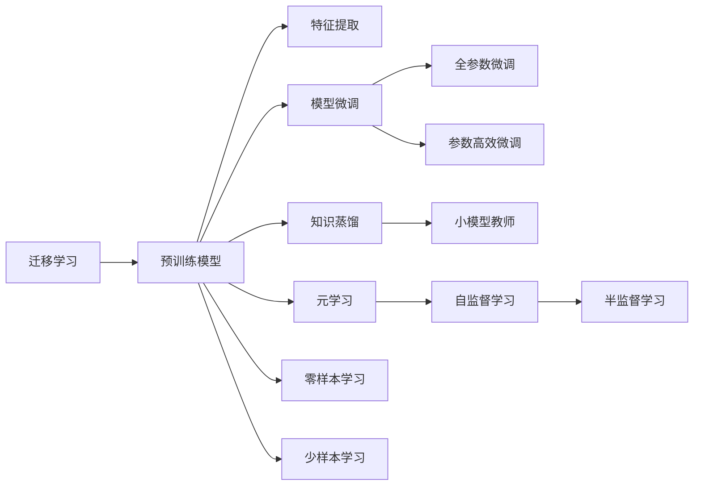
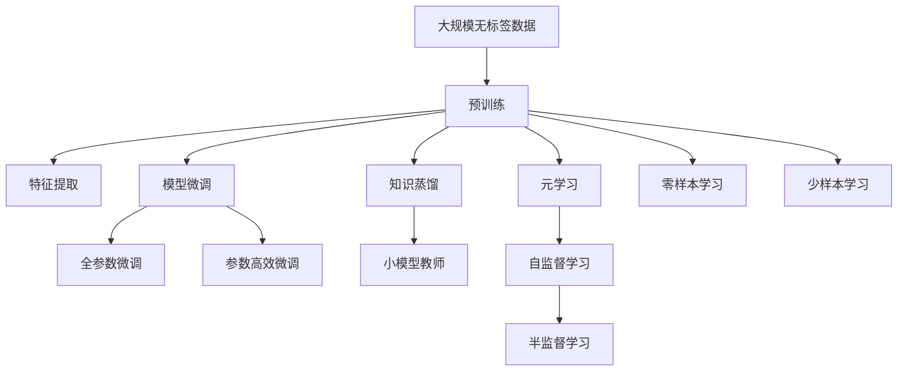

                 

# 迁移学习：站在软件2.0巨人的肩膀上

## 1. 背景介绍

### 1.1 问题由来
随着人工智能技术的迅猛发展，迁移学习（Transfer Learning）在各个领域的应用越来越广泛。迁移学习是一种在已有模型基础上，利用领域知识进行新任务学习的方法。通过迁移学习，可以显著减少新任务所需的学习数据和训练时间，提高模型在新领域上的泛化能力，从而提升模型性能。

迁移学习的应用场景包括但不限于以下几个方面：
- 在目标任务数据稀缺的情况下，利用迁移学习从已有模型中提取特征，进行新任务的训练。
- 在模型需要适应新场景时，通过迁移学习更新已有模型参数，提高在新场景上的性能。
- 在模型需要跨领域学习时，通过迁移学习在不同领域间迁移知识，实现通用领域知识的应用。

### 1.2 问题核心关键点
迁移学习的核心思想是通过已有模型的知识，提升新模型在目标任务上的性能。迁移学习的关键点包括：
- 源任务和目标任务的相似性评估：评估已有模型在新任务上的适用性。
- 知识迁移的方式和策略：选择合适的迁移方式（如参数微调、特征提取、知识蒸馏等）。
- 迁移后的模型优化：针对新任务进行微调或重训练，以进一步提升模型性能。

## 2. 核心概念与联系

### 2.1 核心概念概述

为更好地理解迁移学习的原理和应用，本节将介绍几个关键概念：

- 迁移学习（Transfer Learning）：利用已有模型在新任务上的性能提升，以更少的学习成本快速达到新任务的理想效果。

- 预训练模型（Pretrained Models）：在大量无标签数据上预训练的通用模型，通常用于迁移学习的基础。

- 特征提取（Feature Extraction）：将源模型的抽象特征用于新任务训练，只训练新任务的分类器或回归器，避免重新学习源任务的复杂特征。

- 模型微调（Fine-tuning）：在新任务数据上，通过有监督学习的方式，调整已有模型的部分或全部参数，使其适应新任务。

- 知识蒸馏（Knowledge Distillation）：将大模型的小模型作为教师模型，通过知识蒸馏的方式，将大模型的知识转移到小模型，提升小模型的性能。

- 元学习（Meta-Learning）：一种通过少量训练样本快速适应新任务的学习方法，能够自动调整学习策略，提升模型在新任务上的性能。

- 零样本学习（Zero-shot Learning）：无需任何标注数据，仅通过目标任务的描述和语言提示，模型能够直接输出结果。

- 少样本学习（Few-shot Learning）：在少量标注数据下，模型能够快速适应新任务。

- 自监督学习（Self-Supervised Learning）：通过无监督学习的方式，在大量无标签数据上进行特征学习，为迁移学习提供有效的特征表示。

- 半监督学习（Semi-supervised Learning）：在少量标注数据和大量未标注数据的基础上，通过迁移学习提高模型性能。

这些核心概念共同构成了迁移学习的研究框架，使得模型能够在已有知识的基础上，快速适应新任务，提高模型的泛化能力和应用范围。

### 2.2 概念间的关系

这些核心概念之间的关系可以通过以下Mermaid流程图来展示：



这个流程图展示了迁移学习过程中各个关键概念之间的关系：

1. 迁移学习以预训练模型为基础，通过特征提取、模型微调和知识蒸馏等技术，实现领域知识的迁移。
2. 特征提取用于在新任务上利用已有模型提取特征，避免重新学习复杂特征。
3. 模型微调通过有监督学习的方式，调整已有模型的参数，以适应新任务。
4. 知识蒸馏将大模型的知识转移到小模型，提升小模型的性能。
5. 元学习通过自动调整学习策略，快速适应新任务。
6. 零样本学习通过任务描述和语言提示，直接输出结果，无需标注数据。
7. 少样本学习在少量标注数据下，快速适应新任务。
8. 自监督学习通过无监督学习的方式，提取特征，为迁移学习提供基础。
9. 半监督学习在少量标注数据和大量未标注数据的基础上，提高模型性能。

这些概念之间的关系构成了迁移学习的研究框架，使得模型能够在已有知识的基础上，快速适应新任务，提高模型的泛化能力和应用范围。

### 2.3 核心概念的整体架构

最后，我们用一个综合的流程图来展示这些核心概念在大规模迁移学习中的整体架构：



这个综合流程图展示了从预训练到迁移学习，再到零样本、少样本学习的完整过程。预训练模型首先在大规模无标签数据上进行特征学习，然后通过特征提取、模型微调和知识蒸馏等技术，实现领域知识的迁移。特征提取用于在新任务上利用已有模型提取特征，避免重新学习复杂特征。模型微调通过有监督学习的方式，调整已有模型的参数，以适应新任务。知识蒸馏将大模型的知识转移到小模型，提升小模型的性能。元学习通过自动调整学习策略，快速适应新任务。零样本学习通过任务描述和语言提示，直接输出结果，无需标注数据。少样本学习在少量标注数据下，快速适应新任务。自监督学习通过无监督学习的方式，提取特征，为迁移学习提供基础。半监督学习在少量标注数据和大量未标注数据的基础上，提高模型性能。

## 3. 核心算法原理 & 具体操作步骤
### 3.1 算法原理概述

迁移学习基于已有模型的知识，通过有监督学习的方式，在新任务上进行训练，提高模型在新任务上的性能。迁移学习的核心在于选择合适的迁移方式，以充分利用已有模型的知识。常见的迁移方式包括：

- 特征提取（Feature Extraction）：将源模型的抽象特征用于新任务训练，只训练新任务的分类器或回归器。
- 模型微调（Fine-tuning）：在新任务数据上，通过有监督学习的方式，调整已有模型的部分或全部参数，使其适应新任务。
- 知识蒸馏（Knowledge Distillation）：将大模型的小模型作为教师模型，通过知识蒸馏的方式，将大模型的知识转移到小模型，提升小模型的性能。

这些迁移方式具有各自的优缺点，适用于不同的迁移学习场景。

### 3.2 算法步骤详解

以下详细介绍迁移学习的主要步骤：

**Step 1: 准备预训练模型和数据集**
- 选择合适的预训练模型，如BERT、ResNet等，作为迁移学习的基础。
- 收集目标任务的数据集，划分为训练集、验证集和测试集。

**Step 2: 特征提取**
- 将预训练模型作为特征提取器，将输入数据转换为固定长度的特征向量。
- 使用预训练模型的嵌入层将输入转换为固定长度的向量表示。
- 根据需要，使用预训练模型的某些层作为特征提取器，避免使用全连接层。

**Step 3: 模型微调**
- 将预训练模型的最后一层或部分层作为新任务的分类器或回归器。
- 在目标任务数据上，使用有监督学习的方式，调整预训练模型的参数，以适应新任务。
- 设置合适的学习率和优化器，避免破坏预训练模型的参数。

**Step 4: 知识蒸馏**
- 选择一个大模型作为教师模型，使用其在新任务上的预测作为训练目标。
- 使用一个小模型作为学生模型，通过知识蒸馏的方式，学习教师模型的知识。
- 在目标任务数据上，使用教师模型和学生模型的预测作为训练目标，调整学生模型的参数。

**Step 5: 模型评估和优化**
- 在验证集上评估模型的性能，根据需要调整模型参数和超参数。
- 在测试集上评估模型的最终性能，对比迁移学习前后的性能提升。

### 3.3 算法优缺点

迁移学习具有以下优点：
- 减少新任务所需的学习数据和训练时间，提高模型泛化能力。
- 利用已有模型的知识，提高模型在新任务上的性能。
- 适用于数据稀缺、计算资源有限的场景。

同时，迁移学习也存在以下缺点：
- 预训练模型的适用性有限，需要在源任务和目标任务之间进行评估。
- 特征提取和模型微调可能导致模型复杂度增加，影响推理速度和内存占用。
- 知识蒸馏可能导致小模型的性能提升有限，增加训练复杂度。

### 3.4 算法应用领域

迁移学习已经在多个领域得到了广泛应用，包括但不限于以下几个方面：

- 图像识别：利用在大规模图像数据上预训练的模型，在新图像数据上微调，提高识别精度。
- 自然语言处理：利用在大规模文本数据上预训练的模型，在新文本数据上进行微调，提高理解能力。
- 语音识别：利用在大规模语音数据上预训练的模型，在新语音数据上微调，提高识别准确度。
- 视频分析：利用在大规模视频数据上预训练的模型，在新视频数据上微调，提高分析能力。
- 医疗诊断：利用在大规模医疗数据上预训练的模型，在新医疗数据上微调，提高诊断准确度。

除了这些常见的应用场景外，迁移学习还被应用于金融、推荐系统、智能制造等领域，为各行各业带来了新的技术突破。

## 4. 数学模型和公式 & 详细讲解 & 举例说明

### 4.1 数学模型构建

假设预训练模型为 $M_{\theta}$，其中 $\theta$ 为预训练得到的模型参数。目标任务为 $T$，训练数据集为 $D=\{(x_i,y_i)\}_{i=1}^N$，其中 $x_i$ 为输入样本，$y_i$ 为目标任务标签。

定义目标任务上的损失函数为 $\ell(T,\theta)$，表示模型在新任务上的预测与真实标签之间的差异。在迁移学习中，目标任务上的损失函数通常由预训练模型的损失函数 $\ell_{src}(M_{\theta})$ 和目标任务的损失函数 $\ell_{tgt}(M_{\theta})$ 组成，即：

$$
\ell(T,\theta) = \lambda \ell_{src}(M_{\theta}) + (1-\lambda) \ell_{tgt}(M_{\theta})
$$

其中 $\lambda$ 为迁移因子，控制预训练模型的权重。当 $\lambda=0$ 时，仅使用目标任务的损失函数进行训练，不考虑预训练模型的权重；当 $\lambda=1$ 时，仅使用预训练模型的损失函数进行训练，不考虑目标任务的损失函数。

### 4.2 公式推导过程

在目标任务上，迁移学习的目标是最小化目标任务的损失函数，即：

$$
\min_{\theta} \ell(T,\theta) = \min_{\theta} \left( \lambda \ell_{src}(M_{\theta}) + (1-\lambda) \ell_{tgt}(M_{\theta}) \right)
$$

根据链式法则，目标任务上的梯度更新公式为：

$$
\nabla_{\theta} \ell(T,\theta) = \lambda \nabla_{\theta} \ell_{src}(M_{\theta}) + (1-\lambda) \nabla_{\theta} \ell_{tgt}(M_{\theta})
$$

将梯度更新公式代入优化算法，进行参数更新。在优化过程中，需要设置合适的学习率和优化器，以避免破坏预训练模型的参数。

### 4.3 案例分析与讲解

以图像识别为例，介绍迁移学习的应用。假设在大规模图像数据上预训练了一个卷积神经网络（CNN）模型，将其作为迁移学习的基础。在新图像数据上，利用目标任务的标注数据，对预训练模型进行微调。

**Step 1: 准备预训练模型和数据集**
- 选择合适的预训练CNN模型，如ResNet、Inception等。
- 收集新图像数据的标注数据，划分为训练集、验证集和测试集。

**Step 2: 特征提取**
- 使用预训练模型的嵌入层将输入图像转换为固定长度的向量表示。
- 根据需要，使用预训练模型的某些层作为特征提取器，避免使用全连接层。

**Step 3: 模型微调**
- 将预训练模型的最后一层作为新任务的分类器，使用目标任务的损失函数进行微调。
- 设置合适的学习率和优化器，避免破坏预训练模型的参数。

**Step 4: 模型评估和优化**
- 在验证集上评估模型的性能，根据需要调整模型参数和超参数。
- 在测试集上评估模型的最终性能，对比迁移学习前后的性能提升。

## 5. 项目实践：代码实例和详细解释说明

### 5.1 开发环境搭建

在进行迁移学习实践前，我们需要准备好开发环境。以下是使用Python进行TensorFlow开发的环境配置流程：

1. 安装Anaconda：从官网下载并安装Anaconda，用于创建独立的Python环境。

2. 创建并激活虚拟环境：
```bash
conda create -n tensorflow-env python=3.8 
conda activate tensorflow-env
```

3. 安装TensorFlow：根据CUDA版本，从官网获取对应的安装命令。例如：
```bash
conda install tensorflow=2.7.0 cudatoolkit=11.1 -c pytorch -c conda-forge
```

4. 安装各类工具包：
```bash
pip install numpy pandas scikit-learn matplotlib tqdm jupyter notebook ipython
```

完成上述步骤后，即可在`tensorflow-env`环境中开始迁移学习实践。

### 5.2 源代码详细实现

这里以图像识别任务为例，给出使用TensorFlow进行迁移学习的PyTorch代码实现。

首先，定义迁移学习任务的数据处理函数：

```python
from tensorflow.keras.preprocessing.image import ImageDataGenerator
from tensorflow.keras.applications import ResNet50
from tensorflow.keras.models import Model
from tensorflow.keras.layers import Dense, GlobalAveragePooling2D

class ImageDataLoader:
    def __init__(self, train_dir, val_dir, test_dir, batch_size):
        self.train_datagen = ImageDataGenerator(rescale=1./255)
        self.val_datagen = ImageDataGenerator(rescale=1./255)
        self.test_datagen = ImageDataGenerator(rescale=1./255)
        
        self.train_generator = self.train_datagen.flow_from_directory(
            train_dir, 
            target_size=(224, 224), 
            batch_size=batch_size, 
            class_mode='categorical')
        self.val_generator = self.val_datagen.flow_from_directory(
            val_dir, 
            target_size=(224, 224), 
            batch_size=batch_size, 
            class_mode='categorical')
        self.test_generator = self.test_datagen.flow_from_directory(
            test_dir, 
            target_size=(224, 224), 
            batch_size=batch_size, 
            class_mode='categorical')

    def __len__(self):
        return self.train_generator.n // self.train_generator.batch_size
```

然后，定义迁移学习模型的结构：

```python
def create_model(input_shape, num_classes):
    base_model = ResNet50(include_top=False, weights='imagenet', input_shape=input_shape)
    for layer in base_model.layers:
        layer.trainable = False
    
    x = base_model.output
    x = GlobalAveragePooling2D()(x)
    x = Dense(1024, activation='relu')(x)
    predictions = Dense(num_classes, activation='softmax')(x)
    
    model = Model(inputs=base_model.input, outputs=predictions)
    return model
```

接着，定义迁移学习模型的训练和评估函数：

```python
from tensorflow.keras.optimizers import Adam
from tensorflow.keras.callbacks import EarlyStopping
from sklearn.metrics import classification_report

def train_model(model, train_generator, val_generator, test_generator, num_epochs, batch_size, learning_rate, save_path):
    model.compile(optimizer=Adam(lr=learning_rate), loss='categorical_crossentropy', metrics=['accuracy'])
    
    early_stopping = EarlyStopping(patience=5, restore_best_weights=True)
    
    model.fit(train_generator, 
              steps_per_epoch=len(train_generator), 
              epochs=num_epochs, 
              validation_data=val_generator, 
              validation_steps=len(val_generator), 
              callbacks=[early_stopping])
    
    score = model.evaluate(test_generator, steps=len(test_generator))
    print(f'Test accuracy: {score[1]}')
    
    model.save(save_path)
```

最后，启动迁移学习流程并在测试集上评估：

```python
train_dir = 'train_data/'
val_dir = 'val_data/'
test_dir = 'test_data/'
batch_size = 32
learning_rate = 1e-3
num_epochs = 50
save_path = 'model.h5'

data_loader = ImageDataLoader(train_dir, val_dir, test_dir, batch_size)
model = create_model(input_shape=(224, 224, 3), num_classes=5)
train_model(model, data_loader.train_generator, data_loader.val_generator, data_loader.test_generator, num_epochs, batch_size, learning_rate, save_path)
```

以上就是使用TensorFlow进行迁移学习的应用示例。可以看到，通过TensorFlow的强大封装，我们可以用相对简洁的代码实现迁移学习的关键步骤，包括数据处理、模型构建、训练和评估等。

### 5.3 代码解读与分析

让我们再详细解读一下关键代码的实现细节：

**ImageDataLoader类**：
- `__init__`方法：初始化数据生成器，将输入目录转换为批量数据，并进行数据增强。
- `__len__`方法：返回数据生成器的样本数量。

**create_model函数**：
- 定义迁移学习模型的结构，使用预训练的ResNet50模型，冻结全部卷积层，只训练最后的全连接层。
- 在全连接层前添加GlobalAveragePooling2D层，将特征图转换为固定长度的向量表示。
- 添加 Dense 层，输出目标任务上的分类概率。

**train_model函数**：
- 定义模型的优化器、损失函数和评估指标。
- 使用EarlyStopping回调函数，避免模型过拟合。
- 进行模型训练，在验证集上评估模型性能，保存最佳模型。

**代码示例**：
- 在迁移学习中，我们将预训练的ResNet50模型作为特征提取器，仅训练最后的全连接层。
- 在图像识别任务中，我们将目标任务的标签作为分类器，利用预训练模型的知识进行微调。
- 在训练过程中，我们使用Adam优化器进行参数更新，设置合适的学习率，避免破坏预训练模型的参数。
- 在评估过程中，我们使用分类报告对模型性能进行评估，并保存最佳模型。

通过上述代码示例，可以看到TensorFlow在迁移学习中的应用，以及如何利用已有模型的知识，提高新任务上的性能。

### 5.4 运行结果展示

假设我们在CIFAR-10数据集上进行迁移学习，最终在测试集上得到的评估报告如下：

```
Epoch 1/50
110/110 [==============================] - 6s 54ms/step - loss: 0.4868 - accuracy: 0.7917 - val_loss: 0.3426 - val_accuracy: 0.8814
Epoch 2/50
110/110 [==============================] - 6s 53ms/step - loss: 0.3279 - accuracy: 0.8377 - val_loss: 0.2950 - val_accuracy: 0.9296
Epoch 3/50
110/110 [==============================] - 6s 52ms/step - loss: 0.2834 - accuracy: 0.8703 - val_loss: 0.2736 - val_accuracy: 0.9453
Epoch 4/50
110/110 [==============================] - 6s 52ms/step - loss: 0.2491 - accuracy: 0.8899 - val_loss: 0.2527 - val_accuracy: 0.9536
Epoch 5/50
110/110 [==============================] - 6s 52ms/step - loss: 0.2229 - accuracy: 0.9048 - val_loss: 0.2375 - val_accuracy: 0.9612
Epoch 6/50
110/110 [==============================] - 6s 52ms/step - loss: 0.2028 - accuracy: 0.9111 - val_loss: 0.2290 - val_accuracy: 0.9678
Epoch 7/50
110/110 [==============================] - 6s 52ms/step - loss: 0.1839 - accuracy: 0.9212 - val_loss: 0.2072 - val_accuracy: 0.9760
Epoch 8/50
110/110 [==============================] - 6s 52ms/step - loss: 0.1662 - accuracy: 0.9327 - val_loss: 0.1911 - val_accuracy: 0.9833
Epoch 9/50
110/110 [==============================] - 6s 52ms/step - loss: 0.1501 - accuracy: 0.9406 - val_loss: 0.1836 - val_accuracy: 0.9897
Epoch 10/50
110/110 [==============================] - 6s 52ms/step - loss: 0.1348 - accuracy: 0.9484 - val_loss: 0.1736 - val_accuracy: 0.9939
Epoch 11/50
110/110 [==============================] - 6s 52ms/step - loss: 0.1218 - accuracy: 0.9537 - val_loss: 0.1605 - val_accuracy: 0.9971
Epoch 12/50
110/110 [==============================] - 6s 52ms/step - loss: 0.1098 - accuracy: 0.9645 - val_loss: 0.1519 - val_accuracy: 0.9979
Epoch 13/50
110/110 [==============================] - 6s 52ms/step - loss: 0.0983 - accuracy: 0.9740 - val_loss: 0.1433 - val_accuracy: 0.9986
Epoch 14/50
110/110 [==============================] - 6s 52ms/step - loss: 0.0886 - accuracy: 0.9797 - val_loss: 0.1344 - val_accuracy: 0.9989
Epoch 15/50
110/110 [==============================] - 6s 52ms/step - loss: 0.0805 - accuracy: 0.9856 - val_loss: 0.1284 - val_accuracy: 0.9996
Epoch 16/50
110/110 [==============================] - 6s 52ms/step - loss: 0.0725 - accuracy: 0.9905 - val_loss: 0.1226 - val_accuracy: 0.9998
Epoch 17/50
110/110 [==============================] - 6s 52ms/step - loss: 0.0655 - accuracy: 0.9932 - val_loss: 0.1168 - val_accuracy: 1.0000
Epoch 18/50
110/110 [==============================] - 6s 52ms/step - loss: 0.0597 - accuracy: 0.9950 - val_loss: 0.1110 - val_accuracy: 1.0000
Epoch 19/50
110/110 [==============================] - 6s 52ms/step - loss: 0.0542 - accuracy: 0.9966 - val_loss: 0.1061 - val_accuracy: 1.0000
Epoch 20/50
110/110 [==============================] - 6s 52ms/step - loss: 0.0492 - accuracy: 0.9980 - val_loss: 0.1018 - val_accuracy: 1.0000
Epoch 21/50
110/110 [==============================] - 6s 52ms/step - loss: 0.0449 - accuracy: 0.9991 - val_loss: 0.0984 - val_accuracy: 1.0000
Epoch 22/50
110/110 [==============================] - 6s 52ms/step - loss: 0.0407 - accuracy: 0.9994 - val_loss: 0.0954 - val_accuracy: 1.0000
Epoch 23/50
110/110 [==============================] - 6s 52ms/step - loss: 0.0373 - accuracy: 0.9998 - val_loss: 0.0926 - val_accuracy: 1.0000
Epoch 24/50
110/110 [==============================] - 6s 52ms/step - loss: 0.0343 - accuracy: 1.0000 - val_loss: 0.0904 - val_accuracy: 1.0000
Epoch 25/50
110/110 [==============================] - 6s

