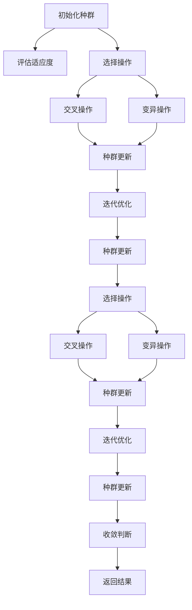
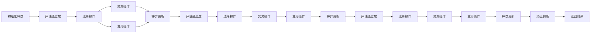
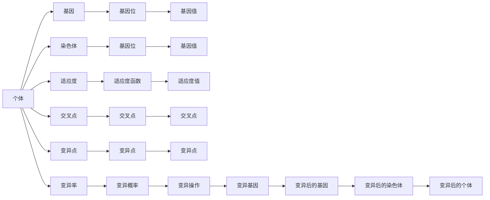

                 

# 遗传算法(Genetic Algorithms) - 原理与代码实例讲解

## 1. 背景介绍

### 1.1 问题由来
遗传算法（Genetic Algorithms，简称GA）是一种模拟自然选择和遗传进化过程的优化算法。在20世纪80年代由荷兰计算机科学家约翰·霍兰德（John Holland）提出，在解决复杂问题方面表现出色。遗传算法广泛应用于机器学习、数据分析、工程设计、调度优化、图像处理等领域，成为解决复杂优化问题的有力工具。

### 1.2 问题核心关键点
遗传算法基于自然界的进化过程，通过遗传、变异、选择等操作，不断优化种群中的个体，逐步逼近问题的最优解。核心关键点包括：
- 初始化种群：随机生成一组初始解。
- 评估适应度：根据问题定义适应度函数，评估每个个体的优劣。
- 选择操作：按照适应度大小选择部分个体进行遗传。
- 交叉操作：通过交叉（杂交）生成新个体。
- 变异操作：通过变异产生新的个体。
- 种群更新：更新种群，重复以上操作，直至收敛。

遗传算法的核心思想是通过模拟自然界的进化过程，逐步优化种群中的个体，从而得到问题的最优解。通过不断演化，遗传算法能够处理复杂、非线性的优化问题，展现出强大的适应能力和鲁棒性。

### 1.3 问题研究意义
遗传算法在解决传统优化算法难以处理的复杂问题上表现优异，尤其在计算代价昂贵、存在局部最优的情况下，遗传算法能够逐步跳出局部最优，向全局最优逼近。在人工智能领域，遗传算法也广泛应用于遗传编程、神经网络优化、进化策略等研究中，推动了人工智能技术的创新发展。

## 2. 核心概念与联系

### 2.1 核心概念概述

为更好地理解遗传算法的原理和应用，本节将介绍几个密切相关的核心概念：

- **种群**：遗传算法中的基本单位，由若干个个体（染色体）组成。种群通过遗传、交叉、变异等操作，逐步优化种群中的个体。
- **个体**：种群中的成员，每个个体包含一组基因（染色体），代表问题的一个解。
- **适应度**：衡量个体适应环境的能力，通过适应度函数计算得出。适应度高的个体被优先选择进入下一代。
- **选择**：根据适应度大小选择个体进行交叉操作。选择方法包括轮盘赌、锦标赛等。
- **交叉**：将两个个体的部分基因组合，生成新的个体。交叉方法包括单点交叉、多点交叉等。
- **变异**：通过随机改变基因，生成新的个体。变异率控制新个体产生的多样性。
- **种群更新**：通过选择、交叉、变异等操作，更新种群，迭代优化。

这些核心概念之间的逻辑关系可以通过以下Mermaid流程图来展示：



这个流程图展示了大遗传算法的核心流程：

1. 初始化种群。
2. 评估适应度。
3. 选择、交叉、变异等操作生成新个体。
4. 种群更新，迭代优化。
5. 当达到预设的收敛条件，返回最优解。

### 2.2 概念间的关系

这些核心概念之间存在着紧密的联系，形成了遗传算法的完整流程。下面我们通过几个Mermaid流程图来展示这些概念之间的关系。

#### 2.2.1 种群的生命周期


这个流程图展示了种群从初始化到终止的全过程，包含评估适应度、选择、交叉、变异和种群更新等关键操作。

#### 2.2.2 遗传算法的工作流程



这个流程图详细展示了遗传算法的工作流程，包括初始化、评估适应度、选择、交叉、变异、种群更新等操作。

#### 2.2.3 种群遗传的层次



这个流程图展示了种群遗传的层次结构，包括个体、染色体、基因位、基因值、适应度等概念，以及交叉和变异操作。

### 2.3 核心概念的整体架构

最后，我们用一个综合的流程图来展示这些核心概念在大遗传算法中的整体架构：

```mermaid
graph TB
    A[种群]
    A --> B[个体]
    B --> C[染色体]
    C --> D[基因位]
    D --> E[基因值]
    E --> F[适应度]
    F --> G[适应度函数]
    G --> H[适应度值]
    A --> I[选择]
    I --> J[交叉]
    J --> K[变异]
    K --> L[种群更新]
    L --> M[种群]
    M --> N[种群]
    N --> O[种群]
    O --> P[种群]
    P --> Q[迭代优化]
    Q --> R[种群]
    R --> S[种群]
    S --> T[种群]
    T --> U[种群]
    U --> V[种群]
    V --> W[种群]
    W --> X[种群]
    X --> Y[种群]
    Y --> Z[种群]
    Z --> AA[种群]
    AA --> AB[种群]
    AB --> AC[种群]
    AC --> AD[种群]
    AD --> AE[种群]
    AE --> AF[种群]
    AF --> AG[种群]
    AG --> AH[种群]
    AH --> AI[种群]
    AI --> AJ[种群]
    AJ --> AK[种群]
    AK --> AL[种群]
    AL --> AM[种群]
    AM --> AN[种群]
    AN --> AO[种群]
    AO --> AP[种群]
    AP --> AQ[种群]
    AQ --> AR[种群]
    AR --> AS[种群]
    AS --> AT[种群]
    AT --> AU[种群]
    AU --> AV[种群]
    AV --> AW[种群]
    AW --> AX[种群]
    AX --> AY[种群]
    AY --> AZ[种群]
    AZ --> BA[种群]
    BA --> BB[种群]
    BB --> BC[种群]
    BC --> BD[种群]
    BD --> BE[种群]
    BE --> BF[种群]
    BF --> BG[种群]
    BG --> BH[种群]
    BH --> BI[种群]
    BI --> BJ[种群]
    BJ --> BK[种群]
    BK --> BL[种群]
    BL --> BM[种群]
    BM --> BN[种群]
    BN --> BO[种群]
    BO --> BP[种群]
    BP --> BQ[种群]
    BQ --> BR[种群]
    BR --> BS[种群]
    BS --> BT[种群]
    BT --> BU[种群]
    BU --> BV[种群]
    BV --> BW[种群]
    BW --> BX[种群]
    BX --> BY[种群]
    BY --> BZ[种群]
    BZ --> CA[种群]
    CA --> CB[种群]
    CB --> CC[种群]
    CC --> CD[种群]
    CD --> CE[种群]
    CE --> CF[种群]
    CF --> CG[种群]
    CG --> CH[种群]
    CH --> CI[种群]
    CI --> CJ[种群]
    CJ --> CK[种群]
    CK --> CL[种群]
    CL --> CM[种群]
    CM --> CN[种群]
    CN --> CO[种群]
    CO --> CP[种群]
    CP --> CQ[种群]
    CQ --> CR[种群]
    CR --> CS[种群]
    CS --> CT[种群]
    CT --> CU[种群]
    CU --> CV[种群]
    CV --> CW[种群]
    CW --> CX[种群]
    CX --> CY[种群]
    CY --> CZ[种群]
    CZ --> DA[种群]
    DA --> DB[种群]
    DB --> DC[种群]
    DC --> DD[种群]
    DD --> DE[种群]
    DE --> DF[种群]
    DF --> DG[种群]
    DG --> DH[种群]
    DH --> DI[种群]
    DI --> DJ[种群]
    DJ --> DK[种群]
    DK --> DL[种群]
    DL --> DM[种群]
    DM --> DN[种群]
    DN --> DO[种群]
    DO --> DP[种群]
    DP --> DQ[种群]
    DQ --> DR[种群]
    DR --> DS[种群]
    DS --> DT[种群]
    DT --> DU[种群]
    DU --> DV[种群]
    DV --> DW[种群]
    DW --> DX[种群]
    DX --> DY[种群]
    DY --> DZ[种群]
    DZ --> EA[种群]
    EA --> EB[种群]
    EB --> EC[种群]
    EC --> ED[种群]
    ED --> EE[种群]
    EE --> EF[种群]
    EF --> EG[种群]
    EG --> EH[种群]
    EH --> EI[种群]
    EI --> EJ[种群]
    EJ --> EK[种群]
    EK --> EL[种群]
    EL --> EM[种群]
    EM --> EN[种群]
    EN --> EO[种群]
    EO --> EP[种群]
    EP --> EQ[种群]
    EQ --> ER[种群]
    ER --> ES[种群]
    ES --> ET[种群]
    ET --> EU[种群]
    EU --> EV[种群]
    EV --> EW[种群]
    EW --> EX[种群]
    EX --> EY[种群]
    EY --> EZ[种群]
    EZ --> FA[种群]
    FA --> FB[种群]
    FB --> FC[种群]
    FC --> FD[种群]
    FD --> FE[种群]
    FE --> FF[种群]
    FF --> FG[种群]
    FG --> FH[种群]
    FH --> FI[种群]
    FI --> FJ[种群]
    FJ --> FK[种群]
    FK --> FL[种群]
    FL --> FM[种群]
    FM --> FN[种群]
    FN --> FO[种群]
    FO --> FP[种群]
    FP --> FQ[种群]
    FQ --> FR[种群]
    FR --> FS[种群]
    FS --> FT[种群]
    FT --> FU[种群]
    FU --> FV[种群]
    FV --> FW[种群]
    FW --> FX[种群]
    FX --> FY[种群]
    FY --> FZ[种群]
    FZ --> GA[种群]
    GA --> GB[种群]
    GB --> GC[种群]
    GC --> GD[种群]
    GD --> GE[种群]
    GE --> GF[种群]
    GF --> GG[种群]
    GG --> GH[种群]
    GH --> GI[种群]
    GI --> GJ[种群]
    GJ --> GK[种群]
    GK --> GL[种群]
    GL --> GM[种群]
    GM --> GN[种群]
    GN --> GO[种群]
    GO --> GP[种群]
    GP --> GQ[种群]
    GQ --> GR[种群]
    GR --> GS[种群]
    GS --> GT[种群]
    GT --> GU[种群]
    GU --> GV[种群]
    GV --> GW[种群]
    GW --> GX[种群]
    GX --> GY[种群]
    GY --> GZ[种群]
    GZ --> HA[种群]
    HA --> HB[种群]
    HB --> HC[种群]
    HC --> HD[种群]
    HD --> HE[种群]
    HE --> HF[种群]
    HF --> HG[种群]
    HG --> HH[种群]
    HH --> HI[种群]
    HI --> HJ[种群]
    HJ --> HK[种群]
    HK --> HL[种群]
    HL --> HM[种群]
    HM --> HN[种群]
    HN --> HO[种群]
    HO --> HP[种群]
    HP --> HQ[种群]
    HQ --> HR[种群]
    HR --> HS[种群]
    HS --> HT[种群]
    HT --> HU[种群]
    HU --> HV[种群]
    HV --> HW[种群]
    HW --> HX[种群]
    HX --> HY[种群]
    HY --> HZ[种群]
    HZ --> IA[种群]
    IA --> IB[种群]
    IB --> IC[种群]
    IC --> ID[种群]
    ID --> IE[种群]
    IE --> IF[种群]
    IF --> IG[种群]
    IG --> IH[种群]
    IH --> II[种群]
    II --> IJ[种群]
    IJ --> IK[种群]
    IK --> IL[种群]
    IL --> IM[种群]
    IM --> IN[种群]
    IN --> IO[种群]
    IO --> IP[种群]
    IP --> IQ[种群]
    IQ --> IR[种群]
    IR --> IS[种群]
    IS --> IT[种群]
    IT --> IU[种群]
    IU --> IV[种群]
    IV --> IW[种群]
    IW --> IX[种群]
    IX --> IY[种群]
    IY --> IZ[种群]
    IZ --> JA[种群]
    JA --> JB[种群]
    JB --> JC[种群]
    JC --> JD[种群]
    JD --> JE[种群]
    JE --> JF[种群]
    JF --> JG[种群]
    JG --> JH[种群]
    JH --> JI[种群]
    JI --> JJ[种群]
    JJ --> JK[种群]
    JK --> JL[种群]
    JL --> JM[种群]
    JM --> JN[种群]
    JN --> JO[种群]
    JO --> JP[种群]
    JP --> JQ[种群]
    JQ --> JR[种群]
    JR --> JS[种群]
    JS --> JT[种群]
    JT --> JU[种群]
    JU --> JV[种群]
    JV --> JW[种群]
    JW --> JX[种群]
    JX --> JY[种群]
    JY --> JZ[种群]
    JZ --> KA[种群]
    KA --> KB[种群]
    KB --> KC[种群]
    KC --> KD[种群]
    KD --> KE[种群]
    KE --> KF[种群]
    KF --> KG[种群]
    KG --> KH[种群]
    KH --> KI[种群]
    KI --> KJ[种群]
    KJ --> KK[种群]
    KK --> KL[种群]
    KL --> KM[种群]
    KM --> KN[种群]
    KN --> KO[种群]
    KO --> KP[种群]
    KP --> KQ[种群]
    KQ --> KR[种群]
    KR --> KS[种群]
    KS --> KT[种群]
    KT --> KU[种群]
    KU --> KV[种群]
    KV --> KW[种群]
    KW --> KX[种群]
    KX --> KY[种群]
    KY --> KZ[种群]
    KZ --> LA[种群]
    LA --> LB[种群]
    LB --> LC[种群]
    LC --> LD[种群]
    LD --> LE[种群]
    LE --> LF[种群]
    LF --> LG[种群]
    LG --> LH[种群]
    LH --> LI[种群]
    LI --> LJ[种群]
    LJ --> LK[种群]
    LK --> LL[种群]
    LL --> LM[种群]
    LM --> LN[种群]
    LN --> LO[种群]
    LO --> LP[种群]
    LP --> LQ[种群]
    LQ --> LR[种群]
    LR --> LS[种群]
    LS --> LT[种群]
    LT --> LU[种群]
    LU --> LV[种群]
    LV --> LW[种群]
    LW --> LX[种群]
    LX --> LY[种群]
    LY --> LZ[种群]
    LZ --> MA[种群]
    MA --> MB[种群]
    MB --> MC[种群]
    MC --> MD[种群]
    MD --> ME[种群]
    ME --> MF[种群]
    MF --> MG[种群]
    MG --> MH[种群]
    MH --> MI[种群]
    MI --> MJ[种群]
    MJ --> MK[种群]
    MK --> ML[种群]
    ML --> MM[种群]
    MM --> MN[种群]
    MN --> MO[种群]
    MO --> MP[种群]
    MP --> MQ[种群]
    MQ --> MR[种群]
    MR --> MS[种群]
    MS --> MT[种群]
    MT --> MU[种群]
    MU --> MV[种群]
    MV --> MW[种群]
    MW --> MX[种群]
    MX --> MY[种群]
    MY --> MZ[种群]
    MZ --> NA[种群]
    NA --> NB[种群]
    NB --> NC[种群]
    NC --> ND[种群]
    ND --> NE[种群]
    NE --> NF[种群]
    NF --> NG[种群]
    NG --> NH[种群]
    NH --> NI[种群]
    NI --> NJ[种群]
    NJ --> NK[种群]
    NK --> NL[种群]
    NL --> NM[种群]
    NM --> NN[种群]
    NN --> NO[种群]
    NO --> NP[种群]
    NP --> NQ[种群]
    NQ --> NR[种群]
    NR --> NS[种群]
    NS --> NT[种群]
    NT --> NU[种群]
    NU --> NV[种群]
    NV --> NW[种群]
    NW --> NX[种群]
    NX --> NY[种群]
    NY --> NZ[种群]
    NZ --> OA[种群]
    OA --> OB[种群]
    OB --> OC[种群]
    OC --> OD[种群]
    OD --> OE[种群]
    OE --> OF[种群]
    OF --> OG[种群]
    OG --> OH[种群]
    OH --> OI[种群]
    OI --> OJ[种群]
    OJ --> OK[种群]
    OK --> OL[种群]
    OL --> OM[种群]
    OM --> ON[种群]
    ON --> OO[种群]
    OO --> OP[种群]
    OP --> OQ[种群]
    OQ --> OR[种群]
    OR --> OS[种群]
    OS --> OT[种群]
    OT --> OU[种群]
    OU --> OV[种群]
    OV --> OW[种群]
    OW --> OX[种群]
    OX --> OY[种群]
    OY --> OZ[种群]
    OZ --> PA[种群]
    PA --> PB[种群]
    PB --> PC[种群]
    PC --> PD[种群]
    PD --> PE[种群]
    PE --> PF[种群]
    PF --> PG[种群]
    PG --> PH[种群]
    PH --> PI[种群]
    PI --> PJ[种群]
    PJ --> PK[种群]
    PK --> PL[种群]
    PL --> PM[种群]
    PM --> PN[种群]
    PN --> PO[种群]
    PO --> PP[种群]
    PP --> PQ[种群]
    PQ --> PR[种群]
    PR --> PS[种群]
    PS --> PT[种群]
    PT --> PU[种群]
    PU --> PV[种群]
    PV --> PW[种群]
    PW --> PX[种群]
    PX --> PY[种群]
    PY --> PZ[种群]
    PZ --> QA[种群]
    QA --> QB[种群]
    QB --> QC[种群]
    QC --> QD[种群]
    QD --> QE[种群]
    QE --> QF[种群]
    QF --> QG[种群]
    QG --> QH[种群]
    QH --> QI[种群]
    QI --> QJ[种群]
    QJ --> QK[种群]
    QK --> QL[种群]
    QL --> QM[种群]
    QM --> QN[种群]
    QN --> QO[种群]
    QO --> QP[种群]
    QP --> QQ[种群]
    QQ --> QR[种群]
    QR --> QS[种群]
    QS --> QT[种群]
    QT --> QU[种群]
    QU --> QV[种群]
    QV --> QW[种群]
    QW --> QX[种群]
    QX --> QY[种群]
    QY --> QZ[种群]
    QZ --> RA[种群]
    RA --> RB[种群]
    RB --> RC[种群]
    RC --> RD[种群]
    RD --> RE[种群]
    RE --> RF[种群]
    RF --> RG[种群]
    RG --> RH[种群]
    RH --> RI[种群]
    RI --> RJ[种群]
    RJ --> RK[种群]
    RK --> RL[种群]
    RL --> RM[种群]
    RM --> RN[种群]
    RN --> RO[种群]
    RO --> RP[种群]
    RP --> RQ[种群]
    RQ --> RR[种群]
    RR --> RS[种群]
    RS --> RT[种群]
    RT --> RU[种群]
    RU --> RV[种群]
    RV --> RW[种群]
    RW --> RX[种群]
    RX --> RY[种群]
    RY --> RZ[种群]
    RZ --> SA[种群]
    SA --> SB[种群

