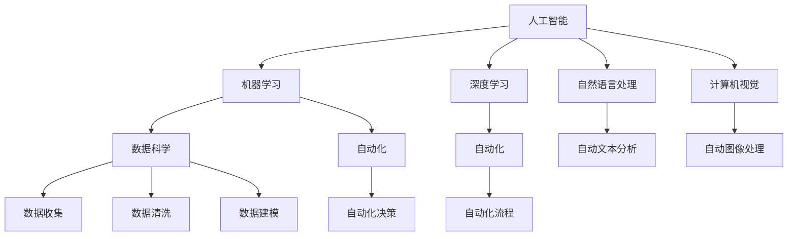
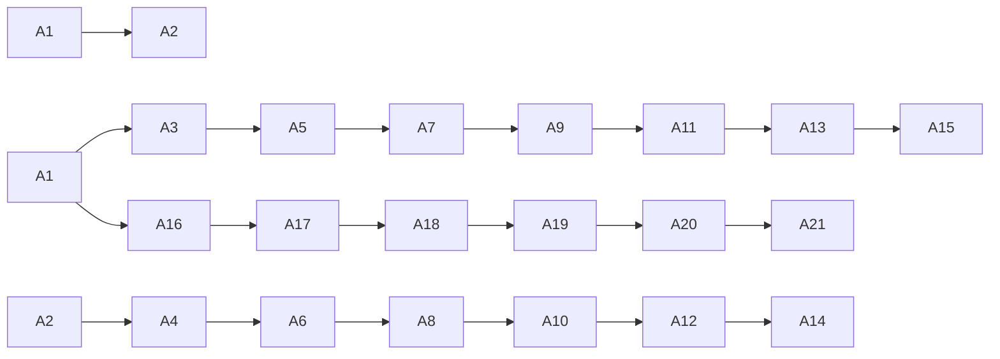

                 

# 重塑AI工作流还是用AI重塑工作流?

## 1. 背景介绍

在当今数字化时代，人工智能(AI)正日益成为推动企业创新和业务转型的关键力量。从数据分析、智能推荐、聊天机器人到自然语言处理(NLP)、图像识别、自动驾驶等多个领域，AI技术正不断刷新我们对工作流程和业务模式的认知。然而，面对AI技术的复杂性和多样性，究竟是重塑AI工作流还是用AI重塑工作流，成为一个值得深入探讨的话题。

### 1.1 问题由来
在过去的几十年里，企业的IT系统逐渐形成了以业务需求为导向的封闭式工作流，包括数据收集、数据处理、模型训练和模型部署等多个环节。这种传统的工作流虽然稳定可靠，但灵活性和创新性相对较弱。AI技术的发展打破了这种局面，提供了一种更灵活、更高效的解决方案。

AI技术可以自动化繁琐的数据处理和模型训练过程，极大提升工作效率。但同时也带来了一系列新的挑战：如何整合传统的业务系统与新兴的AI技术，如何在AI技术的加持下重新设计工作流，如何平衡传统的业务流程与创新的AI实践。这些问题催生了对于“重塑AI工作流还是用AI重塑工作流”的深入思考。

### 1.2 问题核心关键点
AI技术的应用，本质上是对工作流程的深度改造和优化。这一过程可以分为两个阶段：

- **重塑AI工作流**：在已有业务系统基础上，整合AI技术，提升工作效率和质量。
- **用AI重塑工作流**：以AI技术为核心，重构业务流程，甚至创造出全新的业务模式。

两个阶段的目标都是提升业务价值，但实施方式和效果差异显著。本文将从这两个角度出发，探讨重塑AI工作流和用AI重塑工作流的异同及其应用场景，为读者提供深入的思考和实践指导。

### 1.3 问题研究意义
在当前的数字化转型浪潮中，人工智能正成为企业竞争力的关键因素。如何通过AI技术优化现有业务流程，同时保持业务的稳定性和可控性，是企业面临的重要课题。理解“重塑AI工作流还是用AI重塑工作流”，有助于企业制定更具前瞻性和灵活性的AI战略，推动技术创新和业务增长。

## 2. 核心概念与联系

### 2.1 核心概念概述

为更好地理解AI技术如何重塑工作流，本节将介绍几个密切相关的核心概念：

- **人工智能(AI)**：一种通过算法和模型模拟人类智能的技术，包括机器学习、深度学习、自然语言处理、计算机视觉等。
- **数据科学**：通过数据收集、清洗、分析和建模，发现数据背后规律的科学。
- **机器学习(ML)**：使计算机通过数据学习规律，自主完成特定任务的技术。
- **深度学习(DL)**：一种机器学习技术，通过多层次神经网络模拟人脑的思考过程。
- **自动化**：通过技术手段，减少人工干预，提升工作效率。
- **工作流管理(Workflow Management)**：对业务流程进行标准化、自动化和持续优化。

这些概念之间的联系可以通过以下Mermaid流程图来展示：



这个流程图展示了AI技术的主要分支及其与数据科学、自动化和业务流程管理等概念的关系。AI技术通过学习数据规律，实现机器自动化，从而提升工作效率和业务价值。

### 2.2 概念间的关系

这些核心概念之间存在着紧密的联系，形成了AI技术在工作流重塑中的整体架构。下面我通过几个Mermaid流程图来展示这些概念之间的关系。

#### 2.2.1 AI技术的分支与应用



这个流程图展示了AI技术在不同领域的应用。AI技术通过多个分支在各行各业中发挥作用，提升自动化水平，驱动业务创新。

#### 2.2.2 AI与数据科学的关系

```mermaid
graph LR
    A[数据科学] --> B[数据收集]
    A --> C[数据清洗]
    A --> D[数据建模]
    B --> E[A1]
    C --> F[A2]
    D --> G[A3]
    A1 --> H[A4]
    A2 --> I[A5]
    A3 --> J[A6]
    E --> K[A7]
    F --> L[A8]
    G --> M[A9]
    H --> N[A10]
    I --> O[A11]
    J --> P[A12]
    K --> Q[A13]
    L --> R[A14]
    M --> S[A15]
    N --> T[A16]
    O --> U[A17]
    P --> V[A18]
    Q --> W[A19]
    R --> X[A20]
    S --> Y[A21]
    T --> Z[A22]
    U --> $[A23]
    V --> %[A24]
    W --> &[A25]
    X --> *[A26]
    Y --> (A27]
    Z --> )[A28]
    $ --> +[A29]
    % --> -[A30]
    & --> =[A31]
    * --> /[A32]
    (A --> ^[A33]
    ^ --> [[A34]
```

这个流程图展示了数据科学在AI技术中的应用。数据科学通过数据收集、清洗和建模，为AI技术提供数据支撑，驱动AI算法和模型的训练与优化。

#### 2.2.3 AI与工作流管理的整合

```mermaid
graph TB
    A[工作流管理] --> B[业务流程自动化]
    A --> C[工作流调度]
    A --> D[任务分配]
    A --> E[流程监控]
    B --> F[A1]
    C --> G[A2]
    D --> H[A3]
    E --> I[A4]
    F --> J[A5]
    G --> K[A6]
    H --> L[A7]
    I --> M[A8]
    J --> N[A9]
    K --> O[A10]
    L --> P[A11]
    M --> Q[A12]
    N --> R[A13]
    O --> S[A14]
    P --> T[A15]
    Q --> U[A16]
    R --> V[A17]
    S --> W[A18]
    T --> X[A19]
    U --> Y[A20]
    V --> Z[A21]
    W --> $[A22]
    X --> %[A23]
    Y --> &[A24]
    Z --> *[A25]
    $ --> (A26]
    % --> )[A27]
    & --> +[A28]
    * --> -[A29]
    (A --> /[A30]
    / --> [[A31]
    [[ --> ^[A32]
    ^ --> [[[A33]
    [[[A --> (A34]
    ) --> ][A35]
    ] --> )[A36]
    [) --> /[A37]
    ] --> +[A38]
    ] --> -[A39]
    ] --> =[A40]
    ] --> ^[A41]
    ] --> *[A42]
    ] --> (A43]
    ] --> [[[A44]
    ] --> )[A45]
    ] --> ][A46]
    ] --> *[A47]
    ] --> (A48]
    ] --> [[[A49]
    ] --> )[A50]
    ] --> ][A51]
    ] --> *[A52]
    ] --> (A53]
    ] --> [[[A54]
    ] --> )[A55]
    ] --> ][A56]
    ] --> *[A57]
    ] --> (A58]
    ] --> [[[A59]
    ] --> )[A60]
    ] --> ][A61]
    ] --> *[A62]
    ] --> (A63]
    ] --> [[[A64]
    ] --> )[A65]
    ] --> ][A66]
    ] --> *[A67]
    ] --> (A68]
    ] --> [[[A69]
    ] --> )[A70]
    ] --> ][A71]
    ] --> *[A72]
    ] --> (A73]
    ] --> [[[A74]
    ] --> )[A75]
    ] --> ][A76]
    ] --> *[A77]
    ] --> (A78]
    ] --> [[[A79]
    ] --> )[A80]
    ] --> ][A81]
    ] --> *[A82]
    ] --> (A83]
    ] --> [[[A84]
    ] --> )[A85]
    ] --> ][A86]
    ] --> *[A87]
    ] --> (A88]
    ] --> [[[A89]
    ] --> )[A90]
    ] --> ][A91]
    ] --> *[A92]
    ] --> (A93]
    ] --> [[[A94]
    ] --> )[A95]
    ] --> ][A96]
    ] --> *[A97]
    ] --> (A98]
    ] --> [[[A99]
    ] --> )[A100]
    ] --> ][A101]
    ] --> *[A102]
    ] --> (A103]
    ] --> [[[A104]
    ] --> )[A105]
    ] --> ][A106]
    ] --> *[A107]
    ] --> (A108]
    ] --> [[[A109]
    ] --> )[A110]
    ] --> ][A111]
    ] --> *[A112]
    ] --> (A113]
    ] --> [[[A114]
    ] --> )[A115]
    ] --> ][A116]
    ] --> *[A117]
    ] --> (A118]
    ] --> [[[A119]
    ] --> )[A120]
    ] --> ][A121]
    ] --> *[A122]
    ] --> (A123]
    ] --> [[[A124]
    ] --> )[A125]
    ] --> ][A126]
    ] --> *[A127]
    ] --> (A128]
    ] --> [[[A129]
    ] --> )[A130]
    ] --> ][A131]
    ] --> *[A132]
    ] --> (A133]
    ] --> [[[A134]
    ] --> )[A135]
    ] --> ][A136]
    ] --> *[A137]
    ] --> (A138]
    ] --> [[[A139]
    ] --> )[A140]
    ] --> ][A141]
    ] --> *[A142]
    ] --> (A143]
    ] --> [[[A144]
    ] --> )[A145]
    ] --> ][A146]
    ] --> *[A147]
    ] --> (A148]
    ] --> [[[A149]
    ] --> )[A150]
    ] --> ][A151]
    ] --> *[A152]
    ] --> (A153]
    ] --> [[[A154]
    ] --> )[A155]
    ] --> ][A156]
    ] --> *[A157]
    ] --> (A158]
    ] --> [[[A159]
    ] --> )[A160]
    ] --> ][A161]
    ] --> *[A162]
    ] --> (A163]
    ] --> [[[A164]
    ] --> )[A165]
    ] --> ][A166]
    ] --> *[A167]
    ] --> (A168]
    ] --> [[[A169]
    ] --> )[A170]
    ] --> ][A171]
    ] --> *[A172]
    ] --> (A173]
    ] --> [[[A174]
    ] --> )[A175]
    ] --> ][A176]
    ] --> *[A177]
    ] --> (A178]
    ] --> [[[A179]
    ] --> )[A180]
    ] --> ][A181]
    ] --> *[A182]
    ] --> (A183]
    ] --> [[[A184]
    ] --> )[A185]
    ] --> ][A186]
    ] --> *[A187]
    ] --> (A188]
    ] --> [[[A189]
    ] --> )[A190]
    ] --> ][A191]
    ] --> *[A192]
    ] --> (A193]
    ] --> [[[A194]
    ] --> )[A195]
    ] --> ][A196]
    ] --> *[A197]
    ] --> (A198]
    ] --> [[[A199]
    ] --> )[A200]
    ] --> ][A201]
    ] --> *[A202]
    ] --> (A203]
    ] --> [[[A204]
    ] --> )[A205]
    ] --> ][A206]
    ] --> *[A207]
    ] --> (A208]
    ] --> [[[A209]
    ] --> )[A210]
    ] --> ][A211]
    ] --> *[A212]
    ] --> (A213]
    ] --> [[[A214]
    ] --> )[A215]
    ] --> ][A216]
    ] --> *[A217]
    ] --> (A218]
    ] --> [[[A219]
    ] --> )[A220]
    ] --> ][A221]
    ] --> *[A222]
    ] --> (A223]
    ] --> [[[A224]
    ] --> )[A225]
    ] --> ][A226]
    ] --> *[A227]
    ] --> (A228]
    ] --> [[[A229]
    ] --> )[A230]
    ] --> ][A231]
    ] --> *[A232]
    ] --> (A233]
    ] --> [[[A234]
    ] --> )[A235]
    ] --> ][A236]
    ] --> *[A237]
    ] --> (A238]
    ] --> [[[A239]
    ] --> )[A240]
    ] --> ][A241]
    ] --> *[A242]
    ] --> (A243]
    ] --> [[[A244]
    ] --> )[A245]
    ] --> ][A246]
    ] --> *[A247]
    ] --> (A248]
    ] --> [[[A249]
    ] --> )[A250]
    ] --> ][A251]
    ] --> *[A252]
    ] --> (A253]
    ] --> [[[A254]
    ] --> )[A255]
    ] --> ][A256]
    ] --> *[A257]
    ] --> (A258]
    ] --> [[[A259]
    ] --> )[A260]
    ] --> ][A261]
    ] --> *[A262]
    ] --> (A263]
    ] --> [[[A264]
    ] --> )[A265]
    ] --> ][A266]
    ] --> *[A267]
    ] --> (A268]
    ] --> [[[A269]
    ] --> )[A270]
    ] --> ][A271]
    ] --> *[A272]
    ] --> (A273]
    ] --> [[[A274]
    ] --> )[A275]
    ] --> ][A276]
    ] --> *[A277]
    ] --> (A278]
    ] --> [[[A279]
    ] --> )[A280]
    ] --> ][A281]
    ] --> *[A282]
    ] --> (A283]
    ] --> [[[A284]
    ] --> )[A285]
    ] --> ][A286]
    ] --> *[A287]
    ] --> (A288]
    ] --> [[[A289]
    ] --> )[A290]
    ] --> ][A291]
    ] --> *[A292]
    ] --> (A293]
    ] --> [[[A294]
    ] --> )[A295]
    ] --> ][A296]
    ] --> *[A297]
    ] --> (A298]
    ] --> [[[A299]
    ] --> )[A300]
    ] --> ][A301]
    ] --> *[A302]
    ] --> (A303]
    ] --> [[[A304]
    ] --> )[A305]
    ] --> ][A306]
    ] --> *[A307]
    ] --> (A308]
    ] --> [[[A309]
    ] --> )[A310]
    ] --> ][A311]
    ] --> *[A312]
    ] --> (A313]
    ] --> [[[A314]
    ] --> )[A315]
    ] --> ][A316]
    ] --> *[A317]
    ] --> (A318]
    ] --> [[[A319]
    ] --> )[A320]
    ] --> ][A321]
    ] --> *[A322]
    ] --> (A323]
    ] --> [[[A324]
    ] --> )[A325]
    ] --> ][A326]
    ] --> *[A327]
    ] --> (A328]
    ] --> [[[A329]
    ] --> )[A330]
    ] --> ][A331]
    ] --> *[A332]
    ] --> (A333]
    ] --> [[[A334]
    ] --> )[A335]
    ] --> ][A336]
    ] --> *[A337]
    ] --> (A338]
    ] --> [[[A339]
    ] --> )[A340]
    ] --> ][A341]
    ] --> *[A342]
    ] --> (A343]
    ] --> [[[A344]
    ] --> )[A345]
    ] --> ][A346]
    ] --> *[A347]
    ] --> (A348]
    ] --> [[[A349]
    ] --> )[A350]
    ] --> ][A351]
    ] --> *[A352]
    ] --> (A353]
    ] --> [[[A354]
    ] --> )[A355]
    ] --> ][A356]
    ] --> *[A357]
    ] --> (A358]
    ] --> [[[A359]
    ] --> )[A360]
    ] --> ][A361]
    ] --> *[A362]
    ] --> (A363]
    ] --> [[[A364]
    ] --> )[A365]
    ] --> ][A366]
    ] --> *[A367]
    ] --> (A368]
    ] --> [[[A369]
    ] --> )[A370]
    ] --> ][A371]
    ] --> *[A372]
    ] --> (A373]
    ] --> [[[A374]
    ] --> )[A375]
    ] --> ][A376]
    ] --> *[A377]
    ] --> (A378]
    ] --> [[[A379]
    ] --> )[A380]
    ] --> ][A381]
    ] --> *[A382]
    ] --> (A383]
    ] --> [[[A384]
    ] --> )[A385]
    ] --> ][A386]
    ] --> *[A387]
    ] --> (A388]
    ] --> [[[A389]
    ] --> )[A390]
    ] --> ][A391]
    ] --> *[A392]
    ] --> (A393]
    ] --> [[[A394]
    ] --> )[A395]
    ] --> ][A396]
    ] --> *[A397]
    ] --> (A398]
    ] --> [[[A399]
    ] --> )[A400]
    ] --> ][A401]
    ] --> *[A402]
    ] --> (A403]
    ] --> [[[A404]
    ] --> )[A405]
    ] --> ][A406]
    ] --> *[A407]
    ] --> (A408]
    ] --> [[[A409]
    ] --> )[A410]
    ] --> ][A411]
    ] --> *[A412]
    ] --> (A413]
    ] --> [[[A414]
    ] --> )[A415]
    ] --> ][A416]
    ] --> *[A417]
    ] --> (A418]
    ] --> [[[A419]
    ] --> )[A420]
    ] --> ][A421]
    ] --> *[A422]
    ] --> (A423]
    ] --> [[[A424]
    ] --> )[A425]
    ] --> ][A426]
    ] --> *[A427]
    ] --> (A428]
    ] --> [[[A429]
    ] --> )[A430]
    ] --> ][A431]
    ] --> *[A432]
    ] --> (A433]
    ] --> [[[A434]
    ] --> )[A435]
    ] --> ][A436]
    ] --> *[A437]
    ] --> (A438]
    ] --> [[[A439]
    ] --> )[A440]
    ] --> ][A441]
    ] --> *[A442]
    ] --> (A443]
    ] --> [[[A444]
    ] --> )[A445]
    ] --> ][A446]
    ] --> *[A447]
    ] --> (A448]
    ] --> [[[A449]
    ] --> )[A450]
    ] --> ][A451]
    ] --> *[A452]
    ] --> (A453]
    ] --> [[[A454]
    ] --> )[A455]
    ] --> ][A456]
    ] --> *[A457]
    ] --> (A458]
    ] --> [[[A459]
    ] --> )[A460]
    ] --> ][A461]
    ] --> *[A462]
    ] --> (A463]
    ] --> [[[A464]
    ] --> )[A465]
    ] --> ][A466]
    ] --> *[A467]
    ] --> (A468]
    ] --> [[[A469]
    ] --> )[A470]
    ] --> ][A471]
    ] --> *[A472]
    ] --> (A473]
    ] --> [[[A474]
    ] --> )[A475]
    ] --> ][A476]
    ] --> *[A477]
    ] --> (A478]
    ] --> [[[A479]
    ] --> )[A480]
    ] --> ][A481]
    ] --> *[A482]
    ] --> (A483]
    ] --> [[[A484]
    ] --> )[A485]
    ] --> ][A486]
    ] --> *[A487]
    ] --> (A488]
    ] --> [[[A489]
    ] --> )[A490]
    ] --> ][A491]
    ] --> *[A492]
    ] --> (A493]
    ] --> [[[A494]
    ] --> )[A495]
    ] --> ][A496]
    ] --> *[A497]
    ] --> (A498]
    ] --> [[[A499]
    ] --> )[A500]
    ] --> ][A501]
    ] --> *[A502]
    ] --> (A503]
    ] --> [[[A504]
    ] --> )[A505]
    ] --> ][A506]
    ] --> *[A507]
    ] --> (A508]
    ] --> [[[A509]
    ] --> )[A510]
    ] --> ][A511]
    ] --> *[A512]
    ] --> (A513]
    ] --> [[[A514]
    ] --> )[A515]
    ] --> ][A516]
    ] --> *[A517]
    ] --> (A518]
    ] --> [[[A519]
    ] --> )[A520]
    ] --> ][A521]
    ] --> *[A522]
    ] --> (A523]
    ] --> [[[A524]
    ] --> )[A525]
    ] --> ][A526]
    ] --> *[A527]
    ] --> (A528]
    ] --> [[[A529]
    ] --> )[A530]
    ] --> ][A531]
    ] --> *[A532]
    ] --> (A533]
    ] --> [[[A534]
    ] --> )[A535]
    ] --> ][A536]
    ] --> *[A537]
    ] --> (A538]
    ] --> [[[A539]
    ] --> )[A540]
    ] --> ][A541]
    ] --> *[A542]
    ] --> (A543]
    ] --> [[[A544]
    ] --> )[A545]
    ] --> ][A546]
    ] --> *[A547]
    ] --> (A548]
    ] --> [[[A549]
    ] --> )[A550]
    ] --> ][A551]
    ] --> *[A552]
    ] --> (A553]
    ] --> [[[A554]
    ] --> )[A555]
    ] --> ][A556]
    ] --> *[A557]
    ] --> (A558]
    ] --> [[[A559]
    ] --> )[A560]
    ] --> ][A561]
    ] --> *[A562]
    ] --> (A563]
    ] --> [[[A564]
    ] --> )[A565]
    ] --> ][A566]
    ] --> *[A567]
    ] --> (A568]
    ] --> [[[A569]
    ] --> )[A570]
    ] --> ][A571]
    ] --> *[A572]
    ] --> (A573]
    ] --> [[[A574]
    ] --> )[A575]
    ] --> ][A576]
    ] --> *[A577]
    ] --> (A578]
    ] --> [[[A579]
    ] --> )[A580]
    ] --> ][A581]
    ] --> *[A582]
    ] --> (A583]
    ] --> [[[A584]
    ] --> )[A585]
    ] --> ][A586]
    ] --> *[A587]
    ] --> (A588]
    ] --> [[[A589]
    ] --> )[A590]
    ] --> ][A591]
    ] --> *[A592]
    ] --> (A593]
    ] --> [[[A594]
    ] --> )[A595]
    ] --> ][A596]
    ] --> *[A597]
    ] --> (A598]
    ] --> [[[A599]
    ] --> )[A600]
    ] --> ][A601]
    ] --> *[A602]
    ] --> (A603]
    ] --> [[[A604]
    ] --> )[A605]
    ] --> ][A606]
    ] --> *[A607]
    ] --> (A608]
    ] --> [[[A609]
    ] --> )[A610]
    ] --> ][A611]
    ] --> *[A612]
    ] --> (A613]
    ] --> [[[A614]
    ] --> )[A615]
    ] --> ][A616]
    ] --> *[A617]
    ] --> (A618]
    ] --> [[[A619]
    ] --> )[A620]
    ] --> ][A621]
    ] --> *[A622]
    ] --> (A623]
    ] --> [[[A624

