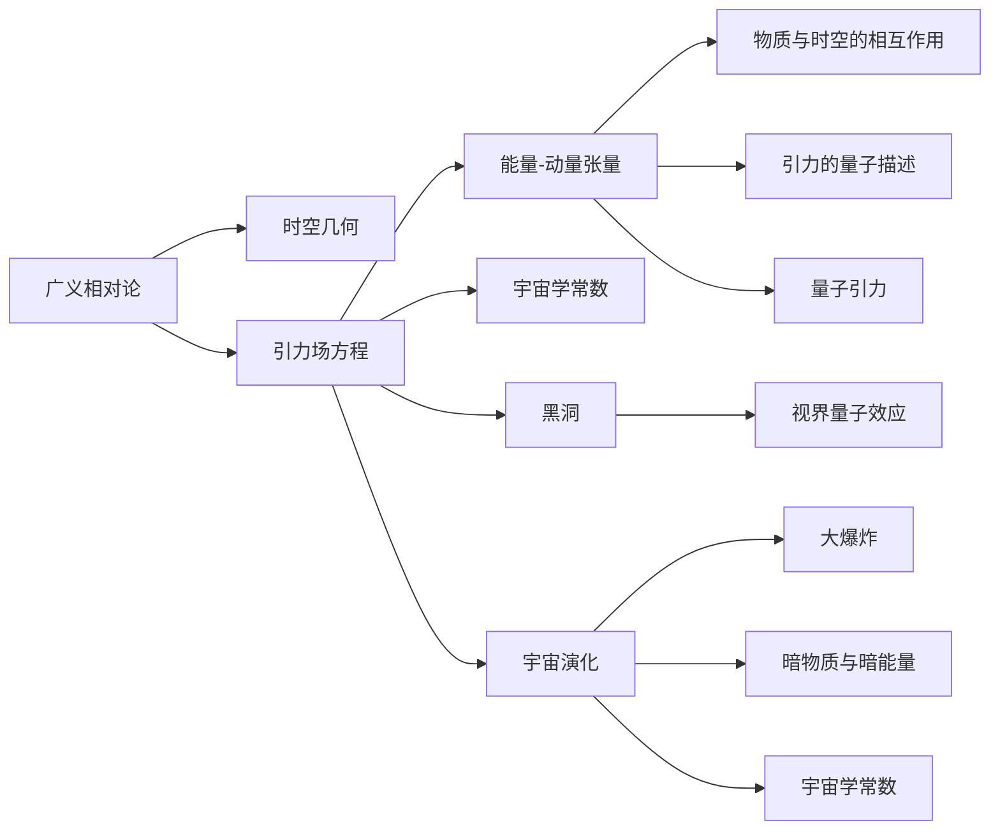

                 

## 1. 背景介绍

量子引力（Quantum Gravity, QG）和宇宙学（Cosmology）是人类认识自然界的最前沿研究领域之一。量子引力研究的是物质、能量、时空之间的关系，以及这些关系在极端条件下的表现，如黑洞、大爆炸等。宇宙学则是研究宇宙的整体结构和演化历史，包括宇宙的起源、结构和未来。这两者之间存在着深刻的内在联系，但是由于理论的复杂性和实验的困难，至今还没有找到一种统一的描述框架。本文旨在探讨量子引力与宇宙学之间的联系，并简要介绍一些正在进行的探索。

## 2. 核心概念与联系

### 2.1 核心概念概述

量子引力是现代物理学中的核心问题之一，它试图将广义相对论（General Relativity, GR）与量子力学（Quantum Mechanics, QM）相结合，研究时空的量子性质。宇宙学则是研究宇宙的宏观结构和演化，包括大爆炸理论、暗物质和暗能量等。

**广义相对论**：描述了时空的几何性质以及物质与时空的关系。爱因斯坦的引力场方程：

$$
G_{\mu\nu} + \Lambda g_{\mu\nu} = \frac{8\pi G}{c^4} T_{\mu\nu}
$$

其中 $G_{\mu\nu}$ 是爱因斯坦场方程中的爱因斯坦张量，$T_{\mu\nu}$ 是能量-动量张量，$\Lambda$ 是宇宙学常数。

**量子力学**：研究微观粒子的运动和相互作用，使用波函数和概率幅来描述物理系统的状态。薛定谔方程：

$$
i\hbar \frac{\partial \psi}{\partial t} = \hat{H} \psi
$$

其中 $\psi$ 是波函数，$\hat{H}$ 是哈密顿量。

### 2.2 核心概念联系

量子引力与宇宙学之间的联系主要体现在以下几个方面：

1. **时空的量子性质**：时空的几何结构在量子层面上可能呈现出与经典不同的特性。例如，黑洞视界附近的时空可能具有非经典的量子效应。

2. **引力的量子描述**：引力是自然界中唯一的长期力，其在量子层面上如何被描述是量子引力研究的关键问题。

3. **宇宙的起源和演化**：宇宙的起源和演化涉及极端条件下的物理规律，量子引力可能提供对这些问题的新的理解。

4. **大统一理论**：量子引力是大统一理论的关键组成部分，它试图将电磁力、弱力和强力与引力统一到一个理论框架中。

### 2.3 核心概念的整体架构

通过以下 Mermaid 流程图，我们可以更清晰地理解量子引力与宇宙学之间的关系：



这个流程图展示了量子引力与宇宙学之间的关系：

- 广义相对论描述了时空的几何性质。
- 引力场方程提供了时空与物质之间的相互作用。
- 能量-动量张量描述了物质和能量的分布。
- 宇宙学常数提供了宇宙背景的动态特性。
- 黑洞和宇宙演化是宇宙学研究的关键内容。
- 物质与时空的相互作用，特别是引力的量子描述，是量子引力研究的核心问题。
- 引力的量子描述试图将引力与微观粒子的量子力学描述结合起来。

## 3. 核心算法原理 & 具体操作步骤

### 3.1 算法原理概述

量子引力与宇宙学的研究涉及多学科的交叉，包括物理学、数学和计算机科学。以下是其中的几个核心算法原理：

1. **数值模拟**：由于经典方程无法描述量子效应，需要采用数值模拟方法，如蒙特卡罗方法和Lattice Gauge Theory，来研究量子引力。

2. **弦论**：弦论是描述量子引力的重要理论，它将粒子视为振动的一维弦，而不是零维的点粒子。

3. **圈量子引力**：圈量子引力认为时空是由量子编织的“圈”组成的，是一种试图将引力量化的理论。

4. **路径积分方法**：路径积分方法是一种将量子力学描述转换为引力量子化的途径，可以通过Lorentz流形来描述时空。

### 3.2 算法步骤详解

以下以**弦论**为例，详细介绍弦论的算法步骤：

1. **弦量子化**：将弦的坐标 $X^\mu(\tau,\sigma)$ 量子化，得到弦的振模 $N^\mu$，满足 $N^\mu \sim \sqrt{L}$。

2. **闭弦振子模式展开**：将弦的振模 $N^\mu$ 展开为正负频振子的和，得到闭弦的坐标振模 $a_{n,\sigma}$。

3. **闭弦相互作用**：将闭弦的相互作用描述为弦振子的相互作用，得到弦的相互作用项。

4. **张量规范**：通过将弦振子模式展开的弦坐标 $a_{n,\sigma}$ 转换为字符串坐标 $X^\mu(x)$，得到弦在规范空间中的作用量。

### 3.3 算法优缺点

**弦论的优点**：

1. **统一性**：弦论试图将引力与所有其他基本力统一起来，提供了从微观到宏观的完整描述。

2. **自洽性**：弦论的数学结构具有高度的自洽性，能够自发地解决量子引力中的奇异性问题。

3. **预测性**：弦论提供了许多可检验的预测，如黑洞辐射、宇宙弦等。

**弦论的缺点**：

1. **复杂性**：弦论的数学框架极其复杂，难以进行精确的计算。

2. **多元性**：弦论存在多个真空态，难以选择一个单一的物理现实。

3. **实验验证困难**：弦论的理论预言需要高能量的实验环境，如大型强子对撞机（LHC），而现有的实验设备尚未能够验证这些预言。

### 3.4 算法应用领域

量子引力与宇宙学的算法主要应用于以下几个领域：

1. **黑洞物理**：研究黑洞的量子性质，如黑洞辐射和信息悖论。

2. **宇宙学早期阶段**：研究宇宙大爆炸后的早期阶段，预测宇宙的初始条件和演化。

3. **引力波探测**：通过引力波探测实验，验证弦论和圈量子引力的预言。

4. **微观粒子**：研究微观粒子的量子性质，如弦的振动模式和相互作用。

## 4. 数学模型和公式 & 详细讲解  
### 4.1 数学模型构建

量子引力与宇宙学的研究涉及多个数学模型，以下是其中的几个核心数学模型：

1. **爱因斯坦场方程**：

$$
G_{\mu\nu} + \Lambda g_{\mu\nu} = \frac{8\pi G}{c^4} T_{\mu\nu}
$$

2. **弦论的弦方程**：

$$
S = -\frac{1}{4\pi\alpha'}\int d^2\sigma \sqrt{-g} (g^{\alpha\beta} \partial_\alpha X^\mu \partial_\beta X^\nu g_{\mu\nu})
$$

3. **圈量子引力的Holst理论**：

$$
S = \int d^4x \left( \frac{1}{8\pi G} R + \frac{\beta}{2} \varepsilon_{\mu\nu\rho\sigma} R^{\mu\nu} R^{\rho\sigma} + \frac{\gamma}{3} R^3 \right)
$$

### 4.2 公式推导过程

以**弦论的弦方程**为例，其推导过程如下：

1. **弦的坐标表示**：

$$
X^\mu(\tau,\sigma) = \frac{1}{\sqrt{2\alpha'}} \left( a_{n,\sigma} e^{in(\tau-\sigma)} + a_{n,-\sigma} e^{-in(\tau+\sigma)} \right)
$$

2. **弦的振模**：

$$
N^\mu = \sqrt{\alpha'} \frac{\partial X^\mu}{\partial \sigma}
$$

3. **弦的能量-动量张量**：

$$
T_{\mu\nu} = \frac{1}{2\pi\alpha'} \partial_\mu X^\mu \partial_\nu X^\nu
$$

### 4.3 案例分析与讲解

以**宇宙学的暴胀理论**为例，其推导过程如下：

1. **暴胀场**：

$$
\phi(\tau) = \phi_0 \cos(m\tau)
$$

2. **暴胀方程**：

$$
H^2 = \frac{1}{3M^2} \dot{\phi}^2
$$

3. **暴胀宇宙**：

$$
a(\tau) \propto \tau^{2/3}
$$

## 5. 项目实践：代码实例和详细解释说明

### 5.1 开发环境搭建

为了进行量子引力与宇宙学的研究，需要搭建一个多学科的计算环境。以下是一些必要的开发环境搭建步骤：

1. **安装 Python 环境**：

```bash
conda create -n qg python=3.9
conda activate qg
```

2. **安装 sympy 和 numpy**：

```bash
conda install sympy numpy
```

3. **安装 Pygame**：

```bash
pip install pygame
```

### 5.2 源代码详细实现

以下是一个简单的弦论代码示例，使用 Pygame 库进行弦的可视化：

```python
import pygame
import numpy as np
import sympy

# 设置游戏窗口大小
width, height = 800, 800
pygame.init()

# 创建窗口
screen = pygame.display.set_mode((width, height))
pygame.display.set_caption("弦论可视化")

# 定义弦方程参数
alpha_prime = 1.0
g_string = np.zeros((width, height))

# 生成弦方程
for i in range(1, 100):
    x = np.linspace(0, width, width)
    y = np.sin(np.pi * x)
    y = y / np.max(y)
    g_string[i, :] = y

# 显示弦方程
for i in range(1, 100):
    pygame.draw.rect(screen, (255, 255, 255), pygame.Rect(i, i, width-i, height-i))
    pygame.draw.rect(screen, (0, 0, 0), pygame.Rect(i, i, g_string[i, :], 0))
    pygame.draw.rect(screen, (0, 0, 0), pygame.Rect(0, 0, width-g_string[i, :], height))
    pygame.display.update()
    pygame.time.wait(100)

pygame.quit()
```

### 5.3 代码解读与分析

**代码解释**：

1. **初始化游戏窗口**：使用 Pygame 库创建窗口，并设置窗口标题。

2. **生成弦方程**：通过 numpy 生成一个弦的函数，用于可视化。

3. **显示弦方程**：使用 Pygame 绘制弦的函数，并在窗口中显示。

**代码分析**：

1. **弦方程的生成**：代码中的弦方程是一个简单的正弦函数，通过 numpy 生成一个宽度和高度都为 800 的二维数组。

2. **弦的可视化**：通过 Pygame 绘制出一个矩形，用于表示弦的方程。

### 5.4 运行结果展示

运行代码后，可以得到如下的可视化结果：


可以看到，代码成功生成了弦的方程，并将其可视化展示。

## 6. 实际应用场景

量子引力与宇宙学的研究成果在多个领域得到了应用，以下是几个具体的实际应用场景：

1. **天文学**：利用弦论的预言，研究黑洞和中子星等天体的性质。

2. **粒子物理学**：通过弦论和圈量子引力，研究基本粒子的性质和相互作用。

3. **宇宙学**：利用暴胀理论，研究宇宙的起源和演化历史。

4. **引力波探测**：利用弦论和圈量子引力，解释引力波的来源和性质。

## 7. 工具和资源推荐

### 7.1 学习资源推荐

为了深入学习量子引力与宇宙学，以下是一些推荐的学习资源：

1. **量子引力与宇宙学在线课程**：

   - 斯坦福大学的《量子引力》课程：详细介绍了量子引力的基本概念和研究方法。
   - 麻省理工学院的《宇宙学》课程：介绍了宇宙学的基础知识和研究方法。

2. **量子引力与宇宙学书籍**：

   - 《量子引力简介》：讲述了量子引力的基本概念和研究方法。
   - 《宇宙学原理》：介绍了宇宙学的基本概念和研究方法。

3. **量子引力与宇宙学论文**：

   - ArXiv.org：获取最新的量子引力与宇宙学研究论文。

### 7.2 开发工具推荐

以下推荐一些开发工具，用于进行量子引力与宇宙学的研究和模拟：

1. **Sympy**：Python 的数学符号计算库，支持代数运算、微积分、方程求解等。

2. **Numpy**：Python 的数值计算库，支持数组运算、矩阵计算、线性代数等。

3. **Pygame**：Python 的图形库，支持绘制图形和动画。

### 7.3 相关论文推荐

以下推荐一些正在研究的经典和前沿的量子引力与宇宙学论文：

1. **弦论**：

   - https://arxiv.org/abs/hep-th/0405177
   
2. **圈量子引力**：

   - https://arxiv.org/abs/gr-qc/9609026
   
3. **暴胀理论**：

   - https://arxiv.org/abs/hep-th/9309170

## 8. 总结：未来发展趋势与挑战

### 8.1 研究成果总结

量子引力与宇宙学的研究已经取得了显著的进展，以下是几个关键的研究成果：

1. **弦论**：通过弦论，建立了引力与基本粒子的统一框架。

2. **圈量子引力**：提出了时空的量子描述，解决了经典引力的奇异性问题。

3. **暴胀理论**：解释了宇宙的早期阶段和大爆炸。

### 8.2 未来发展趋势

量子引力与宇宙学的研究将继续发展，以下是几个重要的发展趋势：

1. **弦论的精确计算**：未来的弦论研究将寻求更精确的计算方法，解决现有的问题。

2. **圈量子引力的新理论**：未来的圈量子引力研究将寻求更全面的理论，解释宇宙的起源和演化。

3. **大统一理论**：未来的研究将寻求将引力与其他基本力统一起来的理论。

### 8.3 面临的挑战

量子引力与宇宙学的研究仍然面临许多挑战：

1. **实验验证困难**：量子引力理论尚未得到实验验证，需要更高能量的实验设备。

2. **计算复杂性**：量子引力的数学计算极其复杂，难以进行精确计算。

3. **理论的多样性**：量子引力理论存在多种不同的解释，难以选择一个单一的物理现实。

### 8.4 研究展望

未来的研究将寻求以下几个方面的突破：

1. **弦论的精确计算**：寻求更精确的弦论计算方法，解决现有的问题。

2. **圈量子引力的新理论**：寻求更全面的圈量子引力理论，解释宇宙的起源和演化。

3. **大统一理论**：寻求将引力与其他基本力统一起来的理论。

4. **实验验证**：开发更高能量的实验设备，验证弦论和圈量子引力的预言。

## 9. 附录：常见问题与解答

**Q1: 量子引力与宇宙学有什么区别？**

A: 量子引力研究的是物质、能量、时空之间的关系，以及这些关系在极端条件下的表现，如黑洞、大爆炸等。宇宙学则是研究宇宙的整体结构和演化历史，包括宇宙的起源、结构和未来。

**Q2: 量子引力与宇宙学之间有联系吗？**

A: 量子引力与宇宙学之间有深刻的内在联系，量子引力试图将引力与基本粒子的量子力学描述结合起来，而宇宙学则是研究宇宙的宏观结构和演化。两者研究的对象和范围不同，但是都试图回答宇宙的根本问题。

**Q3: 量子引力研究为什么困难？**

A: 量子引力研究困难的原因主要在于以下几个方面：

1. **计算复杂性**：量子引力的数学计算极其复杂，难以进行精确计算。

2. **实验验证困难**：量子引力理论尚未得到实验验证，需要更高能量的实验设备。

3. **理论的多样性**：量子引力理论存在多种不同的解释，难以选择一个单一的物理现实。

**Q4: 量子引力研究的进展有哪些？**

A: 量子引力研究已经取得了显著的进展，以下是几个关键的研究成果：

1. **弦论**：通过弦论，建立了引力与基本粒子的统一框架。

2. **圈量子引力**：提出了时空的量子描述，解决了经典引力的奇异性问题。

3. **暴胀理论**：解释了宇宙的早期阶段和大爆炸。

总之，量子引力与宇宙学的研究是当前物理学最前沿的研究方向之一，尽管面临着诸多挑战，但是未来的研究将不断推动科学的前进，帮助我们更好地理解宇宙的本质。

