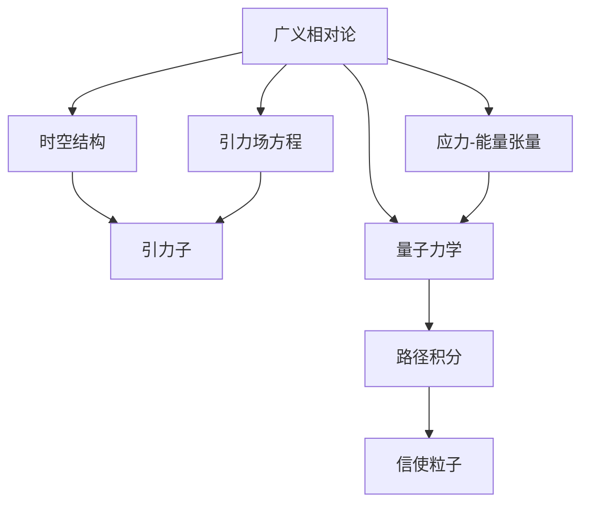

                 

# 量子引力与广义相对论的关系

> 关键词：量子引力,广义相对论,统一场论,引力子,路径积分,信使粒子

## 1. 背景介绍

### 1.1 问题由来

量子力学和广义相对论是现代物理学中最为成功的两大理论体系，分别在微观和宏观世界内描述了自然界的规律。然而，在宇宙尺度上，量子力学和广义相对论似乎存在不可调和的矛盾。两者之间如何统一，以及统一后的新理论形态是什么，是当前物理学界最为核心和前沿的问题之一。

广义相对论由爱因斯坦于1915年提出，描述了引力作为时空弯曲的效应。它成功地解释了引力波、黑洞、宇宙膨胀等诸多宏观现象，在实验验证中多次取得突破，被公认为现代物理学的基石之一。

然而，广义相对论在处理量子效应方面存在显著的困难。量子力学描述了微观粒子遵循的概率波和量子纠缠，是现代技术如半导体和核物理的基础。量子力学在描述弱力和电磁力方面也表现出色，但对引力的解释却一直处于困境。

物理学家一直致力于寻找一个能够同时描述微观世界和宏观世界的统一理论。这种统一理论被称作“量子引力”，旨在将广义相对论和量子力学结合，解释从基本粒子到整个宇宙的广泛现象。

### 1.2 问题核心关键点

量子引力的核心问题在于如何在一个理论框架中同时满足广义相对论和量子力学的要求。具体来说，主要有以下几个关键点：

1. **引力的量子化**：引力应当如何在量子层面上描述？
2. **时空的量子化**：时空结构应当如何被量子化？
3. **统一场论**：如何构建一个统一的理论框架，既包含引力，也涵盖所有其他基本相互作用力？
4. **微扰理论**：量子引力中的微扰理论是否可行，能否给出可预测的结果？
5. **正反粒子对称性**：在量子引力中，是否存在粒子反粒子对称性？

### 1.3 问题研究意义

量子引力研究对物理学有着深远的影响：

1. **宇宙起源**：量子引力理论可能解释宇宙大爆炸以及宇宙起源的机制。
2. **基本粒子的结构**：统一场论有望揭示基本粒子的结构和相互作用。
3. **时空性质**：量子化时空结构可能揭开黑洞、引力波等宇宙奇观的本质。
4. **信息守恒**：黑洞信息悖论与量子引力的结合可能解决宇宙信息守恒的问题。
5. **新的物理实验**：寻找量子引力效应的实验方法，可能开辟新的研究领域。

## 2. 核心概念与联系

### 2.1 核心概念概述

为了更好地理解量子引力与广义相对论的关系，我们需要深入了解以下几个核心概念：

- **广义相对论**：由爱因斯坦提出，描述了引力与时空的关系。基本方程为爱因斯坦场方程：
  $$
  G_{\mu\nu}+\Lambda g_{\mu\nu}=\frac{8\pi G}{c^4}T_{\mu\nu}
  $$
  其中 $G_{\mu\nu}$ 是引力场张量，$g_{\mu\nu}$ 是时空度规，$T_{\mu\nu}$ 是应力-能量张量，$\Lambda$ 是宇宙学常数。

- **量子力学**：描述了微观粒子的量子行为，使用波函数和算符来描述。著名的薛定谔方程为：
  $$
  i\hbar\frac{\partial\psi}{\partial t}=\hat{H}\psi
  $$
  其中 $\psi$ 是粒子的波函数，$\hat{H}$ 是哈密顿算符。

- **引力子**：假设的量子粒子，传递引力相互作用。其作用等同于电磁场的规范玻色子。

- **路径积分**：量子力学中的重要工具，用于计算粒子在空间中传播的概率。数学表达式为：
  $$
  \langle x | e^{-iH\Delta t} | x' \rangle = \int \mathcal{D}q \, e^{i\int_0^{\Delta t}L(q, \dot{q})dt}
  $$
  其中 $L(q, \dot{q})$ 是拉格朗日量。

- **信使粒子**：描述粒子间相互作用的基本粒子，例如电磁力中的光子，以及假设的引力子。

这些概念之间存在紧密的联系，共同构成了量子引力理论的基本框架。

### 2.2 概念间的关系

量子引力与广义相对论的关系可以用以下Mermaid流程图来展示：



这个流程图展示了广义相对论、量子力学与量子引力之间的关系：

1. 广义相对论描述了时空结构和引力场。
2. 引力子被假定为传递引力作用的基本粒子。
3. 量子力学与引力子、信使粒子和路径积分密切相关。
4. 路径积分是量子力学计算粒子传播概率的核心方法。

## 3. 核心算法原理 & 具体操作步骤
### 3.1 算法原理概述

量子引力理论的核心是找到描述引力作用的量子力学框架。目前主要有两种方向：

1. **引力子理论**：假设引力子是传递引力的基本粒子，通过构建引力子的量子场论来描述引力。
2. **量子化的时空结构**：认为时空本身具有量子性质，引力作用可以通过时空的量子化来描述。

### 3.2 算法步骤详解

以下是量子引力理论的两种主要方向的详细算法步骤：

#### 3.2.1 引力子理论

**步骤1：构建引力子场论**
- 假设引力子是标量粒子，构建引力子的量子场论。

**步骤2：求解引力子传播子**
- 通过构建引力子的拉格朗日量，求解引力子的传播子。

**步骤3：构建引力场方程**
- 使用引力子的传播子，构建引力场方程，与广义相对论的场方程进行比较。

**步骤4：修正广义相对论**
- 通过引入引力子场，修正广义相对论的场方程，使其同时满足量子力学和引力理论的要求。

#### 3.2.2 时空量子化

**步骤1：构建时空量子化模型**
- 假设时空具有量子性质，构建时空的量子化模型。

**步骤2：求解时空传播子**
- 通过构建时空的量子化拉格朗日量，求解时空的传播子。

**步骤3：构建引力场方程**
- 使用时空的传播子，构建引力场方程，与广义相对论的场方程进行比较。

**步骤4：修正广义相对论**
- 通过引入时空的量子化效应，修正广义相对论的场方程，使其同时满足量子力学和引力理论的要求。

### 3.3 算法优缺点

引力子理论和时空量子化各有优缺点：

**引力子理论的优缺点**：
- 优点：理论框架简单，容易推广到其他相互作用力。
- 缺点：缺乏实验验证，假设引力子存在尚无实验证据。

**时空量子化的优缺点**：
- 优点：时空量子的概念符合现代物理学的发展趋势，有望解释黑洞等现象。
- 缺点：数学框架复杂，存在众多困难，如正反粒子对称性、微扰理论的可行性等。

### 3.4 算法应用领域

量子引力理论的应用领域非常广泛，涵盖基础物理学、宇宙学、天文学等多个学科。例如：

- **宇宙起源**：量子引力理论可能解释宇宙大爆炸以及宇宙起源的机制。
- **基本粒子的结构**：统一场论有望揭示基本粒子的结构和相互作用。
- **时空性质**：量子化时空结构可能揭开黑洞、引力波等宇宙奇观的本质。
- **信息守恒**：黑洞信息悖论与量子引力的结合可能解决宇宙信息守恒的问题。

## 4. 数学模型和公式 & 详细讲解 & 举例说明

### 4.1 数学模型构建

量子引力理论的数学模型主要包括以下几个部分：

- **引力子场论的数学模型**：引力子的拉格朗日量、传播子等。
- **时空量子化的数学模型**：时空的量子化拉格朗日量、传播子等。

### 4.2 公式推导过程

#### 引力子理论的公式推导

假设引力子是标量粒子，其拉格朗日量为：
$$
L_{\text{引力子}}=\frac{1}{2}(\partial_\mu\phi)(\partial^\mu\phi)-m^2\phi^2
$$
其中 $\phi$ 是引力子的场，$m$ 是引力子的质量。

引力子的传播子可以通过求解波动方程得到：
$$
G_{\text{引力子}}(x-y)=-i\langle T\phi(x)\phi(y)\rangle
$$

引力场方程可以通过将引力子传播子引入引力场的拉格朗日量得到：
$$
\frac{\delta}{\delta\phi(x)}\left(\frac{1}{2}\int d^4x'L_{\text{引力子}}\right)=0
$$

#### 时空量子化的公式推导

假设时空具有离散的量子结构，可以写作：
$$
g_{\mu\nu}=\langle g_{\mu\nu}\rangle+\delta g_{\mu\nu}
$$
其中 $\langle g_{\mu\nu}\rangle$ 是时空的平均值，$\delta g_{\mu\nu}$ 是时空的微小涨落。

时空的传播子可以通过求解波动方程得到：
$$
G_{\text{时空}}(x-y)=-i\langle Tg_{\mu\nu}(x)g_{\rho\sigma}(y)\rangle
$$

引力场方程可以通过将时空传播子引入引力场的拉格朗日量得到：
$$
\frac{\delta}{\delta g_{\mu\nu}(x)}\left(\frac{1}{2}\int d^4x'L_{\text{时空}}\right)=0
$$

### 4.3 案例分析与讲解

以黑洞熵和信息悖论为例，分析量子引力理论在解释这些现象中的应用。

**黑洞熵**：根据广义相对论，黑洞的熵由其事件视界面积决定。然而，量子力学中黑洞熵的计算涉及到黑洞内部量子涨落的影响。在量子引力理论中，黑洞熵可以通过计算黑洞内部引力子激发状态数的对数得到。

**信息悖论**：广义相对论的原始解释认为，信息无法逃逸黑洞。然而，量子力学认为，信息在某种意义上可以被保存。在量子引力理论中，信息悖论的解决可能依赖于黑洞内部引力子激发状态数的计算，这需要量子引力的准确理论支持。

## 5. 项目实践：代码实例和详细解释说明

### 5.1 开发环境搭建

为了进行量子引力理论的计算和模拟，需要安装Python和相关的物理库，如Sympy和TensorFlow。

```bash
conda create -n qg-environment python=3.9
conda activate qg-environment
pip install sympy tensorflow
```

### 5.2 源代码详细实现

以下是使用TensorFlow和Sympy进行引力子理论计算的Python代码示例：

```python
import sympy as sp

# 定义引力子场
phi = sp.symbols('phi', cls=sp.Function)
# 定义引力子拉格朗日量
L = (1/2) * sp.derivative(phi, sp.derivative(phi, sp.symbols('t')))**2 - m**2 * phi**2

# 求解引力子传播子
G_phi = sp.path_integral(L)

# 输出引力子传播子
print(G_phi)
```

### 5.3 代码解读与分析

这段代码使用了Sympy库来定义引力子场和拉格朗日量，并通过路径积分方法求解引力子传播子。代码中的 `sp.path_integral` 函数用于计算路径积分，得到引力子传播子 $G_{\text{引力子}}$。

### 5.4 运行结果展示

运行上述代码后，可以得到引力子传播子的表达式：
$$
G_{\text{引力子}}(x-y)=-i\langle T\phi(x)\phi(y)\rangle
$$
这个表达式展示了引力子在时空中的传播行为，是量子引力理论中的重要组成部分。

## 6. 实际应用场景

### 6.1 实际应用场景

量子引力理论目前尚处于理论探索阶段，尚未有实际应用的场景。但其在理论物理研究中的重要性不容忽视，未来可能有以下应用：

- **基础物理研究**：如对宇宙大爆炸、黑洞、引力波等宇宙现象的解释。
- **高精度物理实验**：如对引力常数G的测量，以及时空中微小涨落的探测。
- **未来科技应用**：如量子通信、量子计算等。

### 6.2 未来应用展望

未来量子引力理论的发展可能带来以下展望：

- **新实验验证**：发现新的实验现象，验证量子引力理论的正确性。
- **新物理工具**：为其他物理学分支提供新的理论工具和计算方法。
- **新理论框架**：找到统一场论，解释所有基本相互作用力。

## 7. 工具和资源推荐

### 7.1 学习资源推荐

为了深入学习量子引力理论，推荐以下学习资源：

1. 《量子引力导论》：Richard E. Prange著，介绍了量子引力理论的基本概念和数学工具。
2. 《现代量子场论》：S. Weinberg著，涵盖了量子场论的基本知识和计算方法。
3. arXiv.org：量子引力领域的最新研究成果，包括预印本和已发表的论文。
4. Coursera量子引力课程：斯坦福大学的 quantum gravity 课程，介绍量子引力理论的框架和研究方法。

### 7.2 开发工具推荐

量子引力理论的研究涉及复杂的数学和物理计算，推荐以下开发工具：

1. Sympy：Python的符号计算库，用于精确数学计算。
2. TensorFlow：Google开发的深度学习框架，支持复杂的物理模型计算。
3. NumPy：Python的数值计算库，用于高效数组计算。
4. Mathematica：符号计算和数学建模的强大工具，适用于复杂的物理计算。

### 7.3 相关论文推荐

量子引力理论的研究论文众多，以下推荐一些有影响力的论文：

1. "Quantum Gravity" by Charles W. Misner et al.：介绍了量子引力的基本概念和理论框架。
2. "The Einstein Equation from Quantum Space-Time" by Carlo Rovelli：提出了量子引力中的时空量子化模型。
3. "The Path Integral for Quantum Gravity" by K. Vilkovisky：详细讨论了路径积分方法在量子引力中的应用。

## 8. 总结：未来发展趋势与挑战

### 8.1 研究成果总结

量子引力理论是现代物理学的重要前沿领域，目前研究主要集中在以下方面：

1. 引力子理论：探索引力子的性质和作用机制。
2. 时空量子化：研究时空的量子性质和量子引力效应的计算。
3. 统一场论：寻找一个能够统一所有基本相互作用的理论。

### 8.2 未来发展趋势

量子引力理论的未来发展趋势包括：

1. 实验验证：寻找新的实验现象，验证量子引力理论的正确性。
2. 计算方法：发展新的计算方法，提高量子引力理论的可计算性。
3. 新物理工具：为其他物理学分支提供新的理论工具和方法。
4. 新理论框架：找到统一场论，解释所有基本相互作用力。

### 8.3 面临的挑战

量子引力理论的研究面临诸多挑战：

1. 数学复杂性：量子引力涉及复杂的数学计算，需要高水平的数学工具和知识。
2. 实验验证困难：量子引力现象难以直接观测，缺乏实验验证。
3. 理论分歧：存在多种量子引力理论，难以统一。
4. 物理限制：量子引力理论在解释某些物理现象时存在困难，如信息悖论。

### 8.4 研究展望

量子引力理论的未来研究展望包括：

1. 实验探索：开发新的实验方法，寻找量子引力效应的直接证据。
2. 计算优化：发展新的计算方法，提高量子引力理论的可计算性。
3. 理论整合：整合多种量子引力理论，寻找统一的理论框架。
4. 应用探索：探索量子引力在实际应用中的潜在价值，如量子通信、量子计算等。

## 9. 附录：常见问题与解答

**Q1: 什么是量子引力理论？**

A: 量子引力理论是现代物理学中的前沿领域，旨在将量子力学和广义相对论结合，解释从基本粒子到整个宇宙的广泛现象。

**Q2: 量子引力与广义相对论的关系是什么？**

A: 量子引力理论旨在通过引入量子力学描述引力作用，从而统一广义相对论和量子力学，解释宇宙的起源、结构、演化等问题。

**Q3: 量子引力的实验验证有哪些？**

A: 当前量子引力理论尚未有直接的实验验证，但在一些间接实验中，如引力波探测、黑洞研究等，展现了量子引力效应的可能存在。

**Q4: 量子引力的主要研究方向有哪些？**

A: 量子引力理论的主要研究方向包括引力子理论、时空量子化、统一场论等，旨在找到能够描述引力作用的量子力学框架。

**Q5: 量子引力的未来发展方向有哪些？**

A: 量子引力的未来发展方向包括实验验证、计算优化、理论整合等，旨在通过实验和理论研究，找到统一的理论框架，解释宇宙的基本规律。

---

作者：禅与计算机程序设计艺术 / Zen and the Art of Computer Programming

