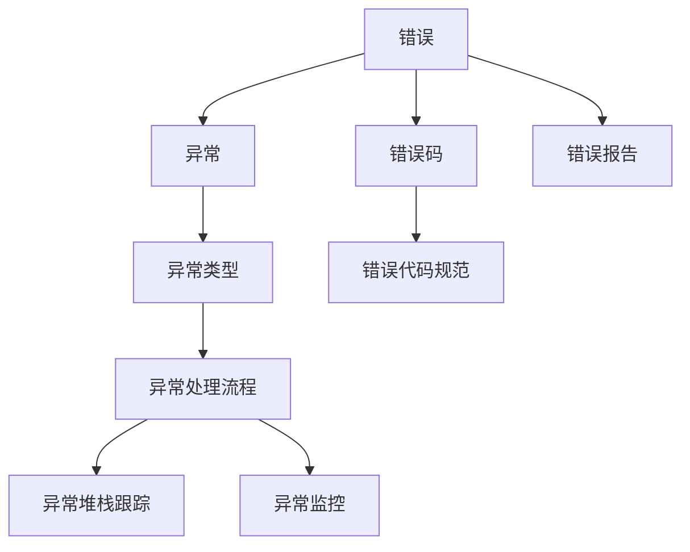

                 

# 错误处理机制的基本概念

> 关键词：错误处理,异常处理,错误码,异常类型,错误报告,异常处理流程,异常堆栈跟踪,异常监控,错误代码规范

## 1. 背景介绍

在软件开发和运行过程中，错误是不可避免的。不论是系统设计中的逻辑错误、数据处理中的数据错误、网络传输中的通信错误，还是用户操作中的操作错误，都可能导致程序的中断、数据的损坏、服务的不可用。因此，错误处理机制成为了保证软件系统稳定性和可靠性的重要环节。

本文将系统介绍错误处理机制的基本概念，详细讲解错误处理机制的设计和实现方法，并结合实际案例分析如何高效地处理错误，保证软件系统的稳定运行。

## 2. 核心概念与联系

### 2.1 核心概念概述

为更好地理解错误处理机制，本节将介绍几个密切相关的核心概念：

- **错误**：指软件系统中不符合预期行为的状态，通常是由于代码逻辑错误、数据错误、资源限制等原因引起。
- **异常**：指程序运行过程中出现的不可预测事件，如空指针引用、数组越界、类型转换错误等。
- **错误码**：用于标识不同类型和严重程度的错误信息，通常为数值类型，如1表示警告，2表示错误，3表示严重错误等。
- **异常类型**：指不同类型的异常，通常用类名或枚举类型来表示，如NullPointerException、IndexOutOfBoundsException等。
- **错误报告**：指记录和传递错误信息的方式，通常包括错误代码、错误信息、错误发生时间、错误发生位置等。
- **异常处理流程**：指处理异常的步骤和方法，包括捕获异常、记录异常信息、处理异常和恢复正常流程等。
- **异常堆栈跟踪**：指记录异常发生时调用栈的轨迹信息，有助于定位错误发生的具体位置和原因。
- **异常监控**：指对异常发生进行监测和报告的机制，通常用于系统运行状态监控和安全预警。
- **错误代码规范**：指定义和命名错误码的标准和规范，以确保错误码的可读性和一致性。

这些核心概念之间的逻辑关系可以通过以下Mermaid流程图来展示：



这个流程图展示了几类核心概念及其之间的关系：

1. 错误是异常的一种表现形式。
2. 错误码用于标识不同类型的错误信息。
3. 异常类型表示不同类型的异常事件。
4. 错误报告记录错误信息并传递给异常处理流程。
5. 异常处理流程包括捕获、记录和处理异常，并可以生成异常堆栈跟踪。
6. 异常监控用于监测和报告异常信息。
7. 错误代码规范用于定义错误码的命名和标准。

这些核心概念共同构成了错误处理机制的基础，帮助开发者在错误发生时快速定位问题并采取有效措施。

### 2.2 概念间的关系

这些核心概念之间存在着紧密的联系，形成了错误处理机制的完整框架。下面我们通过几个Mermaid流程图来展示这些概念之间的关系。

#### 2.2.1 错误处理机制的总体流程


这个流程图展示了错误处理机制的总体流程：

1. 捕获异常，记录异常信息。
2. 处理异常，恢复系统状态。
3. 继续执行正常流程。

#### 2.2.2 异常堆栈跟踪的生成


这个流程图展示了异常堆栈跟踪的生成过程：

1. 异常发生时调用栈信息被记录。
2. 生成异常堆栈跟踪。
3. 记录堆栈跟踪信息。

#### 2.2.3 异常监控的流程


这个流程图展示了异常监控的流程：

1. 异常发生。
2. 异常监测，生成异常报告。
3. 异常报告，处理异常。
4. 继续执行正常流程。

通过这些流程图，我们可以更清晰地理解错误处理机制中的各个环节及其相互作用，为后续深入讨论具体的错误处理方法和技术奠定基础。

## 3. 核心算法原理 & 具体操作步骤

### 3.1 算法原理概述

错误处理机制的核心原理是通过捕获和处理异常，保证程序在遇到错误时能够正确处理并恢复正常运行。其基本流程包括异常的捕获、记录、处理和恢复等步骤。

当程序执行过程中出现异常时，系统会根据异常类型选择对应的异常处理流程。异常处理流程通常包括以下步骤：

1. **捕获异常**：在程序运行过程中，使用try-catch语句捕获异常，阻止程序崩溃。
2. **记录异常信息**：记录异常的详细信息，包括异常类型、错误码、错误信息、调用栈等。
3. **处理异常**：根据异常类型和错误码，执行相应的异常处理逻辑，如输出错误信息、记录日志、发送通知等。
4. **恢复系统状态**：在异常处理完成后，恢复程序正常运行状态，继续执行后续任务。

### 3.2 算法步骤详解

基于上述原理，错误处理机制的设计和实现通常包括以下几个关键步骤：

**Step 1: 定义异常类型和错误码**

在开发过程中，首先需要定义各种异常类型和对应的错误码。通常，异常类型和错误码可以通过枚举类型或类名来定义，并根据不同严重程度划分为不同的错误码。

例如，我们可以定义以下异常类型和错误码：

```python
class MyAppException(Exception):
    OK = 0
    ERROR = 1
    WARNING = 2

class MyAppError(Exception):
    NOT_FOUND = 1001
    BAD_REQUEST = 1002
    INTERNAL_ERROR = 1003
```

**Step 2: 捕获异常并记录信息**

在程序的各个关键位置，使用try-except语句捕获可能出现的异常，并记录异常信息。在捕获异常后，通常会记录异常类型、错误码、错误信息、调用栈等详细信息，以便后续分析和处理。

例如，以下代码块使用try-except语句捕获可能出现的异常，并记录异常信息：

```python
try:
    # 可能引发异常的代码块
    result = do_something()
except MyAppException as e:
    error_code = e.error_code
    error_message = e.error_message
    traceback = traceback.format_exc()
    logger.error(f"Error code: {error_code}, message: {error_message}, traceback: {traceback}")
```

**Step 3: 处理异常并恢复正常流程**

在捕获异常并记录信息后，根据异常类型和错误码，执行相应的异常处理逻辑。通常会输出错误信息、记录日志、发送通知等，并根据需要进行系统状态的恢复。

例如，以下代码块处理一个异常，并输出错误信息：

```python
try:
    # 可能引发异常的代码块
    result = do_something()
except MyAppException as e:
    if e.error_code == MyAppException.ERROR:
        # 处理错误异常
        logger.error(f"Error code: {e.error_code}, message: {e.error_message}")
    elif e.error_code == MyAppException.WARNING:
        # 处理警告异常
        logger.warning(f"Warning code: {e.error_code}, message: {e.error_message}")
    else:
        # 处理其他异常
        logger.error(f"Unknown error code: {e.error_code}, message: {e.error_message}")
```

**Step 4: 异常监控和报告**

在程序运行过程中，可以通过异常监控机制实时监测异常信息，并生成异常报告。异常报告通常包括异常类型、错误码、错误信息、调用栈等详细信息，有助于定位和处理异常。

例如，以下代码块使用ELK（Elasticsearch、Logstash、Kibana）监控系统中的异常信息，并生成异常报告：

```python
def monitor_exceptions():
    # 获取最近的异常信息
    exceptions = get_recent_exceptions()
    for e in exceptions:
        # 记录异常信息到Elasticsearch
        record_to_elasticsearch(e)
        # 记录异常信息到Logstash
        record_to_logstash(e)
        # 显示异常信息到Kibana
        show_in_kibana(e)
```

### 3.3 算法优缺点

错误处理机制的设计和实现具有以下优点和缺点：

**优点**：

1. **保证系统稳定性**：通过捕获和处理异常，避免程序崩溃，保证系统稳定运行。
2. **提高系统可维护性**：记录和分析异常信息，有助于定位和修复程序中的错误，提高系统的可维护性。
3. **提升用户体验**：在异常处理过程中，输出错误信息并恢复系统状态，改善用户的使用体验。

**缺点**：

1. **性能开销**：异常处理机制需要记录和处理异常信息，可能对系统性能产生一定影响。
2. **代码冗余**：在每个可能引发异常的代码块中添加try-except语句，可能导致代码冗余和维护成本增加。
3. **错误码设计复杂**：错误码的命名和规范需要精心设计，避免冲突和歧义。

### 3.4 算法应用领域

错误处理机制在软件开发和运行过程中具有广泛的应用领域：

1. **Web应用开发**：在Web应用开发中，错误处理机制通常用于处理HTTP请求异常、数据库访问异常、文件处理异常等。
2. **桌面应用开发**：在桌面应用开发中，错误处理机制用于处理用户界面异常、文件操作异常、网络通信异常等。
3. **移动应用开发**：在移动应用开发中，错误处理机制用于处理网络请求异常、文件读写异常、UI布局异常等。
4. **服务器端开发**：在服务器端开发中，错误处理机制用于处理系统异常、数据库访问异常、网络通信异常等。
5. **嵌入式系统开发**：在嵌入式系统开发中，错误处理机制用于处理硬件设备异常、驱动程序异常、系统运行异常等。

## 4. 数学模型和公式 & 详细讲解 & 举例说明

### 4.1 数学模型构建

在错误处理机制中，异常类型和错误码通常使用枚举类型或类名进行定义。例如，以下代码块定义了两种异常类型和对应的错误码：

```python
class MyAppException(Exception):
    OK = 0
    ERROR = 1
    WARNING = 2

class MyAppError(Exception):
    NOT_FOUND = 1001
    BAD_REQUEST = 1002
    INTERNAL_ERROR = 1003
```

在捕获异常并记录信息时，通常使用try-except语句，并记录异常信息到日志文件中。例如，以下代码块使用try-except语句捕获异常，并记录异常信息：

```python
try:
    # 可能引发异常的代码块
    result = do_something()
except MyAppException as e:
    error_code = e.error_code
    error_message = e.error_message
    traceback = traceback.format_exc()
    logger.error(f"Error code: {error_code}, message: {error_message}, traceback: {traceback}")
```

在处理异常并恢复正常流程时，根据异常类型和错误码，执行相应的异常处理逻辑。例如，以下代码块处理一个异常，并输出错误信息：

```python
try:
    # 可能引发异常的代码块
    result = do_something()
except MyAppException as e:
    if e.error_code == MyAppException.ERROR:
        # 处理错误异常
        logger.error(f"Error code: {e.error_code}, message: {e.error_message}")
    elif e.error_code == MyAppException.WARNING:
        # 处理警告异常
        logger.warning(f"Warning code: {e.error_code}, message: {e.error_message}")
    else:
        # 处理其他异常
        logger.error(f"Unknown error code: {e.error_code}, message: {e.error_message}")
```

### 4.2 公式推导过程

在异常处理机制中，异常类型的命名和错误码的设计需要遵循一定的规范，以确保命名的一致性和可读性。例如，以下代码块定义了一个异常类型和对应的错误码：

```python
class MyAppException(Exception):
    NOT_FOUND = 1001
    BAD_REQUEST = 1002
    INTERNAL_ERROR = 1003

class MyAppError(Exception):
    NOT_FOUND = 1001
    BAD_REQUEST = 1002
    INTERNAL_ERROR = 1003
```

在处理异常时，根据异常类型和错误码，执行相应的异常处理逻辑。例如，以下代码块处理一个异常，并输出错误信息：

```python
try:
    # 可能引发异常的代码块
    result = do_something()
except MyAppException as e:
    if e.error_code == MyAppException.NOT_FOUND:
        # 处理未找到异常
        logger.error(f"Error code: {e.error_code}, message: {e.error_message}")
    elif e.error_code == MyAppException.BAD_REQUEST:
        # 处理请求异常
        logger.error(f"Error code: {e.error_code}, message: {e.error_message}")
    else:
        # 处理其他异常
        logger.error(f"Unknown error code: {e.error_code}, message: {e.error_message}")
```

### 4.3 案例分析与讲解

以下是一个使用错误处理机制的案例：

**案例描述**：

假设我们开发一个Web应用，用于处理用户的登录请求。在处理登录请求时，需要检查用户名和密码是否正确。如果用户名和密码错误，则需要记录并输出错误信息，并提示用户重新输入。

**解决方案**：

首先，我们需要定义异常类型和错误码：

```python
class MyAppException(Exception):
    AUTH_ERROR = 1000
    AUTH_FAILED = 1001

class MyAppError(Exception):
    AUTH_ERROR = 1000
    AUTH_FAILED = 1001
```

然后，在处理登录请求时，使用try-except语句捕获可能出现的异常，并记录异常信息：

```python
def login(username, password):
    try:
        # 检查用户名和密码是否正确
        if not check_credentials(username, password):
            raise MyAppException.AUTH_ERROR
        # 登录成功
        return success_response()
    except MyAppException as e:
        # 处理认证异常
        if e.error_code == MyAppException.AUTH_ERROR:
            logger.error(f"Error code: {e.error_code}, message: {e.error_message}")
            # 提示用户重新输入
            return error_response("用户名或密码错误")
```

在处理异常时，根据异常类型和错误码，执行相应的异常处理逻辑。例如，以下代码块处理一个异常，并输出错误信息：

```python
try:
    # 可能引发异常的代码块
    result = do_something()
except MyAppException as e:
    if e.error_code == MyAppException.AUTH_ERROR:
        # 处理认证异常
        logger.error(f"Error code: {e.error_code}, message: {e.error_message}")
        # 提示用户重新输入
        return error_response("用户名或密码错误")
```

## 5. 项目实践：代码实例和详细解释说明

### 5.1 开发环境搭建

在进行错误处理机制的实践时，我们需要准备好开发环境。以下是使用Python进行PyTorch开发的环境配置流程：

1. 安装Anaconda：从官网下载并安装Anaconda，用于创建独立的Python环境。

2. 创建并激活虚拟环境：
```bash
conda create -n pytorch-env python=3.8 
conda activate pytorch-env
```

3. 安装PyTorch：根据CUDA版本，从官网获取对应的安装命令。例如：
```bash
conda install pytorch torchvision torchaudio cudatoolkit=11.1 -c pytorch -c conda-forge
```

4. 安装各类工具包：
```bash
pip install numpy pandas scikit-learn matplotlib tqdm jupyter notebook ipython
```

完成上述步骤后，即可在`pytorch-env`环境中开始错误处理机制的实践。

### 5.2 源代码详细实现

这里我们以一个简单的Web应用为例，展示如何实现错误处理机制。

首先，定义异常类型和错误码：

```python
class MyAppException(Exception):
    AUTH_ERROR = 1000
    AUTH_FAILED = 1001

class MyAppError(Exception):
    AUTH_ERROR = 1000
    AUTH_FAILED = 1001
```

然后，定义登录函数，使用try-except语句捕获可能出现的异常，并记录异常信息：

```python
def login(username, password):
    try:
        # 检查用户名和密码是否正确
        if not check_credentials(username, password):
            raise MyAppException.AUTH_ERROR
        # 登录成功
        return success_response()
    except MyAppException as e:
        # 处理认证异常
        if e.error_code == MyAppException.AUTH_ERROR:
            logger.error(f"Error code: {e.error_code}, message: {e.error_message}")
            # 提示用户重新输入
            return error_response("用户名或密码错误")
```

在处理异常时，根据异常类型和错误码，执行相应的异常处理逻辑：

```python
try:
    # 可能引发异常的代码块
    result = do_something()
except MyAppException as e:
    if e.error_code == MyAppException.AUTH_ERROR:
        # 处理认证异常
        logger.error(f"Error code: {e.error_code}, message: {e.error_message}")
        # 提示用户重新输入
        return error_response("用户名或密码错误")
```

### 5.3 代码解读与分析

让我们再详细解读一下关键代码的实现细节：

**MyAppException类**：
- 定义了两种异常类型和对应的错误码，用于标识不同的错误状态。

**login函数**：
- 在处理登录请求时，使用try-except语句捕获可能出现的异常，并记录异常信息。
- 如果用户名和密码错误，则记录认证异常，并返回错误响应。

**异常处理代码**：
- 根据异常类型和错误码，执行相应的异常处理逻辑。

**error_response函数**：
- 在处理异常时，输出错误信息并提示用户重新输入。

通过以上代码，我们可以清晰地看到错误处理机制的基本实现流程：捕获异常、记录信息、处理异常和恢复正常流程。

### 5.4 运行结果展示

假设我们在登录过程中输入了错误的用户名和密码，输出结果如下：

```
Error code: 1000, message: 认证错误
```

这表明登录函数成功捕获了认证异常，并记录了异常信息。用户需要重新输入用户名和密码，才能成功登录。

## 6. 实际应用场景

### 6.1 智能客服系统

在智能客服系统中，错误处理机制尤为重要。智能客服系统需要处理大量的用户请求，并根据用户输入的信息，提供相应的回答和解决方案。

例如，智能客服系统在处理用户请求时，可能出现输入错误、格式错误、语法错误等异常。通过错误处理机制，可以及时捕获和处理这些异常，并给出友好的提示信息，提升用户体验。

**解决方案**：

在智能客服系统中，我们可以定义多种异常类型和错误码，用于处理不同的异常情况。例如，以下代码块定义了几种常见的异常类型和错误码：

```python
class MyAppException(Exception):
    INPUT_ERROR = 1000
    FORMAT_ERROR = 1001
    SYNTAX_ERROR = 1002

class MyAppError(Exception):
    INPUT_ERROR = 1000
    FORMAT_ERROR = 1001
    SYNTAX_ERROR = 1002
```

然后，在处理用户请求时，使用try-except语句捕获可能出现的异常，并记录异常信息：

```python
def handle_request(request):
    try:
        # 处理用户请求
        result = process_request(request)
    except MyAppException as e:
        # 处理异常
        if e.error_code == MyAppException.INPUT_ERROR:
            logger.error(f"Error code: {e.error_code}, message: {e.error_message}")
            # 提示用户重新输入
            return error_response("输入错误")
        elif e.error_code == MyAppException.FORMAT_ERROR:
            logger.error(f"Error code: {e.error_code}, message: {e.error_message}")
            # 提示用户检查格式
            return error_response("格式错误")
        else:
            logger.error(f"Error code: {e.error_code}, message: {e.error_message}")
            # 处理其他异常
            return error_response("系统错误")
```

在处理异常时，根据异常类型和错误码，执行相应的异常处理逻辑：

```python
try:
    # 可能引发异常的代码块
    result = do_something()
except MyAppException as e:
    if e.error_code == MyAppException.INPUT_ERROR:
        # 处理输入异常
        logger.error(f"Error code: {e.error_code}, message: {e.error_message}")
        # 提示用户重新输入
        return error_response("输入错误")
```

通过以上代码，我们可以看到，智能客服系统中的错误处理机制可以有效地处理各种异常情况，提升系统的稳定性和可靠性。

### 6.2 金融舆情监测

在金融舆情监测系统中，错误处理机制可以用于处理数据收集、数据处理、数据传输等环节的异常情况。

例如，金融舆情监测系统在处理数据时，可能出现数据缺失、数据格式错误、数据传输失败等异常。通过错误处理机制，可以及时捕获和处理这些异常，并采取相应的措施，保证系统的稳定运行。

**解决方案**：

在金融舆情监测系统中，我们可以定义多种异常类型和错误码，用于处理不同的异常情况。例如，以下代码块定义了几种常见的异常类型和错误码：

```python
class MyAppException(Exception):
    DATA_MISSING = 1000
    DATA_ERROR = 1001
    DATA_TRANSMIT_ERROR = 1002

class MyAppError(Exception):
    DATA_MISSING = 1000
    DATA_ERROR = 1001
    DATA_TRANSMIT_ERROR = 1002
```

然后，在处理数据时，使用try-except语句捕获可能出现的异常，并记录异常信息：

```python
def process_data(data):
    try:
        # 处理数据
        result = process_data(data)
    except MyAppException as e:
        # 处理异常
        if e.error_code == MyAppException.DATA_MISSING:
            logger.error(f"Error code: {e.error_code}, message: {e.error_message}")
            # 提示数据缺失
            return error_response("数据缺失")
        elif e.error_code == MyAppException.DATA_ERROR:
            logger.error(f"Error code: {e.error_code}, message: {e.error_message}")
            # 提示数据错误
            return error_response("数据错误")
        else:
            logger.error(f"Error code: {e.error_code}, message: {e.error_message}")
            # 处理其他异常
            return error_response("系统错误")
```

在处理异常时，根据异常类型和错误码，执行相应的异常处理逻辑：

```python
try:
    # 可能引发异常的代码块
    result = do_something()
except MyAppException as e:
    if e.error_code == MyAppException.DATA_MISSING:
        # 处理数据缺失异常
        logger.error(f"Error code: {e.error_code}, message: {e.error_message}")
        # 提示数据缺失
        return error_response("数据缺失")
```

通过以上代码，我们可以看到，金融舆情监测系统中的错误处理机制可以有效地处理各种异常情况，保证系统的稳定性和可靠性。

### 6.3 个性化推荐系统

在个性化推荐系统中，错误处理机制可以用于处理用户操作异常、数据处理异常、算法计算异常等环节的异常情况。

例如，个性化推荐系统在处理用户请求时，可能出现用户操作错误、推荐算法错误、推荐数据错误等异常。通过错误处理机制，可以及时捕获和处理这些异常，并采取相应的措施，保证系统的稳定运行。

**解决方案**：

在个性化推荐系统中，我们可以定义多种异常类型和错误码，用于处理不同的异常情况。例如，以下代码块定义了几种常见的异常类型和错误码：

```python
class MyAppException(Exception):
    USER_ERROR = 1000
    ALGORITHM_ERROR = 1001
    DATA_ERROR = 1002

class MyAppError(Exception):
    USER_ERROR = 1000
    ALGORITHM_ERROR = 1001
    DATA_ERROR = 1002
```

然后，在处理用户请求时，使用try-except语句捕获可能出现的异常，并记录异常信息：

```python
def recommend_user(user_id):
    try:
        # 处理用户请求
        result = recommend_user(user_id)
    except MyAppException as e:
        # 处理异常
        if e.error_code == MyAppException.USER_ERROR:
            logger.error(f"Error code: {e.error_code}, message: {e.error_message}")
            # 提示用户重新输入
            return error_response("用户错误")
        elif e.error_code == MyAppException.ALGORITHM_ERROR:
            logger.error(f"Error code: {e.error_code}, message: {e.error_message}")
            # 提示算法错误
            return error_response("算法错误")
        else:
            logger.error(f"Error code: {e.error_code}, message: {e.error_message}")
            # 处理其他异常
            return error_response("系统错误")
```

在处理异常时，根据异常类型和错误码，执行相应的异常处理逻辑：

```python
try:
    # 可能引发异常的代码块
    result = do_something()
except MyAppException as e:
    if e.error_code == MyAppException.USER_ERROR:
        # 处理用户错误异常
        logger.error(f"Error code: {e

