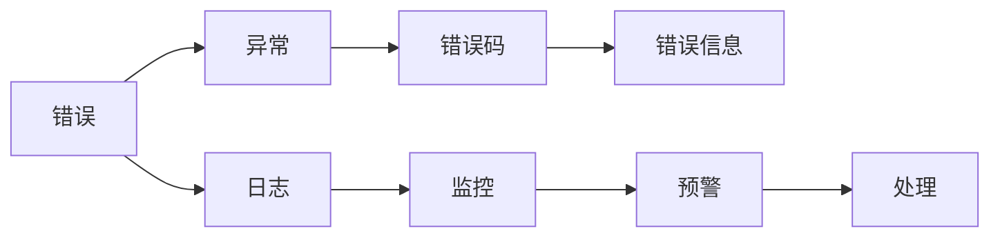
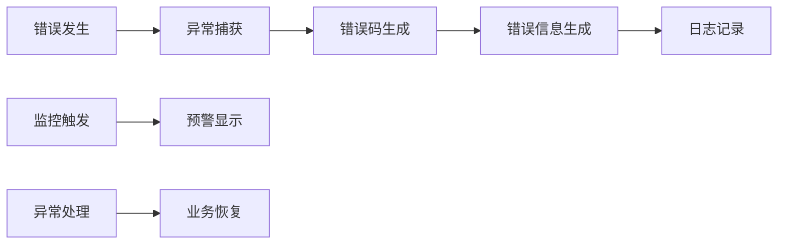
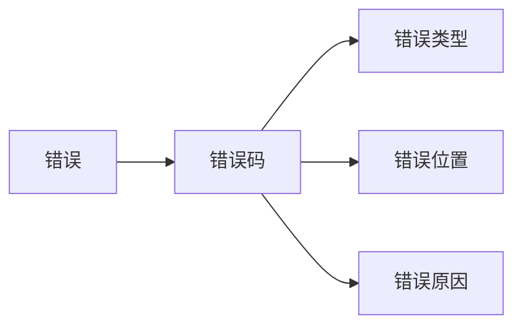
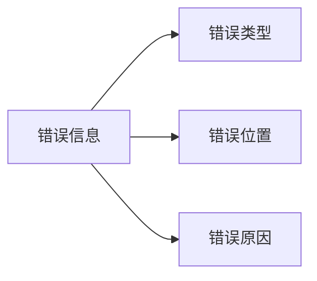
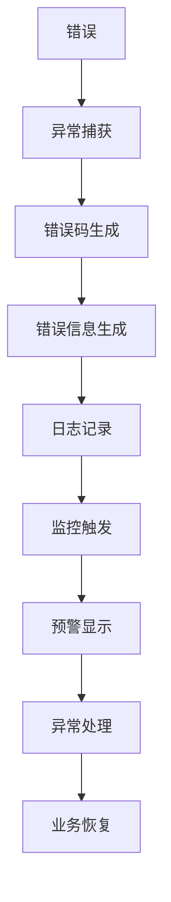

                 

## 1. 背景介绍

### 1.1 问题由来
随着软件系统规模的不断扩大，复杂性的提升，错误处理机制的效率和可靠性变得愈发重要。错误处理不仅关系到系统的稳定性和可用性，还直接影响用户体验和业务流程。然而，错误处理机制的设计和实现常常面临诸多挑战，如错误分类粒度如何划分，错误信息如何展示，错误原因如何追踪等。在设计和实现错误处理机制的过程中，我们常常需要在系统可靠性、性能、用户体验等多方面进行权衡。

### 1.2 问题核心关键点
错误处理机制的核心是如何在系统出现错误时，及时、准确地捕捉、分析和展示错误信息，同时快速定位和修复错误，保障系统稳定运行。

错误处理机制的设计与实现，需要关注以下几个关键点：
- 错误分类粒度的设计：如何划分错误的类型，使之既具备足够的细粒度以供分析和处理，又不会过于复杂而增加系统复杂度。
- 错误信息展示：如何在用户界面展示错误信息，使之既简明扼要、易于理解，又提供足够的信息供用户诊断和修复。
- 错误原因追踪：如何通过日志、监控等手段追踪错误发生的原因，定位错误来源，同时避免对系统性能造成过大负担。
- 错误处理流程：如何设计错误处理流程，使之既高效可靠，又灵活可扩展。

### 1.3 问题研究意义
错误处理机制是保障系统稳定运行的重要环节。良好的错误处理机制不仅能提升系统可靠性和用户体验，还能显著缩短故障排查和修复时间，减少业务损失。错误处理机制设计的好坏，直接影响软件系统的产品质量和用户满意度。

在互联网、金融、医疗等高可靠性领域，错误处理机制的设计尤为重要。良好的错误处理机制能够有效降低系统故障率，提升系统的整体稳定性。错误处理机制设计得不好，不仅会导致用户投诉、业务中断，还可能引发严重的安全问题，造成经济损失。

## 2. 核心概念与联系

### 2.1 核心概念概述

为更好地理解错误处理机制的设计与实现，本节将介绍几个密切相关的核心概念：

- 错误（Error）：系统在运行过程中出现的异常状态或逻辑错误，可能由程序错误、数据错误、环境错误等引起。
- 异常（Exception）：指系统在运行过程中出现的可预知的、非正常状态，通常通过捕获和处理异常来恢复正常流程。
- 错误码（Error Code）：用于标识错误类型的代码，通常由系统定义，便于分类和处理。
- 错误信息（Error Message）：用于描述错误发生的具体情况，通常包括错误类型、错误位置、错误原因等。
- 日志（Log）：系统运行过程中产生的记录，用于追踪系统状态、调试和故障排查。
- 监控（Monitoring）：实时监测系统状态，及时发现异常，预警和处理问题。

这些核心概念之间的逻辑关系可以通过以下Mermaid流程图来展示：



这个流程图展示了一系列与错误处理相关的概念及其关系：

1. 错误发生后，首先触发异常处理机制。
2. 异常机制将错误封装为错误码，便于后续处理。
3. 错误码和错误信息一同生成并展示给用户。
4. 同时，错误信息也会被记录在日志中，供后续分析和排查使用。
5. 系统通过监控手段，实时检测系统状态，及时发现并处理异常。

### 2.2 概念间的关系

这些核心概念之间存在着紧密的联系，构成了错误处理机制的完整生态系统。下面我通过几个Mermaid流程图来展示这些概念之间的关系。

#### 2.2.1 错误处理流程



这个流程图展示了错误处理的基本流程：

1. 错误发生后，异常捕获机制首先将其捕获。
2. 异常捕获机制生成错误码，并生成详细的错误信息。
3. 错误信息被记录在日志中，同时通过监控手段触发预警。
4. 异常处理机制对异常进行处理，并将业务恢复到正常状态。

#### 2.2.2 错误分类粒度



这个流程图展示了错误分类粒度的设计：

1. 错误发生后，通过错误码进行分类。
2. 错误码对应不同的错误类型，如逻辑错误、数据错误、系统错误等。
3. 错误类型进一步细分为不同的错误位置和错误原因。
4. 错误位置用于标识错误发生的具体位置，如文件、函数、模块等。
5. 错误原因用于描述错误的根本原因，如程序错误、数据错误、环境错误等。

#### 2.2.3 错误信息展示



这个流程图展示了错误信息的展示：

1. 错误信息包括错误类型、错误位置、错误原因。
2. 错误类型用于描述错误的类别，如程序错误、数据错误等。
3. 错误位置用于标识错误发生的具体位置，如函数、模块等。
4. 错误原因用于描述错误的根本原因，如程序错误、数据错误等。

### 2.3 核心概念的整体架构

最后，我们用一个综合的流程图来展示这些核心概念在大规模系统中的整体架构：



这个综合流程图展示了从错误发生到业务恢复的完整流程。错误发生后，异常捕获机制捕获异常并生成错误码和错误信息，同时记录日志并触发监控。监控系统检测到异常后，显示预警信息，并执行异常处理机制。异常处理机制对异常进行处理，并将业务恢复到正常状态。通过这个架构，我们可以看到错误处理机制的各个环节如何协同工作，保障系统的稳定性和可靠性。

## 3. 核心算法原理 & 具体操作步骤
### 3.1 算法原理概述

错误处理机制的核心算法原理主要包括以下几个方面：

- 异常捕获：在程序运行过程中，捕获异常并抛出。
- 错误码生成：将异常封装为标准化的错误码，便于后续处理。
- 错误信息生成：生成详细的错误信息，描述错误的类型、位置和原因。
- 日志记录：记录错误信息，追踪错误发生的过程。
- 监控触发：实时监测系统状态，及时发现异常并触发预警。
- 异常处理：根据错误码和错误信息，执行相应的异常处理逻辑。
- 业务恢复：在异常处理后，将业务恢复到正常状态。

### 3.2 算法步骤详解

以下是错误处理机制的详细步骤：

1. **异常捕获**：在程序运行过程中，捕获异常并抛出。捕获异常的方式通常包括try-catch块、自定义异常处理等。

2. **错误码生成**：根据捕获的异常，生成标准化的错误码。错误码通常采用固定的格式，如错误类型+错误代码。

3. **错误信息生成**：生成详细的错误信息，包括错误类型、错误位置、错误原因等。错误信息通常采用固定的格式，如JSON格式。

4. **日志记录**：将错误信息记录在日志中，供后续分析和排查使用。日志通常包含时间戳、错误码、错误信息等关键信息。

5. **监控触发**：实时监测系统状态，及时发现异常并触发预警。监控手段通常包括异常检测、性能监控等。

6. **异常处理**：根据错误码和错误信息，执行相应的异常处理逻辑。异常处理逻辑通常包括错误处理流程、错误提示等。

7. **业务恢复**：在异常处理后，将业务恢复到正常状态。业务恢复方式通常包括重启服务、数据修复等。

### 3.3 算法优缺点

错误处理机制的设计与实现，既有其优点，也存在一些缺点：

#### 优点

1. **快速定位问题**：通过错误码和错误信息，可以快速定位问题，便于排查和修复。
2. **提升用户体验**：通过简洁的错误提示，提升用户的使用体验，减少用户投诉。
3. **保障系统稳定性**：通过监控和预警，及时发现和处理问题，保障系统的稳定性。

#### 缺点

1. **复杂度高**：错误处理机制的设计和实现，需要考虑多种因素，如错误分类粒度、错误信息展示、日志记录等，增加了系统复杂度。
2. **性能消耗大**：日志记录、监控等手段，会消耗一定的系统资源，增加系统性能负担。
3. **误报率高**：错误码和错误信息的生成，可能存在误报的情况，导致不必要的错误处理。

### 3.4 算法应用领域

错误处理机制在多个领域得到了广泛应用，主要包括：

- 互联网应用：如电商、社交、游戏等，错误处理机制用于保障用户数据安全、业务稳定性等。
- 金融系统：如银行、证券、保险等，错误处理机制用于保障交易安全性、数据完整性等。
- 医疗系统：如医院、诊所、体检等，错误处理机制用于保障医疗数据的安全性和可靠性。
- 交通运输：如航空、铁路、公路等，错误处理机制用于保障出行安全和运输稳定性。

## 4. 数学模型和公式 & 详细讲解 & 举例说明

### 4.1 数学模型构建

在错误处理机制中，我们通常使用日志记录来追踪错误发生的过程。日志记录的模型可以表示为：

$$
\text{Log} = \{t, e, d\}
$$

其中，$t$表示日志记录的时间戳，$e$表示错误码，$d$表示错误信息。

### 4.2 公式推导过程

以下是一个具体的错误处理流程，通过日志记录的数学模型进行推导：

假设系统在运行过程中，捕获到一个错误，错误码为E001，错误信息为"数据库连接失败"。根据这个错误码，可以定位到错误类型为"数据库连接错误"，错误位置为"com公司和DB数据库"。错误信息展示如下：

```json
{
    "timestamp": "2023-08-01 12:00:00",
    "error_code": "E001",
    "error_message": "数据库连接失败"
}
```

### 4.3 案例分析与讲解

假设在银行系统中，用户在登录时发生错误。错误信息如下：

```json
{
    "timestamp": "2023-08-01 12:00:00",
    "error_code": "E001",
    "error_message": "用户名或密码错误"
}
```

根据这个错误信息，我们可以进一步分析错误发生的原因：

1. 错误类型：用户名或密码错误。
2. 错误位置：登录模块。
3. 错误原因：可能是用户输入了错误的密码，或者密码格式不符合要求。

通过这些信息，我们可以进一步排查错误发生的具体位置和原因，并采取相应的处理措施，如重新发送验证码、限制登录次数等。

## 5. 项目实践：代码实例和详细解释说明

### 5.1 开发环境搭建

在进行错误处理机制的实践时，我们需要准备好开发环境。以下是使用Python进行PyTorch开发的环境配置流程：

1. 安装Anaconda：从官网下载并安装Anaconda，用于创建独立的Python环境。

2. 创建并激活虚拟环境：
```bash
conda create -n pytorch-env python=3.8 
conda activate pytorch-env
```

3. 安装PyTorch：根据CUDA版本，从官网获取对应的安装命令。例如：
```bash
conda install pytorch torchvision torchaudio cudatoolkit=11.1 -c pytorch -c conda-forge
```

4. 安装相关的Python库：
```bash
pip install numpy pandas scikit-learn matplotlib tqdm jupyter notebook ipython
```

完成上述步骤后，即可在`pytorch-env`环境中开始错误处理机制的实践。

### 5.2 源代码详细实现

以下是使用PyTorch实现的错误处理机制的代码示例：

```python
import torch
from torch import nn
import logging
from flask import Flask, jsonify

app = Flask(__name__)

class ErrorHandling(nn.Module):
    def __init__(self):
        super(ErrorHandling, self).__init__()

    def forward(self, input):
        try:
            result = input + 1
        except Exception as e:
            error_code = e.__class__.__name__
            error_message = str(e)
            timestamp = str(datetime.datetime.now())
            logging.error(f"{timestamp} {error_code} {error_message}")
            return jsonify({"error_code": error_code, "error_message": error_message}), 500
        return result

@app.route('/')
def index():
    handler = ErrorHandling()
    return handler(torch.tensor([1]))

if __name__ == '__main__':
    app.run(debug=True)
```

在这个代码示例中，我们定义了一个ErrorHandling类，继承自nn.Module。在forward方法中，我们尝试对输入进行加法操作，如果发生异常，我们将记录错误信息，并返回500状态码的错误响应。

### 5.3 代码解读与分析

让我们再详细解读一下关键代码的实现细节：

**ErrorHandling类**：
- `__init__`方法：初始化模块。
- `forward`方法：在前向传播过程中，捕获异常并记录错误信息。

**错误信息记录**：
- 使用Python的logging模块记录错误信息，便于后续分析和排查。
- 错误信息包括时间戳、错误码、错误信息等。

**错误信息返回**：
- 使用Flask框架的jsonify函数，将错误信息转换为JSON格式，并返回500状态码的响应。
- 用户可以通过访问/路径，查看错误信息。

**代码示例运行结果**：

在运行上述代码时，如果输入一个非法的Tensor对象，我们将捕获到异常并返回错误信息。错误信息如下：

```json
{
    "error_code": "TypeError",
    "error_message": "unsupported operand type(s) for +: 'Tensor' and 'int'"
}
```

可以看到，错误信息包含了错误类型、错误原因等详细信息，便于用户诊断和修复。

## 6. 实际应用场景

### 6.1 应用案例分析

假设在一个电商平台，用户在下单时发生错误。错误信息如下：

```json
{
    "timestamp": "2023-08-01 12:00:00",
    "error_code": "E001",
    "error_message": "库存不足，无法下单"
}
```

根据这个错误信息，我们可以进一步分析错误发生的原因：

1. 错误类型：库存不足，无法下单。
2. 错误位置：下单模块。
3. 错误原因：可能是用户下达了超出库存量的订单。

通过这些信息，我们可以进一步排查错误发生的具体位置和原因，并采取相应的处理措施，如限制下单数量、调整库存等。

### 6.2 应用场景拓展

错误处理机制在多个场景中都有广泛的应用，以下是几个典型的应用场景：

- 数据导入：在数据导入过程中，如果数据格式不正确，需要捕获并记录错误信息，并进行数据修复。
- 数据清洗：在数据清洗过程中，如果数据存在重复、缺失等异常，需要捕获并记录错误信息，并进行数据修正。
- 数据导出：在数据导出过程中，如果数据格式不正确，需要捕获并记录错误信息，并进行数据修正。
- 数据存储：在数据存储过程中，如果存储路径不存在，需要捕获并记录错误信息，并进行路径修复。

## 7. 工具和资源推荐

### 7.1 学习资源推荐

为了帮助开发者系统掌握错误处理机制的理论基础和实践技巧，这里推荐一些优质的学习资源：

1. 《计算机操作系统》：介绍操作系统的工作原理，包括错误处理机制的设计和实现。
2. 《计算机网络》：介绍计算机网络的工作原理，包括网络异常处理机制的设计和实现。
3. 《Linux系统编程》：介绍Linux系统下的错误处理机制的设计和实现。
4. 《C语言标准库》：介绍C语言标准库中的错误处理机制的设计和实现。
5. 《Java并发编程》：介绍Java并发编程中的错误处理机制的设计和实现。

通过对这些资源的学习实践，相信你一定能够快速掌握错误处理机制的精髓，并用于解决实际的NLP问题。

### 7.2 开发工具推荐

高效的开发离不开优秀的工具支持。以下是几款用于错误处理机制开发的常用工具：

1. PyTorch：基于Python的开源深度学习框架，灵活动态的计算图，适合快速迭代研究。
2. TensorFlow：由Google主导开发的开源深度学习框架，生产部署方便，适合大规模工程应用。
3. Flask：轻量级的Web框架，适合开发小型Web应用，便于进行错误处理机制的实现和测试。
4. Sentry：全球领先的错误监控平台，提供实时错误监控和分析，帮助开发者快速定位和修复问题。
5. ELK Stack：由ElasticSearch、Logstash和Kibana组成的企业级日志分析平台，适合进行大规模日志数据的分析和排查。

合理利用这些工具，可以显著提升错误处理机制的开发效率，加快创新迭代的步伐。

### 7.3 相关论文推荐

错误处理机制的设计与实现，是计算机科学领域的重要研究方向。以下是几篇奠基性的相关论文，推荐阅读：

1. "Error Handling in Distributed Systems"：介绍分布式系统中的错误处理机制，包括错误捕获、错误码生成、错误信息展示等。
2. "Logging and Monitoring in Large Scale Systems"：介绍大规模系统中的日志记录和监控技术，包括日志格式、监控手段等。
3. "Error Correction and Detection in Computer Systems"：介绍计算机系统中的错误检测和纠正技术，包括异常检测、错误修复等。
4. "Fault Tolerance in Distributed Computing"：介绍分布式计算中的错误处理机制，包括故障检测、错误恢复等。
5. "Practical Guide to Error Handling in Python Applications"：介绍Python应用中的错误处理机制，包括异常捕获、错误码生成、错误信息展示等。

这些论文代表了大规模系统错误处理机制的发展脉络。通过学习这些前沿成果，可以帮助研究者把握学科前进方向，激发更多的创新灵感。

除上述资源外，还有一些值得关注的前沿资源，帮助开发者紧跟错误处理机制的最新进展，例如：

1. arXiv论文预印本：人工智能领域最新研究成果的发布平台，包括大量尚未发表的前沿工作，学习前沿技术的必读资源。
2. 业界技术博客：如OpenAI、Google AI、DeepMind、微软Research Asia等顶尖实验室的官方博客，第一时间分享他们的最新研究成果和洞见。
3. 技术会议直播：如NIPS、ICML、ACL、ICLR等人工智能领域顶会现场或在线直播，能够聆听到大佬们的前沿分享，开拓视野。
4. GitHub热门项目：在GitHub上Star、Fork数最多的错误处理机制相关项目，往往代表了该技术领域的发展趋势和最佳实践，值得去学习和贡献。
5. 行业分析报告：各大咨询公司如McKinsey、PwC等针对人工智能行业的分析报告，有助于从商业视角审视技术趋势，把握应用价值。

总之，对于错误处理机制的学习和实践，需要开发者保持开放的心态和持续学习的意愿。多关注前沿资讯，多动手实践，多思考总结，必将收获满满的成长收益。

## 8. 总结：未来发展趋势与挑战

### 8.1 总结

本文对错误处理机制进行了全面系统的介绍。首先阐述了错误处理机制的研究背景和意义，明确了错误处理机制在保障系统稳定性和用户体验方面的重要价值。其次，从原理到实践，详细讲解了错误处理机制的数学模型和操作步骤，给出了错误处理机制开发的完整代码实例。同时，本文还广泛探讨了错误处理机制在多个领域的应用前景，展示了其广泛的适用性和潜力。此外，本文精选了错误处理机制的学习资源和工具推荐，力求为读者提供全方位的技术指引。

通过本文的系统梳理，可以看到，错误处理机制在保障软件系统稳定运行方面发挥着至关重要的作用。良好的错误处理机制不仅能提升系统可靠性和用户体验，还能显著缩短故障排查和修复时间，减少业务损失。错误处理机制设计的好坏，直接影响软件系统的产品质量和用户满意度。

### 8.2 未来发展趋势

展望未来，错误处理机制的发展趋势主要体现在以下几个方面：

1. **智能化**：错误处理机制将逐步引入人工智能技术，如自然语言处理、图像识别等，提升错误分类和故障排查的智能化水平。
2. **自动化**：错误处理机制将逐步实现自动化，通过机器学习和数据分析技术，自动检测和修复错误，提升系统可靠性。
3. **可扩展性**：错误处理机制将进一步扩展其应用范围，应用于更多领域，如智能制造、智慧城市等。
4. **可视化**：错误处理机制将引入可视化技术，通过仪表盘、监控系统等手段，实时展示系统状态和错误信息，便于快速排查和修复。
5. **跨平台性**：错误处理机制将实现跨平台、跨系统的统一管理，提升系统集成和部署的效率和可靠性。

### 8.3 面临的挑战

尽管错误处理机制已经取得了显著成就，但在迈向更加智能化、自动化应用的过程中，它仍面临着诸多挑战：

1. **误报率**：错误码和错误信息的生成，可能存在误报的情况，导致不必要的错误处理。
2. **性能消耗**：日志记录、监控等手段，会消耗一定的系统资源，增加系统性能负担。
3. **复杂性**：错误处理机制的设计和实现，需要考虑多种因素，如错误分类粒度、错误信息展示、日志记录等，增加了系统复杂度。
4. **可解释性**：错误处理机制的决策过程往往不够透明，难以解释其内部工作机制和决策逻辑。
5. **安全性**：错误处理机制需要避免被恶意利用，进行攻击和误导。
6. **数据隐私**：错误处理机制需要保护用户数据隐私，避免数据泄露和滥用。

### 8.4 研究展望

面对错误处理机制所面临的挑战，未来的研究需要在以下几个方面寻求新的突破：

1. **减少误报率**：引入机器学习、自然语言处理等技术，提高错误码和错误信息的生成准确性，减少误报率。
2. **优化性能**：优化日志记录、监控等手段，减少资源消耗，提升系统性能。
3. **简化设计**：引入自动化、智能化的技术手段，简化错误处理机制的设计和实现，提高系统的可扩展性和可维护性。
4. **增强可解释性**：引入可解释性技术，提高错误处理机制的透明性和可解释性，便于用户诊断和修复。
5. **强化安全性**：引入安全性技术，保护错误处理机制免受攻击和误导，提升系统的安全性。
6. **保障隐私**：引入隐私保护技术，保护用户数据隐私，避免数据泄露和滥用。

这些研究方向将引领错误处理机制迈向更高的台阶，为构建安全、可靠、可解释、可控的智能系统铺平道路。面向未来，错误处理机制还需要与其他人工智能技术进行更深入的融合，如知识表示、因果推理、强化学习等，多路径协同发力，共同推动自然语言理解和智能交互系统的进步。只有勇于创新、敢于突破，才能不断拓展错误处理机制的边界，让智能技术更好地造福人类社会。

## 9. 附录：常见问题与解答

**Q1：如何设计错误分类粒度？**

A: 错误分类粒度的设计需要根据具体的业务场景和应用需求进行权衡。通常，可以根据错误的类型、位置、原因等因素进行分类。常见的分类粒度包括：
1. 按错误类型分类：如程序错误、数据错误、系统错误等。
2. 按错误位置分类：如文件、函数、模块等。
3. 按错误原因分类：如代码错误、数据错误、环境错误等。

**Q2：如何优化错误信息展示？**

A: 错误信息的展示需要简洁明了、易于理解，同时包含足够的信息供用户诊断和修复。常见的优化方式包括：
1. 使用标准化的错误码，便于用户理解。
2. 使用自然语言描述错误信息，便于用户诊断。
3. 在错误信息中加入截图或日志信息，帮助用户定位问题。
4. 在错误信息中提供解决方案或建议，指导用户修复。

**Q3：如何提高错误处理的自动化程度？**

A: 提高错误处理的自动化程度，可以通过引入机器学习和数据分析技术，实现错误分类和故障排查的自动化。常见的自动化方式包括：
1. 使用机器学习算法，如决策树、随机森林、神经网络等，自动分类和识别错误。
2. 使用数据分析技术，如数据挖掘、统计分析等，自动分析和排查错误。
3. 使用自然语言处理技术，如文本分类、实体识别等，自动处理和展示错误信息。

**Q4：如何保护错误处理机制的安全性？**

A: 保护错误处理机制的安全性，需要从数据保护、系统防护、审计等多个方面进行考虑。常见的保护措施包括：
1. 数据加密：对错误信息和日志数据进行加密，防止数据泄露。
2. 访问

