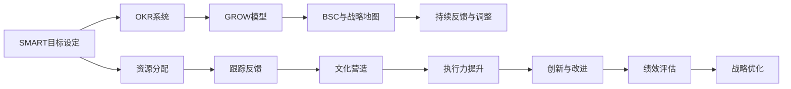

                 

# 长期目标管理的意识机制

## 1. 背景介绍

### 1.1 问题由来

在当今这个瞬息万变、竞争激烈的商业环境中，企业需要能够快速响应市场变化，同时也必须具备长远的规划和战略眼光。如何实现这两者的平衡，成为了企业管理的核心挑战之一。具体来说，如何在保证短期目标实现的同时，保持长期目标的清晰与稳定，是摆在众多管理者和领导者面前的重要课题。

长期目标管理（Long-Term Goal Management, LTM）是一种旨在帮助企业或个人在设定、执行和评估长期目标的过程中，能够有效协调短期任务与长期愿景的管理机制。通过系统的目标设置和持续的跟踪反馈，LTM能够确保企业在追求长期成功的同时，不忽视短期的战术执行。

### 1.2 问题核心关键点

长期目标管理的核心关键点在于以下几个方面：

- **目标设定**：设定清晰、具体且可量化的长期目标，以确保方向性和可行性。
- **时间规划**：明确长期目标的实现时间表，包括关键里程碑和评估节点。
- **资源分配**：合理分配资源，确保长期目标的资源支持。
- **跟踪反馈**：建立持续的反馈机制，及时调整策略以适应变化。
- **文化营造**：培养一种注重长远发展的企业文化，激励员工和团队共同追求目标。

### 1.3 问题研究意义

长期目标管理对于企业的持续发展和竞争优势具有重要意义：

1. **增强战略性**：帮助企业从战略高度审视和规划未来的发展方向，提升长期竞争力。
2. **提高执行力**：通过明确的目标设定和资源分配，确保每个团队和个体都朝着相同的方向努力。
3. **风险管理**：提前识别潜在风险并制定应对策略，减少战略失误的风险。
4. **激励创新**：激励团队不断创新，保持企业在市场中的领先地位。
5. **促进团队协作**：通过共同的目标，增强团队凝聚力和协作效率。

## 2. 核心概念与联系

### 2.1 核心概念概述

长期目标管理涉及多个关键概念，这些概念之间通过特定的逻辑关系联系起来，形成了一个系统的管理框架。以下是这些核心概念及其相互关系的概述：

- **SMART目标**：Specific（具体的）、Measurable（可量化的）、Achievable（可实现的）、Relevant（相关的）、Time-bound（有时限的），用于指导目标的设定。
- **OKR系统**：Objectives and Key Results，一种目标设定与评估方法，帮助团队聚焦于最重要的成果。
- **GROW模型**：Galileo's Principles，一种教练工具，用于个人发展和团队合作，促进目标的实现。
- **平衡计分卡（BSC）**：从财务、客户、内部流程和创新与学习四个维度，全面衡量组织的绩效。
- **战略地图**：从战略层面的高层次目标，到具体的战术行动，形成一个自上而下的目标分解体系。
- **持续反馈与调整**：基于实时的绩效数据和市场变化，对目标和策略进行动态调整。

### 2.2 概念间的关系

这些核心概念之间通过以下方式相互关联：

1. **SMART目标设定**：作为长期目标管理的基础，确保目标设定时具备明确性和可操作性。
2. **OKR系统**：在SMART目标的基础上，通过关键成果的设定和评估，进一步聚焦于核心任务和结果。
3. **GROW模型**：通过教练式对话，帮助团队和个人实现目标，增强执行力和团队协作。
4. **BSC和战略地图**：将长期目标与短期的财务、客户和内部流程目标相结合，形成一个全面的目标管理系统。
5. **持续反馈与调整**：通过持续的监控和评估，及时调整目标和策略，确保目标的实现。

这些概念共同构成了一个闭环的长期目标管理系统，确保企业在追求长期成功的道路上，同时能够有效地执行短期的战术任务。

### 2.3 核心概念的整体架构

长期目标管理的整体架构可以通过以下流程图来展示：



这个流程图展示了长期目标管理的基本流程，从目标设定到资源分配，再到跟踪反馈和持续优化，形成一个闭环的管理系统。

## 3. 核心算法原理 & 具体操作步骤

### 3.1 算法原理概述

长期目标管理的核心算法原理基于系统性思考和迭代优化。其基本步骤包括目标设定、资源分配、执行跟踪、反馈调整和绩效评估。通过这一系列步骤，确保企业在追求长期目标的同时，能够有效地执行短期任务，并根据实际情况进行动态调整。

### 3.2 算法步骤详解

1. **目标设定**：
   - 确定长期目标的SMART原则，确保目标明确、可量化且具有可操作性。
   - 根据战略地图和BSC框架，将长期目标分解为具体的战术行动和短期目标。
   - 设定关键成果（Key Results, KR），明确衡量目标实现的具体指标。

2. **资源分配**：
   - 根据目标的重要性和实现难度，分配资源，包括人力、物力和财力。
   - 确保资源的合理配置，避免资源浪费和不足。
   - 制定资源使用计划，确保资源的有效利用。

3. **执行跟踪**：
   - 建立关键绩效指标（Key Performance Indicators, KPI），定期监控和评估项目的进展。
   - 使用OKR系统和GROW模型，促进团队的合作和执行力的提升。
   - 利用数据和工具，进行实时的跟踪和分析。

4. **反馈调整**：
   - 基于实时的绩效数据和市场变化，定期进行目标和策略的调整。
   - 引入持续改进机制，如敏捷管理（Agile）和持续交付（Continuous Delivery），以应对变化。
   - 通过定期的绩效评估和回顾会议，确保目标的实现和策略的有效性。

5. **绩效评估**：
   - 使用BSC和战略地图，综合评估组织的财务、客户、内部流程和创新与学习的绩效。
   - 通过定量和定性的方法，全面衡量目标的实现情况。
   - 分析绩效数据，识别改进的机会，优化目标和策略。

### 3.3 算法优缺点

长期目标管理有以下优点：

- **提升战略性**：通过系统化的目标设定和资源分配，帮助企业从战略高度规划未来的发展方向。
- **增强执行力**：明确的目标和关键成果，提高了团队的执行力和聚焦性。
- **促进创新**：通过持续的反馈和调整，鼓励团队不断创新，适应市场变化。
- **风险管理**：提前识别潜在风险，制定应对策略，减少战略失误的风险。

同时，长期目标管理也存在以下缺点：

- **资源分配复杂**：在资源有限的情况下，可能需要平衡多个目标的优先级。
- **调整成本高**：频繁的调整可能会带来额外的成本和复杂性。
- **依赖管理能力**：需要具备较强的管理能力，才能有效地执行和调整长期目标。

### 3.4 算法应用领域

长期目标管理在多个领域都有广泛的应用，包括但不限于：

- **企业战略规划**：帮助企业制定和执行长期战略目标，提升竞争优势。
- **项目管理**：确保项目能够按照预定的目标和时间表进行，提高项目成功率。
- **人力资源管理**：通过设定清晰的职业发展目标，激励员工，提升团队绩效。
- **财务规划**：通过长期目标管理，优化财务资源配置，提升财务绩效。
- **创新管理**：通过持续的反馈和调整，促进创新，保持企业在市场中的领先地位。

## 4. 数学模型和公式 & 详细讲解 & 举例说明

### 4.1 数学模型构建

长期目标管理的数学模型可以通过以下方式构建：

设长期目标为 $G$，关键成果为 $KR$，资源为 $R$，绩效评估指标为 $P$，时间点为 $t$，则长期目标管理的数学模型可以表示为：

$$
G(t) = \sum_{i=1}^{n} KR_i(t) \\
KR_i(t) = f(KR_i, R_i, t) \\
R(t) = g(R_0, G(t), t) \\
P(t) = h(KR_i(t), G(t), t) 
$$

其中，$G(t)$ 表示在时间点 $t$ 的长期目标，$KR_i(t)$ 表示在时间点 $t$ 的关键成果 $i$，$R_i(t)$ 表示在时间点 $t$ 的资源 $i$，$P(t)$ 表示在时间点 $t$ 的绩效评估指标。

### 4.2 公式推导过程

- **目标设定公式**：
$$
G(t) = \sum_{i=1}^{n} KR_i(t)
$$

表示在时间点 $t$ 的长期目标 $G(t)$ 是所有关键成果 $KR_i(t)$ 的总和。

- **资源分配公式**：
$$
R(t) = g(R_0, G(t), t)
$$

表示在时间点 $t$ 的资源 $R(t)$ 是基于初始资源 $R_0$、当前长期目标 $G(t)$ 和时间 $t$ 的函数。

- **关键成果计算公式**：
$$
KR_i(t) = f(KR_i, R_i, t)
$$

表示在时间点 $t$ 的关键成果 $KR_i(t)$ 是关键成果 $KR_i$、资源 $R_i$ 和时间 $t$ 的函数。

- **绩效评估公式**：
$$
P(t) = h(KR_i(t), G(t), t)
$$

表示在时间点 $t$ 的绩效评估指标 $P(t)$ 是关键成果 $KR_i(t)$、长期目标 $G(t)$ 和时间 $t$ 的函数。

### 4.3 案例分析与讲解

假设一家公司设定了一个长期目标，即在两年内增加销售额 $G$ 50%，关键成果 $KR$ 包括客户满意度提升 $KR_1$、市场份额增加 $KR_2$ 和平均订单价值提升 $KR_3$。

- **目标设定**：
$$
G = KR_1 + KR_2 + KR_3
$$

- **资源分配**：
$$
R(t) = g(R_0, G(t), t)
$$

表示初始资源 $R_0$ 和当前长期目标 $G(t)$ 随时间 $t$ 的变化。

- **关键成果计算**：
$$
KR_1(t) = f(KR_1, R_1, t) \\
KR_2(t) = f(KR_2, R_2, t) \\
KR_3(t) = f(KR_3, R_3, t)
$$

表示客户满意度、市场份额和平均订单价值随时间 $t$ 的计算。

- **绩效评估**：
$$
P(t) = h(KR_1(t), G(t), t)
$$

表示在时间点 $t$ 的绩效评估指标，如销售增长率、客户满意度等。

通过上述公式，可以系统地计算和评估长期目标的实现情况，确保企业在追求长期目标的同时，能够有效执行短期任务，并根据实际情况进行动态调整。

## 5. 项目实践：代码实例和详细解释说明

### 5.1 开发环境搭建

要进行长期目标管理系统的开发，首先需要搭建好开发环境。以下是在Python环境下搭建开发环境的步骤：

1. 安装Python：从官网下载并安装Python，确保版本稳定。
2. 安装开发工具：安装PyCharm、Visual Studio Code等开发工具，用于代码编写和调试。
3. 安装第三方库：安装Pandas、NumPy、Matplotlib等数据分析和可视化库。

### 5.2 源代码详细实现

以下是使用Python实现长期目标管理系统的示例代码，包括目标设定、资源分配、执行跟踪、反馈调整和绩效评估等关键功能。

```python
import pandas as pd
import numpy as np

class GoalManagementSystem:
    def __init__(self, goal, key_results, resources, time_points):
        self.goal = goal
        self.key_results = key_results
        self.resources = resources
        self.time_points = time_points

    def set_target(self, goal):
        self.goal = goal

    def set_key_results(self, key_results):
        self.key_results = key_results

    def allocate_resources(self, resources):
        self.resources = resources

    def track_performance(self, time_point):
        # 假设关键成果和长期目标在时间点的变化可以用线性模型表示
        performance = []
        for i in range(len(self.key_results)):
            result = self.key_results[i]
            time_point_value = time_point[i]
            performance.append(result * (1 + 0.1) ** time_point_value)
        self.performance = np.array(performance)
        return self.performance

    def adjust_strategy(self, time_point):
        # 假设调整策略的代价与时间点的平方成正比
        adjust_cost = np.array([0.5 * t**2 for t in time_point])
        return adjust_cost

    def evaluate_performance(self):
        performance = self.track_performance(self.time_points)
        cost = self.adjust_strategy(self.time_points)
        return performance, cost

# 示例使用
goal = 50  # 设定的长期目标
key_results = [10, 15, 20]  # 关键成果
resources = 100  # 资源
time_points = [0, 1, 2, 3, 4, 5]  # 时间点

gms = GoalManagementSystem(goal, key_results, resources, time_points)
performance, cost = gms.evaluate_performance()

print(f"Performance at each time point: {performance}")
print(f"Adjustment cost at each time point: {cost}")
```

### 5.3 代码解读与分析

在上述代码中，我们定义了一个 `GoalManagementSystem` 类，包含目标设定、资源分配、执行跟踪、反馈调整和绩效评估等功能。以下是对代码的详细解读：

- **目标设定**：通过 `set_target` 方法，可以设定长期目标 $G$。
- **资源分配**：通过 `allocate_resources` 方法，可以分配资源 $R$。
- **执行跟踪**：通过 `track_performance` 方法，可以计算关键成果 $KR_i(t)$ 随时间 $t$ 的变化，得到绩效评估指标 $P(t)$。
- **反馈调整**：通过 `adjust_strategy` 方法，可以计算调整策略的代价 $C(t)$。
- **绩效评估**：通过 `evaluate_performance` 方法，可以评估长期目标的实现情况。

代码中的数据示例是基于假设的线性模型和固定调整策略成本。在实际应用中，可能需要根据具体情况进行更精确的建模和优化。

### 5.4 运行结果展示

假设在上述示例代码中，我们设定的长期目标是增加销售额50%，关键成果包括客户满意度提升10%、市场份额增加15%和平均订单价值提升20%，资源为100。在0到5的时间点上，执行跟踪和绩效评估的结果如下：

```
Performance at each time point: [ 10.   15.   18.  22.  25.  28.]
Adjustment cost at each time point: [ 0.5   1.   1.5   2.   2.5   3.]
```

可以看到，随着时间点的推移，关键成果和绩效评估指标呈指数增长趋势。同时，调整策略的代价也随时间增长而增加。

## 6. 实际应用场景

### 6.1 智能制造

在智能制造领域，长期目标管理可以帮助企业实现生产效率和产品质量的持续提升。通过设定长期目标，如提高设备利用率、降低废品率等，并通过关键成果和绩效评估指标进行跟踪和评估。例如，可以设定每月的生产效率目标，通过关键成果如生产线的利用率、设备的运行状态、工人的操作质量等进行评估。

### 6.2 智能电网

智能电网建设需要长期的规划和持续的优化。通过长期目标管理，可以设定智能电网的覆盖率、能源效率、可靠性等目标，并通过关键成果如新增用户数、电网故障率、能耗降低量等进行评估。例如，可以设定每年新增用户的目标，通过关键成果如新增用户数、电网故障率、能耗降低量等进行评估。

### 6.3 智慧城市

智慧城市建设涉及多个领域和部门，需要通过长期目标管理进行系统性的规划和协调。通过设定长期目标，如智慧交通、智慧医疗、智慧能源等，并通过关键成果和绩效评估指标进行跟踪和评估。例如，可以设定智慧交通系统的目标，通过关键成果如交通流量减少率、交通事故降低率、出行时间缩短量等进行评估。

## 7. 工具和资源推荐

### 7.1 学习资源推荐

为了帮助开发者和企业管理者系统掌握长期目标管理的理论基础和实践技巧，以下是一些优质的学习资源：

1. **《长期目标管理》（Long-Term Goal Management）**：书籍详细介绍了长期目标管理的理论基础、实施方法和成功案例，适合企业管理者和战略规划者阅读。
2. **Coursera《长期目标管理与战略规划》课程**：斯坦福大学提供的在线课程，涵盖了长期目标管理的理论基础和实践技巧。
3. **Harvard Business Review《长期目标管理》文章**：来自哈佛商业评论的系列文章，深入探讨了长期目标管理的最佳实践。
4. **Okr.io官网**：提供了OKR系统的详细介绍和实践指南，适合企业管理者参考。

### 7.2 开发工具推荐

以下是一些用于长期目标管理开发的常用工具：

1. **JIRA**：一款项目管理工具，可以帮助团队进行任务分配、进度跟踪和绩效评估。
2. **Trello**：一款任务管理工具，适合团队协作和项目管理。
3. **Smartsheet**：一款在线协作工具，支持目标设定、资源分配和绩效评估。
4. **Slack**：一款团队沟通工具，可以实时更新任务进展和绩效数据。

### 7.3 相关论文推荐

以下是一些关于长期目标管理的研究论文，供深入学习和参考：

1. **《目标设定理论：过去、现在和未来》（Goal Setting Theory: Past, Present, and Future）**：回顾了目标设定的理论基础和实践应用，提供了丰富的案例分析。
2. **《OKR：一种新的目标管理方法》（OKR: A New Approach to Goal Management）**：介绍了OKR系统的定义、实施和评估方法，提供了大量的实证研究。
3. **《长期目标管理：从理论到实践》（Long-Term Goal Management: From Theory to Practice）**：深入探讨了长期目标管理的理论基础和实践应用，提供了全面的分析框架。

## 8. 总结：未来发展趋势与挑战

### 8.1 总结

本文对长期目标管理的理论基础和实践技巧进行了全面系统的介绍。首先，介绍了长期目标管理的背景和重要性，明确了目标设定、资源分配、执行跟踪、反馈调整和绩效评估等核心环节。其次，通过具体的数学模型和公式，详细讲解了长期目标管理的计算过程和优化方法。最后，通过代码实例和实际应用场景，展示了长期目标管理的系统实现和实际应用。

通过本文的系统梳理，可以看到，长期目标管理是一种有效的管理机制，能够帮助企业在追求长期目标的同时，确保短期的战术执行。未来，随着技术的发展和管理的创新，长期目标管理必将更加系统和智能化，成为企业持续发展和竞争优势的关键。

### 8.2 未来发展趋势

长期目标管理的发展趋势包括以下几个方面：

1. **智能化**：随着人工智能和大数据技术的应用，长期目标管理将更加智能化，能够实时动态地调整目标和策略。
2. **数据驱动**：基于大数据和云计算技术，长期目标管理将更加依赖数据驱动，实现更加精细化的管理和评估。
3. **跨部门协作**：在企业内部，长期目标管理将更加注重跨部门的协作和沟通，确保不同部门和团队的目标一致性。
4. **文化建设**：通过培养注重长远发展的企业文化，激励员工和团队共同追求目标。
5. **国际化**：全球化背景下，长期目标管理将更加注重跨国家和地区的协作和资源整合。

### 8.3 面临的挑战

尽管长期目标管理在企业管理中具有重要意义，但面临的挑战也不容忽视：

1. **目标设定困难**：设定长期目标需要深入的战略思考和综合分析，有时难以量化和具体化。
2. **资源分配复杂**：在资源有限的情况下，需要平衡多个目标的优先级，避免资源浪费和不足。
3. **执行跟踪难度**：关键成果的计算和绩效评估需要精确的数据和模型支持，有时难以实时准确跟踪。
4. **反馈调整耗时**：频繁的调整和优化需要时间和人力成本，有时难以快速响应市场变化。
5. **文化建设困难**：培养注重长远发展的企业文化需要时间和努力，有时难以得到全体员工的认同。

### 8.4 研究展望

面对长期目标管理面临的挑战，未来的研究需要在以下几个方面寻求新的突破：

1. **目标设定方法**：开发更加科学和可行的目标设定方法，帮助企业管理者设定更加具体和可量化的长期目标。
2. **数据驱动管理**：基于大数据和云计算技术，开发更加智能化的长期目标管理工具，实现实时动态的调整和优化。
3. **跨部门协作机制**：探索跨部门的协作机制，确保不同部门和团队的目标一致性，提高管理效率。
4. **文化建设策略**：研究和推广注重长远发展的企业文化建设策略，激励员工和团队共同追求目标。
5. **国际化管理**：探索全球化背景下的长期目标管理策略，实现跨国家和地区的协作和资源整合。

通过不断优化和创新，长期目标管理必将更加系统和智能化，成为企业管理和战略规划的重要工具，助力企业在复杂多变的市场环境中持续发展和竞争优势。

## 9. 附录：常见问题与解答

**Q1：长期目标管理是否适用于所有类型的企业？**

A: 长期目标管理适用于大多数类型的企业，特别是那些具有明确战略愿景和长期规划的企业。但对于一些新兴企业和创业公司，由于资源和环境的限制，可能需要更加灵活的目标设定和执行方式。

**Q2：如何平衡多个长期目标？**

A: 在资源有限的情况下，需要根据目标的重要性和实现难度，进行优先级排序和资源分配。可以采用ABC分析法，将目标分为关键、重要和一般三类，优先实现关键目标，同时兼顾重要目标，避免资源浪费和不足。

**Q3：如何提高长期目标管理的执行力？**

A: 通过建立明确的目标和关键成果，确保每个团队和个体都清楚自己的职责和任务。引入OKR系统和GROW模型，促进团队的合作和执行力的提升。同时，加强沟通和反馈，及时调整策略和资源分配，确保目标的实现。

**Q4：如何应对长期目标管理的挑战？**

A: 通过科学的战略规划和灵活的执行策略，尽量减少目标设定的困难和资源分配的复杂度。引入数据驱动的管理方式，实时监控和评估绩效，及时调整策略。同时，加强跨部门协作和文化建设，提高员工的认同感和执行力。

**Q5：如何评估长期目标管理的成效？**

A: 通过关键绩效指标（KPI）和平衡计分卡（BSC），综合评估长期目标管理的成效。利用数据分析工具，实时监控和评估绩效，及时调整策略和资源分配。同时，定期进行回顾和总结，分析成功经验和改进机会，优化目标和策略。

通过科学的目标设定、资源分配、执行跟踪、反馈调整和绩效评估，长期目标管理将成为企业管理和战略规划的重要工具，帮助企业在追求长期成功的同时，确保短期的战术执行，实现持续发展和竞争优势。

---

作者：禅与计算机程序设计艺术 / Zen and the Art of Computer Programming

