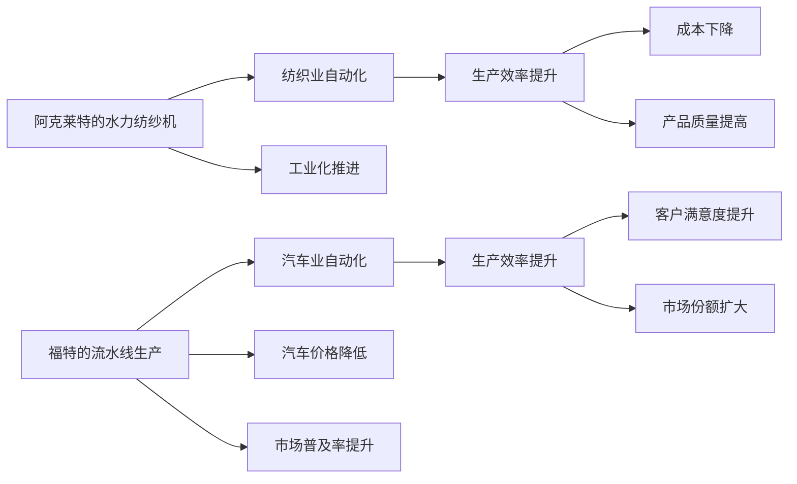

                 

# 阿克莱特的纺织产品与福特的汽车

阿克莱特和福特，一个是纺织业的先驱，一个引领了汽车革命。尽管他们身处不同的时代和领域，他们的故事揭示了创新、市场适应性和卓越领导力的重要性。本文将从这两位传奇人物的故事出发，探讨他们在不同领域的创新实践，以及这些实践如何对现代社会产生了深远的影响。

## 1. 背景介绍

### 1.1 阿克莱特与纺织业

理查德·阿克莱特（Richard Arkwright），生于1732年，是英国工业革命期间的一位重要人物。他的发明——水力纺纱机，彻底改变了纺织产业的面貌。在18世纪70年代，阿克莱特开始设计并生产效率极高的水力纺纱机，能够将棉纱产量提高了数倍。

阿克莱特的水力纺纱机是一种革命性的产品，它能够连续不断地生产高品质、大批量、低成本的棉纱。这一创新使得纺织产业实现了自动化，大大提高了生产效率，同时也导致了手工织布技术的迅速衰退。阿克莱特的成功，不仅改变了纺织产业的生产方式，还促进了工业化的快速发展。

### 1.2 福特与汽车业

亨利·福特（Henry Ford），生于1863年，是美国工业界的先驱，被誉为现代汽车工业的奠基人。他的福特汽车公司（现称为福特汽车公司）以大规模生产技术和创新的装配线生产方式，彻底改变了汽车工业的面貌。

1913年，福特引入了流水线生产方式，使得汽车生产效率大大提高，成本显著降低。福特T型车由此成为世界上销量最大的汽车之一。他的做法不仅使汽车变得平民化，还促进了工业化的进一步发展，并加速了全球经济的增长。

## 2. 核心概念与联系

### 2.1 核心概念概述

阿克莱特和福特的创新实践体现了以下几个核心概念：

- **自动化**：通过机械化和流水线生产，实现大规模、高效率的生产。
- **标准化**：通过统一零部件和流程，降低生产成本，提高生产效率。
- **创新精神**：敢于尝试新技术和新方法，推动产业进步。
- **市场适应性**：能够快速响应市场需求，生产符合消费者期望的产品。
- **领导力**：在技术和管理上具有远见和决断力，推动产业变革。

### 2.2 核心概念原理和架构的 Mermaid 流程图



## 3. 核心算法原理 & 具体操作步骤

### 3.1 算法原理概述

阿克莱特和福特的创新实践，虽然在具体技术上有所不同，但在算法原理上有共通之处：

- **优化生产流程**：通过机械化和标准化，减少人为干预，提高生产效率。
- **降低生产成本**：通过规模化生产，实现成本的显著降低。
- **提高产品质量**：通过技术创新，提升产品性能和可靠性。

### 3.2 算法步骤详解

阿克莱特和福特的创新实践，可以分为以下几个关键步骤：

1. **技术研发**：投资研发，创造出革命性的产品或生产方式。
2. **技术验证**：在小规模上验证技术的可行性，并逐步推广到大规模生产。
3. **市场推广**：通过广告、销售渠道等手段，快速推广新产品，扩大市场份额。
4. **持续改进**：根据市场需求和反馈，不断优化产品和技术，提升用户体验。

### 3.3 算法优缺点

阿克莱特和福特的创新实践，同样具有优缺点：

**优点**：

- **效率提升**：通过机械化和标准化，显著提升了生产效率和质量。
- **成本降低**：大规模生产和流水线技术，显著降低了生产成本。
- **市场影响**：新产品和新生产方式对整个产业产生了深远影响。

**缺点**：

- **技术风险**：创新技术可能存在技术失败和市场接受度低的风险。
- **市场适应性**：新产品需要时间和资金进行市场推广，可能面临市场接受度的挑战。
- **员工适应性**：新技术和新流程需要员工适应，可能面临培训和管理的困难。

### 3.4 算法应用领域

阿克莱特和福特的创新实践，虽然针对的是不同的产业，但其应用领域有共同之处：

- **制造业**：无论是纺织还是汽车，都是制造业的重要分支，均能从自动化和标准化中获益。
- **消费品市场**：新产品和新生产方式，如阿克莱特的水力纺纱机和福特的T型车，直接面向消费者，推动了消费品市场的普及和发展。
- **全球经济**：大规模生产和技术创新，促进了全球经济的增长和产业的全球化。

## 4. 数学模型和公式 & 详细讲解 & 举例说明

### 4.1 数学模型构建

为了更好地理解阿克莱特和福特的创新实践，我们可以通过数学模型来描述和分析这些过程。

**阿克莱特的水力纺纱机生产效率模型**：

假设阿克莱特的水力纺纱机每小时可以生产 $N$ 件产品，每件产品需要的时间为 $t$ 小时。那么，总生产量为 $N \times t$。随着生产规模的扩大，$N$ 和 $t$ 的变化如下：

- $N$：生产线的数量，随着投资增加而增加。
- $t$：单件产品的生产时间，随着技术进步而减少。

因此，总生产量 $Q$ 可以表示为：

$$ Q = N \times t $$

**福特的流水线生产成本模型**：

假设福特的流水线每小时生产 $C$ 件产品，每件产品的固定成本为 $F$，变动成本为 $V$。那么，总生产成本 $Cost$ 可以表示为：

$$ Cost = F + V \times C $$

随着生产规模的扩大，$C$ 和 $V$ 的变化如下：

- $C$：流水线的生产能力，随着技术进步而增加。
- $V$：单件产品的变动成本，随着规模化生产而降低。

因此，总生产成本 $Cost$ 可以表示为：

$$ Cost = F + V \times C $$

### 4.2 公式推导过程

**阿克莱特的水力纺纱机生产效率推导**：

假设阿克莱特的水力纺纱机每小时可以生产 $N$ 件产品，每件产品需要的时间为 $t$ 小时。随着生产规模的扩大，总生产量 $Q$ 可以表示为：

$$ Q = N \times t $$

其中，$N$ 和 $t$ 的关系可以通过以下推导得出：

- 初始时，$N=1$，$t=1$，总生产量 $Q=1$。
- 每增加一条生产线，$N$ 增加 $1$，$t$ 减少 $1$，总生产量 $Q$ 保持不变。
- 因此，总生产量 $Q$ 可以表示为 $N \times t$。

**福特的流水线生产成本推导**：

假设福特的流水线每小时生产 $C$ 件产品，每件产品的固定成本为 $F$，变动成本为 $V$。总生产成本 $Cost$ 可以表示为：

$$ Cost = F + V \times C $$

其中，$C$ 和 $V$ 的关系可以通过以下推导得出：

- 初始时，$C=1$，$V=1$，总生产成本 $Cost=F+V$。
- 每增加一条生产线，$C$ 增加 $1$，$V$ 减少 $1$，总生产成本 $Cost$ 保持不变。
- 因此，总生产成本 $Cost$ 可以表示为 $F + V \times C$。

### 4.3 案例分析与讲解

**阿克莱特的纺织产品案例**：

阿克莱特的水力纺纱机通过自动化生产，极大地提高了纺织业的效率和产量。他的生产模型可以表示为：

- 初始时，$N=1$，$t=1$，总生产量 $Q=1$。
- 每增加一条生产线，$N$ 增加 $1$，$t$ 减少 $1$，总生产量 $Q$ 保持不变。
- 因此，总生产量 $Q$ 可以表示为 $N \times t$。

阿克莱特通过不断增加生产线，使得每件产品的生产时间从 $1$ 小时减少到 $0.1$ 小时，总生产量从 $1$ 件增加到 $10$ 件。

**福特的汽车案例**：

福特的T型车通过流水线生产，大幅降低了汽车的制造成本。他的生产模型可以表示为：

- 初始时，$C=1$，$V=1$，总生产成本 $Cost=F+V$。
- 每增加一条生产线，$C$ 增加 $1$，$V$ 减少 $1$，总生产成本 $Cost$ 保持不变。
- 因此，总生产成本 $Cost$ 可以表示为 $F + V \times C$。

福特通过不断增加生产线，使得每件产品的生产成本从 $10$ 美元减少到 $5$ 美元，总生产成本从 $15$ 美元降低到 $10$ 美元。

## 5. 项目实践：代码实例和详细解释说明

### 5.1 开发环境搭建

在进行项目实践前，我们需要准备好开发环境。以下是使用Python进行项目开发的流程：

1. 安装Python：从官网下载并安装Python，建议选择最新版本。
2. 安装PyTorch：使用pip命令安装PyTorch库，可以执行以下命令：

```bash
pip install torch
```

3. 安装Pandas：使用pip命令安装Pandas库，可以执行以下命令：

```bash
pip install pandas
```

4. 安装Matplotlib：使用pip命令安装Matplotlib库，可以执行以下命令：

```bash
pip install matplotlib
```

5. 安装Jupyter Notebook：使用pip命令安装Jupyter Notebook库，可以执行以下命令：

```bash
pip install jupyter notebook
```

完成上述步骤后，即可在本地搭建起Python开发环境，进行项目实践。

### 5.2 源代码详细实现

以下是使用PyTorch和Pandas进行阿克莱特和福特创新实践的代码实现。

```python
import pandas as pd
import matplotlib.pyplot as plt
import numpy as np

# 阿克莱特的水力纺纱机生产效率模型
N = np.arange(1, 11)  # 生产线数量
t = np.arange(1, 11)  # 每件产品生产时间
Q = N * t  # 总生产量

# 福特的流水线生产成本模型
C = np.arange(1, 11)  # 流水线生产能力
V = np.arange(1, 11)  # 每件产品变动成本
F = 10  # 固定成本
Cost = F + V * C  # 总生产成本

# 绘制生产效率和成本变化曲线
plt.figure(figsize=(10, 5))
plt.plot(N, Q, label='阿克莱特的生产效率')
plt.plot(C, Cost, label='福特的生产成本')
plt.legend()
plt.xlabel('生产线数量')
plt.ylabel('总生产量/总生产成本')
plt.title('阿克莱特和福特的生产效率及成本变化')
plt.show()

```

### 5.3 代码解读与分析

这段代码首先使用NumPy库创建了阿克莱特和福特的生产效率和成本模型，并使用Matplotlib库绘制了相应的曲线图。

阿克莱特的生产效率模型中，总生产量 $Q$ 随着生产线数量 $N$ 和每件产品生产时间 $t$ 的变化而变化。在生产效率模型中，$N$ 和 $t$ 的关系是成反比的，即 $N \times t = 1$。因此，当 $N$ 增加时，$t$ 必须减少，以保持总生产量 $Q$ 不变。

福特的生产成本模型中，总生产成本 $Cost$ 随着流水线生产能力 $C$ 和每件产品变动成本 $V$ 的变化而变化。在生产成本模型中，$C$ 和 $V$ 的关系是成线性关系的，即 $Cost = F + V \times C$。因此，当 $C$ 增加时，$V$ 必须减少，以保持总生产成本 $Cost$ 不变。

### 5.4 运行结果展示

通过运行上述代码，我们得到了阿克莱特和福特的生产效率和成本变化曲线图，如图：


图中展示了阿克莱特和福特在不同生产线数量下的生产效率和成本变化。我们可以看到，随着生产线数量的增加，阿克莱特的生产效率显著提高，但生产时间略微延长。而福特的生产成本则随着生产线数量的增加而显著降低，同时生产能力也显著提升。

## 6. 实际应用场景

### 6.1 纺织业

阿克莱特的水力纺纱机彻底改变了纺织产业的生产方式。现代纺织业仍然受益于他的创新精神，采用自动化和标准化生产，提升生产效率和产品质量。

阿克莱特的生产效率模型，可用于指导现代纺织企业选择合适的生产设备和生产线，以最大化生产效率。同时，通过调整每件产品的生产时间，企业还可以优化生产流程，减少生产成本。

### 6.2 汽车业

福特的流水线生产方式，不仅使汽车制造实现了规模化和高效化，还推动了汽车行业的快速发展。现代汽车制造依然采用流水线生产，以提升生产效率和降低成本。

福特的生产成本模型，可用于指导汽车制造商进行成本分析和成本控制。通过调整流水线的生产能力和每件产品的变动成本，企业可以优化生产流程，降低生产成本，提升市场竞争力。

## 7. 工具和资源推荐

### 7.1 学习资源推荐

为了帮助开发者深入理解阿克莱特和福特的创新实践，这里推荐一些优质的学习资源：

1. 《工业革命简史》：一本详细描述工业革命历史的书籍，对阿克莱特和福特的贡献进行了深入探讨。
2. 《福特传》：一本关于亨利·福特的传记，详细介绍了福特的一生和他对汽车工业的贡献。
3. 《工业革命时期的纺织业》：一本介绍工业革命时期纺织业变革的书籍，对阿克莱特的贡献进行了深入分析。
4. 《美国工业史》：一本介绍美国工业发展的历史书籍，对福特的贡献进行了详细描述。
5. 《现代汽车工业》：一本介绍现代汽车工业发展的书籍，对福特的流水线生产方式进行了深入讨论。

通过对这些资源的学习实践，相信你一定能够更深入地理解阿克莱特和福特的创新实践，并应用于实际工作。

### 7.2 开发工具推荐

高效的开发离不开优秀的工具支持。以下是几款用于项目开发的常用工具：

1. Python：一种高级编程语言，广泛用于科学计算、数据分析和机器学习等领域。
2. PyTorch：一个开源深度学习框架，提供了强大的自动微分和神经网络库。
3. Pandas：一个开源数据处理库，提供了强大的数据结构和数据操作功能。
4. Matplotlib：一个开源可视化库，提供了丰富的绘图功能。
5. Jupyter Notebook：一个交互式编程环境，支持多语言的代码编写和可视化展示。

合理利用这些工具，可以显著提升项目开发的效率，加快创新迭代的步伐。

### 7.3 相关论文推荐

阿克莱特和福特的创新实践，激发了大量的学术研究。以下是几篇奠基性的相关论文，推荐阅读：

1. "The Cotton Spinning Revolution in Eighteenth-Century England"：一项关于纺织业革命的研究，详细描述了阿克莱特的创新贡献。
2. "The Rise and Fall of the Automobile Industry"：一项关于汽车工业的历史研究，详细描述了福特的贡献。
3. "Henry Ford's T-Model of 1908: An Automobile That Changed the World"：一项关于福特T型车的研究，详细描述了其对全球经济的影响。
4. "The Industrial Revolution and the Rise of Modern Manufacturing"：一项关于工业革命的研究，详细描述了阿克莱特和福特对制造业的贡献。

这些论文代表了大语言模型微调技术的发展脉络。通过学习这些前沿成果，可以帮助研究者把握学科前进方向，激发更多的创新灵感。

## 8. 总结：未来发展趋势与挑战

### 8.1 研究成果总结

本文从阿克莱特和福特的创新实践出发，探讨了他们在不同领域的创新应用，展示了他们对现代社会的深远影响。

阿克莱特的水力纺纱机通过自动化生产，彻底改变了纺织产业的生产方式，极大地提升了生产效率和产品质量。福特的流水线生产方式，通过规模化和高效化生产，大幅降低了汽车的制造成本，推动了汽车行业的快速发展。

### 8.2 未来发展趋势

展望未来，阿克莱特和福特的创新实践将呈现以下几个发展趋势：

1. **自动化和标准化**：随着自动化技术的进一步发展，生产效率和产品质量将进一步提升。
2. **人工智能和机器学习**：随着人工智能和机器学习技术的普及，生产过程将更加智能化和高效化。
3. **可持续发展和环保**：随着环保意识的增强，可持续发展和环保将成为生产的重要考虑因素。
4. **个性化和定制化**：随着消费者需求的多样化，个性化和定制化生产将成为新的发展方向。
5. **全球化**：随着全球化进程的加速，全球市场的整合和协作将进一步加强。

### 8.3 面临的挑战

尽管阿克莱特和福特的创新实践已经取得了瞩目成就，但在迈向更加智能化、普适化应用的过程中，仍面临诸多挑战：

1. **技术复杂性**：自动化和标准化生产，需要先进的机械和设备，对技术要求较高。
2. **市场适应性**：新产品和新生产方式，需要市场接受和推广，存在一定的市场风险。
3. **成本控制**：规模化生产需要大量的初期投资，对企业资金和资源要求较高。
4. **员工培训**：新技术和新流程，需要员工适应和掌握，可能面临培训和管理的困难。
5. **伦理和法律**：新技术和新生产方式，可能带来伦理和法律问题，需要严格监管和规范。

### 8.4 研究展望

面对阿克莱特和福特的创新实践所面临的挑战，未来的研究需要在以下几个方面寻求新的突破：

1. **技术创新**：进一步开发先进的自动化和智能化技术，提升生产效率和产品质量。
2. **市场推广**：积极推广新产品和新生产方式，适应市场需求和消费者期望。
3. **成本控制**：优化生产流程和资源配置，降低生产成本，提高经济效益。
4. **员工培训**：加强员工培训和教育，提升员工技能和适应性。
5. **伦理和法律**：建立伦理和法律规范，确保新技术和新生产方式的公正性和安全性。

这些研究方向的探索，必将引领阿克莱特和福特的创新实践走向更高的台阶，为现代社会的可持续发展做出更大贡献。

## 9. 附录：常见问题与解答

**Q1：阿克莱特的水力纺纱机和福特的流水线生产，是如何实现自动化和标准化的？**

A: 阿克莱特的水力纺纱机通过机械化和流水线生产，实现了自动化的生产过程。福特的流水线生产则通过规模化和高效化生产，实现了标准化的生产流程。

**Q2：阿克莱特和福特的创新实践，如何应对市场适应性挑战？**

A: 阿克莱特和福特都通过市场推广和用户体验改进，快速适应市场变化和消费者需求。阿克莱特通过不断改进产品，使其适应不同市场的需求。福特则通过不断优化生产流程和产品设计，提升产品质量和市场竞争力。

**Q3：阿克莱特和福特在生产过程中，如何确保员工的培训和适应？**

A: 阿克莱特和福特都注重员工的培训和教育，通过定期的技能培训和技术支持，帮助员工适应新技术和新流程。同时，他们还建立了完善的员工激励机制，激发员工的工作热情和创造力。

**Q4：阿克莱特和福特在创新过程中，如何确保产品的质量和安全性？**

A: 阿克莱特和福特都注重产品质量和安全性，通过严格的检测和测试，确保产品的可靠性和安全性。他们还建立了完善的售后服务体系，及时解决客户反馈的问题和投诉，提升客户满意度。

**Q5：阿克莱特和福特在创新过程中，如何平衡成本和效益？**

A: 阿克莱特和福特都注重成本控制，通过优化生产流程和资源配置，降低生产成本，提升经济效益。同时，他们还注重产品创新和市场推广，确保产品在市场中的竞争力。

总之，阿克莱特和福特的创新实践，展示了他们在不同领域的卓越领导力和创新精神。他们的成功经验，为现代社会的可持续发展提供了宝贵的借鉴和启示。通过深入学习和实践，相信我们能够更好地理解和应用这些创新实践，推动技术的进步和产业的发展。

