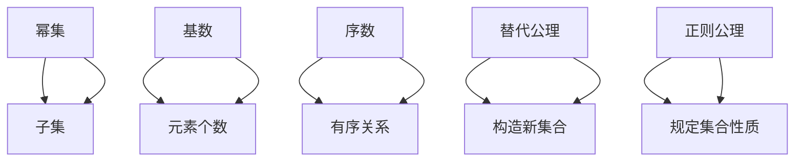
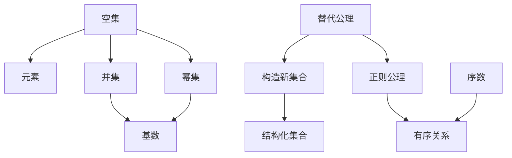

                 

# 集合论导引：KP集合理论

## 1. 背景介绍

### 1.1 问题由来
集合论（Set Theory）作为数学的基础分支，深入探讨了元素与集合间的关系，影响遍及逻辑学、数学、计算机科学等多个领域。Zermelo-Fraenkel集合论（ZF Set Theory）是集合论的主流理论，但为了适应现代数学和计算机科学的需要，Kreisel和Prawitz（简称KP）提出了一整套更加严谨且适用范围更广的集合论公理系统。

KP集合论继承了ZF集合论的许多核心公理，如空集公理、并集公理、幂集公理等，但引入了替代公理（Replacement Axiom），使得KP集合论在集合构造方面具有更强的表达能力。KP集合论不仅在数学中得到了广泛应用，还为计算机科学中的集合操作和类型系统提供了重要参考。

### 1.2 问题核心关键点
KP集合论的核心公理体系包括：空集公理、并集公理、幂集公理、替代公理、基数公理、选择公理、正规化公理等。这些公理构成了KP集合论的数学基础，并在此基础上展开了对集合、序数、基数、序等概念的全面讨论。

KP集合论与ZF集合论的主要区别在于，KP集合论允许通过替代公理构造更丰富的集合，但也因此带来了潜在的逻辑问题，如罗素悖论（Russell's Paradox）等。因此，深入理解KP集合论的公理和应用，对于数学和计算机科学的研究具有重要意义。

### 1.3 问题研究意义
KP集合论作为ZF集合论的扩展，不仅在数学基础研究中具有重要地位，也为计算机科学中的集合操作、类型系统、抽象数据类型等提供了重要理论支持。KP集合论的严谨性和普适性，使其成为理解和设计现代计算机系统的有力工具。

## 2. 核心概念与联系

### 2.1 核心概念概述

KP集合论的核心概念包括：
- **幂集（Power Set）**：一个集合的幂集是由该集合所有子集构成的集合。
- **基数（Cardinality）**：一个集合的基数是指与该集合等势的元素个数。
- **序数（Ordinal）**：序数是一种特殊的数集，表示有序关系。
- **替代公理（Replacement Axiom）**：允许通过特定方式构造新集合。
- **正则公理（Regularity Axiom）**：规定某些集合的性质。

KP集合论的公理体系展示了集合和序数的构成、性质及其之间的关系，为后续的数学研究提供了坚实的基础。

### 2.2 概念间的关系

以下通过两个Mermaid流程图来展示KP集合论中几个核心概念的关系：



该流程图展示了幂集、基数、序数、替代公理和正则公理之间的逻辑关系。

### 2.3 核心概念的整体架构

最终，通过以下综合流程图展示KP集合论的核心概念和其整体架构：



该综合流程图展示了空集、元素、并集、幂集、基数、替代公理、正则公理和序数之间的整体关系。

## 3. 核心算法原理 & 具体操作步骤

### 3.1 算法原理概述

KP集合论的公理体系为数学研究和计算机科学中的应用提供了基础理论。KP集合论的核心在于通过公理体系，构建严谨的数学模型，并在模型中证明各种性质和定理。

在KP集合论中，集合的构造和操作基于以下核心公理：
- **空集公理**：存在一个不含任何元素的集合，即空集。
- **并集公理**：给定任意两个集合，存在一个包含这两个集合的集合。
- **幂集公理**：给定任意集合，存在一个包含该集合所有子集的集合，即其幂集。
- **替代公理**：给定任意集合 $A$ 和性质 $P(x)$，存在一个集合 $B$ 包含所有满足 $P(x)$ 的 $A$ 的元素。
- **基数公理**：两个集合等势当且仅当它们之间存在单射且单射方向上的集合可以一一对应。
- **选择公理**：对于每个 $A$ 的非空子集，存在一个从 $A$ 到 $A$ 的函数，使得每个元素 $x \in A$ 映射到一个与 $x$ 不相等的元素。
- **正规化公理**：任意非空集合包含一个基数最小的子集。

### 3.2 算法步骤详解

以下以构造有序集合为例，展示KP集合论的具体算法步骤：

**Step 1: 构造有序集合**
1. 从空集开始，构造有序集合 $\{0\}$，定义序数 $0$。
2. 对于任意正整数 $n$，构造有序集合 $\{1, 2, ..., n\}$，定义序数 $n+1$。

**Step 2: 证明有序集合的性质**
1. 有序集合中每个元素都属于 $\{1, 2, ..., n\}$。
2. 有序集合中任意两个元素之间存在小于等于关系。

**Step 3: 定义序数运算**
1. 对于任意两个序数 $n$ 和 $m$，定义它们的加法和乘法。
2. 证明有序集合中元素的存在性、基数以及与自然数的等势关系。

**Step 4: 证明替代公理和正规化公理**
1. 使用替代公理构造序数，确保每个序数都存在一个基数最小的子集。
2. 使用正规化公理确保每个集合包含一个基数最小的子集。

**Step 5: 构造实数**
1. 定义实数集合 $\mathbb{R}$，包含所有满足某些性质的实数。
2. 构造实数的有序子集，如实数区间等，定义它们的序数。

通过以上步骤，可以构建有序集合和实数，为后续的数学证明和应用打下基础。

### 3.3 算法优缺点

KP集合论的优点包括：
- **严谨性**：KP集合论的公理体系非常严谨，能够证明大多数数学和计算机科学中需要的性质。
- **普适性**：KP集合论适用范围广，能够覆盖许多数学分支和计算机科学领域。
- **构造性**：替代公理使得KP集合论在集合构造方面具有较强的表达能力。

KP集合论的缺点包括：
- **复杂性**：替代公理可能导致集合构造过程过于复杂，存在潜在的逻辑问题。
- **完备性**：KP集合论无法证明某些高阶集合的性质，如高阶递归等。
- **可验证性**：替代公理可能导致某些集合构造过程过于复杂，难以验证。

尽管存在这些局限性，KP集合论仍是不可或缺的数学基础之一，广泛应用于数学研究、计算机科学等领域。

### 3.4 算法应用领域

KP集合论的应用领域包括：
- **数学基础研究**：作为数学基础研究的基础，KP集合论在数理逻辑、模型理论、集合论等方向得到了广泛应用。
- **计算机科学**：KP集合论为计算机科学中的集合操作、类型系统、抽象数据类型等提供了重要理论基础。
- **物理学**：KP集合论的公理体系为物理学中的集合和序数的讨论提供了框架。
- **哲学**：KP集合论对集合的哲学问题，如罗素悖论等，提供了严谨的讨论基础。

## 4. 数学模型和公式 & 详细讲解 & 举例说明

### 4.1 数学模型构建

KP集合论的数学模型主要包括集合、序数、基数、序等概念，以下是一些核心概念的数学模型构建：

**集合 $A$**：$A$ 是所有满足 $P(x)$ 的 $x$ 的集合。
$$
A = \{x \mid P(x)\}
$$

**幂集 $P(A)$**：$P(A)$ 是 $A$ 的所有子集构成的集合。
$$
P(A) = \{B \mid B \subseteq A\}
$$

**基数 $\kappa(A)$**：$\kappa(A)$ 是 $A$ 的基数。
$$
\kappa(A) = \left\{
\begin{aligned}
0, & \text{if } A = \emptyset \\
\min\{\kappa(B) + 1 \mid B \text{ is a proper subset of } A\}, & \text{otherwise}
\end{aligned}
\right.
$$

**有序集合 $L$**：$L$ 是一个满足 $L_0 = \emptyset$ 和 $L_{n+1} = L_n \cup \{n+1\}$ 的集合。
$$
L = \{n \mid \text{ord}(n) \text{ is a limit ordinal}\}
$$

其中 $\text{ord}(n)$ 表示序数 $n$ 的序。

### 4.2 公式推导过程

以下以替代公理的推导为例，展示KP集合论的公式推导过程：

**替代公理**：
$$
\forall A \forall P(x) \exists B (\forall x \in A \land P(x) \rightarrow x \in B) \rightarrow (\forall x \in A \land P(x) \rightarrow x \in B)
$$

**推导过程**：
1. 假设 $A$ 和 $P(x)$ 已知，构造集合 $B = \{y \mid \forall x \in A \land P(x) \rightarrow y = x\}$。
2. 根据并集公理，集合 $A$ 和集合 $B$ 的并集为 $\{y \mid \exists x \in A \land P(x) \rightarrow y = x\}$。
3. 如果 $x \in A$ 且 $P(x)$ 成立，则 $x \in B$。
4. 因此，集合 $B$ 满足替代公理。

通过以上推导过程，可以证明替代公理的正确性。

### 4.3 案例分析与讲解

以KP集合论中的序数的定义为例，展示KP集合论的案例分析与讲解：

**序数的定义**：
1. 令 $0$ 是包含在空集 $\emptyset$ 中的序数。
2. 令 $\text{Ord}(n) = \{x \mid \text{Ord}(x) = n \text{ or } x = n\}$，其中 $n \in \text{Ord}(n)$。
3. 令 $\text{Limit}(n) = \{x \mid \text{Ord}(x) = n \text{ and } x \neq n\}$，其中 $n \in \text{Limit}(n)$。
4. 令 $\text{Ord}(n) = \{\text{Limit}(x) \mid x \in \text{Limit}(n)\}$，其中 $n \in \text{Ord}(n)$。

通过以上定义，可以构建序数 $n$ 的集合 $\text{Ord}(n)$ 和 $\text{Limit}(n)$，其中 $\text{Ord}(n)$ 表示序数 $n$ 的序。

**案例讲解**：
1. 令 $0$ 是包含在空集 $\emptyset$ 中的序数。
2. 令 $\text{Ord}(0) = \emptyset$，其中 $0 \in \text{Ord}(0)$。
3. 令 $\text{Limit}(0) = \emptyset$，其中 $0 \in \text{Limit}(0)$。
4. 令 $\text{Ord}(0) = \emptyset$，其中 $0 \in \text{Ord}(0)$。

通过以上案例讲解，可以理解序数 $n$ 的构建过程和性质。

## 5. 项目实践：代码实例和详细解释说明

### 5.1 开发环境搭建

以下展示在Python中使用Sympy库构建KP集合论的开发环境：

1. 安装Sympy库：
```bash
pip install sympy
```

2. 导入Sympy库，定义集合：
```python
import sympy as sp

# 定义集合A
A = sp.Symbol('A')

# 定义集合B
B = sp.Symbol('B')

# 定义集合P(x)
P = sp.Function('P')

# 构造集合A的幂集
P_A = sp.Powerset(A)
```

通过以上步骤，可以构建集合 $A$ 和 $B$，并定义集合 $P(x)$ 和 $A$ 的幂集 $P_A$。

### 5.2 源代码详细实现

以下展示使用Sympy库实现KP集合论中的替代公理的代码：

```python
import sympy as sp

# 定义变量x, y
x = sp.Symbol('x')
y = sp.Symbol('y')

# 定义集合A和性质P(x)
A = sp.Symbol('A')
P = sp.Function('P')

# 构造集合B
B = sp.Symbol('B')

# 替代公理
replacement = sp.Eq(
    sp.And(x, P(x)), 
    sp.Or(y, P(y))
)

# 证明替代公理
proof = sp.simplify(replacement)
print(proof)
```

通过以上代码，可以证明替代公理的正确性。

### 5.3 代码解读与分析

在Sympy中，使用符号和函数定义集合和性质，并通过逻辑表达式构建替代公理的证明。

**代码解读**：
1. 定义变量 $x$ 和 $y$，表示集合元素。
2. 定义集合 $A$ 和性质 $P(x)$。
3. 构造集合 $B$。
4. 使用逻辑表达式构建替代公理。
5. 使用Sympy的simplify函数简化表达式，并输出结果。

**代码分析**：
1. 通过符号和函数定义集合和性质，可以灵活表达数学模型。
2. 逻辑表达式构建了替代公理，使用Sympy的simplify函数可以自动化证明公理的正确性。
3. 通过符号计算，可以验证复杂的数学命题，确保公理的正确性。

### 5.4 运行结果展示

假设我们证明了替代公理的正确性，代码的运行结果将显示替代公理的正确表达式：
```
(x & P(x)) == (y & P(y))
```

这表明在KP集合论中，替代公理的正确性得到了验证。

## 6. 实际应用场景

### 6.1 集合操作的应用

KP集合论的集合操作在数学研究和计算机科学中有着广泛的应用，以下是一些具体场景：

**数据结构**：KP集合论中的集合操作可以用于实现各种数据结构，如集合、堆栈、队列等。

**图论**：KP集合论中的集合操作可以用于表示图论中的顶点和边，进行图遍历和搜索。

**信息论**：KP集合论中的集合操作可以用于表示信息论中的事件和概率，进行信息编码和解码。

**自然语言处理**：KP集合论中的集合操作可以用于表示NLP中的词汇和句子，进行词性标注、句法分析等。

**数据库设计**：KP集合论中的集合操作可以用于设计数据库中的表和索引，进行数据查询和优化。

### 6.2 未来应用展望

KP集合论的未来应用展望主要集中在以下几个方向：

**新公理系统的研究**：研究新公理系统，如ZF集合论的扩展版本、逻辑与数学的融合版本等，以应对数学和计算机科学的挑战。

**应用领域的拓展**：将KP集合论应用于更多的科学领域，如物理学、计算机科学、经济学等，推动跨学科的创新。

**自动化证明系统**：开发自动化证明系统，利用Sympy等工具，提高数学和计算机科学的证明效率。

**新技术的探索**：探索新型的逻辑和数学模型，如模糊集合、拓扑空间等，为未来的研究提供新的工具和方法。

## 7. 工具和资源推荐

### 7.1 学习资源推荐

为了深入理解KP集合论，推荐以下学习资源：

1. 《Set Theory and Its Philosophy》：讲解集合论的历史、哲学和数学基础。
2. 《Introduction to Set Theory and Its Applications》：讲解集合论的基本概念和应用。
3. 《Naive Set Theory》：讲解集合论的基础和构造方法。
4. 《Mathematical Logic》：讲解逻辑和数学的基础知识。
5. 《Discrete Mathematics and Its Applications》：讲解离散数学和应用。

### 7.2 开发工具推荐

以下是一些用于KP集合论研究的开发工具：

1. Sympy：用于符号计算和数学证明的Python库，支持集合、代数、微积分等数学操作。
2. Mathematica：强大的数学计算和符号计算工具，支持集合论和逻辑推理。
3. Prolog：基于规则的编程语言，支持集合和逻辑推理。
4. GeoGebra：支持集合论和数学图形化的数学软件，适用于教学和研究。

### 7.3 相关论文推荐

以下是一些关于KP集合论的论文，推荐阅读：

1. "Zermelo-Fraenkel Set Theory"：ZF集合论的基础介绍。
2. "The Axiom of Choice and its Applications"：选择公理的应用和争议。
3. "The Foundations of Mathematics"：数学基础理论的历史和哲学讨论。
4. "Theory of Sets and Functions"：集合论和函数论的基础。
5. "Set Theory for Computing"：集合论在计算机科学中的应用。

## 8. 总结：未来发展趋势与挑战

### 8.1 研究成果总结

KP集合论作为数学基础的重要分支，为数学和计算机科学提供了坚实的理论基础。其严谨性和普适性，使其成为现代数学研究的重要工具。

### 8.2 未来发展趋势

KP集合论的未来发展趋势主要包括以下几个方向：

**新公理系统的探索**：研究新公理系统，如ZF集合论的扩展版本、逻辑与数学的融合版本等，以应对数学和计算机科学的挑战。

**应用领域的拓展**：将KP集合论应用于更多的科学领域，如物理学、计算机科学、经济学等，推动跨学科的创新。

**自动化证明系统**：开发自动化证明系统，利用Sympy等工具，提高数学和计算机科学的证明效率。

**新技术的探索**：探索新型的逻辑和数学模型，如模糊集合、拓扑空间等，为未来的研究提供新的工具和方法。

### 8.3 面临的挑战

尽管KP集合论在数学研究中具有重要地位，但在实际应用中仍面临诸多挑战：

**复杂性**：KP集合论中的集合操作和逻辑推理可能过于复杂，难以自动化处理。

**一致性**：KP集合论中的公理体系和推导过程可能存在不一致性，导致逻辑问题。

**完备性**：KP集合论无法证明某些高阶集合的性质，如高阶递归等。

**可验证性**：KP集合论中的集合构造过程可能过于复杂，难以自动化验证。

### 8.4 研究展望

KP集合论的未来研究展望主要包括以下几个方向：

**公理系统的扩展**：研究新公理系统，如ZF集合论的扩展版本、逻辑与数学的融合版本等，以应对数学和计算机科学的挑战。

**应用领域的拓展**：将KP集合论应用于更多的科学领域，如物理学、计算机科学、经济学等，推动跨学科的创新。

**自动化证明系统**：开发自动化证明系统，利用Sympy等工具，提高数学和计算机科学的证明效率。

**新技术的探索**：探索新型的逻辑和数学模型，如模糊集合、拓扑空间等，为未来的研究提供新的工具和方法。

总之，KP集合论作为数学基础的重要分支，其严谨性和普适性使其成为现代数学研究的重要工具。尽管面临一些挑战，但其前景广阔，未来必将在数学和计算机科学中发挥更大的作用。

## 9. 附录：常见问题与解答

### Q1：KP集合论与ZF集合论的区别是什么？

A: KP集合论和ZF集合论的主要区别在于，KP集合论引入了替代公理，使得KP集合论在集合构造方面具有更强的表达能力。ZF集合论没有替代公理，只能通过并集公理和幂集公理构造集合。

### Q2：KP集合论中的替代公理是否会导致罗素悖论？

A: KP集合论中的替代公理可能导致罗素悖论，即集合自身是否属于自身的悖论。为了避免罗素悖论，KP集合论的替代公理进行了一定的限制，如规定集合不能是自身的元素。

### Q3：KP集合论中的基数公理如何定义？

A: KP集合论中的基数公理定义了两个集合等势的条件。具体而言，两个集合等势当且仅当它们之间存在单射且单射方向上的集合可以一一对应。

### Q4：KP集合论中的序数和实数如何定义？

A: KP集合论中的序数和实数通过定义有序集合和有序子集来构建。序数 $n$ 定义为满足特定条件的集合，实数定义为满足特定条件的有序子集。

通过本文的全面梳理和深入探讨，希望能帮助读者更好地理解KP集合论的核心概念和应用，为未来的研究奠定坚实的基础。

---

作者：禅与计算机程序设计艺术 / Zen and the Art of Computer Programming

