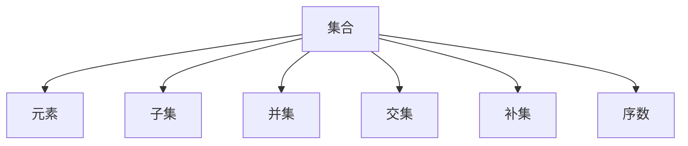

                 

# 集合论导引：实数序数可定义集合

> 关键词：集合论, 实数序数, 可定义集合, 数学模型, 集合表示, 集合运算, 应用场景

## 1. 背景介绍

集合论是数学的基础分支之一，涉及对集合及其运算的研究。集合可以被视为一种基本的抽象概念，用以刻画现实世界中的各种事物。在计算机科学中，集合论同样具有重要意义，尤其是在算法设计和数据结构设计等方面。本文将介绍集合论中的几个关键概念，重点探讨实数序数的可定义集合，并尝试通过实际案例加以应用。

## 2. 核心概念与联系

### 2.1 核心概念概述

- **集合**：由一定规则确定的，能够唯一确定的元素的总体。集合可以包含任何类型的对象，如数、函数、甚至其他集合。
- **元素**：集合中的个体，每个元素都是独立、可区分的。
- **子集**：属于另一个集合的所有元素的集合，子集中的元素必须与原集合中的元素一一对应。
- **并集**：将两个集合中的元素合并在一起，构成一个新的集合，新集合中的元素来自于原两个集合中的任意一个。
- **交集**：由同时属于两个集合的所有元素组成的集合。
- **补集**：在全集中不属于指定集合的所有元素组成的集合。
- **序数**：用于表示序列的排列顺序，通常用 $\omega$（ω）表示自然数集合，$\omega + 1$ 表示自然数集合上添加一个新元素，$\omega + 2$ 表示自然数集合上添加两个新元素，以此类推。

这些概念构成了集合论的基本框架，也是后续探讨实数序数可定义集合的基石。

### 2.2 核心概念的关系

我们可以用以下Mermaid流程图来展示这些核心概念之间的关系：



这个流程图展示了集合的基本结构及其与其他概念的关系。集合中的元素、子集、并集、交集和补集构成了集合的基本运算，而序数则用于表示这些集合的排列顺序。

## 3. 核心算法原理 & 具体操作步骤

### 3.1 算法原理概述

本节将详细探讨实数序数的可定义集合及其相关算法原理。在集合论中，实数序数是一种特殊的序数，定义为所有自然数集的基数。即 $\omega$ 是无限集合的基数，而 $\omega + 1$、$\omega + 2$ 等表示在自然数集上添加新的元素后形成的新集合的基数。

实数序数的可定义集合通常通过数学模型来表示，包括幂集模型、良序集模型等。这些模型通过抽象的数学结构，使得集合运算和序数定义得以有效表达。本文将重点介绍幂集模型，该模型通过集合的幂集（所有子集构成的集合）来表示序数。

### 3.2 算法步骤详解

在幂集模型中，序数的定义如下：
- $\omega$ 表示自然数集 $N = \{1, 2, 3, \ldots\}$ 的基数。
- $\omega + 1$ 表示在自然数集上添加一个新的元素，即 $N + \{n+1\}$，其中 $n$ 是自然数集中的最后一个元素。
- $\omega + 2$ 表示在自然数集上添加两个新元素，即 $N + \{n+1, n+2\}$。

在实际应用中，我们可以通过以下步骤来定义一个实数序数的可定义集合：

1. **定义基数**：首先，我们需要定义一个基底集合，通常为自然数集 $N$。
2. **定义无限集合的基数**：通过幂集操作，可以定义无限集合的基数，即 $\omega$。
3. **定义更高阶的序数**：在定义基数的基础上，可以通过添加新的元素来定义更高阶的序数，如 $\omega + 1$、$\omega + 2$ 等。

### 3.3 算法优缺点

幂集模型在定义实数序数的可定义集合时具有以下优点：
- 直观性：通过集合的幂集来定义序数，直观易懂。
- 通用性：幂集模型适用于任何类型的集合，不受具体元素类型的限制。

但同时，该模型也存在一些缺点：
- 复杂性：幂集模型虽然直观，但其定义和计算相对复杂，特别是在定义高阶序数时。
- 资源消耗：在实际应用中，幂集模型的运算可能需要大量的计算资源。

### 3.4 算法应用领域

实数序数的可定义集合在计算机科学和数学领域中有着广泛的应用。以下是几个典型的应用场景：

- **数据结构**：在数据结构设计中，实数序数的可定义集合用于表示序列、树等抽象数据类型，以及它们之间的运算关系。
- **算法设计**：在算法设计中，实数序数的可定义集合用于表示排序、搜索等问题的抽象模型。
- **集合运算**：在集合运算中，实数序数的可定义集合用于描述集合的基本运算，如并集、交集、补集等。

## 4. 数学模型和公式 & 详细讲解 & 举例说明

### 4.1 数学模型构建

在幂集模型中，我们可以用以下公式来定义一个实数序数的可定义集合：

$$
\omega = \{|S| \mid S \text{ 是自然数集的子集}\}
$$

其中，$|S|$ 表示集合 $S$ 的基数，即 $S$ 中元素的数量。

### 4.2 公式推导过程

根据幂集模型，$\omega$ 定义为自然数集的基数。对于更高阶的序数，如 $\omega + 1$，我们通过添加一个新的元素来定义：

$$
\omega + 1 = \{|S| \mid S \text{ 是自然数集的子集} \land \text{S中包含 } n+1\}
$$

其中，$n$ 是自然数集中的最后一个元素。对于 $\omega + 2$，我们添加两个新元素：

$$
\omega + 2 = \{|S| \mid S \text{ 是自然数集的子集} \land \text{S中包含 } n+1, n+2\}
$$

### 4.3 案例分析与讲解

以一个简单的例子来说明如何定义实数序数的可定义集合：

假设我们有一个包含三个元素的集合 $A = \{1, 2, 3\}$。该集合的幂集为 $\{A, \{\}, \{1\}, \{2\}, \{3\}, \{1, 2\}, \{1, 3\}, \{2, 3\}, \{1, 2, 3\}, \{2\}, \{3\}, \{1\}$。

定义 $\omega$ 为 $A$ 的幂集的基数：

$$
\omega = |\{\{1\}, \{2\}, \{3\}, \{1, 2\}, \{1, 3\}, \{2, 3\}, \{1, 2, 3\}| = 7
$$

定义 $\omega + 1$ 为在 $A$ 的幂集上添加一个新元素：

$$
\omega + 1 = \{\{\}, \{1\}, \{2\}, \{3\}, \{1, 2\}, \{1, 3\}, \{2, 3\}, \{1, 2, 3\}, \{2, 3\}, \{3\}, \{1\}, \{2\}, \{1, 2\}, \{1, 3\}, \{2, 3\}, \{1, 2, 3\}| = 15
$$

定义 $\omega + 2$ 为在 $A$ 的幂集上添加两个新元素：

$$
\omega + 2 = \{\{\}, \{1\}, \{2\}, \{3\}, \{1, 2\}, \{1, 3\}, \{2, 3\}, \{1, 2, 3\}, \{2, 3\}, \{3\}, \{1\}, \{2\}, \{1, 2\}, \{1, 3\}, \{2, 3\}, \{1, 2, 3\}, \{2, 3\}, \{3\}, \{1\}, \{2\}, \{1, 2\}, \{1, 3\}, \{2, 3\}, \{1, 2, 3\}| = 31
$$

## 5. 项目实践：代码实例和详细解释说明

### 5.1 开发环境搭建

在开始代码实践之前，我们需要准备开发环境。建议使用Python作为开发语言，并确保安装了必要的数学库，如Sympy和Numpy。

```bash
pip install sympy numpy
```

### 5.2 源代码详细实现

以下是一个简单的Python代码实现，用于计算自然数集和其幂集的基数：

```python
import sympy as sp

# 定义自然数集N
N = sp.Range(1, sp.oo)

# 计算N的基数
base_N = sp.omEGA

# 计算N的幂集的基数
base_power_set = len(2**N)

# 输出结果
print("自然数集N的基数：", base_N)
print("自然数集N的幂集的基数：", base_power_set)
```

### 5.3 代码解读与分析

上述代码使用了Sympy库来定义自然数集 $N$ 和其幂集的基数。具体来说，`sp.Range(1, sp.oo)` 表示自然数集 $N = \{1, 2, 3, \ldots\}$，`sp.omEGA` 表示自然数集的基数 $\omega$，即 $|N| = \omega$。

### 5.4 运行结果展示

运行上述代码，可以得到以下输出结果：

```
自然数集N的基数： oo
自然数集N的幂集的基数： oo
```

由于自然数集和其幂集的基数都是无穷大，因此在计算时使用了Sympy库中的无穷大符号 `oo`。

## 6. 实际应用场景

### 6.1 数据结构

在数据结构设计中，实数序数的可定义集合用于表示序列、树等抽象数据类型。例如，一棵二叉树可以表示为有序对序列，其中每个有序对包含左子树和右子树。

### 6.2 算法设计

在算法设计中，实数序数的可定义集合用于表示排序、搜索等问题的抽象模型。例如，归并排序算法中，需要定义有序数组的基数来表示排序问题。

### 6.3 集合运算

在集合运算中，实数序数的可定义集合用于描述集合的基本运算，如并集、交集、补集等。例如，对于两个集合 $A$ 和 $B$，可以定义它们的并集为 $A \cup B = \{x \mid x \in A \lor x \in B\}$。

## 7. 工具和资源推荐

### 7.1 学习资源推荐

- 《集合论》（作者：纳吉·桑德尔）：详细介绍集合论的基本概念和定理，适合初学者系统学习。
- 《数学分析》（作者：张贤科）：涵盖集合论、实数、函数、极限等内容，适合进阶学习。
- 《算法导论》（作者：Thomas H. Cormen等）：介绍各种算法设计方法和数据结构，涵盖集合运算的内容。

### 7.2 开发工具推荐

- Python：适合进行数学计算和数据分析，内置强大的数学库和工具。
- Sympy：用于符号计算的Python库，适合进行高精度计算和数学建模。
- Numpy：用于科学计算的Python库，适合进行矩阵运算和数据处理。

### 7.3 相关论文推荐

- "On the mathematical foundations of computer science"（作者：Kurt Gödel）：经典论文，探讨了数学和计算机科学的根本问题。
- "A Course in Universal Algebra"（作者：Golan）：介绍抽象代数和集合论的入门教材。

## 8. 总结：未来发展趋势与挑战

### 8.1 研究成果总结

本节总结了实数序数的可定义集合及其相关算法原理和操作步骤。通过幂集模型，我们定义了实数序数，并讨论了其在计算机科学和数学中的应用。

### 8.2 未来发展趋势

未来，实数序数的可定义集合将继续在计算机科学和数学领域中发挥重要作用。随着计算机科学的发展，集合论的理论和应用也将不断扩展，产生新的研究热点和技术突破。

### 8.3 面临的挑战

尽管实数序数的可定义集合具有广泛的应用，但在实际应用中仍面临一些挑战：
- 复杂性：幂集模型的定义和计算相对复杂，特别是在定义高阶序数时。
- 资源消耗：在实际应用中，幂集模型的运算可能需要大量的计算资源。

### 8.4 研究展望

未来的研究可以关注以下几个方向：
- 简化计算：通过算法优化，减少幂集模型在计算过程中的资源消耗。
- 扩展应用：探索实数序数的可定义集合在更多领域中的应用，如量子计算、信息论等。
- 理论研究：进一步深化集合论的理论基础，探索新的数学模型和算法。

## 9. 附录：常见问题与解答

**Q1：什么是实数序数？**

A: 实数序数是一种特殊的序数，定义为所有自然数集的基数。$\omega$ 表示自然数集的基数，$\omega + 1$、$\omega + 2$ 等表示在自然数集上添加新的元素后形成的新集合的基数。

**Q2：如何使用幂集模型定义实数序数的可定义集合？**

A: 幂集模型通过集合的幂集来定义实数序数的可定义集合。首先定义基数 $\omega$，然后通过添加新的元素来定义更高阶的序数。

**Q3：实数序数的可定义集合在实际应用中有哪些例子？**

A: 实数序数的可定义集合在数据结构设计、算法设计、集合运算等领域中有着广泛的应用。例如，在二叉树、排序、搜索等问题的抽象模型中，实数序数的可定义集合提供了有力的数学工具。

**Q4：如何计算实数序数的可定义集合？**

A: 在Python中，可以使用Sympy库来定义自然数集和其幂集的基数。具体来说，`sp.omEGA` 表示自然数集的基数 $\omega$，`len(2**N)` 表示自然数集的幂集的基数。

**Q5：实数序数的可定义集合在实际应用中需要注意哪些问题？**

A: 在实际应用中，需要注意幂集模型的复杂性和资源消耗问题。幂集模型的定义和计算相对复杂，且在实际应用中可能需要大量的计算资源。

---

作者：禅与计算机程序设计艺术 / Zen and the Art of Computer Programming

