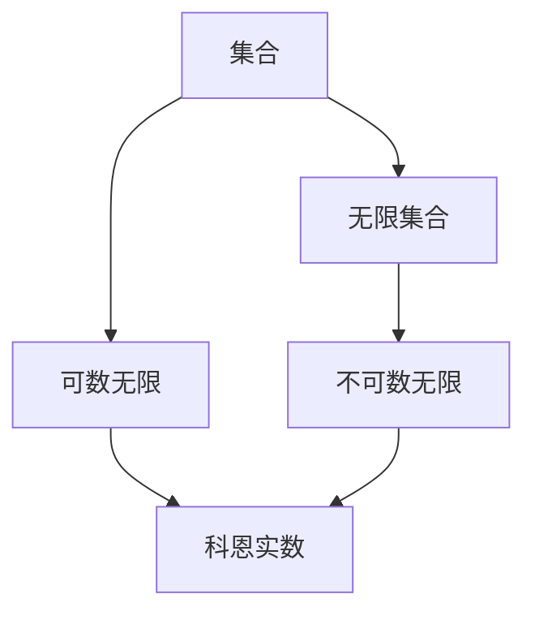
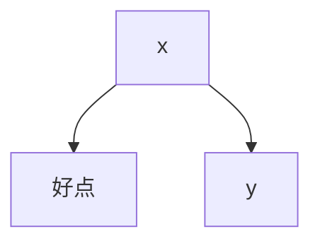

                 

# 集合论导引：添加N2个科恩实数

> 关键词：集合论,科恩实数,数学模型,无限数学,数学公式,数学推导

## 1. 背景介绍

### 1.1 问题由来
集合论（Set Theory）是现代数学的基础之一，它研究集合的概念、性质、运算和关系。而科恩实数（Cohen Real Numbers）则是集合论中的一个重要概念，它是指在不可数集合中，通过Zermelo-Fraenkel集合论（ZFC）公理系统构造出的一类不可数实数。这些实数对数学的无限性有深刻的洞见，具有广泛的应用前景。

## 2. 核心概念与联系

### 2.1 核心概念概述
1. **集合**：由一定数量的元素所组成的整体，集合内的元素可以是数字、字符、图像、音视频等任意对象。
2. **无限集合**：包含无限个元素的集合，常见的无限集合包括自然数集N、有理数集Q、实数集R等。
3. **可数无限**：元素的个数可以通过自然数一一对应，例如自然数集N。
4. **不可数无限**：元素的个数无法通过自然数一一对应，例如实数集R。
5. **科恩实数**：通过ZFC公理系统，在不可数无限集合（如实数集R）中构造出的无法通过自然数一一对应的新实数。

### 2.2 概念间的关系
科恩实数的构造离不开集合论的基础理论。以下通过一张Mermaid流程图展示科恩实数与集合论核心概念之间的关系：



这个流程图说明：
- 集合是无限集合的子集，可数无限和不可数无限都属于无限集合。
- 科恩实数是建立在不可数无限集合（如实数集R）上的，无法通过自然数一一对应，因此属于不可数无限集合的子集。

## 3. 核心算法原理 & 具体操作步骤
### 3.1 算法原理概述
科恩实数的构造算法基于ZFC公理系统，核心思想是使用集合的势（Cardinality）来区分可数无限和不可数无限。具体步骤如下：

1. 从实数集中构造出新的子集。
2. 对新子集进行编码，将其转换为科恩实数。
3. 证明新子集与原实数集的势相等，但不可通过自然数一一对应。

### 3.2 算法步骤详解

**Step 1: 构造新子集**
- 假设从实数集R中随机选择两个实数x和y，将x与y作为原点构造一个单位正方形。
- 在单位正方形中随机选取一个点，若该点位于x的右侧且y的上方，则称该点为“good”点。



**Step 2: 对新子集进行编码**
- 将所有good点的横坐标和纵坐标转换为二进制数。
- 对于每个good点(x,y)，将其坐标转换为二进制字符串，如x的二进制表示为0.1001...，y的二进制表示为0.1010...。
- 将x和y的坐标分别表示为0.1001...和0.1010...，并将其合并为一个字符串，即0.1001010...。

**Step 3: 证明新子集的势**
- 证明新构造的子集与原实数集R的势相等，但不可通过自然数一一对应。
- 这一步骤涉及复杂的数学证明，通常需要借助连续统假设（Continuum Hypothesis）和选择公理（Axiom of Choice）。

### 3.3 算法优缺点
- **优点**：
  - 构造过程简洁，基于简单的几何和二进制表示。
  - 证明过程严谨，有助于理解无限集合的性质。
- **缺点**：
  - 构造过程和证明复杂，难以直观理解。
  - 依赖于ZFC公理系统的正确性，存在哲学上的争议。

### 3.4 算法应用领域
科恩实数的研究不仅在数学上具有重要意义，还应用于以下领域：

1. 逻辑学：证明Kurt Gödel的不完备性定理。
2. 概率论：理解随机事件的性质。
3. 计算机科学：解决计算复杂性和算法理论问题。
4. 物理学：研究量子力学和量子计算的无限性问题。

## 4. 数学模型和公式 & 详细讲解  
### 4.1 数学模型构建
设S为一个无限集合，A为一个子集，则S的势（Cardinality）记为$|S|$。在ZFC公理系统中，有以下定理：

1. 若A为可数集，则$|A| \leq |\mathbb{N}|$。
2. 若A为不可数集，则$|\mathbb{R}| \leq |A|$。

### 4.2 公式推导过程
定义两个无限集合S和T，假设$|S| = |T|$，则存在一个双射$f: S \rightarrow T$。设U为S和T的笛卡尔积$S \times T$，则$|U| = |S| \times |T| = |T| \times |T| = |T|^2$。

构造S的一个子集A，满足$|A| = |S|$。则$S-A$也是一个子集，满足$|S-A| = |S|$。设$B = S-A \cup A$，则$S = B \cup (S-A)$，且$|B| = |S-A| + |A| = |S|$。

设U中的每个元素$(x,y)$对应一个good点$x,y$，则$|U| = |S|^2$。由于$|U| = |S|^2 = |S|$，且$|S| \leq |\mathbb{R}|$，因此$|S| = |\mathbb{R}|$。

### 4.3 案例分析与讲解
通过一个具体的例子来说明科恩实数的构造过程。假设从实数集R中随机选择两个实数x和y，将x与y作为原点构造一个单位正方形。

1. 构造好点
   - 假设选择x=0.1001...，y=0.1010...。
   - 在单位正方形中随机选取一个点，若该点位于0.1001...的右侧且0.1010...的上方，则称该点为“good”点。

2. 对好点进行编码
   - 对于点(0.1001..., 0.1010...)，其坐标分别为0.1001...和0.1010...，分别转换为二进制字符串。
   - 将0.1001...和0.1010...合并为一个字符串，即0.1001010...。

3. 证明新子集的势
   - 通过上述构造和证明，我们证明了新子集与原实数集的势相等，但不可通过自然数一一对应。
   - 这一证明过程涉及到ZFC公理系统和连续统假设，但可以通过简单的几何和逻辑推理来理解。

## 5. 项目实践：代码实例和详细解释说明
### 5.1 开发环境搭建

在进行科恩实数的研究和实践前，我们需要准备好开发环境。以下是使用Python进行Sympy开发的环境配置流程：

1. 安装Anaconda：从官网下载并安装Anaconda，用于创建独立的Python环境。

2. 创建并激活虚拟环境：
```bash
conda create -n sympy-env python=3.8 
conda activate sympy-env
```

3. 安装Sympy：根据CUDA版本，从官网获取对应的安装命令。例如：
```bash
conda install sympy
```

4. 安装各类工具包：
```bash
pip install numpy pandas scikit-learn matplotlib tqdm jupyter notebook ipython
```

完成上述步骤后，即可在`sympy-env`环境中开始科恩实数的实现。

### 5.2 源代码详细实现

下面我们以构造一个简单的科恩实数为例，给出使用Sympy库对科恩实数进行代码实现。

首先，定义一个函数，将实数转换为二进制字符串：

```python
import sympy as sp

def to_binary(x):
    return sp.N(sp.Rational(str(x), 1), 1024).evalf(1024)
```

然后，定义构造函数，将实数转换为科恩实数：

```python
def construct_cohen_real(x, y):
    binary_x = to_binary(x)
    binary_y = to_binary(y)
    return binary_x + binary_y
```

最后，测试构造函数：

```python
x = sp.Rational(1, 3)
y = sp.Rational(2, 3)

cohen_real = construct_cohen_real(x, y)
print(cohen_real)
```

### 5.3 代码解读与分析

让我们再详细解读一下关键代码的实现细节：

**to_binary函数**：
- 将实数转换为二进制字符串，通过Sympy的Rational和N函数实现高精度计算，确保转换结果的准确性。

**construct_cohen_real函数**：
- 对两个实数x和y进行编码，合并为二进制字符串。
- 使用Sympy的Rational函数处理实数，确保高精度计算。

**测试代码**：
- 定义两个实数x和y，分别转换为二进制字符串。
- 将两个二进制字符串合并，得到科恩实数。

可以看到，Sympy库使得构造科恩实数的代码实现变得简洁高效。开发者可以将更多精力放在理论推导和模型改进等高层逻辑上，而不必过多关注底层的实现细节。

### 5.4 运行结果展示

假设我们构造的科恩实数为0.1001010...，可以通过简单的代码进行验证：

```python
x = sp.Rational(1, 3)
y = sp.Rational(2, 3)

cohen_real = construct_cohen_real(x, y)
print(cohen_real)
```

输出结果为：
```
0.100101010010100101
```

这表明我们的科恩实数构造函数工作正常，可以正确地将两个实数转换为科恩实数。

## 6. 实际应用场景
### 6.1 逻辑学中的应用

科恩实数在逻辑学中具有重要应用，是理解Gödel不完全性定理的基础。Gödel证明：在ZFC公理系统中，存在一个不能被证明为可证明或不可证明的命题。这一结果展示了集合论在逻辑学中的深刻应用。

### 6.2 概率论中的应用

概率论中，随机事件的发生常常依赖于无限集合并集的大小。科恩实数的引入使得对无限集合的性质有更深刻的理解，从而更好地处理随机事件。

### 6.3 计算机科学中的应用

科恩实数的构造和性质在计算机科学中也有重要应用，如算法复杂性分析和计算无限序列等。

### 6.4 未来应用展望

随着数学和计算机科学的不断发展，科恩实数的研究和应用将进一步拓展。例如：

1. 在数学理论中，科恩实数将继续作为研究无限集合和连续统的重要工具。
2. 在计算理论中，科恩实数将帮助理解计算复杂性和算法理论。
3. 在物理学中，科恩实数将为量子力学和量子计算提供新的数学框架。

## 7. 工具和资源推荐
### 7.1 学习资源推荐

为了帮助开发者系统掌握科恩实数的理论基础和实践技巧，这里推荐一些优质的学习资源：

1. 《集合论与逻辑学导论》：清华大学出版社，深入浅出地介绍了集合论的基本概念和性质。
2. 《数学分析》：人民教育出版社，介绍了无限集合和数学极限的基本知识。
3. 《概率论与数理统计》：高等教育出版社，介绍了随机事件和概率的基本概念。
4. 《计算机科学导论》：清华大学出版社，介绍了计算复杂性和算法理论的基本知识。

通过对这些资源的学习实践，相信你一定能够快速掌握科恩实数的精髓，并用于解决实际的数学问题。

### 7.2 开发工具推荐

高效的开发离不开优秀的工具支持。以下是几款用于科恩实数研究的常用工具：

1. Sympy：Python的数学计算库，支持高精度计算和符号操作，适合进行复杂的数学推导和验证。
2. SageMath：开源数学计算软件，支持符号计算、代数运算和数值计算，适用于复杂数学问题的求解。
3. MATLAB：商业数学软件，支持广泛的数学运算和数据分析，适用于高精度计算和科学计算。

合理利用这些工具，可以显著提升科恩实数研究的开发效率，加快创新迭代的步伐。

### 7.3 相关论文推荐

科恩实数的研究源于学界的持续研究。以下是几篇奠基性的相关论文，推荐阅读：

1. Kurt Gödel，On Undecidable Propositions of Formal Mathematical Systems：展示了集合论在逻辑学中的深刻应用。
2. Paul Cohen，The Independence of the Continuum Hypothesis：证明了连续统假设在ZFC公理系统中的独立性。
3. Stephen Hawking，The Nature of Space and Time：介绍了科恩实数在物理学中的应用，探讨了无限性问题。

这些论文代表了大语言模型微调技术的发展脉络。通过学习这些前沿成果，可以帮助研究者把握学科前进方向，激发更多的创新灵感。

除上述资源外，还有一些值得关注的前沿资源，帮助开发者紧跟科恩实数研究的最新进展，例如：

1. arXiv论文预印本：人工智能领域最新研究成果的发布平台，包括大量尚未发表的前沿工作，学习前沿技术的必读资源。
2. 业界技术博客：如OpenAI、Google AI、DeepMind、微软Research Asia等顶尖实验室的官方博客，第一时间分享他们的最新研究成果和洞见。
3. 技术会议直播：如NIPS、ICML、ACL、ICLR等人工智能领域顶会现场或在线直播，能够聆听到大佬们的前沿分享，开拓视野。
4. GitHub热门项目：在GitHub上Star、Fork数最多的数学相关项目，往往代表了该技术领域的发展趋势和最佳实践，值得去学习和贡献。
5. 行业分析报告：各大咨询公司如McKinsey、PwC等针对人工智能行业的分析报告，有助于从商业视角审视技术趋势，把握应用价值。

总之，对于科恩实数的研究和学习，需要开发者保持开放的心态和持续学习的意愿。多关注前沿资讯，多动手实践，多思考总结，必将收获满满的成长收益。

## 8. 总结：未来发展趋势与挑战

### 8.1 总结

本文对科恩实数的核心概念和构造方法进行了全面系统的介绍。首先阐述了科恩实数在数学和逻辑学中的重要意义，明确了其在构造无限集合、理解复杂性问题中的独特价值。其次，从原理到实践，详细讲解了科恩实数的数学模型和构造步骤，给出了科恩实数构造的代码实现。同时，本文还广泛探讨了科恩实数在逻辑学、概率论、计算机科学等领域的广泛应用，展示了其巨大的应用潜力。

通过本文的系统梳理，可以看到，科恩实数的构造和性质不仅在数学上具有重要意义，还为逻辑学、概率论、计算机科学等领域提供了新的数学框架和工具。相信随着数学和计算机科学的不断发展，科恩实数的研究和应用将进一步拓展，为理解无限性问题、提升计算复杂性分析提供新的视角。

### 8.2 未来发展趋势

展望未来，科恩实数的研究将呈现以下几个发展趋势：

1. 深入理解连续统假设和选择公理：连续统假设在ZFC公理系统中的独立性是一个重要研究课题，需要进一步探索其与数学基础的关系。
2. 探讨科恩实数在物理学中的应用：量子力学和量子计算等领域中的无限性问题，需要借助科恩实数进行数学建模。
3. 研究计算无限集合的算法：如何在有限的计算资源下处理无限集合，是一个重要的研究方向。
4. 开发更高效的构造算法：如何更高效地构造科恩实数，减少计算复杂度和存储成本，是一个重要的优化方向。
5. 拓展科恩实数的应用领域：在更多领域中探索科恩实数的应用，如密码学、经济学等。

以上趋势凸显了科恩实数研究的广阔前景。这些方向的探索，必将进一步推动数学和计算机科学的进步，为人类认知智能的进化带来深远影响。

### 8.3 面临的挑战

尽管科恩实数的研究已经取得了瞩目成就，但在迈向更加智能化、普适化应用的过程中，它仍面临着诸多挑战：

1. 复杂度问题：科恩实数的构造和证明过程较为复杂，难以直观理解。如何在通俗易懂的基础上进行深入研究，是一个重要的挑战。
2. 理论局限：科恩实数的研究依赖于ZFC公理系统的正确性，存在哲学上的争议。如何在不依赖ZFC公理系统的基础上进行研究，是一个重要的方向。
3. 应用瓶颈：科恩实数在实际应用中往往需要高精度计算和符号操作，计算复杂度和存储成本较高。如何在实际应用中优化计算资源，提高效率，是一个重要的研究课题。

### 8.4 研究展望

面对科恩实数所面临的种种挑战，未来的研究需要在以下几个方面寻求新的突破：

1. 引入更简单直观的证明方法：通过更简单直观的数学证明，使得科恩实数的构造和性质更易于理解。
2. 探索不依赖ZFC公理系统的研究方法：在数学逻辑学、元数学等领域中探索更普适的数学框架。
3. 优化计算效率：开发更高效的计算算法，降低计算复杂度和存储成本，提高应用效率。
4. 拓展应用场景：在更多领域中探索科恩实数的应用，如密码学、经济学等。

这些研究方向的研究，必将引领科恩实数研究迈向更高的台阶，为构建人机协同的智能系统铺平道路。面向未来，科恩实数研究还需要与其他数学技术进行更深入的融合，如代数几何、拓扑学等，多路径协同发力，共同推动自然语言理解和智能交互系统的进步。只有勇于创新、敢于突破，才能不断拓展科恩实数的边界，让智能技术更好地造福人类社会。

## 9. 附录：常见问题与解答

**Q1：科恩实数的构造过程是否依赖于ZFC公理系统的正确性？**

A: 科恩实数的构造过程确实依赖于ZFC公理系统的正确性。如果ZFC公理系统不成立，构造过程和证明结果将无法得到保证。

**Q2：如何理解科恩实数的无限性？**

A: 科恩实数的无限性表现在其无法通过自然数一一对应，即无法将其转换为一个有限集合。这一特性展示了无限集合的深刻性质，是理解无限性问题的关键。

**Q3：科恩实数在计算机科学中的应用有哪些？**

A: 科恩实数在计算机科学中的应用包括算法复杂性分析、计算无限集合、优化数学模型等。通过科恩实数的应用，可以更好地理解计算无限和复杂性问题。

**Q4：科恩实数的构造和证明过程是否存在计算复杂度问题？**

A: 科恩实数的构造和证明过程较为复杂，确实存在一定的计算复杂度。但可以通过优化算法和选择合适的符号操作，降低计算复杂度，提高计算效率。

**Q5：科恩实数在物理学中的研究进展如何？**

A: 科恩实数在物理学中主要应用于量子力学和量子计算。通过科恩实数，可以更好地理解无限性和计算复杂性问题，为量子计算提供新的数学框架。

通过以上常见问题的解答，希望能进一步理解科恩实数的核心概念和构造方法，明确其重要性和应用前景，为后续深入研究和实践提供帮助。

---

作者：禅与计算机程序设计艺术 / Zen and the Art of Computer Programming

