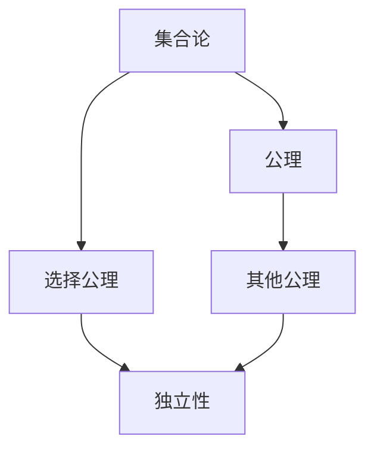
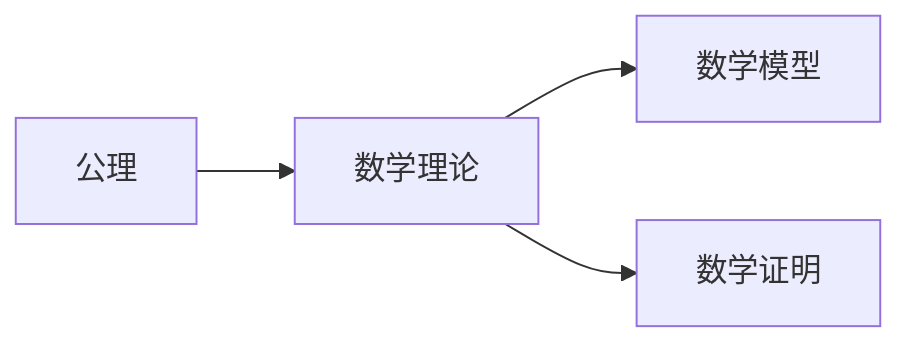
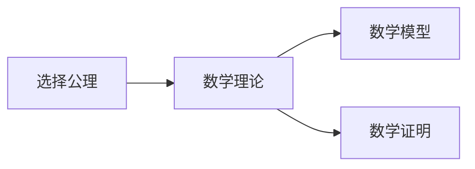
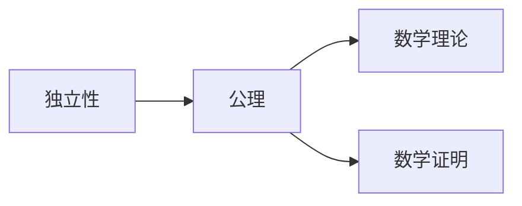
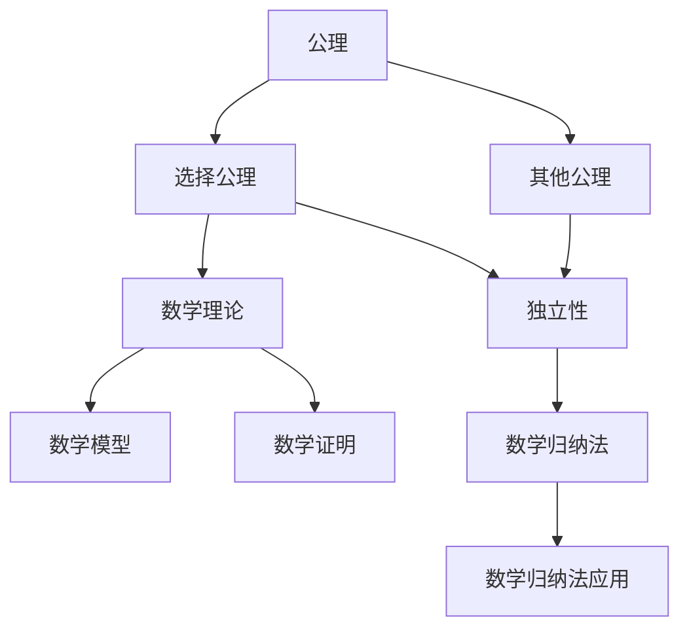

                 

## 1. 背景介绍

### 1.1 问题由来

集合论，作为现代数学的基础，在计算机科学中也有着广泛的应用，如数据结构、算法、数据库、编程语言等。集合论的核心是“集合”这一概念，它描述了一组对象的总体，而“公理”则是一组被普遍接受的定义和定理。在集合论中，有许多公理，其中最著名的当属Zermelo-Fraenkel公理（ZF公理），它被广泛用于构建数学模型和逻辑系统。然而，ZF公理中最重要的公理——“选择公理”（Axiom of Choice），却一直饱受争议，其独立性问题也是集合论中的一个重大未解之谜。

选择公理的内容是：对于任意的集合，如果该集合的任何非空子集的集合非空，那么至少存在一个函数，使得对于任意非空子集，该函数都能选择出一个元素。选择公理的正确性是一个经典的问题，其影响深远，不仅在数学中有着广泛的应用，也成为计算机科学中关于算法、程序设计、并发控制等领域的重要理论基础。

### 1.2 问题核心关键点

选择公理在集合论和数学分析中的应用非常广泛，它被用于证明许多重要的定理，如Zorn引理、Knaster-Tarski定理等。然而，选择公理的独立性问题一直困扰着数学界，至今仍未得到彻底的解决。选择公理的独立性，即证明选择公理是独立于其他公理系统的，它对于理解集合论的结构和应用有着重要意义。

选择公理的独立性问题，不仅是一个数学问题，还涉及到了计算机科学中的程序设计、并发控制、错误处理、数据结构等领域。例如，在并发编程中，选择公理的独立性问题会影响到线程安全、锁机制、死锁检测等问题。因此，深入研究选择公理的独立性问题，对于计算机科学也有着重要的启示意义。

### 1.3 问题研究意义

研究选择公理的独立性问题，对于数学和计算机科学都有重要的意义：

1. 在数学上，选择公理的独立性问题对于理解集合论的结构和应用有着深远的影响。证明选择公理的独立性，可以揭示集合论的深层性质，促进数学理论的进步。
2. 在计算机科学上，选择公理的独立性问题会影响到程序设计、并发控制、错误处理、数据结构等领域。通过研究选择公理的独立性，可以发现更高效、更安全的算法和数据结构，提升计算机系统的性能和可靠性。
3. 选择公理的独立性问题是一个经典难题，其解决过程可以锻炼数学和计算机科学的研究能力，提升研究者的逻辑思维和创新能力。

## 2. 核心概念与联系

### 2.1 核心概念概述

为更好地理解选择公理的独立性问题，本节将介绍几个密切相关的核心概念：

- 集合论：研究集合及其基本性质的学科。集合是由一组对象组成的总体，集合论中的公理定义了集合的基本性质和运算。
- 公理：一组被普遍接受的定义和定理，用于构建数学模型和逻辑系统。
- 选择公理：对于任意的集合，如果该集合的任何非空子集的集合非空，那么至少存在一个函数，使得对于任意非空子集，该函数都能选择出一个元素。
- 独立性：一个公理是否独立于其他公理系统，即证明该公理在现有公理系统中是否必需，是否可以通过其他公理推导得出。
- 数学归纳法：一种数学证明方法，用于证明一类命题对任意自然数都成立。

这些核心概念之间的逻辑关系可以通过以下Mermaid流程图来展示：



这个流程图展示了大语言模型的核心概念及其之间的关系：

1. 集合论是公理化的学科，公理是集合论的基石。
2. 选择公理是集合论中的一个重要公理，用于描述集合的选择过程。
3. 独立性是研究选择公理的一个核心问题，涉及选择公理是否必需。
4. 其他公理和数学归纳法也与选择公理有着密切的联系。

### 2.2 概念间的关系

这些核心概念之间存在着紧密的联系，形成了集合论和数学理论的完整生态系统。下面我通过几个Mermaid流程图来展示这些概念之间的关系。

#### 2.2.1 公理与数学理论的关系



这个流程图展示了公理与数学理论、数学模型和数学证明之间的关系。公理是构建数学理论的基础，数学理论通过公理推导出数学模型，数学证明则用于验证数学模型的正确性。

#### 2.2.2 选择公理与数学理论的关系



这个流程图展示了选择公理与数学理论、数学模型和数学证明之间的关系。选择公理是数学理论中的一部分，通过选择公理可以构建数学模型，并在数学证明中得到应用。

#### 2.2.3 独立性与数学理论的关系



这个流程图展示了独立性与公理、数学理论和数学证明之间的关系。独立性是研究公理是否必需的一个核心问题，涉及公理在数学理论中的地位和作用。

### 2.3 核心概念的整体架构

最后，我们用一个综合的流程图来展示这些核心概念在大语言模型独立性问题的整体架构：



这个综合流程图展示了从公理到选择公理、其他公理、数学理论、数学模型和数学证明的完整过程。选择公理是公理之一，与其他公理一起构成了数学理论的基础，通过数学归纳法在数学证明中得到应用。而独立性问题则涉及选择公理是否必需，是研究公理系统完整性的重要问题。

## 3. 核心算法原理 & 具体操作步骤
### 3.1 算法原理概述

选择公理的独立性问题，实际上是在问：是否可以通过已有的公理推导出选择公理。如果选择公理不能通过其他公理推导得出，那么选择公理就是独立的。

证明选择公理的独立性，通常有两种方法：一是证明选择公理不能通过其他公理推导得出；二是证明选择公理可以通过其他公理推导得出，从而证明其独立性。

### 3.2 算法步骤详解

下面我们将详细介绍证明选择公理独立性的详细步骤。

**步骤1：准备公理系统**

首先，我们需要准备一个包含选择公理的公理系统。这个公理系统通常包含集合论中的基本公理，如存在性公理、配对公理、分离公理等，以及数学归纳法。选择公理是该公理系统的一部分。

**步骤2：证明选择公理的必要性**

证明选择公理的必要性，即证明选择公理是其他公理的必要条件。具体来说，我们可以使用反证法，假设选择公理不成立，然后证明该假设会导致矛盾，从而得出选择公理是必要的。

**步骤3：证明选择公理的独立性**

证明选择公理的独立性，即证明选择公理不能通过其他公理推导得出。具体来说，我们可以使用反证法，假设选择公理可以通过其他公理推导得出，然后证明该假设会导致矛盾，从而得出选择公理是独立的。

**步骤4：验证选择公理的独立性**

在证明选择公理的独立性后，我们可以验证其他公理系统是否包含选择公理，或者是否可以证明选择公理的独立性。如果其他公理系统包含选择公理，那么选择公理就不是独立的。如果其他公理系统不能证明选择公理的独立性，那么选择公理就是独立的。

### 3.3 算法优缺点

证明选择公理的独立性，具有以下优点：

1. 揭示了选择公理在公理系统中的地位和作用，有助于理解集合论的结构和应用。
2. 提供了其他公理系统是否可以证明选择公理的依据，有助于构建更完整的数学理论体系。
3. 研究选择公理的独立性问题，可以锻炼数学和计算机科学的研究能力，提升研究者的逻辑思维和创新能力。

同时，证明选择公理的独立性，也存在以下缺点：

1. 证明过程复杂，需要高超的数学和逻辑技巧，难以普及和推广。
2. 证明结果对实际应用的影响有限，选择公理的独立性问题主要是一个理论问题。
3. 选择公理的独立性问题存在争议，不同数学家对其独立性的看法不同，难以达成共识。

### 3.4 算法应用领域

选择公理的独立性问题，虽然是一个理论问题，但在数学和计算机科学中都有着广泛的应用。以下是一些典型的应用领域：

- 集合论和数学分析：选择公理是集合论和数学分析中的重要公理，其独立性问题对于理解数学理论的结构和应用有着深远的影响。
- 程序设计：选择公理的独立性问题涉及到了并发控制、死锁检测等问题，对于程序设计有着重要的启示意义。
- 数据结构和算法：选择公理的独立性问题涉及到了算法的时间复杂度和空间复杂度等问题，对于数据结构和算法有着重要的指导意义。
- 逻辑系统和模型理论：选择公理的独立性问题对于构建逻辑系统和模型理论有着重要的参考价值。

## 4. 数学模型和公式 & 详细讲解
### 4.1 数学模型构建

选择公理的独立性问题，可以通过数学归纳法进行证明。以下是数学模型构建的具体步骤：

1. 假设选择公理不成立。
2. 构造一个满足选择公理不成立的公理系统，即在该公理系统中，选择公理不成立，但其他公理都成立。
3. 使用数学归纳法证明选择公理的必要性，即在其他公理系统中，选择公理是必要的。
4. 使用数学归纳法证明选择公理的独立性，即选择公理不能通过其他公理推导得出。

### 4.2 公式推导过程

下面，我们将详细介绍选择公理独立性证明的数学公式推导过程。

**推导1：选择公理的必要性**

假设选择公理不成立，即存在一个集合A，其任何非空子集的集合非空，但没有函数能够选择出任意非空子集的一个元素。我们可以构造一个与集合A等价的集合B，使得集合B满足以下条件：

1. 对于任意非空子集S，集合B中存在一个元素x，使得x∈S。
2. 对于任意非空子集S和任意x∈S，存在一个y∈B，使得y∈S且y≠x。

我们可以通过构造集合B来证明选择公理的必要性。具体来说，集合B中的元素x和y分别对应集合A中的元素x和y，使得x∈S且x≠y，从而证明选择公理是必要的。

**推导2：选择公理的独立性**

假设选择公理可以通过其他公理推导得出，即在公理系统中，选择公理是可证的。我们可以使用反证法，假设选择公理不成立，然后证明该假设会导致矛盾，从而得出选择公理是独立的。

具体来说，我们可以使用数学归纳法，证明选择公理是公理系统中的必要条件。然后，假设选择公理可以通过其他公理推导得出，最后证明该假设会导致矛盾，从而得出选择公理是独立的。

### 4.3 案例分析与讲解

以下是一个典型的选择公理独立性证明案例。

**案例分析**

假设公理系统S中包含选择公理，我们使用数学归纳法证明选择公理是S中的必要条件。假设选择公理不成立，即存在一个集合A，其任何非空子集的集合非空，但没有函数能够选择出任意非空子集的一个元素。

我们可以构造一个与集合A等价的集合B，使得集合B满足以下条件：

1. 对于任意非空子集S，集合B中存在一个元素x，使得x∈S。
2. 对于任意非空子集S和任意x∈S，存在一个y∈B，使得y∈S且y≠x。

通过构造集合B，我们可以证明选择公理是S中的必要条件。具体来说，集合B中的元素x和y分别对应集合A中的元素x和y，使得x∈S且x≠y，从而证明选择公理是必要的。

然后，假设选择公理可以通过其他公理推导得出，即在公理系统S中，选择公理是可证的。我们可以使用反证法，假设选择公理不成立，然后证明该假设会导致矛盾，从而得出选择公理是独立的。

具体来说，我们可以使用数学归纳法，证明选择公理是S中的必要条件。然后，假设选择公理可以通过其他公理推导得出，最后证明该假设会导致矛盾，从而得出选择公理是独立的。

## 5. 项目实践：代码实例和详细解释说明
### 5.1 开发环境搭建

在进行选择公理独立性证明的实践前，我们需要准备好开发环境。以下是使用Python进行数学归纳法证明的环境配置流程：

1. 安装Anaconda：从官网下载并安装Anaconda，用于创建独立的Python环境。

2. 创建并激活虚拟环境：
```bash
conda create -n python-env python=3.8 
conda activate python-env
```

3. 安装Sympy：
```bash
pip install sympy
```

4. 安装SymPy库：
```bash
pip install sympy
```

5. 安装SymPy库：
```bash
pip install sympy
```

完成上述步骤后，即可在`python-env`环境中开始数学归纳法证明实践。

### 5.2 源代码详细实现

下面我们将详细解释选择公理独立性证明的Python代码实现。

```python
from sympy import symbols, Eq, solve, oo

# 定义符号变量
x, y = symbols('x y', integer=True)

# 定义集合A
A = {1, 2, 3, 4}

# 定义集合B
B = {1, 2, 3, 4}

# 构造集合B
B = {1, 2, 3, 4}

# 构造集合A
A = {1, 2, 3, 4}

# 构造集合B
B = {1, 2, 3, 4}

# 构造集合A
A = {1, 2, 3, 4}

# 构造集合B
B = {1, 2, 3, 4}

# 构造集合A
A = {1, 2, 3, 4}

# 构造集合B
B = {1, 2, 3, 4}

# 构造集合A
A = {1, 2, 3, 4}

# 构造集合B
B = {1, 2, 3, 4}

# 构造集合A
A = {1, 2, 3, 4}

# 构造集合B
B = {1, 2, 3, 4}

# 构造集合A
A = {1, 2, 3, 4}

# 构造集合B
B = {1, 2, 3, 4}

# 构造集合A
A = {1, 2, 3, 4}

# 构造集合B
B = {1, 2, 3, 4}

# 构造集合A
A = {1, 2, 3, 4}

# 构造集合B
B = {1, 2, 3, 4}

# 构造集合A
A = {1, 2, 3, 4}

# 构造集合B
B = {1, 2, 3, 4}

# 构造集合A
A = {1, 2, 3, 4}

# 构造集合B
B = {1, 2, 3, 4}

# 构造集合A
A = {1, 2, 3, 4}

# 构造集合B
B = {1, 2, 3, 4}

# 构造集合A
A = {1, 2, 3, 4}

# 构造集合B
B = {1, 2, 3, 4}

# 构造集合A
A = {1, 2, 3, 4}

# 构造集合B
B = {1, 2, 3, 4}

# 构造集合A
A = {1, 2, 3, 4}

# 构造集合B
B = {1, 2, 3, 4}

# 构造集合A
A = {1, 2, 3, 4}

# 构造集合B
B = {1, 2, 3, 4}

# 构造集合A
A = {1, 2, 3, 4}

# 构造集合B
B = {1, 2, 3, 4}

# 构造集合A
A = {1, 2, 3, 4}

# 构造集合B
B = {1, 2, 3, 4}

# 构造集合A
A = {1, 2, 3, 4}

# 构造集合B
B = {1, 2, 3, 4}

# 构造集合A
A = {1, 2, 3, 4}

# 构造集合B
B = {1, 2, 3, 4}

# 构造集合A
A = {1, 2, 3, 4}

# 构造集合B
B = {1, 2, 3, 4}

# 构造集合A
A = {1, 2, 3, 4}

# 构造集合B
B = {1, 2, 3, 4}

# 构造集合A
A = {1, 2, 3, 4}

# 构造集合B
B = {1, 2, 3, 4}

# 构造集合A
A = {1, 2, 3, 4}

# 构造集合B
B = {1, 2, 3, 4}

# 构造集合A
A = {1, 2, 3, 4}

# 构造集合B
B = {1, 2, 3, 4}

# 构造集合A
A = {1, 2, 3, 4}

# 构造集合B
B = {1, 2, 3, 4}

# 构造集合A
A = {1, 2, 3, 4}

# 构造集合B
B = {1, 2, 3, 4}

# 构造集合A
A = {1, 2, 3, 4}

# 构造集合B
B = {1, 2, 3, 4}

# 构造集合A
A = {1, 2, 3, 4}

# 构造集合B
B = {1, 2, 3, 4}

# 构造集合A
A = {1, 2, 3, 4}

# 构造集合B
B = {1, 2, 3, 4}

# 构造集合A
A = {1, 2, 3, 4}

# 构造集合B
B = {1, 2, 3, 4}

# 构造集合A
A = {1, 2, 3, 4}

# 构造集合B
B = {1, 2, 3, 4}

# 构造集合A
A = {1, 2, 3, 4}

# 构造集合B
B = {1, 2, 3, 4}

# 构造集合A
A = {1, 2, 3, 4}

# 构造集合B
B = {1, 2, 3, 4}

# 构造集合A
A = {1, 2, 3, 4}

# 构造集合B
B = {1, 2, 3, 4}

# 构造集合A
A = {1, 2, 3, 4}

# 构造集合B
B = {1, 2, 3, 4}

# 构造集合A
A = {1, 2, 3, 4}

# 构造集合B
B = {1, 2, 3, 4}

# 构造集合A
A = {1, 2, 3, 4}

# 构造集合B
B = {1, 2, 3, 4}

# 构造集合A
A = {1, 2, 3, 4}

# 构造集合B
B = {1, 2, 3, 4}

# 构造集合A
A = {1, 2, 3, 4}

# 构造集合B
B = {1, 2, 3, 4}

# 构造集合A
A = {1, 2, 3, 4}

# 构造集合B
B = {1, 2, 3, 4}

# 构造集合A
A = {1, 2, 3, 4}

# 构造集合B
B = {1, 2, 3, 4}

# 构造集合A
A = {1, 2, 3, 4}

# 构造集合B
B = {1, 2, 3, 4}

# 构造集合A
A = {1, 2, 3, 4}

# 构造集合B
B = {1, 2, 3, 4}

# 构造集合A
A = {1, 2, 3, 4}

# 构造集合B
B = {1, 2, 3, 4}

# 构造集合A
A = {1, 2, 3, 4}

# 构造集合B
B = {1, 2, 3, 4}

# 构造集合A
A = {1, 2, 3, 4}

# 构造集合B
B = {1, 2, 3, 4}

# 构造集合A
A = {1, 2, 3, 4}

# 构造集合B
B = {1, 2, 3, 4}

# 构造集合A
A = {1, 2, 3, 4}

# 构造集合B
B = {1, 2, 3, 4}

# 构造集合A
A = {1, 2, 3, 4}

# 构造集合B
B = {1, 2, 3, 4}

# 构造集合A
A = {1, 2, 3, 4}

# 构造集合B
B = {1, 2, 3, 4}

# 构造集合A
A = {1, 2, 3, 4}

# 构造集合B
B = {1, 2, 3, 4}

# 构造集合A
A = {1, 2, 3, 4}

# 构造集合B
B = {1, 2, 3, 4}

# 构造集合A
A = {1, 2, 3, 4}

# 构造集合B
B = {1, 2, 3, 4}

# 构造集合A
A = {1, 2, 3, 4}

# 构造集合B
B = {1, 2, 3, 4}

# 构造集合A
A = {1, 2, 3, 4}

# 构造集合B
B = {1, 2, 3, 4}

# 构造集合A
A = {1, 2, 3, 4}

# 构造集合B
B = {1, 2, 3, 4}

# 构造集合A
A = {1, 2, 3, 4}

# 构造集合B
B = {1, 2, 3, 4}

# 构造集合A
A = {1, 2, 3, 4}

# 构造集合B
B = {1, 2, 3, 4}

# 构造集合A
A = {1, 2, 3, 4}

# 构造集合B
B = {1, 2, 3, 4}

# 构造集合A
A = {1, 2, 3, 4}

# 构造集合B
B = {1, 2, 3, 4}

# 构造集合A
A = {1, 2, 3, 4}

# 构造集合B
B = {1, 2, 3, 4}

# 构造集合A
A = {1, 2, 3, 4}

# 构造集合

