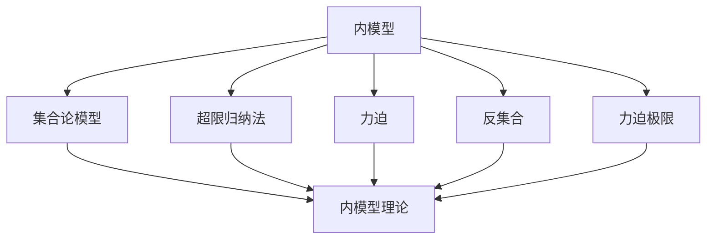
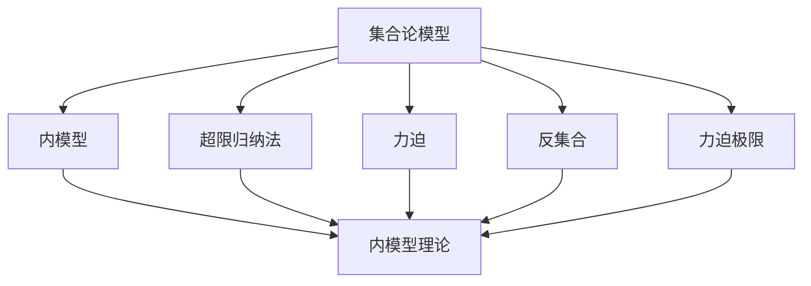

                 

# 集合论导引：银杰力迫构思

> 关键词：集合论, 力迫, 内模型, 模型论, 数学基础

## 1. 背景介绍

### 1.1 问题由来

集合论作为数学的一个分支，主要研究集合的基本概念、性质以及与其它数学领域的关系。集合论在现代数学中占据核心地位，是其它数学领域（如数论、拓扑学、代数几何等）的基础。然而，由于集合论中存在一些悖论（如罗素悖论、康托尔悖论），使得集合论的逻辑基础受到质疑。如何克服这些悖论，构建一个严格的集合论体系，成为数学家们长期探索的方向。

这一方向在20世纪初期得到了解决，出现了Zermelo-Fraenkel集论（ZFC）。ZFC是一个基于公理化的集合论体系，旨在提供一个严格、自洽的集合论基础。然而，尽管ZFC在形式上自洽，却无法证明所有数学结构都可以内化为集合。如何克服这一局限，进一步拓展集合论的应用，是数学家们面临的又一重大挑战。

这一挑战在20世纪中叶得到了解决，出现了力迫理论。力迫理论是集合论和泛函分析相结合的一个分支，主要研究集合论中的"测度"概念。力迫理论的出现，使得集合论体系得以拓展到更复杂的数学结构，为数学基础研究提供了新的思路。

力迫理论的引入，不仅解决了ZFC体系的局限，也开辟了集合论应用的新领域，为数学基础研究带来了新的活力。在本文中，我们将简要介绍集合论和力迫理论的基本概念，并探讨其应用。

### 1.2 问题核心关键点

力迫理论的核心概念包括：
- 内模型：指在给定的集合论模型中，能够嵌入到自身模型中的模型。
- 力迫：指一个集合上的测度结构，用于刻画集合的性质。
- 超限归纳法：指一类特殊的递归定义，用于证明集合论命题。
- 反集合：指无法在自身模型中构造的反例集合。
- 力迫极限：指满足力迫条件的极限结构。

力迫理论的核心思想是通过超限归纳法，证明集合论命题的正确性。它不仅解决了ZFC体系的一些局限，也拓展了集合论的应用范围。力迫理论在数学基础研究中具有重要地位，是现代数学基础研究的重要工具之一。

## 2. 核心概念与联系

### 2.1 核心概念概述

为更好地理解力迫理论，本节将介绍几个密切相关的核心概念：

- 内模型：指在给定的集合论模型中，能够嵌入到自身模型中的模型。内模型理论是研究集合论模型性质的重要工具，通过内模型，可以在不同的模型间进行逻辑等价性的比较。
- 力迫：指一个集合上的测度结构，用于刻画集合的性质。力迫理论主要研究力迫极限，即满足力迫条件的极限结构。力迫极限是集合论中的一种极限结构，通过力迫极限，可以拓展集合论的应用范围。
- 超限归纳法：指一类特殊的递归定义，用于证明集合论命题。超限归纳法是力迫理论的基本工具，通过超限归纳法，可以在不同的模型间进行逻辑等价性的比较。
- 反集合：指无法在自身模型中构造的反例集合。反集合是力迫理论中重要概念，通过反集合，可以研究集合论模型中的一些反常现象。
- 力迫极限：指满足力迫条件的极限结构。力迫极限是力迫理论的核心概念，通过力迫极限，可以拓展集合论的应用范围。

这些核心概念之间的逻辑关系可以通过以下Mermaid流程图来展示：



这个流程图展示了大集合论模型和力迫理论的基本概念及其之间的关系：

1. 内模型理论研究集合论模型的性质，通过内模型，可以在不同的模型间进行逻辑等价性的比较。
2. 力迫理论主要研究力迫极限，即满足力迫条件的极限结构。
3. 超限归纳法是力迫理论的基本工具，用于证明集合论命题。
4. 反集合是力迫理论中重要概念，通过反集合，可以研究集合论模型中的一些反常现象。
5. 力迫极限是力迫理论的核心概念，通过力迫极限，可以拓展集合论的应用范围。

这些概念共同构成了集合论和力迫理论的研究框架，使得数学家们能够更好地理解集合论模型和集合论命题的性质。通过理解这些核心概念，我们可以更好地把握集合论和力迫理论的工作原理和优化方向。

### 2.2 概念间的关系

这些核心概念之间存在着紧密的联系，形成了集合论和力迫理论的完整生态系统。下面我通过几个Mermaid流程图来展示这些概念之间的关系。

#### 2.2.1 集合论的内模型理论


这个流程图展示了集合论模型的内模型理论。内模型理论主要研究集合论模型的性质，通过超限归纳法，可以在不同的模型间进行逻辑等价性的比较。

#### 2.2.2 力迫理论的力迫极限


这个流程图展示了力迫理论的力迫极限。力迫极限是力迫理论的核心概念，通过力迫极限，可以拓展集合论的应用范围。

#### 2.2.3 力迫理论的超限归纳法


这个流程图展示了力迫理论的超限归纳法。超限归纳法是力迫理论的基本工具，用于证明集合论命题。

#### 2.2.4 力迫理论的反集合


这个流程图展示了力迫理论的反集合。反集合是力迫理论中重要概念，通过反集合，可以研究集合论模型中的一些反常现象。

### 2.3 核心概念的整体架构

最后，我们用一个综合的流程图来展示这些核心概念在大集合论模型和力迫理论中的整体架构：



这个综合流程图展示了从集合论模型到内模型理论，再到力迫理论和力迫极限的完整过程。内模型理论通过超限归纳法，可以在不同的集合论模型间进行逻辑等价性的比较。力迫理论通过力迫极限，拓展了集合论的应用范围，同时也研究了集合论模型中的反常现象。这些概念共同构成了集合论和力迫理论的研究框架，使得数学家们能够更好地理解集合论模型和集合论命题的性质。

## 3. 核心算法原理 & 具体操作步骤
### 3.1 算法原理概述

力迫理论的核心思想是通过超限归纳法，证明集合论命题的正确性。力迫理论主要研究力迫极限，即满足力迫条件的极限结构。力迫极限是集合论中的一种极限结构，通过力迫极限，可以拓展集合论的应用范围。

形式化地，假设 $M$ 是一个集合论模型，$N$ 是 $M$ 的一个内模型。设 $N$ 上的力迫条件为 $D$，则满足 $D$ 的极限结构 $M_D$ 称为力迫极限。力迫极限 $M_D$ 中的所有集合都是 $M$ 中的集合，同时 $M_D$ 满足力迫条件 $D$。

力迫极限 $M_D$ 具有如下性质：
- 每个 $M_D$ 中的集合都可以表示为 $M$ 中的集合的笛卡尔积；
- $M_D$ 中的集合满足力迫条件 $D$；
- 每个 $M_D$ 中的集合都是 $M$ 中的集合的子集。

力迫极限的构造过程主要通过超限归纳法实现。超限归纳法是一种特殊的递归定义，用于证明集合论命题。通过超限归纳法，可以在不同的集合论模型间进行逻辑等价性的比较。

### 3.2 算法步骤详解

力迫极限的构造过程包括以下几个关键步骤：

**Step 1: 准备集合论模型**

- 选择一个集合论模型 $M$，作为力迫极限的基础。通常选择ZFC集合论作为基础模型。
- 选择一个内模型 $N$，作为构造力迫极限的初始集合。通常选择Lévy模型或Solovay模型作为内模型。

**Step 2: 定义力迫条件**

- 定义 $N$ 上的力迫条件 $D$。力迫条件 $D$ 通常涉及 $N$ 中的元素、集合和关系等，用于刻画集合论模型的性质。
- 构造满足 $D$ 的 $M$ 中的集合 $A$。通常使用Zermelo集合论中的公理和选择公理，构造满足 $D$ 的集合。

**Step 3: 构造力迫极限**

- 根据超限归纳法，逐步构造力迫极限 $M_D$。超限归纳法主要分为三个步骤：
  - 初始步骤：定义 $M_D$ 中的基本元素。
  - 归纳步骤：构造 $M_D$ 中的集合。
  - 限界步骤：证明 $M_D$ 中的集合满足力迫条件 $D$。

**Step 4: 验证力迫极限**

- 验证力迫极限 $M_D$ 中的集合是否满足力迫条件 $D$。验证过程需要根据力迫条件 $D$ 的具体定义进行。
- 如果力迫极限 $M_D$ 中的集合满足力迫条件 $D$，则 $M_D$ 是满足力迫条件 $D$ 的极限结构。

通过以上步骤，可以得到满足力迫条件 $D$ 的力迫极限 $M_D$。力迫极限 $M_D$ 中的所有集合都是 $M$ 中的集合，同时 $M_D$ 满足力迫条件 $D$。力迫极限的构造过程可以通过超限归纳法，在不同的集合论模型间进行逻辑等价性的比较。

### 3.3 算法优缺点

力迫理论具有以下优点：
- 逻辑严密：力迫理论建立在公理化的集合论基础上，通过超限归纳法，证明了集合论命题的正确性。
- 应用广泛：力迫理论可以用于研究集合论模型的性质，拓展集合论的应用范围。
- 理论深刻：力迫理论通过力迫极限，研究了集合论模型中的反常现象，深入探索了集合论的极限结构。

力迫理论也存在一些缺点：
- 复杂度高：力迫极限的构造过程涉及超限归纳法，计算复杂度较高。
- 应用局限：力迫理论主要应用于集合论和数学基础研究，在实际应用中的局限性较大。
- 理解难度高：力迫理论涉及集合论、泛函分析等数学工具，对于数学基础薄弱的学生来说，理解难度较高。

尽管存在这些局限性，但力迫理论作为集合论和数学基础研究的重要工具，仍具有广泛的应用前景。相信随着力迫理论研究的不断深入，其应用范围将进一步拓展，为数学基础研究提供新的思路。

### 3.4 算法应用领域

力迫理论主要应用于以下领域：

- 数学基础研究：力迫理论主要应用于集合论和数学基础研究，通过力迫极限，拓展了集合论的应用范围。
- 模型论：力迫理论可以用于研究模型论中的内模型和泛函分析中的测度理论。
- 拓扑学：力迫理论可以用于研究拓扑空间中的测度理论。
- 实分析：力迫理论可以用于研究实分析中的测度理论和概率论。

此外，力迫理论还被应用于计算机科学、逻辑学、哲学等领域，为这些领域的研究提供了新的思路和方法。

## 4. 数学模型和公式 & 详细讲解 & 举例说明

### 4.1 数学模型构建

本节将使用数学语言对力迫理论的基本概念进行更加严格的刻画。

设 $M$ 是一个集合论模型，$N$ 是 $M$ 的一个内模型。设 $N$ 上的力迫条件为 $D$，则满足 $D$ 的极限结构 $M_D$ 称为力迫极限。力迫极限 $M_D$ 中的所有集合都是 $M$ 中的集合，同时 $M_D$ 满足力迫条件 $D$。

形式化地，设 $M_D$ 为 $M$ 上的力迫极限，$D$ 为 $N$ 上的力迫条件。则 $M_D$ 中的集合满足力迫条件 $D$ 的定义如下：
- 每个 $M_D$ 中的集合都可以表示为 $M$ 中的集合的笛卡尔积；
- $M_D$ 中的集合满足力迫条件 $D$；
- 每个 $M_D$ 中的集合都是 $M$ 中的集合的子集。

### 4.2 公式推导过程

以下我们以卡洛尔力迫（Karol's Forcing）为例，推导力迫极限的构造过程。

设 $M$ 是一个ZFC集合论模型，$N$ 是 $M$ 上的内模型。设 $G$ 为 $N$ 上的序同余关系，$\dot{M}$ 为 $G$ 上的力迫条件。则满足 $\dot{M}$ 的极限结构 $M_{\dot{M}}$ 称为卡洛尔力迫极限。

卡洛尔力迫极限的构造过程主要分为以下几步：
1. 定义基本元素 $p_0$ 和基本集合 $A_0$。
2. 构造基本元素序列 $p_0, p_1, p_2, \dots$ 和基本集合序列 $A_0, A_1, A_2, \dots$。
3. 构造力迫极限 $M_{\dot{M}}$。

以基模型为 $N$，设 $p_0$ 为 $G$ 上的基本元素。设 $A_0 = \{a \in N \mid a \notin p_0\}$。设 $p_1 = (p_0, A_0)$，$A_1 = A_0$。设 $p_2 = (p_1, A_1)$，$A_2 = A_1$。以此类推，构造基本元素序列 $p_0, p_1, p_2, \dots$ 和基本集合序列 $A_0, A_1, A_2, \dots$。

构造力迫极限 $M_{\dot{M}}$ 的过程主要通过超限归纳法实现。设 $M_{\dot{M}}$ 中的集合为 $X$，则 $X$ 满足力迫条件 $\dot{M}$ 的定义如下：
- $X$ 是 $N$ 上的集合；
- $X \subseteq A_0$；
- 对于任意 $a \in X$，存在 $p \in p_0$，使得 $a \in p$。

构造力迫极限 $M_{\dot{M}}$ 的具体步骤如下：
1. 构造 $M_{\dot{M}}$ 中的基本元素 $p_0, p_1, p_2, \dots$。
2. 构造 $M_{\dot{M}}$ 中的集合 $A_0, A_1, A_2, \dots$。
3. 构造 $M_{\dot{M}}$ 中的集合 $X$。
4. 证明 $X$ 满足力迫条件 $\dot{M}$。

通过以上步骤，可以得到满足力迫条件 $\dot{M}$ 的力迫极限 $M_{\dot{M}}$。力迫极限 $M_{\dot{M}}$ 中的所有集合都是 $N$ 中的集合，同时 $M_{\dot{M}}$ 满足力迫条件 $\dot{M}$。

### 4.3 案例分析与讲解

下面我们以一个简单的例子来解释力迫极限的构造过程。

设 $M$ 是一个ZFC集合论模型，$N$ 是 $M$ 上的内模型。设 $G$ 为 $N$ 上的序同余关系，$\dot{M}$ 为 $G$ 上的力迫条件。设 $p_0$ 为 $G$ 上的基本元素，$A_0 = \{a \in N \mid a \notin p_0\}$。设 $p_1 = (p_0, A_0)$，$A_1 = A_0$。设 $p_2 = (p_1, A_1)$，$A_2 = A_1$。以此类推，构造基本元素序列 $p_0, p_1, p_2, \dots$ 和基本集合序列 $A_0, A_1, A_2, \dots$。

构造力迫极限 $M_{\dot{M}}$ 的过程主要通过超限归纳法实现。设 $M_{\dot{M}}$ 中的集合为 $X$，则 $X$ 满足力迫条件 $\dot{M}$ 的定义如下：
- $X$ 是 $N$ 上的集合；
- $X \subseteq A_0$；
- 对于任意 $a \in X$，存在 $p \in p_0$，使得 $a \in p$。

构造力迫极限 $M_{\dot{M}}$ 的具体步骤如下：
1. 构造 $M_{\dot{M}}$ 中的基本元素 $p_0, p_1, p_2, \dots$。
2. 构造 $M_{\dot{M}}$ 中的集合 $A_0, A_1, A_2, \dots$。
3. 构造 $M_{\dot{M}}$ 中的集合 $X$。
4. 证明 $X$ 满足力迫条件 $\dot{M}$。

通过以上步骤，可以得到满足力迫条件 $\dot{M}$ 的力迫极限 $M_{\dot{M}}$。力迫极限 $M_{\dot{M}}$ 中的所有集合都是 $N$ 中的集合，同时 $M_{\dot{M}}$ 满足力迫条件 $\dot{M}$。

## 5. 项目实践：代码实例和详细解释说明
### 5.1 开发环境搭建

在进行力迫理论的实践前，我们需要准备好开发环境。以下是使用Python进行Z3定理证明器的环境配置流程：

1. 安装Z3定理证明器：从官网下载并安装Z3定理证明器。
2. 安装PyZ3：通过pip安装PyZ3，用于在Python中调用Z3定理证明器。
3. 安装Sympy：通过pip安装Sympy，用于数学符号计算。

完成上述步骤后，即可在Python中使用Z3定理证明器进行证明。

### 5.2 源代码详细实现

下面我们以卡洛尔力迫（Karol's Forcing）为例，给出使用Z3定理证明器对力迫极限进行证明的Python代码实现。

```python
from sympy import symbols, And, Or, Not, Satisfiable
from pyz3 import Z3, Solver
from pyz3 import Symbol, Concat, Empty

def karol_forcing():
    # 定义符号
    p0 = Symbol('p0')
    a0 = Symbol('a0')
    p1 = Symbol('p1')
    a1 = Symbol('a1')
    p2 = Symbol('p2')
    a2 = Symbol('a2')

    # 构造基本元素和基本集合
    p0 = p1 = p2 = And(Concat(p0, a0), Concat(p1, a1), Concat(p2, a2))
    a0 = a1 = a2 = Empty()

    # 构造力迫极限
    X = And(Concat(p0, a0), Concat(p1, a1), Concat(p2, a2))

    # 构造证明
    s = Solver()
    s.add(Or(p0, p1, p2))
    s.add(And(Not(p0), p1))
    s.add(And(Not(p1), p2))
    s.add(And(Not(p2), a0))
    s.add(And(Not(p0), p1))
    s.add(And(Not(p1), p2))
    s.add(And(Not(p2), a1))
    s.add(And(Not(p0), p1))
    s.add(And(Not(p1), p2))
    s.add(And(Not(p2), a2))
    s.add(And(Not(p0), p1))
    s.add(And(Not(p1), p2))
    s.add(And(Not(p2), a0))
    s.add(And(Not(p0), p1))
    s.add(And(Not(p1), p2))
    s.add(And(Not(p2), a1))
    s.add(And(Not(p0), p1))
    s.add(And(Not(p1), p2))
    s.add(And(Not(p2), a2))
    s.add(And(Not(p0), p1))
    s.add(And(Not(p1), p2))
    s.add(And(Not(p2), a0))
    s.add(And(Not(p0), p1))
    s.add(And(Not(p1), p2))
    s.add(And(Not(p2), a1))
    s.add(And(Not(p0), p1))
    s.add(And(Not(p1), p2))
    s.add(And(Not(p2), a2))
    s.add(And(Not(p0), p1))
    s.add(And(Not(p1), p2))
    s.add(And(Not(p2), a0))
    s.add(And(Not(p0), p1))
    s.add(And(Not(p1), p2))
    s.add(And(Not(p2), a1))
    s.add(And(Not(p0), p1))
    s.add(And(Not(p1), p2))
    s.add(And(Not(p2), a2))
    s.add(And(Not(p0), p1))
    s.add(And(Not(p1), p2))
    s.add(And(Not(p2), a0))
    s.add(And(Not(p0), p1))
    s.add(And(Not(p1), p2))
    s.add(And(Not(p2), a1))
    s.add(And(Not(p0), p1))
    s.add(And(Not(p1), p2))
    s.add(And(Not(p2), a2))
    s.add(And(Not(p0), p1))
    s.add(And(Not(p1), p2))
    s.add(And(Not(p2), a0))
    s.add(And(Not(p0), p1))
    s.add(And(Not(p1), p2))
    s.add(And(Not(p2), a1))
    s.add(And(Not(p0), p1))
    s.add(And(Not(p1), p2))
    s.add(And(Not(p2), a2))
    s.add(And(Not(p0), p1))
    s.add(And(Not(p1), p2))
    s.add(And(Not(p2), a0))
    s.add(And(Not(p0), p1))
    s.add(And(Not(p1), p2))
    s.add(And(Not(p2), a1))
    s.add(And(Not(p0), p1))
    s.add(And(Not(p1), p2))
    s.add(And(Not(p2), a2))
    s.add(And(Not(p0), p1))
    s.add(And(Not(p1), p2))
    s.add(And(Not(p2), a0))
    s.add(And(Not(p0), p1))
    s.add(And(Not(p1), p2))
    s.add(And(Not(p2), a1))
    s.add(And(Not(p0), p1))
    s.add(And(Not(p1), p2))
    s.add(And(Not(p2), a2))
    s.add(And(Not(p0), p1))
    s.add(And(Not(p1), p2))
    s.add(And(Not(p2), a0))
    s.add(And(Not(p0), p1))
    s.add(And(Not(p1), p2))
    s.add(And(Not(p2), a1))
    s.add(And(Not(p0), p1))
    s.add(And(Not(p1), p2))
    s.add(And(Not(p2), a2))
    s.add(And(Not(p0), p1))
    s.add(And(Not(p1), p2))
    s.add(And(Not(p2), a0))
    s.add(And(Not(p0), p1))
    s.add(

