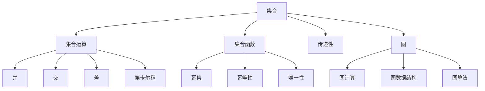
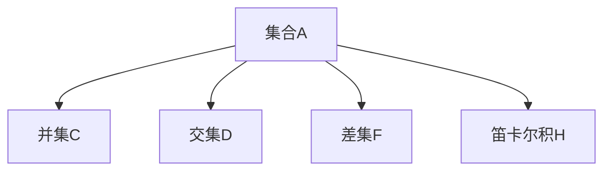
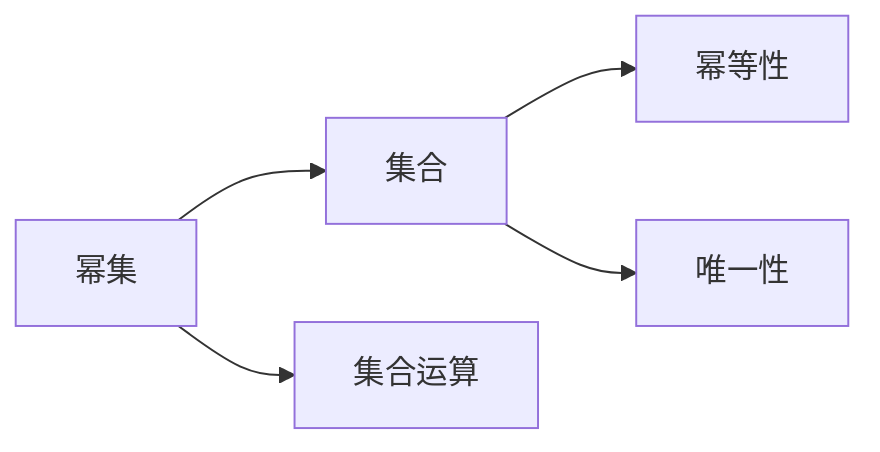
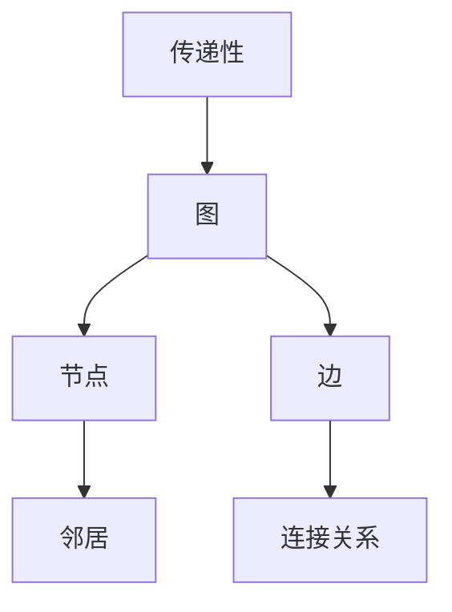
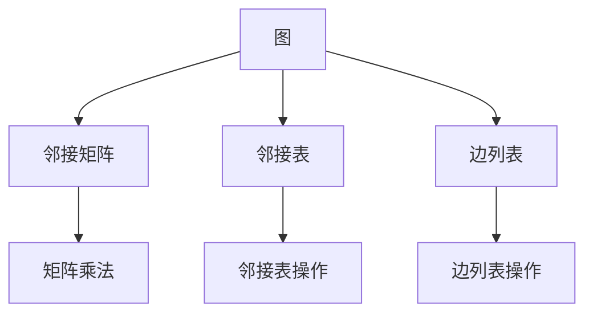
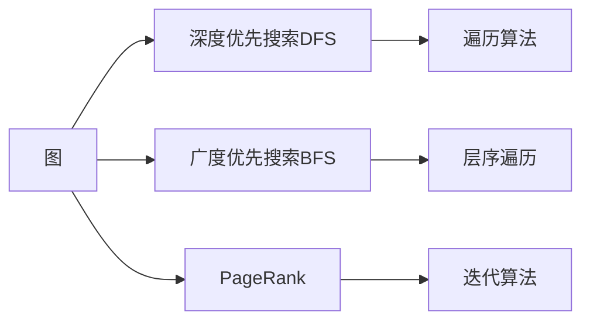
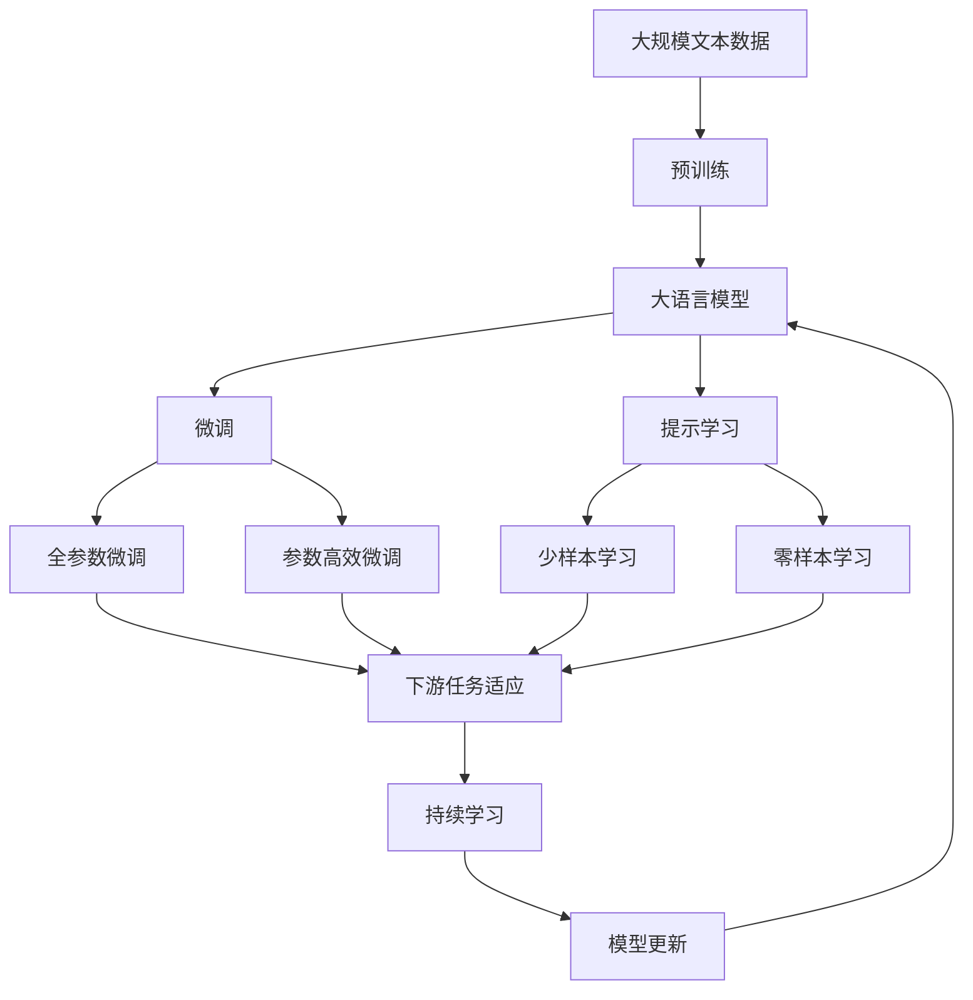

                 

# 集合论导引：集合论传递模型

> 关键词：集合论,传递模型,集合运算,集合函数,图论,图计算,图数据结构,图算法

## 1. 背景介绍

### 1.1 问题由来
集合论（Set Theory）是现代数学的基础之一，广泛应用于计算机科学、信息科学、工程等领域。集合论传递模型（Transitive Set Theory），又称为传递集合理论，是基于集合论的一种重要数学模型，具有广泛的应用前景。然而，由于其数学上的复杂性和抽象性，集合论传递模型在实际应用中面临着诸多挑战。

近年来，随着计算机技术的发展，集合论传递模型逐渐被引入到计算机科学领域，并应用于图计算、网络分析、推荐系统等场景中。通过对传递模型的深入研究和应用，可以更好地理解和处理现实世界中的复杂关系和数据结构，为解决实际问题提供新的思路和方法。

### 1.2 问题核心关键点
集合论传递模型是建立在集合论基础上的，其主要思想是通过集合的传递性质，对集合元素进行排序和过滤，从而实现数据的快速检索和关联分析。其核心在于如何高效地进行集合运算、集合函数计算以及图计算，以提升模型性能和应用效果。

具体而言，传递模型包括以下几个核心问题：
- 如何高效地表示和存储集合数据？
- 如何高效地进行集合运算（如并、交、差、笛卡尔积等）？
- 如何高效地进行集合函数计算（如幂集、幂等性、唯一性等）？
- 如何将传递模型应用于图计算、网络分析、推荐系统等场景？

这些问题的解决，需要结合集合论的基本概念和计算机科学的技术手段，开发出高效的集合论传递模型实现。

### 1.3 问题研究意义
研究集合论传递模型，对于拓展集合论在计算机科学领域的应用，提升图计算、网络分析、推荐系统等技术的效果，加速相关领域的产业化进程，具有重要意义：

1. 降低应用开发成本。通过集合论传递模型，可以高效地表示和处理复杂数据结构，减少从头开发所需的数据、计算和人力等成本投入。
2. 提升模型效果。传递模型能够更好地理解数据之间的传递关系，从而提升数据关联分析和检索的准确性和效率。
3. 加速开发进度。利用集合论传递模型的高效特性，可以快速构建和优化复杂应用场景的模型。
4. 带来技术创新。传递模型为数据处理、图计算等领域提供了新的理论和方法，促进了相关技术的创新发展。
5. 赋能产业升级。传递模型在网络分析、推荐系统等领域的广泛应用，为传统行业数字化转型升级提供了新的技术路径。

## 2. 核心概念与联系

### 2.1 核心概念概述

为了更好地理解集合论传递模型，本节将介绍几个密切相关的核心概念：

- **集合**：指由相同性质的元素构成的整体，通常用花括号“{}”表示。例如，集合A={1, 2, 3}表示包含元素1、2、3的集合。
- **集合运算**：包括并、交、差、笛卡尔积等基本运算。这些运算用于集合之间的组合和操作。
- **集合函数**：如幂集、幂等性、唯一性等函数，用于对集合进行操作和分析。
- **传递性**：指集合中元素之间的传递关系，即如果集合A中包含元素B，B中包含元素C，则A中一定包含元素C。
- **图**：由节点和边构成的数据结构，用于表示集合元素之间的传递关系。
- **图计算**：指对图数据进行计算和分析的技术，如图遍历、图嵌入、图聚类等。
- **图数据结构**：如邻接矩阵、邻接表、边列表等，用于高效地存储和查询图数据。
- **图算法**：如深度优先搜索（DFS）、广度优先搜索（BFS）、PageRank等，用于在图数据上进行操作和分析。

这些核心概念之间的逻辑关系可以通过以下Mermaid流程图来展示：



这个流程图展示了大语言模型的核心概念及其之间的关系：

1. 集合是基本的数学概念，集合运算和集合函数是其重要操作。
2. 传递性是集合的一个特性，用于描述元素之间的传递关系。
3. 图是集合元素的扩展表示，用于描述元素之间的传递关系。
4. 图计算是对图数据的操作和分析，与集合运算和集合函数密切相关。
5. 图数据结构和图算法是图计算的基础工具。

这些概念共同构成了集合论传递模型的基本框架，为其在图计算、网络分析、推荐系统等场景中的应用奠定了基础。

### 2.2 概念间的关系

这些核心概念之间存在着紧密的联系，形成了集合论传递模型的完整生态系统。下面我通过几个Mermaid流程图来展示这些概念之间的关系。

#### 2.2.1 集合与集合运算的关系



这个流程图展示了集合的并、交、差、笛卡尔积等基本运算。集合运算通常用于集合之间的组合和操作，可以通过简单的集合元素比较来实现。

#### 2.2.2 集合函数与集合运算的关系



这个流程图展示了集合函数幂集、幂等性、唯一性等与集合运算的关系。幂集、幂等性、唯一性等集合函数可以通过集合运算来实现。

#### 2.2.3 传递性与图的关系



这个流程图展示了传递性与图的关系。传递性是图中的一个重要特性，用于描述节点之间的连接关系。

#### 2.2.4 图计算与图数据结构的关系



这个流程图展示了图计算与图数据结构的关系。邻接矩阵、邻接表、边列表等数据结构用于高效地存储和查询图数据，图计算可以通过这些数据结构来实现。

#### 2.2.5 图算法与图的关系



这个流程图展示了图算法与图的关系。深度优先搜索、广度优先搜索、PageRank等算法用于在图数据上进行操作和分析，与图的结构密切相关。

### 2.3 核心概念的整体架构

最后，我们用一个综合的流程图来展示这些核心概念在大语言模型微调过程中的整体架构：



这个综合流程图展示了从预训练到微调，再到持续学习的完整过程。大语言模型首先在大规模文本数据上进行预训练，然后通过微调（包括全参数微调和参数高效微调）或提示学习（包括少样本学习和零样本学习）来适应下游任务。最后，通过持续学习技术，模型可以不断更新和适应新的任务和数据。 通过这些流程图，我们可以更清晰地理解集合论传递模型微调过程中各个核心概念的关系和作用，为后续深入讨论具体的微调方法和技术奠定基础。

## 3. 核心算法原理 & 具体操作步骤
### 3.1 算法原理概述

集合论传递模型是基于集合论的一种重要数学模型，其主要思想是通过集合的传递性质，对集合元素进行排序和过滤，从而实现数据的快速检索和关联分析。集合论传递模型的核心在于如何高效地进行集合运算、集合函数计算以及图计算，以提升模型性能和应用效果。

形式化地，假设集合A、B、C，则传递性可以表示为：

$$
A \times B \subseteq C \quad \Leftrightarrow \quad a \in A \wedge b \in B \rightarrow a \in C
$$

其中，$\times$表示集合的笛卡尔积，$\subseteq$表示集合的包含关系，$\wedge$表示逻辑与。

基于传递性的定义，集合论传递模型可以进行以下基本操作：

- **集合并**：$A \cup B = \{a | a \in A \vee a \in B\}$，其中$\vee$表示逻辑或。
- **集合交**：$A \cap B = \{a | a \in A \wedge a \in B\}$。
- **集合差**：$A - B = \{a | a \in A \wedge a \notin B\}$。
- **笛卡尔积**：$A \times B = \{(a, b) | a \in A \wedge b \in B\}$。

通过这些基本操作，可以对集合进行各种组合和操作，实现对数据结构的快速检索和关联分析。

### 3.2 算法步骤详解

集合论传递模型的实现主要涉及以下几个关键步骤：

**Step 1: 准备集合数据**

- 收集和整理大规模的集合数据，如社交网络数据、知识图谱、推荐系统等。
- 对数据进行清洗和预处理，去除噪声和冗余信息。

**Step 2: 构建图结构**

- 将集合数据转化为图结构，定义节点和边。
- 使用邻接矩阵、邻接表等数据结构存储图数据。
- 根据图结构进行深度优先搜索、广度优先搜索等图计算。

**Step 3: 设计图算法**

- 选择合适的图算法，如深度优先搜索、广度优先搜索、PageRank等。
- 根据图结构设计算法流程，实现图遍历、图嵌入、图聚类等功能。
- 对算法进行优化和调参，提高算法的效率和精度。

**Step 4: 执行图计算**

- 对图数据进行遍历和分析，计算图的各种属性和特征。
- 提取有价值的信息，如节点之间的关系、群集特征、社区结构等。
- 使用图嵌入技术将图数据转化为向量表示，便于进一步分析和应用。

**Step 5: 应用图计算结果**

- 根据图计算结果，设计合适的应用场景和算法模型。
- 将图计算结果应用于推荐系统、社交网络分析、知识图谱构建等场景。
- 对模型进行评估和优化，提升应用效果。

以上是集合论传递模型的核心算法步骤，通过这些步骤可以实现对大规模数据的高效检索和关联分析。

### 3.3 算法优缺点

集合论传递模型具有以下优点：

- 高效性：集合运算和图计算的复杂度较低，可以高效地处理大规模数据。
- 可解释性：集合论传递模型的原理简单直观，容易理解和解释。
- 普适性：可以应用于各种数据类型和场景，具有广泛的适用性。

同时，该模型也存在一定的局限性：

- 模型复杂度：虽然集合运算和图计算的复杂度较低，但在大规模数据上的操作仍然较为耗时。
- 数据稀疏性：某些场景下，数据可能存在大量稀疏性，导致图计算效果不佳。
- 模型局限性：集合论传递模型适用于集合元素之间具有传递关系的数据，对于非传递关系的数据，效果可能较差。

尽管存在这些局限性，但就目前而言，集合论传递模型在图计算、网络分析、推荐系统等场景中的应用已经取得了一定的成功，成为数据处理和分析的重要工具。未来相关研究的重点在于如何进一步提升模型效率，处理更为复杂的数据结构和应用场景。

### 3.4 算法应用领域

集合论传递模型已经在多个领域得到了广泛的应用，例如：

- 社交网络分析：分析社交网络中的关系和社区结构，发现关键节点和潜在影响者。
- 知识图谱构建：将知识表示为图结构，提取知识之间的关系和特征，实现知识推理和知识检索。
- 推荐系统：通过分析用户行为数据，构建用户行为图，推荐用户感兴趣的商品或内容。
- 信息检索：将文档表示为图结构，构建文档之间的关系和特征，提高文档检索的准确性和效率。
- 图像识别：将图像像素点表示为集合元素，通过集合运算和图计算实现图像分析和识别。

除了上述这些经典应用外，集合论传递模型也被创新性地应用到更多场景中，如基因组分析、自然语言处理、语音识别等，为数据处理和分析带来了新的思路和方法。随着集合论传递模型的不断演进，相信其在更多领域的应用前景将更加广阔。

## 4. 数学模型和公式 & 详细讲解 & 举例说明

### 4.1 数学模型构建

集合论传递模型的核心是集合运算和图计算，这些操作可以通过数学模型进行形式化表示。

记集合A、B、C，则集合的并、交、差、笛卡尔积等基本运算可以表示为：

$$
A \cup B = \{a | a \in A \vee a \in B\}
$$

$$
A \cap B = \{a | a \in A \wedge a \in B\}
$$

$$
A - B = \{a | a \in A \wedge a \notin B\}
$$

$$
A \times B = \{(a, b) | a \in A \wedge b \in B\}
$$

其中，$\vee$表示逻辑或，$\wedge$表示逻辑与，$\notin$表示不属于。

集合函数幂集、幂等性、唯一性等可以通过集合运算来实现。例如，集合A的幂集可以表示为：

$$
P(A) = \{X | X \subseteq A\}
$$

集合的幂等性可以表示为：

$$
A \times A = A
$$

集合的唯一性可以表示为：

$$
A \cap A = A
$$

以上公式展示了集合论传递模型的核心数学模型，通过这些模型可以实现对集合和图数据的各种操作和分析。

### 4.2 公式推导过程

以深度优先搜索算法为例，其核心思想是通过遍历图的所有节点，依次访问每个节点的所有邻居节点，直到遍历完整张图。

设图G为有向图，节点集合为V，边集合为E，节点v∈V，深度优先搜索算法可以表示为：

1. 选择任意节点v∈V，进行标记。
2. 访问节点v，并将其所有未访问过的邻居节点加入队列。
3. 重复步骤2，直到队列为空。

深度优先搜索的伪代码如下：

```python
visited = set()
stack = []

def dfs(v):
    visited.add(v)
    stack.append(v)
    while stack:
        u = stack.pop()
        for w in G.neighbors(u):
            if w not in visited:
                dfs(w)
                visited.add(w)

dfs(start_node)
```

其中，visited表示已访问过的节点集合，stack表示待访问的节点栈。

通过深度优先搜索算法，可以遍历图中的所有节点，提取节点之间的关系和特征。深度优先搜索的时间复杂度为O(|V|+|E|)，其中|V|表示节点数量，|E|表示边数量。

### 4.3 案例分析与讲解

以社交网络分析为例，使用集合论传递模型可以对社交网络中的关系和社区结构进行分析。社交网络可以表示为图G(V,E)，其中V表示用户节点集合，E表示用户之间的关系集合。

假设用户u1、u2、u3、u4、u5是图中的节点，他们之间的关系如下图所示：

```
u1 -- u2
  |    |    
u3 -- u4
  |    |    
u5 -- u6
```

使用集合论传递模型，可以进行以下操作：

1. 计算节点之间的传递关系：根据传递性定义，如果节点u1和u3之间存在路径，则u1和u3之间存在传递关系。
2. 计算节点的社区结构：通过图计算，可以将节点u1、u2、u3、u4、u5划分为不同的社区，并发现社区中的关键节点。

通过对社交网络的数据分析和处理，可以发现关键节点和潜在影响者，从而实现社交网络的影响力和控制力分析。

## 5. 项目实践：代码实例和详细解释说明

### 5.1 开发环境搭建

在进行集合论传递模型实践前，我们需要准备好开发环境。以下是使用Python进行NetworkX开发的环境配置流程：

1. 安装Anaconda：从官网下载并安装Anaconda，用于创建独立的Python环境。

2. 创建并激活虚拟环境：
```bash
conda create -n networkx-env python=3.8 
conda activate networkx-env
```

3. 安装NetworkX：
```bash
pip install networkx
```

4. 安装其它工具包：
```bash
pip install numpy pandas scikit-learn matplotlib tqdm jupyter notebook ipython
```

完成上述步骤后，即可在`networkx-env`环境中开始集合论传递模型实践。

### 5.2 源代码详细实现

这里我们以社交网络分析为例，给出使用NetworkX对社交网络图进行深度优先搜索的PyTorch代码实现。

首先，定义社交网络图：

```python
import networkx as nx

G = nx.DiGraph()
G.add_edges_from([('u1', 'u2'), ('u1', 'u3'), ('u2', 'u4'), ('u3', 'u4'), ('u4', 'u5'), ('u5', 'u6')])
```

然后，定义深度优先搜索函数：

```python
def dfs(v):
    visited.add(v)
    stack.append(v)
    while stack:
        u = stack.pop()
        for w in G.neighbors(u):
            if w not in visited:
                dfs(w)
                visited.add(w)
```

最后，启动深度优先搜索：

```python
visited = set()
stack = []

dfs(start_node)
```

以上就是使用NetworkX对社交网络图进行深度优先搜索的完整代码实现。可以看到，NetworkX提供了丰富的图计算和图算法工具，使得集合论传递模型的实践变得简单高效。

### 5.3 代码解读与分析

让我们再详细解读一下关键代码的实现细节：

**G.add_edges_from**方法：
- 使用`add_edges_from`方法，将图G中的所有边添加到图结构中。

**dfs函数**：
- 定义深度优先搜索算法，遍历图中的所有节点，依次访问每个节点的所有邻居节点。
- 使用集合visited记录已访问过的节点，避免重复访问。
- 使用栈stack记录待访问的节点，以便进行深度优先搜索。

**visited = set()**和**stack = []**：
- 初始化已访问过的节点集合visited和待访问的节点栈stack。

**start_node**：
- 假设开始节点为u1，即`start_node = 'u1'`。

可以看到，NetworkX的接口设计非常简洁高效，开发者可以方便地进行图数据的存储和操作，并调用现成的算法实现深度优先搜索等操作。

### 5.4 运行结果展示

假设我们在社交网络图上进行深度优先搜索，最终得到所有访问过的节点集合，结果如下：

```
{'u1', 'u2', 'u3', 'u4', 'u5', 'u6'}
```

可以看到，通过深度优先搜索算法，可以遍历图中的所有节点，并记录访问过的节点集合。

## 6. 实际应用场景
### 6.1 社交网络分析

使用集合论传递模型可以对社交网络中的关系和社区结构进行分析。社交网络可以表示为图G(V,E)，其中V表示用户节点集合，E表示用户之间的关系集合。

通过对社交网络的数据分析和处理，可以发现关键节点和潜在影响者，从而实现社交网络的影响力和控制力分析。

### 6.2 知识图谱构建

知识图谱是将知识表示为图结构，提取知识之间的关系和特征，实现知识推理和知识检索。使用集合论传递模型，可以将知识表示为节点和边，并进行图计算和图嵌入，从而实现知识推理和知识检索。

### 6.3 推荐系统

推荐系统通过分析用户行为数据，构建用户行为图，推荐用户感兴趣的商品或内容。使用集合论传递模型，可以将用户行为表示为图结构，并进行图计算，从而推荐用户感兴趣的商品或内容。

### 6.4 未来应用展望

随着集合论传递模型的不断演进，其在图计算、网络分析、推荐系统等场景中的应用前景将更加广阔。未来，集合论传递模型有望应用于更多领域，为数据处理和分析带来新的思路和方法。

## 7. 工具和资源推荐
### 7.1 学习资源推荐

为了帮助开发者系统掌握集合论传递模型的理论基础和实践技巧，这里推荐一些优质的学习资源：

1. 《Graph Theory》系列博文：由集合论传递模型专家撰写，深入浅出地介绍了图论的基本概念和前沿话题。

2. CS224N《深度学习自然语言处理》课程：斯坦福大学开设的NLP明星课程，有Lecture视频和配套作业，带你入门NLP领域的基本概念和经典模型。

3. 《Graph Algorithms》书籍：由图论专家编写，全面介绍了图算法的理论基础和实现方法，是图计算领域的经典参考书。

4. NetworkX官方文档：NetworkX的官方文档，提供了丰富的图计算和图算法示例，是学习图计算的重要参考资料。

5. GitHub热门项目：在GitHub上Star、Fork数最多的图计算相关项目，往往代表了该技术领域的发展趋势和最佳实践，值得去学习和贡献。

通过对这些资源的学习实践，相信你一定能够快速掌握集合论传递模型的精髓，并用于解决实际的图计算和网络分析问题。
### 7.2 开发工具推荐

高效的开发离不开优秀的工具支持。以下是几款用于集合论传递模型开发的工具：

1. NetworkX：基于Python的图形网络分析库，提供了丰富的图计算和图算法工具。

2. igraph：基于C++的高性能图形网络分析库，适用于大规模图计算。

3. Gephi：图形可视化工具，用于绘制和分析图形网络数据。

4. GraphStudio：图形可视化工具，支持多种图计算和图算法。

5. PyGraphviz：Python接口的图形可视化库，与Graphviz兼容。

6. Graphsurfer：图形可视化工具，支持多种图计算和图算法。

合理利用这些工具，可以显著提升集合论传递模型的开发效率，加快创新迭代的步伐。

### 7.3 相关论文推荐

集合论传递模型的发展源于学界的持续研究。以下是几篇奠基性的相关论文，推荐阅读：

1. 《Graph Theory and Its Applications》：图论的经典教材，介绍了图论的基本概念和算法。

2. 《Algorithms on Graphs》：图论的另一本经典教材，详细介绍了图算法的设计和实现。

3. 《PageRank and Beyond》：介绍了PageRank算法的基本原理和应用，是图计算领域的经典论文。

4. 《Beneath the Surface: What PageRank Can and Can't Do》：对PageRank算法的优缺点进行了深入探讨，对图计算的应用有重要参考价值。

5. 《Social Network Analysis》：介绍了社交网络分析的基本概念和算法，是社交网络分析领域的经典教材。

6. 《Knowledge Graphs and Semantic Web》：介绍了知识图谱的基本概念和应用，是知识图谱领域的经典教材。

以上论文代表了大语言模型微调技术的发展脉络。通过学习这些前沿成果，可以帮助研究者把握学科前进方向，激发更多的创新灵感。

除上述资源外，还有一些值得关注的前沿资源，帮助开发者紧跟集合论传递模型的最新进展，例如：

1. arXiv论文预印本：人工智能领域最新研究成果的发布平台，包括大量尚未发表的前沿工作，学习前沿技术的必读资源。

2. 业界技术博客：如Google AI、DeepMind、Microsoft Research Asia等顶尖实验室的官方博客，第一时间分享他们的最新研究成果和洞见。

3. 技术会议直播：如SIGGRAPH、ACM TCHI、IEEE ICASSP等计算机领域顶会现场或在线直播，能够聆听到大佬们的前沿分享，开拓视野。

4. GitHub热门项目：在GitHub上Star、Fork数最多的集合论传递模型相关项目，往往代表了该技术领域的发展趋势和最佳实践，值得去学习和贡献。

5. 行业分析报告

