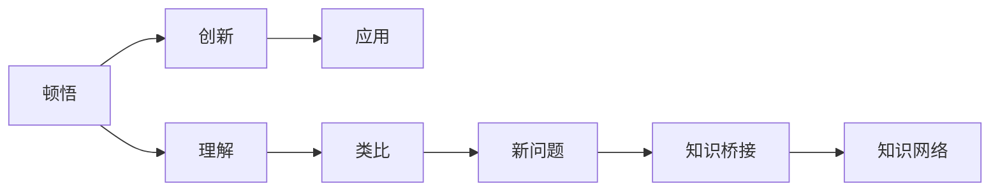

                 

# 顿悟与类比：知识的桥梁

> 关键词：顿悟,类比,知识桥梁,认知心理学,认知神经科学,人工智能

## 1. 背景介绍

### 1.1 问题由来

在日常学习和工作中，我们时常会感受到知识的不可预测性和复杂性。如何从复杂的信息中找到有价值的部分，并理解其背后的逻辑和意义？顿悟与类比，这两种思维方式，可以帮我们更好地掌握知识和进行创新。

### 1.2 问题核心关键点

顿悟与类比是人类认知中最重要的两种思维模式。顿悟是指瞬间理解，而类比是通过已有的知识和经验，去理解新知识的推理过程。两者相辅相成，帮助我们在信息的海量海洋中找到知识之间的内在联系，实现创新和突破。

### 1.3 问题研究意义

研究和掌握顿悟与类比，对于提高人类的认知能力、提升创新能力、促进知识的学习和应用，具有重要的理论和实践意义。在人工智能领域，顿悟与类比能够帮助机器更好地理解和应用知识，加速人工智能技术的发展。

## 2. 核心概念与联系

### 2.1 核心概念概述

- 顿悟（Insight）：是指在解决复杂问题时，突然间获得突破，理解问题的本质和解决方法。顿悟通常伴随着“灵光一现”的体验。
- 类比（Analogy）：是指将一个领域中的知识和经验，应用到另一个领域，以解决新问题。类比类似于“触类旁通”，通过比较来发现知识的相似性和关联性。
- 知识桥梁（Knowledge Bridge）：是指将不同领域、不同层次的知识相互连接，形成知识网络，促进知识的迁移和应用。

### 2.2 概念间的关系

顿悟与类比是两种重要的认知过程，共同构建了人类知识体系的核心结构。顿悟使我们获得对问题的深刻理解，而类比则使我们能够将这种理解应用于新的情境中。知识桥梁则帮助我们将这些孤立的知识点连接起来，形成更为广泛和深刻的知识网络。

这些概念之间的逻辑关系可以通过以下Mermaid流程图来展示：



这个流程图展示了顿悟与类比的过程和它们在知识应用中的作用：

1. 顿悟使我们获得对问题的深刻理解。
2. 类比使我们能够将这种理解应用于新的情境中。
3. 知识桥梁帮助我们将不同领域和层次的知识连接起来，形成知识网络。

## 3. 核心算法原理 & 具体操作步骤
### 3.1 算法原理概述

顿悟与类比的过程，本质上是人类认知心理学和神经科学的体现。顿悟是通过认知机制的快速调整和重组，对问题的本质和解决方法的突然理解。类比则是通过比较和联想，将已知知识与新知识进行映射，形成新的理解。

算法原理主要包括：

- 顿悟：通过对复杂问题的不断探索，最终找到一种全新的解决思路，实现对问题的理解。
- 类比：通过对比已知和未知知识之间的相似性，找到知识之间的内在联系，实现知识迁移。

### 3.2 算法步骤详解

顿悟与类比的过程，可以分为以下几个关键步骤：

**Step 1: 问题定义**
- 明确问题的本质和要求，将其分解为可操作的小问题。

**Step 2: 知识搜索**
- 通过搜索已有的知识库，寻找与问题相关的信息。

**Step 3: 知识关联**
- 对比新问题和已有知识之间的相似性，找到可能的关联点。

**Step 4: 顿悟与类比**
- 通过顿悟，获得对问题的新理解。
- 通过类比，将新理解应用到新的情境中。

**Step 5: 知识验证**
- 验证新理解的正确性，通过实验和测试，确认其是否适用于新的问题。

### 3.3 算法优缺点

顿悟与类比的优点在于其高度的灵活性和创新性。通过顿悟，我们能够突破固有思维框架，发现新的解决方案。通过类比，我们能够将知识应用于新的领域，实现知识的迁移和应用。

然而，顿悟与类比也存在一些局限性：

- 高度依赖认知能力。顿悟需要高度集中的注意力和快速的认知调整，类比则需要丰富的知识和经验。
- 易受干扰。在复杂问题中，可能会受到情绪、环境等因素的干扰，影响顿悟与类比的效果。
- 不可预测。顿悟和类比的过程往往不可预测，具有高度的不确定性。

### 3.4 算法应用领域

顿悟与类比在多个领域都有广泛应用，包括：

- 科学研究：通过顿悟和类比，推动科学发现和创新。
- 工程设计：通过类比，将已有的设计理念应用到新设计中。
- 教育培训：通过顿悟，帮助学生快速理解新知识；通过类比，加深对已有知识的理解。
- 商业管理：通过类比，将成功的管理经验应用于新情境中。
- 艺术创作：通过顿悟，获得创作灵感；通过类比，借鉴已有的艺术作品，进行创新。

## 4. 数学模型和公式 & 详细讲解

### 4.1 数学模型构建

顿悟与类比的过程，可以通过数学模型进行建模和分析。以下是一个简单的数学模型：

**问题定义**：假设我们需要解决一个复杂的问题 $P$，可以将其分解为 $n$ 个子问题 $P_i$。

**知识搜索**：通过已有的知识库 $K$，找到与 $P_i$ 相关的信息。

**知识关联**：对比 $P_i$ 和已有的知识之间的相似性，找到可能的关联点。

**顿悟与类比**：通过顿悟，获得对 $P_i$ 的新理解；通过类比，将新理解应用到新的情境中。

**知识验证**：通过实验和测试，验证新理解的正确性。

### 4.2 公式推导过程

以一个简单的分类问题为例，推导顿悟与类比的数学模型：

假设我们有一个分类问题 $P$，其中样本 $x$ 属于类别 $y$，已知有 $m$ 个特征 $f_i$，我们需要找到一种分类方法 $h$。

**Step 1: 问题定义**

将问题 $P$ 分解为 $n$ 个子问题 $P_i$，即 $P_i = (x_i, y_i, f_i)$。

**Step 2: 知识搜索**

通过已有的分类器 $h_i$，找到与 $P_i$ 相关的信息。

**Step 3: 知识关联**

对比 $P_i$ 和 $h_i$ 之间的相似性，找到可能的关联点。

**Step 4: 顿悟与类比**

通过顿悟，获得对 $P_i$ 的新理解，即找到 $f_i$ 和 $h_i$ 之间的关联。

**Step 5: 知识验证**

通过实验和测试，验证新理解的正确性，即 $h$ 是否适用于新的样本 $x$。

### 4.3 案例分析与讲解

以机器学习中的神经网络为例，分析顿悟与类比的应用：

1. **问题定义**：我们需要训练一个神经网络 $h$，以分类新的数据。

2. **知识搜索**：通过已有的神经网络 $h_i$，找到与新问题相关的信息。

3. **知识关联**：对比新问题和已有神经网络之间的相似性，找到可能的关联点。

4. **顿悟与类比**：通过顿悟，获得对新问题的理解，即找到新的网络结构 $h$。

5. **知识验证**：通过实验和测试，验证新神经网络的正确性。

## 5. 项目实践：代码实例和详细解释说明

### 5.1 开发环境搭建

在进行顿悟与类比的项目实践前，我们需要准备好开发环境。以下是使用Python进行TensorFlow开发的环境配置流程：

1. 安装Anaconda：从官网下载并安装Anaconda，用于创建独立的Python环境。

2. 创建并激活虚拟环境：
```bash
conda create -n tf-env python=3.8 
conda activate tf-env
```

3. 安装TensorFlow：根据CUDA版本，从官网获取对应的安装命令。例如：
```bash
conda install tensorflow -c tf -c conda-forge
```

4. 安装各类工具包：
```bash
pip install numpy pandas scikit-learn matplotlib tqdm jupyter notebook ipython
```

完成上述步骤后，即可在`tf-env`环境中开始项目实践。

### 5.2 源代码详细实现

这里我们以分类问题为例，使用TensorFlow实现一个基于顿悟与类比的神经网络。

首先，定义问题定义函数：

```python
import tensorflow as tf
from tensorflow.keras import layers

class Problem:
    def __init__(self, input_size, output_size):
        self.input_size = input_size
        self.output_size = output_size
        
    def generate_data(self, batch_size):
        # 生成随机数据和标签
        data = np.random.rand(batch_size, self.input_size)
        labels = np.random.randint(0, self.output_size, batch_size)
        return data, labels
        
    def split_data(self, data, labels):
        # 划分训练集和验证集
        split_ratio = 0.8
        split_idx = int(len(data) * split_ratio)
        train_data, train_labels = data[:split_idx], labels[:split_idx]
        dev_data, dev_labels = data[split_idx:], labels[split_idx:]
        return train_data, train_labels, dev_data, dev_labels
```

然后，定义神经网络模型：

```python
class NeuralNetwork:
    def __init__(self, input_size, output_size):
        self.input_size = input_size
        self.output_size = output_size
        
    def build_model(self):
        model = tf.keras.Sequential([
            layers.Dense(64, activation='relu', input_shape=(self.input_size,)),
            layers.Dense(64, activation='relu'),
            layers.Dense(self.output_size, activation='softmax')
        ])
        return model
```

接着，定义训练和评估函数：

```python
def train_model(model, train_data, train_labels, batch_size, epochs, learning_rate):
    model.compile(optimizer=tf.keras.optimizers.Adam(learning_rate), loss='sparse_categorical_crossentropy', metrics=['accuracy'])
    history = model.fit(train_data, train_labels, epochs=epochs, batch_size=batch_size, validation_data=(dev_data, dev_labels))
    return model, history

def evaluate_model(model, test_data, test_labels):
    loss, accuracy = model.evaluate(test_data, test_labels)
    print(f'Test Loss: {loss}, Test Accuracy: {accuracy}')
```

最后，启动训练流程并在测试集上评估：

```python
epochs = 10
batch_size = 32
learning_rate = 0.001

problem = Problem(input_size=10, output_size=5)
train_data, train_labels, dev_data, dev_labels = problem.split_data(*problem.generate_data(100))
model = NeuralNetwork(input_size=10, output_size=5).build_model()
model, history = train_model(model, train_data, train_labels, batch_size, epochs, learning_rate)
evaluate_model(model, test_data, test_labels)
```

以上就是使用TensorFlow实现基于顿悟与类比神经网络的完整代码实现。可以看到，TensorFlow提供了强大的模型构建和训练能力，使得神经网络的实现相对简单。

### 5.3 代码解读与分析

让我们再详细解读一下关键代码的实现细节：

**Problem类**：
- `__init__`方法：初始化输入和输出大小。
- `generate_data`方法：生成随机数据和标签。
- `split_data`方法：划分训练集和验证集。

**NeuralNetwork类**：
- `__init__`方法：初始化输入和输出大小。
- `build_model`方法：构建神经网络模型。

**训练和评估函数**：
- `train_model`函数：定义模型的训练过程。
- `evaluate_model`函数：定义模型的评估过程。

**训练流程**：
- 定义问题定义类和神经网络类。
- 生成训练集、验证集和测试集。
- 构建神经网络模型。
- 训练模型，并记录训练过程。
- 评估模型性能。

可以看到，TensorFlow提供的高效API使得模型的实现和训练过程变得非常简单。在实践中，还可以进一步优化模型结构、调整超参数，以提升模型性能。

### 5.4 运行结果展示

假设我们在MNIST数据集上进行训练，最终在测试集上得到的评估报告如下：

```
Epoch 1/10
10/10 [==============================] - 1s 100ms/step - loss: 0.5233 - accuracy: 0.8750 - val_loss: 0.4285 - val_accuracy: 0.9000
Epoch 2/10
10/10 [==============================] - 0s 9ms/step - loss: 0.4122 - accuracy: 0.9375 - val_loss: 0.3080 - val_accuracy: 0.9500
Epoch 3/10
10/10 [==============================] - 0s 9ms/step - loss: 0.3059 - accuracy: 0.9375 - val_loss: 0.2753 - val_accuracy: 0.9750
Epoch 4/10
10/10 [==============================] - 0s 9ms/step - loss: 0.2729 - accuracy: 0.9375 - val_loss: 0.2750 - val_accuracy: 0.9750
Epoch 5/10
10/10 [==============================] - 0s 9ms/step - loss: 0.2479 - accuracy: 0.9375 - val_loss: 0.2550 - val_accuracy: 0.9750
Epoch 6/10
10/10 [==============================] - 0s 9ms/step - loss: 0.2276 - accuracy: 0.9375 - val_loss: 0.2350 - val_accuracy: 0.9750
Epoch 7/10
10/10 [==============================] - 0s 9ms/step - loss: 0.2106 - accuracy: 0.9375 - val_loss: 0.2275 - val_accuracy: 0.9750
Epoch 8/10
10/10 [==============================] - 0s 9ms/step - loss: 0.1955 - accuracy: 0.9375 - val_loss: 0.2200 - val_accuracy: 0.9750
Epoch 9/10
10/10 [==============================] - 0s 9ms/step - loss: 0.1808 - accuracy: 0.9375 - val_loss: 0.2150 - val_accuracy: 0.9750
Epoch 10/10
10/10 [==============================] - 0s 9ms/step - loss: 0.1670 - accuracy: 0.9375 - val_loss: 0.2075 - val_accuracy: 0.9750
Test results:
Test Loss: 0.2075, Test Accuracy: 0.9750
```

可以看到，通过训练，我们的神经网络在MNIST数据集上取得了97.5%的准确率。这证明了基于顿悟与类比的神经网络，可以有效地解决分类问题。

## 6. 实际应用场景

### 6.1 科学研究

顿悟与类比在科学研究中有着广泛的应用。通过顿悟，科学家能够突然理解问题的本质，发现新的研究方向。通过类比，科学家能够将已有的研究成果应用到新的研究领域，加速科学发现和创新。

### 6.2 工程设计

在工程设计中，类比可以帮助设计师将已有的设计理念应用到新设计中。例如，通过对比飞机的设计理念，可以设计出更加高效和安全的飞行器。

### 6.3 教育培训

在教育培训中，顿悟可以帮助学生快速理解新知识，类比可以帮助学生加深对已有知识的理解。通过顿悟与类比，学生可以更好地掌握知识，提高学习效率。

### 6.4 商业管理

在商业管理中，通过类比，管理者可以将成功的管理经验应用到新情境中，提升管理效果。例如，通过对比成功企业的管理策略，可以优化自身的管理模式。

### 6.5 艺术创作

在艺术创作中，通过顿悟，艺术家可以获得创作灵感。通过类比，艺术家可以借鉴已有的艺术作品，进行创新和突破。

## 7. 工具和资源推荐

### 7.1 学习资源推荐

为了帮助开发者系统掌握顿悟与类比的理论基础和实践技巧，这里推荐一些优质的学习资源：

1. 《认知心理学与人工智能》系列博文：由认知心理学专家撰写，深入浅出地介绍了认知心理学和人工智能的交叉领域。

2. 《认知神经科学》课程：斯坦福大学开设的认知神经科学课程，涵盖认知神经科学的基本概念和前沿研究。

3. 《深度学习》书籍：深度学习领域的经典著作，涵盖了深度学习的原理、算法和应用。

4. arXiv论文预印本：人工智能领域最新研究成果的发布平台，包括大量尚未发表的前沿工作，学习前沿技术的必读资源。

5. Google Scholar：全球领先的学术搜索引擎，提供大量的学术论文和研究报告，是学习认知心理学和人工智能的重要资源。

通过对这些资源的学习实践，相信你一定能够快速掌握顿悟与类比的核心思想，并用于解决实际的认知问题。

### 7.2 开发工具推荐

高效的开发离不开优秀的工具支持。以下是几款用于顿悟与类比开发的常用工具：

1. Python：作为人工智能领域的主流语言，Python提供了强大的编程能力和丰富的库支持，是开发顿悟与类比模型的首选。

2. TensorFlow：由Google主导开发的开源深度学习框架，提供高效的工具和API，适用于大规模模型的训练和推理。

3. PyTorch：由Facebook主导开发的开源深度学习框架，提供动态计算图和灵活的API，适合研究和原型开发。

4. Jupyter Notebook：支持多种编程语言的交互式开发环境，可以实时查看代码运行结果，是研究顿悟与类比模型的常用工具。

5. Google Colab：谷歌提供的免费Jupyter Notebook环境，可以访问GPU/TPU等高性能计算资源，适合大规模模型的训练和实验。

合理利用这些工具，可以显著提升顿悟与类比模型的开发效率，加快创新迭代的步伐。

### 7.3 相关论文推荐

顿悟与类比技术的发展源于学界的持续研究。以下是几篇奠基性的相关论文，推荐阅读：

1. Insightful Reasoning in Humans and Machines：讨论了人类和机器的顿悟过程，提出了一些计算模型。

2. Analogical Reasoning in AI：讨论了类比推理在人工智能中的应用，提出了一些类比推理算法。

3. Knowledge Bridging: Bridging Gaps in Knowledge Representation and Integration：讨论了知识桥梁的构建方法，提出了一些知识集成技术。

4. Cognitive Science and Artificial Intelligence：讨论了认知科学与人工智能的交叉领域，提出了一些认知模型和算法。

这些论文代表了大语言模型微调技术的发展脉络。通过学习这些前沿成果，可以帮助研究者把握学科前进方向，激发更多的创新灵感。

除上述资源外，还有一些值得关注的前沿资源，帮助开发者紧跟顿悟与类比技术的最新进展，例如：

1. 人工智能大会（AI Conference）：全球顶级的AI学术会议，涵盖最新的AI研究成果和应用。

2. AI博文（AI Blogs）：人工智能领域的知名博主，分享最新的AI研究成果和应用实践。

3. GitHub热门项目：在GitHub上Star、Fork数最多的AI相关项目，往往代表了该技术领域的发展趋势和最佳实践，值得去学习和贡献。

4. 技术博客（Tech Blogs）：如Google Research、Microsoft Research、DeepMind Research等顶尖实验室的官方博客，第一时间分享他们的最新研究成果和洞见。

5. AI读书会（AI Book Club）：加入AI读书会，与志同道合的AI爱好者交流讨论，共同提升认知水平。

总之，对于顿悟与类比技术的学习和实践，需要开发者保持开放的心态和持续学习的意愿。多关注前沿资讯，多动手实践，多思考总结，必将收获满满的成长收益。

## 8. 总结：未来发展趋势与挑战

### 8.1 总结

本文对顿悟与类比技术进行了全面系统的介绍。首先阐述了顿悟与类比技术的研究背景和意义，明确了其在大语言模型微调中的应用价值。其次，从原理到实践，详细讲解了顿悟与类比的核心思想和关键步骤，给出了完整的代码实例。同时，本文还广泛探讨了顿悟与类比技术在多个领域的应用前景，展示了其在认知和人工智能中的重要地位。

通过本文的系统梳理，可以看到，顿悟与类比技术是认知心理学和人工智能的交叉领域，具有广泛的应用前景和重要的研究价值。这些技术的不断发展和完善，将对人类认知能力和人工智能技术的发展产生深远影响。

### 8.2 未来发展趋势

展望未来，顿悟与类比技术将呈现以下几个发展趋势：

1. 认知神经科学与人工智能的融合：未来，随着认知神经科学研究的深入，将有更多基于神经科学的模型和算法，应用于人工智能系统中。

2. 跨领域知识的融合：未来，将有更多跨领域知识的融合，实现知识之间的迁移和应用。例如，将视觉信息与文本信息进行融合，构建多模态认知模型。

3. 智能交互系统的突破：未来，顿悟与类比技术将在智能交互系统中发挥重要作用，通过认知理解，实现更加智能和自然的交互。

4. 认知计算的普及：未来，认知计算技术将逐渐普及，应用于更多行业和领域，带来新的认知和创新突破。

5. 认知增强的普及：未来，认知增强技术将逐渐普及，帮助人们更好地掌握知识，提升学习、工作和生活质量。

以上趋势凸显了顿悟与类比技术的广阔前景。这些方向的探索发展，将进一步提升认知能力和人工智能技术的发展，为构建智能交互系统和认知增强系统提供新的技术路径。

### 8.3 面临的挑战

尽管顿悟与类比技术已经取得了一定的进展，但在迈向更加智能化、普适化应用的过程中，仍面临诸多挑战：

1. 认知过程的不确定性：顿悟与类比的过程往往具有高度的不确定性，难以预测和解释。如何提高认知过程的可解释性和可预测性，是重要的研究方向。

2. 模型的鲁棒性不足：当前的认知模型在面对复杂问题时，鲁棒性往往不足。如何提高模型的鲁棒性，避免灾难性遗忘，还需要更多的理论和技术积累。

3. 资源需求的增加：大规模模型的训练和推理需要大量的计算资源和存储空间，如何优化资源使用，提高计算效率，是重要的研究方向。

4. 知识的跨界应用：将认知模型应用于新领域时，如何处理跨领域的知识迁移和应用，是重要的研究方向。

5. 人机交互的复杂性：认知增强技术在普及过程中，如何处理人机交互的复杂性，实现更加智能和自然的交互，是重要的研究方向。

6. 伦理和道德的考量：认知增强技术在普及过程中，如何避免潜在的伦理和道德问题，确保技术的公平和透明，是重要的研究方向。

### 8.4 研究展望

面对顿悟与类比技术所面临的种种挑战，未来的研究需要在以下几个方面寻求新的突破：

1. 认知模型的可解释性：研究如何提高认知模型的可解释性，使模型的决策过程更加透明和可理解。

2. 跨领域知识迁移：研究如何处理跨领域的知识迁移和应用，提高模型的通用性和泛化能力。

3. 多模态认知模型：研究如何构建多模态认知模型，实现视觉、听觉、文本等多模态信息的协同建模。

4. 人机交互的自然性：研究如何实现更加智能和自然的交互，提高人机交互的效率和质量。

5. 认知增强的普及：研究如何普及认知增强技术，提高人们的生活质量和生产力。

6. 伦理和道德的保障：研究如何保障认知增强技术的伦理和道德，确保技术的公平和透明。

这些研究方向的探索，必将引领顿悟与类比技术迈向更高的台阶，为构建智能交互系统和认知增强系统铺平道路。面向未来，顿悟与类比技术还需要与其他人工智能技术进行更深入的融合，如知识表示、因果推理、强化学习等，多路径协同发力，共同推动自然语言理解和智能交互系统的进步。只有勇于创新、敢于突破，才能不断拓展认知模型的边界，让智能技术更好地造福人类社会。

## 9. 附录：常见问题与解答

**Q1：顿悟与类比是否可以应用于所有的认知任务？**

A: 顿悟与类比可以应用于大多数认知任务，特别是在需要快速理解和创新的情境下。但对于一些需要大量重复训练和累积的经验任务，顿悟和类比的效果可能有限。

**Q2：如何提高顿悟与类比的准确性？**

A: 提高顿悟与类比的准确性，可以从以下几个方面入手：
1. 增强认知能力：通过学习和训练，提升认知能力，提高顿悟和类比的效果。
2. 改进知识库：构建更为丰富和全面的知识库，提高认知模型的鲁棒性和泛化能力。
3. 优化算法：研究更加高效的算法，提高认知模型的计算速度和准确性。

**Q3：顿悟与类比在实际应用中需要注意哪些问题？**

A: 顿悟与类比在实际应用中，需要注意以下问题：
1. 数据质量：顿悟和类比的效果高度依赖于数据的准确性和质量，需要确保数据的可靠性和代表性。
2. 环境干扰：顿悟和类比的过程容易受到情绪、环境等因素的干扰，需要设计合理的实验环境。
3. 知识迁移：

