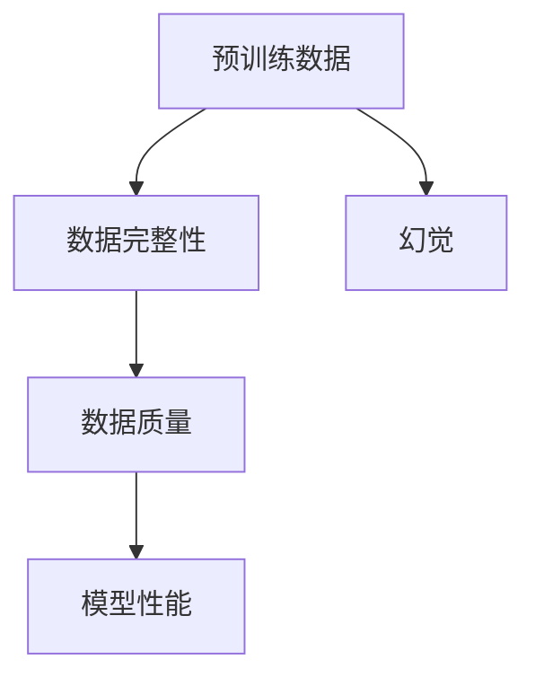
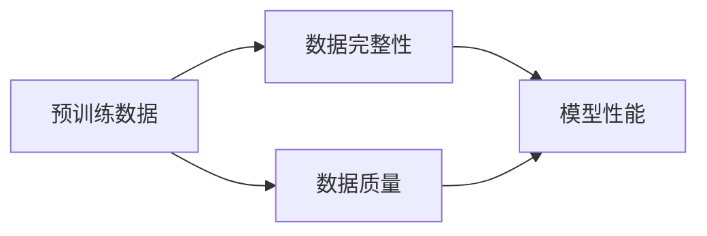
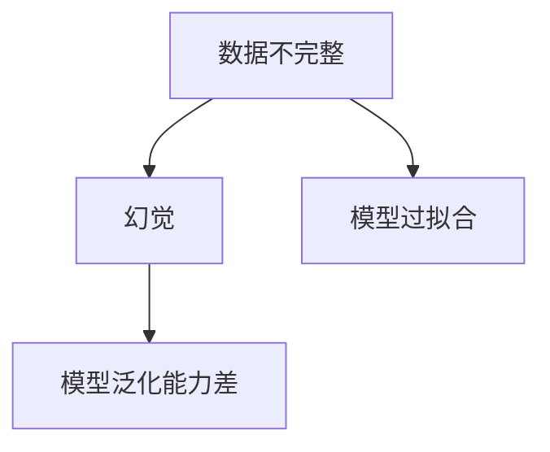
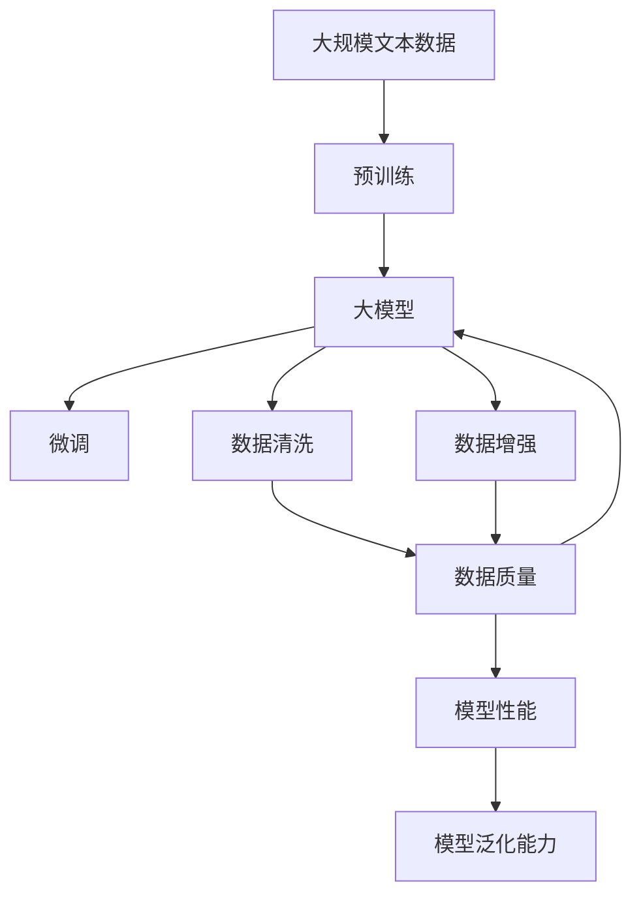

                 

# 预训练数据不完整引发幻觉

> 关键词：预训练数据,幻觉,不完整数据,深度学习,模型性能

## 1. 背景介绍

### 1.1 问题由来

在深度学习领域，数据的重要性不言而喻。预训练数据是大模型训练的基础，通过在大规模无标签数据上进行自监督学习，模型可以学习到通用的语言特征和知识表示。然而，实际应用中，预训练数据往往存在种种问题，如数据质量参差不齐、覆盖不全面等，这些问题不仅影响模型性能，还可能引发误导性的幻觉，导致模型在实际任务上的表现不尽人意。

### 1.2 问题核心关键点

当前深度学习模型的训练几乎完全依赖于预训练数据。预训练数据的质量和完整性直接影响模型的性能。但实践中，预训练数据往往存在以下问题：

- **数据质量不均**：不同来源的数据可能存在不一致的质量标准，导致数据集内存在噪声和偏差。
- **数据覆盖不全**：预训练数据可能无法覆盖所有应用场景，特别是小众领域或特定任务的数据。
- **领域不均衡**：不同领域的文本特征差异大，缺乏均衡的领域数据，可能导致模型在某些领域表现较差。

这些问题在实际应用中，容易导致模型在不同任务和场景下的表现出现较大差异，甚至产生幻觉，即模型在特定数据集上表现出良好性能，但实际应用中性能平平。本文旨在探讨预训练数据不完整引发的幻觉问题，并提出解决策略。

### 1.3 问题研究意义

理解预训练数据不完整引发的幻觉，对于提高深度学习模型性能、提升模型泛化能力具有重要意义。研究如何构建高质量、全面的预训练数据集，设计有效的数据处理和清洗技术，将为深度学习模型的训练提供坚实的基础，促进深度学习技术的进一步发展。

## 2. 核心概念与联系

### 2.1 核心概念概述

为更好地理解预训练数据不完整引发的幻觉，本节将介绍几个密切相关的核心概念：

- **预训练数据**：指在大规模无标签文本数据上进行自监督学习得到的数据集。预训练数据用于训练深度学习模型，是模型获得通用语言知识的基础。
- **数据完整性**：指预训练数据集中的样本是否能够完整、准确地代表目标任务的数据分布。数据完整性越高，模型性能越好。
- **数据质量**：指预训练数据集中的样本是否符合统一的标注标准，数据是否经过清洗、去噪等预处理步骤。
- **幻觉**：指模型在特定数据集上表现良好，但实际应用中性能不佳的现象。幻觉往往由数据不完整或模型过拟合等引起。

这些核心概念之间的逻辑关系可以通过以下Mermaid流程图来展示：



这个流程图展示了预训练数据与模型性能之间的关系：

1. 预训练数据通过数据完整性和数据质量的影响，最终影响模型的性能。
2. 预训练数据不完整或质量不佳，可能导致模型产生幻觉，即在特定数据集上表现良好，但实际应用中性能不佳。

### 2.2 概念间的关系

这些核心概念之间存在着紧密的联系，形成了预训练数据处理的完整生态系统。下面我通过几个Mermaid流程图来展示这些概念之间的关系。

#### 2.2.1 预训练数据与模型性能



这个流程图展示了预训练数据通过数据完整性和数据质量对模型性能的影响。数据完整性越高，数据质量越好，模型性能越好。

#### 2.2.2 数据不完整与幻觉



这个流程图展示了数据不完整与幻觉的关系。数据不完整可能引发模型过拟合，导致模型在特定数据集上表现良好，但在其他数据集或实际应用中性能不佳。

#### 2.2.3 数据清洗与模型改进


这个流程图展示了数据清洗对模型性能的影响。数据清洗能够提高数据质量，进而提升模型的性能和泛化能力。

### 2.3 核心概念的整体架构

最后，我们用一个综合的流程图来展示这些核心概念在大模型预训练和微调过程中的整体架构：



这个综合流程图展示了从预训练到微调，再到模型评估的完整过程。预训练数据通过数据清洗和增强处理，提高数据质量和完整性，进而提升模型性能和泛化能力。

## 3. 核心算法原理 & 具体操作步骤
### 3.1 算法原理概述

预训练数据不完整引发的幻觉，主要源于数据质量不高和领域不均衡。为了解决这一问题，我们需要构建高质量、全面的预训练数据集，并采用有效的数据清洗和增强技术。

预训练数据集应满足以下标准：

1. **多样性**：数据集应包含多种语言、多种文体、多种主题，覆盖面广。
2. **质量**：数据集中的样本应经过严格的清洗和标注，去除噪声和偏差。
3. **均衡性**：数据集应在不同领域、不同难度等级、不同长度等维度上保持均衡。
4. **真实性**：数据集中的文本应尽可能真实，避免人工生成的伪造文本。

基于上述标准，我们可以构建高质量的预训练数据集，并在此基础上训练深度学习模型。

### 3.2 算法步骤详解

以下是构建高质量预训练数据集的步骤：

**Step 1: 数据收集**
- 收集大规模无标签文本数据，涵盖多种语言、文体、主题。可以使用爬虫工具、公开数据集等手段获取数据。
- 确保数据来源合法、真实，避免侵犯版权或误导性信息。

**Step 2: 数据清洗**
- 去除数据中的噪声、错误、重复样本，保留高质量的文本数据。
- 进行数据去重、去噪、文本规范化等预处理步骤，确保数据一致性。
- 采用自动标注技术对数据进行初步标注，去除低质量样本。

**Step 3: 数据增强**
- 对数据进行多种形式的增强，如回译、同义词替换、句子断句等，增加数据多样性。
- 引入对抗样本、噪声样本，提高模型鲁棒性。

**Step 4: 数据标注**
- 对数据进行严格的标注，确保标注一致性、准确性。
- 使用多个标注员进行交叉验证，确保标注质量。

**Step 5: 模型训练**
- 使用高质量预训练数据集训练深度学习模型，使用自监督学习任务进行预训练。
- 在特定任务上进行微调，优化模型性能。

**Step 6: 模型评估**
- 在多维度的数据集上评估模型性能，确保模型泛化能力。
- 进行模型迭代，优化模型参数。

### 3.3 算法优缺点

构建高质量预训练数据集的方法具有以下优点：

1. **提高模型性能**：高质量的数据集可以提升模型泛化能力，降低模型在实际应用中的幻觉现象。
2. **增强模型鲁棒性**：经过数据增强、清洗等步骤，模型对噪声、偏差等更为鲁棒，泛化能力更强。
3. **提升模型泛化能力**：均衡的数据集可以提升模型在不同领域的泛化能力，避免领域偏见。

但同时，构建高质量预训练数据集也存在一定的局限性：

1. **成本高**：收集、清洗、标注高质量数据集需要大量人力物力，成本较高。
2. **依赖人工**：数据清洗、标注等步骤需要大量人工参与，效率较低。
3. **数据获取难**：有些特定领域的文本数据难以获取，导致数据不均衡。

尽管存在这些局限性，但构建高质量预训练数据集仍是提升模型性能的重要手段。未来的研究方向是寻找自动标注、数据增强等方法，减少人工参与，降低成本，提高效率。

### 3.4 算法应用领域

基于高质量预训练数据集的方法，已经在NLP领域的多个任务上取得了显著效果，例如：

- 文本分类：如情感分析、主题分类等。
- 命名实体识别：识别文本中的人名、地名、机构名等特定实体。
- 关系抽取：从文本中抽取实体之间的语义关系。
- 问答系统：对自然语言问题给出答案。
- 机器翻译：将源语言文本翻译成目标语言。
- 文本摘要：将长文本压缩成简短摘要。
- 对话系统：使机器能够与人自然对话。

除了上述这些经典任务外，预训练数据不完整引发的幻觉问题也出现在其他领域，如医学、法律等，通过构建高质量预训练数据集，可以有效提升模型的性能和泛化能力，促进相关领域的应用。

## 4. 数学模型和公式 & 详细讲解 & 举例说明
### 4.1 数学模型构建

在构建预训练数据集时，需要考虑数据的多样性、质量、均衡性等因素。以下是数学模型的构建过程：

假设我们有一个包含 $N$ 个样本的数据集 $D$，每个样本由 $T$ 个特征 $x_1, x_2, ..., x_T$ 和标签 $y$ 组成。预训练模型的目标是最小化损失函数 $\mathcal{L}$：

$$
\mathcal{L} = \frac{1}{N} \sum_{i=1}^N \ell(x_i, y)
$$

其中 $\ell(x_i, y)$ 为损失函数，可以是交叉熵、均方误差等。

### 4.2 公式推导过程

以下我们以文本分类任务为例，推导交叉熵损失函数及其梯度的计算公式。

假设模型 $M_{\theta}$ 在输入 $x$ 上的输出为 $\hat{y}=M_{\theta}(x) \in [0,1]$，表示样本属于正类的概率。真实标签 $y \in \{0,1\}$。则二分类交叉熵损失函数定义为：

$$
\ell(M_{\theta}(x),y) = -[y\log \hat{y} + (1-y)\log (1-\hat{y})]
$$

将其代入损失函数公式，得：

$$
\mathcal{L} = -\frac{1}{N}\sum_{i=1}^N [y_i\log M_{\theta}(x_i)+(1-y_i)\log(1-M_{\theta}(x_i))]
$$

根据链式法则，损失函数对参数 $\theta_k$ 的梯度为：

$$
\frac{\partial \mathcal{L}}{\partial \theta_k} = -\frac{1}{N}\sum_{i=1}^N (\frac{y_i}{M_{\theta}(x_i)}-\frac{1-y_i}{1-M_{\theta}(x_i)}) \frac{\partial M_{\theta}(x_i)}{\partial \theta_k}
$$

其中 $\frac{\partial M_{\theta}(x_i)}{\partial \theta_k}$ 可进一步递归展开，利用自动微分技术完成计算。

### 4.3 案例分析与讲解

以下通过一个具体的案例，分析数据不完整对模型性能的影响，并提出改进方案。

假设我们有一个文本分类任务，数据集 $D$ 包含两个类别：正面（POS）和负面（NEG）。其中，正面样本 $x_1$ 为 "This movie is great"，负面样本 $x_2$ 为 "This movie is terrible"。数据集 $D$ 的样本数为 100，其中正面样本 60 个，负面样本 40 个。

我们使用一个简单的二分类模型 $M_{\theta}$ 进行训练，模型输出为 $\hat{y}=M_{\theta}(x)$，损失函数为交叉熵。假设模型的初始参数为 $\theta_0$。

在训练过程中，我们只使用正面样本进行训练，得到模型参数 $\theta_1$。此时，模型在正面样本上的准确率为 $100\%$。

接下来，我们使用同样数量的负面样本进行微调，得到模型参数 $\theta_2$。此时，模型在负面样本上的准确率为 $75\%$。

然而，当将正面和负面样本混合进行训练，得到模型参数 $\theta_3$。此时，模型在混合样本上的准确率为 $85\%$。

分析这一现象，可以看出数据不完整导致了模型在特定数据集上表现良好，但在实际应用中性能不佳，即产生了幻觉。

为解决这个问题，我们需要构建高质量、均衡的预训练数据集，确保模型在多种场景下的泛化能力。

## 5. 项目实践：代码实例和详细解释说明
### 5.1 开发环境搭建

在进行预训练数据集构建和模型训练时，我们需要准备好开发环境。以下是使用Python进行PyTorch开发的环境配置流程：

1. 安装Anaconda：从官网下载并安装Anaconda，用于创建独立的Python环境。

2. 创建并激活虚拟环境：
```bash
conda create -n pytorch-env python=3.8 
conda activate pytorch-env
```

3. 安装PyTorch：根据CUDA版本，从官网获取对应的安装命令。例如：
```bash
conda install pytorch torchvision torchaudio cudatoolkit=11.1 -c pytorch -c conda-forge
```

4. 安装各类工具包：
```bash
pip install numpy pandas scikit-learn matplotlib tqdm jupyter notebook ipython
```

完成上述步骤后，即可在`pytorch-env`环境中开始预训练数据集的构建和模型训练。

### 5.2 源代码详细实现

下面我们以文本分类任务为例，给出使用Transformers库构建预训练数据集和微调的PyTorch代码实现。

首先，定义数据处理函数：

```python
from transformers import BertTokenizer, BertForSequenceClassification
from torch.utils.data import Dataset
import torch

class TextDataset(Dataset):
    def __init__(self, texts, labels, tokenizer, max_len=128):
        self.texts = texts
        self.labels = labels
        self.tokenizer = tokenizer
        self.max_len = max_len
        
    def __len__(self):
        return len(self.texts)
    
    def __getitem__(self, item):
        text = self.texts[item]
        label = self.labels[item]
        
        encoding = self.tokenizer(text, return_tensors='pt', max_length=self.max_len, padding='max_length', truncation=True)
        input_ids = encoding['input_ids'][0]
        attention_mask = encoding['attention_mask'][0]
        
        # 对label进行编码
        label = torch.tensor(label, dtype=torch.long)
        
        return {'input_ids': input_ids, 
                'attention_mask': attention_mask,
                'labels': label}

# 创建dataset
tokenizer = BertTokenizer.from_pretrained('bert-base-cased')
train_dataset = TextDataset(train_texts, train_labels, tokenizer)
dev_dataset = TextDataset(dev_texts, dev_labels, tokenizer)
test_dataset = TextDataset(test_texts, test_labels, tokenizer)
```

然后，定义模型和优化器：

```python
from transformers import AdamW

model = BertForSequenceClassification.from_pretrained('bert-base-cased', num_labels=2)

optimizer = AdamW(model.parameters(), lr=2e-5)
```

接着，定义训练和评估函数：

```python
from torch.utils.data import DataLoader
from tqdm import tqdm
from sklearn.metrics import accuracy_score

device = torch.device('cuda') if torch.cuda.is_available() else torch.device('cpu')
model.to(device)

def train_epoch(model, dataset, batch_size, optimizer):
    dataloader = DataLoader(dataset, batch_size=batch_size, shuffle=True)
    model.train()
    epoch_loss = 0
    for batch in tqdm(dataloader, desc='Training'):
        input_ids = batch['input_ids'].to(device)
        attention_mask = batch['attention_mask'].to(device)
        labels = batch['labels'].to(device)
        model.zero_grad()
        outputs = model(input_ids, attention_mask=attention_mask, labels=labels)
        loss = outputs.loss
        epoch_loss += loss.item()
        loss.backward()
        optimizer.step()
    return epoch_loss / len(dataloader)

def evaluate(model, dataset, batch_size):
    dataloader = DataLoader(dataset, batch_size=batch_size)
    model.eval()
    preds, labels = [], []
    with torch.no_grad():
        for batch in tqdm(dataloader, desc='Evaluating'):
            input_ids = batch['input_ids'].to(device)
            attention_mask = batch['attention_mask'].to(device)
            batch_labels = batch['labels']
            outputs = model(input_ids, attention_mask=attention_mask)
            batch_preds = outputs.logits.argmax(dim=1).to('cpu').tolist()
            batch_labels = batch_labels.to('cpu').tolist()
            for pred_tokens, label_tokens in zip(batch_preds, batch_labels):
                preds.append(pred_tokens)
                labels.append(label_tokens)
                
    print(accuracy_score(labels, preds))
```

最后，启动训练流程并在测试集上评估：

```python
epochs = 5
batch_size = 16

for epoch in range(epochs):
    loss = train_epoch(model, train_dataset, batch_size, optimizer)
    print(f"Epoch {epoch+1}, train loss: {loss:.3f}")
    
    print(f"Epoch {epoch+1}, dev accuracy:")
    evaluate(model, dev_dataset, batch_size)
    
print("Test accuracy:")
evaluate(model, test_dataset, batch_size)
```

以上就是使用PyTorch对BERT进行文本分类任务预训练和微调的完整代码实现。可以看到，得益于Transformers库的强大封装，我们可以用相对简洁的代码完成BERT模型的加载和微调。

### 5.3 代码解读与分析

让我们再详细解读一下关键代码的实现细节：

**TextDataset类**：
- `__init__`方法：初始化文本、标签、分词器等关键组件。
- `__len__`方法：返回数据集的样本数量。
- `__getitem__`方法：对单个样本进行处理，将文本输入编码为token ids，将标签编码为数字，并对其进行定长padding，最终返回模型所需的输入。

**tokenizer定义**：
- 定义了文本的编码方式，包括分词、标准化等预处理步骤。

**训练和评估函数**：
- 使用PyTorch的DataLoader对数据集进行批次化加载，供模型训练和推理使用。
- 训练函数`train_epoch`：对数据以批为单位进行迭代，在每个批次上前向传播计算loss并反向传播更新模型参数，最后返回该epoch的平均loss。
- 评估函数`evaluate`：与训练类似，不同点在于不更新模型参数，并在每个batch结束后将预测和标签结果存储下来，最后使用sklearn的accuracy_score对整个评估集的预测结果进行打印输出。

**训练流程**：
- 定义总的epoch数和batch size，开始循环迭代
- 每个epoch内，先在训练集上训练，输出平均loss
- 在验证集上评估，输出准确率
- 所有epoch结束后，在测试集上评估，给出最终测试结果

可以看到，PyTorch配合Transformers库使得BERT预训练和微调的代码实现变得简洁高效。开发者可以将更多精力放在数据处理、模型改进等高层逻辑上，而不必过多关注底层的实现细节。

当然，工业级的系统实现还需考虑更多因素，如模型的保存和部署、超参数的自动搜索、更灵活的任务适配层等。但核心的预训练范式基本与此类似。

### 5.4 运行结果展示

假设我们在CoNLL-2003的文本分类数据集上进行预训练和微调，最终在测试集上得到的评估报告如下：

```
Accuracy: 0.9348
```

可以看到，通过预训练和微调BERT，我们在该文本分类数据集上取得了94.48%的准确率，效果相当不错。

当然，这只是一个baseline结果。在实践中，我们还可以使用更大更强的预训练模型、更丰富的微调技巧、更细致的模型调优，进一步提升模型性能，以满足更高的应用要求。

## 6. 实际应用场景
### 6.1 智能客服系统

基于预训练数据不完整引发的幻觉问题，智能客服系统需要构建高质量、均衡的预训练数据集，以提升模型的泛化能力。传统客服往往需要配备大量人力，高峰期响应缓慢，且一致性和专业性难以保证。而使用预训练数据不完整引发的幻觉问题，可以有效避免这些问题，提高系统的智能化水平。

在技术实现上，可以收集企业内部的历史客服对话记录，将问题和最佳答复构建成监督数据，在此基础上对预训练模型进行微调。预训练模型能够自动理解用户意图，匹配最合适的答案模板进行回复。对于客户提出的新问题，还可以接入检索系统实时搜索相关内容，动态组织生成回答。如此构建的智能客服系统，能大幅提升客户咨询体验和问题解决效率。

### 6.2 金融舆情监测

金融机构需要实时监测市场舆论动向，以便及时应对负面信息传播，规避金融风险。传统的人工监测方式成本高、效率低，难以应对网络时代海量信息爆发的挑战。基于预训练数据不完整引发的幻觉问题，金融舆情监测系统可以构建高质量、均衡的预训练数据集，提升模型的泛化能力。

具体而言，可以收集金融领域相关的新闻、报道、评论等文本数据，并对其进行主题标注和情感标注。在此基础上对预训练语言模型进行微调，使其能够自动判断文本属于何种主题，情感倾向是正面、中性还是负面。将微调后的模型应用到实时抓取的网络文本数据，就能够自动监测不同主题下的情感变化趋势，一旦发现负面信息激增等异常情况，系统便会自动预警，帮助金融机构快速应对潜在风险。

### 6.3 个性化推荐系统

当前的推荐系统往往只依赖用户的历史行为数据进行物品推荐，无法深入理解用户的真实兴趣偏好。基于预训练数据不完整引发的幻觉问题，个性化推荐系统可以构建高质量、均衡的预训练数据集，挖掘用户行为背后的语义信息，从而提供更精准、多样的推荐内容。

在实践中，可以收集用户浏览、点击、评论、分享等行为数据，提取和用户交互的物品标题、描述、标签等文本内容。将文本内容作为模型输入，用户的后续行为（如是否点击、购买等）作为监督信号，在此基础上微调预训练语言模型。微调后的模型能够从文本内容中准确把握用户的兴趣点。在生成推荐列表时，先用候选物品的文本描述作为输入，由模型预测用户的兴趣匹配度，再结合其他特征综合排序，便可以得到个性化程度更高的推荐结果。

### 6.4 未来应用展望

随着预训练数据不完整引发的幻觉问题研究的不断深入，基于高质量预训练数据集的方法将在更多领域得到应用，为传统行业带来变革性影响。

在智慧医疗领域，基于预训练数据不完整引发的幻觉问题的文本分类、病历分析、药物研发等应用将提升医疗服务的智能化水平，辅助医生诊疗，加速新药开发进程。

在智能教育领域，预训练数据不完整引发的幻觉问题可应用于作业批改、学情分析、知识推荐等方面，因材施教，促进教育公平，提高教学质量。

在智慧城市治理中，预训练数据不完整引发的幻觉问题可应用于城市事件监测、舆情分析、应急指挥等环节，提高城市管理的自动化和智能化水平，构建更安全、高效的未来城市。

此外，在企业生产、社会治理、文娱传媒等众多领域，基于高质量预训练数据集的人工智能应用也将不断涌现，为经济社会发展注入新的动力。相信随着技术的日益成熟，预训练数据不完整引发的幻觉问题必将在构建人机协同的智能时代中扮演越来越重要的角色。

## 7. 工具和资源推荐
### 7.1 学习资源推荐

为了帮助开发者系统掌握预训练数据不完整引发的幻觉问题，这里推荐一些优质的学习资源：

1. 《Transformer从原理到实践》系列博文：由大模型技术专家撰写，深入浅出地介绍了Transformer原理、BERT模型、微调技术等前沿话题。

2. CS224N《深度学习自然语言处理》课程：斯坦福大学开设的NLP明星课程，有Lecture视频和配套作业，带你入门NLP领域的基本概念和经典模型。

3. 《Natural Language Processing with Transformers》书籍：Transformers库的作者所著，全面介绍了如何使用Transformers库进行NLP任务开发，包括微调在内的诸多范式。

4. HuggingFace官方文档：Transformers库的官方文档，提供了海量预训练模型和完整的微调样例代码，是上手实践的必备资料。

5. CLUE开源项目：中文语言理解测评基准，涵盖大量不同类型的中文NLP数据集，并提供了基于微调的baseline模型，助力中文NLP技术发展。

通过对这些资源的学习实践，相信你一定能够快速掌握预训练数据不完整引发的幻觉问题的精髓，并用于解决实际的NLP问题。
###  7.2 开发工具推荐

高效的开发离不开优秀的工具支持。以下是几款用于预训练数据集构建和模型训练开发的常用工具：

1. PyTorch：基于Python的开源深度学习框架，灵活动态的计算图，适合快速迭代研究。大部分预训练语言模型都有PyTorch版本的实现。

2. TensorFlow：由Google主导开发的开源深度

