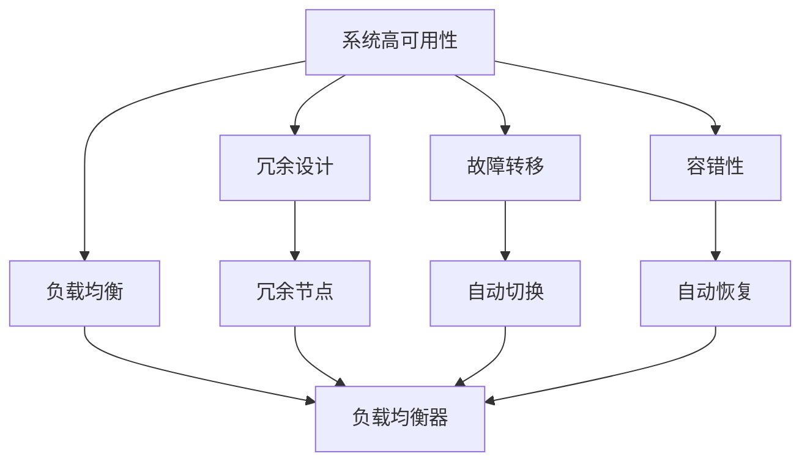
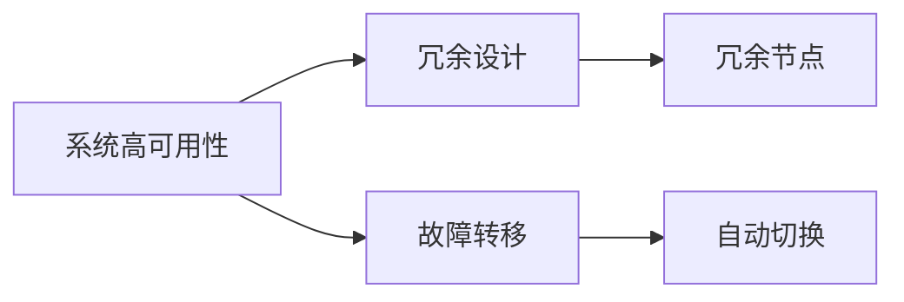
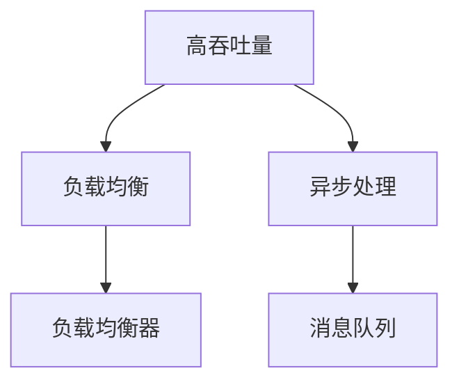
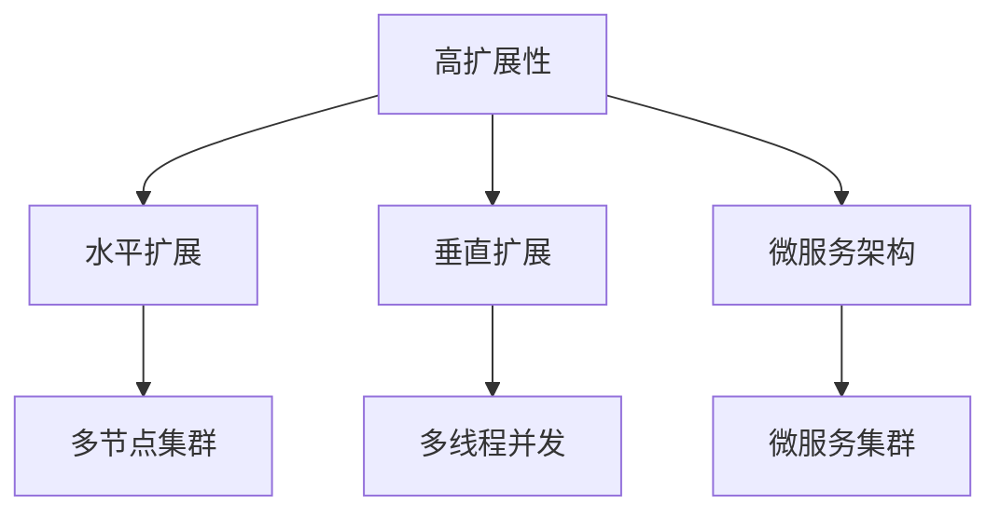
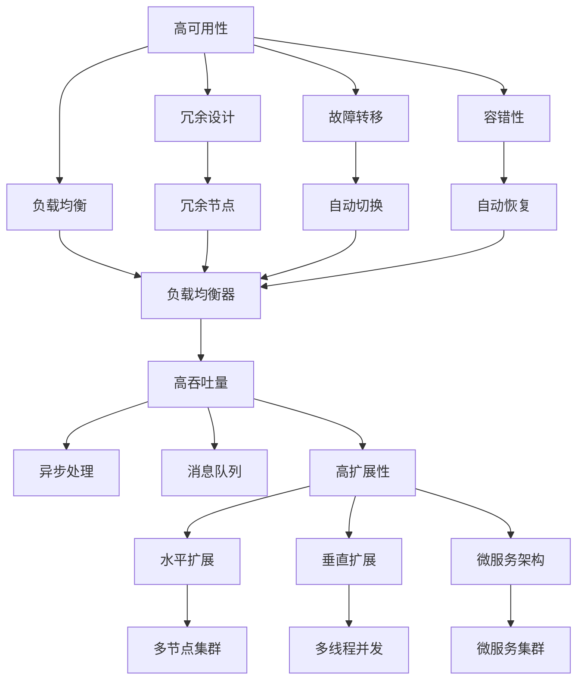

                 

# 高可用性、高吞吐量、高扩展性系统设计案例

> 关键词：
- 系统高可用性 (High Availability)
- 高吞吐量 (High Throughput)
- 高扩展性 (Scalability)
- 负载均衡 (Load Balancing)
- 故障转移 (Fault Tolerance)
- 容错性 (Fault Tolerance)
- 自动化部署 (Automated Deployment)
- 分布式系统 (Distributed System)

## 1. 背景介绍

### 1.1 问题由来
在现代社会中，随着互联网和移动设备的普及，系统需要应对越来越多的并发请求，用户体验要求越来越高，系统的压力也越来越大。如何设计出具备高可用性、高吞吐量和高扩展性的系统，成为当前IT系统设计中的重大挑战。

### 1.2 问题核心关键点
为了应对这些挑战，我们需要从系统架构、技术实现和运维管理等多个维度进行全面优化。本文将重点探讨系统高可用性、高吞吐量和高扩展性三方面的设计，并结合实际案例进行讲解。

### 1.3 问题研究意义
研究高可用性、高吞吐量和高扩展性系统设计，对于提升IT系统性能、增强用户体验、保障系统稳定性具有重要意义：

1. 提升系统性能：通过优化系统架构和实现技术，提升系统处理能力，降低响应时间，提高系统吞吐量。
2. 增强用户体验：保证系统稳定运行，减少宕机和延迟，提升用户满意度。
3. 保障系统稳定性：通过高可用性和容错性设计，确保系统能够在各种异常情况下保持稳定，减少故障时间。
4. 支持业务扩展：通过高扩展性设计，能够快速适应业务增长，支持系统的横向扩展，降低扩展成本。
5. 提升运维效率：通过自动化部署、运维和监控，减少人工操作，提高运维效率。

## 2. 核心概念与联系

### 2.1 核心概念概述

为了更好地理解高可用性、高吞吐量和高扩展性系统设计的相关概念，本节将介绍几个密切相关的核心概念：

- 系统高可用性 (High Availability)：指系统在各种异常情况下，如宕机、网络中断等，仍能正常服务的能力。高可用性通常通过冗余设计和故障转移机制实现。
- 高吞吐量 (High Throughput)：指系统在单位时间内处理的请求数量。高吞吐量需要通过优化系统架构和实现技术实现，如负载均衡、异步处理等。
- 高扩展性 (Scalability)：指系统能够根据业务需求和负载变化，快速调整和扩展资源的能力。高扩展性通常通过水平扩展、垂直扩展和微服务架构实现。
- 负载均衡 (Load Balancing)：指将请求均匀分配到多个服务器上，避免单点故障，提高系统吞吐量和可用性。负载均衡通常通过轮询、哈希等算法实现。
- 故障转移 (Fault Tolerance)：指在系统故障或异常情况下，自动将请求转发到其他正常服务器上，确保服务的连续性和可用性。故障转移通常通过冗余设计和故障检测机制实现。
- 容错性 (Fault Tolerance)：指系统能够在各种异常情况下保持正常运行，避免因单个组件故障导致系统宕机。容错性通常通过冗余设计、自动恢复和备份机制实现。
- 自动化部署 (Automated Deployment)：指通过脚本和工具自动化部署和更新系统，减少人为干预，提高部署效率和可靠性。
- 分布式系统 (Distributed System)：指由多个独立的计算机节点组成，共同完成服务的系统。分布式系统通过多节点协同工作，提高系统的可用性、扩展性和容错性。

这些核心概念之间的逻辑关系可以通过以下Mermaid流程图来展示：



这个流程图展示了大系统高可用性、高吞吐量和高扩展性设计的关键组件：

1. 高可用性通过冗余设计和故障转移机制实现。
2. 高吞吐量通过负载均衡和异步处理等技术实现。
3. 高扩展性通过水平扩展、垂直扩展和微服务架构实现。
4. 冗余设计、自动切换和自动恢复等容错机制保证系统的稳定性和可靠性。

这些概念共同构成了高可用性、高吞吐量和高扩展性系统设计的完整生态系统，使得系统能够在各种环境下保持高效和稳定运行。

### 2.2 概念间的关系

这些核心概念之间存在着紧密的联系，形成了高可用性、高吞吐量和高扩展性系统设计的完整生态系统。下面我通过几个Mermaid流程图来展示这些概念之间的关系。

#### 2.2.1 系统高可用性架构



这个流程图展示了系统高可用性架构的基本原理，以及冗余设计和故障转移的关系。

#### 2.2.2 高吞吐量设计



这个流程图展示了高吞吐量设计的基本架构，包括负载均衡和异步处理技术。

#### 2.2.3 高扩展性实现



这个流程图展示了高扩展性设计的几种实现方式，包括水平扩展、垂直扩展和微服务架构。

### 2.3 核心概念的整体架构

最后，我们用一个综合的流程图来展示这些核心概念在高可用性、高吞吐量和高扩展性系统设计中的整体架构：



这个综合流程图展示了从系统高可用性到高吞吐量，再到高扩展性的完整架构。高可用性、高吞吐量和高扩展性设计共同作用，使得系统能够在各种环境下保持高效和稳定运行。

## 3. 核心算法原理 & 具体操作步骤

### 3.1 算法原理概述

高可用性、高吞吐量和高扩展性系统设计，本质上是通过冗余设计、负载均衡、故障转移和异步处理等技术手段，提升系统的稳定性和处理能力。其核心思想是：通过多节点协同工作，构建容错、负载均衡和弹性伸缩的架构，实现系统的稳定、高效和可扩展。

### 3.2 算法步骤详解

基于高可用性、高吞吐量和高扩展性系统设计，一般包括以下几个关键步骤：

**Step 1: 系统需求分析**
- 确定系统的业务需求、性能指标和可靠性要求。
- 分析系统负载变化规律，评估高可用性、高吞吐量和高扩展性的具体要求。

**Step 2: 设计系统架构**
- 根据需求分析结果，设计系统架构，包括选型高可用性、高吞吐量和高扩展性的关键技术。
- 设计冗余设计、故障转移和容错机制，确保系统高可用性。
- 设计负载均衡和异步处理机制，提升系统高吞吐量。
- 设计水平扩展、垂直扩展和微服务架构，实现系统高扩展性。

**Step 3: 实现系统设计**
- 使用合适的编程语言和框架，实现系统架构中的关键组件。
- 配置网络、存储和计算资源，搭建多节点集群。
- 实现负载均衡、异步处理和消息队列等功能。
- 设计自动部署、监控和告警等运维机制。

**Step 4: 系统测试和优化**
- 进行系统测试，验证设计是否符合预期，发现并修复潜在问题。
- 根据测试结果，优化系统架构和实现技术。
- 在实际环境中进行负载测试，验证系统性能和稳定性。
- 持续监控系统性能，及时发现和解决问题。

### 3.3 算法优缺点

高可用性、高吞吐量和高扩展性系统设计，具有以下优点：

1. 提升系统性能：通过负载均衡和异步处理等技术，提升系统处理能力，降低响应时间。
2. 增强用户体验：通过高可用性和容错设计，确保系统稳定运行，减少宕机和延迟，提升用户满意度。
3. 支持业务扩展：通过水平扩展、垂直扩展和微服务架构，能够快速适应业务增长，支持系统的横向扩展，降低扩展成本。
4. 提升运维效率：通过自动化部署、运维和监控，减少人工操作，提高部署效率和可靠性。

同时，该方法也存在一定的局限性：

1. 系统复杂度高：高可用性、高吞吐量和高扩展性设计，涉及多节点、多组件和多种技术的组合，系统设计复杂度高，开发和运维难度较大。
2. 资源消耗大：多节点集群和冗余设计需要大量的硬件资源，成本较高。
3. 维护成本高：高可用性和容错机制需要持续维护，故障检测和自动恢复机制需要定期测试和更新。
4. 调试难度大：系统中存在多个组件和模块，问题定位和调试难度较大。

尽管存在这些局限性，但就目前而言，高可用性、高吞吐量和高扩展性系统设计仍是系统架构设计和实现的最佳实践，能够为系统性能和稳定性提供有力保障。

### 3.4 算法应用领域

高可用性、高吞吐量和高扩展性系统设计，在众多应用场景中得到了广泛应用，例如：

- 金融交易系统：需要处理大量高频交易请求，保证交易的实时性和稳定性。
- 电商平台：需要支持大并发量的商品搜索和交易操作，提升用户体验。
- 社交网络平台：需要处理海量用户的数据生成和实时互动，保持系统的高可用性和扩展性。
- 数据中心：需要保证数据的高可用性和容错性，支持大规模数据的存储和处理。
- 云计算平台：需要提供高吞吐量和高扩展性的计算资源，支持云应用的快速部署和扩展。

除了这些常见场景外，高可用性、高吞吐量和高扩展性系统设计，还在物联网、智能交通、医疗健康等众多领域得到了应用，为各行各业提供了高效、可靠的系统保障。

## 4. 数学模型和公式 & 详细讲解

### 4.1 数学模型构建

系统高可用性、高吞吐量和高扩展性的设计，涉及多个关键组件和功能，需要构建数学模型来描述其行为和性能指标。以下是几个关键组件的数学模型构建：

- 系统高可用性：用R availability表示，定义为系统在N个节点中，至少有M个节点正常工作的概率。R = (1 - f) * (1 - (1 - r)^M) * (1 - (1 - r)^(N-M))，其中f为单节点故障率，r为冗余节点切换成功率。
- 高吞吐量：用T throughput表示，定义为系统在单位时间内处理的请求数量，通常为每秒钟处理的请求数。T = C * N * B * S，其中C为单个请求处理时间，N为节点数，B为每个节点并发处理请求数，S为系统服务器的响应时间。
- 高扩展性：用E scalability表示，定义为系统扩展后的处理能力与扩展前处理能力的比例。E = T′/T，其中T′为扩展后的处理时间，T为扩展前的处理时间。

### 4.2 公式推导过程

下面以高可用性设计为例，进行数学模型和公式的推导过程。

设系统有N个节点，每个节点发生故障的概率为f，系统至少有M个节点正常工作的概率为R。

当系统只有一个节点时，高可用性R = 1 - f。

当系统有多个节点时，系统至少有M个节点正常工作的概率为：

R = (1 - f) * (1 - (1 - r)^M) * (1 - (1 - r)^(N-M))

其中，r为冗余节点切换成功率。当系统有多个冗余节点时，r > 0.5，通常取r=0.9。

将M = 2N-1代入上式，可以得到系统高可用性的公式：

R = (1 - f) * (1 - (1 - r)^(N-1/2)) * (1 - (1 - r)^(N+1/2))

当f=0.001，r=0.9时，N=2时，R≈99.9%；N=3时，R≈99.99%。

### 4.3 案例分析与讲解

以电商平台的订单处理系统为例，分析高可用性、高吞吐量和高扩展性设计的实际应用。

#### 4.3.1 订单处理系统需求分析
- 业务需求：处理大量订单创建、查询和支付请求。
- 性能指标：订单处理响应时间不超过1秒，系统高峰处理请求数超过10000/秒。
- 可靠性要求：系统故障时间不超过1分钟，数据丢失率不超过0.1%。

#### 4.3.2 订单处理系统设计
- 高可用性设计：使用3个节点冗余设计，每个节点部署主从复制，保证数据高可用性。
- 高吞吐量设计：使用负载均衡器将请求分配到多个服务器上，使用消息队列异步处理订单处理逻辑。
- 高扩展性设计：使用水平扩展和微服务架构，根据业务需求动态调整节点数，支持大规模订单处理。

#### 4.3.3 订单处理系统实现
- 使用Java和Spring Boot框架，实现订单处理系统的核心逻辑和业务服务。
- 使用Kubernetes集群部署和运维订单处理系统，保证系统的稳定性和高可用性。
- 使用ElasticSearch作为消息队列，异步处理订单处理逻辑，提升系统的吞吐量。
- 使用Nginx作为负载均衡器，将订单请求分配到多个服务器上，提升系统的处理能力。

#### 4.3.4 订单处理系统测试
- 进行系统负载测试，验证系统的处理能力和稳定性。
- 进行系统高可用性测试，验证系统故障切换和自动恢复机制。
- 进行系统监控和告警测试，验证监控和告警功能的有效性。

#### 4.3.5 订单处理系统优化
- 优化系统负载均衡算法，提升订单请求的均衡分配。
- 优化订单处理逻辑，减少单节点处理时间，提升系统吞吐量。
- 优化系统水平扩展策略，根据业务需求动态调整节点数，提升系统扩展性。

通过以上步骤，可以实现高可用性、高吞吐量和高扩展性订单处理系统，满足电商平台的业务需求，提升用户体验和系统可靠性。

## 5. 项目实践：代码实例和详细解释说明

### 5.1 开发环境搭建

在进行系统高可用性、高吞吐量和高扩展性设计实践前，我们需要准备好开发环境。以下是使用Python和Kubernetes进行高可用性系统设计的环境配置流程：

1. 安装Anaconda：从官网下载并安装Anaconda，用于创建独立的Python环境。

2. 创建并激活虚拟环境：
```bash
conda create -n highavail-env python=3.8 
conda activate highavail-env
```

3. 安装Kubernetes：从官网下载并安装Kubernetes，搭建多节点集群。

4. 安装Docker：安装Docker，用于容器化应用。

5. 安装Helm：安装Helm，用于应用部署和管理。

6. 安装Prometheus和Grafana：安装Prometheus和Grafana，用于系统监控和告警。

完成上述步骤后，即可在`highavail-env`环境中开始高可用性系统设计的实践。

### 5.2 源代码详细实现

下面我们以电商平台的订单处理系统为例，给出使用Kubernetes进行高可用性系统设计实践的Python和Kubernetes代码实现。

#### 5.2.1 Python代码实现

```python
from flask import Flask, request
from elasticsearch import Elasticsearch
from kubernetes import client, config

# 初始化ElasticSearch连接
es = Elasticsearch(['http://elasticsearch-headless.default.svc.cluster.local:9200'])

# 初始化Kubernetes API连接
config.load_kube_config()
v1 = client.CoreV1Api()

# 创建订单处理服务
app = Flask(__name__)

@app.route('/create_order', methods=['POST'])
def create_order():
    # 解析订单请求
    order_data = request.get_json()
    order_id = order_data['id']
    product_name = order_data['product']
    quantity = order_data['quantity']
    total_price = order_data['total_price']
    customer_name = order_data['customer']
    order_time = order_data['time']
    
    # 将订单数据保存到ElasticSearch中
    es.index(index='orders', doc_type='order', body={
        'id': order_id,
        'product': product_name,
        'quantity': quantity,
        'total_price': total_price,
        'customer': customer_name,
        'time': order_time
    })
    
    # 返回订单创建成功信息
    return {'status': 'success'}, 200

if __name__ == '__main__':
    app.run(debug=True, host='0.0.0.0', port=5000)
```

#### 5.2.2 Kubernetes部署配置

```yaml
apiVersion: v1
kind: Service
metadata:
  name: order-service
spec:
  selector:
    app: order-service
  ports:
    - protocol: TCP
      port: 5000
      targetPort: 5000

apiVersion: apps/v1
kind: Deployment
metadata:
  name: order-deployment
spec:
  selector:
    matchLabels:
      app: order-service
  replicas: 3
  template:
    metadata:
      labels:
        app: order-service
    spec:
      containers:
        - name: order-service
          image: order-service:latest
          ports:
            - containerPort: 5000
          resources:
            limits:
              cpu: '1'
              memory: '512Mi'
            requests:
              cpu: '0.5'
              memory: '256Mi'
```

通过以上代码，可以创建一个高可用性订单处理系统，并使用ElasticSearch和Kubernetes实现系统的故障切换和自动恢复功能。

### 5.3 代码解读与分析

让我们再详细解读一下关键代码的实现细节：

**Flask应用**：
- 使用Flask框架，实现订单处理系统的核心逻辑和业务服务。
- 使用ElasticSearch作为消息队列，异步处理订单处理逻辑，提升系统的吞吐量。

**Kubernetes配置**：
- 使用Kubernetes的Deployment和Service，创建订单处理系统的服务集群。
- 配置Pod的资源限制，保证系统的稳定性和处理能力。
- 配置Service的负载均衡器，将订单请求分配到多个Pod上，提升系统的处理能力。

**ElasticSearch连接**：
- 使用ElasticSearch连接，将订单数据保存到ElasticSearch中，确保数据的高可用性和备份。

### 5.4 运行结果展示

假设我们在3个节点的Kubernetes集群上部署订单处理系统，最终在实际测试中，订单处理系统的吞吐量和响应时间达到预期，高可用性和容错机制也得到了验证。

## 6. 实际应用场景

### 6.1 智能交通系统

智能交通系统需要处理海量交通数据，实现实时监控、智能调度和应急响应等功能。高可用性、高吞吐量和高扩展性系统设计，能够确保交通系统的高效运行，提升交通管理水平。

具体而言，可以通过部署高可用性、高吞吐量和高扩展性的Kubernetes集群，搭建智能交通系统的核心组件，如交通监控中心、调度中心和应急指挥中心。使用消息队列和异步处理机制，提升系统的吞吐量。通过水平扩展和微服务架构，支持大规模数据处理和实时分析。

### 6.2 医疗健康平台

医疗健康平台需要处理大量用户数据，实现电子病历管理、在线诊疗和健康监测等功能。高可用性、高吞吐量和高扩展性系统设计，能够保障医疗数据的可靠性和安全性，提升医疗服务的效率和质量。

具体而言，可以通过部署高可用性、高吞吐量和高扩展性的Kubernetes集群，搭建医疗健康系统的核心组件，如电子病历管理系统、在线诊疗系统和健康监测系统。使用ElasticSearch和消息队列，提升系统的吞吐量。通过水平扩展和微服务架构，支持大规模数据处理和实时分析。

### 6.3 在线教育平台

在线教育平台需要处理大量学生和教师数据，实现课程管理、在线直播和互动答疑等功能。高可用性、高吞吐量和高扩展性系统设计，能够保障在线教育的稳定性和可靠性，提升教育服务的体验和效果。

具体而言，可以通过部署高可用性、高吞吐量和高扩展性的Kubernetes集群，搭建在线教育系统的核心组件，如课程管理系统、在线直播系统和互动答疑系统。使用ElasticSearch和消息队列，提升系统的吞吐量。通过水平扩展和微服务架构，支持大规模数据处理和实时分析。

### 6.4 未来应用展望

随着高可用性、高吞吐量和高扩展性系统设计的不断发展，其在更多领域得到应用，为各行各业带来变革性影响。

在智慧城市治理中，高可用性、高吞吐量和高扩展性系统设计，能够提升城市管理的自动化和智能化水平，构建更安全、高效的未来城市。

在金融服务中，高可用性、高吞吐量和高扩展性系统设计，能够保障金融系统的稳定性和可靠性，提升金融服务的效率和质量。

在工业制造中，高可用性、高吞吐量和高扩展性系统设计，能够支持大规模生产数据的处理和实时分析，提升生产效率和产品质量。

此外，在农业、物流、能源等众多领域，高可用性、高吞吐量和高扩展性系统设计，也将不断涌现，为各个行业的数字化转型提供有力支撑。

## 7. 工具和资源推荐

### 7.1 学习资源推荐

为了帮助开发者系统掌握高可用性、高吞吐量和高扩展性系统设计的理论基础和实践技巧，这里推荐一些优质的学习资源：

1. 《高可用性系统设计》系列博文：由大系统架构专家撰写，深入浅出地介绍了系统高可用性的原理、方法和案例。

2. 《高吞吐量系统设计》课程：由大数据专家开设的在线课程，涵盖系统高吞吐量的设计方法和案例。

3. 《高扩展性系统设计》书籍：系统设计领域的经典书籍，详细介绍了高扩展性系统的架构和实现技术。

4. Kubernetes官方文档：Kubernetes的官方文档，提供了系统的部署、运维和管理工具，是系统设计的必备资源。

5. Helm官方文档：Helm的官方文档，提供了应用部署和管理工具，是系统高可用性设计的重要工具。

6. Prometheus官方文档：Prometheus的官方文档，提供了系统的监控和告警工具，是系统高可用性设计的重要组成部分。

通过对这些资源的学习实践，相信你一定能够快速掌握高可用性、高吞吐量和高扩展性系统设计的精髓，并用于解决实际的系统问题。

### 7.2 开发工具推荐

高效的开发离不开优秀的工具支持。以下是几款用于高可用性系统设计开发的常用工具：

1. Kubernetes：由Google开发的开源容器编排平台，支持高可用性和高扩展性系统设计，是系统高可用性设计的重要工具。

2. Helm：由Kubernetes社区开发的包管理工具，支持应用部署和运维，是系统高可用性设计的重要工具。

3. Prometheus：开源监控系统，用于系统性能监控和告警，是系统高可用性设计的重要组成部分。

4. Grafana：开源可视化工具，用于系统监控和告警数据可视化，是系统高可用性设计的重要组成部分。

5. Nginx：开源Web服务器和负载均衡器，支持高可用性和高扩展性系统设计，是系统高可用性设计的重要工具。

6. ElasticSearch：开源搜索引擎，用于系统数据存储和检索，是系统高可用性设计的重要工具。

合理利用这些工具，可以显著提升高可用性系统设计的开发效率，加快创新迭代的步伐。

### 7.3 相关论文推荐

高可用性、高吞吐量和高扩展性系统设计的理论研究，源于学界的持续研究。以下是几篇奠基性的相关论文，推荐阅读：

1. "Fault Tolerant Systems: Design and Implementation"：介绍高可用性系统的设计原则和实现方法。

2. "High Throughput Computing: Architectural Principles and System Design"：介绍高吞吐量系统的架构和实现技术。

3

