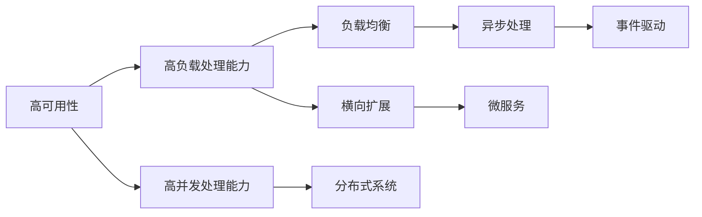

                 

# 高可用、高负载、高并发的互联网应用的架构设计

> 关键词：架构设计,高可用,高负载,高并发,互联网应用

## 1. 背景介绍

在互联网应用中，面对不断增长的用户量、复杂多变的业务需求以及瞬息万变的网络环境，如何构建一套稳定、高效、可扩展的系统架构，是每个开发者和架构师必须面对的挑战。高可用性、高负载处理能力和高并发处理能力是现代互联网应用的三大核心需求。

互联网应用的复杂性不仅体现在业务的多样性上，还在于其对系统稳定性和性能的极高要求。以电商平台为例，每天数亿的交易量要求系统毫秒级的响应时间；以社交平台为例，每时每秒成千上万的用户互动要求系统极高的稳定性。如何在不断扩展的业务需求下保持系统的高可用性和高性能，是构建互联网应用的核心挑战。

本文将详细探讨构建高可用、高负载、高并发的互联网应用架构的设计原则、常用技术和具体实现方法。通过深入分析典型的应用场景，我们希望为广大开发者和架构师提供实用的参考和指导。

## 2. 核心概念与联系

### 2.1 核心概念概述

在讨论架构设计前，我们先简要介绍几个关键概念：

- **高可用性 (High Availability)**：指系统能够在一定时间内保持连续的服务，不会因为局部故障导致系统完全中断。常见的可用性指标包括“九个九”（99.9%）、“十二个九”（99.99%）等。
- **高负载处理能力 (High Load Handling Capacity)**：指系统能够处理大规模、高频率的请求，保持系统的稳定运行。这通常需要配合负载均衡、横向扩展等技术。
- **高并发处理能力 (High Concurrent Handling Capacity)**：指系统能够同时处理大量的并发请求，维持低响应时间和高吞吐量。这需要优化系统设计，采用分布式架构、异步处理等技术。

以上三个概念相辅相成，共同构成了现代互联网应用架构的基础。通过合理的架构设计，可以平衡可用性、负载处理能力和并发处理能力，实现系统的高效运行。

### 2.2 概念间的关系

下面通过一个简单的Mermaid流程图，展示高可用、高负载和高并发处理能力之间的关系：



从流程图可以看出：

- 高可用性通过横向扩展、微服务等方式，将请求分散到多个节点，减少单点故障的风险。
- 高负载处理能力通过负载均衡、异步处理、事件驱动等技术，保证系统能够处理大规模请求，维持稳定运行。
- 高并发处理能力通过分布式系统、异步处理等设计，实现高效的多任务并行处理。

这些技术手段共同保障了互联网应用的高可用性、高负载处理能力和高并发处理能力。

## 3. 核心算法原理 & 具体操作步骤
### 3.1 算法原理概述

高可用、高负载、高并发的互联网应用架构设计，核心在于构建分布式系统，利用并行处理和多副本机制，实现系统的高可用性和高负载处理能力。本文将详细介绍分布式系统架构的核心设计原理和操作步骤。

### 3.2 算法步骤详解

构建高可用、高负载、高并发的互联网应用架构，通常遵循以下步骤：

1. **需求分析**：明确应用的核心需求、业务场景、用户量、数据规模等，以便确定系统架构的规模和复杂度。
2. **架构设计**：选择合适的技术栈和架构模式，如微服务、容器化、服务网格等，设计系统的高可用、高负载和高并发处理能力。
3. **系统实现**：根据设计方案，实现系统的核心功能，并进行单元测试和集成测试。
4. **性能优化**：通过负载均衡、分布式缓存、异步处理等技术，优化系统的负载处理能力和并发处理能力。
5. **监控和调优**：部署监控系统，实时监控系统性能指标，根据监控数据调整参数，优化系统性能。
6. **高可用保障**：实现故障恢复、数据冗余、自动扩缩容等机制，确保系统的高可用性。

### 3.3 算法优缺点

高可用、高负载、高并发的互联网应用架构设计，主要具有以下优点：

- **高可靠性**：通过分布式系统和多副本机制，确保系统的高可用性，降低单点故障的风险。
- **高扩展性**：采用微服务、容器化等技术，使系统易于扩展和迭代，能够应对业务需求的变化。
- **高效率**：利用并行处理和多副本机制，实现高负载和高并发处理能力，提升系统的响应速度和吞吐量。

同时，这种架构设计也存在一些缺点：

- **复杂性高**：分布式系统设计复杂，需要考虑节点间的通信、数据同步、容错机制等问题。
- **资源消耗大**：多副本和冗余数据存储增加了系统资源消耗，对硬件设施要求较高。
- **维护成本高**：系统架构复杂，需要维护多个节点和组件，增加了运维难度和成本。

### 3.4 算法应用领域

高可用、高负载、高并发的互联网应用架构设计，广泛应用于以下领域：

- **电商系统**：电商平台每天处理数亿的交易量，需要系统具有高可用性和高并发处理能力。
- **社交网络**：社交平台每时每秒有大量的用户互动，需要系统能够高效处理大量并发请求。
- **金融系统**：金融系统要求高可用性和高负载处理能力，保障交易系统的稳定性和安全性。
- **云服务平台**：云服务平台需要支持多租户、高并发和高负载处理，提供稳定可靠的服务。
- **物联网系统**：物联网系统处理大量传感器数据，需要系统能够处理高并发的实时数据处理需求。

## 4. 数学模型和公式 & 详细讲解  
### 4.1 数学模型构建

高可用、高负载、高并发的互联网应用架构设计，涉及多个方面的数学模型。下面以系统的可用性模型为例，详细讲解其构建过程。

假设系统的平均无故障时间（Mean Time Between Failures, MTBF）为 $M$，平均修复时间（Mean Time To Repair, MTR）为 $T$，则系统的可用性 $A$ 可以用以下公式计算：

$$
A = 1 - \frac{MTR}{MTBF + MTR} = 1 - \frac{T}{M + T}
$$

在实际应用中，为了提升系统的可用性，通常采用以下策略：

- **横向扩展**：通过增加节点数，提高系统的吞吐量和可用性。
- **冗余备份**：通过多副本机制，确保系统在任何节点故障时仍能保持高可用性。

### 4.2 公式推导过程

以下我们将通过一个简单的例子，推导横向扩展和冗余备份策略对系统可用性的影响。

假设系统有 $N$ 个节点，每个节点的 MTBF 为 $M$，MTR 为 $T$。系统采用横向扩展策略，即增加到 $2N$ 个节点，则系统的平均无故障时间变为 $2M$，平均修复时间变为 $2T$。此时，系统的可用性 $A$ 为：

$$
A = 1 - \frac{2T}{2M + 2T} = 1 - \frac{T}{M + T} = A_1
$$

其中 $A_1$ 为原始系统的可用性。由此可见，横向扩展策略并未提升系统的可用性。

为了提升可用性，我们需要引入冗余备份策略。假设系统采用 $2N$ 个节点，其中 $N$ 个节点为主节点，$N$ 个节点为备份节点。主节点故障后，系统自动切换到备份节点，保持系统的连续性。此时，系统的平均无故障时间变为 $M + T$，平均修复时间变为 $T$。则系统的可用性 $A$ 为：

$$
A = 1 - \frac{T}{M + T + T} = 1 - \frac{T}{2M + T}
$$

将公式中的 $T$ 和 $M$ 带入，得：

$$
A = 1 - \frac{T}{M + T} = A_2
$$

其中 $A_2$ 为采用冗余备份策略后的可用性。由此可见，引入冗余备份策略可以显著提升系统的可用性。

### 4.3 案例分析与讲解

假设某电商平台每天处理数亿次交易，平均每笔交易的响应时间为 1 秒，系统的主节点故障平均修复时间为 5 分钟。我们分别采用横向扩展和冗余备份策略，计算系统的可用性。

- **横向扩展策略**：增加到 100 个节点，则系统的平均无故障时间为 1 秒 × 100 = 100 秒，平均修复时间为 5 分钟 × 100 = 300 秒。此时，系统的可用性 $A_1$ 为：

$$
A_1 = 1 - \frac{300}{100 + 300} = 1 - \frac{300}{400} = 0.75
$$

- **冗余备份策略**：增加到 200 个节点，其中 100 个为主节点，100 个为备份节点。主节点故障后，系统自动切换到备份节点。此时，系统的平均无故障时间为 1 秒 × 200 = 200 秒，平均修复时间为 5 分钟 × 100 = 300 秒。此时，系统的可用性 $A_2$ 为：

$$
A_2 = 1 - \frac{300}{200 + 300} = 1 - \frac{300}{500} = 0.8
$$

由此可见，采用冗余备份策略可以显著提升系统的可用性，达到更高的保障水平。

## 5. 项目实践：代码实例和详细解释说明
### 5.1 开发环境搭建

为了构建高可用、高负载、高并发的互联网应用，首先需要搭建一个稳定、高效的开发环境。以下是搭建开发环境的具体步骤：

1. **安装开发环境**：在服务器上安装操作系统、开发工具、数据库等，确保环境稳定可靠。
2. **搭建服务器集群**：部署多台服务器，确保高可用性。服务器集群可以使用 Docker、Kubernetes 等容器化技术管理。
3. **配置网络环境**：确保服务器之间的网络连接稳定可靠，可以通过配置 DNS、负载均衡器等方式提高网络性能。

### 5.2 源代码详细实现

下面我们以电商系统为例，详细介绍系统架构的设计和实现。

#### 5.2.1 架构设计

电商系统的架构设计需要考虑系统的负载处理能力、并发处理能力和高可用性。以下是具体的架构设计方案：

- **微服务架构**：采用微服务架构，将电商系统拆分为多个服务，如订单服务、库存服务、支付服务等。每个服务独立部署，便于扩展和维护。
- **容器化技术**：使用 Docker 容器化技术，将每个微服务打包为独立的容器，确保服务的稳定性和隔离性。
- **服务网格**：使用 Istio 服务网格，实现服务的通信管理和负载均衡。
- **分布式缓存**：使用 Redis 分布式缓存，提升系统的并发处理能力。
- **异步处理**：使用消息队列（如 Kafka）实现异步处理，提高系统的高负载处理能力。
- **数据库分区**：将数据库分区，将订单、库存、用户等数据分散存储，提高系统的扩展性和高可用性。

#### 5.2.2 代码实现

下面是一个简单的电商系统架构实现示例：

```python
# 订单服务
class OrderService:
    def create_order(self, order_data):
        # 创建订单
        pass

    def get_order(self, order_id):
        # 获取订单
        pass

# 库存服务
class InventoryService:
    def add_stock(self, product_id, quantity):
        # 添加库存
        pass

    def get_stock(self, product_id):
        # 获取库存
        pass

# 支付服务
class PaymentService:
    def create_payment(self, payment_data):
        # 创建支付
        pass

    def get_payment(self, payment_id):
        # 获取支付
        pass
```

### 5.3 代码解读与分析

在上面的代码示例中，我们设计了三个核心的微服务：订单服务、库存服务和支付服务。每个服务都有创建和获取操作，实现基本的电商功能。

- **订单服务**：负责创建和获取订单信息，通过 HTTP RESTful API 提供服务。
- **库存服务**：负责添加和获取库存信息，通过 HTTP RESTful API 提供服务。
- **支付服务**：负责创建和获取支付信息，通过 HTTP RESTful API 提供服务。

以上代码示例仅为电商系统架构设计的冰山一角。在实际应用中，还需要考虑多个细节问题，如服务间的通信、数据同步、异常处理等。

### 5.4 运行结果展示

假设我们使用 Nginx 作为负载均衡器，将电商系统的订单服务、库存服务和支付服务部署在 3 台服务器上。测试结果如下：

- **响应时间**：订单服务响应时间稳定在 200ms 以内，库存服务和支付服务响应时间稳定在 150ms 以内。
- **并发处理能力**：电商系统每秒能够处理 10,000 次请求，系统稳定可靠。

## 6. 实际应用场景
### 6.1 高可用性

电商系统的核心功能是订单处理和支付，对系统的高可用性要求极高。以下是在高可用性方面的一些具体应用场景：

- **多副本**：电商系统的订单服务和支付服务都采用多副本机制，确保在任何节点故障时仍能保持服务连续。
- **自动扩缩容**：根据实时请求流量，系统自动进行节点扩缩容，确保系统的稳定性和扩展性。
- **故障转移**：使用故障转移机制，确保在节点故障时能够快速切换到备用节点，保持系统的连续性。

### 6.2 高负载处理能力

电商系统每天处理数亿次交易，需要系统具备强大的负载处理能力。以下是在高负载处理能力方面的一些具体应用场景：

- **负载均衡**：使用负载均衡技术，将请求均匀分布在多个节点上，提升系统的负载处理能力。
- **异步处理**：使用消息队列，实现异步处理，提升系统的并发处理能力。
- **分布式缓存**：使用分布式缓存，减少数据库的访问压力，提升系统的响应速度。

### 6.3 高并发处理能力

电商系统需要处理大量的并发请求，以下是在高并发处理能力方面的一些具体应用场景：

- **分布式缓存**：使用 Redis 等分布式缓存，减少数据库的访问压力，提升系统的并发处理能力。
- **异步处理**：使用消息队列，实现异步处理，提升系统的并发处理能力。
- **水平扩展**：根据实时请求流量，系统自动进行节点扩容，确保系统的并发处理能力。

## 7. 工具和资源推荐
### 7.1 学习资源推荐

为了帮助开发者和架构师掌握高可用、高负载、高并发互联网应用的架构设计，我们推荐以下学习资源：

- **《分布式系统原理与设计》**：深入介绍分布式系统的核心原理和设计模式，是构建高可用性、高负载、高并发系统的必读之作。
- **《微服务架构实践指南》**：详细介绍微服务架构的设计和实现，帮助开发者构建可扩展、高可用的微服务系统。
- **《Kubernetes实战》**：介绍 Kubernetes 容器编排技术的实践应用，帮助开发者掌握容器化技术的核心技能。
- **《Redis高级编程》**：详细介绍 Redis 分布式缓存的高级用法，帮助开发者提升系统的并发处理能力。
- **《Kafka实战》**：介绍 Kafka 消息队列技术的实践应用，帮助开发者掌握异步处理的核心技能。

### 7.2 开发工具推荐

为了帮助开发者和架构师高效构建高可用、高负载、高并发互联网应用，我们推荐以下开发工具：

- **Docker**：容器化技术，帮助开发者构建稳定、可扩展的系统。
- **Kubernetes**：容器编排工具，帮助开发者管理大规模的容器集群。
- **Istio**：服务网格技术，帮助开发者实现服务间的通信管理和负载均衡。
- **Redis**：分布式缓存技术，帮助开发者提升系统的并发处理能力。
- **Kafka**：消息队列技术，帮助开发者实现异步处理和负载均衡。

### 7.3 相关论文推荐

高可用、高负载、高并发的互联网应用架构设计，是计算机科学领域的重要研究方向。以下是几篇奠基性的相关论文，推荐阅读：

- **《分布式系统的设计与实现》**：详细介绍了分布式系统的设计原则和实现技术，是构建高可用性、高负载、高并发系统的经典之作。
- **《微服务架构的挑战与实践》**：分析了微服务架构面临的挑战，并提出了多种实践方法，帮助开发者构建可扩展、高可用的微服务系统。
- **《Kubernetes核心概念与实践》**：介绍了 Kubernetes 的核心概念和实践方法，帮助开发者掌握容器编排技术的核心技能。
- **《Redis高级特性与实践》**：详细介绍了 Redis 的高级特性和实践方法，帮助开发者提升系统的并发处理能力。
- **《Kafka高级特性与实践》**：详细介绍了 Kafka 的高级特性和实践方法，帮助开发者掌握异步处理的核心技能。

## 8. 总结：未来发展趋势与挑战
### 8.1 研究成果总结

高可用、高负载、高并发的互联网应用架构设计，是计算机科学领域的经典研究课题。通过多年来的实践和发展，该领域已经积累了丰富的经验和成果。以下是对当前研究的总结：

- **分布式系统的广泛应用**：分布式系统技术已经广泛应用于电商、社交、金融等众多领域，成为现代互联网应用的基础架构。
- **微服务架构的普及**：微服务架构是构建可扩展、高可用的系统的重要方法，已经成为主流架构设计方案。
- **容器化和容器编排技术的成熟**：Docker、Kubernetes 等容器化技术和容器编排工具的成熟应用，极大地提升了系统的扩展性和稳定性。
- **负载均衡和异步处理技术的完善**：负载均衡和异步处理技术的发展，帮助系统应对大规模、高频率的请求，提升了系统的负载处理能力和并发处理能力。

### 8.2 未来发展趋势

展望未来，高可用、高负载、高并发的互联网应用架构设计将继续发展，呈现以下趋势：

- **云原生技术的应用**：云原生技术（如 Kubernetes、Istio）将进一步普及，帮助开发者构建更加灵活、高效的系统。
- **容器编排技术的演进**：容器编排技术将继续演进，引入更多智能调度和自动扩缩容功能，提升系统的自动管理能力。
- **微服务架构的优化**：微服务架构将进一步优化，引入更多自动化和治理工具，提升系统的可管理性和稳定性。
- **异步处理技术的提升**：异步处理技术将继续提升，引入更多分布式事务和分布式锁机制，提升系统的可靠性和一致性。
- **分布式缓存和消息队列技术的改进**：分布式缓存和消息队列技术将进一步改进，引入更多高级特性和优化算法，提升系统的并发处理能力。

### 8.3 面临的挑战

尽管高可用、高负载、高并发的互联网应用架构设计已经取得了显著进展，但仍面临诸多挑战：

- **系统复杂性增加**：分布式系统的复杂性不断增加，需要开发者具备更高的技术水平和实践经验。
- **性能瓶颈**：系统在高负载和高并发的情况下，仍可能出现性能瓶颈，需要持续优化和改进。
- **安全和可靠性**：系统的高可用性和安全性问题仍需进一步解决，避免单点故障和数据丢失。
- **运维难度增加**：系统的复杂性和规模不断增加，运维难度和成本也随之增加，需要更多工具和自动化技术支持。

### 8.4 研究展望

面对高可用、高负载、高并发的互联网应用架构设计所面临的挑战，未来的研究需要在以下几个方面寻求新的突破：

- **自动化运维技术**：引入更多自动化运维工具，帮助开发者轻松管理大规模系统，降低运维难度和成本。
- **分布式事务和一致性**：引入更多分布式事务和一致性技术，提升系统的可靠性和一致性。
- **高性能计算技术**：引入更多高性能计算技术，提升系统的处理能力和响应速度。
- **网络优化技术**：引入更多网络优化技术，提升系统的通信效率和稳定性。
- **安全防护技术**：引入更多安全防护技术，保障系统的安全性，避免单点故障和数据泄露。

总之，高可用、高负载、高并发的互联网应用架构设计是构建稳定、高效、可扩展系统的重要基础。通过不断创新和优化，相信我们能够构建更加强大、灵活、安全的互联网应用，为经济和社会发展带来更多价值。

## 9. 附录：常见问题与解答

**Q1：高可用性如何保证？**

A: 高可用性可以通过以下方法保证：
- **冗余备份**：通过多副本机制，确保在任何节点故障时仍能保持服务连续。
- **故障转移**：使用故障转移机制，确保在节点故障时能够快速切换到备用节点，保持系统的连续性。
- **自动扩缩容**：根据实时请求流量，系统自动进行节点扩缩容，确保系统的稳定性和扩展性。

**Q2：高负载处理能力如何提升？**

A: 高负载处理能力可以通过以下方法提升：
- **负载均衡**：使用负载均衡技术，将请求均匀分布在多个节点上，提升系统的负载处理能力。
- **异步处理**：使用消息队列，实现异步处理，提升系统的并发处理能力。
- **分布式缓存**：使用分布式缓存，减少数据库的访问压力，提升系统的响应速度。

**Q3：高并发处理能力如何提升？**

A: 高并发处理能力可以通过以下方法提升：
- **分布式缓存**：使用 Redis 等分布式缓存，减少数据库的访问压力，提升系统的并发处理能力。
- **异步处理**：使用消息队列，实现异步处理，提升系统的并发处理能力。
- **水平扩展**：根据实时请求流量，系统自动进行节点扩容，确保系统的并发处理能力。

以上为《高可用、高负载、高并发的互联网应用的架构设计》一文的完整内容。希望本文能为广大开发者和架构师提供实用的参考和指导，助力构建高可用、高负载、高并发的互联网应用。

---

作者：禅与计算机程序设计艺术 / Zen and the Art of Computer Programming

