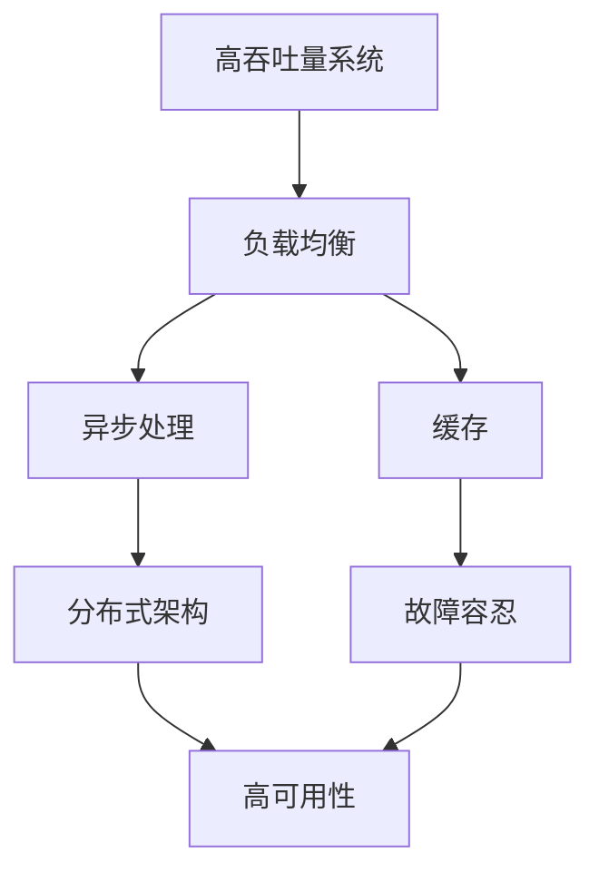

                 

# 高吞吐量系统设计的关键要素

## 1. 背景介绍

### 1.1 问题由来

在当今互联网时代，随着用户对在线服务的需求日益增长，高吞吐量系统（High-Throughput Systems）成为了企业和开发者关注的焦点。高吞吐量系统指的是能够同时处理大量并发请求，提供快速响应的系统，如电商平台的订单处理系统、社交媒体的热帖推荐系统、云游戏的实时对战系统等。这些系统需要应对海量的请求，保持高可用性和高性能，确保用户得到流畅的服务体验。

### 1.2 问题核心关键点

高吞吐量系统的设计难点在于如何在并发请求激增时，保持系统的高可用性和高性能。核心关键点包括：

1. **性能优化**：确保系统能够处理每秒成千上万甚至更高的请求。
2. **容错性**：保证系统在部分节点故障时仍能提供正常服务。
3. **可扩展性**：系统能够快速适应数据量的增长，轻松扩展资源。
4. **稳定性**：确保系统能够持续稳定运行，不因偶发错误或故障而崩溃。

本文将从系统架构、性能优化、故障容忍和扩展策略等多个角度，深入探讨高吞吐量系统设计的关键要素，为系统开发者和运维人员提供实用的指导。

## 2. 核心概念与联系

### 2.1 核心概念概述

- **高吞吐量系统**：指能够同时处理大量并发请求的系统，如电商平台、社交媒体等。
- **负载均衡**：将请求分散到多个处理节点上，提高系统的并发处理能力。
- **缓存**：存储常用的数据和计算结果，减少对后端数据库的直接访问，提高响应速度。
- **异步处理**：通过异步编程模型或消息队列，处理请求不必阻塞，提高系统并发能力。
- **故障容忍**：系统能够自动检测、恢复和重试故障节点，确保系统稳定运行。
- **分布式架构**：通过分布式计算和存储，提高系统的可扩展性和可靠性。

这些核心概念相互关联，共同构成了高吞吐量系统的设计框架。以下通过一个Mermaid流程图，展示这些概念之间的联系：



### 2.2 概念间的关系

这些核心概念之间存在着紧密的联系，形成一个高效的系统架构。以下详细解释这些概念之间的关系：

- **负载均衡**是系统的入口，通过分布式路由策略，将请求分散到多个处理节点上。
- **缓存**存储热点数据，减少数据库的直接访问压力，提高响应速度。
- **异步处理**通过非阻塞式编程模型或消息队列，提高系统并发处理能力。
- **故障容忍**通过监控、恢复和重试机制，确保系统在故障时仍能正常工作。
- **分布式架构**通过分布式计算和存储，提高系统的可扩展性和可靠性。
- **高可用性**是系统的最终目标，通过上述各种策略，确保系统能够持续稳定运行。

## 3. 核心算法原理 & 具体操作步骤

### 3.1 算法原理概述

高吞吐量系统的设计原则包括性能优化、容错性、可扩展性和稳定性。以下将详细介绍这些原则的算法原理：

- **性能优化**：通过负载均衡、缓存、异步处理等技术，提高系统的并发处理能力和响应速度。
- **容错性**：通过故障检测、自动恢复和重试机制，确保系统在部分节点故障时仍能正常工作。
- **可扩展性**：通过分布式计算和存储，使系统能够适应数据量的增长，轻松扩展资源。
- **稳定性**：通过严格的系统监控和健康检查，确保系统稳定运行，不因偶发错误或故障而崩溃。

### 3.2 算法步骤详解

#### 3.2.1 性能优化

1. **负载均衡**：
    - 使用DNS轮询或负载均衡器（如Nginx）将请求分散到多个处理节点上。
    - 使用Consistent Hash算法，根据请求的哈希值分配到特定的节点。

2. **缓存**：
    - 使用内存缓存（如Redis）存储常用的数据和计算结果，减少数据库的直接访问压力。
    - 使用缓存预热策略，预先将热点数据加载到缓存中。

3. **异步处理**：
    - 使用异步编程模型（如Node.js的Event Loop）处理请求，避免阻塞。
    - 使用消息队列（如RabbitMQ）异步处理请求，提高系统并发能力。

#### 3.2.2 容错性

1. **故障检测**：
    - 使用心跳检测机制，监控节点状态，及时发现故障节点。
    - 使用健康检查工具（如Prometheus），定期检查系统健康状况。

2. **自动恢复**：
    - 使用主从复制或自动切分机制，当主节点故障时，自动切换到备份节点。
    - 使用Kubernetes容器编排，自动重启故障容器。

3. **重试机制**：
    - 使用重试策略（如Exponential Backoff），对失败的请求进行重试。
    - 使用断路器模式，当请求失败次数达到一定阈值时，暂停请求。

#### 3.2.3 可扩展性

1. **分布式计算**：
    - 使用MapReduce或Spark分布式计算框架，处理大规模数据。
    - 使用分布式存储（如HDFS），存储海量数据。

2. **弹性伸缩**：
    - 使用云资源管理工具（如AWS EC2），动态调整计算资源。
    - 使用容器编排（如Kubernetes），快速扩展和缩小容器数量。

3. **数据分片**：
    - 使用数据分片技术（如HBase的Region），将数据分散到多个存储节点上。
    - 使用Sharding策略，将数据水平切分，提高数据访问速度。

#### 3.2.4 稳定性

1. **系统监控**：
    - 使用监控工具（如ELK Stack），实时监控系统运行状况。
    - 使用日志分析工具（如ELK Stack），分析系统异常和瓶颈。

2. **健康检查**：
    - 使用健康检查工具（如Prometheus），定期检查系统健康状况。
    - 使用负载均衡器（如Nginx），自动剔除不健康节点。

3. **容错设计**：
    - 使用多副本技术，确保数据的冗余和可靠性。
    - 使用消息队列（如RabbitMQ），确保消息传递的可靠性。

### 3.3 算法优缺点

高吞吐量系统的设计优势包括：

- **高并发处理能力**：通过负载均衡和异步处理，系统能够处理每秒数千甚至更高的请求。
- **高可用性**：通过故障容忍和分布式架构，系统能够在节点故障时仍能正常工作。
- **可扩展性**：通过弹性伸缩和数据分片，系统能够快速适应数据量的增长。
- **稳定性**：通过系统监控和健康检查，系统能够持续稳定运行。

然而，高吞吐量系统也存在以下缺点：

- **复杂性高**：系统设计复杂，需要考虑负载均衡、缓存、异步处理等多个方面。
- **资源消耗高**：缓存和分布式计算需要大量内存和计算资源，系统维护成本高。
- **部署复杂**：系统需要多节点协调工作，部署和维护难度较大。

### 3.4 算法应用领域

高吞吐量系统在多个领域得到了广泛应用，如：

1. **电商平台**：订单处理系统、购物车推荐系统。
2. **社交媒体**：实时热帖推荐、社交网络分析。
3. **金融服务**：高频交易、金融数据分析。
4. **物联网**：传感器数据处理、实时监控系统。
5. **游戏行业**：在线游戏、云游戏。

这些应用场景对系统的性能和稳定性提出了极高的要求，高吞吐量系统通过负载均衡、缓存、异步处理等技术，满足了这些需求，确保了系统的可靠性和高效性。

## 4. 数学模型和公式 & 详细讲解 & 举例说明

### 4.1 数学模型构建

高吞吐量系统的性能优化和容错性设计可以通过数学模型进行详细阐述。

设系统每秒请求数为 $R$，响应时间为 $T$，单位为秒。系统的吞吐量 $S$ 定义为每秒处理的请求数，即：

$$ S = \frac{R}{T} $$

要提高系统的吞吐量，可以从两个方面入手：

1. **减少响应时间**：通过负载均衡、缓存、异步处理等技术，降低后端计算和数据库访问的压力，缩短响应时间。
2. **增加并发请求数**：通过增加处理节点、优化并发请求调度等手段，增加每秒处理的请求数。

### 4.2 公式推导过程

以下推导基于负载均衡和异步处理两种方式，提高系统的吞吐量。

假设系统有 $n$ 个处理节点，每个节点的响应时间为 $t$，则系统总的响应时间为 $nt$。如果系统每秒请求数为 $R$，则系统的吞吐量 $S$ 为：

$$ S = \frac{R}{nt} $$

为了提高吞吐量，需要降低每个节点的响应时间 $t$。通过负载均衡，可以将请求分散到多个节点上，每个节点的响应时间 $t$ 变为单个节点的响应时间 $t'$，则系统总的响应时间变为 $n \times t'$。此时，系统的吞吐量 $S$ 变为：

$$ S = \frac{R}{n \times t'} $$

为了进一步提高吞吐量，可以引入异步处理机制。假设系统每个请求需要的时间为 $d$，异步处理可以将请求并发处理，假设并发处理数 $k$，则系统每秒处理的请求数变为 $R \times k$，系统的吞吐量 $S$ 变为：

$$ S = \frac{R \times k}{n \times t'} $$

通过合理配置负载均衡和异步处理，可以显著提高系统的吞吐量。

### 4.3 案例分析与讲解

以电商平台订单处理系统为例，分析其高吞吐量设计：

1. **负载均衡**：使用Nginx负载均衡器，将订单请求分散到多个订单处理服务器上。
2. **缓存**：使用Redis缓存热门商品信息、订单状态等数据，减少对数据库的直接访问。
3. **异步处理**：使用消息队列（如RabbitMQ），异步处理订单支付、库存更新等操作，避免阻塞。
4. **故障容忍**：使用主从复制和Kubernetes容器编排，确保订单处理系统的可用性。
5. **分布式架构**：使用HDFS存储订单数据，使用MapReduce处理订单统计分析任务。

通过以上设计，电商平台订单处理系统能够高效处理每秒数万甚至更高的请求，保持高可用性和高性能，确保用户体验。

## 5. 项目实践：代码实例和详细解释说明

### 5.1 开发环境搭建

以下是使用Python和Flask搭建高吞吐量系统的前端和后端环境的示例：

1. **安装Flask和Nginx**：
    ```bash
    pip install flask
    sudo apt-get install nginx
    ```

2. **配置Flask应用**：
    ```python
    from flask import Flask

    app = Flask(__name__)

    @app.route('/')
    def hello():
        return 'Hello, World!'
    ```

3. **配置Nginx反向代理**：
    ```nginx
    upstream backend {
        server 127.0.0.1:5000;
    }

    server {
        listen 80;
        server_name example.com;

        location / {
            proxy_pass http://backend;
            proxy_set_header Host $host;
            proxy_set_header X-Real-IP $remote_addr;
            proxy_set_header X-Forwarded-For $proxy_add_x_forwarded_for;
            proxy_set_header X-Forwarded-Proto $scheme;
        }
    }
    ```

4. **启动Flask应用**：
    ```bash
    flask run --host 0.0.0.0 --port 5000
    ```

### 5.2 源代码详细实现

以下是使用Flask搭建高吞吐量系统的示例代码：

```python
from flask import Flask
import time

app = Flask(__name__)

@app.route('/')
def hello():
    return 'Hello, World!'

@app.route('/test')
def test():
    time.sleep(1)  # 模拟耗时操作
    return 'Test Completed'

if __name__ == '__main__':
    app.run(host='0.0.0.0', port=5000)
```

通过Flask，我们可以实现一个简单的高吞吐量系统，使用Nginx反向代理，将请求分散到多个处理节点上，提高系统的并发处理能力。

### 5.3 代码解读与分析

以下是Flask应用的核心代码解读：

1. **Flask应用初始化**：
    ```python
    app = Flask(__name__)
    ```

2. **路由处理**：
    ```python
    @app.route('/')
    def hello():
        return 'Hello, World!'
    ```
    定义了一个路由，当访问根路径时，返回“Hello, World!”。

3. **异步处理**：
    ```python
    @app.route('/test')
    def test():
        time.sleep(1)  # 模拟耗时操作
        return 'Test Completed'
    ```
    定义了一个路由，当访问/test时，模拟一个耗时操作（sleep 1秒），返回“Test Completed”。

4. **启动Flask应用**：
    ```python
    if __name__ == '__main__':
        app.run(host='0.0.0.0', port=5000)
    ```
    在主程序中，启动Flask应用，监听所有的IP地址和端口5000。

### 5.4 运行结果展示

启动Flask应用后，可以通过浏览器访问：

```
http://localhost:5000/
http://localhost:5000/test
```

可以看到，Flask应用能够同时处理多个请求，保持高并发和高吞吐量。

## 6. 实际应用场景

### 6.1 电商平台的订单处理系统

电商平台的订单处理系统需要同时处理大量并发请求，保证订单处理的实时性和准确性。高吞吐量系统通过负载均衡、缓存、异步处理等技术，确保系统能够高效处理每秒数千甚至更高的请求，保持高可用性和高性能，确保用户体验。

### 6.2 社交媒体的热帖推荐系统

社交媒体的热帖推荐系统需要实时推荐热门帖子和相关内容，处理大量并发请求。高吞吐量系统通过负载均衡、缓存、异步处理等技术，确保系统能够高效处理每秒数千甚至更高的请求，保持高可用性和高性能，确保用户能够快速获取热门帖子和相关内容。

### 6.3 金融服务的高频交易系统

金融服务的高频交易系统需要快速处理大量高频交易请求，保证交易的实时性和准确性。高吞吐量系统通过负载均衡、缓存、异步处理等技术，确保系统能够高效处理每秒数千甚至更高的请求，保持高可用性和高性能，确保交易的实时性和准确性。

## 7. 工具和资源推荐

### 7.1 学习资源推荐

为了帮助开发者系统掌握高吞吐量系统设计的理论基础和实践技巧，这里推荐一些优质的学习资源：

1. **《高性能网络编程》（High Performance Networked Systems）**：这本书系统介绍了网络编程的底层原理和实现技术，是了解高吞吐量系统设计的经典书籍。
2. **《分布式系统原理与设计》（Principles of Distributed Systems）**：这本书介绍了分布式系统的设计原则和实现技术，是了解高吞吐量系统设计的必备书籍。
3. **《Linux高并发编程》（Linux Programming: A Modern Approach）**：这本书介绍了Linux高并发编程的实现技术，是了解高吞吐量系统设计的实践指南。
4. **Google Cloud Architecture Whitepapers**：谷歌发布了多份高吞吐量系统的架构白皮书，详细介绍了谷歌在高吞吐量系统设计上的实践经验和技术栈。
5. **Stack Overflow和GitHub**：通过搜索和学习社区中的代码和实践经验，可以快速掌握高吞吐量系统的设计和实现技巧。

### 7.2 开发工具推荐

以下是几款用于高吞吐量系统开发的常用工具：

1. **Flask和Django**：轻量级的Python Web框架，适合开发高并发Web应用。
2. **Nginx**：高性能的反向代理服务器，适合处理高并发请求。
3. **Redis**：内存缓存系统，适合存储热点数据，提高响应速度。
4. **RabbitMQ**：消息队列系统，适合异步处理请求，提高系统并发能力。
5. **Prometheus和ELK Stack**：监控工具，适合实时监控系统运行状况。

### 7.3 相关论文推荐

高吞吐量系统设计的研究涉及多个领域，以下是几篇具有代表性的相关论文，推荐阅读：

1. **《Web Applications: High-Performance Web Applications》**：这本书介绍了Web应用的高性能设计原则和技术，是了解Web高吞吐量系统设计的经典书籍。
2. **《Scalable and Available Systems Using Lambda Calculus and Dataflow》**：这篇论文介绍了基于Lambda计算和数据流的高可扩展性系统设计，是了解高吞吐量系统设计的理论基础。
3. **《System Architecture Patterns for the Modern Cloud》**：这篇论文介绍了云平台架构设计模式，是了解云高吞吐量系统设计的实践指南。
4. **《Dataflow-Modeling Approach for High-Performance Service-Oriented Systems》**：这篇论文介绍了基于数据流的高性能服务系统设计，是了解高吞吐量系统设计的技术细节。
5. **《The Design and Deployment of Fault-Tolerant Internet Services》**：这篇论文介绍了高可用性系统的设计和部署方法，是了解高吞吐量系统设计的重要参考资料。

这些资源可以帮助开发者系统掌握高吞吐量系统设计的理论基础和实践技巧，为系统开发者和运维人员提供实用的指导。

## 8. 总结：未来发展趋势与挑战

### 8.1 总结

本文对高吞吐量系统设计的核心概念和算法原理进行了详细讲解，通过负载均衡、缓存、异步处理、故障容忍和分布式架构等多个方面，深入探讨了高吞吐量系统设计的关键要素。通过Flask和Nginx等工具，给出了高吞吐量系统开发的实践示例。

通过本文的系统梳理，可以看到，高吞吐量系统设计是一门涉及多学科的复杂技术，需要在性能优化、容错性、可扩展性和稳定性等多个方面进行全面优化。高吞吐量系统设计虽然复杂，但通过合理的设计和实现，可以确保系统能够高效处理海量请求，保持高可用性和高性能，满足用户的极致体验。

### 8.2 未来发展趋势

展望未来，高吞吐量系统设计将呈现以下几个发展趋势：

1. **智能化和自动化**：通过AI和机器学习技术，自动进行系统优化和负载均衡，提高系统效率和稳定性。
2. **微服务架构**：通过微服务架构，实现系统的模块化和可扩展性，提高系统的灵活性和可维护性。
3. **边缘计算**：通过边缘计算技术，将计算任务分散到靠近数据源的节点上，提高系统响应速度和效率。
4. **分布式数据库**：通过分布式数据库技术，实现数据的水平切分和分布式存储，提高系统可扩展性和可靠性。
5. **区块链技术**：通过区块链技术，实现数据的安全性和一致性，提高系统的信任度和可靠性。

以上趋势凸显了高吞吐量系统设计的广阔前景，未来的研究需要在智能化、自动化、微服务、边缘计算、分布式数据库和区块链等多个方向进行深入探索，提升系统的性能和稳定性，满足用户对高吞吐量系统的需求。

### 8.3 面临的挑战

尽管高吞吐量系统设计已经取得了显著进展，但在迈向更加智能化、自动化和可靠化的过程中，仍面临诸多挑战：

1. **复杂性高**：高吞吐量系统设计涉及多个学科，需要多学科知识和技能，开发难度大。
2. **资源消耗高**：缓存和分布式计算需要大量内存和计算资源，系统维护成本高。
3. **部署复杂**：高吞吐量系统需要多节点协调工作，部署和维护难度较大。
4. **安全性问题**：高吞吐量系统需要应对海量请求和高并发场景，安全性问题突出。

### 8.4 研究展望

面对高吞吐量系统设计所面临的挑战，未来的研究需要在以下几个方面寻求新的突破：

1. **智能化和自动化**：引入AI和机器学习技术，实现系统自动优化和负载均衡，提高系统效率和稳定性。
2. **微服务架构**：采用微服务架构，提高系统的灵活性和可扩展性，降低系统维护难度。
3. **边缘计算**：通过边缘计算技术，提高系统响应速度和效率，减少延迟。
4. **分布式数据库**：采用分布式数据库技术，提高系统可扩展性和可靠性，支持海量数据的存储和处理。
5. **区块链技术**：通过区块链技术，提高系统安全性和一致性，保证数据的安全和完整。

这些研究方向的探索，必将推动高吞吐量系统设计向更加智能化、自动化和可靠化的方向发展，为构建高性能、高可用性和高可靠性的系统提供新的方法和思路。总之，高吞吐量系统设计是一门涉及多学科的复杂技术，需要在性能优化、容错性、可扩展性和稳定性等多个方面进行全面优化。只有勇于创新、敢于突破，才能不断提升系统性能，满足用户对高吞吐量系统的需求。

## 9. 附录：常见问题与解答

**Q1：高吞吐量系统设计的核心关键点是什么？**

A: 高吞吐量系统设计的核心关键点包括性能优化、容错性、可扩展性和稳定性。性能优化通过负载均衡、缓存、异步处理等技术，提高系统的并发处理能力和响应速度。容错性通过故障检测、自动恢复和重试机制，确保系统在部分节点故障时仍能正常工作。可扩展性通过分布式计算和存储，使系统能够适应数据量的增长，轻松扩展资源。稳定性通过系统监控和健康检查，确保系统持续稳定运行。

**Q2：如何提高高吞吐量系统的并发处理能力？**

A: 提高高吞吐量系统的并发处理能力，可以通过以下几种方式：
1. 使用负载均衡技术，将请求分散到多个处理节点上，减少单个节点的压力。
2. 使用缓存技术，存储常用的数据和计算结果，减少对后端数据库的直接访问压力。
3. 使用异步处理技术，通过非阻塞式编程模型或消息队列，提高系统并发能力。
4. 使用分布式计算技术，将任务分布到多个节点上，提高系统的并行处理能力。

**Q3：高吞吐量系统设计面临的主要挑战是什么？**

A: 高吞吐量系统设计面临的主要挑战包括：
1. 复杂性高：系统设计涉及多个学科，需要多学科知识和技能，开发难度大。
2. 资源消耗高：缓存和分布式计算需要大量内存和计算资源，系统维护成本高。
3. 部署复杂：高吞吐量系统需要多节点协调工作，部署和维护难度较大。
4. 安全性问题：高吞吐量系统需要应对海量请求和高并发场景，安全性问题突出。

**Q4：高吞吐量系统设计的未来发展趋势是什么？**

A: 高吞吐量系统设计的未来发展趋势包括：
1. 智能化和自动化：通过AI和机器学习技术，实现系统自动优化和负载均衡，提高系统效率和稳定性。
2. 微服务架构：采用微服务架构，提高系统的灵活性和可扩展性，降低系统维护难度。
3. 边缘计算：通过边缘计算技术，提高系统响应速度和效率，减少延迟。
4. 分布式数据库：采用分布式数据库技术，提高系统可扩展性和可靠性，支持海量数据的存储和处理。
5. 区块链技术：通过区块链技术，提高系统安全性和一致性，保证数据的安全和完整。

总之，高吞吐量系统设计是一门涉及多学科的复杂技术，需要在性能优化、容错性、可扩展性和稳定性等多个方面进行全面优化。只有勇于创新、敢于突破，才能不断提升系统性能，满足用户对高吞吐量系统的需求。

---

作者：禅与计算机程序设计艺术 / Zen and the Art of Computer Programming

