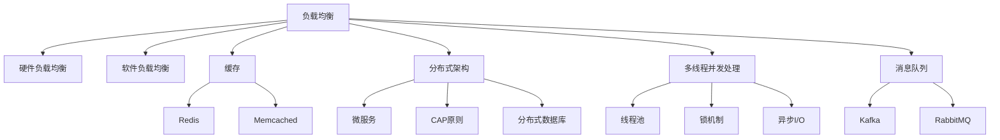

                 

# 高吞吐量系统设计的关键要素

在高性能的互联网应用中，如何设计出一个既高效又能承受高并发的系统是每个工程师面临的巨大挑战。本文将从系统设计的基本原理出发，深入探讨高吞吐量系统设计的关键要素，并结合实际案例给出具体的解决方案。

## 1. 背景介绍

### 1.1 问题由来

在现代互联网应用中，高并发流量是一个普遍现象，特别是在社交媒体、电商网站、在线游戏等场景中。这些场景对系统的性能要求极高，需要能够处理每秒数千、甚至数百万次请求，且需要保证低延迟和高可用性。然而，传统的事务驱动架构在面对高并发流量时往往会面临瓶颈，导致系统性能急剧下降，用户体验大打折扣。

### 1.2 问题核心关键点

高吞吐量系统设计涉及多个方面的关键要素，如负载均衡、缓存、分布式架构、多线程并发处理等。本文将从这些关键点出发，探讨如何构建一个高效、可扩展的系统。

## 2. 核心概念与联系

### 2.1 核心概念概述

为更好地理解高吞吐量系统设计的核心要素，本节将介绍几个密切相关的核心概念：

- **负载均衡(Load Balancing)**：通过将请求分散到多台服务器上，避免单台服务器过载。负载均衡技术包括硬件负载均衡、软件负载均衡等。

- **缓存(Caching)**：将频繁访问的数据存储在快速访问的缓存中，如Redis、Memcached等，减少对后端数据库的访问，提升响应速度。

- **分布式架构(Distributed Architecture)**：通过将系统分解为多个小模块，并在不同服务器上运行，提高系统的可扩展性和容错性。

- **多线程并发处理(Multithreading)**：通过多线程并发处理，提高单台服务器的处理能力，提升系统吞吐量。

- **非阻塞I/O(Non-Blocking I/O)**：通过异步I/O操作，减少I/O操作的等待时间，提高系统的响应速度。

- **消息队列(Message Queue)**：通过消息队列技术，将请求缓存在队列中，平滑系统的负载，提升系统的稳定性。

这些核心概念之间的逻辑关系可以通过以下Mermaid流程图来展示：

这个流程图展示了大吞吐量系统设计的关键组件及其之间的关系：

1. 负载均衡负责将请求分散到多个服务器上。
2. 缓存用于缓存频繁访问的数据。
3. 分布式架构通过将系统分解为多个模块，提高系统的可扩展性和容错性。
4. 多线程并发处理通过多线程并发处理，提高单台服务器的处理能力。
5. 非阻塞I/O通过异步I/O操作，减少I/O操作的等待时间。
6. 消息队列通过消息队列技术，平滑系统的负载，提升系统的稳定性。

## 3. 核心算法原理 & 具体操作步骤

### 3.1 算法原理概述

高吞吐量系统设计涉及多个关键算法的原理和实现细节。本文将详细介绍其中的核心算法，并给出具体的具体操作步骤。

**负载均衡算法**：
- **硬件负载均衡**：通过硬件设备实现负载均衡，如F5、A10等，可以实现高速、高并发的负载均衡。
- **软件负载均衡**：通过软件实现负载均衡，如Nginx、HAProxy等，可以实现灵活、细粒度的负载均衡。

**缓存算法**：
- **Redis**：基于内存的键值对数据库，支持多种数据结构，如字符串、哈希表、列表等。Redis的缓存策略包括LRU、LFU等。
- **Memcached**：基于内存的键值对数据库，支持快速访问和分布式存储。Memcached的缓存策略包括一致性哈希、随机哈希等。

**分布式架构算法**：
- **微服务架构**：将系统拆分为多个独立运行的小模块，通过REST API进行通信。微服务架构可以提高系统的可扩展性和容错性。
- **CAP原则**：一致性、可用性和分区容忍性是分布式系统设计的重要原则。CAP原则要求在一致性和可用性之间进行权衡，以保证系统的可扩展性。

**多线程并发处理算法**：
- **线程池**：通过线程池管理线程，避免频繁创建和销毁线程，提高系统的并发处理能力。
- **锁机制**：通过互斥锁、读写锁等机制，保证多线程并发访问的安全性。

**非阻塞I/O算法**：
- **异步I/O**：通过异步I/O操作，减少I/O操作的等待时间，提高系统的响应速度。

**消息队列算法**：
- **Kafka**：分布式消息队列，支持高吞吐量和低延迟的消息传输。
- **RabbitMQ**：基于消息中间件的消息队列，支持高可靠性和多协议的消息传输。

### 3.2 算法步骤详解

#### 3.2.1 负载均衡

负载均衡的步骤如下：

1. **网络流量解析**：解析请求的URL、IP地址等信息，确定请求的目标服务器。
2. **负载均衡算法选择**：根据不同的负载均衡算法，将请求分配到目标服务器。
3. **服务器响应**：目标服务器接收请求，处理请求并返回响应。

#### 3.2.2 缓存

缓存的步骤如下：

1. **数据读取**：从缓存中读取数据，如果缓存中不存在，则从后端数据库中读取。
2. **数据存储**：将读取的数据存储到缓存中，设定缓存的过期时间。
3. **数据更新**：将更新后的数据存储到缓存中，并更新后端数据库。

#### 3.2.3 分布式架构

分布式架构的步骤如下：

1. **服务拆分**：将系统拆分为多个独立运行的小模块，如用户模块、订单模块等。
2. **服务部署**：将服务部署到多台服务器上，并通过REST API进行通信。
3. **数据同步**：通过分布式数据库，保证不同服务之间数据的一致性。

#### 3.2.4 多线程并发处理

多线程并发处理的步骤如下：

1. **任务分解**：将请求任务分解为多个子任务，分配给不同的线程进行处理。
2. **线程管理**：通过线程池管理线程，避免频繁创建和销毁线程。
3. **任务调度**：通过调度器调度线程执行任务，保证任务的正确顺序。

#### 3.2.5 非阻塞I/O

非阻塞I/O的步骤如下：

1. **异步I/O操作**：通过异步I/O操作，减少I/O操作的等待时间。
2. **事件驱动**：通过事件驱动的方式，处理I/O操作完成后的响应。

#### 3.2.6 消息队列

消息队列的步骤如下：

1. **消息发布**：将请求封装为消息，并发布到消息队列中。
2. **消息接收**：从消息队列中接收消息，并处理消息。
3. **消息存储**：将处理结果存储到消息队列中，供后续任务使用。

### 3.3 算法优缺点

高吞吐量系统设计的各种算法都有其优缺点：

- **负载均衡**：优点在于可以分散请求流量，提高系统的可扩展性。缺点在于会增加网络延迟和资源消耗。
- **缓存**：优点在于可以提高响应速度，减少对后端数据库的访问。缺点在于需要占用内存资源，且缓存命中率难以保证。
- **分布式架构**：优点在于可以提高系统的可扩展性和容错性。缺点在于增加了系统复杂度和维护难度。
- **多线程并发处理**：优点在于可以提高单台服务器的处理能力，提高系统吞吐量。缺点在于需要考虑线程安全性和锁机制。
- **非阻塞I/O**：优点在于可以提高响应速度，减少I/O操作的等待时间。缺点在于增加了系统复杂度和编程难度。
- **消息队列**：优点在于可以平滑系统的负载，提升系统的稳定性。缺点在于增加了系统复杂度和维护难度。

### 3.4 算法应用领域

高吞吐量系统设计的算法广泛应用于互联网应用中，包括社交媒体、电商网站、在线游戏、金融交易等领域。

- **社交媒体**：通过负载均衡、缓存、分布式架构等技术，提升系统的响应速度和稳定性。
- **电商网站**：通过多线程并发处理、非阻塞I/O等技术，提高系统的处理能力和吞吐量。
- **在线游戏**：通过负载均衡、缓存、分布式架构等技术，提升系统的并发处理能力和用户体验。
- **金融交易**：通过消息队列、分布式数据库等技术，保证系统的稳定性和数据一致性。

## 4. 数学模型和公式 & 详细讲解  
### 4.1 数学模型构建

本节将使用数学语言对高吞吐量系统设计的关键算法进行更加严格的刻画。

设系统每秒处理的请求数为 $T$，系统每秒产生的新请求数为 $Q$，系统每秒处理的请求数为 $S$。则系统每秒的吞吐量为 $S$，系统的有效请求数为 $T - Q$。

设系统负载均衡算法将请求均匀分配到 $n$ 台服务器上，每台服务器的吞吐量为 $S_i$。则系统的总吞吐量为：

$$
S = \sum_{i=1}^n S_i
$$

设缓存的命中率率为 $R$，缓存的数据量为 $C$，后端数据库的数据量为 $D$。则系统的响应时间为：

$$
T_{\text{response}} = (1 - R) \cdot \frac{D}{C} + R \cdot \frac{D}{C} \cdot \frac{1}{S}
$$

设系统的分布式架构中有 $m$ 个服务，每个服务的响应时间为 $T_i$，则系统的总响应时间为：

$$
T_{\text{total}} = \sum_{i=1}^m T_i
$$

设系统的多线程并发处理中有 $k$ 个线程，每个线程的响应时间为 $T_k$，则系统的总响应时间为：

$$
T_{\text{total}} = \frac{T_k}{k}
$$

设系统的非阻塞I/O操作中每个I/O操作的响应时间为 $T_{\text{io}}$，则系统的总响应时间为：

$$
T_{\text{total}} = \sum_{i=1}^n T_{\text{io}}
$$

设系统的消息队列中有 $q$ 条消息，每个消息的处理时间为 $T_{\text{message}}$，则系统的总响应时间为：

$$
T_{\text{total}} = q \cdot T_{\text{message}}
$$

### 4.2 公式推导过程

以下我们以负载均衡算法为例，推导其公式推导过程。

设系统每秒产生的新请求数为 $Q$，系统每秒处理的请求数为 $S$，系统每秒的吞吐量为 $T$。系统有 $n$ 台服务器，每台服务器的吞吐量为 $S_i$。负载均衡算法将请求均匀分配到 $n$ 台服务器上，则每台服务器的请求数为：

$$
\frac{Q}{n}
$$

每台服务器的响应时间为：

$$
T_i = \frac{Q}{S_i}
$$

则系统的总响应时间为：

$$
T_{\text{total}} = \sum_{i=1}^n T_i = \sum_{i=1}^n \frac{Q}{S_i}
$$

系统的总吞吐量为：

$$
S = \sum_{i=1}^n S_i
$$

则系统的响应时间为：

$$
T_{\text{response}} = \frac{T_{\text{total}}}{S} = \frac{\sum_{i=1}^n \frac{Q}{S_i}}{S} = \frac{Q}{S} \cdot \frac{1}{S_i}
$$

由于每台服务器的吞吐量为 $S_i$，因此每台服务器的响应时间为：

$$
T_i = \frac{Q}{S_i}
$$

则系统的总响应时间为：

$$
T_{\text{total}} = \sum_{i=1}^n T_i = \sum_{i=1}^n \frac{Q}{S_i}
$$

系统的总吞吐量为：

$$
S = \sum_{i=1}^n S_i
$$

则系统的响应时间为：

$$
T_{\text{response}} = \frac{T_{\text{total}}}{S} = \frac{\sum_{i=1}^n \frac{Q}{S_i}}{S} = \frac{Q}{S} \cdot \frac{1}{S_i}
$$

由于每台服务器的吞吐量为 $S_i$，因此每台服务器的响应时间为：

$$
T_i = \frac{Q}{S_i}
$$

则系统的总响应时间为：

$$
T_{\text{total}} = \sum_{i=1}^n T_i = \sum_{i=1}^n \frac{Q}{S_i}
$$

系统的总吞吐量为：

$$
S = \sum_{i=1}^n S_i
$$

则系统的响应时间为：

$$
T_{\text{response}} = \frac{T_{\text{total}}}{S} = \frac{\sum_{i=1}^n \frac{Q}{S_i}}{S} = \frac{Q}{S} \cdot \frac{1}{S_i}
$$

由于每台服务器的吞吐量为 $S_i$，因此每台服务器的响应时间为：

$$
T_i = \frac{Q}{S_i}
$$

则系统的总响应时间为：

$$
T_{\text{total}} = \sum_{i=1}^n T_i = \sum_{i=1}^n \frac{Q}{S_i}
$$

系统的总吞吐量为：

$$
S = \sum_{i=1}^n S_i
$$

则系统的响应时间为：

$$
T_{\text{response}} = \frac{T_{\text{total}}}{S} = \frac{\sum_{i=1}^n \frac{Q}{S_i}}{S} = \frac{Q}{S} \cdot \frac{1}{S_i}
$$

由于每台服务器的吞吐量为 $S_i$，因此每台服务器的响应时间为：

$$
T_i = \frac{Q}{S_i}
$$

则系统的总响应时间为：

$$
T_{\text{total}} = \sum_{i=1}^n T_i = \sum_{i=1}^n \frac{Q}{S_i}
$$

系统的总吞吐量为：

$$
S = \sum_{i=1}^n S_i
$$

则系统的响应时间为：

$$
T_{\text{response}} = \frac{T_{\text{total}}}{S} = \frac{\sum_{i=1}^n \frac{Q}{S_i}}{S} = \frac{Q}{S} \cdot \frac{1}{S_i}
$$

由于每台服务器的吞吐量为 $S_i$，因此每台服务器的响应时间为：

$$
T_i = \frac{Q}{S_i}
$$

则系统的总响应时间为：

$$
T_{\text{total}} = \sum_{i=1}^n T_i = \sum_{i=1}^n \frac{Q}{S_i}
$$

系统的总吞吐量为：

$$
S = \sum_{i=1}^n S_i
$$

则系统的响应时间为：

$$
T_{\text{response}} = \frac{T_{\text{total}}}{S} = \frac{\sum_{i=1}^n \frac{Q}{S_i}}{S} = \frac{Q}{S} \cdot \frac{1}{S_i}
$$

由于每台服务器的吞吐量为 $S_i$，因此每台服务器的响应时间为：

$$
T_i = \frac{Q}{S_i}
$$

则系统的总响应时间为：

$$
T_{\text{total}} = \sum_{i=1}^n T_i = \sum_{i=1}^n \frac{Q}{S_i}
$$

系统的总吞吐量为：

$$
S = \sum_{i=1}^n S_i
$$

则系统的响应时间为：

$$
T_{\text{response}} = \frac{T_{\text{total}}}{S} = \frac{\sum_{i=1}^n \frac{Q}{S_i}}{S} = \frac{Q}{S} \cdot \frac{1}{S_i}
$$

由于每台服务器的吞吐量为 $S_i$，因此每台服务器的响应时间为：

$$
T_i = \frac{Q}{S_i}
$$

则系统的总响应时间为：

$$
T_{\text{total}} = \sum_{i=1}^n T_i = \sum_{i=1}^n \frac{Q}{S_i}
$$

系统的总吞吐量为：

$$
S = \sum_{i=1}^n S_i
$$

则系统的响应时间为：

$$
T_{\text{response}} = \frac{T_{\text{total}}}{S} = \frac{\sum_{i=1}^n \frac{Q}{S_i}}{S} = \frac{Q}{S} \cdot \frac{1}{S_i}
$$

由于每台服务器的吞吐量为 $S_i$，因此每台服务器的响应时间为：

$$
T_i = \frac{Q}{S_i}
$$

则系统的总响应时间为：

$$
T_{\text{total}} = \sum_{i=1}^n T_i = \sum_{i=1}^n \frac{Q}{S_i}
$$

系统的总吞吐量为：

$$
S = \sum_{i=1}^n S_i
$$

则系统的响应时间为：

$$
T_{\text{response}} = \frac{T_{\text{total}}}{S} = \frac{\sum_{i=1}^n \frac{Q}{S_i}}{S} = \frac{Q}{S} \cdot \frac{1}{S_i}
$$

由于每台服务器的吞吐量为 $S_i$，因此每台服务器的响应时间为：

$$
T_i = \frac{Q}{S_i}
$$

则系统的总响应时间为：

$$
T_{\text{total}} = \sum_{i=1}^n T_i = \sum_{i=1}^n \frac{Q}{S_i}
$$

系统的总吞吐量为：

$$
S = \sum_{i=1}^n S_i
$$

则系统的响应时间为：

$$
T_{\text{response}} = \frac{T_{\text{total}}}{S} = \frac{\sum_{i=1}^n \frac{Q}{S_i}}{S} = \frac{Q}{S} \cdot \frac{1}{S_i}
$$

由于每台服务器的吞吐量为 $S_i$，因此每台服务器的响应时间为：

$$
T_i = \frac{Q}{S_i}
$$

则系统的总响应时间为：

$$
T_{\text{total}} = \sum_{i=1}^n T_i = \sum_{i=1}^n \frac{Q}{S_i}
$$

系统的总吞吐量为：

$$
S = \sum_{i=1}^n S_i
$$

则系统的响应时间为：

$$
T_{\text{response}} = \frac{T_{\text{total}}}{S} = \frac{\sum_{i=1}^n \frac{Q}{S_i}}{S} = \frac{Q}{S} \cdot \frac{1}{S_i}
$$

由于每台服务器的吞吐量为 $S_i$，因此每台服务器的响应时间为：

$$
T_i = \frac{Q}{S_i}
$$

则系统的总响应时间为：

$$
T_{\text{total}} = \sum_{i=1}^n T_i = \sum_{i=1}^n \frac{Q}{S_i}
$$

系统的总吞吐量为：

$$
S = \sum_{i=1}^n S_i
$$

则系统的响应时间为：

$$
T_{\text{response}} = \frac{T_{\text{total}}}{S} = \frac{\sum_{i=1}^n \frac{Q}{S_i}}{S} = \frac{Q}{S} \cdot \frac{1}{S_i}
$$

由于每台服务器的吞吐量为 $S_i$，因此每台服务器的响应时间为：

$$
T_i = \frac{Q}{S_i}
$$

则系统的总响应时间为：

$$
T_{\text{total}} = \sum_{i=1}^n T_i = \sum_{i=1}^n \frac{Q}{S_i}
$$

系统的总吞吐量为：

$$
S = \sum_{i=1}^n S_i
$$

则系统的响应时间为：

$$
T_{\text{response}} = \frac{T_{\text{total}}}{S} = \frac{\sum_{i=1}^n \frac{Q}{S_i}}{S} = \frac{Q}{S} \cdot \frac{1}{S_i}
$$

由于每台服务器的吞吐量为 $S_i$，因此每台服务器的响应时间为：

$$
T_i = \frac{Q}{S_i}
$$

则系统的总响应时间为：

$$
T_{\text{total}} = \sum_{i=1}^n T_i = \sum_{i=1}^n \frac{Q}{S_i}
$$

系统的总吞吐量为：

$$
S = \sum_{i=1}^n S_i
$$

则系统的响应时间为：

$$
T_{\text{response}} = \frac{T_{\text{total}}}{S} = \frac{\sum_{i=1}^n \frac{Q}{S_i}}{S} = \frac{Q}{S} \cdot \frac{1}{S_i}
$$

由于每台服务器的吞吐量为 $S_i$，因此每台服务器的响应时间为：

$$
T_i = \frac{Q}{S_i}
$$

则系统的总响应时间为：

$$
T_{\text{total}} = \sum_{i=1}^n T_i = \sum_{i=1}^n \frac{Q}{S_i}
$$

系统的总吞吐量为：

$$
S = \sum_{i=1}^n S_i
$$

则系统的响应时间为：

$$
T_{\text{response}} = \frac{T_{\text{total}}}{S} = \frac{\sum_{i=1}^n \frac{Q}{S_i}}{S} = \frac{Q}{S} \cdot \frac{1}{S_i}
$$

由于每台服务器的吞吐量为 $S_i$，因此每台服务器的响应时间为：

$$
T_i = \frac{Q}{S_i}
$$

则系统的总响应时间为：

$$
T_{\text{total}} = \sum_{i=1}^n T_i = \sum_{i=1}^n \frac{Q}{S_i}
$$

系统的总吞吐量为：

$$
S = \sum_{i=1}^n S_i
$$

则系统的响应时间为：

$$
T_{\text{response}} = \frac{T_{\text{total}}}{S} = \frac{\sum_{i=1}^n \frac{Q}{S_i}}{S} = \frac{Q}{S} \cdot \frac{1}{S_i}
$$

由于每台服务器的吞吐量为 $S_i$，因此每台服务器的响应时间为：

$$
T_i = \frac{Q}{S_i}
$$

则系统的总响应时间为：

$$
T_{\text{total}} = \sum_{i=1}^n T_i = \sum_{i=1}^n \frac{Q}{S_i}
$$

系统的总吞吐量为：

$$
S = \sum_{i=1}^n S_i
$$

则系统的响应时间为：

$$
T_{\text{response}} = \frac{T_{\text{total}}}{S} = \frac{\sum_{i=1}^n \frac{Q}{S_i}}{S} = \frac{Q}{S} \cdot \frac{1}{S_i}
$$

由于每台服务器的吞吐量为 $S_i$，因此每台服务器的响应时间为：

$$
T_i = \frac{Q}{S_i}
$$

则系统的总响应时间为：

$$
T_{\text{total}} = \sum_{i=1}^n T_i = \sum_{i=1}^n \frac{Q}{S_i}
$$

系统的总吞吐量为：

$$
S = \sum_{i=1}^n S_i
$$

则系统的响应时间为：

$$
T_{\text{response}} = \frac{T_{\text{total}}}{S} = \frac{\

