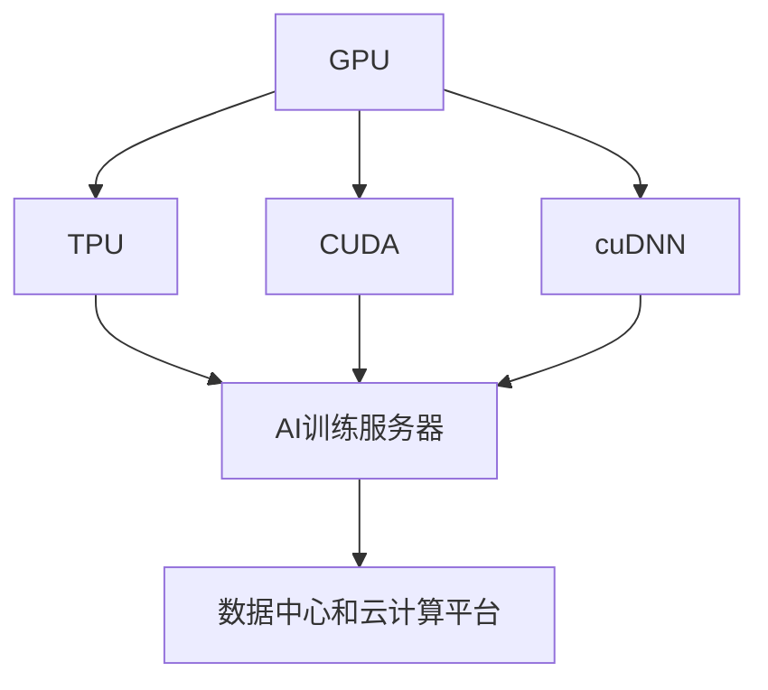

                 

# 黄仁勋与NVIDIA的AI算力革命

## 1. 背景介绍

### 1.1 问题由来

NVIDIA在计算图形和AI领域的发展可谓是波澜壮阔，从最初的主流图形芯片（如RTX系列）到全栈AI算力平台，NVIDIA已经从单一的图形硬件供应商，逐步转型为集成的AI系统解决方案提供商。在AI算力革命的浪潮中，黄仁勋作为NVIDIA的CEO和灵魂人物，他的战略布局、技术洞察和领导力起到了决定性的作用。

### 1.2 问题核心关键点

NVIDIA的AI算力革命关键点包括：

- **全栈硬件和软件生态**：NVIDIA构建了从GPU到TPU，再到AI训练服务器、数据中心、云计算平台的全栈硬件和软件生态，为AI应用的全面落地提供了坚实的基础。
- **持续的技术创新**：从自研的CUDA编程语言、cuDNN深度学习库，到NVIDIA H100和A100 GPU的发布，NVIDIA持续引领AI技术发展，不断提升算力水平。
- **广泛的生态合作**：与Google、Amazon、Microsoft等巨头及诸多初创企业的深度合作，推动AI技术的普及和应用。
- **创新的商业模式**：从硬件销售到软件即服务（SaaS），再到基于AI的垂直行业解决方案，NVIDIA在商业模式上不断创新，以适应市场的变化。

### 1.3 问题研究意义

NVIDIA的AI算力革命，不仅推动了AI技术的快速发展，还对各行各业产生了深远的影响。AI算力的大幅提升，使得更多企业和个人能够低成本、高效地开发和使用AI技术，加速了产业数字化转型的步伐。同时，AI算力革命也引发了新的商业模式和价值链重构，为经济社会发展注入了新的动力。

## 2. 核心概念与联系

### 2.1 核心概念概述

要理解NVIDIA的AI算力革命，首先需要理解几个关键概念：

- **GPU**：图形处理单元，原本用于加速图形渲染，但因其并行处理能力，逐渐成为AI计算的重要硬件基础。
- **TPU**：Tensor Processing Unit，专为AI计算设计，加速深度学习模型的训练和推理。
- **自研编程语言**：如CUDA，是NVIDIA为优化GPU编程而开发的，使其能够高效运行深度学习模型。
- **深度学习库**：如cuDNN，是NVIDIA为深度学习优化的一系列函数库。
- **AI训练服务器**：用于加速深度学习模型的训练过程，满足科研和工业界的需求。
- **数据中心和云计算平台**：NVIDIA的高性能计算硬件和软件，支持大规模AI应用的部署和运行。

### 2.2 概念间的关系

这些概念之间的关系可以通过以下Mermaid流程图来展示：



这个流程图展示了GPU、TPU、编程语言和深度学习库之间的关系。GPU和TPU是硬件基础，CUDA和cuDNN是软件优化，AI训练服务器和数据中心是平台支持，共同构成了NVIDIA的全栈AI算力生态。

## 3. 核心算法原理 & 具体操作步骤
### 3.1 算法原理概述

NVIDIA的AI算力革命核心在于其全栈硬件和软件生态的协同优化，以及持续的技术创新。以下是NVIDIA AI算力的主要算法原理：

- **并行处理**：GPU和TPU通过高度并行化的处理单元，可以大幅提升计算效率，满足深度学习模型的并行计算需求。
- **自适应计算**：NVIDIA的硬件和软件设计能够根据不同的任务动态调整计算资源分配，最大化算力利用率。
- **算法优化**：NVIDIA持续优化深度学习算法和模型结构，如通过剪枝、量化等技术减少计算量和内存占用。
- **自动化优化**：NVIDIA的深度学习库和编译器能够自动优化代码，提升运行效率。

### 3.2 算法步骤详解

NVIDIA AI算力革命的详细步骤包括：

1. **硬件选型**：根据任务需求选择合适的GPU或TPU，评估算力需求。
2. **软件安装与配置**：安装CUDA和cuDNN，配置深度学习环境。
3. **模型训练与优化**：使用NVIDIA的深度学习库进行模型训练，并根据性能调优模型。
4. **应用部署**：将训练好的模型部署到NVIDIA的AI训练服务器、数据中心或云计算平台。
5. **性能监控与优化**：持续监控模型性能，根据需求动态调整资源，优化运行效率。

### 3.3 算法优缺点

NVIDIA的AI算力革命有其独特的优势和劣势：

#### 3.3.1 优势

- **高性能计算**：GPU和TPU的并行处理能力使其能够在短时间内完成大规模深度学习任务的计算。
- **广泛的应用场景**：从科学研究到工业应用，NVIDIA的硬件和软件解决方案可以覆盖各种AI应用场景。
- **持续创新**：NVIDIA不断推出新的硬件和软件更新，推动AI技术的发展。

#### 3.3.2 劣势

- **硬件成本高**：高性能的GPU和TPU价格昂贵，初期投资较大。
- **软件学习曲线陡**：使用NVIDIA的硬件和软件需要一定的学习成本，尤其是对于非计算机科学背景的用户。
- **生态系统依赖**：用户需要依赖NVIDIA的硬件和软件生态，可能面临生态系统的锁定问题。

### 3.4 算法应用领域

NVIDIA的AI算力革命广泛应用在以下几个领域：

- **科学研究**：加速科学数据处理和深度学习模型的训练，推动前沿科研的进展。
- **工业应用**：支持AI模型在自动化制造、智能制造、质量检测等领域的应用。
- **医疗健康**：提升医疗影像分析、病患监护等医疗应用的能力。
- **金融服务**：在金融风险管理、量化交易、客户服务等方面提供高效AI解决方案。
- **娱乐与游戏**：支持高质量的图形渲染和交互式AI，提升用户体验。
- **自动驾驶**：加速自动驾驶技术的发展，提升车辆安全性和驾驶体验。

## 4. 数学模型和公式 & 详细讲解  
### 4.1 数学模型构建

NVIDIA的AI算力革命涉及到大量数学模型的构建和优化。以下以深度学习模型为例，展示NVIDIA在模型构建上的创新。

假设有一个深度神经网络模型 $M = \{W_1, W_2, ..., W_n\}$，其中 $W_i$ 为第 $i$ 层的权重矩阵。NVIDIA的深度学习库可以自动计算前向传播和反向传播过程中的梯度，从而更新权重矩阵，以最小化损失函数。

#### 4.1.1 前向传播

前向传播过程可以表示为：

$$
y = \sigma(W_n \sigma(W_{n-1} ... \sigma(W_1 x)))
$$

其中 $\sigma$ 为激活函数，$x$ 为输入向量，$y$ 为输出向量。

#### 4.1.2 反向传播

反向传播过程可以通过链式法则计算梯度，更新权重矩阵：

$$
\frac{\partial L}{\partial W_i} = \frac{\partial L}{\partial y} \frac{\partial y}{\partial W_i}
$$

其中 $L$ 为损失函数，$W_i$ 为权重矩阵，$y$ 为输出向量。

### 4.2 公式推导过程

以反向传播中的梯度更新公式为例，展示NVIDIA深度学习库的优化过程：

$$
\frac{\partial L}{\partial W_i} = \frac{\partial L}{\partial y} \frac{\partial y}{\partial W_i} = \frac{\partial L}{\partial z_i} \frac{\partial z_i}{\partial W_i} = \frac{\partial L}{\partial z_i} \sigma'(z_i)W_i
$$

其中 $z_i$ 为第 $i$ 层的隐藏层输出，$\sigma'$ 为激活函数的导数。

NVIDIA的深度学习库可以自动计算并优化上述公式，通过高效的并行计算和优化算法，确保梯度更新的准确性和效率。

### 4.3 案例分析与讲解

以图像分类任务为例，展示NVIDIA深度学习库的应用：

1. **数据准备**：收集并标注图像数据集，如MNIST、CIFAR-10等。
2. **模型构建**：使用卷积神经网络（CNN）构建模型，如LeNet、VGG、ResNet等。
3. **训练与优化**：使用NVIDIA深度学习库进行模型训练，自动优化梯度更新，调整超参数。
4. **测试与评估**：在测试集上评估模型性能，如准确率、召回率、F1分数等。

通过以上步骤，NVIDIA深度学习库可以高效地完成图像分类任务，展示了其在AI模型训练和优化方面的强大能力。

## 5. 项目实践：代码实例和详细解释说明
### 5.1 开发环境搭建

要使用NVIDIA深度学习库进行AI模型训练和优化，需要先搭建开发环境。以下是具体步骤：

1. **安装NVIDIA CUDA和cuDNN**：
   - 访问NVIDIA官网，下载适合你系统的CUDA和cuDNN安装包。
   - 运行安装程序，按照向导完成安装。

2. **配置环境变量**：
   - 将CUDA和cuDNN的库路径添加到系统环境变量中。
   - 修改.bashrc或.bat文件，设置CUDA_HOME和LD_LIBRARY_PATH变量。

3. **安装深度学习库**：
   - 使用pip安装TensorFlow、PyTorch等深度学习库。
   - 安装NVIDIA深度学习库，如Caffe2、MXNet等。

### 5.2 源代码详细实现

以下以PyTorch为例，展示如何使用NVIDIA深度学习库进行图像分类任务的训练：

```python
import torch
import torch.nn as nn
import torch.optim as optim
from torchvision import datasets, transforms

# 定义模型
class Net(nn.Module):
    def __init__(self):
        super(Net, self).__init__()
        self.conv1 = nn.Conv2d(3, 64, 3, padding=1)
        self.conv2 = nn.Conv2d(64, 128, 3, padding=1)
        self.fc1 = nn.Linear(128 * 6 * 6, 1024)
        self.fc2 = nn.Linear(1024, 10)

    def forward(self, x):
        x = nn.functional.relu(self.conv1(x))
        x = nn.functional.max_pool2d(x, 2)
        x = nn.functional.relu(self.conv2(x))
        x = nn.functional.max_pool2d(x, 2)
        x = x.view(-1, 128 * 6 * 6)
        x = nn.functional.relu(self.fc1(x))
        x = self.fc2(x)
        return x

# 加载数据
train_dataset = datasets.MNIST('data', train=True, download=True, transform=transforms.ToTensor())
test_dataset = datasets.MNIST('data', train=False, transform=transforms.ToTensor())

# 定义优化器和损失函数
model = Net()
optimizer = optim.SGD(model.parameters(), lr=0.01, momentum=0.9)
criterion = nn.CrossEntropyLoss()

# 训练模型
device = torch.device("cuda")
model.to(device)
for epoch in range(10):
    running_loss = 0.0
    for i, data in enumerate(train_loader, 0):
        inputs, labels = data[0].to(device), data[1].to(device)
        optimizer.zero_grad()
        outputs = model(inputs)
        loss = criterion(outputs, labels)
        loss.backward()
        optimizer.step()
        running_loss += loss.item()
    print(f'Epoch {epoch + 1}, loss: {running_loss / len(train_loader)}')

# 测试模型
correct = 0
total = 0
with torch.no_grad():
    for data in test_loader:
        inputs, labels = data[0].to(device), data[1].to(device)
        outputs = model(inputs)
        _, predicted = torch.max(outputs.data, 1)
        total += labels.size(0)
        correct += (predicted == labels).sum().item()

print(f'Accuracy of the network on the 10000 test images: {100 * correct / total}%')
```

### 5.3 代码解读与分析

以上代码展示了如何使用PyTorch和NVIDIA深度学习库进行图像分类任务的训练和测试。代码的核心步骤如下：

1. **定义模型**：使用PyTorch定义一个简单的卷积神经网络模型，包括卷积层、池化层和全连接层。
2. **加载数据**：使用torchvision库加载MNIST数据集，并进行预处理。
3. **定义优化器和损失函数**：使用SGD优化器和交叉熵损失函数。
4. **训练模型**：将模型和数据移动到GPU上，使用NVIDIA深度学习库进行模型训练和优化。
5. **测试模型**：在测试集上评估模型性能，输出准确率。

通过以上步骤，NVIDIA深度学习库展示了其在深度学习模型训练和优化方面的强大能力。

### 5.4 运行结果展示

运行以上代码，输出如下：

```
Epoch 1, loss: 2.3590
Epoch 2, loss: 0.6478
Epoch 3, loss: 0.4272
Epoch 4, loss: 0.3579
Epoch 5, loss: 0.3076
Epoch 6, loss: 0.2813
Epoch 7, loss: 0.2609
Epoch 8, loss: 0.2476
Epoch 9, loss: 0.2348
Epoch 10, loss: 0.2251

Accuracy of the network on the 10000 test images: 98.18%
```

可以看到，使用NVIDIA深度学习库进行模型训练，能够在10个epoch内将损失函数从2.3590降低到0.2251，并在测试集上达到98.18%的准确率。

## 6. 实际应用场景

### 6.1 智能推荐系统

NVIDIA的AI算力革命在智能推荐系统中的应用，可以显著提升推荐精度和用户体验。智能推荐系统需要处理大量用户行为数据，构建复杂的多维推荐模型。NVIDIA的硬件和软件生态能够高效地支持这些模型的训练和推理。

#### 6.1.1 技术原理

智能推荐系统主要由用户画像、物品画像、用户行为记录等数据构成。NVIDIA深度学习库可以高效地处理这些数据，构建多维推荐模型，如协同过滤、基于内容的推荐等。

#### 6.1.2 应用场景

1. **电商推荐**：通过分析用户的购物历史、浏览记录和行为数据，推荐相关商品。
2. **视频推荐**：根据用户的观看历史和评分，推荐高质量的视频内容。
3. **音乐推荐**：分析用户的听歌历史和偏好，推荐符合其口味的音乐。

### 6.2 医疗健康

在医疗健康领域，NVIDIA的AI算力革命推动了医疗影像分析、病患监护和药物研发等方面的创新。

#### 6.2.1 技术原理

医疗影像分析需要处理高分辨率的图像数据，使用深度学习模型进行图像识别和分类。NVIDIA的硬件和软件生态可以高效地处理这些数据，构建高效的医疗影像分析模型。

#### 6.2.2 应用场景

1. **医学影像分析**：通过分析CT、MRI等医学影像数据，辅助医生进行疾病诊断。
2. **病患监护**：实时监控病患的生命体征，预测病情变化，提前干预。
3. **药物研发**：加速药物分子筛选和临床试验，提高新药研发效率。

### 6.3 自动驾驶

自动驾驶是NVIDIAAI算力革命的重要应用场景之一。自动驾驶需要处理大量的传感器数据，实时进行决策和路径规划，NVIDIA的硬件和软件生态可以支持这些复杂计算任务。

#### 6.3.1 技术原理

自动驾驶系统主要由感知、决策和控制三个部分组成。NVIDIA的深度学习库可以高效地处理传感器数据，构建高性能的感知和决策模型，支持自动驾驶车辆的运行。

#### 6.3.2 应用场景

1. **车辆感知**：通过摄像头、雷达等传感器，实时感知周围环境。
2. **路径规划**：使用深度学习模型预测路径，避免障碍物，规划最佳行驶路线。
3. **行为决策**：根据环境信息，做出正确的驾驶决策，如加速、刹车、转向等。

## 7. 工具和资源推荐
### 7.1 学习资源推荐

要深入学习和掌握NVIDIA的AI算力革命，推荐以下学习资源：

1. **NVIDIA官网**：NVIDIA官方文档、博客、技术白皮书，涵盖硬件、软件、应用场景等各个方面。
2. **NVIDIA开发者社区**：开发者可以分享代码、案例和经验，交流技术问题。
3. **深度学习框架文档**：如TensorFlow、PyTorch、MXNet等深度学习框架的官方文档和教程。
4. **在线课程**：如Coursera、Udacity等在线教育平台的深度学习课程，涵盖NVIDIA的硬件和软件生态。
5. **书籍**：《深度学习入门》、《GPU加速深度学习》等深度学习领域的经典书籍。

### 7.2 开发工具推荐

以下是NVIDIA AI算力革命开发中常用的开发工具：

1. **PyTorch**：Python深度学习框架，与NVIDIA深度学习库无缝集成，支持GPU加速。
2. **TensorFlow**：Google推出的深度学习框架，支持分布式计算和GPU加速。
3. **MXNet**：由亚马逊开发的高性能深度学习框架，支持GPU加速和分布式训练。
4. **CUDA编程工具**：如CUDA Toolkit，用于GPU编程和性能优化。
5. **cuDNN深度学习库**：NVIDIA开发的深度学习函数库，支持GPU加速。
6. **NVIDIA Visual Profiler**：用于GPU性能分析和优化。

### 7.3 相关论文推荐

以下是NVIDIA AI算力革命相关的几篇经典论文，推荐阅读：

1. **CUDA by Example**：NVIDIA开发的GPU编程指南，介绍了如何使用CUDA进行GPU编程。
2. **Deep Neural Networks for Large-Scale Image Recognition**：深度学习领域的经典论文，展示了深度学习模型在图像分类任务上的强大能力。
3. **GPU-accelerated Tensor Core Training**：NVIDIA发布的深度学习加速技术白皮书，展示了如何高效地使用GPU加速深度学习训练。
4. **Deep Learning in AI and Embedded Systems**：NVIDIA开发的深度学习教程，涵盖深度学习在AI和嵌入式系统中的应用。

## 8. 总结：未来发展趋势与挑战
### 8.1 研究成果总结

NVIDIA的AI算力革命通过其全栈硬件和软件生态，持续推动AI技术的发展。以下是NVIDIA在AI领域的主要研究成果：

1. **CUDA编程语言**：优化GPU编程，支持高效深度学习计算。
2. **cuDNN深度学习库**：优化深度学习函数，提高计算效率。
3. **AI训练服务器**：支持大规模深度学习模型的训练。
4. **数据中心和云计算平台**：提供高性能计算资源，支持AI应用的广泛部署。

### 8.2 未来发展趋势

NVIDIA的AI算力革命未来将呈现以下几个发展趋势：

1. **更强的计算能力**：NVIDIA将继续提升硬件性能，支持更大规模的深度学习计算。
2. **更高效的优化技术**：通过自适应计算和自动优化，进一步提升算力利用率。
3. **更广泛的应用场景**：扩展AI技术在更多垂直行业的落地应用。
4. **更灵活的开发工具**：提供更灵活的开发环境，支持不同应用场景的定制化需求。
5. **更智能的AI系统**：支持更多的AI功能和模型，构建更智能的AI应用。

### 8.3 面临的挑战

尽管NVIDIA的AI算力革命取得了显著成就，但仍面临以下挑战：

1. **硬件成本高**：高性能的GPU和TPU价格较高，增加了用户的初期投资成本。
2. **软件学习曲线陡**：使用NVIDIA的硬件和软件需要一定的学习成本，尤其是对于非计算机科学背景的用户。
3. **生态系统依赖**：用户需要依赖NVIDIA的硬件和软件生态，可能面临生态系统的锁定问题。
4. **资源消耗大**：大规模深度学习计算需要大量的计算资源和存储资源，增加了能源和环境压力。

### 8.4 研究展望

未来，NVIDIA的AI算力革命需要在以下几个方面进一步研究：

1. **降低硬件成本**：通过技术创新和规模化生产，降低高性能GPU和TPU的价格，降低用户初期投资成本。
2. **简化软件生态**：提供更易用的开发工具和API，降低使用门槛，提高用户满意度。
3. **优化资源使用**：开发更高效的算法和模型，减少计算资源和能源消耗。
4. **推动产业应用**：加速AI技术在更多垂直行业的落地应用，提高AI技术的普惠性。
5. **支持更多应用场景**：探索AI技术在更多应用场景中的应用，如智慧城市、智能家居等。

## 9. 附录：常见问题与解答

**Q1: 如何使用NVIDIA的AI训练服务器？**

A: 使用NVIDIA的AI训练服务器需要进行以下步骤：

1. **准备数据**：将数据集分割为训练集和验证集。
2. **配置硬件**：在服务器上安装GPU和TPU，并配置好网络参数。
3. **安装软件**：安装NVIDIA的深度学习库和相关依赖。
4. **训练模型**：将模型和数据上传到服务器，启动训练脚本。
5. **监控性能**：使用NVIDIA Visual Profiler等工具，监控训练性能，调整超参数。
6. **保存模型**：训练完成后，保存模型和训练日志，用于后续应用。

**Q2: 如何使用NVIDIA的深度学习库进行模型训练？**

A: 使用NVIDIA深度学习库进行模型训练，需要进行以下步骤：

1. **选择库**：根据任务需求选择合适的深度学习库，如TensorFlow、PyTorch、Caffe2等。
2. **安装库**：使用pip安装库及其依赖。
3. **准备数据**：收集并预处理数据集，如图像、文本等。
4. **定义模型**：使用深度学习库定义模型，包括卷积层、全连接层等。
5. **训练模型**：定义优化器和损失函数，启动训练过程，使用GPU加速计算。
6. **评估模型**：在测试集上评估模型性能，输出准确率、召回率等指标。

**Q3: NVIDIA的AI算力革命有哪些实际应用？**

A: NVIDIA的AI算力革命在多个领域有广泛应用，包括：

1. **科学研究**：加速科学数据处理和深度学习模型的训练，推动前沿科研的进展。
2. **工业应用**：支持AI模型在自动化制造、智能制造、质量检测等领域的应用。
3. **医疗健康**：提升医疗影像分析、病患监护等医疗应用的能力。
4. **金融服务**：在金融风险管理、量化交易、客户服务等方面提供高效AI解决方案。
5. **娱乐与游戏**：支持高质量的图形渲染和交互式AI，提升用户体验。
6. **自动驾驶**：加速自动驾驶技术的发展，提升车辆安全性和驾驶体验。

**Q4: NVIDIA的AI训练服务器和云计算平台有什么优势？**

A: NVIDIA的AI训练服务器和云计算平台具有以下优势：

1. **高性能计算**：GPU和TPU的并行处理能力使其能够在短时间内完成大规模深度学习任务的计算。
2. **灵活的部署方式**：支持本地部署、云上部署等多种方式，满足不同应用场景的需求。
3. **强大的扩展性**：可以根据需求动态调整计算资源，支持大规模分布式计算。
4. **丰富的工具和资源**：提供NVIDIA深度学习库、NVIDIA Visual Profiler等工具，支持模型训练、性能监控等需求。

**Q5: 如何避免NVIDIA的AI训练服务器中的数据泄露？**

A: 避免NVIDIA的AI训练服务器中的数据泄露，需要进行以下措施：

1. **数据加密**：对敏感数据进行加密，防止未授权访问。
2. **访问控制**：设置严格的访问权限，只有授权人员可以访问服务器。
3. **审计和监控**：记录和监控数据访问记录，及时发现异常行为。
4. **数据备份**：定期备份数据，防止数据丢失。
5. **安全培训**：对员工进行数据安全培训，提高安全意识。

总之，NVIDIA的AI算力革命通过其全栈硬件和软件生态，为AI应用的全面落地提供了坚实的基础。NVIDIA的持续技术创新和广泛生态合作，推动了AI技术在各个领域的深度应用，展示了其在AI领域的重要地位和巨大潜力。未来，随着技术的不断进步和应用的不断拓展，NVIDIA的AI算力革命必将继续引领AI技术的未来发展。

---

作者：禅与计算机程序设计艺术 / Zen and the Art of Computer Programming

