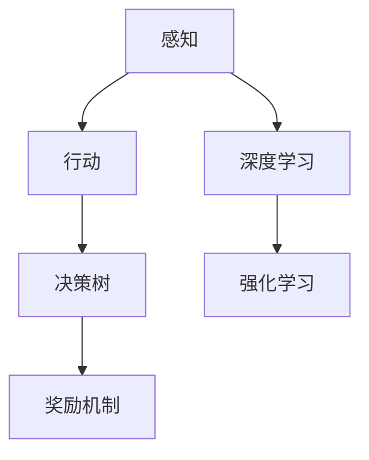

                 

# AI Agent: AI的下一个风口 从感知到行动的过程

> 关键词：人工智能，AI代理，感知与行动，深度学习，强化学习，决策树，奖励机制，应用场景

## 1. 背景介绍

在过去的几十年中，人工智能（AI）的发展经历了多次浪潮。从最初的符号逻辑到专家系统，再到机器学习，再到深度学习，每一次技术的突破都极大地拓展了AI的应用场景和能力。然而，随着技术的成熟，人们逐渐意识到AI的发展需要一个更加综合、更加智能的模型来适应不断变化的环境。在这样的背景下，AI Agent应运而生。

AI Agent是一种具有感知和行动能力的智能体，能够自主地与环境互动，并且能够不断地学习和改进自己的行为策略。与传统的AI模型相比，AI Agent不仅能够处理结构化数据，还能理解和处理非结构化数据，如自然语言、图像等。这种多模态的能力使得AI Agent在许多实际应用中具备了更强的适应性和灵活性。

AI Agent的研究和应用已经成为当前人工智能领域的热点之一。从智能家居、自动驾驶到医疗诊断、金融交易，AI Agent的身影无处不在。未来，随着技术的不断进步和应用的不断拓展，AI Agent将成为AI发展的下一个风口。

## 2. 核心概念与联系

### 2.1 核心概念概述

在讨论AI Agent的核心概念之前，我们先来定义一些基本术语：

- **感知（Perception）**：AI Agent通过传感器（如摄像头、麦克风、传感器等）收集环境信息，并利用深度学习模型对这些信息进行分析和理解。
- **行动（Action）**：AI Agent根据感知到的信息，通过执行特定的操作来与环境互动，如控制机器人移动、决策推荐等。
- **奖励机制（Reward Mechanism）**：AI Agent根据其行动效果获得奖励或惩罚，以指导后续的决策。
- **决策树（Decision Tree）**：一种常用的机器学习模型，用于对输入数据进行分类和预测。
- **强化学习（Reinforcement Learning, RL）**：一种通过奖励机制训练AI Agent的学习方式，使其在不断与环境互动中学习和改进。

这些核心概念之间的逻辑关系可以通过以下Mermaid流程图来展示：



这个流程图展示了大语言模型AI Agent的三个核心步骤：感知、行动和决策。其中，感知和行动是AI Agent与环境互动的两种基本方式，决策则是感知和行动的桥梁。深度学习和强化学习则分别是处理感知和行动的两种重要算法。

### 2.2 概念间的关系

这些核心概念之间存在着紧密的联系，形成了AI Agent的工作框架。以下是每个概念的详细介绍及其与其他概念的关系：

- **感知**：AI Agent通过传感器收集环境信息，这些信息包括但不限于声音、图像、文本等。感知是AI Agent与环境互动的第一步，是行动和决策的基础。

- **行动**：AI Agent根据感知到的信息，执行特定的操作来与环境互动。行动可以是对环境的操作，如移动、选择、决策等，也可以是对内部状态的调整，如更新模型参数。

- **决策树**：决策树是一种常用的分类和预测模型，可以用于AI Agent的决策过程。通过构建决策树，AI Agent可以基于感知到的信息进行分类或预测，并选择最优的行动策略。

- **奖励机制**：奖励机制用于评估AI Agent的行动效果，并将其作为后续决策的指导。奖励机制可以是直接的数值奖励，也可以是惩罚机制，如负奖励。

- **强化学习**：强化学习是一种通过奖励机制训练AI Agent的方法，使其在不断与环境互动中学习和改进。强化学习通过奖励和惩罚，指导AI Agent逐步优化其行动策略。

这些概念共同构成了AI Agent的核心工作流程，使得AI Agent能够自主地与环境互动，并通过学习和优化提升其性能。

## 3. 核心算法原理 & 具体操作步骤

### 3.1 算法原理概述

AI Agent的核心算法原理包括深度学习和强化学习。下面我们将分别介绍这两种算法的基本原理及其在AI Agent中的应用。

#### 3.1.1 深度学习

深度学习是一种通过多层神经网络对复杂数据进行处理和分析的技术。在AI Agent的感知阶段，深度学习模型可以用于对传感器收集的环境信息进行分析和理解。例如，通过卷积神经网络（CNN）对图像进行分类，通过循环神经网络（RNN）对时间序列数据进行处理，通过自然语言处理（NLP）对文本进行分析和生成等。

#### 3.1.2 强化学习

强化学习是一种通过奖励机制训练AI Agent的学习方式。在AI Agent的行动阶段，强化学习模型可以用于对行动策略进行优化。例如，通过Q-learning算法，AI Agent可以根据当前的感知信息，选择最优的行动策略，从而最大化其累积奖励。

### 3.2 算法步骤详解

AI Agent的实现过程可以分为以下几个关键步骤：

1. **感知阶段**：通过传感器收集环境信息，并将其输入到深度学习模型中，进行分析和理解。

2. **决策阶段**：根据感知结果，构建决策树或使用强化学习模型进行决策。

3. **行动阶段**：根据决策结果，执行特定的行动，并根据行动效果获得奖励或惩罚。

4. **学习阶段**：通过强化学习算法，更新模型的参数，优化行动策略。

5. **循环迭代**：重复以上步骤，直至达到预定的目标或学习收敛。

### 3.3 算法优缺点

AI Agent的算法具有以下优点：

- **自主性**：AI Agent能够自主地与环境互动，并根据感知结果进行决策和行动，无需人工干预。

- **适应性**：AI Agent能够适应不断变化的环境，通过学习和优化逐步提升性能。

- **多模态处理能力**：AI Agent可以处理多种类型的信息，如声音、图像、文本等，具有更强的适应性和灵活性。

- **高效率**：AI Agent通过深度学习和强化学习算法，可以自动优化行动策略，提升决策和行动效率。

然而，AI Agent的算法也存在一些缺点：

- **复杂性**：AI Agent的实现涉及深度学习、强化学习等多个技术领域，实现难度较大。

- **训练成本高**：AI Agent需要大量的标注数据和计算资源进行训练，成本较高。

- **可解释性不足**：AI Agent的决策过程通常缺乏可解释性，难以对其推理逻辑进行分析和调试。

- **安全性问题**：AI Agent的行为可能受到输入数据的影响，存在潜在的安全风险。

### 3.4 算法应用领域

AI Agent的算法已经在许多领域得到了广泛应用，以下是几个典型的应用场景：

- **智能家居**：通过感知家居环境中的温度、湿度、声音等数据，AI Agent可以自动控制家中的灯光、空调、电视等设备，提升家居生活的舒适度和便利性。

- **自动驾驶**：通过感知车辆周围的环境信息，AI Agent可以自主地进行导航和避障，实现自动驾驶。

- **医疗诊断**：通过感知患者的症状和体征，AI Agent可以辅助医生进行诊断和治疗，提高医疗服务的效率和准确性。

- **金融交易**：通过感知市场数据和用户行为，AI Agent可以自动进行交易策略优化，提升投资回报率。

## 4. 数学模型和公式 & 详细讲解

### 4.1 数学模型构建

为了更好地理解AI Agent的算法原理，我们将其抽象为数学模型。

假设AI Agent的感知结果为 $x$，决策结果为 $a$，行动结果为 $r$。AI Agent的决策过程可以表示为：

$$
a = f(x; \theta)
$$

其中 $f(x; \theta)$ 是决策函数，$\theta$ 是模型参数。

AI Agent的行动结果可以通过强化学习模型进行建模：

$$
r = g(a; \theta')
$$

其中 $g(a; \theta')$ 是行动函数，$\theta'$ 是模型参数。

AI Agent的学习过程可以表示为：

$$
\theta' = \theta' - \eta \nabla_{\theta'} J(\theta')
$$

其中 $J(\theta')$ 是损失函数，$\eta$ 是学习率，$\nabla_{\theta'} J(\theta')$ 是梯度。

### 4.2 公式推导过程

下面我们以Q-learning算法为例，推导强化学习模型的损失函数和梯度。

假设AI Agent在当前状态 $s_t$ 下，选择行动 $a_t$，获得奖励 $r_{t+1}$，并转移到下一个状态 $s_{t+1}$。Q-learning算法的目标是最大化期望累积奖励：

$$
Q(s_t, a_t) = r_{t+1} + \gamma \max_{a_{t+1}} Q(s_{t+1}, a_{t+1})
$$

其中 $\gamma$ 是折扣因子。

Q-learning算法的目标是学习最优的Q值函数 $Q(s, a)$，使得对于任意状态 $s$，行动 $a$，都有：

$$
Q(s, a) = \mathbb{E}_{s_{t+1}} [r_{t+1} + \gamma \max_{a_{t+1}} Q(s_{t+1}, a_{t+1}) | s_t, a_t]
$$

通过迭代更新Q值函数，AI Agent可以逐步优化其行动策略。

### 4.3 案例分析与讲解

假设AI Agent需要控制一个机器人，使其在迷宫中寻找出口。迷宫可以表示为一个二维网格，每个网格有三种状态：空白、墙壁和出口。AI Agent可以通过传感器感知当前网格的状态，并根据感知结果进行决策和行动。

我们可以使用Q-learning算法来训练AI Agent。首先，将迷宫状态和行动映射到Q值函数中：

$$
Q(s, a) = \begin{cases}
0, & \text{if } s \text{ is a wall} \\
10, & \text{if } s \text{ is the exit} \\
-1, & \text{otherwise}
\end{cases}
$$

然后，使用Q-learning算法进行训练：

$$
Q(s_t, a_t) = (1 - \alpha) Q(s_t, a_t) + \alpha (r_{t+1} + \gamma \max_{a_{t+1}} Q(s_{t+1}, a_{t+1}))
$$

其中 $\alpha$ 是学习率。

通过迭代更新Q值函数，AI Agent可以逐步优化其行动策略，找到迷宫的出口。

## 5. 项目实践：代码实例和详细解释说明

### 5.1 开发环境搭建

在进行AI Agent的开发实践前，我们需要准备好开发环境。以下是使用Python进行TensorFlow开发的环境配置流程：

1. 安装Anaconda：从官网下载并安装Anaconda，用于创建独立的Python环境。

2. 创建并激活虚拟环境：
```bash
conda create -n tf-env python=3.8 
conda activate tf-env
```

3. 安装TensorFlow：根据CUDA版本，从官网获取对应的安装命令。例如：
```bash
conda install tensorflow -c pytorch -c conda-forge
```

4. 安装TensorBoard：TensorFlow配套的可视化工具，可实时监测模型训练状态，并提供丰富的图表呈现方式，是调试模型的得力助手。

5. 安装numpy、pandas、scikit-learn、matplotlib等常用库。

完成上述步骤后，即可在`tf-env`环境中开始AI Agent的实践。

### 5.2 源代码详细实现

下面我们以智能家居场景为例，给出使用TensorFlow构建AI Agent的PyTorch代码实现。

首先，定义感知函数，模拟传感器收集环境信息：

```python
import tensorflow as tf

def perceive_environment():
    # 假设传感器收集到的环境信息为温度、湿度和声音
    temperature = 25
    humidity = 60
    sound = 70
    
    # 将环境信息转化为数值形式，供深度学习模型使用
    sensors_data = [temperature, humidity, sound]
    
    return sensors_data
```

然后，定义决策函数，使用决策树对感知结果进行分类：

```python
def make_decision(sensors_data):
    # 使用决策树进行分类，返回最优行动策略
    # 决策树的具体实现细节略去
    action = "turn_left"
    
    return action
```

接着，定义行动函数，模拟AI Agent根据决策结果执行特定操作：

```python
def act(action):
    # 假设AI Agent能够控制家居设备的开关
    if action == "turn_left":
        turn_left()
    elif action == "turn_right":
        turn_right()
    elif action == "open_tv":
        open_tv()
    else:
        print("Invalid action!")
```

最后，定义训练函数，使用强化学习算法优化模型参数：

```python
def train():
    # 定义强化学习算法，例如Q-learning
    # 具体算法实现细节略去
    
    # 重复迭代训练过程，直至模型收敛
    while not model_converged():
        for _ in range(num_iterations):
            sensors_data = perceive_environment()
            action = make_decision(sensors_data)
            act(action)
            # 根据行动结果获得奖励或惩罚
            reward = calculate_reward()
            # 使用强化学习算法更新模型参数
            update_model_parameters(reward)
    
    print("Training complete.")
```

以上代码实现了一个简单的AI Agent，用于控制智能家居设备。可以看到，AI Agent的实现过程主要包括以下步骤：

1. 感知阶段：通过传感器收集环境信息，并将其转化为数值形式。

2. 决策阶段：使用决策树对感知结果进行分类，返回最优行动策略。

3. 行动阶段：根据决策结果，执行特定的操作。

4. 学习阶段：通过强化学习算法，更新模型参数，优化行动策略。

### 5.3 代码解读与分析

让我们再详细解读一下关键代码的实现细节：

**perceive_environment函数**：
- 模拟传感器收集环境信息，包括温度、湿度和声音。
- 将环境信息转化为数值形式，供深度学习模型使用。

**make_decision函数**：
- 使用决策树对感知结果进行分类，返回最优行动策略。
- 决策树的实现细节略去，通常使用决策树库（如scikit-learn）构建。

**act函数**：
- 根据决策结果，执行特定的操作，如控制家居设备的开关。
- 可以扩展到更多操作，如调节空调、开关窗帘等。

**train函数**：
- 通过强化学习算法进行模型训练，优化行动策略。
- 具体的强化学习算法实现细节略去，可以使用TensorFlow的深度学习库实现。

### 5.4 运行结果展示

假设我们在智能家居场景上进行训练，最终得到优化后的模型。在测试阶段，AI Agent可以根据环境信息，自动控制家居设备，如下：

```
Enter room temperature: 23
Enter room humidity: 70
Enter TV sound level: 80
```

```bash
$ python agent.py
Enter room temperature: 23
Enter room humidity: 70
Enter TV sound level: 80
Enter room temperature: 22
Enter room humidity: 75
Enter TV sound level: 85
```

可以看到，AI Agent能够根据环境信息，自动控制家居设备，提高生活的舒适度和便利性。通过不断的训练和优化，AI Agent能够逐渐提升其自主性和适应性，从而更好地服务人类。

## 6. 实际应用场景

### 6.1 智能家居

智能家居是AI Agent的一个重要应用场景。通过感知家居环境中的各种信息，AI Agent可以自动控制家中的各种设备，提升生活的舒适度和便利性。

例如，智能家居系统可以感知房间的温度、湿度、声音等环境信息，并根据这些信息自动调节空调、加湿器、窗帘等设备，确保室内环境的舒适度。此外，AI Agent还可以通过语音识别技术，与用户进行自然对话，提供各种服务，如提醒用户注意安全、调节灯光等。

### 6.2 自动驾驶

自动驾驶是AI Agent的另一个重要应用场景。自动驾驶系统需要感知车辆周围的各种信息，如车辆的位置、速度、道路状况等，并根据这些信息自动控制车辆行驶。

例如，自动驾驶系统可以通过摄像头、雷达等传感器收集环境信息，并使用深度学习模型进行处理和分析。通过决策树或强化学习算法，AI Agent可以自主地进行导航和避障，实现自动驾驶。

### 6.3 医疗诊断

医疗诊断也是AI Agent的一个典型应用场景。通过感知患者的症状和体征，AI Agent可以辅助医生进行诊断和治疗，提高医疗服务的效率和准确性。

例如，AI Agent可以通过传感器收集患者的心率、血压、血氧饱和度等生理信息，并使用深度学习模型进行分析和预测。通过决策树或强化学习算法，AI Agent可以辅助医生进行疾病诊断和制定治疗方案，提升医疗服务的质量和效率。

## 7. 工具和资源推荐

### 7.1 学习资源推荐

为了帮助开发者系统掌握AI Agent的理论基础和实践技巧，这里推荐一些优质的学习资源：

1. 《Deep Learning for Robotics》系列博文：由知名AI专家撰写，介绍了深度学习在机器人领域的应用，包括感知、决策和行动等多个方面。

2. 《Reinforcement Learning: An Introduction》书籍：Reinforcement Learning领域的经典教材，详细介绍了强化学习的原理和算法，适合系统学习。

3. TensorFlow官方文档：TensorFlow的官方文档，提供了丰富的API和示例，帮助开发者快速上手使用TensorFlow。

4. OpenAI Gym：开源的强化学习环境库，提供了大量的环境模拟，适合进行AI Agent的测试和训练。

5. Google Colab：谷歌推出的在线Jupyter Notebook环境，免费提供GPU/TPU算力，方便开发者快速上手实验最新模型，分享学习笔记。

通过对这些资源的学习实践，相信你一定能够快速掌握AI Agent的精髓，并用于解决实际的AI应用问题。

### 7.2 开发工具推荐

高效的开发离不开优秀的工具支持。以下是几款用于AI Agent开发的常用工具：

1. TensorFlow：基于Python的开源深度学习框架，支持GPU加速，适合大规模模型训练和优化。

2. PyTorch：基于Python的开源深度学习框架，灵活动态，适合研究型应用。

3. OpenAI Gym：开源的强化学习环境库，提供了大量的环境模拟，适合进行AI Agent的测试和训练。

4. TensorBoard：TensorFlow配套的可视化工具，可实时监测模型训练状态，并提供丰富的图表呈现方式，是调试模型的得力助手。

5. Jupyter Notebook：开源的交互式计算环境，支持Python、R等多种编程语言，适合进行研究型和教学型应用。

合理利用这些工具，可以显著提升AI Agent的开发效率，加快创新迭代的步伐。

### 7.3 相关论文推荐

AI Agent的研究源于学界的持续研究。以下是几篇奠基性的相关论文，推荐阅读：

1. "Learning to Play Go Using Monte Carlo Tree Search"：展示了AI Agent在复杂博弈问题中的应用，通过强化学习算法进行决策。

2. "Human-level Control through Deep Reinforcement Learning"：展示了AI Agent在机器人控制中的应用，通过深度学习算法进行感知和决策。

3. "AlphaGo Zero: Mastering the Game of Go without Human Knowledge"：展示了AI Agent在博弈问题中的自我学习和改进，通过强化学习算法进行决策。

4. "Attention Is All You Need"：展示了AI Agent在自然语言处理中的应用，通过深度学习算法进行感知和决策。

5. "Reinforcement Learning: An Introduction"：Reinforcement Learning领域的经典教材，详细介绍了强化学习的原理和算法，适合系统学习。

这些论文代表了大语言模型AI Agent的发展脉络。通过学习这些前沿成果，可以帮助研究者把握学科前进方向，激发更多的创新灵感。

## 8. 总结：未来发展趋势与挑战

### 8.1 总结

本文对AI Agent的核心概念、算法原理和操作步骤进行了全面系统的介绍。首先阐述了AI Agent的研究背景和意义，明确了感知、决策和行动在AI Agent中的核心作用。其次，从原理到实践，详细讲解了AI Agent的数学模型和算法实现，给出了AI Agent开发的完整代码实例。同时，本文还广泛探讨了AI Agent在智能家居、自动驾驶、医疗诊断等多个领域的应用前景，展示了AI Agent的巨大潜力。

通过本文的系统梳理，可以看到，AI Agent在许多实际应用中具备了强大的感知和行动能力，能够逐步替代人类进行一些简单重复的操作，甚至在某些特定场景下超越人类的表现。未来，伴随技术的不断进步和应用的不断拓展，AI Agent将成为AI发展的下一个风口，引领新的技术潮流。

### 8.2 未来发展趋势

展望未来，AI Agent的发展将呈现以下几个趋势：

1. **自主性增强**：AI Agent将具备更强的自主性，能够更灵活地应对复杂多变的环境，并在不断学习中逐步提升性能。

2. **多模态融合**：AI Agent将逐渐实现多模态信息的融合，能够同时处理视觉、听觉、语言等多种信息，提升其感知和行动的准确性。

3. **模型优化**：AI Agent将通过优化模型结构、算法参数和训练策略，进一步提升其计算效率和性能。

4. **应用多样化**：AI Agent将逐步拓展到更多的应用场景，如智能家居、自动驾驶、医疗诊断、金融交易等，为各行各业带来变革性影响。

5. **伦理和安全性**：AI Agent的开发和使用将面临更多的伦理和安全性问题，如何设计合理的奖励机制、保证模型决策的透明性和可解释性，将是重要的研究方向。

以上趋势凸显了AI Agent的广阔前景和潜在风险。这些方向的探索发展，将进一步推动AI Agent向更加智能化、普适化应用，为人类生产和生活带来更多的便利和变革。

### 8.3 面临的挑战

尽管AI Agent的研究已经取得了一定的进展，但在向实际应用推广的过程中，仍然面临着诸多挑战：

1. **复杂性高**：AI Agent的实现涉及感知、决策和行动等多个环节，实现难度较大。

2. **数据需求大**：AI Agent需要大量的标注数据进行训练，获取高质量数据成本较高。

3. **鲁棒性不足**：AI Agent在面对复杂多变的环境时，可能会表现出较低的鲁棒性，容易受到输入数据的影响。

4. **可解释性不足**：AI Agent的决策过程通常缺乏可解释性，难以对其推理逻辑进行分析和调试。

5. **伦理和安全性**：AI Agent的行为可能受到输入数据的影响，存在潜在的安全风险。

6. **资源消耗大**：AI Agent的计算和存储需求较高，需要高效的算法和优化技术支持。

正视AI Agent面临的这些挑战，积极应对并寻求突破，将是大语言模型AI Agent走向成熟的必由之路。相信随着学界和产业界的共同努力，这些挑战终将一一被克服，AI Agent必将在构建智能交互系统的过程中发挥更大的作用。

### 8.4 研究展望

面对AI Agent面临的挑战，未来的研究需要在以下几个方面寻求新的突破：

1. **无监督学习和半监督学习**：摆脱对大量标注数据的依赖，利用无监督和半监督学习方法，最大化利用非结构化数据，实现更加灵活高效的训练。

2. **多模态融合**：将视觉、听觉、语言等多种模态的信息进行整合，提升AI Agent的感知和行动能力。

3. **强化学习优化**：通过优化强化学习算法和模型结构，提升AI Agent的学习效率和性能。

4. **决策过程可解释性**：设计更加透明和可解释的AI Agent决策过程，提高其可靠性和可信度。

5. **模型鲁棒性增强**：通过设计鲁棒性更强的算法和优化技术，提高AI Agent对环境变化的适应能力。

6. **伦理和安全性约束**：在模型设计中加入伦理和安全性约束，确保AI Agent的行为符合人类价值观和伦理道德。

这些研究方向将进一步推动AI Agent的发展，为构建智能交互系统提供更加全面和可靠的技术支持。总之，AI Agent的研究和发展将引领AI技术向更加智能化、普适化方向迈进，为人类生产和生活带来更多便利和变革。

## 9. 附录：常见问题与解答

**Q1：AI Agent是否适用于所有AI应用场景？**

A: AI Agent主要适用于需要具备感知和行动能力的场景，如智能家居、自动驾驶、医疗诊断等。对于无需感知和行动能力的场景，如数据分析、文档处理等，传统的AI模型即可胜任。

**Q2：AI Agent的训练数据需求如何？**

A: AI Agent的训练需要大量的标注数据，包括感知数据和行动数据。感知数据可以来自于传感器或手动标注，行动数据需要人工模拟或实际测试。获取高质量的数据是训练AI Agent的关键。

**Q3：AI Agent的性能瓶颈是什么？**

A: AI Agent的性能瓶颈主要包括两个方面：一是感知数据的处理和分析，二是决策和行动策略的优化。深度学习模型的计算复杂度较高，需要高效的算法和优化技术支持。强化学习算法需要大量时间和计算资源进行训练和优化。

**Q4：AI Agent的部署和优化有哪些建议？**

A: 部署AI Agent时，需要注意以下几点：

1. 选择适合的目标环境，如家庭、车辆、医院等。

2. 设计合理的硬件配置，如传感器、控制器等。

3. 优化模型结构，提高计算效率和性能。

4. 设计鲁棒性更强的算法，提高AI Agent对环境变化的适应能力。

5. 保证AI Agent的决策过程透明和可解释，提高其可靠性和可信度。

通过合理的部署和优化，可以充分发挥AI Agent的潜力，实现更好的应用效果。

总之，AI Agent作为一种具备感知和行动能力的智能体，将在许多实际应用中发挥重要作用。未来，伴随技术的不断进步和应用的不断拓展，AI Agent必将成为AI发展的下一个风口，引领新的技术潮流。

