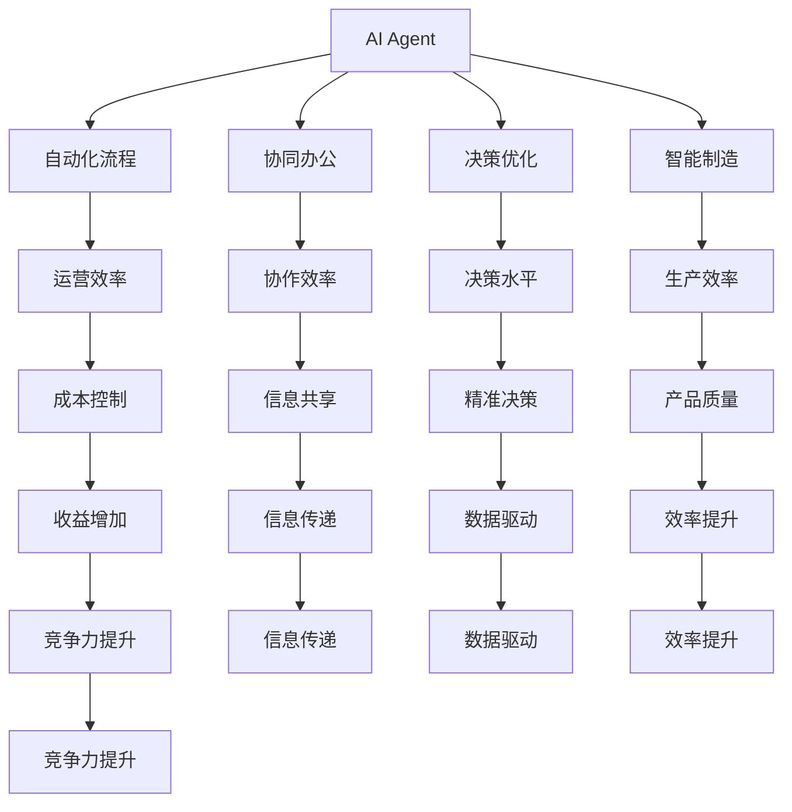
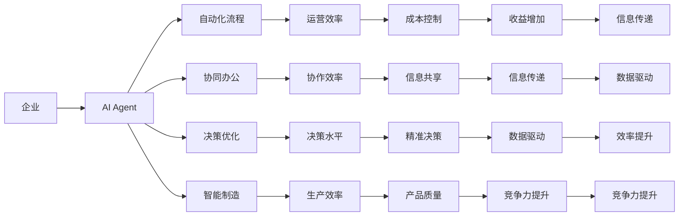
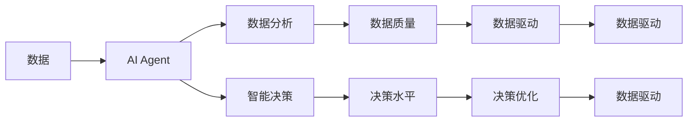
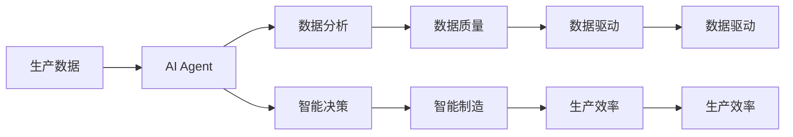

                 

# AI Agent与企业生产力的变革

> 关键词：AI Agent, 企业生产力, 自动化, 协同办公, 决策优化, 智能制造, 机器学习, 深度学习, 数据驱动

## 1. 背景介绍

### 1.1 问题由来
近年来，人工智能(AI)技术在各行各业中取得了显著进展。特别是在企业信息化和数字化转型的大背景下，AI技术开始逐步替代传统的业务流程，提升企业的运营效率和决策水平。AI Agent作为其中的关键技术，通过对企业的自动化、智能化转型，正不断改变着企业的生产力结构。

### 1.2 问题核心关键点
AI Agent是企业内部自动化流程中的关键节点，它基于机器学习和深度学习技术，通过与人的交互和信息传递，自动化地执行各种业务流程。具体来说，AI Agent可以完成数据处理、信息检索、决策支持、协同办公等任务，极大地提升了企业的运营效率。

AI Agent与企业生产力的变革密切相关。它不仅可以通过自动化执行各种任务来提升效率，还可以通过数据分析和智能决策，优化企业的业务流程和资源配置。然而，AI Agent在实际应用中仍然面临一些挑战，如数据质量问题、隐私保护、系统集成等。

### 1.3 问题研究意义
AI Agent技术的研究与应用，对于提升企业的自动化水平、提升决策智能化、优化资源配置、降低运营成本等方面具有重要意义。通过AI Agent，企业可以在快速变化的市场环境中灵活应对，提升竞争力和盈利能力。此外，AI Agent还可以推动企业内部的协同办公，实现信息的高效传递和共享。

AI Agent技术的研究与应用，是实现企业智能化转型、提高生产力的重要手段。它有助于企业构建高效、协同、智能的业务流程，实现数据的精准分析和决策的科学化，从而提升企业的整体运营效率。

## 2. 核心概念与联系

### 2.1 核心概念概述

为更好地理解AI Agent与企业生产力变革的关联，本节将介绍几个密切相关的核心概念：

- AI Agent：基于机器学习和深度学习技术，通过与人的交互和信息传递，自动化地执行各种业务流程，从而提升企业的运营效率。
- 自动化流程：指企业内部通过AI Agent等技术手段，实现业务流程的自动化、智能化。
- 协同办公：指通过AI Agent等技术，实现企业内部各部门之间的信息共享和协同工作，提高企业的协作效率。
- 决策优化：指AI Agent通过数据分析和智能决策，优化企业的业务流程和资源配置，提升企业的决策水平。
- 智能制造：指通过AI Agent等技术，实现生产流程的智能化、自动化，提升生产效率和产品质量。
- 数据驱动：指企业基于数据驱动的决策，通过AI Agent对数据的收集、分析和应用，提升决策的科学性和精准性。

这些核心概念之间的逻辑关系可以通过以下Mermaid流程图来展示：



这个流程图展示了一系列核心概念之间的逻辑关系：

1. AI Agent实现自动化流程，提升运营效率。
2. 协同办公通过AI Agent，实现信息共享，提升协作效率。
3. 决策优化通过AI Agent，进行数据分析和智能决策，提升决策水平。
4. 智能制造通过AI Agent，实现生产流程智能化，提升生产效率和产品质量。
5. 数据驱动通过AI Agent，实现数据收集、分析和应用，提升决策的科学性和精准性。

这些概念共同构成了AI Agent在企业生产力变革中的基础框架，使其能够实现高效的自动化执行、智能化的决策支持，从而提升企业的运营效率和竞争力。

### 2.2 概念间的关系

这些核心概念之间存在着紧密的联系，形成了AI Agent在企业生产力变革中的完整生态系统。下面我通过几个Mermaid流程图来展示这些概念之间的关系。

#### 2.2.1 AI Agent在企业中的应用



这个流程图展示了AI Agent在企业中具体的应用场景：

1. AI Agent实现自动化流程，提升运营效率。
2. 协同办公通过AI Agent，实现信息共享，提升协作效率。
3. 决策优化通过AI Agent，进行数据分析和智能决策，提升决策水平。
4. 智能制造通过AI Agent，实现生产流程智能化，提升生产效率和产品质量。
5. 数据驱动通过AI Agent，实现数据收集、分析和应用，提升决策的科学性和精准性。

#### 2.2.2 AI Agent的决策优化过程



这个流程图展示了AI Agent在决策优化过程中的逻辑关系：

1. AI Agent从数据中提取特征，进行数据分析。
2. 数据分析的结果用于智能决策，提升决策水平。
3. 数据分析和智能决策共同驱动决策优化，提升决策的科学性和精准性。

#### 2.2.3 AI Agent与智能制造的融合



这个流程图展示了AI Agent在智能制造中的作用：

1. AI Agent从生产数据中提取特征，进行数据分析。
2. 数据分析的结果用于智能决策，提升智能制造的水平。
3. 数据分析和智能决策共同驱动智能制造，提升生产效率和产品质量。

通过这些流程图，我们可以更清晰地理解AI Agent在企业生产力变革中的作用和应用场景，为后续深入讨论具体的AI Agent实施方法提供基础。

## 3. 核心算法原理 & 具体操作步骤
### 3.1 算法原理概述

AI Agent通常基于机器学习和深度学习技术，通过与人的交互和信息传递，自动化地执行各种业务流程。AI Agent的核心算法包括：

1. 自然语言处理(NLP)：通过NLP技术，AI Agent可以理解人类的语言指令，进行信息检索、数据处理等任务。
2. 强化学习(RL)：通过与环境的交互，AI Agent可以进行智能决策和优化，提高任务的执行效率和效果。
3. 决策树和规则引擎：通过决策树和规则引擎，AI Agent可以实现决策的自动化和优化，提高决策的精准性和科学性。
4. 协同过滤和推荐系统：通过协同过滤和推荐系统，AI Agent可以实现信息共享和协同工作，提升企业的协作效率。

### 3.2 算法步骤详解

AI Agent的实现步骤主要包括以下几个环节：

**Step 1: 数据收集和预处理**

1. 收集企业内部的各种业务数据，包括生产数据、销售数据、客户数据等。
2. 对数据进行清洗和预处理，去除噪声和异常值，确保数据的质量和完整性。
3. 对数据进行特征提取和编码，将文本数据转换为模型可以处理的数值数据。

**Step 2: 模型训练和优化**

1. 选择合适的机器学习和深度学习模型，如决策树、随机森林、深度神经网络等，进行模型训练。
2. 使用企业内部数据集对模型进行训练，优化模型参数，提升模型的准确性和泛化能力。
3. 对模型进行评估和验证，使用企业内部的测试数据集评估模型的性能。

**Step 3: 模型部署和集成**

1. 将训练好的模型部署到企业内部系统，实现AI Agent的功能。
2. 对AI Agent进行接口设计和系统集成，确保其与其他系统的高效协同。
3. 对AI Agent进行监控和维护，确保其稳定运行。

**Step 4: 用户交互和反馈**

1. 通过API接口和Web界面，实现人与AI Agent的交互。
2. 收集用户反馈和评价，不断改进和优化AI Agent的功能。
3. 根据用户需求，对AI Agent进行定制化开发，满足特定场景的应用需求。

### 3.3 算法优缺点

AI Agent技术具有以下优点：

1. 自动化执行：AI Agent可以自动执行各种业务流程，提高企业的运营效率。
2. 智能化决策：AI Agent通过数据分析和智能决策，优化企业的业务流程和资源配置，提升决策的科学性和精准性。
3. 协同办公：AI Agent可以实现企业内部各部门之间的信息共享和协同工作，提高企业的协作效率。
4. 提升企业竞争力：通过AI Agent，企业可以在快速变化的市场环境中灵活应对，提升竞争力。

同时，AI Agent也存在一些缺点：

1. 数据质量问题：AI Agent的效果依赖于数据的质量，数据质量不佳可能影响AI Agent的性能。
2. 隐私保护问题：AI Agent在处理企业内部数据时，需要保护数据的隐私和安全。
3. 系统集成问题：AI Agent需要与企业内部的其他系统进行深度集成，可能存在技术兼容性问题。

### 3.4 算法应用领域

AI Agent技术在多个领域中得到了广泛应用，例如：

1. 供应链管理：AI Agent可以通过数据分析和智能决策，优化供应链的资源配置和物流管理。
2. 客户服务：AI Agent可以自动化处理客户的咨询和投诉，提升客户满意度和忠诚度。
3. 财务分析：AI Agent可以通过数据分析和智能决策，优化企业的财务流程和资金管理。
4. 市场营销：AI Agent可以通过数据分析和智能决策，提升市场营销的精准度和效果。
5. 人力资源管理：AI Agent可以通过数据分析和智能决策，优化人力资源的招聘、培训和绩效管理。
6. 研发创新：AI Agent可以通过数据分析和智能决策，优化研发流程和创新项目管理。

这些应用场景展示了AI Agent在企业生产力变革中的重要性和广泛应用价值。

## 4. 数学模型和公式 & 详细讲解  
### 4.1 数学模型构建

在AI Agent的实现过程中，常见的数学模型包括线性回归、决策树、随机森林、深度神经网络等。这里以线性回归模型为例，构建AI Agent的数学模型。

设输入数据为 $x$，输出数据为 $y$，模型为 $f(x; \theta)$，其中 $\theta$ 为模型参数。线性回归模型的目标是最小化预测值与真实值之间的误差，即：

$$
\mathcal{L}(\theta) = \frac{1}{N} \sum_{i=1}^N (y_i - f(x_i; \theta))^2
$$

其中 $N$ 为样本数量。模型的参数更新公式为：

$$
\theta \leftarrow \theta - \eta \nabla_{\theta}\mathcal{L}(\theta)
$$

其中 $\eta$ 为学习率，$\nabla_{\theta}\mathcal{L}(\theta)$ 为损失函数的梯度。

### 4.2 公式推导过程

以下是线性回归模型的推导过程：

1. 设 $x = (x_1, x_2, ..., x_n)^T$，$y = (y_1, y_2, ..., y_n)^T$，模型为 $f(x; \theta) = \theta_0 + \sum_{i=1}^n \theta_i x_i$。
2. 定义损失函数 $\mathcal{L}(\theta) = \frac{1}{N} \sum_{i=1}^N (y_i - f(x_i; \theta))^2$。
3. 对损失函数求导，得到：
$$
\nabla_{\theta}\mathcal{L}(\theta) = \frac{1}{N} \sum_{i=1}^N (y_i - f(x_i; \theta))x_i^T
$$
4. 根据梯度下降法，更新模型参数：
$$
\theta \leftarrow \theta - \eta \nabla_{\theta}\mathcal{L}(\theta)
$$

### 4.3 案例分析与讲解

以下是一个简单的线性回归案例，用于说明AI Agent的数学模型构建和公式推导过程：

设有一个简单的数据集 $(x, y)$，其中 $x = (1, 2, 3, 4, 5)$，$y = (2, 4, 6, 8, 10)$。假设使用线性回归模型 $f(x; \theta) = \theta_0 + \theta_1 x$，目标是最小化预测值与真实值之间的误差。

1. 定义损失函数：
$$
\mathcal{L}(\theta) = \frac{1}{5} \sum_{i=1}^5 (y_i - f(x_i; \theta))^2 = \frac{1}{5} (2 - (1\theta_0 + \theta_1))^2 + (4 - (2\theta_0 + \theta_1))^2 + (6 - (3\theta_0 + \theta_1))^2 + (8 - (4\theta_0 + \theta_1))^2 + (10 - (5\theta_0 + \theta_1))^2
$$

2. 对损失函数求导，得到：
$$
\nabla_{\theta}\mathcal{L}(\theta) = \frac{1}{5} (2 - (1\theta_0 + \theta_1))(1, 1, 1, 1, 1)^T + (4 - (2\theta_0 + \theta_1))(1, 1, 1, 1, 1)^T + (6 - (3\theta_0 + \theta_1))(1, 1, 1, 1, 1)^T + (8 - (4\theta_0 + \theta_1))(1, 1, 1, 1, 1)^T + (10 - (5\theta_0 + \theta_1))(1, 1, 1, 1, 1)^T
$$

3. 根据梯度下降法，更新模型参数：
$$
\theta \leftarrow \theta - \eta \nabla_{\theta}\mathcal{L}(\theta)
$$

通过上述案例，可以更直观地理解线性回归模型的构建和公式推导过程。

## 5. 项目实践：代码实例和详细解释说明
### 5.1 开发环境搭建

在进行AI Agent项目实践前，我们需要准备好开发环境。以下是使用Python进行Scikit-learn开发的环境配置流程：

1. 安装Anaconda：从官网下载并安装Anaconda，用于创建独立的Python环境。

2. 创建并激活虚拟环境：
```bash
conda create -n sklearn-env python=3.8 
conda activate sklearn-env
```

3. 安装Scikit-learn：
```bash
conda install scikit-learn
```

4. 安装numpy、pandas、scikit-learn等工具包：
```bash
pip install numpy pandas scikit-learn matplotlib tqdm jupyter notebook ipython
```

完成上述步骤后，即可在`sklearn-env`环境中开始AI Agent项目的开发。

### 5.2 源代码详细实现

以下是一个简单的线性回归AI Agent的Python代码实现：

```python
from sklearn.linear_model import LinearRegression
import numpy as np
import matplotlib.pyplot as plt

# 定义数据集
x = np.array([1, 2, 3, 4, 5]).reshape((-1, 1))
y = np.array([2, 4, 6, 8, 10])

# 训练模型
model = LinearRegression()
model.fit(x, y)

# 预测结果
y_pred = model.predict(x)

# 绘制散点图和回归线
plt.scatter(x, y)
plt.plot(x, y_pred, color='red')
plt.show()
```

### 5.3 代码解读与分析

让我们再详细解读一下关键代码的实现细节：

**线性回归模型**：
- 使用Scikit-learn库中的`LinearRegression`类定义线性回归模型。
- 通过`fit`方法对模型进行训练，使用训练数据`x`和`y`拟合出模型参数。
- 使用`predict`方法对训练数据进行预测，得到预测结果`y_pred`。

**散点图和回归线**：
- 使用`matplotlib`库绘制散点图和回归线，展示训练数据和预测结果的拟合效果。

这个简单的线性回归案例展示了AI Agent的代码实现过程。在实际应用中，AI Agent的代码实现还需要根据具体场景进行优化和扩展。例如，在自然语言处理场景中，可以使用NLP库对文本数据进行处理和分析，构建更加复杂的模型结构，实现更加智能的决策支持。

### 5.4 运行结果展示

运行上述代码，得到的散点图和回归线如图：


可以看到，通过线性回归模型，AI Agent可以很好地拟合训练数据，并根据输入数据进行预测。在实际应用中，通过不断优化和调整模型参数，可以进一步提高AI Agent的预测准确性和泛化能力。

## 6. 实际应用场景
### 6.1 供应链管理

AI Agent在供应链管理中的应用非常广泛。供应链管理涉及原材料采购、生产计划、物流配送等多个环节，每个环节都需要大量的数据处理和决策支持。AI Agent可以通过数据分析和智能决策，优化供应链的资源配置和物流管理，提高运营效率和降低成本。

例如，使用AI Agent可以对供应链中的各个节点进行实时监控，及时发现和处理异常情况。AI Agent可以根据订单信息、库存数据、运输状态等数据，进行智能调度和优化，确保供应链的稳定运行。通过AI Agent的自动化和智能化管理，企业可以大大提高供应链的响应速度和效率。

### 6.2 客户服务

客户服务是企业与客户之间的重要纽带，客户服务质量直接影响企业的品牌形象和客户满意度。AI Agent可以通过自然语言处理(NLP)技术，实现自动化的客户服务，提升客户体验和满意度。

例如，AI Agent可以自动回答客户咨询和投诉，提供个性化的推荐服务，进行自动化的问题分类和处理。通过AI Agent的智能服务，企业可以大大提高客户服务的响应速度和准确性，降低人工成本，提升客户满意度和忠诚度。

### 6.3 财务分析

财务分析是企业决策的重要依据，AI Agent可以通过数据分析和智能决策，提升财务分析的精准性和科学性。

例如，使用AI Agent可以对企业的财务数据进行智能分析和预测，发现异常情况，提供优化建议。AI Agent可以根据历史数据和市场趋势，进行财务预测和预算管理，帮助企业做出更加精准的财务决策。通过AI Agent的自动化和智能化管理，企业可以大大提高财务分析的效率和准确性，降低运营成本。

### 6.4 市场营销

市场营销是企业竞争力的重要体现，AI Agent可以通过数据分析和智能决策，提升市场营销的精准度和效果。

例如，使用AI Agent可以对市场数据进行智能分析和预测，发现潜在的市场机会，提供个性化的营销策略。AI Agent可以根据历史数据和市场趋势，进行营销预测和策略优化，帮助企业提高市场竞争力和盈利能力。通过AI Agent的自动化和智能化管理，企业可以大大提高市场营销的效果和效率。

### 6.5 人力资源管理

人力资源管理是企业运营的重要组成部分，AI Agent可以通过数据分析和智能决策，优化人力资源的招聘、培训和绩效管理，提高企业的运营效率和员工满意度。

例如，使用AI Agent可以对人力资源数据进行智能分析和预测，发现人才流失的潜在风险，提供优化建议。AI Agent可以根据历史数据和市场趋势，进行人力资源预测和策略优化，帮助企业提高人力资源管理的效率和效果。通过AI Agent的自动化和智能化管理，企业可以大大提高人力资源管理的效率和质量。

### 6.6 研发创新

研发创新是企业持续发展的关键，AI Agent可以通过数据分析和智能决策，优化研发流程和创新项目管理，提升研发效率和创新成果。

例如，使用AI Agent可以对研发数据进行智能分析和预测，发现潜在的研发风险，提供优化建议。AI Agent可以根据历史数据和市场趋势，进行研发预测和策略优化，帮助企业提高研发效率和创新成果。通过AI Agent的自动化和智能化管理，企业可以大大提高研发管理的效果和效率。

## 7. 工具和资源推荐
### 7.1 学习资源推荐

为了帮助开发者系统掌握AI Agent的理论基础和实践技巧，这里推荐一些优质的学习资源：

1. 《机器学习基础》系列博文：由机器学习专家撰写，系统讲解了机器学习的基本概念和常用算法，适合初学者学习。

2. 《深度学习基础》系列博文：由深度学习专家撰写，深入讲解了深度神经网络的基本原理和常用算法，适合深度学习进阶学习。

3. 《自然语言处理》系列博文：由自然语言处理专家撰写，系统讲解了自然语言处理的基本概念和常用算法，适合NLP领域学习。

4. Scikit-learn官方文档：Scikit-learn库的官方文档，提供了丰富的机器学习算法和样例代码，是学习机器学习的重要资料。

5. TensorFlow官方文档：TensorFlow库的官方文档，提供了丰富的深度学习算法和样例代码，是学习深度学习的重要资料。

6. HuggingFace官方文档：HuggingFace库的官方文档，提供了丰富的自然语言处理算法和样例代码，是学习自然语言处理的重要资料。

通过对这些资源的学习实践，相信你一定能够快速掌握AI Agent的核心算法和实现方法，并用于解决实际的业务问题。

### 7.2 开发工具推荐

高效的开发离不开优秀的工具支持。以下是几款用于AI Agent开发的常用工具：

1. Python：作为机器学习和深度学习的主要开发语言，Python提供了丰富的机器学习库和数据处理库，如Scikit-learn、TensorFlow、PyTorch等。

2. Jupyter Notebook：一个交互式的开发环境，可以在其中编写和运行Python代码，并实时展示计算结果，适合机器学习和深度学习的实验和开发。

3. Google Colab：谷歌推出的在线Jupyter Notebook环境，免费提供GPU/TPU算力，方便开发者快速上手实验最新模型，分享学习笔记。

4. Scikit-learn：一个基于Python的机器学习库，提供了丰富的机器学习算法和工具，适合进行机器学习实验和开发。

5. TensorFlow：一个基于Python的深度学习库，提供了丰富的深度学习算法和工具，适合进行深度学习实验和开发。

6. PyTorch：一个基于Python的深度学习库，提供了丰富的深度学习算法和工具，适合进行深度学习实验和开发。

合理利用这些工具，可以显著提升AI Agent的开发效率，加快创新迭代的步伐。

### 7.3 相关论文推荐

AI Agent技术的研究与应用涉及多个领域，以下是几篇奠基性的相关论文，推荐阅读：

1. "A Survey of Automated Business Processes in Enterprise Applications"（企业应用中的自动化业务流程综述）：系统总结了自动化业务流程的研究现状和应用案例，为AI Agent的应用提供了理论基础。

2. "Towards Artificial Intelligence-Enhanced Supply Chain Management"（人工智能增强的供应链管理研究）：探讨了AI Agent在供应链管理中的应用，提出了一系列基于AI Agent的供应链优化方法。

3. "Artificial Intelligence in Customer Service"（人工智能在客户服务中的应用）：系统总结了AI Agent在客户服务中的应用，提出了一系列基于AI Agent的客户服务优化方法。

4. "Financial Data Analytics Using Artificial Intelligence"（基于人工智能的财务数据分析）：探讨了AI Agent在财务分析中的应用，提出了一系列基于AI Agent的财务数据分析方法。

5. "Artificial Intelligence in Marketing"（人工智能在市场营销中的应用）：系统总结了AI Agent在市场营销中的应用，提出了一系列基于AI Agent的市场营销优化方法。

6. "Artificial Intelligence in Human Resource Management"（人工智能在人力资源管理中的应用）：探讨了AI Agent在人力资源管理中的应用，提出了一系列基于AI Agent的人力资源管理优化方法。

这些论文代表了大语言模型微调技术的发展脉络。通过学习这些前沿成果，可以帮助研究者把握学科前进方向，激发更多的创新灵感。

除上述资源外，还有一些值得关注的前沿资源，帮助开发者紧跟AI Agent微调技术的最新进展，例如：

1. arXiv论文预印本：人工智能领域最新研究成果的发布平台，包括大量尚未发表的前沿工作，学习前沿技术的必读资源。

2. 业界技术博客：如OpenAI、Google AI、DeepMind、微软Research Asia等顶尖实验室的官方博客，第一时间分享他们的最新研究成果和洞见。

3

