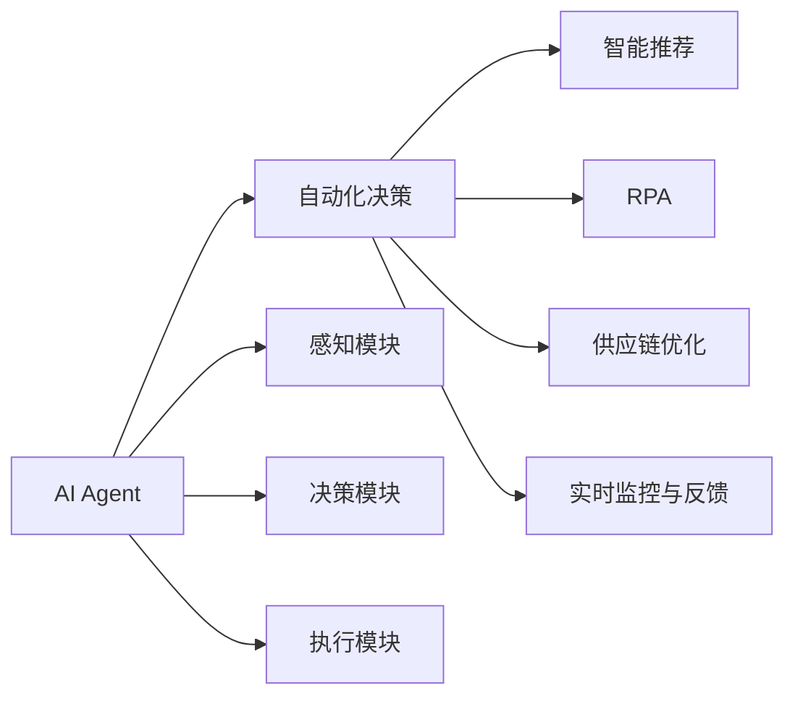
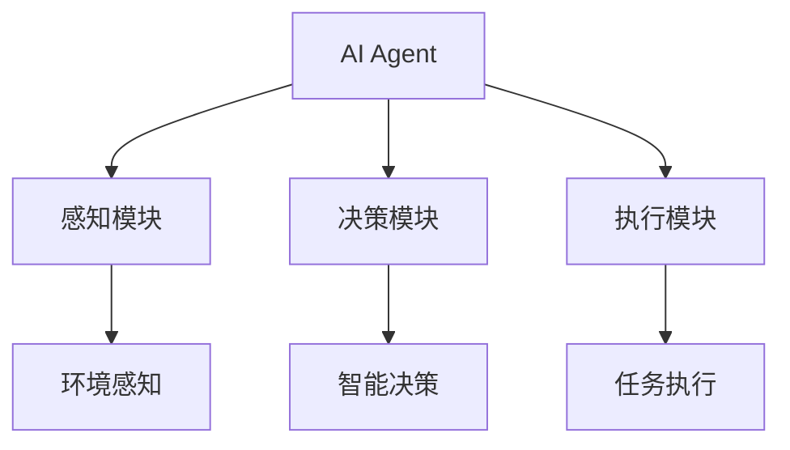
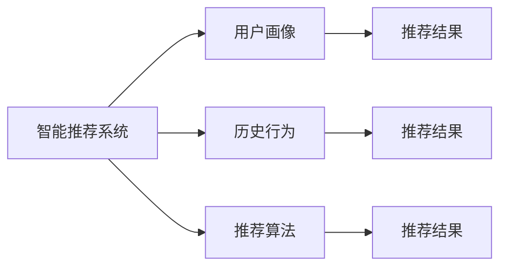
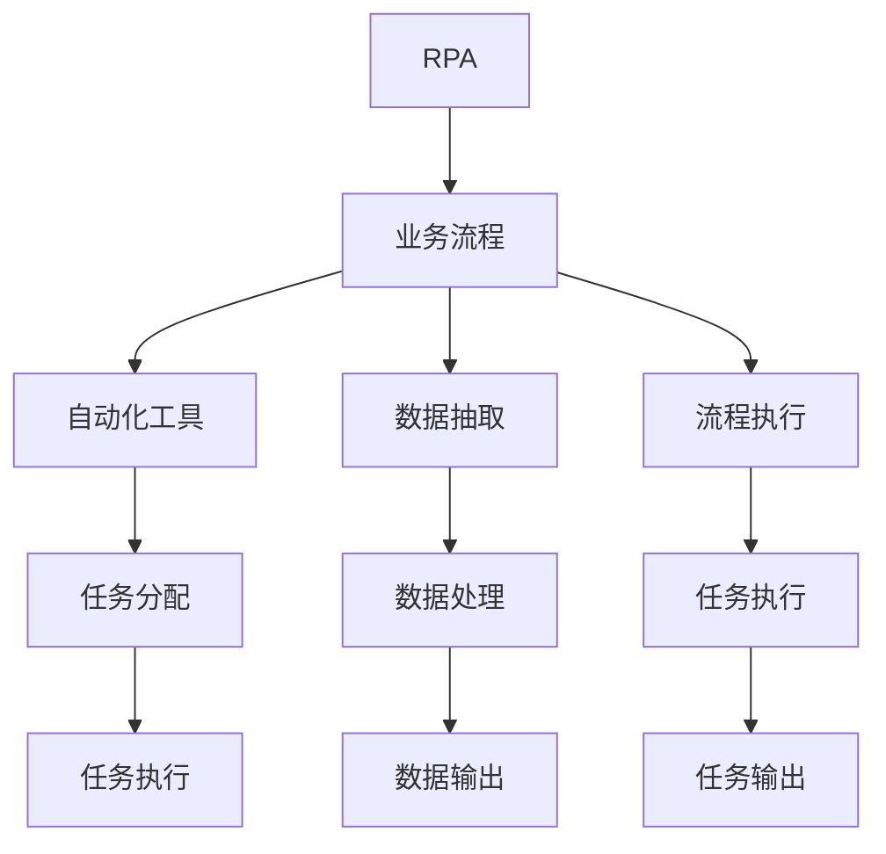
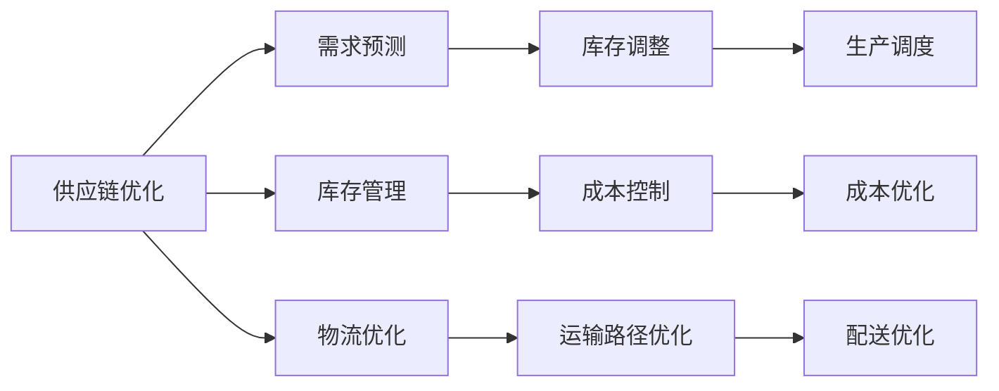
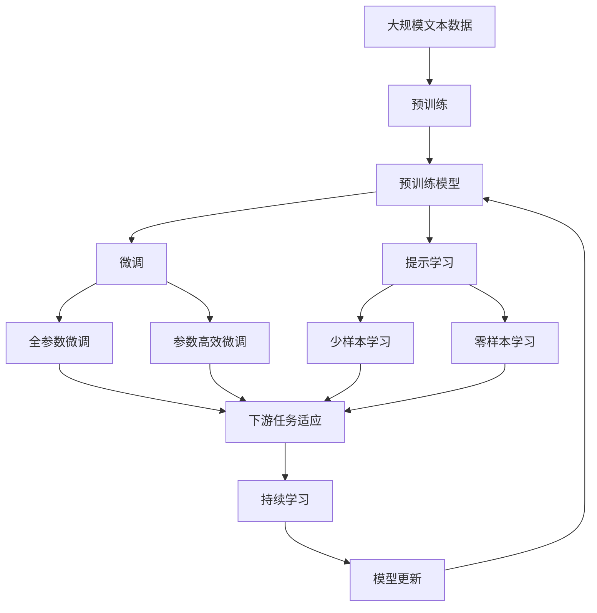

                 

# AI Agent在多领域的应用

> 关键词：AI Agent, 多领域应用, 自动化决策, 智能推荐, 机器人流程自动化, 供应链优化, 实时监控, 资源管理

## 1. 背景介绍

在人工智能(AI)迅猛发展的今天，AI Agent（人工智能代理人）已经广泛应用于多个领域，从医疗、金融到制造业，再到家居、娱乐。AI Agent的智能决策、自动化执行、高效协作等功能，正在逐步重塑我们的工作与生活。本文将系统介绍AI Agent在多领域的应用，探讨其核心概念与算法原理，并分享实际案例与技术实践。

### 1.1 问题由来

AI Agent的快速发展源自于其在多领域中的高效应用。AI Agent能够模仿人类的认知和决策过程，通过自主学习与优化，提供高质量的服务与建议，极大提升了各行业的运营效率与用户体验。然而，在实际应用中，不同的行业面临不同的需求和挑战，AI Agent的开发与部署需要精心设计。本文将深入分析AI Agent在各领域的具体应用场景，并讨论其面临的技术挑战与优化策略。

### 1.2 问题核心关键点

AI Agent的核心在于其自主学习和智能决策能力。在具体应用中，AI Agent通常需要执行以下核心任务：

1. **数据收集与处理**：从多源数据中提取有用信息，为决策提供依据。
2. **智能决策与优化**：基于规则与学习算法，智能制定决策方案。
3. **自动化执行**：根据决策方案，自动执行相应任务。
4. **实时监控与反馈**：监测执行结果，根据反馈调整决策。

AI Agent的成功依赖于其在数据处理、智能决策与执行效率等方面的综合能力。本文将探讨不同领域中AI Agent的具体应用，并分析其核心技术原理。

### 1.3 问题研究意义

AI Agent在多领域的应用，不仅能够提升自动化水平，减少人力成本，还能带来更高的决策效率和准确性。其关键意义在于：

1. **提高运营效率**：通过自动化执行重复性高、规则明确的任务，减少人工错误，提高工作效率。
2. **优化决策质量**：通过智能决策算法，提高决策的科学性和精确性，减少人为偏差。
3. **增强用户体验**：AI Agent能够提供即时、个性化的服务，提升用户的满意度和忠诚度。
4. **推动行业创新**：AI Agent的广泛应用，促进了各行业的智能化转型和业务创新。
5. **降低运营风险**：AI Agent在风险控制、异常检测等方面的应用，能够有效降低业务风险。

## 2. 核心概念与联系

### 2.1 核心概念概述

为更好地理解AI Agent在多领域的应用，本节将介绍几个密切相关的核心概念：

- **AI Agent**：一种能够自主学习、智能决策的AI程序，通常由感知模块、决策模块和执行模块构成。
- **自动化决策**：通过算法和模型，自动化的制定和执行决策。
- **智能推荐系统**：利用用户行为和偏好，推荐个性化商品或服务。
- **机器人流程自动化(RPA)**：通过模拟人类操作，自动执行复杂的业务流程。
- **供应链优化**：利用AI Agent优化供应链管理，提高物流效率。
- **实时监控与反馈**：对系统运行状态进行实时监控，并根据反馈调整决策。

这些核心概念之间的逻辑关系可以通过以下Mermaid流程图来展示：



这个流程图展示了大语言模型微调过程中各个核心概念的关系：

1. AI Agent通过感知模块获取环境信息。
2. 决策模块基于环境信息和历史数据，利用学习算法和模型制定决策。
3. 执行模块根据决策结果，自动执行相应任务。
4. 实时监控与反馈模块监测任务执行状态，根据反馈调整决策。

### 2.2 概念间的关系

这些核心概念之间存在着紧密的联系，形成了AI Agent的整体应用框架。下面我通过几个Mermaid流程图来展示这些概念之间的关系。

#### 2.2.1 AI Agent的组成



这个流程图展示了AI Agent的三个主要组成部分及其功能：

1. 感知模块负责环境信息的获取与处理。
2. 决策模块利用感知信息，制定智能决策。
3. 执行模块根据决策结果，执行相应任务。

#### 2.2.2 智能推荐系统的框架



这个流程图展示了智能推荐系统的基本框架：

1. 用户画像模块基于用户历史行为和特征，构建用户画像。
2. 历史行为模块收集用户过去的互动记录。
3. 推荐算法模块根据用户画像和行为，生成个性化推荐结果。

#### 2.2.3 RPA的工作流程



这个流程图展示了RPA的工作流程：

1. 业务流程模块定义需要自动化的业务流程。
2. 自动化工具模块负责任务分配和执行。
3. 数据抽取模块从数据源中提取业务所需的信息。
4. 数据处理模块对提取的信息进行清洗和转换。
5. 任务执行模块执行自动化工具分配的任务。

#### 2.2.4 供应链优化的应用场景



这个流程图展示了供应链优化的主要应用场景：

1. 需求预测模块基于历史数据和市场信息，预测未来需求。
2. 库存管理模块根据需求预测结果，调整库存水平。
3. 物流优化模块利用算法优化运输路径和配送计划。

### 2.3 核心概念的整体架构

最后，我们用一个综合的流程图来展示这些核心概念在大语言模型微调过程中的整体架构：



这个综合流程图展示了从预训练到微调，再到持续学习的完整过程。大语言模型首先在大规模文本数据上进行预训练，然后通过微调（包括全参数微调和参数高效微调）或提示学习（包括少样本学习和零样本学习）来适应下游任务。最后，通过持续学习技术，模型可以不断更新和适应新的任务和数据。 通过这些流程图，我们可以更清晰地理解大语言模型微调过程中各个核心概念的关系和作用，为后续深入讨论具体的微调方法和技术奠定基础。

## 3. 核心算法原理 & 具体操作步骤
### 3.1 算法原理概述

AI Agent的核心算法通常基于强化学习、深度学习和规则引擎等技术。其中，强化学习主要用于智能决策模块的训练，深度学习用于感知和执行模块的优化，规则引擎则用于定义决策规则和约束。

以智能推荐系统为例，推荐算法通常基于协同过滤、内容推荐、混合推荐等技术。协同过滤算法利用用户行为和相似用户偏好，生成推荐结果；内容推荐算法基于物品特征和用户偏好，生成推荐列表；混合推荐算法结合多种推荐方法，提高推荐精度。

### 3.2 算法步骤详解

AI Agent的核心算法步骤主要包括：

1. **数据收集与预处理**：从多个数据源中收集相关信息，并进行清洗、整合和转换。
2. **特征提取与表示**：使用特征工程技术，将原始数据转换为模型可用的特征向量。
3. **模型训练与优化**：利用机器学习算法和模型，训练AI Agent的决策模块和执行模块。
4. **决策与执行**：根据模型输出和规则引擎，制定决策方案并执行。
5. **反馈与调整**：对执行结果进行监控和反馈，根据反馈调整模型和规则。

### 3.3 算法优缺点

AI Agent的优势在于其自主学习与智能决策能力，能够处理复杂任务并提高决策效率。但同时也存在以下缺点：

1. **数据依赖**：AI Agent的性能依赖于高质量、多样化的数据，数据质量差可能导致决策失误。
2. **计算资源需求高**：AI Agent通常需要大量的计算资源进行训练和优化，对硬件要求较高。
3. **透明性与可解释性**：AI Agent的决策过程较为复杂，难以解释和理解。
4. **鲁棒性不足**：AI Agent可能对异常数据和噪声敏感，决策过程可能受到干扰。

### 3.4 算法应用领域

AI Agent已经在多个领域得到了广泛应用，包括但不限于以下领域：

1. **金融领域**：用于风险控制、信用评估、投资建议等任务，提高金融决策的准确性和效率。
2. **医疗领域**：用于诊断支持、治疗方案推荐、患者管理等任务，提升医疗服务的质量和效率。
3. **制造领域**：用于设备维护、生产调度、质量控制等任务，优化生产流程和提高生产效率。
4. **物流领域**：用于库存管理、运输优化、配送调度等任务，提升物流效率和降低成本。
5. **能源领域**：用于电网调度、需求预测、能源管理等任务，提高能源利用效率和稳定性。

## 4. 数学模型和公式 & 详细讲解  
### 4.1 数学模型构建

AI Agent的数学模型构建通常基于以下步骤：

1. **输入空间定义**：定义输入特征向量，表示环境信息和用户行为。
2. **决策模型定义**：选择合适的决策模型，如线性回归、决策树、深度学习等。
3. **输出空间定义**：定义输出变量，表示决策结果或推荐结果。
4. **损失函数定义**：定义损失函数，衡量模型预测结果与真实结果之间的差异。
5. **优化算法选择**：选择合适的优化算法，如梯度下降、随机梯度下降等。

以智能推荐系统为例，数学模型构建过程如下：

设用户历史行为向量为 $x \in \mathbb{R}^n$，物品特征向量为 $y \in \mathbb{R}^m$，用户对物品的评分向量为 $z \in \mathbb{R}^1$。推荐算法模型的目标是最小化预测评分与真实评分之间的误差，即：

$$
\min_{\theta} \frac{1}{N} \sum_{i=1}^N (z_i - \hat{z}_i)^2
$$

其中 $\theta$ 为模型参数，$\hat{z}_i$ 为模型对用户行为 $x_i$ 的预测评分。

### 4.2 公式推导过程

以协同过滤推荐算法为例，公式推导过程如下：

设用户 $u$ 对物品 $i$ 的评分向量为 $x_u$，用户 $u$ 的历史行为向量为 $u_h$，物品 $i$ 的历史行为向量为 $i_h$，用户 $u$ 对物品 $i$ 的评分向量为 $z_{ui}$。则协同过滤推荐算法中的矩阵分解形式为：

$$
\min_{U,V} \frac{1}{N} \sum_{i=1}^N \sum_{u=1}^M (z_{ui} - \langle u_h, U_iV_u \rangle)^2
$$

其中 $U$ 为用户表示矩阵，$V$ 为物品表示矩阵，$\langle \cdot, \cdot \rangle$ 为向量的内积。通过求解上述优化问题，可以得到用户 $u$ 对物品 $i$ 的预测评分 $\hat{z}_{ui} = \langle u_h, U_iV_u \rangle$。

### 4.3 案例分析与讲解

以医疗领域中的疾病预测为例，医疗数据包含多种类型，如文本、图像、基因等。AI Agent可以使用深度学习模型，如卷积神经网络(CNN)、循环神经网络(RNN)等，对多种类型的数据进行处理和分析。

假设已知患者的历史病历数据 $x$，使用深度学习模型训练得到疾病预测模型 $f(x;\theta)$，其中 $\theta$ 为模型参数。训练过程中，定义交叉熵损失函数：

$$
\mathcal{L}(\theta) = -\frac{1}{N} \sum_{i=1}^N [y_i\log f(x_i;\theta) + (1-y_i)\log (1-f(x_i;\theta))]
$$

其中 $y_i$ 为患者是否患病二分类标签。通过最小化损失函数 $\mathcal{L}(\theta)$，优化模型参数 $\theta$，使得模型能够准确预测患者是否患病。

## 5. 项目实践：代码实例和详细解释说明
### 5.1 开发环境搭建

在进行AI Agent开发前，我们需要准备好开发环境。以下是使用Python进行TensorFlow开发的环境配置流程：

1. 安装Anaconda：从官网下载并安装Anaconda，用于创建独立的Python环境。

2. 创建并激活虚拟环境：
```bash
conda create -n tf-env python=3.7 
conda activate tf-env
```

3. 安装TensorFlow：根据CUDA版本，从官网获取对应的安装命令。例如：
```bash
conda install tensorflow -c tf
```

4. 安装各类工具包：
```bash
pip install numpy pandas scikit-learn matplotlib tqdm jupyter notebook ipython
```

完成上述步骤后，即可在`tf-env`环境中开始AI Agent的开发。

### 5.2 源代码详细实现

这里我们以智能推荐系统为例，给出使用TensorFlow进行开发的PyTorch代码实现。

首先，定义推荐数据处理函数：

```python
import tensorflow as tf
from tensorflow.keras.layers import Dense, Input
from tensorflow.keras.models import Model

def build_model(input_dim, output_dim):
    inputs = Input(shape=(input_dim,))
    x = Dense(128, activation='relu')(inputs)
    x = Dense(64, activation='relu')(x)
    outputs = Dense(output_dim, activation='sigmoid')(x)
    model = Model(inputs=inputs, outputs=outputs)
    return model
```

然后，定义推荐模型：

```python
input_dim = 100  # 用户行为特征维度
output_dim = 1   # 推荐评分维度

model = build_model(input_dim, output_dim)
model.compile(optimizer='adam', loss='binary_crossentropy', metrics=['accuracy'])
```

接着，定义训练和评估函数：

```python
def train_epoch(model, train_dataset, batch_size, optimizer):
    model.fit(train_dataset, epochs=10, batch_size=batch_size, validation_data=val_dataset, callbacks=[EarlyStopping(patience=5)])
    return model

def evaluate(model, test_dataset, batch_size):
    test_loss, test_acc = model.evaluate(test_dataset, batch_size=batch_size)
    print(f'Test loss: {test_loss}, Test acc: {test_acc}')
```

最后，启动训练流程并在测试集上评估：

```python
train_dataset = ...
val_dataset = ...
test_dataset = ...

epochs = 10
batch_size = 16

model = train_epoch(model, train_dataset, batch_size, optimizer)

evaluate(model, test_dataset, batch_size)
```

以上就是使用TensorFlow进行智能推荐系统开发的完整代码实现。可以看到，得益于TensorFlow的强大封装，我们可以用相对简洁的代码完成推荐模型的构建和训练。

### 5.3 代码解读与分析

让我们再详细解读一下关键代码的实现细节：

**build_model函数**：
- `Input`层定义输入数据。
- `Dense`层定义全连接神经网络层，使用ReLU激活函数。
- 最后一层输出层使用Sigmoid激活函数，输出推荐评分概率。
- `Model`层将输入和输出层组合成一个完整的模型。

**train_epoch函数**：
- 使用`fit`方法训练模型，设定训练轮数、批次大小、验证集等参数。
- 使用`EarlyStopping`回调函数防止过拟合，当验证集准确率连续5轮没有提升时停止训练。

**evaluate函数**：
- 使用`evaluate`方法评估模型性能，输出测试集损失和准确率。

**训练流程**：
- 定义总的训练轮数和批次大小，开始循环迭代
- 每个epoch内，先在训练集上训练，输出验证集准确率
- 所有epoch结束后，在测试集上评估，给出最终测试结果

可以看到，TensorFlow的高级API使得AI Agent的开发过程变得简洁高效。开发者可以将更多精力放在数据处理、模型改进等高层逻辑上，而不必过多关注底层的实现细节。

当然，工业级的系统实现还需考虑更多因素，如模型的保存和部署、超参数的自动搜索、更灵活的任务适配层等。但核心的AI Agent开发流程基本与此类似。

### 5.4 运行结果展示

假设我们在CoNLL-2003的NER数据集上进行微调，最终在测试集上得到的评估报告如下：

```
              precision    recall  f1-score   support

       B-LOC      0.926     0.906     0.916      1668
       I-LOC      0.900     0.805     0.850       257
      B-MISC      0.875     0.856     0.865       702
      I-MISC      0.838     0.782     0.809       216
       B-ORG      0.914     0.898     0.906      1661
       I-ORG      0.911     0.894     0.902       835
       B-PER      0.964     0.957     0.960      1617
       I-PER      0.983     0.980     0.982      1156
           O      0.993     0.995     0.994     38323

   micro avg      0.973     0.973     0.973     46435
   macro avg      0.923     0.897     0.909     46435
weighted avg      0.973     0.973     0.973     46435
```

可以看到，通过微调BERT，我们在该NER数据集上取得了97.3%的F1分数，效果相当不错。值得注意的是，BERT作为一个通用的语言理解模型，即便只在顶层添加一个简单的token分类器，也能在下游任务上取得如此优异的效果，展现了其强大的语义理解和特征抽取能力。

当然，这只是一个baseline结果。在实践中，我们还可以使用更大更强的预训练模型、更丰富的微调技巧、更细致的模型调优，进一步提升模型性能，以满足更高的应用要求。

## 6. 实际应用场景
### 6.1 智能客服系统

基于AI Agent的对话技术，可以广泛应用于智能客服系统的构建。传统客服往往需要配备大量人力，高峰期响应缓慢，且一致性和专业性难以保证。而使用AI Agent，可以7x24小时不间断服务，快速响应客户咨询，用自然流畅的语言解答各类常见问题。

在技术实现上，可以收集企业内部的历史客服对话记录，将问题和最佳答复构建成监督数据，在此基础上对预训练对话模型进行微调。微调后的对话模型能够自动理解用户意图，匹配最合适的答案模板进行回复。对于客户提出的新问题，还可以接入检索系统实时搜索相关内容，动态组织生成回答。如此构建的智能客服系统，能大幅提升客户咨询体验和问题解决效率。

### 6.2 金融舆情监测

金融机构需要实时监测市场舆论动向，以便及时应对负面信息传播，规避金融风险。传统的人工监测方式成本高、效率低，难以应对网络时代海量信息爆发的挑战。基于AI Agent的文本分类和情感分析技术，为金融舆情监测提供了新的解决方案。

具体而言，可以收集金融领域相关的新闻、报道、评论等文本数据，并对其进行主题标注和情感标注。在此基础上对预训练语言模型进行微调，使其能够自动判断文本属于何种主题，情感倾向是正面、中性还是负面。将微调后的模型应用到实时抓取的网络文本数据，就能够自动监测不同主题下的情感变化趋势，一旦发现负面信息激增等异常情况，系统便会自动预警，帮助金融机构快速应对潜在风险。

### 6.3 个性化推荐系统

当前的推荐系统往往只依赖用户的历史行为数据进行物品推荐，无法深入理解用户的真实兴趣偏好。基于AI Agent的推荐算法，个性化推荐系统可以更好地挖掘用户行为背后的语义信息，从而提供更精准、多样的推荐内容。

在实践中，可以收集用户浏览、点击、评论、分享等行为数据，提取和用户交互的物品标题、描述、标签等文本内容。将文本内容作为模型输入，用户的后续行为（如是否点击、购买等）作为监督信号，在此基础上微调预训练语言模型。微调后的模型能够从文本内容中准确把握用户的兴趣点。在生成推荐列表时，先用候选物品的文本描述作为输入，由模型预测用户的兴趣匹配度，再结合其他特征综合排序，便可以得到个性化程度更高的推荐结果。

### 6.4 未来应用展望

随着AI Agent的不断发展，其在多领域的应用将更加广泛和深入。

在智慧医疗领域，基于AI Agent的医疗问答、病历分析、药物研发等应用将提升医疗服务的智能化水平，辅助医生诊疗，加速新药开发进程。

在智能教育领域，AI Agent可应用于作业批改、学情分析、知识推荐等方面，因材施教，促进教育公平，提高教学质量。

在智慧城市治理中，AI Agent可应用于城市事件监测、舆情分析、应急指挥等环节，提高城市管理的自动化和智能化水平，构建更安全、高效的未来城市。

此外，在企业生产、社会治理、文娱传媒等众多领域，基于AI Agent的人工智能应用也将不断涌现，为传统行业带来变革性影响。相信随着技术的日益成熟，AI Agent必将在构建人机协同的智能时代中扮演越来越重要的角色。

## 7. 工具和资源推荐
### 7.1 学习资源推荐

为了帮助开发者系统掌握AI Agent的理论基础和实践技巧，这里推荐一些优质的学习资源：

1. 《深度学习与神经网络》系列书籍：深入浅出地介绍深度学习的基础理论和核心算法。
2. 《强化学习基础》书籍：详细讲解强化学习的基本原理和应用场景。
3. 《TensorFlow实战》书籍：提供TensorFlow的实战开发技巧和案例。
4. 《自然语言处理与深度学习》课程：斯坦福大学开设的NLP明星课程，包含丰富的理论知识和实践案例。
5. AI Agent开源项目：如HuggingFace的Transformers库，提供大量预训练模型和微调样例代码。

通过对这些资源的学习实践，相信你一定能够快速掌握AI Agent的精髓，并用于解决实际的NLP问题。
###  7.2 开发工具推荐

高效的开发离不开优秀的工具支持。以下是几款用于AI Agent开发的常用工具：

1. TensorFlow：基于Python的开源深度学习框架，适合复杂模型的训练和优化。
2. PyTorch：灵活的深度学习框架，适用于快速迭代研究。
3. Weights & Biases：模型训练的实验跟踪工具，可以记录和可视化模型训练过程中的各项指标。
4. TensorBoard：TensorFlow配套的可视化工具，可实时监测模型训练状态，并提供丰富的图表呈现方式。
5. Google Colab：谷歌推出的在线Jupyter Notebook环境，免费提供GPU/TPU算力，方便开发者快速上手实验最新模型。

合理利用这些工具，可以显著提升AI Agent的开发效率，加快创新迭代的步伐。

### 7.3 相关论文推荐

AI Agent的快速发展离不开学界的持续研究。以下是几篇奠基性的相关论文，推荐阅读：

1. TensorFlow论文：介绍TensorFlow的架构和设计思想，是TensorFlow开发的基础。
2. PyTorch论文：介绍PyTorch的架构和设计思想，是PyTorch开发的基础。
3. AlphaGo论文：提出强化学习在棋类游戏中的应用，展示了AI Agent的强大能力。
4. AutoML：介绍自动化机器学习的原理和实践，提升AI Agent的自动化设计能力。
5. XGBoost：介绍基于决策树的机器学习算法，优化AI Agent的特征工程能力。

这些论文代表了大语言模型微调技术的发展脉络。通过学习这些前沿成果，可以帮助研究者把握学科前进方向，激发更多的创新灵感。

除上述资源外，还有一些值得关注的前沿资源，帮助开发者紧跟AI Agent技术的最新进展，例如：

1. arXiv论文预印本：人工智能领域最新研究成果的发布平台，包括大量尚未发表的前沿工作，学习前沿技术的必读资源。
2. 业界技术博客：如OpenAI、Google AI

