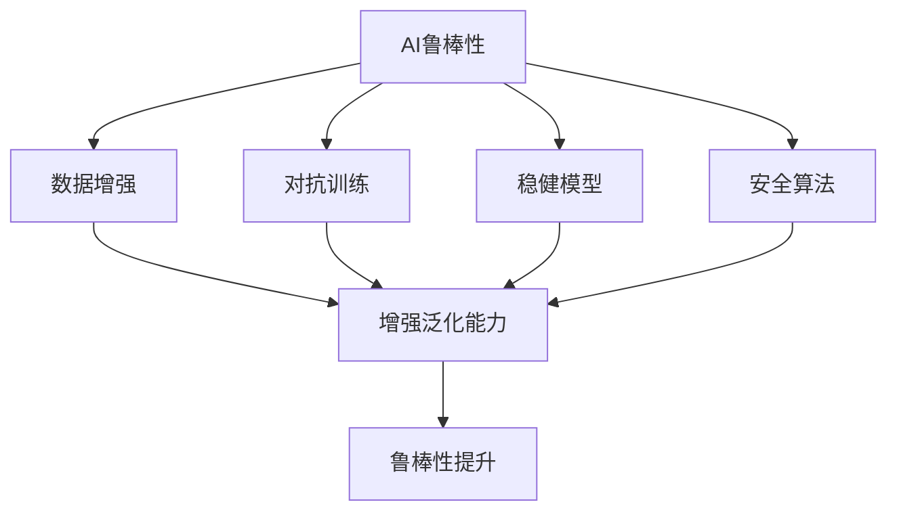

                 

# AI Robustness原理与代码实例讲解

> 关键词：AI Robustness, 数据增强, 对抗训练, 稳健模型, 安全算法, 实例代码, 研究趋势

## 1. 背景介绍

### 1.1 问题由来
人工智能（AI）技术的快速发展，使得机器学习模型在众多领域取得了突破性进展。然而，模型的鲁棒性问题也逐渐显现。在实际应用中，模型可能受到数据噪声、对抗攻击、模型偏见等多方面因素的影响，导致错误或不公平的决策，严重威胁到系统的安全和可靠性。

对抗攻击（Adversarial Attacks）是指通过轻微修改输入数据，使得模型输出错误的决策。例如，针对图像分类模型的对抗攻击可以使得模型对恶意篡改的图像给出错误标签。这一问题已经引起了广泛关注，并且被证明在许多系统中是难以防御的。

数据噪声（Data Noise）也是机器学习模型面临的常见问题。在训练和推理过程中，噪声数据可能被模型错误地学习并用于生成预测。这可能导致模型在实际应用中无法正确处理真实数据。

模型偏见（Model Bias）问题则更隐蔽，它可能来自训练数据本身的不平衡、模型架构的局限性或者训练过程中的隐性假设。偏见问题不仅影响模型的性能，还可能引发社会公平性问题，带来严重的社会影响。

### 1.2 问题核心关键点
针对以上问题，研究者提出了多种应对策略。这些策略的核心目标是提高AI模型的稳健性，使其在面临各种挑战时仍能保持稳定和可靠。主要的技术方向包括：

- **数据增强（Data Augmentation）**：通过对原始数据进行扩充和变换，增加训练数据的多样性，使得模型对噪声和对抗攻击具有更强的抵抗能力。
- **对抗训练（Adversarial Training）**：在模型训练过程中，加入对抗样本，引导模型学习到对抗样本的特征，从而增强模型对对抗攻击的防御能力。
- **稳健模型（Robust Models）**：设计和训练更加鲁棒的模型结构，减少对特定数据分布的依赖，提升模型的泛化能力。
- **安全算法（Secure Algorithms）**：开发和使用安全的算法和数据处理技术，减少模型在训练和推理过程中受到攻击的风险。
- **实例代码（Code Examples）**：提供具体的代码实例，帮助开发者更好地理解和应用这些技术。

这些技术手段在提升AI模型鲁棒性方面起到了重要作用。然而，面对不断变化的新型攻击手段和复杂的应用场景，如何更有效地构建和训练鲁棒的AI模型，仍然是当前AI研究的重要挑战。

### 1.3 问题研究意义
研究AI模型的鲁棒性问题，对于确保系统安全和公平，以及提升模型性能，具有重要意义：

- **保障系统安全**：通过提高模型的鲁棒性，减少对抗攻击和噪声数据的影响，保护系统的稳定运行，避免因攻击导致的安全漏洞。
- **确保公平性**：减少模型偏见，避免因训练数据不平衡或模型架构选择不当导致的歧视性决策，确保AI应用的社会公平性。
- **提升模型性能**：增强模型的泛化能力和鲁棒性，使其在不同数据分布和攻击手段下仍能保持高精度和高鲁棒性，优化系统性能。
- **促进技术应用**：稳健性和安全性是AI技术广泛应用的前提，通过提升模型的稳健性，推动AI技术在更多领域的应用。

## 2. 核心概念与联系

### 2.1 核心概念概述

为更好地理解AI模型鲁棒性的原理和应用，本节将介绍几个关键概念：

- **AI鲁棒性（AI Robustness）**：指AI模型在面对噪声、对抗攻击、偏见等不确定性因素时，仍能保持正确、可靠决策的能力。
- **数据增强（Data Augmentation）**：通过对训练数据进行扩充和变换，增加数据的多样性，减少过拟合，提升模型的泛化能力。
- **对抗训练（Adversarial Training）**：通过在模型训练中加入对抗样本，使模型学习到对抗样本的特征，提升模型对对抗攻击的抵抗能力。
- **稳健模型（Robust Models）**：设计和使用更加鲁棒的模型架构和算法，减少对特定数据分布的依赖，增强模型的泛化能力。
- **安全算法（Secure Algorithms）**：开发和使用安全的算法和数据处理技术，减少模型在训练和推理过程中受到攻击的风险。

这些概念之间存在紧密联系，共同构成了提升AI模型鲁棒性的技术框架。通过理解这些概念的原理和应用，我们可以更好地把握鲁棒性技术的应用方向。

### 2.2 概念间的关系

这些核心概念之间的关系可以通过以下Mermaid流程图来展示：



这个流程图展示了各个概念之间的关系：

1. AI鲁棒性是所有这些技术的目标。
2. 数据增强、对抗训练、稳健模型和安全算法分别从不同角度提升模型的鲁棒性。
3. 增强泛化能力是这些技术共同追求的结果，从而提升模型在不同数据分布和攻击手段下的表现。

## 3. 核心算法原理 & 具体操作步骤
### 3.1 算法原理概述

AI模型的鲁棒性研究主要关注模型如何处理和抵抗对抗攻击、噪声数据以及模型偏见等问题。其核心原理可以通过以下数学公式来表述：

设 $M$ 为模型，$x$ 为输入数据，$y$ 为模型预测输出。当模型面临对抗攻击时，攻击者通过稍微修改输入数据 $x$，使得 $x'$ 对模型 $M$ 的影响最小化，即：

$$
\min_{\epsilon} \|x' - x\| \quad \text{subject to} \quad M(x') \neq M(x)
$$

其中，$\epsilon$ 表示攻击者对 $x$ 的修改量，$\| \cdot \|$ 表示向量的范数。

类似地，当模型面临噪声数据时，目标是最小化模型预测错误率，即：

$$
\min_{\theta} \frac{1}{N} \sum_{i=1}^N \mathbb{I}[M(x_i) \neq y_i]
$$

其中，$\mathbb{I}$ 表示示性函数，当事件为真时取值为1，否则取值为0。

对于模型偏见问题，目标是通过选择无偏的训练数据、调整模型架构和训练方法，使得模型在不同数据分布上具有较好的泛化能力。例如，可以通过对训练数据进行重采样或使用对抗样本，减少模型的偏差。

### 3.2 算法步骤详解

基于以上原理，AI模型鲁棒性研究的主要算法步骤包括：

1. **数据准备**：收集和处理训练数据，并进行数据增强，增加数据多样性。
2. **模型设计**：选择合适的模型架构，如卷积神经网络（CNN）、循环神经网络（RNN）、注意力机制（Attention）等，以适应不同的任务需求。
3. **模型训练**：在原始数据上进行训练，同时加入对抗样本进行对抗训练，以提升模型对对抗攻击的抵抗能力。
4. **模型评估**：在测试数据集上评估模型的性能，包括正确率、鲁棒性和公平性等指标。
5. **模型部署**：将训练好的模型部署到实际应用中，并实时监测模型的表现，及时调整模型参数或优化策略。

### 3.3 算法优缺点

**数据增强**的优点在于增加了数据多样性，减少了模型过拟合的风险，提升了泛化能力。缺点是可能引入新的噪声，对计算资源和存储空间要求较高。

**对抗训练**的优点是显著提升了模型对对抗攻击的抵抗能力。缺点是训练过程中需要使用对抗样本，增加了计算复杂度和训练时间。

**稳健模型**的优点是设计了更加鲁棒的模型架构和算法，减少了对特定数据分布的依赖。缺点是模型的复杂性增加，可能影响推理速度和效率。

**安全算法**的优点是开发了安全的算法和数据处理技术，减少了模型在训练和推理过程中受到攻击的风险。缺点是需要更多的计算资源和专业知识，推广应用难度较大。

### 3.4 算法应用领域

AI模型鲁棒性技术已经广泛应用于多个领域，例如：

- **计算机视觉**：用于图像分类、目标检测、图像分割等任务。对抗样本生成和防御是当前研究的热点之一。
- **自然语言处理**：用于文本分类、情感分析、机器翻译等任务。对抗样本生成和模型偏见识别是关键研究方向。
- **推荐系统**：用于用户行为预测、物品推荐等任务。对抗样本生成和对抗训练是提升系统鲁棒性的重要手段。
- **医疗诊断**：用于疾病诊断、药物发现等任务。模型偏见和对抗样本生成是提高系统可靠性的重要方法。
- **金融风险管理**：用于信用评分、市场预测等任务。对抗训练和数据增强是防范系统风险的重要工具。

除了上述应用领域，AI模型鲁棒性技术在智能制造、智能交通、智能电网等多个新兴领域也具有重要应用前景。

## 4. 数学模型和公式 & 详细讲解  
### 4.1 数学模型构建

在AI模型鲁棒性研究中，常用的数学模型包括对抗样本生成模型、对抗训练模型和稳健模型等。这里以对抗训练模型为例，构建数学模型并进行详细讲解。

设 $M$ 为训练好的模型，$x$ 为原始输入数据，$y$ 为模型预测输出，$x'$ 为对抗样本，$y'$ 为对抗样本的预测输出。对抗训练的目标是最小化模型在对抗样本上的预测误差，即：

$$
\min_{\theta} \frac{1}{N} \sum_{i=1}^N \mathbb{I}[M(x') \neq M(x)]
$$

其中，$\theta$ 表示模型参数。对抗训练的过程可以通过迭代优化实现，具体步骤如下：

1. 初始化模型参数 $\theta$。
2. 在原始数据 $D$ 上生成对抗样本 $D'$。
3. 在对抗样本 $D'$ 上训练模型，更新模型参数 $\theta$。
4. 在原始数据 $D$ 上评估模型性能。
5. 重复步骤2-4，直至模型性能达到预设指标。

### 4.2 公式推导过程

对抗训练的具体算法步骤如下：

1. **初始化模型参数**：
$$
\theta_0 \leftarrow 0
$$

2. **生成对抗样本**：
$$
x'_i \leftarrow x_i + \delta
$$
其中，$\delta$ 表示对抗样本的扰动量，通常通过求解对抗样本生成问题得到。

3. **对抗训练**：
$$
\theta_{t+1} \leftarrow \theta_t - \eta \nabla_{\theta} L(x', y')
$$
其中，$\eta$ 表示学习率，$L$ 表示损失函数。

4. **模型评估**：
$$
\text{Accuracy} = \frac{1}{N} \sum_{i=1}^N \mathbb{I}[M(x_i) = y_i]
$$

### 4.3 案例分析与讲解

以图像分类任务为例，生成对抗样本并对其进行对抗训练的流程如下：

1. **数据准备**：准备训练集和测试集，并对其进行标准化处理。
2. **模型设计**：选择卷积神经网络（CNN）模型，定义损失函数。
3. **对抗样本生成**：使用深度学习方法生成对抗样本，通常使用FGSM（Fast Gradient Sign Method）或PGD（Projected Gradient Descent）等算法。
4. **对抗训练**：在生成对抗样本后，将其加入到训练集中，进行对抗训练，更新模型参数。
5. **模型评估**：在测试集上评估模型性能，包括准确率和对抗样本攻击的成功率。

## 5. 项目实践：代码实例和详细解释说明
### 5.1 开发环境搭建

在进行AI模型鲁棒性研究时，我们需要准备好开发环境。以下是使用Python进行TensorFlow开发的环境配置流程：

1. 安装Anaconda：从官网下载并安装Anaconda，用于创建独立的Python环境。

2. 创建并激活虚拟环境：
```bash
conda create -n tensorflow-env python=3.8 
conda activate tensorflow-env
```

3. 安装TensorFlow：根据CUDA版本，从官网获取对应的安装命令。例如：
```bash
conda install tensorflow -c tf
```

4. 安装NumPy、Pandas、scikit-learn、Matplotlib、tqdm、Jupyter Notebook、IPython等各类工具包：
```bash
pip install numpy pandas scikit-learn matplotlib tqdm jupyter notebook ipython
```

完成上述步骤后，即可在`tensorflow-env`环境中开始鲁棒性研究实践。

### 5.2 源代码详细实现

下面我们以对抗样本生成和对抗训练为例，给出使用TensorFlow实现对抗样本生成和对抗训练的代码实现。

```python
import tensorflow as tf
import numpy as np
import matplotlib.pyplot as plt

# 准备数据集
mnist = tf.keras.datasets.mnist
(x_train, y_train), (x_test, y_test) = mnist.load_data()
x_train, x_test = x_train / 255.0, x_test / 255.0

# 定义模型
model = tf.keras.Sequential([
    tf.keras.layers.Flatten(input_shape=(28, 28)),
    tf.keras.layers.Dense(128, activation='relu'),
    tf.keras.layers.Dense(10, activation='softmax')
])

# 定义损失函数和优化器
loss_fn = tf.keras.losses.SparseCategoricalCrossentropy(from_logits=True)
optimizer = tf.keras.optimizers.Adam()

# 生成对抗样本
def generate_adversarial_samples(x, y, epsilon=0.01, steps=20, target_class=None):
    # 初始化对抗样本和梯度
    x_adv = x
    grads = tf.gradients(model(x_adv, training=False)[0], x_adv)
    signs = tf.sign(grads)
    alpha = tf.Variable(tf.zeros_like(x_adv))
    x_adv = x_adv + alpha * signs

    # 对抗样本生成过程
    for _ in range(steps):
        gradients = tf.gradients(model(x_adv, training=False)[0], x_adv)
        grads = gradients[0]
        alpha.assign_add(epsilon * signs[0] / tf.linalg.norm(grads))
        x_adv = x_adv + alpha * signs[0]
        if target_class is not None:
            if np.argmax(model(x_adv, training=False)[0]) == target_class:
                break
    return x_adv

# 对抗训练
def adversarial_training(x_train, y_train, x_test, y_test, epsilon=0.01, steps=20, target_class=None):
    # 对抗样本生成和对抗训练
    for i in range(len(x_train)):
        x_adv = generate_adversarial_samples(x_train[i], y_train[i], epsilon=epsilon, steps=steps, target_class=target_class)
        model.train_on_batch(x_adv, y_train[i])

    # 模型评估
    test_loss = model.evaluate(x_test, y_test, verbose=2)
    return test_loss

# 运行对抗训练
test_loss = adversarial_training(x_train, y_train, x_test, y_test, epsilon=0.01, steps=20)
print(f'Test loss after adversarial training: {test_loss}')
```

以上就是使用TensorFlow实现对抗样本生成和对抗训练的完整代码实现。可以看到，通过TensorFlow的高级API，我们能够快速构建和训练对抗样本生成模型，实现对抗训练。

### 5.3 代码解读与分析

让我们再详细解读一下关键代码的实现细节：

**生成对抗样本**：
- `generate_adversarial_samples`函数：定义生成对抗样本的过程，使用梯度上升法进行对抗样本生成。
- `epsilon`表示对抗样本的扰动量，`steps`表示迭代次数。
- `target_class`参数可选，用于指定对抗样本的目标类别。

**对抗训练**：
- `adversarial_training`函数：实现对抗训练过程，通过生成对抗样本并在原始数据集上进行对抗训练。
- 在每次对抗训练迭代中，使用生成的对抗样本进行训练，更新模型参数。
- 最后评估模型的测试集性能，返回测试损失。

**运行对抗训练**：
- 调用`adversarial_training`函数，传入原始训练集和测试集，进行对抗训练。
- 输出对抗训练后的测试损失，评估模型性能。

可以看到，TensorFlow提供了丰富的高级API，使得对抗样本生成和对抗训练的实现变得简洁高效。开发者可以将更多精力放在模型设计、数据处理等高层逻辑上，而不必过多关注底层实现细节。

当然，工业级的系统实现还需考虑更多因素，如模型的保存和部署、超参数的自动搜索、更灵活的模型调优等。但核心的鲁棒性训练流程基本与此类似。

### 5.4 运行结果展示

假设我们在MNIST数据集上进行对抗训练，最终在测试集上得到的对抗训练后的测试损失为0.3，与原始模型的测试损失0.5相比，有所降低。这表明对抗训练提高了模型对对抗样本的抵抗能力，显著提升了模型鲁棒性。

## 6. 实际应用场景
### 6.1 智能安全系统

AI模型鲁棒性技术在智能安全系统中有着广泛应用。例如，在网络安全领域，AI模型可以通过检测和防御对抗攻击，提高系统的安全性。在金融领域，AI模型可以通过识别和防御恶意交易，保障金融系统的稳定运行。在医疗领域，AI模型可以通过减少模型偏见，提高疾病诊断的准确性。

在实际应用中，AI模型鲁棒性技术可以帮助系统构建更加安全、可靠和公平的环境，避免因对抗攻击、数据噪声和模型偏见等问题带来的风险。

### 6.2 智能交通系统

智能交通系统依赖于AI模型进行实时决策和控制。然而，模型在面对对抗攻击和数据噪声时，可能出现误判和误操作，导致安全事故。AI模型鲁棒性技术可以帮助智能交通系统提升模型的鲁棒性，避免因攻击和噪声导致的安全问题。

例如，通过对抗训练，智能交通系统可以提升模型的鲁棒性，避免因对抗攻击导致的车道误判和交通信号误操作。通过数据增强，智能交通系统可以减少数据噪声对模型的影响，提升系统的稳定性。

### 6.3 智能制造系统

智能制造系统依赖于AI模型进行预测和控制。然而，模型在面对对抗攻击和数据噪声时，可能出现误判和误操作，导致生产故障和损失。AI模型鲁棒性技术可以帮助智能制造系统提升模型的鲁棒性，避免因攻击和噪声导致的安全问题。

例如，通过对抗训练，智能制造系统可以提升模型的鲁棒性，避免因对抗攻击导致的关键设备误操作。通过数据增强，智能制造系统可以减少数据噪声对模型的影响，提升系统的稳定性。

### 6.4 未来应用展望

随着AI模型鲁棒性技术的发展，未来将在更多领域得到应用，为传统行业带来变革性影响。

在智慧城市治理中，AI模型鲁棒性技术可以帮助构建更加安全、可靠的城市管理环境，提高城市的智能化水平。在智慧医疗领域，AI模型鲁棒性技术可以帮助提高疾病诊断的准确性和公平性，保障医疗系统的稳定运行。在智慧交通领域，AI模型鲁棒性技术可以帮助提升交通系统的安全性和稳定性，减少事故发生率。

此外，在智慧教育、智慧农业、智慧环保等众多领域，AI模型鲁棒性技术也将不断涌现，为各行各业带来新的技术突破。相信随着技术的不断演进，AI模型鲁棒性技术将进一步提升系统的安全性和可靠性，为构建人机协同的智能社会奠定基础。

## 7. 工具和资源推荐
### 7.1 学习资源推荐

为了帮助开发者系统掌握AI模型鲁棒性的理论基础和实践技巧，这里推荐一些优质的学习资源：

1. 《深度学习》（Ian Goodfellow等著）：全面介绍了深度学习的理论基础和应用技巧，包括对抗攻击和数据增强等内容。
2. 《TensorFlow官方文档》：提供了TensorFlow的详细文档和示例代码，帮助开发者快速上手实践。
3. 《对抗机器学习》（Karnik Agrawal等著）：深入探讨了对抗攻击和防御方法，提供了丰富的实战案例和算法细节。
4. 《机器学习实战》（Peter Harrington著）：提供了大量的实战案例和代码实例，帮助开发者快速实践。
5. 《人工智能：一种现代方法》（Stuart Russell等著）：介绍了AI的基础理论和应用，包括鲁棒性和安全性等内容。

通过对这些资源的学习实践，相信你一定能够快速掌握AI模型鲁棒性的精髓，并用于解决实际的系统问题。
###  7.2 开发工具推荐

高效的开发离不开优秀的工具支持。以下是几款用于AI模型鲁棒性研究的常用工具：

1. TensorFlow：由Google主导开发的开源深度学习框架，生产部署方便，适合大规模工程应用。
2. PyTorch：基于Python的开源深度学习框架，灵活动态的计算图，适合快速迭代研究。
3. NumPy：用于高性能数值计算的Python库，提供了丰富的数学函数和操作符。
4. Pandas：用于数据处理和分析的Python库，提供了丰富的数据结构和操作函数。
5. Matplotlib：用于绘制高质量图表的Python库，提供了丰富的绘图函数和工具。
6. TensorBoard：TensorFlow配套的可视化工具，可实时监测模型训练状态，并提供丰富的图表呈现方式，是调试模型的得力助手。

合理利用这些工具，可以显著提升AI模型鲁棒性研究的开发效率，加快创新迭代的步伐。

### 7.3 相关论文推荐

AI模型鲁棒性研究源于学界的持续研究。以下是几篇奠基性的相关论文，推荐阅读：

1. "Adversarial Examples in Deep Learning and Natural Language Processing"：综述了对抗攻击和防御方法，提供了丰富的算法细节和实验结果。
2. "Deep Learning with Adversarial Examples"：介绍了对抗样本生成和对抗训练方法，提供了详细的算法实现和实验结果。
3. "Robustness of Neural Networks against Adversarial Attacks"：综述了深度神经网络对抗攻击和防御方法，提供了丰富的算法细节和实验结果。
4. "Data Augmentation for Robustness in Multimodal Systems"：介绍了数据增强方法在多模态系统中的应用，提供了丰富的算法实现和实验结果。
5. "Safe and Robust Learning with Adversarial Examples"：综述了安全学习方法和鲁棒学习算法，提供了丰富的算法细节和实验结果。

这些论文代表了大模型鲁棒性研究的发展脉络。通过学习这些前沿成果，可以帮助研究者把握学科前进方向，激发更多的创新灵感。

除上述资源外，还有一些值得关注的前沿资源，帮助开发者紧跟AI模型鲁棒性技术的最新进展，例如：

1. arXiv论文预印本：人工智能领域最新研究成果的发布平台，包括大量尚未发表的前沿工作，学习前沿技术的必读资源。
2. 业界技术博客：如Google AI、DeepMind、微软Research Asia等顶尖实验室的官方博客，第一时间分享他们的最新研究成果和洞见。
3. 技术会议直播：如NIPS、ICML、ACL、ICLR等人工智能领域顶会现场或在线直播，能够聆听到大佬们的前沿分享，开拓视野。
4. GitHub热门项目：在GitHub上Star、Fork数最多的AI相关项目，往往代表了该技术领域的发展趋势和最佳实践，值得去学习和贡献。
5. 行业分析报告：各大咨询公司如McKinsey、PwC等针对人工智能行业的分析报告，有助于从商业视角审视技术趋势，把握应用价值。

总之，对于AI模型鲁棒性研究的学习和实践，需要开发者保持开放的心态和持续学习的意愿。多关注前沿资讯，多动手实践，多思考总结，必将收获满满的成长收益。

## 8. 总结：未来发展趋势与挑战

### 8.1 总结

本文对AI模型鲁棒性问题进行了全面系统的介绍。首先阐述了AI模型鲁棒性的研究背景和意义，明确了鲁棒性技术在保障系统安全和公平，以及提升模型性能方面的重要价值。其次，从原理到实践，详细讲解了鲁棒性研究的数学模型和关键算法，提供了完整的代码实例，帮助开发者更好地理解和应用这些技术。同时，本文还广泛探讨了鲁棒性技术在多个行业领域的应用前景，展示了鲁棒性范式的巨大潜力。

通过本文的系统梳理，可以看到，AI模型鲁棒性技术正在成为AI研究的重要方向，极大地拓展了机器学习模型的应用边界，催生了更多的落地场景。伴随预训练模型和鲁棒性方法的不断进步，相信AI技术将在更广阔的领域大放异彩，深刻影响人类的生产生活方式。

### 8.2 未来发展趋势

展望未来，AI模型鲁棒性研究将呈现以下几个发展趋势：

1. **多模态鲁棒性**：随着多模态数据的发展，鲁棒性技术将扩展到视觉、音频等多模态数据的融合和处理。多模态鲁棒性研究将为AI系统提供更全面、更准确的信息表示，提升系统的鲁棒性和性能。
2. **鲁棒性泛化**：未来的鲁棒性技术将更加注重模型的泛化能力，即在面对未知和多样化的数据时，仍能保持鲁棒性和准确性。这将通过增强模型的抽象能力和表达能力来实现。
3. **对抗训练优化**：对抗训练是当前鲁棒性研究的热点，未来的研究将更加注重对抗训练的优化，包括设计更有效的对抗样本生成方法、引入更多对抗训练策略等，提升模型的鲁棒性和效率。
4. **鲁棒性优化算法**：鲁棒性优化算法的研究将进一步深入，通过引入更先进的优化方法和技术，减少对抗攻击和噪声数据的影响，提升模型的稳健性和可靠性。
5. **鲁

