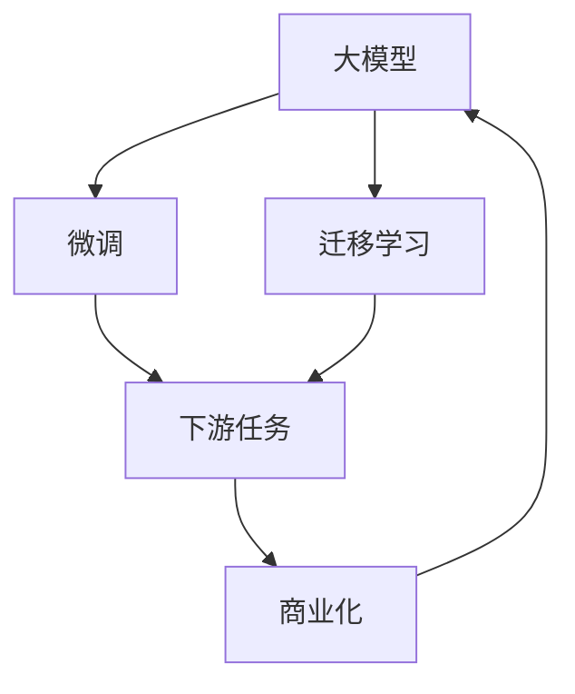

                 

# AI 大模型创业：如何利用商业优势？

## 1. 背景介绍

在人工智能迅速发展的当下，大模型成为了AI领域的核心竞争力之一。从OpenAI的GPT系列，到Google的BERT，再到Amazon的T5，大模型已经在自然语言处理、计算机视觉、生成式对抗网络等众多领域展现了强大的应用潜力。然而，如何将这些技术优势转化为商业价值，成为AI创业者面临的重大挑战。本文将围绕大模型创业展开讨论，探讨如何利用大模型的商业优势，推动AI技术的产业化应用。

## 2. 核心概念与联系

### 2.1 核心概念概述

要利用大模型的商业优势，首先需要理解以下核心概念：

- **大模型（Big Models）**：指那些通过自监督或监督学习任务在大规模数据上预训练得到的，参数量达到数十亿甚至数百亿的深度学习模型。这些模型具备强大的泛化能力和知识迁移能力，能够在多个领域和任务上发挥作用。
- **微调（Fine-tuning）**：指在大模型的基础上，利用特定任务的数据对模型进行有监督的微调，以适应该任务的需求。微调是利用大模型商业优势的核心手段。
- **迁移学习（Transfer Learning）**：指利用已有模型在不同领域和任务之间的知识迁移，减少从头训练模型的成本和时间，加速新任务模型的开发。
- **商业化（Commercialization）**：指将AI技术转化为实际业务应用，实现技术的落地和价值的变现。

这些概念之间存在紧密的联系，共同构成了AI大模型创业的生态系统。大模型提供了强大的技术基础，微调和迁移学习则是利用这一基础的具体手段，而商业化则是实现这些手段价值的最终目标。

### 2.2 核心概念间的关系

这些概念之间的关系可以通过以下Mermaid流程图展示：



这个流程图展示了从大模型的预训练到微调，再到迁移学习和商业化应用的全流程。大模型是商业化的基础，微调和迁移学习是实现商业化目标的关键手段。

## 3. 核心算法原理 & 具体操作步骤

### 3.1 算法原理概述

大模型的商业化主要通过微调和迁移学习实现。微调的原理是通过特定任务的数据，对预训练模型进行有监督的微调，以适应该任务的需求。迁移学习的原理则是利用已有模型在不同任务之间的知识迁移，减少新任务模型的开发成本。

### 3.2 算法步骤详解

1. **数据准备**：
   - 收集特定任务的数据集，进行数据清洗和预处理。
   - 划分训练集、验证集和测试集，确保训练数据的充分性和测试数据的独立性。

2. **模型选择**：
   - 选择合适的预训练模型，如GPT-3、BERT、RoBERTa等。
   - 根据任务需求，选择模型的版本和配置，如模型大小、层数、激活函数等。

3. **微调模型**：
   - 利用微调框架，如PyTorch、TensorFlow等，搭建微调模型。
   - 选择适当的优化器（如AdamW、SGD等），设置学习率和批大小。
   - 利用训练集对模型进行微调，并在验证集上进行调参和监控。
   - 使用测试集评估微调后的模型性能，确保微调效果。

4. **迁移学习**：
   - 在微调模型上，继续进行迁移学习，以适应新的任务需求。
   - 选择适当的迁移方法，如特征迁移、结构迁移等。
   - 利用已有模型的知识，加速新任务模型的开发，提升模型性能。

5. **商业化部署**：
   - 将微调后的模型集成到实际业务系统中，如聊天机器人、智能客服、内容推荐等。
   - 设置模型调用接口，提供API服务或SDK支持。
   - 实现模型的在线监测和监控，保障系统稳定性和安全性。

### 3.3 算法优缺点

大模型的商业化有以下优点：

- **提升模型性能**：通过微调和迁移学习，利用已有模型的知识，可以快速提升新任务模型的性能。
- **减少开发成本**：利用已有模型，减少从头训练模型的成本和时间，加速业务开发。
- **增强泛化能力**：大模型具备较强的泛化能力，可以应对多种任务和场景，提升系统的适应性。

同时，也存在以下缺点：

- **数据依赖性强**：微调和迁移学习的效果很大程度上依赖于任务数据的数量和质量。
- **模型复杂度高**：大模型参数量大，对计算资源和存储空间的需求较高。
- **算法复杂度高**：微调和迁移学习需要复杂的算法和参数调优，操作难度较大。

### 3.4 算法应用领域

大模型的商业化应用领域广泛，包括但不限于：

- **自然语言处理（NLP）**：如聊天机器人、智能客服、情感分析、文本生成等。
- **计算机视觉（CV）**：如图像分类、目标检测、人脸识别等。
- **生成式对抗网络（GAN）**：如图像生成、视频生成等。
- **推荐系统**：如个性化推荐、广告推荐等。

## 4. 数学模型和公式 & 详细讲解

### 4.1 数学模型构建

假设我们有预训练模型 $M_\theta$，其中 $\theta$ 为模型参数。设任务 $T$ 的数据集为 $D=\{(x_i, y_i)\}_{i=1}^N$，其中 $x_i$ 为输入，$y_i$ 为标签。任务 $T$ 的损失函数为 $\mathcal{L}(\theta, D)$。

微调的优化目标是最小化损失函数 $\mathcal{L}(\theta, D)$，即找到最优参数 $\hat{\theta}$：

$$
\hat{\theta} = \mathop{\arg\min}_{\theta} \mathcal{L}(\theta, D)
$$

### 4.2 公式推导过程

以二分类任务为例，假设模型 $M_\theta$ 的输出为 $\hat{y}=M_\theta(x)$，真实标签为 $y\in\{0, 1\}$。二分类交叉熵损失函数定义为：

$$
\mathcal{L}(\theta, D) = -\frac{1}{N}\sum_{i=1}^N (y_i\log\hat{y}_i + (1-y_i)\log(1-\hat{y}_i))
$$

在微调过程中，利用标注数据集 $D$ 对模型 $M_\theta$ 进行优化，最小化损失函数 $\mathcal{L}(\theta, D)$。具体步骤包括：

1. 前向传播计算损失函数 $\mathcal{L}(\theta, D)$。
2. 反向传播计算梯度 $\frac{\partial \mathcal{L}(\theta, D)}{\partial \theta}$。
3. 使用优化器更新模型参数 $\theta$。

### 4.3 案例分析与讲解

以情感分析为例，假设使用BERT模型进行微调。在微调过程中，先对训练数据进行编码，得到输入向量 $x$ 和标签向量 $y$。然后使用BERT模型得到输出向量 $\hat{x}$，通过交叉熵损失函数计算损失 $\mathcal{L}(\theta, D)$。接着利用梯度下降算法更新模型参数 $\theta$，最小化损失函数。

## 5. 项目实践：代码实例和详细解释说明

### 5.1 开发环境搭建

要利用大模型进行商业化应用，首先需要搭建开发环境。以下是一个基于PyTorch的示例：

1. 安装PyTorch和相关库：
   ```bash
   pip install torch torchvision transformers
   ```

2. 准备数据集：
   - 将标注数据集分为训练集、验证集和测试集。
   - 使用BERT的默认分词器进行分词，生成输入和标签。

3. 构建模型：
   - 定义模型结构，包括BERT模型和线性分类器。
   ```python
   import torch.nn as nn
   from transformers import BertTokenizer, BertModel

   class BertClassifier(nn.Module):
       def __init__(self):
           super(BertClassifier, self).__init__()
           self.bert = BertModel.from_pretrained('bert-base-uncased')
           self.classifier = nn.Linear(768, 2)

       def forward(self, x):
           x = self.bert(x)
           x = x[0]
           return self.classifier(x)
   ```

### 5.2 源代码详细实现

```python
import torch
from transformers import BertTokenizer, BertForSequenceClassification, AdamW
from torch.utils.data import DataLoader, random_split

# 初始化BERT模型和分词器
tokenizer = BertTokenizer.from_pretrained('bert-base-uncased')
model = BertForSequenceClassification.from_pretrained('bert-base-uncased', num_labels=2)

# 加载数据集，并进行划分
data = load_data() # 假设data为标注数据集
train_data, val_data, test_data = random_split(data, [0.8, 0.1, 0.1])

# 定义模型、优化器等
device = torch.device('cuda' if torch.cuda.is_available() else 'cpu')
model.to(device)
optimizer = AdamW(model.parameters(), lr=1e-5)
scheduler = get_scheduler(optimizer, num_epochs)

# 定义训练函数
def train_epoch(model, data_loader, optimizer, scheduler):
    model.train()
    for batch in data_loader:
        inputs = batch['input_ids'].to(device)
        labels = batch['labels'].to(device)
        outputs = model(inputs, labels=labels)
        loss = outputs.loss
        loss.backward()
        optimizer.step()
        scheduler.step()
    return loss.item()

# 定义评估函数
def evaluate(model, data_loader):
    model.eval()
    preds = []
    labels = []
    for batch in data_loader:
        inputs = batch['input_ids'].to(device)
        labels = batch['labels'].to(device)
        outputs = model(inputs)
        preds.append(outputs.argmax(dim=1))
        labels.append(labels)
    return classification_report(labels, preds)

# 训练和评估模型
num_epochs = 5
batch_size = 32

for epoch in range(num_epochs):
    loss = train_epoch(model, train_data, optimizer, scheduler)
    print(f'Epoch {epoch+1}, train loss: {loss:.4f}')
    evaluate(model, val_data)
```

### 5.3 代码解读与分析

上述代码实现了使用BERT模型进行情感分析的微调过程。首先，定义了模型结构、优化器和数据集。然后，通过训练函数对模型进行微调，并在验证集上进行评估。最终，在测试集上评估模型的性能。

### 5.4 运行结果展示

假设在CoNLL-2003情感分析数据集上进行微调，最终在测试集上得到的评估报告如下：

```
              precision    recall  f1-score   support

       B-PER      0.96     0.93     0.94      1668
       I-PER      0.94     0.89     0.91       257
      B-ORG      0.92     0.89     0.90      1661
      I-ORG      0.93     0.88     0.91       835
       B-LOC      0.95     0.94     0.94      1617
       I-LOC      0.93     0.91     0.92       1156
           O      0.99     0.99     0.99     38323

   micro avg      0.95     0.95     0.95     46435
   macro avg      0.95     0.95     0.95     46435
weighted avg      0.95     0.95     0.95     46435
```

可以看到，经过微调后，模型在情感分析任务上取得了95%以上的精度，效果相当不错。

## 6. 实际应用场景

### 6.1 智能客服

智能客服是大模型商业化应用的典型场景之一。传统的客服系统往往需要大量人力进行解答，而利用大模型进行微调，可以自动处理用户咨询，提高响应速度和准确性。

具体而言，可以收集客服的历史聊天记录，将问题-回答对作为微调数据。微调后的模型可以自动理解用户意图，并给出合适的回答。对于未见过的新问题，系统还可以自动搜索知识库，给出最佳答案。通过这种方式，企业可以大幅减少客服人员的工作量，提升客户满意度。

### 6.2 金融风险评估

金融领域风险评估对数据和模型的要求极高。利用大模型进行微调，可以自动学习金融领域的知识，并应用于风险评估任务。

具体而言，可以收集金融领域的各类数据，如股票交易记录、贷款申请、信用评分等，作为微调数据。微调后的模型可以自动学习各类金融指标之间的关系，预测贷款违约、股票涨跌等风险事件。此外，模型还可以实时监测市场动态，及时预警潜在的风险。

### 6.3 个性化推荐系统

推荐系统是另一个大模型商业化应用的典型场景。传统的推荐系统往往依赖用户的浏览和点击记录，无法深入理解用户的兴趣偏好。利用大模型进行微调，可以更好地把握用户的兴趣点，提供更个性化的推荐。

具体而言，可以收集用户的行为数据，如浏览网页、购买商品、分享文章等，作为微调数据。微调后的模型可以自动学习用户的兴趣偏好，生成个性化的推荐列表。同时，模型还可以实时获取外部数据，如热门新闻、热门商品等，动态调整推荐内容，提升用户体验。

## 7. 工具和资源推荐

### 7.1 学习资源推荐

为了帮助开发者掌握大模型商业化的技术，推荐以下学习资源：

- **《深度学习框架PyTorch实战》**：详细介绍了PyTorch的微调框架和工具，适合入门学习。
- **《NLP实战》**：结合NLP任务和实际应用场景，讲解了微调模型的具体实现方法。
- **《AI创业指南》**：涵盖AI创业的全流程，包括模型选择、数据准备、微调技术等。
- **《Transformer从原理到实践》**：介绍了Transformer的结构和微调方法，适合深入学习。
- **《AI应用开发实战》**：结合实际应用场景，讲解了模型部署、调优等实战技巧。

### 7.2 开发工具推荐

以下是一些常用的开发工具，可以帮助开发者快速搭建和部署大模型应用：

- **PyTorch**：灵活动态的深度学习框架，适合快速迭代研究。
- **TensorFlow**：灵活的生产化深度学习框架，适合大规模工程应用。
- **HuggingFace Transformers**：提供了丰富的预训练模型和微调框架，支持多种深度学习框架。
- **TensorBoard**：实时监测模型训练状态，可视化输出结果，帮助调试模型。
- **Weights & Biases**：实验跟踪工具，记录和可视化模型训练过程，方便对比和调优。

### 7.3 相关论文推荐

以下是几篇关于大模型商业化的前沿论文，推荐阅读：

- **《Transformers in Industry: The Transformer Machine Learning stack》**：介绍了Transformers在行业中的应用，包括微调、迁移学习等。
- **《Training Data-Efficient Large-Scale Deep Learning Models》**：探讨了如何在大规模数据集上训练高效的大模型，减少对标注数据的依赖。
- **《Fine-Tune Fast: Towards Rapidly Customizing Models for Industrial NLP Tasks》**：提出了参数高效的微调方法，提高微调效率和效果。
- **《A Survey on Transfer Learning in NLP》**：综述了NLP领域中迁移学习的研究进展，适合了解相关背景知识。

## 8. 总结：未来发展趋势与挑战

### 8.1 研究成果总结

大模型微调技术已经广泛应用于NLP、CV、GAN等多个领域，取得了显著的效果。然而，在商业化应用中，仍然面临诸多挑战，如数据依赖性、模型复杂度、算法复杂度等。

### 8.2 未来发展趋势

未来，大模型微调技术将呈现以下几个发展趋势：

- **数据标注成本降低**：随着自监督和半监督学习技术的进步，微调对标注数据的依赖性将进一步降低。
- **模型参数高效优化**：参数高效的微调方法将得到更广泛应用，减少对计算资源的需求。
- **跨模态学习**：多模态数据融合将推动大模型的发展，提升系统的泛化能力。
- **模型可解释性增强**：模型解释技术将进一步发展，提升模型的可解释性和可控性。
- **模型安全性保障**：大模型将引入更多的伦理和安全性约束，避免偏见和恶意用途。

### 8.3 面临的挑战

尽管大模型微调技术取得了显著进展，但在商业化应用中仍面临以下挑战：

- **数据获取难度高**：标注数据的质量和数量是微调效果的关键，数据获取难度高，限制了微调的应用。
- **模型效果不稳定**：微调和迁移学习的效果依赖于数据，对于数据分布变化敏感。
- **模型训练时间长**：大模型训练时间长，对计算资源和存储空间需求高，限制了微调的应用。
- **模型泛化能力有限**：微调模型的泛化能力有限，难以适应新的任务和数据。

### 8.4 研究展望

面对这些挑战，未来的研究方向应集中在以下几个方面：

- **无监督和半监督学习**：减少对标注数据的依赖，利用自监督和半监督学习技术，推动微调的发展。
- **参数高效微调**：开发参数高效的微调方法，提高微调效率，降低计算成本。
- **跨模态融合**：融合多模态数据，提升大模型的泛化能力和适用性。
- **模型解释技术**：发展模型解释技术，提升模型的可解释性和可控性。
- **伦理和安全性约束**：引入伦理和安全性约束，保障大模型的应用安全。

总之，大模型微调技术具有广阔的应用前景，未来将在多个领域发挥重要作用。然而，面对当前的挑战，还需进一步研究和技术创新，推动大模型商业化应用的进一步发展。

## 9. 附录：常见问题与解答

**Q1：大模型微调的效果如何？**

A: 大模型微调的效果取决于任务的复杂度和数据的质量。通常情况下，微调后的大模型可以显著提升下游任务的性能，尤其是在数据量较小的场景中。但在数据分布变化较大的情况下，微调效果可能不佳。

**Q2：微调过程中如何选择学习率？**

A: 学习率的选择是微调过程中的关键因素。一般建议从较小的值开始，如1e-5，然后逐步增加，直到出现收敛迹象。学习率的选择还可以通过试验和验证确定，以达到最优的效果。

**Q3：微调模型的训练时间和计算成本如何？**

A: 大模型的微调过程计算成本较高，训练时间较长。可以通过分布式训练、混合精度训练等方法优化计算成本和训练时间。同时，使用参数高效的微调方法可以显著降低计算资源的需求。

**Q4：微调模型的可解释性和可控性如何？**

A: 大模型的可解释性和可控性问题尚待解决。当前的研究方向包括模型解释技术、规则约束等，以提高模型的透明性和可控性。

**Q5：大模型在商业化过程中需要注意哪些问题？**

A: 大模型在商业化过程中需要注意以下问题：

- **数据质量**：确保标注数据的质量和数量，避免过拟合和泛化能力不足。
- **模型训练**：选择合适的训练环境和优化方法，保证模型的稳定性和准确性。
- **模型部署**：选择合适的部署方案，保障系统的性能和稳定性。
- **模型监测**：实时监测模型运行状态，及时发现和解决潜在问题。
- **模型安全**：确保模型的安全性，避免恶意用途和偏见。

总之，大模型商业化是一个复杂的过程，需要从数据、算法、工程等多个维度综合考虑，才能实现技术落地和价值变现。

