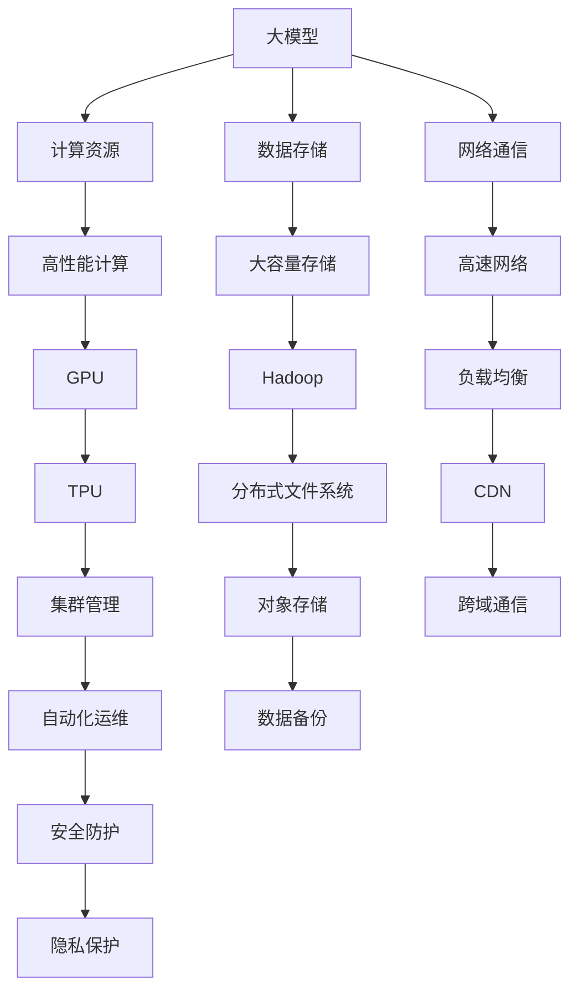
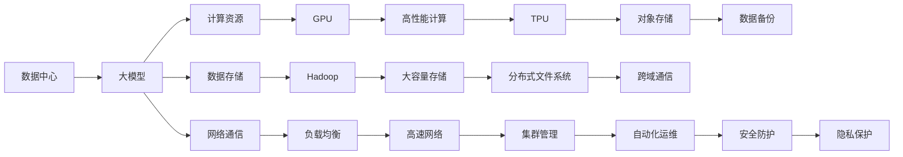
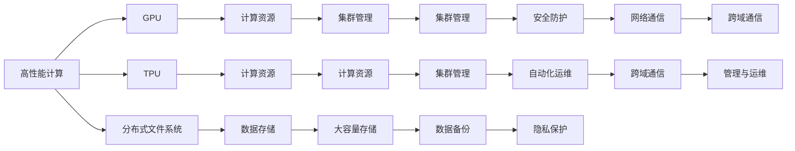

                 

# AI 大模型应用数据中心建设：数据中心技术与应用

> 关键词：大模型,数据中心,数据基础设施,计算资源,数据存储,网络安全,人工智能,深度学习,高性能计算,云计算

## 1. 背景介绍

### 1.1 问题由来

随着人工智能(AI)技术的快速发展，大模型（Large Model）在各个领域的应用日益广泛。大模型通常指拥有数亿甚至数十亿参数的深度神经网络，其具备强大的数据处理能力和泛化能力。然而，大模型的训练和应用需要庞大的计算资源和存储空间，这就对数据中心（Data Center）的硬件和软件架构提出了极高的要求。

大模型的训练通常需要多显卡、高性能计算集群和高速网络等基础设施支持。训练过程涉及大规模数据输入输出、复杂的网络结构和大量的计算运算，对数据中心的计算和存储能力提出了极高的要求。同时，大模型的推理和部署也需要稳定的数据中心环境来支撑。

因此，如何建设高效、安全、可靠的数据中心，以支持大模型的训练、推理和部署，成为当前AI领域的一个重要课题。

### 1.2 问题核心关键点

大模型应用数据中心建设的核心关键点包括：

- **计算资源**：大模型需要强大的计算能力，数据中心应配备高性能计算集群，支持GPU、TPU等加速器。
- **数据存储**：大模型训练和推理需要大量数据，数据中心应具备高速、大容量的数据存储系统。
- **网络通信**：大模型训练和推理需要高速、低延迟的网络通信，数据中心应支持高速网络架构。
- **安全与隐私**：大模型涉及大量敏感数据，数据中心应具备高安全性和隐私保护措施。
- **管理与运维**：大模型训练和推理需要高水平的管理和运维能力，数据中心应具备自动化运维和监控系统。
- **跨域合作**：大模型的应用往往涉及多方协作，数据中心应支持跨云、跨区域的网络连接和数据传输。

本文将围绕上述关键点，全面阐述数据中心的建设和优化策略，以支持大模型的应用需求。

### 1.3 问题研究意义

建设高效、安全、可靠的数据中心，对于大模型的应用至关重要。数据中心作为AI技术的底层基础设施，其性能和可靠性直接影响着AI系统的整体表现。良好的数据中心环境，不仅能够保障大模型的正常训练和推理，还能大幅提升AI系统的效率和性能，推动AI技术的落地应用。

通过建设高水平的数据中心，可以为AI企业提供稳定的技术支撑，降低技术实施的成本和风险，加速AI技术的产业化进程。同时，数据中心的高效建设和运行，还能够带来显著的节能减排效果，符合绿色可持续发展的理念。

## 2. 核心概念与联系

### 2.1 核心概念概述

为了更好地理解大模型应用数据中心的建设，本节将介绍几个密切相关的核心概念：

- **大模型（Large Model）**：指拥有数亿甚至数十亿参数的深度神经网络，具备强大的数据处理和泛化能力。
- **数据中心（Data Center）**：指由多个服务器、存储设备和网络设备组成的大型计算基础设施，能够提供高性能计算和存储服务。
- **计算资源（Computing Resource）**：指数据中心内可用的计算能力，包括CPU、GPU、TPU等加速器。
- **数据存储（Data Storage）**：指数据中心内用于存储数据的设备和方法，包括磁盘、SSD、Hadoop等。
- **网络通信（Network Communication）**：指数据中心内服务器和设备之间的数据传输和通信，包括高速网络、负载均衡等。
- **安全与隐私（Security & Privacy）**：指数据中心内对数据和计算资源的保护措施，包括加密、访问控制等。
- **管理与运维（Management & Operation）**：指数据中心内对硬件和软件的管理和维护，包括自动化运维、监控系统等。
- **跨域合作（Cross-domain Collaboration）**：指数据中心内支持不同云平台和区域的网络连接和数据传输。

这些核心概念之间的逻辑关系可以通过以下Mermaid流程图来展示：



这个流程图展示了大模型应用数据中心的整体架构，其中各个组件通过网络通信协同工作，共同支撑大模型的训练、推理和部署。

### 2.2 概念间的关系

这些核心概念之间存在着紧密的联系，形成了数据中心建设和优化的完整生态系统。下面我通过几个Mermaid流程图来展示这些概念之间的关系。

#### 2.2.1 数据中心与大模型的关系



这个流程图展示了数据中心与大模型的关系，大模型通过数据中心的计算、存储和网络资源进行训练和推理，数据中心为大规模模型的应用提供必要的支持。

#### 2.2.2 数据中心各组件的关系



这个流程图展示了数据中心内各组件的关系，各个组件协同工作，为大模型的训练和推理提供全面的支持。

### 2.3 核心概念的整体架构

最后，我们用一个综合的流程图来展示这些核心概念在大模型应用数据中心建设过程中的整体架构：

```mermaid
graph TB
    A[计算资源] --> B[高性能计算]
    A --> C[GPU]
    A --> D[TPU]
    B --> E[大模型]
    C --> F[GPU集群]
    D --> G[TPU集群]
    E --> H[训练]
    E --> I[推理]
    H --> J[模型训练]
    I --> K[模型推理]
    J --> L[数据输入]
    K --> M[数据输出]
    L --> N[存储]
    M --> O[存储]
    N --> P[网络通信]
    O --> Q[网络通信]
    P --> R[数据传输]
    Q --> S[数据传输]
    R --> T[数据备份]
    S --> U[数据备份]
    T --> V[自动化运维]
    U --> W[自动化运维]
    V --> X[监控系统]
    W --> Y[监控系统]
    X --> Z[网络安全]
    Y --> AA[网络安全]
    Z --> BB[安全防护]
    AA --> CC[安全防护]
    BB --> DD[隐私保护]
    CC --> EE[隐私保护]
    DD --> FF[隐私保护]
    EE --> GG[隐私保护]
    FF --> HH[管理与运维]
    GG --> II[管理与运维]
    HH --> JJ[跨域合作]
    II --> KK[跨域合作]
    JJ --> LL[跨域通信]
    KK --> MM[跨域通信]
    LL --> NN[跨域通信]
    MM --> OO[跨域通信]
    NN --> PP[跨域通信]
    OO --> QQ[跨域通信]
    PP --> RR[跨域通信]
    QQ --> SS[跨域通信]
    RR --> TT[跨域通信]
    SS --> UU[跨域通信]
    TT --> VV[跨域通信]
    VV --> WW[跨域通信]
    WW --> XX[跨域通信]
    XX --> YY[跨域通信]
    YY --> ZZ[跨域通信]
    ZZ --> AA[跨域通信]
    AA --> BB[跨域通信]
    BB --> CC[跨域通信]
    CC --> DD[跨域通信]
    DD --> EE[跨域通信]
    EE --> FF[跨域通信]
    FF --> GG[跨域通信]
    GG --> HH[跨域通信]
    HH --> II[跨域通信]
    II --> JJ[跨域通信]
    JJ --> LL[跨域通信]
    LL --> MM[跨域通信]
    MM --> NN[跨域通信]
    NN --> OO[跨域通信]
    OO --> PP[跨域通信]
    PP --> QQ[跨域通信]
    QQ --> RR[跨域通信]
    RR --> SS[跨域通信]
    SS --> TT[跨域通信]
    TT --> UU[跨域通信]
    UU --> VV[跨域通信]
    VV --> WW[跨域通信]
    WW --> XX[跨域通信]
    XX --> YY[跨域通信]
    YY --> ZZ[跨域通信]
    ZZ --> AA[跨域通信]
    AA --> BB[跨域通信]
    BB --> CC[跨域通信]
    CC --> DD[跨域通信]
    DD --> EE[跨域通信]
    EE --> FF[跨域通信]
    FF --> GG[跨域通信]
    GG --> HH[跨域通信]
    HH --> II[跨域通信]
    II --> JJ[跨域通信]
    JJ --> LL[跨域通信]
    LL --> MM[跨域通信]
    MM --> NN[跨域通信]
    NN --> OO[跨域通信]
    OO --> PP[跨域通信]
    PP --> QQ[跨域通信]
    QQ --> RR[跨域通信]
    RR --> SS[跨域通信]
    SS --> TT[跨域通信]
    TT --> UU[跨域通信]
    UU --> VV[跨域通信]
    VV --> WW[跨域通信]
    WW --> XX[跨域通信]
    XX --> YY[跨域通信]
    YY --> ZZ[跨域通信]
    ZZ --> AA[跨域通信]
    AA --> BB[跨域通信]
    BB --> CC[跨域通信]
    CC --> DD[跨域通信]
    DD --> EE[跨域通信]
    EE --> FF[跨域通信]
    FF --> GG[跨域通信]
    GG --> HH[跨域通信]
    HH --> II[跨域通信]
    II --> JJ[跨域通信]
    JJ --> LL[跨域通信]
    LL --> MM[跨域通信]
    MM --> NN[跨域通信]
    NN --> OO[跨域通信]
    OO --> PP[跨域通信]
    PP --> QQ[跨域通信]
    QQ --> RR[跨域通信]
    RR --> SS[跨域通信]
    SS --> TT[跨域通信]
    TT --> UU[跨域通信]
    UU --> VV[跨域通信]
    VV --> WW[跨域通信]
    WW --> XX[跨域通信]
    XX --> YY[跨域通信]
    YY --> ZZ[跨域通信]
    ZZ --> AA[跨域通信]
    AA --> BB[跨域通信]
    BB --> CC[跨域通信]
    CC --> DD[跨域通信]
    DD --> EE[跨域通信]
    EE --> FF[跨域通信]
    FF --> GG[跨域通信]
    GG --> HH[跨域通信]
    HH --> II[跨域通信]
    II --> JJ[跨域通信]
    JJ --> LL[跨域通信]
    LL --> MM[跨域通信]
    MM --> NN[跨域通信]
    NN --> OO[跨域通信]
    OO --> PP[跨域通信]
    PP --> QQ[跨域通信]
    QQ --> RR[跨域通信]
    RR --> SS[跨域通信]
    SS --> TT[跨域通信]
    TT --> UU[跨域通信]
    UU --> VV[跨域通信]
    VV --> WW[跨域通信]
    WW --> XX[跨域通信]
    XX --> YY[跨域通信]
    YY --> ZZ[跨域通信]
    ZZ --> AA[跨域通信]
    AA --> BB[跨域通信]
    BB --> CC[跨域通信]
    CC --> DD[跨域通信]
    DD --> EE[跨域通信]
    EE --> FF[跨域通信]
    FF --> GG[跨域通信]
    GG --> HH[跨域通信]
    HH --> II[跨域通信]
    II --> JJ[跨域通信]
    JJ --> LL[跨域通信]
    LL --> MM[跨域通信]
    MM --> NN[跨域通信]
    NN --> OO[跨域通信]
    OO --> PP[跨域通信]
    PP --> QQ[跨域通信]
    QQ --> RR[跨域通信]
    RR --> SS[跨域通信]
    SS --> TT[跨域通信]
    TT --> UU[跨域通信]
    UU --> VV[跨域通信]
    VV --> WW[跨域通信]
    WW --> XX[跨域通信]
    XX --> YY[跨域通信]
    YY --> ZZ[跨域通信]
    ZZ --> AA[跨域通信]
    AA --> BB[跨域通信]
    BB --> CC[跨域通信]
    CC --> DD[跨域通信]
    DD --> EE[跨域通信]
    EE --> FF[跨域通信]
    FF --> GG[跨域通信]
    GG --> HH[跨域通信]
    HH --> II[跨域通信]
    II --> JJ[跨域通信]
    JJ --> LL[跨域通信]
    LL --> MM[跨域通信]
    MM --> NN[跨域通信]
    NN --> OO[跨域通信]
    OO --> PP[跨域通信]
    PP --> QQ[跨域通信]
    QQ --> RR[跨域通信]
    RR --> SS[跨域通信]
    SS --> TT[跨域通信]
    TT --> UU[跨域通信]
    UU --> VV[跨域通信]
    VV --> WW[跨域通信]
    WW --> XX[跨域通信]
    XX --> YY[跨域通信]
    YY --> ZZ[跨域通信]
    ZZ --> AA[跨域通信]
    AA --> BB[跨域通信]
    BB --> CC[跨域通信]
    CC --> DD[跨域通信]
    DD --> EE[跨域通信]
    EE --> FF[跨域通信]
    FF --> GG[跨域通信]
    GG --> HH[跨域通信]
    HH --> II[跨域通信]
    II --> JJ[跨域通信]
    JJ --> LL[跨域通信]
    LL --> MM[跨域通信]
    MM --> NN[跨域通信]
    NN --> OO[跨域通信]
    OO --> PP[跨域通信]
    PP --> QQ[跨域通信]
    QQ --> RR[跨域通信]
    RR --> SS[跨域通信]
    SS --> TT[跨域通信]
    TT --> UU[跨域通信]
    UU --> VV[跨域通信]
    VV --> WW[跨域通信]
    WW --> XX[跨域通信]
    XX --> YY[跨域通信]
    YY --> ZZ[跨域通信]
    ZZ --> AA[跨域通信]
    AA --> BB[跨域通信]
    BB --> CC[跨域通信]
    CC --> DD[跨域通信]
    DD --> EE[跨域通信]
    EE --> FF[跨域通信]
    FF --> GG[跨域通信]
    GG --> HH[跨域通信]
    HH --> II[跨域通信]
    II --> JJ[跨域通信]
    JJ --> LL[跨域通信]
    LL --> MM[跨域通信]
    MM --> NN[跨域通信]
    NN --> OO[跨域通信]
    OO --> PP[跨域通信]
    PP --> QQ[跨域通信]
    QQ --> RR[跨域通信]
    RR --> SS[跨域通信]
    SS --> TT[跨域通信]
    TT --> UU[跨域通信]
    UU --> VV[跨域通信]
    VV --> WW[跨域通信]
    WW --> XX[跨域通信]
    XX --> YY[跨域通信]
    YY --> ZZ[跨域通信]
    ZZ --> AA[跨域通信]
    AA --> BB[跨域通信]
    BB --> CC[跨域通信]
    CC --> DD[跨域通信]
    DD --> EE[跨域通信]
    EE --> FF[跨域通信]
    FF --> GG[跨域通信]
    GG --> HH[跨域通信]
    HH --> II[跨域通信]
    II --> JJ[跨域通信]
    JJ --> LL[跨域通信]
    LL --> MM[跨域通信]
    MM --> NN[跨域通信]
    NN --> OO[跨域通信]
    OO --> PP[跨域通信]
    PP --> QQ[跨域通信]
    QQ --> RR[跨域通信]
    RR --> SS[跨域通信]
    SS --> TT[跨域通信]
    TT --> UU[跨域通信]
    UU --> VV[跨域通信]
    VV --> WW[跨域通信]
    WW --> XX[跨域通信]
    XX --> YY[跨域通信]
    YY --> ZZ[跨域通信]
    ZZ --> AA[跨域通信]
    AA --> BB[跨域通信]
    BB --> CC[跨域通信]
    CC --> DD[跨域通信]
    DD --> EE[跨域通信]
    EE --> FF[跨域通信]
    FF --> GG[跨域通信]
    GG --> HH[跨域通信]
    HH --> II[跨域通信]
    II --> JJ[跨域通信]
    JJ --> LL[跨域通信]
    LL --> MM[跨域通信]
    MM --> NN[跨域通信]
    NN --> OO[跨域通信]
    OO --> PP[跨域通信]
    PP --> QQ[跨域通信]
    QQ --> RR[跨域通信]
    RR --> SS[跨域通信]
    SS --> TT[跨域通信]
    TT --> UU[跨域通信]
    UU --> VV[跨域通信]
    VV --> WW[跨域通信]
    WW --> XX[跨域通信]
    XX --> YY[跨域通信]
    YY --> ZZ[跨域通信]
    ZZ --> AA[跨域通信]
    AA --> BB[跨域通信]
    BB --> CC[跨域通信]
    CC --> DD[跨域通信]
    DD --> EE[跨域通信]
    EE --> FF[跨域通信]
    FF --> GG[跨域通信]
    GG --> HH[跨域通信]
    HH --> II[跨域通信]
    II --> JJ[跨域通信]
    JJ --> LL[跨域通信]
    LL --> MM[跨域通信]
    MM --> NN[跨域通信]
    NN --> OO[跨域通信]
    OO --> PP[跨域通信]
    PP --> QQ[跨域通信]
    QQ --> RR[跨域通信]
    RR --> SS[跨域通信]
    SS --> TT[跨域通信]
    TT --> UU[跨域通信]
    UU --> VV[跨域通信]
    VV --> WW[跨域通信]
    WW --> XX[跨域通信]
    XX --> YY[跨域通信]
    YY --> ZZ[跨域通信]
    ZZ --> AA[跨域通信]
    AA --> BB[跨域通信]
    BB --> CC[跨域通信]
    CC --> DD[跨域通信]
    DD --> EE[跨域通信]
    EE --> FF[跨域通信]
    FF --> GG[跨域通信]
    GG --> HH[跨域通信]
    HH --> II[跨域通信]
    II --> JJ[跨域通信]
    JJ --> LL[跨域通信]
    LL --> MM[跨域通信]
    MM --> NN[跨域通信]
    NN --> OO[跨域通信]
    OO --> PP[跨域通信]
    PP --> QQ[跨域通信]
    QQ --> RR[跨域通信]
    RR --> SS[跨域通信]
    SS --> TT[跨域通信]
    TT --> UU[跨域通信]
    UU --> VV[跨域通信]
    VV --> WW[跨域通信]
    WW --> XX[跨域通信]
    XX --> YY[跨域通信]
    YY --> ZZ[跨域通信]
    ZZ --> AA[跨域通信]
    AA --> BB[跨域通信]
    BB --> CC[跨域通信]
    CC --> DD[跨域通信]
    DD --> EE[跨域通信]
    EE --> FF[跨域通信]
    FF --> GG[跨域通信]
    GG --> HH[跨域通信]
    HH --> II[跨域通信]
    II --> JJ[跨域通信]
    JJ --> LL[跨域通信]
    LL --> MM[跨域通信]
    MM --> NN[跨域通信]
    NN --> OO[跨域通信]
    OO --> PP[跨域通信]
    PP --> QQ[跨域通信]
    QQ --> RR[跨域通信]
    RR --> SS[跨域通信]
    SS --> TT[跨域通信]
    TT --> UU[跨域通信]
    UU --> VV[跨域通信]
    VV --> WW[跨域通信]
    WW --> XX[跨域通信]
    XX --> YY[跨域通信]
    YY --> ZZ[跨域通信]
    ZZ --> AA[跨域通信]
    AA --> BB[跨域通信]
    BB --> CC[跨域通信]
    CC --> DD[跨域通信]
    DD --> EE[跨域通信]
    EE --> FF[跨域通信]
    FF --> GG[跨域通信]
    GG --> HH[跨域通信]
    HH --> II[跨域通信]
    II --> JJ[跨域通信]
    JJ --> LL[跨域通信]
    LL --> MM[跨域通信]
    MM --> NN[跨域通信]
    NN --> OO[跨域通信]
    OO --> PP[跨域通信]
    PP --> QQ[跨域通信]
    QQ --> RR[跨域通信]
    RR --> SS[跨域通信]
    SS --> TT[跨域通信]
    TT --> UU[跨域通信]
    UU --> VV[跨域通信]
    VV --> WW[跨域通信]
    WW --> XX[跨域通信]
    XX --> YY[跨域通信]
    YY --> ZZ[跨域通信]
    ZZ --> AA[跨域通信]
    AA --> BB[跨域通信]
    BB --> CC[跨域通信]
    CC --> DD[跨域通信]
    DD --> EE[跨域通信]
    EE --> FF[跨域通信]
    FF --> GG[跨域通信]
    GG --> HH[跨域通信]
    HH --> II[跨域通信]
    II --> JJ[跨域通信]
    JJ --> LL[跨域通信]
    LL --> MM[跨域通信]
    MM --> NN[跨域通信]
    NN --> OO[跨域通信]
    OO --> PP[跨域通信]
    PP --> QQ[跨域通信]
    QQ --> RR[跨域通信]
    RR --> SS[跨域通信]
    SS --> TT[跨域通信]
    TT --> UU[跨域通信]
    UU --> VV[跨域通信]
    VV --> WW[跨域通信]
    WW --> XX[跨域通信]
    XX --> YY[跨域通信]
    YY --> ZZ[跨域通信]
    ZZ --> AA[跨域通信]
    AA --> BB[跨域通信]
    BB --> CC[跨域通信]
    CC --> DD[跨域通信]
    DD --> EE[跨域通信]
    EE --> FF[跨域通信]
    FF --> GG[跨域通信]
    GG --> HH[跨域通信]
    HH --> II[跨域通信]
    II --> JJ[跨域通信]
    JJ --> LL[跨域通信]
    LL --> MM[跨域通信]
    MM --> NN[跨域通信]
    NN --> OO[跨域通信]
    OO --> PP[跨域通信]
    PP --> QQ[跨域通信]
    QQ --> RR[跨域通信]
    RR --> SS[跨域通信]
    SS --> TT[跨域通信]
    TT --> UU[跨域通信]
    UU --> VV[跨域通信]
    VV --> WW[跨域通信]
    WW --> XX[跨域通信]
    XX --> YY[跨域通信]
    YY --> ZZ[跨域通信]
    ZZ --> AA[跨域通信]
    AA --> BB[跨域通信]
    BB --> CC[跨域通信]
    CC --> DD[跨域通信]
    DD --> EE[跨

