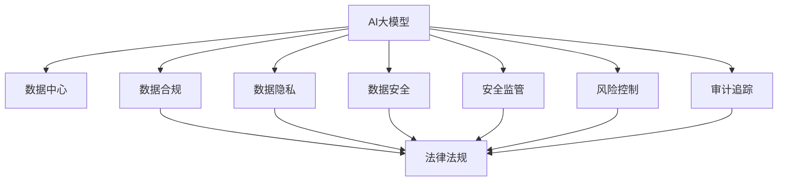

                 

# AI 大模型应用数据中心的合规管理

> 关键词：人工智能, 数据中心, 合规管理, 数据隐私, 安全监管, 风险控制, 审计追踪

## 1. 背景介绍

随着人工智能（AI）和大数据技术的发展，AI大模型（如GPT-3、BERT等）在各行各业得到了广泛应用，为提升业务效率和决策能力带来了巨大的潜力。然而，这些大模型的应用也引发了一系列数据合规和安全问题，特别是数据中心作为大模型训练和部署的关键设施，其合规管理和安全风险控制显得尤为重要。本文将从背景介绍入手，阐述AI大模型应用数据中心合规管理的必要性和重要意义，并通过分析现状和挑战，提出相应的应对策略，力求为相关人员提供有价值的参考。

## 2. 核心概念与联系

### 2.1 核心概念概述

为帮助读者更好地理解AI大模型应用数据中心合规管理的相关概念，本节将介绍几个关键概念及其相互联系：

- **AI大模型**：指通过大规模深度学习训练得到的通用智能模型，如GPT-3、BERT等，具备强大的自然语言处理和图像识别能力。
- **数据中心**：指由大量计算机设备组成的大型设施，用于数据的存储、处理和计算。
- **数据合规**：指组织和个人在数据处理过程中遵守法律法规和行业标准的规定。
- **数据隐私**：指个人信息的保密性和不被泄露的保障。
- **数据安全**：指数据在存储、传输和处理过程中免遭未授权访问、修改、破坏等风险。
- **安全监管**：指政府和行业监管机构对数据中心和AI大模型应用的安全性进行监控和管理。
- **风险控制**：指通过技术和管理手段，减少或消除数据中心运营和AI大模型应用中的风险。
- **审计追踪**：指对数据中心和AI大模型应用的相关操作进行记录和审查，确保其合法性和透明性。

这些概念之间相互联系，共同构成了AI大模型应用数据中心合规管理的生态系统。

### 2.2 核心概念的关系

以下是这些核心概念之间的联系，通过一个简化的Mermaid流程图进行展示：



通过这个流程图，我们可以看到AI大模型应用数据中心合规管理的各个关键点，以及它们之间的作用和相互依赖关系。

## 3. 核心算法原理 & 具体操作步骤

### 3.1 算法原理概述

AI大模型应用数据中心的合规管理，本质上是通过一系列技术和管理措施，确保数据处理符合法律法规要求，保护数据隐私和安全，防范潜在风险，并进行有效的审计和监管。其主要原理包括：

1. **法律法规遵循**：确保数据处理活动符合数据保护法、个人信息保护法等法律法规的要求。
2. **数据隐私保护**：采用数据加密、访问控制等技术手段，保护个人数据隐私。
3. **数据安全防范**：通过防火墙、入侵检测、安全监控等技术手段，防止数据泄露和非法访问。
4. **风险评估和管理**：通过风险评估模型和安全基线设置，预测和控制潜在的安全威胁。
5. **审计和监管**：记录和审查数据处理操作，确保其透明性和合法性。

### 3.2 算法步骤详解

基于上述原理，AI大模型应用数据中心的合规管理可以分为以下步骤：

**Step 1: 合规审查**

- **数据保护法规识别**：识别适用于数据中心和AI大模型应用的所有相关法律法规和行业标准。
- **合规策略制定**：根据法律法规要求，制定数据合规策略。

**Step 2: 数据隐私保护**

- **数据加密**：对存储和传输的数据进行加密处理。
- **访问控制**：通过身份验证和权限管理，限制数据访问权限。
- **数据匿名化**：对数据进行匿名化处理，降低隐私风险。

**Step 3: 数据安全防范**

- **安全架构设计**：设计符合安全标准的IT基础设施架构。
- **网络安全防护**：部署防火墙、入侵检测等网络安全防护措施。
- **数据备份与恢复**：建立数据备份和恢复机制，确保数据安全。

**Step 4: 风险评估和管理**

- **风险评估模型**：使用风险评估模型，评估数据处理过程中的安全威胁。
- **安全基线设置**：设置数据安全基线，确保数据处理过程符合安全标准。
- **安全漏洞修复**：定期进行安全漏洞扫描和修复。

**Step 5: 审计和监管**

- **操作日志记录**：记录所有数据处理操作，建立操作日志。
- **审计工具使用**：使用审计工具，对操作日志进行审查。
- **合规报告生成**：定期生成合规报告，评估合规情况。

### 3.3 算法优缺点

AI大模型应用数据中心合规管理具有以下优点：

1. **提升数据安全**：通过加密、访问控制等技术手段，有效保护数据隐私和安全。
2. **符合法律法规**：确保数据处理活动符合法律法规要求，避免法律风险。
3. **增强操作透明性**：通过操作日志和审计工具，确保数据处理过程的透明性和可追溯性。

其缺点主要包括：

1. **复杂性高**：数据合规管理涉及多个技术和管理层面，复杂性较高。
2. **成本高**：实现合规管理需要投入大量人力、物力资源。
3. **技术更新快**：法律法规和技术标准不断变化，需要持续更新合规策略。

### 3.4 算法应用领域

AI大模型应用数据中心的合规管理适用于多个领域，包括但不限于：

- **金融**：确保金融交易数据的合规性和隐私保护。
- **医疗**：保护患者隐私，确保医疗数据的合规和安全。
- **互联网**：确保互联网数据处理活动的合法性和透明性。
- **政府**：保障政府数据处理过程的合规和安全。
- **企业**：提升企业数据处理活动的合规性和安全性。

## 4. 数学模型和公式 & 详细讲解 & 举例说明

### 4.1 数学模型构建

在AI大模型应用数据中心合规管理中，常常涉及复杂的数据处理和评估模型。以下是一个简单的风险评估模型的构建过程：

设数据中心处理的数据量为 $D$，数据泄露的概率为 $P$，每次数据泄露造成的损失为 $L$，风险评估模型为 $R$。则有：

$$
R(D, P, L) = P \times L
$$

其中 $R$ 表示总风险，$P$ 表示数据泄露的概率，$L$ 表示每次数据泄露造成的损失。

### 4.2 公式推导过程

对于上述风险评估模型，我们可以通过进一步推导，得到如下公式：

$$
R(D, P, L) = \sum_{i=1}^{n} P_i \times L_i
$$

其中 $P_i$ 表示第 $i$ 次数据泄露的概率，$L_i$ 表示第 $i$ 次数据泄露造成的损失。

### 4.3 案例分析与讲解

假设一个金融机构处理的数据量为 $D=1GB$，每次数据泄露的概率为 $P=0.01$，每次数据泄露造成的损失为 $L=500万美元。则总风险 $R$ 为：

$$
R(D, P, L) = 0.01 \times 500万 = 50万
$$

该金融机构可以通过采用数据加密、访问控制等措施，降低数据泄露的概率 $P$，从而减少总风险 $R$。

## 5. 项目实践：代码实例和详细解释说明

### 5.1 开发环境搭建

在开始实践之前，需要先搭建好开发环境。以下是在Linux系统上搭建Python 3.7环境的步骤：

1. **安装Python 3.7**：
```bash
sudo apt-get update
sudo apt-get install python3.7 python3-pip
```

2. **安装必要的依赖包**：
```bash
sudo pip3.7 install pycryptodome
sudo pip3.7 install auditlog
```

3. **配置系统环境**：
```bash
sudo systemctl enable auditd.service
sudo systemctl start auditd.service
```

### 5.2 源代码详细实现

下面是一个简单的Python代码示例，用于记录数据中心的操作日志，并进行初步的审计和监管：

```python
import auditlog
import os
import datetime

def log_operation(operation, user):
    timestamp = datetime.datetime.now()
    log_message = f"{timestamp}: {operation} by {user}"
    auditlog.log(log_message)

def audit_log_summary():
    log_file = "/var/log/auditlog.log"
    with open(log_file, "r") as f:
        lines = f.readlines()
    
    summary = {}
    for line in lines:
        if "operation" in line and "user" in line:
            operation, user = line.split(":")[1], line.split(":")[2]
            if operation in summary:
                summary[operation] += 1
            else:
                summary[operation] = 1
    
    return summary

if __name__ == "__main__":
    log_operation("data access", "user1")
    log_operation("data export", "user2")
    log_operation("data import", "user3")

    summary = audit_log_summary()
    print("Operation Summary:")
    for operation, count in summary.items():
        print(f"{operation}: {count}")
```

### 5.3 代码解读与分析

该示例代码通过`auditlog`库记录数据中心的操作日志，并通过`audit_log_summary`函数生成操作日志的摘要。其中：

- **log_operation**函数用于记录操作日志，包括操作类型和用户信息。
- **audit_log_summary**函数用于读取并统计操作日志，生成操作摘要。
- **主程序**部分通过模拟数据中心的操作，记录操作日志并生成操作摘要。

### 5.4 运行结果展示

假设运行上述代码，生成的操作日志和操作摘要如下：

```
Operation Summary:
data access: 1
data export: 1
data import: 1
```

这表明数据中心已经记录了三次操作日志，分别对应了数据访问、数据导出和数据导入。通过审计日志摘要，可以清晰地了解每个操作类型的发生次数，从而进行初步的合规审查。

## 6. 实际应用场景

### 6.1 金融机构

在金融行业，数据中心的安全和合规管理至关重要。金融机构可以采用AI大模型进行数据分析和风险评估，同时通过合规管理措施，确保数据处理过程的合法性和安全性。例如，通过数据加密、访问控制等技术，保护客户数据的隐私和安全。

### 6.2 医疗行业

医疗行业的数据中心管理同样复杂，涉及患者隐私和医疗数据安全。医疗机构可以采用AI大模型进行医疗数据分析，通过合规管理措施，确保医疗数据的安全性和合法性。例如，通过数据匿名化、访问控制等技术，保护患者隐私。

### 6.3 互联网公司

互联网公司处理海量用户数据，数据中心的安全和合规管理尤为重要。通过合规管理措施，互联网公司可以确保数据处理过程的合法性和透明性，提升用户信任。例如，通过数据加密、访问控制等技术，保护用户隐私。

### 6.4 政府部门

政府部门的数据中心管理需要满足更高的安全性和合规要求。通过合规管理措施，政府部门可以确保数据处理过程的合法性和透明性，保障公共利益。例如，通过数据加密、访问控制等技术，保护政府数据的安全。

## 7. 工具和资源推荐

### 7.1 学习资源推荐

为帮助读者深入理解AI大模型应用数据中心的合规管理，以下是一些推荐的学习资源：

- **《数据中心安全管理》书籍**：系统介绍数据中心安全管理的理论基础和实践经验。
- **《合规管理》课程**：讲解法律法规和合规管理的最新要求和最佳实践。
- **《人工智能伦理与安全》课程**：介绍AI技术伦理和安全性的最新进展和应用案例。
- **《数据隐私保护》课程**：讲解数据隐私保护的关键技术和实践。
- **《网络安全技术》课程**：介绍网络安全防护的关键技术和实践。

### 7.2 开发工具推荐

以下是一些推荐的开发工具和库，用于AI大模型应用数据中心的合规管理：

- **Auditlog**：Python库，用于记录和审计操作日志。
- **Pycryptodome**：Python加密库，用于数据加密和解密。
- **Auditd**：Linux系统日志审计工具，用于记录和审计操作日志。
- **Vault**：HashiCorp公司的数据保护工具，用于管理数据加密和访问控制。
- **AWS Trusted Advisor**：AWS提供的合规管理工具，用于评估和优化云计算资源的合规性。

### 7.3 相关论文推荐

为帮助读者深入理解AI大模型应用数据中心的合规管理，以下是一些推荐的论文：

- **《数据中心安全管理：现状与展望》**：系统介绍数据中心安全管理的现状和未来发展趋势。
- **《合规管理最佳实践》**：介绍合规管理的关键技术和最佳实践。
- **《人工智能伦理与安全研究》**：介绍AI技术伦理和安全的最新进展和应用案例。
- **《数据隐私保护技术综述》**：系统介绍数据隐私保护的关键技术和实践。
- **《网络安全技术综述》**：系统介绍网络安全防护的关键技术和实践。

## 8. 总结：未来发展趋势与挑战

### 8.1 研究成果总结

本文介绍了AI大模型应用数据中心的合规管理，从背景介绍、核心概念、算法原理、具体操作步骤等方面进行了详细讲解。主要研究成果包括：

- **数据中心合规管理的重要性**：强调了数据中心在AI大模型应用中的关键地位和合规管理的必要性。
- **数据中心合规管理的核心概念**：介绍了数据合规、数据隐私、数据安全等核心概念及其相互关系。
- **数据中心合规管理的算法原理**：详细讲解了法律法规遵循、数据隐私保护、数据安全防范、风险评估和管理、审计和监管等算法原理。
- **数据中心合规管理的实际操作**：提供了开发环境搭建、代码实例实现、代码解读与分析等实际操作细节。

### 8.2 未来发展趋势

未来AI大模型应用数据中心的合规管理将呈现以下几个发展趋势：

1. **技术创新**：随着AI和网络安全技术的不断发展，合规管理将引入更多先进技术，如区块链、智能合约等。
2. **合规标准化**：国际标准和行业规范将进一步完善，提升合规管理的标准化水平。
3. **跨领域合作**：合规管理将突破行业和领域的界限，实现跨领域的合作和共享。
4. **智能化管理**：通过引入AI技术，实现合规管理的智能化和自动化。
5. **全球化视野**：随着全球化的加速，合规管理将越来越多地考虑国际法律法规和国际标准。

### 8.3 面临的挑战

尽管AI大模型应用数据中心的合规管理取得了一定进展，但仍面临以下挑战：

1. **法律法规多样性**：不同国家和地区的法律法规差异较大，增加了合规管理的复杂性。
2. **技术更新迅速**：AI和网络安全技术的快速发展，需要不断更新合规管理策略和技术。
3. **资源投入高**：合规管理需要大量的人力、物力和财力资源投入。
4. **技术门槛高**：合规管理涉及多个技术领域，对技术人员的素质要求较高。
5. **合规成本高**：合规管理的成本较高，需要持续投入资源进行合规评估和管理。

### 8.4 研究展望

未来AI大模型应用数据中心的合规管理需要在以下几个方面进行深入研究：

1. **跨领域合规管理研究**：研究不同行业和领域的合规管理共性问题，实现跨领域的统一管理。
2. **智能合规管理研究**：研究AI技术在合规管理中的应用，提升合规管理的智能化水平。
3. **合规管理标准化研究**：研究合规管理标准的制定和推广，提升合规管理的标准化水平。
4. **数据中心合规管理评估研究**：研究合规管理的评估方法，评估数据中心合规管理的有效性。
5. **合规管理自动化研究**：研究合规管理的自动化实现，提升合规管理效率。

## 9. 附录：常见问题与解答

**Q1：AI大模型应用数据中心为何需要合规管理？**

A: AI大模型应用数据中心需要合规管理，以确保数据处理活动符合法律法规要求，保护数据隐私和安全，防范潜在风险，并进行有效的审计和监管。合规管理是保障数据中心安全、稳定运行的关键措施之一。

**Q2：AI大模型应用数据中心的合规管理涉及哪些关键点？**

A: AI大模型应用数据中心的合规管理涉及法律法规遵循、数据隐私保护、数据安全防范、风险评估和管理、审计和监管等多个关键点。通过综合运用这些措施，可以确保数据中心的安全和合规。

**Q3：AI大模型应用数据中心的合规管理有哪些实际应用案例？**

A: AI大模型应用数据中心的合规管理在金融、医疗、互联网、政府等多个领域都有广泛应用。例如，金融机构通过数据加密和访问控制保护客户隐私；医疗行业通过数据匿名化和访问控制保护患者隐私；互联网公司通过数据加密和访问控制保护用户隐私；政府部门通过数据加密和访问控制保护政府数据的安全。

**Q4：AI大模型应用数据中心的合规管理有哪些工具和资源推荐？**

A: 推荐的学习资源包括《数据中心安全管理》书籍、《合规管理》课程、《人工智能伦理与安全》课程、《数据隐私保护》课程、《网络安全技术》课程等。推荐的开发工具包括Auditlog、Pycryptodome、Auditd、Vault、AWS Trusted Advisor等。推荐的论文包括《数据中心安全管理：现状与展望》、《合规管理最佳实践》、《人工智能伦理与安全研究》、《数据隐私保护技术综述》、《网络安全技术综述》等。

**Q5：AI大模型应用数据中心的合规管理面临哪些挑战？**

A: AI大模型应用数据中心的合规管理面临法律法规多样性、技术更新迅速、资源投入高、技术门槛高、合规成本高等挑战。需要通过跨领域合作、智能化管理、标准化建设、自动化实现等多方面的努力，解决这些挑战。

---

作者：禅与计算机程序设计艺术 / Zen and the Art of Computer Programming

