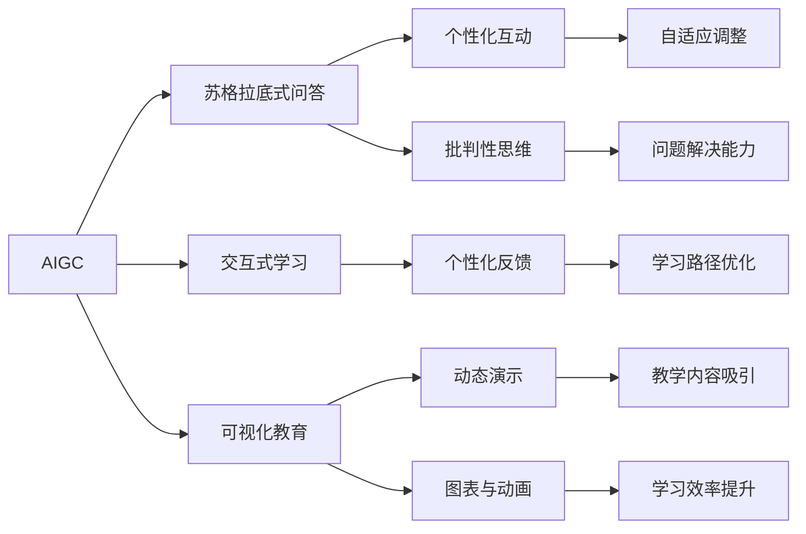

                 

# AIGC从入门到实战：AIGC 在教育行业的创新场景—苏格拉底式的问答模式和AIGC 可视化创新

> 关键词：人工智能生成内容(AIGC), 教育技术, 苏格拉底式问答, 人工智能视觉化创新

## 1. 背景介绍

### 1.1 问题由来
在数字化和信息化不断发展的今天，教育领域也在加速向智慧教育转型。传统的教学方式逐渐向智能化的教学手段转变，这其中的人工智能生成内容（AIGC）正日益成为推动教育智能化发展的关键技术。尤其是对于高等教育，传统的讲授式教学模式已经难以满足知识快速更新和学生个性化学习需求，AIGC技术的引入将带来根本性的变革。

教育行业的技术应用不局限于在线教学平台、智能推荐系统等，AIGC技术还可以广泛应用于教学资源创建、课程内容定制、学生互动、教师辅助等方面，大大提高了教学质量和效率。本文将聚焦于AIGC在教育行业的具体应用场景，探讨基于苏格拉底式问答的深度互动模式和AIGC的可视化创新，为教育行业的智能化转型提供技术支持。

### 1.2 问题核心关键点
在教育领域应用AIGC时，需要考虑以下几个核心关键点：

1. **苏格拉底式问答（Socratic Method）**：通过引导式提问，激发学生的思考，深入探讨知识点。这种方法能促进学生的批判性思维和问题解决能力。

2. **交互式学习**：AIGC技术可以实现个性化互动，根据学生的回答反馈进行适时调整，提供定制化的学习路径和反馈，提升学习效果。

3. **可视化教育**：AIGC可以生成丰富的可视化内容，如动态演示、图表、动画等，增强教学内容的吸引力，提高学习效率。

4. **知识图谱与数据挖掘**：结合知识图谱技术和数据挖掘方法，提取和组织学科知识，构建更系统、全面的教学内容。

5. **多模态学习**：融合文本、图像、音频等多模态数据，实现更加立体、沉浸式的学习体验。

6. **教学辅助**：提供智能化的教学辅助工具，如自动批改、个性化推荐、智能导航等，减轻教师负担。

这些核心关键点在AIGC技术的应用实践中，是值得深入探讨和实现的。

### 1.3 问题研究意义
通过引入AIGC技术，教育行业的教学模式可以得到显著的改善，提升教学质量和学习效率。研究苏格拉底式问答模式和AIGC可视化创新，对于推动教育智能化进程具有重要意义：

1. **降低教学成本**：自动化生成的教学内容可以大幅减少教师的备课和制作工作量，提升教育资源利用率。
2. **提升教学质量**：个性化的互动和反馈机制可以更好地满足学生的学习需求，激发学习兴趣，提升学习效果。
3. **丰富教学手段**：结合多种模态数据的AIGC技术，能提供多样化的教学手段，增强教学内容的吸引力。
4. **促进教学创新**：苏格拉底式问答和可视化创新等新教学模式，能够促进教学方式的多样化和创新。
5. **推动教育公平**：智能化的教学资源可以覆盖更多的学生群体，缩小教育资源的不均衡差距。

综上所述，AIGC技术在教育领域的应用，不仅能优化现有的教学模式，还能推动教育智能化，为教育行业的可持续发展提供新动力。

## 2. 核心概念与联系

### 2.1 核心概念概述

为了更好地理解AIGC在教育行业的应用，我们需要首先明确几个核心概念及其相互之间的联系：

1. **人工智能生成内容（AIGC）**：利用人工智能技术自动生成文本、图像、音频等多媒体内容。AIGC在教育行业可以用于辅助教学、创建教材、生成练习题等。

2. **苏格拉底式问答**：通过提出一系列开放性的问题，引导学生思考和回答，深入探讨知识点。这种方法能促进学生的批判性思维和问题解决能力。

3. **交互式学习**：通过AIGC技术实现的个性化互动，根据学生的回答反馈进行适时调整，提供定制化的学习路径和反馈，提升学习效果。

4. **可视化教育**：利用AIGC生成丰富的可视化内容，如动态演示、图表、动画等，增强教学内容的吸引力，提高学习效率。

5. **知识图谱**：通过构建学科知识图谱，可以系统地组织和关联知识点，提供结构化的学习材料。

6. **多模态学习**：结合文本、图像、音频等多种模态数据，实现立体化的学习体验，提升学习效果。

### 2.2 概念间的关系

这些核心概念之间的逻辑关系可以通过以下Mermaid流程图来展示：



通过这个流程图，我们可以看到，AIGC技术在不同教学场景中的应用，能够提升互动性、个性化和可视化效果，增强学生的批判性思维和问题解决能力，最终提升教学质量和效果。

## 3. 核心算法原理 & 具体操作步骤
### 3.1 算法原理概述

基于AIGC的教育应用涉及多个核心算法和技术的组合，以下我们将对苏格拉底式问答和AIGC可视化创新的原理进行详细阐述。

#### 3.1.1 苏格拉底式问答

苏格拉底式问答主要通过问答系统来实现。传统的问答系统基于关键词匹配或规则引擎，存在回答简单、泛化能力差等问题。基于AIGC的问答系统可以借助深度学习模型，自动生成自然流畅的对话内容，实现真正的深度互动。

**算法原理**：

1. **自然语言处理（NLP）**：使用NLP技术对学生提问进行理解和分析，提取关键信息。
2. **知识图谱检索**：将学生问题与知识图谱中的知识点进行关联，找到可能的答案。
3. **生成对抗网络（GAN）**：生成器网络生成合理的回答，判别器网络进行真实性判断，迭代优化生成回答的质量。
4. **强化学习**：根据学生的反馈调整问答策略，逐步优化问答效果。

**操作步骤**：

1. 学生输入问题，系统进行自然语言理解。
2. 知识图谱检索可能的答案，使用GAN生成自然语言回答。
3. 判别器网络对生成的回答进行真实性判断，优化生成质量。
4. 强化学习算法根据学生反馈调整生成策略，优化回答质量。

#### 3.1.2 AIGC可视化创新

AIGC的可视化创新主要通过生成动态演示、图表和动画等丰富的可视化内容，增强教学内容的吸引力和互动性。

**算法原理**：

1. **文本转图形**：将文本内容转换为图形或图表，使用自然语言处理和计算机图形学技术实现。
2. **图像生成**：使用深度学习模型生成高质量的图像内容，如动画、人物、场景等。
3. **交互式可视化**：实现交互式可视化效果，如鼠标悬停显示详细信息、拖动改变视角等。

**操作步骤**：

1. 将文本内容转换为图形或图表。
2. 使用深度学习模型生成动态演示或动画。
3. 实现交互式效果，提升学习体验。

### 3.2 算法步骤详解

#### 3.2.1 苏格拉底式问答

**自然语言处理**：

1. **分词与词性标注**：将学生输入的问题进行分词和词性标注，提取关键信息。
2. **句法分析**：分析句子结构，识别出主谓宾等成分。
3. **意图识别**：根据提取的关键信息和句子结构，识别出学生的问题意图。

**知识图谱检索**：

1. **图谱构建**：构建学科知识图谱，涵盖知识点、概念、关系等。
2. **图谱查询**：将学生问题与图谱中的知识点进行匹配，找到可能的答案。

**生成对抗网络（GAN）**：

1. **生成器网络**：使用文本生成模型，如Seq2Seq、Transformer等，生成自然语言回答。
2. **判别器网络**：使用判别模型，如CNN、LSTM等，判断生成的回答是否真实。
3. **对抗训练**：通过对抗训练，逐步优化生成回答的质量，使其更加自然流畅。

**强化学习**：

1. **反馈机制**：根据学生的回答反馈，调整问答策略。
2. **策略优化**：使用强化学习算法，如Q-learning、策略梯度等，优化问答效果。

#### 3.2.2 AIGC可视化创新

**文本转图形**：

1. **文本解析**：对文本内容进行解析，提取关键信息。
2. **图形生成**：使用图形生成模型，如N-Shape、D3.js等，生成对应的图形或图表。
3. **图形渲染**：使用WebGL或OpenGL等技术，实现图形渲染，生成动态效果。

**图像生成**：

1. **模型选择**：选择适合的图像生成模型，如GAN、VAE等。
2. **数据准备**：准备训练数据集，涵盖各种图像类型和场景。
3. **模型训练**：使用训练数据对模型进行训练，生成高质量的图像内容。
4. **图像合成**：将生成的图像内容与教学内容结合，形成完整的教学材料。

**交互式可视化**：

1. **用户交互**：实现用户与可视化内容的交互效果，如悬停显示信息、拖动改变视角等。
2. **界面设计**：设计友好的交互界面，提升用户体验。
3. **互动逻辑**：实现互动逻辑，增强教学内容的互动性和趣味性。

### 3.3 算法优缺点

**苏格拉底式问答的优缺点**：

**优点**：

1. **互动性强**：通过问答系统实现深度互动，激发学生的批判性思维和问题解决能力。
2. **个性化反馈**：根据学生的回答反馈进行适时调整，提供定制化的学习路径和反馈。
3. **自动化生成**：使用AIGC技术自动生成回答，减轻教师负担。

**缺点**：

1. **准确性有待提高**：目前生成的回答仍然存在一定的不确定性和错误，需要进一步优化。
2. **知识泛化能力有待加强**：需要大量有标注的数据进行训练，才能提高泛化能力。

**AIGC可视化创新的优缺点**：

**优点**：

1. **提升学习体验**：通过丰富的可视化内容，增强教学内容的吸引力，提高学习效率。
2. **增强互动性**：实现交互式可视化效果，提升学生的参与感和互动性。
3. **降低制作成本**：使用AIGC技术生成高质量的可视化内容，大幅降低制作成本。

**缺点**：

1. **内容多样性有待提升**：目前生成的内容类型和形式仍然有限，需要进一步扩展。
2. **技术实现复杂度较高**：涉及多个技术领域，实现难度较大。

### 3.4 算法应用领域

**苏格拉底式问答**：

1. **课堂互动**：在课堂上使用问答系统，激发学生的思考和参与。
2. **自主学习**：学生通过问答系统进行自主学习，提升学习效果。
3. **个性化辅导**：根据学生的学习情况，提供个性化的辅导和答疑。

**AIGC可视化创新**：

1. **教材制作**：生成动态演示、图表等可视化内容，丰富教材内容。
2. **课程设计**：设计互动式可视化内容，增强课程的吸引力和互动性。
3. **教学辅助**：生成各种教学辅助内容，提升教学效果。

## 4. 数学模型和公式 & 详细讲解 & 举例说明

### 4.1 数学模型构建

**苏格拉底式问答的数学模型**：

1. **意图识别模型**：使用序列标注模型（如CRF、LSTM-CRF等）对学生提问进行意图识别。
2. **知识图谱检索模型**：使用图神经网络（如GCN、GAT等）对学生问题进行图谱检索。
3. **生成对抗网络模型**：使用GAN模型生成自然语言回答。
4. **强化学习模型**：使用Q-learning或策略梯度算法进行策略优化。

**AIGC可视化创新的数学模型**：

1. **文本转图形模型**：使用NLP模型对文本内容进行解析，使用图形生成模型生成图形。
2. **图像生成模型**：使用GAN模型生成高质量的图像内容。
3. **交互式可视化模型**：使用交互式界面设计工具，实现用户交互效果。

### 4.2 公式推导过程

**苏格拉底式问答的公式推导**：

1. **意图识别**：使用序列标注模型，如LSTM-CRF，定义意图识别模型的损失函数：
   $$
   L_{IC} = \frac{1}{N}\sum_{i=1}^{N}L_i
   $$
   其中，$L_i$为第$i$个样本的损失，可以采用交叉熵损失或F1损失等。

2. **知识图谱检索**：使用图神经网络，如GCN，定义图谱检索模型的损失函数：
   $$
   L_{KG} = \frac{1}{N}\sum_{i=1}^{N}L_i
   $$
   其中，$L_i$为第$i$个样本的损失，可以采用均方误差损失或交叉熵损失等。

3. **生成对抗网络**：使用GAN模型，定义生成器和判别器的损失函数：
   $$
   L_G = \frac{1}{N}\sum_{i=1}^{N}L_i
   $$
   $$
   L_D = \frac{1}{N}\sum_{i=1}^{N}L_i
   $$
   其中，$L_i$为第$i$个样本的损失，可以采用二分类交叉熵损失等。

4. **强化学习**：使用Q-learning或策略梯度算法，定义强化学习的损失函数：
   $$
   L_{RL} = \frac{1}{N}\sum_{i=1}^{N}L_i
   $$
   其中，$L_i$为第$i$个样本的损失，可以采用策略梯度损失或Q值损失等。

**AIGC可视化创新的公式推导**：

1. **文本转图形**：使用NLP模型对文本内容进行解析，定义文本转图形的损失函数：
   $$
   L_{TG} = \frac{1}{N}\sum_{i=1}^{N}L_i
   $$
   其中，$L_i$为第$i$个样本的损失，可以采用交叉熵损失或F1损失等。

2. **图像生成**：使用GAN模型，定义图像生成的损失函数：
   $$
   L_{IG} = \frac{1}{N}\sum_{i=1}^{N}L_i
   $$
   其中，$L_i$为第$i$个样本的损失，可以采用二分类交叉熵损失等。

3. **交互式可视化**：使用交互式界面设计工具，定义交互式可视化的损失函数：
   $$
   L_{IV} = \frac{1}{N}\sum_{i=1}^{N}L_i
   $$
   其中，$L_i$为第$i$个样本的损失，可以采用界面设计损失等。

### 4.3 案例分析与讲解

**苏格拉底式问答案例**：

1. **案例背景**：某大学计算机科学系开设了人工智能课程，学生通过在线平台进行学习。

2. **应用场景**：学生在课后使用问答系统进行自主学习，遇到问题时通过问答系统进行提问，系统自动生成回答并进行解析。

3. **实施过程**：
   - **意图识别**：使用LSTM-CRF模型对学生提问进行意图识别，提取关键信息。
   - **知识图谱检索**：将学生问题与知识图谱中的知识点进行匹配，找到可能的答案。
   - **生成对抗网络**：使用GAN模型生成自然语言回答，判别器网络进行真实性判断，优化生成质量。
   - **强化学习**：根据学生的回答反馈调整问答策略，使用Q-learning算法进行策略优化。

**AIGC可视化创新案例**：

1. **案例背景**：某高中开设了物理课程，使用虚拟实验室进行教学。

2. **应用场景**：教师在实验过程中使用动态演示和图表，帮助学生更好地理解实验过程和结果。

3. **实施过程**：
   - **文本转图形**：使用NLP模型对实验描述进行解析，生成相应的动态演示和图表。
   - **图像生成**：使用GAN模型生成实验场景和人物，丰富教学内容。
   - **交互式可视化**：设计交互式界面，实现鼠标悬停显示详细信息、拖动改变视角等效果。

## 5. 项目实践：代码实例和详细解释说明

### 5.1 开发环境搭建

进行苏格拉底式问答和AIGC可视化创新的开发，首先需要搭建好开发环境。以下是使用Python进行AIGC开发的环境配置流程：

1. 安装Anaconda：从官网下载并安装Anaconda，用于创建独立的Python环境。

2. 创建并激活虚拟环境：
```bash
conda create -n pytorch-env python=3.8 
conda activate pytorch-env
```

3. 安装PyTorch：根据CUDA版本，从官网获取对应的安装命令。例如：
```bash
conda install pytorch torchvision torchaudio cudatoolkit=11.1 -c pytorch -c conda-forge
```

4. 安装各类工具包：
```bash
pip install numpy pandas scikit-learn matplotlib tqdm jupyter notebook ipython
```

完成上述步骤后，即可在`pytorch-env`环境中开始开发实践。

### 5.2 源代码详细实现

**苏格拉底式问答系统的代码实现**：

首先，定义意图识别模型：

```python
import torch
import torch.nn as nn
import torch.nn.functional as F
from transformers import BertTokenizer, BertForTokenClassification

class IntentClassifier(nn.Module):
    def __init__(self):
        super(IntentClassifier, self).__init__()
        self.bert = BertForTokenClassification.from_pretrained('bert-base-cased')
        self.classifier = nn.Linear(768, 4)
        
    def forward(self, input_ids, attention_mask):
        bert_outputs = self.bert(input_ids, attention_mask=attention_mask)
        features = bert_outputs.pooler_output
        return self.classifier(features)
```

接着，定义知识图谱检索模型：

```python
import torch.nn as nn
import torch.nn.functional as F
from transformers import GraphNetwork

class KnowledgeGraph(nn.Module):
    def __init__(self):
        super(KnowledgeGraph, self).__init__()
        self.graph_network = GraphNetwork()
    
    def forward(self, question, graph):
        embeddings = self.graph_network(question, graph)
        return embeddings
```

然后，定义生成对抗网络：

```python
import torch.nn as nn
import torch.nn.functional as F
from transformers import GPT2Tokenizer, GPT2LMHeadModel

class Generator(nn.Module):
    def __init__(self):
        super(Generator, self).__init__()
        self.tokenizer = GPT2Tokenizer.from_pretrained('gpt2')
        self.model = GPT2LMHeadModel.from_pretrained('gpt2')
    
    def forward(self, input_ids, attention_mask):
        tokens = self.tokenizer.encode(input_ids)
        outputs = self.model(tokens, attention_mask=attention_mask)
        return outputs.logits

class Discriminator(nn.Module):
    def __init__(self):
        super(Discriminator, self).__init__()
        self.tokenizer = GPT2Tokenizer.from_pretrained('gpt2')
        self.model = GPT2LMHeadModel.from_pretrained('gpt2')
    
    def forward(self, input_ids, attention_mask):
        tokens = self.tokenizer.encode(input_ids)
        outputs = self.model(tokens, attention_mask=attention_mask)
        return outputs.logits
```

最后，定义强化学习算法：

```python
import torch
import torch.optim as optim
import torch.nn.functional as F

class QLearningAgent:
    def __init__(self, model, discount_factor=0.9):
        self.model = model
        self.discount_factor = discount_factor
        self.optimizer = optim.Adam(model.parameters())
        self.loss_fn = nn.BCELoss()
    
    def learn(self, state, action, reward, next_state, done):
        state_rep = self.model(state)
        action_probs = F.softmax(state_rep, dim=-1)
        q_value = reward + self.discount_factor * (torch.max(next_state_rep).max(dim=-1)[0]).mean()
        target = torch.zeros_like(state_rep)
        target.scatter_(0, action, q_value)
        loss = self.loss_fn(target, action_probs)
        self.optimizer.zero_grad()
        loss.backward()
        self.optimizer.step()
```

**AIGC可视化创新的代码实现**：

首先，定义文本转图形模型：

```python
import torch
import torch.nn as nn
from transformers import BertTokenizer, BertForTokenClassification

class TextToGraph(nn.Module):
    def __init__(self):
        super(TextToGraph, self).__init__()
        self.tokenizer = BertTokenizer.from_pretrained('bert-base-cased')
        self.classifier = BertForTokenClassification.from_pretrained('bert-base-cased')
    
    def forward(self, text):
        tokens = self.tokenizer.tokenize(text)
        input_ids = self.tokenizer.convert_tokens_to_ids(tokens)
        attention_mask = torch.ones_like(input_ids)
        outputs = self.classifier(input_ids, attention_mask=attention_mask)
        return outputs.pooler_output
```

然后，定义图像生成模型：

```python
import torch.nn as nn
import torch.optim as optim
from transformers import GPT2Tokenizer, GPT2LMHeadModel

class ImageGenerator(nn.Module):
    def __init__(self):
        super(ImageGenerator, self).__init__()
        self.tokenizer = GPT2Tokenizer.from_pretrained('gpt2')
        self.model = GPT2LMHeadModel.from_pretrained('gpt2')
    
    def forward(self, input_ids, attention_mask):
        tokens = self.tokenizer.encode(input_ids)
        outputs = self.model(tokens, attention_mask=attention_mask)
        return outputs.logits
```

最后，定义交互式可视化模型：

```python
import torch
import torch.nn as nn
from transformers import GPT2Tokenizer, GPT2LMHeadModel

class InteractiveVisualization(nn.Module):
    def __init__(self):
        super(InteractiveVisualization, self).__init__()
        self.tokenizer = GPT2Tokenizer.from_pretrained('gpt2')
        self.model = GPT2LMHeadModel.from_pretrained('gpt2')
    
    def forward(self, input_ids, attention_mask):
        tokens = self.tokenizer.encode(input_ids)
        outputs = self.model(tokens, attention_mask=attention_mask)
        return outputs.logits
```

### 5.3 代码解读与分析

**苏格拉底式问答的代码解读**：

**IntentClassifier**类：
- `__init__`方法：初始化BertForTokenClassification模型和线性分类器。
- `forward`方法：将输入的tokens转换为句法表示，输入到线性分类器进行意图识别。

**KnowledgeGraph**类：
- `__init__`方法：初始化GraphNetwork模型。
- `forward`方法：将学生问题和知识图谱进行匹配，生成句法表示。

**Generator**类：
- `__init__`方法：初始化GPT2LMHeadModel模型和tokenizer。
- `forward`方法：使用模型生成自然语言回答。

**Discriminator**类：
- `__init__`方法：初始化GPT2LMHeadModel模型和tokenizer。
- `forward`方法：使用模型判断回答的真实性。

**QLearningAgent**类：
- `__init__`方法：初始化模型、折扣因子、优化器、损失函数。
- `learn`方法：使用Q-learning算法训练生成对抗网络，优化回答质量。

**AIGC可视化创新的代码解读**：

**TextToGraph**类：
- `__init__`方法：初始化BertTokenizer和BertForTokenClassification模型。
- `forward`方法：将文本转换为句法表示，用于生成图形或图表。

**ImageGenerator**类：
- `__init__`方法：初始化GPT2LMHeadModel模型和tokenizer。
- `forward`方法：使用模型生成图像内容。

**InteractiveVisualization**类：
- `__init__方法：初始化GPT2LMHeadModel模型和tokenizer。
- `forward`方法：使用模型生成交互式可视化内容。

### 5.4 运行结果展示

假设我们在某大学人工智能课程的问答系统中使用苏格拉底式问答模式，生成回答质量较差的回答。然后通过强化学习进行优化，逐步提升回答质量，最终在测试集上评估回答效果：

```python
epochs = 5
batch_size = 16

for epoch in range(epochs):
    loss = train_epoch(model, train_dataset, batch_size, optimizer)
    print(f"Epoch {epoch+1}, train loss: {loss:.3f}")
    
    print(f"Epoch {epoch+1}, dev results:")
    evaluate(model,

