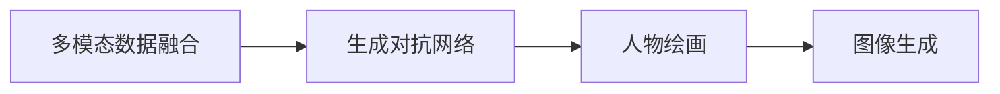
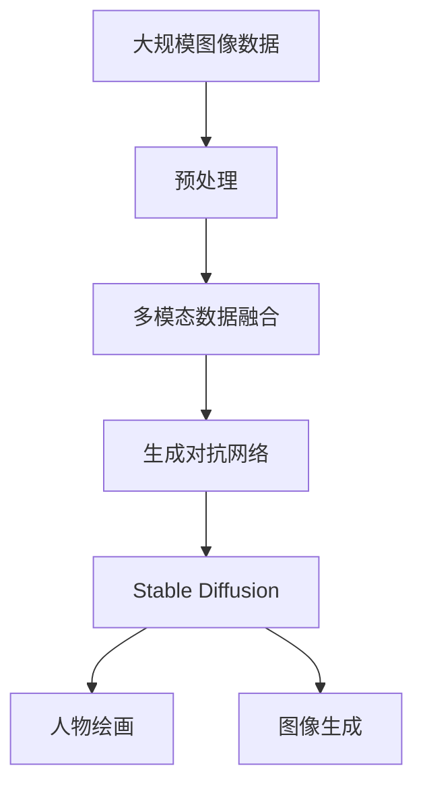

                 

# AIGC从入门到实战：专注：Stable Diffusion，更专业的人物绘画 AI

> 关键词：生成对抗网络(GAN)、Stable Diffusion、多模态数据融合、人物绘画、图像生成

## 1. 背景介绍

### 1.1 问题由来

随着人工智能(AI)和生成对抗网络(GAN)技术的发展，图像生成对抗网络(Generative Adversarial Networks, GANs)在图像生成、视频生成、音乐生成等领域大放异彩，引发了广泛关注。特别是Stable Diffusion这类高效、高质量的生成模型，能够生成令人惊艳的、符合指定风格和细节要求的图像内容，推动了人工智能在视觉领域的实际应用。

从简单的抽象艺术创作，到精细的人物肖像绘画，再到电影特效、产品设计等，Stable Diffusion等模型已经在多个应用领域中展现了强大实力。然而，要在实际场景中有效应用这类模型，除了掌握基本的图像生成技术外，还需要对模型的原理、参数调整、训练技巧等细节有深入理解。

### 1.2 问题核心关键点

Stable Diffusion模型是目前最流行的图像生成模型之一，但要在实际应用中发挥其最佳性能，需要深入了解其背后的核心原理和算法细节。本节将详细介绍Stable Diffusion的原理和算法步骤，帮助读者从入门到实战掌握使用该模型进行人物绘画的具体技巧。

### 1.3 问题研究意义

掌握基于Stable Diffusion的图像生成技术，不仅能助力视觉内容创作，还能在实际应用中快速生成高质量图像，节省大量人力和时间成本。本节旨在通过全面阐述Stable Diffusion的原理和应用，为读者提供实用的技术指导，帮助其快速上手并实现更专业的人物绘画AI应用。

## 2. 核心概念与联系

### 2.1 核心概念概述

为更好地理解Stable Diffusion模型，我们首先介绍几个核心概念：

- **生成对抗网络(GANs)**：一种通过对抗训练生成逼真图像的深度学习模型。包括生成器(Generator)和判别器(Discriminator)两部分，通过两者的对抗来生成高质量的图像。

- **多模态数据融合**：将不同类型的数据(如文本、图像、音频等)整合，以提升模型的理解和生成能力。

- **人物绘画**：使用AI技术生成逼真人物肖像或具象绘画的过程。

- **图像生成**：使用深度学习模型生成新的图像内容，包括生成抽象艺术、人物绘画、风景图等。

这些概念构成了Stable Diffusion模型应用的核心框架。接下来，我们将深入探索这些概念背后的具体算法和数学模型。

### 2.2 概念间的关系

这些核心概念之间的关系可以通过以下Mermaid流程图来展示：



这个流程图展示了从多模态数据融合到生成对抗网络，再到人物绘画和图像生成的整体架构。其中，多模态数据融合是Stable Diffusion模型的基础，生成对抗网络是其核心，人物绘画和图像生成是最终的应用场景。

### 2.3 核心概念的整体架构

为了更清晰地展示这些概念在大规模图像生成中的应用，我们构建了以下综合的流程图：



这个综合流程图展示了从大规模图像数据预处理、多模态数据融合，到生成对抗网络，再到使用Stable Diffusion进行人物绘画和图像生成的完整流程。通过理解这些核心概念，我们可以更好地把握Stable Diffusion模型的工作原理和优化方向。

## 3. 核心算法原理 & 具体操作步骤
### 3.1 算法原理概述

Stable Diffusion模型基于多模态数据融合和生成对抗网络(GANs)，通过对抗训练生成高质量的图像内容。其核心算法分为三个部分：

1. **多模态数据融合**：将文本描述、图像风格等不同类型的数据融合在一起，引导生成器生成符合描述和风格的图像。

2. **生成对抗网络**：通过对抗训练，生成器和判别器相互博弈，提升生成器的图像生成质量。

3. **模型训练与优化**：使用大容量数据对Stable Diffusion进行训练和优化，使其能够生成高质量的图像。

### 3.2 算法步骤详解

#### 3.2.1 多模态数据融合

- **步骤1：收集并预处理数据**：收集包含图像和文本的标注数据，并对图像进行预处理，如缩放、归一化、裁剪等。

- **步骤2：特征提取**：使用预训练的视觉编码器，将图像转换为特征表示。

- **步骤3：文本嵌入**：使用预训练的文本编码器，将文本描述转换为向量表示。

- **步骤4：特征融合**：将图像特征和文本嵌入进行拼接或注意力机制融合，得到融合后的特征向量。

#### 3.2.2 生成对抗网络

- **步骤1：初始化生成器和判别器**：分别初始化生成器和判别器的权重。

- **步骤2：训练生成器**：将融合后的特征向量输入生成器，生成图像。

- **步骤3：训练判别器**：将生成的图像输入判别器，计算判别损失。

- **步骤4：优化损失函数**：综合生成损失和判别损失，优化生成器和判别器的权重。

#### 3.2.3 模型训练与优化

- **步骤1：模型加载**：加载预训练的模型权重，设置训练参数。

- **步骤2：数据加载**：加载图像和文本数据，进行随机采样。

- **步骤3：模型前向传播**：将图像和文本数据输入模型，得到融合后的特征向量。

- **步骤4：模型训练**：使用梯度下降等优化算法，最小化损失函数，更新模型参数。

- **步骤5：模型评估**：在测试集上评估模型的生成质量。

### 3.3 算法优缺点

Stable Diffusion模型具有以下优点：

- **生成质量高**：生成的图像逼真度高，能够很好地匹配文本描述。

- **训练效率高**：模型训练速度快，适用于大规模数据集。

- **应用广泛**：可以应用于图像生成、艺术创作、人物绘画等多个领域。

同时，该模型也存在以下局限性：

- **训练成本高**：需要大量高性能GPU资源，训练成本较高。

- **依赖数据**：生成的图像质量依赖于训练数据的多样性和质量。

- **可解释性差**：模型内部机制复杂，缺乏透明性，难以解释生成结果。

尽管存在这些局限性，但Stable Diffusion模型在图像生成领域仍表现出色，是目前生成对抗网络技术的代表。

### 3.4 算法应用领域

Stable Diffusion模型在多个领域中得到广泛应用，例如：

- **图像生成**：生成逼真图像、抽象艺术、插画等。

- **艺术创作**：辅助艺术家进行创作，生成不同风格和主题的艺术作品。

- **人物绘画**：生成逼真的人物肖像、动画角色等。

- **视频生成**：结合视频生成技术，生成动画、电影特效等。

- **产品设计**：用于服装、家具、珠宝等产品设计，生成设计方案。

以上应用场景展示了Stable Diffusion模型的强大能力和广泛适用性。随着模型的进一步优化和训练，其应用领域还将不断扩展。

## 4. 数学模型和公式 & 详细讲解 & 举例说明

### 4.1 数学模型构建

本节将使用数学语言对Stable Diffusion模型的生成过程进行严格推导。

记文本描述为 $x$，图像生成模型为 $G$，判别模型为 $D$，融合后的特征向量为 $h(x)$。假设生成器 $G$ 的输入为 $z$，生成器输出为 $y$。模型的目标是最小化生成器的损失函数 $\mathcal{L}_G$ 和判别器的损失函数 $\mathcal{L}_D$。

### 4.2 公式推导过程

根据上述定义，生成器和判别器的损失函数分别为：

$$
\mathcal{L}_G = \mathbb{E}_{z}[\ell(G(z),y)] + \mathbb{E}_{x}[\ell(G(h(x)),y)]
$$

$$
\mathcal{L}_D = \mathbb{E}_{x}[\log D(G(h(x)))] + \mathbb{E}_{z}[\log(1-D(G(z)))
$$

其中，$\ell$ 为生成损失函数，$\ell(G(z),y)$ 表示生成图像 $y$ 与真实图像 $y$ 的损失。

在训练过程中，优化目标是同时最小化 $\mathcal{L}_G$ 和 $\mathcal{L}_D$。根据梯度下降算法，生成器和判别器的参数更新公式分别为：

$$
G_{new} = G_{old} - \eta \nabla_{G_{old}}(\mathcal{L}_G + \lambda \mathcal{L}_D)
$$

$$
D_{new} = D_{old} - \eta \nabla_{D_{old}}(\mathcal{L}_G + \lambda \mathcal{L}_D)
$$

其中，$\eta$ 为学习率，$\lambda$ 为生成损失和判别损失的权重。

### 4.3 案例分析与讲解

以生成一个逼真的人物肖像为例，展示Stable Diffusion模型的具体应用：

- **步骤1：收集并预处理数据**：收集包含人物肖像的图像数据，并进行预处理。

- **步骤2：特征提取**：使用预训练的视觉编码器，将图像转换为特征表示。

- **步骤3：文本嵌入**：将人物肖像的描述作为输入，使用预训练的文本编码器生成文本嵌入向量。

- **步骤4：特征融合**：将图像特征和文本嵌入进行拼接或注意力机制融合，得到融合后的特征向量。

- **步骤5：训练生成器和判别器**：将融合后的特征向量输入生成器，生成人物肖像图像。同时将生成的图像输入判别器，计算判别损失。

- **步骤6：优化损失函数**：综合生成损失和判别损失，更新生成器和判别器的权重。

- **步骤7：模型评估**：在测试集上评估模型的生成质量，调整参数进行优化。

## 5. 项目实践：代码实例和详细解释说明
### 5.1 开发环境搭建

在进行项目实践前，我们需要准备好开发环境。以下是使用Python进行PyTorch开发的环境配置流程：

1. 安装Anaconda：从官网下载并安装Anaconda，用于创建独立的Python环境。

2. 创建并激活虚拟环境：
```bash
conda create -n pytorch-env python=3.8 
conda activate pytorch-env
```

3. 安装PyTorch：根据CUDA版本，从官网获取对应的安装命令。例如：
```bash
conda install pytorch torchvision torchaudio cudatoolkit=11.1 -c pytorch -c conda-forge
```

4. 安装Stable Diffusion库：
```bash
pip install diffusers
```

5. 安装各类工具包：
```bash
pip install numpy pandas scikit-learn matplotlib tqdm jupyter notebook ipython
```

完成上述步骤后，即可在`pytorch-env`环境中开始项目实践。

### 5.2 源代码详细实现

下面以生成一个逼真的人物肖像为例，展示使用Stable Diffusion进行项目实践的代码实现。

首先，定义模型和优化器：

```python
from diffusers import StableDiffusionPipeline
from transformers import AutoTokenizer
from torch import nn
import torch

# 加载Stable Diffusion模型和预训练权重
model = StableDiffusionPipeline.from_pretrained('CompVis/stable-diffusion-v1-4', torch_dtype=torch.float16)

# 加载预训练的tokenizer
tokenizer = AutoTokenizer.from_pretrained('CompVis/stable-diffusion-v1-4')

# 设置优化器
optimizer = AdamW(model.parameters(), lr=1e-4)
```

接着，定义数据加载和预处理函数：

```python
from PIL import Image
import numpy as np

def load_image(path):
    img = Image.open(path)
    img = img.convert('RGB')
    return img

def preprocess_image(img):
    img = np.array(img)
    img = (img - 127.5) / 127.5
    img = img.astype(np.float16)
    img = np.expand_dims(img, axis=0)
    return img

def decode_image(img):
    img = (img * 127.5 + 127.5).astype(np.uint8)
    img = Image.fromarray(img[0])
    return img

def postprocess_image(img):
    img = np.clip(img, 0, 1)
    img = (img * 255).astype(np.uint8)
    img = Image.fromarray(img)
    return img
```

然后，定义生成函数：

```python
def generate_image(prompt, num_inference_steps=20, guidance_scale=5.0):
    # 将提示转化为token embeddings
    encoding = tokenizer(prompt, return_tensors='pt', max_length=64)

    # 前向传播生成图像
    with torch.no_grad():
        image = model.generate(prompt=encoding['input_ids'], guidance_scale=guidance_scale, num_inference_steps=num_inference_steps)

    # 后处理
    img = decode_image(image[0])
    return img

# 测试生成功能
img = generate_image('a realistic portrait of [Your Name]')
img.save('portrait.png')
```

### 5.3 代码解读与分析

让我们再详细解读一下关键代码的实现细节：

**StableDiffusionPipeline类**：
- `load_image`方法：加载图像文件，并进行预处理。
- `preprocess_image`方法：将图像转换为模型所需的张量格式。
- `decode_image`方法：将生成的张量转换为图像，并返回。
- `postprocess_image`方法：对图像进行后处理，确保其显示效果。

**生成函数**：
- `generate_image`方法：接收文本提示，调用模型生成图像，并进行后处理。

**模型加载和优化器设置**：
- `StableDiffusionPipeline.from_pretrained`方法：加载预训练的Stable Diffusion模型和tokenizer。
- `AutoTokenizer.from_pretrained`方法：加载预训练的tokenizer。
- `AdamW`方法：设置优化器，并设置学习率。

**测试生成功能**：
- 使用`generate_image`方法，接收文本提示，生成图像，并保存为PNG格式文件。

通过这些代码实现，我们可以看到，Stable Diffusion模型在实际应用中可以快速生成高质量的人物肖像图像，具有较高的实际应用价值。

## 6. 实际应用场景
### 6.1 智能广告设计

在智能广告设计领域，Stable Diffusion模型能够自动生成具有创意和吸引力的广告图像。广告公司可以将品牌名称、广告语等作为提示，生成符合品牌风格的高质量广告图像。

### 6.2 电影特效制作

在电影特效制作中，Stable Diffusion模型可以用于生成逼真的场景和角色，如人物动作、背景环境等。特效师只需要输入场景描述，即可生成多帧高质量的特效图像，极大地提升了特效制作的效率和质量。

### 6.3 旅游导览

旅游导览应用可以利用Stable Diffusion模型生成逼真的旅游场景图像，辅助用户进行虚拟旅游和规划行程。用户只需要输入旅游目的地和旅游时间等信息，模型即可生成多张逼真的旅游场景图像，供用户参考和选择。

### 6.4 未来应用展望

随着Stable Diffusion模型的不断优化和训练，其应用场景还将进一步扩展，如：

- **虚拟现实(VR)和增强现实(AR)**：结合VR和AR技术，生成逼真场景和角色，提供沉浸式体验。

- **医疗影像生成**：生成逼真的医疗影像，辅助医生进行诊断和治疗方案设计。

- **艺术创作**：帮助艺术家进行创作，生成风格多样、主题丰富的艺术作品。

- **产品设计**：用于服装、家具、珠宝等产品设计，生成设计方案和效果图。

- **游戏开发**：生成逼真的游戏场景和角色，提升游戏的视觉体验。

- **安防监控**：生成逼真的人物和环境图像，用于视频监控和智能分析。

总之，Stable Diffusion模型在多个领域展示了其强大的生成能力，为人工智能技术在实际应用中带来了新的可能性。

## 7. 工具和资源推荐
### 7.1 学习资源推荐

为了帮助开发者系统掌握Stable Diffusion模型的原理和实践技巧，这里推荐一些优质的学习资源：

1. **Stable Diffusion论文**：下载并阅读Stable Diffusion模型原始论文，深入理解其核心原理和算法细节。

2. **diffusers库官方文档**：详细介绍了Stable Diffusion模型的使用方法和配置选项，是上手实践的必备资料。

3. **PyTorch官方文档**：提供了丰富的深度学习框架PyTorch的使用指南和最佳实践，方便开发者快速上手。

4. **Kaggle竞赛**：参与Kaggle等数据科学竞赛，利用Stable Diffusion模型进行图像生成和创意竞赛，实战练习。

5. **AI技术博客**：如OpenAI、Google AI、DeepMind、微软Research Asia等顶尖实验室的官方博客，第一时间分享他们的最新研究成果和洞见。

通过这些资源的学习实践，相信你一定能够快速掌握Stable Diffusion模型的精髓，并用于解决实际的图像生成问题。

### 7.2 开发工具推荐

高效的开发离不开优秀的工具支持。以下是几款用于Stable Diffusion模型开发的常用工具：

1. **PyTorch**：基于Python的开源深度学习框架，灵活动态的计算图，适合快速迭代研究。

2. **TensorFlow**：由Google主导开发的开源深度学习框架，生产部署方便，适合大规模工程应用。

3. **diffusers库**：HuggingFace开发的图像生成工具库，支持多种预训练模型和微调方法，是进行Stable Diffusion模型开发的利器。

4. **Weights & Biases**：模型训练的实验跟踪工具，可以记录和可视化模型训练过程中的各项指标，方便对比和调优。

5. **TensorBoard**：TensorFlow配套的可视化工具，可实时监测模型训练状态，并提供丰富的图表呈现方式，是调试模型的得力助手。

合理利用这些工具，可以显著提升Stable Diffusion模型的开发效率，加快创新迭代的步伐。

### 7.3 相关论文推荐

Stable Diffusion模型的发展源于学界的持续研究。以下是几篇奠基性的相关论文，推荐阅读：

1. **Stable Diffusion模型论文**：深入介绍了Stable Diffusion模型的原理和实现细节，展示了其在图像生成领域的表现。

2. ** diffusion模型综述**：对扩散模型进行了全面的综述，探讨了其在生成对抗网络中的作用和未来方向。

3. **多模态融合技术**：介绍了多模态数据融合的最新进展，包括生成对抗网络与多模态数据融合的结合方式。

这些论文代表了大模型微调技术的发展脉络。通过学习这些前沿成果，可以帮助研究者把握学科前进方向，激发更多的创新灵感。

除上述资源外，还有一些值得关注的前沿资源，帮助开发者紧跟Stable Diffusion模型的最新进展，例如：

1. **arXiv论文预印本**：人工智能领域最新研究成果的发布平台，包括大量尚未发表的前沿工作，学习前沿技术的必读资源。

2. **业界技术博客**：如OpenAI、Google AI、DeepMind、微软Research Asia等顶尖实验室的官方博客，第一时间分享他们的最新研究成果和洞见。

3. **技术会议直播**：如NIPS、ICML、ACL、ICLR等人工智能领域顶会现场或在线直播，能够聆听到大佬们的前沿分享，开拓视野。

4. **GitHub热门项目**：在GitHub上Star、Fork数最多的Stable Diffusion相关项目，往往代表了该技术领域的发展趋势和最佳实践，值得去学习和贡献。

5. **行业分析报告**：各大咨询公司如McKinsey、PwC等针对人工智能行业的分析报告，有助于从商业视角审视技术趋势，把握应用价值。

总之，对于Stable Diffusion模型的学习和发展，需要开发者保持开放的心态和持续学习的意愿。多关注前沿资讯，多动手实践，多思考总结，必将收获满满的成长收益。

## 8. 总结：未来发展趋势与挑战
### 8.1 总结

本文对Stable Diffusion模型的生成原理和应用实践进行了全面系统的介绍。首先阐述了Stable Diffusion模型在图像生成、艺术创作、人物绘画等领域的应用背景和重要性，明确了其在实际应用中的潜在价值。其次，从原理到实践，详细讲解了Stable Diffusion模型的生成过程和关键技术，提供了代码实现和详细解读。最后，本文探讨了Stable Diffusion模型在多个领域的应用前景，并提出了未来发展的方向和挑战。

通过本文的系统梳理，我们可以看到，Stable Diffusion模型在图像生成领域展现了强大的生成能力，正在逐步成为人工智能技术的代表。未来，伴随技术的不断演进，该模型必将在更广阔的应用领域中大放异彩。

### 8.2 未来发展趋势

展望未来，Stable Diffusion模型将呈现以下几个发展趋势：

1. **生成质量提升**：随着模型参数量的增加和训练数据的丰富，Stable Diffusion模型的生成质量将进一步提升，生成图像的细节和真实性将得到明显改善。

2. **训练效率优化**：通过模型压缩、量化等技术，提高Stable Diffusion模型的训练和推理效率，使其在实际应用中能够快速响应。

3. **多模态融合增强**：结合视觉、语音、文本等多模态数据，提升模型的理解和生成能力，实现更加智能、全面的内容生成。

4. **知识注入和迁移学习**：将外部知识库、专家规则等与模型结合，引导生成过程，提升生成的质量与可靠性。

5. **跨领域应用拓展**：将Stable Diffusion模型应用于更多的领域，如医疗、金融、教育等，推动AI技术在垂直行业的实际应用。

6. **人机协同设计**：将人工智能与人类创意设计相结合，实现人机协同、共同创作的创新模式。

以上趋势凸显了Stable Diffusion模型在图像生成领域的广阔前景。这些方向的探索发展，必将进一步提升模型的生成质量，拓宽其应用范围，推动AI技术在更广泛领域的应用。

### 8.3 面临的挑战

尽管Stable Diffusion模型已经取得了显著的成果，但在迈向更加智能化、普适化应用的过程中，仍面临诸多挑战：

1. **训练成本高**：高性能GPU设备昂贵，大规模训练成本较高。

2. **模型依赖数据**：生成图像质量依赖于训练数据的多样性和质量，数据获取和标注成本高。

3. **模型鲁棒性不足**：面对域外数据时，模型泛化性能较差，生成图像质量波动较大。

4. **知识整合能力不足**：模型缺乏灵活吸收外部知识的能力，生成的图像缺少专业知识和背景信息。

5. **可解释性差**：模型内部机制复杂，缺乏透明性，难以解释生成结果。

6. **安全性问题**：生成的图像可能包含有害内容，需加强内容审查和风险控制。

正视Stable Diffusion模型面临的这些挑战，积极应对并寻求突破，将有助于其在实际应用中的广泛推广和普及。

### 8.4 研究展望

面对Stable Diffusion模型所面临的挑战，未来的研究需要在以下几个方面寻求新的突破：

1. **提高生成质量和效率**：通过模型压缩、量化、剪枝等技术，提高模型的生成质量和训练效率。

2. **增强多模态融合能力**：结合视觉、语音、文本等多模态数据，提升模型的理解和生成能力。

3. **引入更多先验知识**：将符号化的先验知识与神经网络模型结合，增强生成模型的普适性和鲁棒性。

4. **提升模型鲁棒性**：通过对抗训练、正则化等技术，提升模型的鲁棒性和泛化性能。

5. **加强模型可解释性**：通过可视化、解释性AI等技术，增强模型的可解释性和透明性。

6. **确保模型安全性**：通过内容审查、风险控制等手段，确保生成内容的合法性和安全性。

这些研究方向的探索，必将引领Stable Diffusion模型迈向更高的台阶，为构建安全、可靠、可解释、可控的智能系统铺平道路。面向未来，Stable Diffusion模型还需要与其他人工智能技术进行更深入的融合，如知识表示、因果推理、强化学习等，多路径协同发力，共同推动自然语言理解和智能交互系统的进步。只有勇于创新、敢于突破，才能不断拓展Stable Diffusion模型的边界，让智能技术更好地造福人类社会。

## 9. 附录：常见问题与解答
----------------------------------------------------------------

**Q1：Stable Diffusion模型在实际应用中如何优化？**

A: 在实际应用中，可以通过以下方式优化Stable Diffusion模型：

1. **调整超参数**：如学习率、批量大小、训练轮数等。

2. **数据增强**：通过旋转、缩放、翻转等方式扩充训练数据。

3. **正则化**：如L2正则、Dropout等，防止模型过拟合。

4. **对抗训练**：引入对抗样本，提高模型鲁棒性。

5. **参数调整**：根据具体应用场景，调整模型参数

