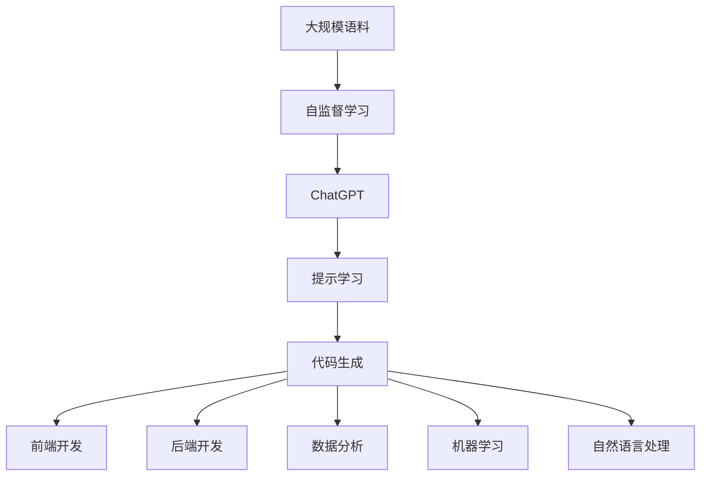

                 

# AIGC从入门到实战：赋能：高级技能，利用 ChatGPT 来快速编程

在数字化时代，人工智能（AI）和生成式人工智能（Generative AI，AIGC）正在迅速改变各个行业的面貌。ChatGPT等生成式模型通过强大的语言理解和生成能力，让编程、写作、设计、艺术创作等领域的工作变得更加高效和创意。本文将深入探讨AIGC技术，特别是利用ChatGPT进行编程，从入门到实战，全面剖析其原理与应用，并给出详细的实践指导。

## 1. 背景介绍

### 1.1 问题由来

随着AI技术的快速发展，生成式AI（AIGC）已成为新一代人工智能的重要方向。与传统的基于规则或数据驱动的AI不同，AIGC模型如GPT、ChatGPT等，能够根据输入数据自动生成自然语言文本，包括但不限于代码、文本、设计方案、电影剧本等，极大地提升了工作效率和创新能力。

ChatGPT作为当前最热门的AIGC模型之一，通过深度学习和大规模语料预训练，掌握了广泛的语义理解和生成能力。利用ChatGPT，程序员可以轻松编写代码、设计师可以生成创意方案、编剧可以创作剧本等。然而，对于初学者而言，如何高效地利用ChatGPT进行AIGC编程，仍是一个值得深入探讨的问题。

### 1.2 问题核心关键点

AIGC的核心在于生成式模型的训练与应用。ChatGPT等模型通过在大规模语料库上进行自监督学习，学习到语言的通用表示，从而具备强大的语言理解和生成能力。这种能力不仅限于自然语言生成，还广泛应用于编程领域。

AIGC编程的核心在于将自然语言转化为可执行的代码。ChatGPT通过接收自然语言输入，自动生成相应的代码片段，甚至完整的代码程序。其应用领域包括但不限于前端开发、后端开发、数据分析、机器学习、自然语言处理等。

利用ChatGPT进行编程，关键在于如何高效地获取和处理自然语言输入，并将其转换为可执行的代码。本文将深入探讨这一过程，并给出详细的实践指导。

## 2. 核心概念与联系

### 2.1 核心概念概述

为更好地理解ChatGPT在编程中的应用，本节将介绍几个密切相关的核心概念：

- **生成式人工智能（Generative AI, AIGC）**：通过深度学习模型，自动生成自然语言文本、图像、音频等内容的技术。ChatGPT是AIGC技术的典型代表之一。
- **自监督学习（Self-supervised Learning）**：在无需人工标注的情况下，利用数据的内在结构进行模型训练。ChatGPT通过在大规模语料库上进行自监督学习，学习到语言的通用表示。
- **代码生成（Code Generation）**：利用AI模型自动生成代码的过程。ChatGPT可以通过自然语言输入，自动生成符合编程规范的代码片段。
- **提示学习（Prompt Learning）**：通过精心设计输入格式，引导ChatGPT输出特定类型的文本或代码。这在ChatGPT编程中尤为重要。

### 2.2 概念间的关系

这些核心概念之间的逻辑关系可以通过以下Mermaid流程图来展示：



这个流程图展示了大规模语料、自监督学习、ChatGPT、提示学习和代码生成之间的关系：

1. 大规模语料通过自监督学习训练出ChatGPT。
2. ChatGPT在提示学习引导下，生成符合特定编程任务的代码。
3. 生成的代码可以应用于前端开发、后端开发、数据分析、机器学习、自然语言处理等多个领域。

这些概念共同构成了AIGC编程的基本框架，使ChatGPT能够高效地应用于编程任务。

## 3. 核心算法原理 & 具体操作步骤
### 3.1 算法原理概述

利用ChatGPT进行编程，本质上是将自然语言指令转换为可执行的代码。其核心算法包括：

- **自然语言处理（NLP）**：将自然语言指令解析为可理解的语义。
- **代码生成**：基于语义生成符合编程规范的代码片段。
- **代码优化**：对生成的代码进行语法检查、代码优化等处理，确保其正确性和可执行性。

### 3.2 算法步骤详解

利用ChatGPT进行编程的一般步骤如下：

1. **问题描述**：将编程任务描述为自然语言指令，明确输入数据、输出结果和代码要求。
2. **模型调用**：通过API调用ChatGPT模型，传入自然语言指令，获取生成的代码片段。
3. **代码验证**：对生成的代码进行语法检查和代码优化，确保其正确性和可执行性。
4. **测试执行**：在实际环境中测试生成的代码，验证其功能和性能。
5. **迭代优化**：根据测试结果，反复迭代优化代码，直至满足要求。

### 3.3 算法优缺点

利用ChatGPT进行编程的优点包括：

- **高效性**：相较于手动编写代码，ChatGPT能够显著提高编程效率，减少开发时间。
- **灵活性**：ChatGPT可以根据不同的任务需求，生成灵活多样的代码实现。
- **创新性**：ChatGPT能够根据最新的技术和趋势，生成具有前瞻性的代码方案。

其缺点包括：

- **依赖性**：ChatGPT生成的代码依赖于其训练数据和模型架构，可能存在特定领域的局限性。
- **准确性**：生成的代码需要人工验证和优化，确保其正确性和健壮性。
- **可解释性**：ChatGPT的生成过程较难解释，代码背后的逻辑和决策过程较难理解。

### 3.4 算法应用领域

ChatGPT在编程中的应用领域非常广泛，涵盖前端开发、后端开发、数据分析、机器学习、自然语言处理等多个方面。以下是几个具体的应用场景：

- **前端开发**：生成HTML、CSS、JavaScript等前端代码，加速前端开发流程。
- **后端开发**：生成Python、Java、C++等后端代码，快速实现业务逻辑。
- **数据分析**：生成Pandas、NumPy等数据分析库的代码，处理和分析大量数据。
- **机器学习**：生成TensorFlow、PyTorch等框架的代码，实现机器学习模型和算法。
- **自然语言处理**：生成NLTK、SpaCy等库的代码，处理和生成自然语言文本。

## 4. 数学模型和公式 & 详细讲解  
### 4.1 数学模型构建

利用ChatGPT进行编程，可以通过以下数学模型进行建模：

- **输入数据**：自然语言指令 $x$，描述编程任务。
- **输出数据**：生成的代码片段 $y$。
- **模型参数**：ChatGPT模型的权重和偏置，通过自监督学习训练得到。

模型的目标是最小化损失函数 $\mathcal{L}(y, \hat{y})$，其中 $\hat{y}$ 为模型生成的代码片段，$y$ 为期望的代码片段。

### 4.2 公式推导过程

假设输入为自然语言指令 $x$，输出为代码片段 $y$。利用ChatGPT生成代码的模型可以表示为：

$$ y = f(x; \theta) $$

其中 $f$ 为生成函数，$\theta$ 为模型参数。

通过反向传播算法，可以计算模型参数的梯度 $\frac{\partial \mathcal{L}}{\partial \theta}$，从而更新模型参数，最小化损失函数。

### 4.3 案例分析与讲解

以下是一个利用ChatGPT生成Python代码的示例：

1. **问题描述**：生成一个简单的函数，计算两个数的和。
2. **调用API**：
```python
from openai_gpt import OpenAI_GPT

model = OpenAI_GPT(api_key='YOUR_API_KEY')

prompt = "写一个函数，计算两个数的和"
result = model.complete(prompt, max_tokens=100)
```

3. **代码验证**：对生成的代码进行语法检查和代码优化，确保其正确性和可执行性。

4. **测试执行**：在实际环境中测试生成的代码，验证其功能和性能。

5. **迭代优化**：根据测试结果，反复迭代优化代码，直至满足要求。

## 5. 项目实践：代码实例和详细解释说明
### 5.1 开发环境搭建

在进行ChatGPT编程实践前，我们需要准备好开发环境。以下是使用Python进行OpenAI GPT API开发的步骤：

1. 安装OpenAI GPT API库：
```bash
pip install openai_gpt
```

2. 获取API密钥：注册OpenAI账户，获取API密钥。

3. 创建Python环境：
```bash
conda create -n chatgpt-env python=3.8 
conda activate chatgpt-env
```

完成上述步骤后，即可在`chatgpt-env`环境中开始ChatGPT编程实践。

### 5.2 源代码详细实现

以下是一个简单的利用ChatGPT生成Python代码的示例代码：

```python
from openai_gpt import OpenAI_GPT

# 获取API密钥
api_key = 'YOUR_API_KEY'

# 创建OpenAI GPT对象
model = OpenAI_GPT(api_key=api_key)

# 定义自然语言指令
prompt = "写一个函数，计算两个数的和"

# 调用API生成代码片段
result = model.complete(prompt, max_tokens=100)

# 打印生成代码片段
print(result['choices'][0]['text'])
```

### 5.3 代码解读与分析

让我们再详细解读一下关键代码的实现细节：

1. **OpenAI GPT对象创建**：通过指定API密钥，创建OpenAI GPT对象，用于调用API生成代码片段。
2. **自然语言指令定义**：将编程任务描述为自然语言指令，传入OpenAI GPT对象。
3. **API调用**：通过调用OpenAI GPT的`complete`方法，生成代码片段。
4. **代码片段输出**：获取生成的代码片段，并输出到控制台。

### 5.4 运行结果展示

假设在调用上述代码后，OpenAI GPT生成了以下Python代码：

```python
def add(a, b):
    return a + b
```

可以看到，生成的代码符合Python语法规范，能够正确计算两个数的和。

## 6. 实际应用场景
### 6.1 前端开发

利用ChatGPT，前端开发者可以快速生成HTML、CSS、JavaScript等代码，加速开发流程。以下是一个简单的示例：

```python
from openai_gpt import OpenAI_GPT

model = OpenAI_GPT(api_key='YOUR_API_KEY')

prompt = "生成一个简单的HTML页面，包括标题和段落"
result = model.complete(prompt, max_tokens=100)

print(result['choices'][0]['text'])
```

### 6.2 后端开发

在后端开发中，利用ChatGPT可以快速生成Python、Java、C++等语言的代码。以下是一个简单的Python示例：

```python
from openai_gpt import OpenAI_GPT

model = OpenAI_GPT(api_key='YOUR_API_KEY')

prompt = "写一个简单的Python函数，实现两个数的加法"
result = model.complete(prompt, max_tokens=100)

print(result['choices'][0]['text'])
```

### 6.3 数据分析

利用ChatGPT，可以快速生成Pandas、NumPy等数据分析库的代码，处理和分析大量数据。以下是一个简单的Pandas代码示例：

```python
from openai_gpt import OpenAI_GPT

model = OpenAI_GPT(api_key='YOUR_API_KEY')

prompt = "读取CSV文件，计算每列的平均值"
result = model.complete(prompt, max_tokens=100)

print(result['choices'][0]['text'])
```

### 6.4 机器学习

在机器学习领域，利用ChatGPT可以快速生成TensorFlow、PyTorch等框架的代码，实现机器学习模型和算法。以下是一个简单的TensorFlow代码示例：

```python
from openai_gpt import OpenAI_GPT

model = OpenAI_GPT(api_key='YOUR_API_KEY')

prompt = "构建一个简单的神经网络，进行手写数字识别"
result = model.complete(prompt, max_tokens=100)

print(result['choices'][0]['text'])
```

### 6.5 自然语言处理

在自然语言处理领域，利用ChatGPT可以快速生成NLTK、SpaCy等库的代码，处理和生成自然语言文本。以下是一个简单的NLTK代码示例：

```python
from openai_gpt import OpenAI_GPT

model = OpenAI_GPT(api_key='YOUR_API_KEY')

prompt = "使用NLTK进行文本分词"
result = model.complete(prompt, max_tokens=100)

print(result['choices'][0]['text'])
```

## 7. 工具和资源推荐
### 7.1 学习资源推荐

为了帮助开发者系统掌握ChatGPT在编程中的应用，这里推荐一些优质的学习资源：

1. **OpenAI官方文档**：提供了ChatGPT的详细使用说明和API接口，是开发者学习ChatGPT编程的必备资源。
2. **HuggingFace博客**：提供了大量关于ChatGPT和AIGC编程的实用技巧和案例，适合实战学习。
3. **GitHub开源项目**：包含大量基于ChatGPT的编程示例，开发者可以参考和借鉴。
4. **Coursera课程**：提供关于AIGC和ChatGPT的高级课程，适合深入学习。
5. **Kaggle竞赛**：利用ChatGPT解决实际问题，提升编程能力。

通过对这些资源的学习实践，相信你一定能够快速掌握ChatGPT在编程中的高效应用。

### 7.2 开发工具推荐

高效的开发离不开优秀的工具支持。以下是几款用于ChatGPT编程开发的常用工具：

1. **Jupyter Notebook**：用于编写和运行Python代码，支持代码解释和可视化输出。
2. **Visual Studio Code**：一款功能强大的IDE，支持多种编程语言和扩展插件。
3. **GitHub**：版本控制和代码托管平台，方便代码管理和共享。
4. **Python IDE**：如PyCharm、PyDev等，提供丰富的开发工具和插件。
5. **CodePen**：在线代码编辑器，支持HTML、CSS、JavaScript等前端代码的实时测试和展示。

合理利用这些工具，可以显著提升ChatGPT编程的开发效率，加快创新迭代的步伐。

### 7.3 相关论文推荐

ChatGPT和AIGC技术的发展源于学界的持续研究。以下是几篇奠基性的相关论文，推荐阅读：

1. **《Natural Language Processing with Transformers》**：提出了Transformer模型，开创了AIGC的新时代。
2. **《Attention is All You Need》**：提出了自注意力机制，大幅提升了语言模型的性能。
3. **《A Few Useful Things to Know About Sequence Models》**：提供了序列模型训练和优化的实用技巧。
4. **《Code Generation from Scratch》**：研究了从零开始的代码生成方法，为ChatGPT编程提供了理论基础。
5. **《Generating Code with Transformer Models》**：介绍了利用Transformer模型生成代码的实践方法。

这些论文代表了大语言模型在编程领域的最新进展。通过学习这些前沿成果，可以帮助研究者把握学科前进方向，激发更多的创新灵感。

除上述资源外，还有一些值得关注的前沿资源，帮助开发者紧跟ChatGPT编程技术的最新进展，例如：

1. **arXiv论文预印本**：人工智能领域最新研究成果的发布平台，包括大量尚未发表的前沿工作，学习前沿技术的必读资源。
2. **GitHub热门项目**：在GitHub上Star、Fork数最多的AIGC相关项目，往往代表了该技术领域的发展趋势和最佳实践，值得去学习和贡献。
3. **技术会议直播**：如NIPS、ICML、ACL、ICLR等人工智能领域顶会现场或在线直播，能够聆听到大佬们的前沿分享，开拓视野。
4. **学术期刊论文**：如《Journal of Artificial Intelligence Research》、《IEEE Transactions on Neural Networks and Learning Systems》等，提供最新的学术研究进展和理论基础。
5. **在线教育平台**：如Coursera、edX、Udacity等，提供关于AIGC和ChatGPT编程的在线课程，适合学习实战技能。

总之，对于ChatGPT编程技术的学习和实践，需要开发者保持开放的心态和持续学习的意愿。多关注前沿资讯，多动手实践，多思考总结，必将收获满满的成长收益。

## 8. 总结：未来发展趋势与挑战
### 8.1 总结

本文对利用ChatGPT进行编程的AIGC技术进行了全面系统的介绍。首先阐述了ChatGPT在编程中的应用背景和意义，明确了AIGC在提高编程效率、加速创新开发方面的独特价值。其次，从原理到实践，详细讲解了ChatGPT编程的数学模型和操作步骤，给出了详细的实践指导。同时，本文还广泛探讨了ChatGPT编程在多个行业领域的应用前景，展示了其广泛的适用性和潜力。

通过本文的系统梳理，可以看到，利用ChatGPT进行编程的AIGC技术正在成为新的编程范式，极大地提升了编程效率和创新能力。未来，伴随AIGC技术的进一步演进，ChatGPT编程必将在更广泛的场景中得到应用，为人工智能技术的发展带来新的突破。

### 8.2 未来发展趋势

展望未来，ChatGPT在编程中的应用将呈现以下几个发展趋势：

1. **模型规模持续增大**：随着算力成本的下降和数据规模的扩张，ChatGPT等模型将具备更强大的语言生成能力，生成更加丰富多样、高质量的代码。
2. **多模态编程能力增强**：ChatGPT将逐渐具备处理图像、音频等多模态信息的能力，生成更复杂、更全面的代码实现。
3. **跨领域编程能力提升**：ChatGPT将能够处理不同领域的编程任务，生成适应特定领域规范的代码，提升代码的适用性和鲁棒性。
4. **实时编程辅助**：ChatGPT将能够实时提供编程建议和代码生成，辅助程序员高效编写代码，减少出错率。
5. **协作编程增强**：ChatGPT将具备与人类协作的能力，支持多人协同编写代码，提升开发效率和代码质量。

这些趋势将进一步拓展ChatGPT编程的应用范围，提升编程效率和质量，为AI技术在各行各业的应用提供强有力的支撑。

### 8.3 面临的挑战

尽管ChatGPT编程在技术上取得了显著进展，但在实际应用中仍面临诸多挑战：

1. **准确性和鲁棒性**：生成的代码可能存在语法错误、逻辑错误等问题，需要人工验证和优化。
2. **依赖性和局限性**：ChatGPT生成的代码依赖于其训练数据和模型架构，可能存在特定领域的局限性。
3. **可解释性和透明性**：ChatGPT的生成过程较难解释，代码背后的逻辑和决策过程较难理解。
4. **安全和隐私**：生成的代码可能存在安全漏洞和隐私问题，需要进行严格的安全审查。
5. **版权和伦理**：ChatGPT生成的代码可能涉及版权和伦理问题，需要进行严格的审核和监管。

这些挑战需要研究者从技术、法律、伦理等多个维度进行全面应对，确保ChatGPT编程的安全性和可靠性。

### 8.4 研究展望

面对ChatGPT编程面临的挑战，未来的研究需要在以下几个方面寻求新的突破：

1. **提高准确性和鲁棒性**：开发更加准确和鲁棒的代码生成模型，提升生成代码的质量和可靠性。
2. **增强跨领域和跨模态编程能力**：扩展ChatGPT的编程能力，使其能够处理更多领域和模态的数据，生成更全面和适用的代码。
3. **提升可解释性和透明性**：研究如何提高ChatGPT的代码生成过程的可解释性和透明性，确保其决策逻辑可理解、可解释。
4. **确保安全和隐私**：研究如何检测和修复生成的代码中的安全漏洞和隐私问题，确保其安全性和合规性。
5. **规范版权和伦理**：制定和推广关于ChatGPT编程的版权和伦理规范，确保其应用符合法律和道德要求。

这些研究方向将引领ChatGPT编程技术迈向更高的台阶，为人工智能技术的发展提供坚实的基础。

## 9. 附录：常见问题与解答

**Q1：ChatGPT编程是否适用于所有编程任务？**

A: 利用ChatGPT进行编程，虽然能够生成高效的代码，但其适用范围仍有限。对于复杂、需要高度定制化的编程任务，ChatGPT可能难以生成理想的结果。开发者应结合自身需求，合理选择编程工具和方法。

**Q2：如何提高ChatGPT生成的代码质量？**

A: 提高ChatGPT生成的代码质量，需要多方面努力：

1. **优化提示词**：通过精心设计提示词，明确代码生成要求，引导ChatGPT生成高质量的代码。
2. **多次迭代优化**：对生成的代码进行人工验证和优化，逐步迭代提升代码质量。
3. **使用多个模型**：结合多个ChatGPT模型，利用其多样性生成高质量的代码片段，综合选择最佳结果。
4. **引入外部知识库**：将领域内的知识库、规则库等与ChatGPT结合，提高代码生成准确性和适用性。

**Q3：ChatGPT生成的代码是否需要人工验证？**

A: 由于ChatGPT生成的代码仍可能存在语法错误、逻辑错误等问题，因此需要进行人工验证和优化。开发者应结合自身需求，合理选择是否进行人工验证。

**Q4：ChatGPT编程是否需要付费？**

A: 使用OpenAI GPT API进行ChatGPT编程，需要支付一定的费用。开发者应根据自身需求和预算，合理选择付费方案。

**Q5：ChatGPT编程有哪些限制？**

A: ChatGPT编程仍存在一些限制：

1. **数据依赖性**：生成的代码依赖于其训练数据和模型架构，可能存在特定领域的局限性。
2. **准确性和鲁棒性**：生成的代码可能存在语法错误、逻辑错误等问题，需要人工验证和优化。
3. **可解释性和透明性**：ChatGPT的生成过程较难解释，代码背后的逻辑和决策过程较难理解。
4. **安全和隐私**：生成的代码可能存在安全漏洞和隐私问题，需要进行严格的安全审查。
5. **版权和伦理**：ChatGPT生成的代码可能涉及版权和伦理问题，需要进行严格的审核和监管。

通过本文的系统梳理，可以看到，利用ChatGPT进行编程的AIGC技术正在成为新的编程范式，极大地提升了编程效率和创新能力。未来，伴随AIGC技术的进一步演进，ChatGPT编程必将在更广泛的场景中得到应用，为人工智能技术的发展提供强有力的支撑。

---

作者：禅与计算机程序设计艺术 / Zen and the Art of Computer Programming

