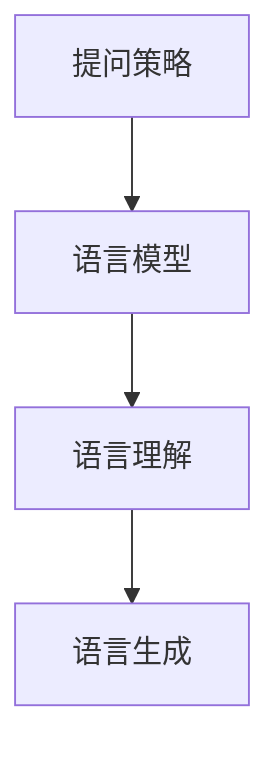
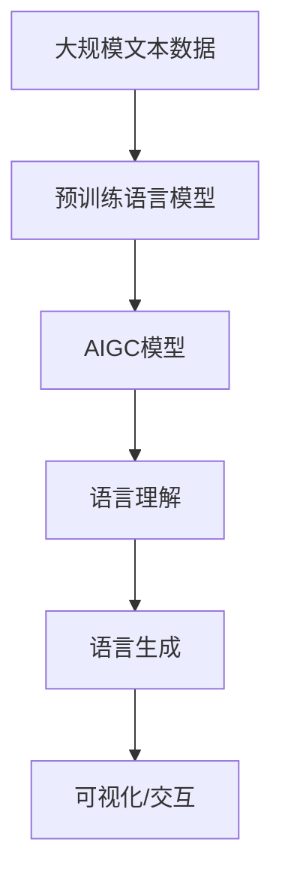
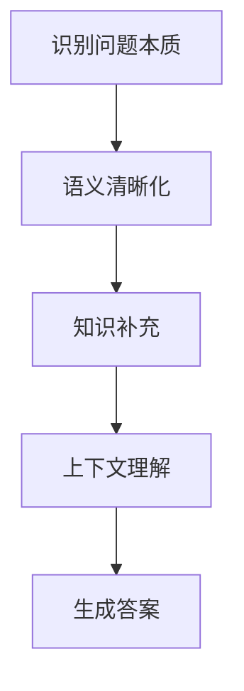

                 

# AIGC从入门到实战：进阶：如何提问以获得高质量答案，解决复杂问题

> 关键词：AIGC, 自然语言处理(NLP), 人工智能生成内容(AIGC), 语言模型, 语言理解, 提问策略, 高质量回答

## 1. 背景介绍

### 1.1 问题由来

随着人工智能（AI）技术的迅猛发展，人工智能生成内容（AIGC）在各个领域的应用变得越来越广泛，从内容创作到辅助决策，AIGC技术带来了巨大的便利。然而，AIGC技术的核心依赖于语言模型，如何提升这些模型的语言理解和生成能力，成为了当前AIGC技术研究的一个重要课题。

在大规模语言模型的基础上，AIGC技术已经在文本生成、对话系统、机器翻译等多个领域取得了显著进展。这些模型的语言理解能力虽然强大，但仍然面临着复杂性和多样性，特别是在处理语义模糊、信息缺失等情况下，模型的表现往往不尽如人意。

为了进一步提升AIGC技术的效果，如何有效提问，让模型生成高质量的文本答案，成为了一个亟待解决的问题。本文将深入探讨如何通过提问策略，让AIGC模型生成更准确、更合理的答案。

### 1.2 问题核心关键点

AIGC技术的核心在于语言模型的理解和生成能力。然而，语言模型在理解和生成方面，依然存在一定的局限性。这些问题核心包括：

1. **语义模糊处理**：AIGC模型在处理多义、模糊的表达时，往往难以准确理解其真实含义。
2. **信息缺失处理**：在缺乏足够信息的情况下，AIGC模型可能无法生成合理的文本回答。
3. **上下文理解**：AIGC模型在理解上下文关系方面，仍存在一定的局限性，特别是在处理长文本时，模型可能无法完全理解上下文信息。
4. **语言模型局限**：现有的语言模型在生成答案时，往往缺乏对具体领域知识的了解，生成的答案可能不够专业、准确。

这些核心问题需要通过提问策略来解决，以提升AIGC模型的语言理解能力和生成质量。

### 1.3 问题研究意义

通过提问策略来提升AIGC模型的语言理解能力和生成质量，对于推动AIGC技术在更多领域的应用具有重要意义：

1. **降低开发成本**：通过精准提问，可以避免模型在理解上的误差，减少测试和调试的工作量，从而降低开发成本。
2. **提高回答质量**：精准的提问可以帮助AIGC模型生成更准确、更合理的答案，提升用户的满意度。
3. **增强用户信任**：高质量的提问和回答，能够增强用户对AIGC技术的信任，扩大其应用范围。
4. **促进技术发展**：精准的提问可以暴露模型在理解和生成方面的不足，推动AIGC技术在各个方向上的持续改进。
5. **推动产业应用**：AIGC技术在教育、医疗、金融等领域的广泛应用，依赖于高质量的提问和回答，促进了相关领域的数字化转型。

本文将系统探讨如何通过提问策略，提升AIGC模型的语言理解和生成能力，为AIGC技术的进一步发展提供理论依据和实践指导。

## 2. 核心概念与联系

### 2.1 核心概念概述

为了更好地理解如何通过提问策略来提升AIGC模型的语言理解能力和生成质量，本节将介绍几个密切相关的核心概念：

- **人工智能生成内容（AIGC）**：指通过人工智能技术生成的各种内容，包括文本、图像、视频等。AIGC技术广泛应用于内容创作、自动翻译、智能对话等领域。
- **自然语言处理（NLP）**：指研究如何让计算机理解和处理人类语言的技术，是AIGC技术的基础。
- **语言模型**：指用于处理和生成自然语言的工具，包括统计语言模型和深度学习语言模型。语言模型在AIGC技术中扮演着核心角色。
- **语言理解**：指模型理解自然语言文本的能力，包括识别语义、关系、情感等。
- **语言生成**：指模型基于语言理解生成自然语言文本的能力，包括文本摘要、对话、翻译等。

这些核心概念之间的逻辑关系可以通过以下Mermaid流程图来展示：

```mermaid
graph TB
    A[人工智能生成内容(AIGC)] --> B[自然语言处理(NLP)]
    B --> C[语言模型]
    C --> D[语言理解]
    D --> E[语言生成]
```

这个流程图展示了AIGC技术中各个关键组件之间的联系，其中语言模型是核心，语言理解与语言生成则是语言模型在AIGC中的具体应用。

### 2.2 概念间的关系

这些核心概念之间存在着紧密的联系，形成了AIGC技术的完整生态系统。下面我通过几个Mermaid流程图来展示这些概念之间的关系。

#### 2.2.1 AIGC技术的核心组件

```mermaid
graph LR
    A[人工智能生成内容(AIGC)] --> B[自然语言处理(NLP)]
    B --> C[语言模型]
    C --> D[语言理解]
    D --> E[语言生成]
    F[视觉模型] --> E
    G[音频模型] --> E
```

这个流程图展示了AIGC技术的核心组件。自然语言处理(NLP)是AIGC的基础，语言模型是核心，语言理解与语言生成是具体应用。同时，视觉模型和音频模型等也在AIGC中扮演着重要角色，推动了AIGC技术的进一步发展。

#### 2.2.2 提问策略与AIGC模型的关系



这个流程图展示了提问策略在AIGC模型中的应用。提问策略能够引导模型更好地理解问题的本质，生成更准确的答案。通过合理设计提问策略，可以显著提升AIGC模型的语言理解能力和生成质量。

#### 2.2.3 语言理解与生成之间的联系


这个流程图展示了语言理解与生成之间的联系。提问策略通过语言理解模块，使模型更好地理解问题，进而生成更准确的答案。

### 2.3 核心概念的整体架构

最后，我们用一个综合的流程图来展示这些核心概念在AIGC技术中的整体架构：



这个综合流程图展示了从预训练到生成内容的完整过程。大规模文本数据通过预训练语言模型学习通用语言表示，再通过AIGC模型进行语言理解与生成，最后生成可视化和交互式的结果。

## 3. 核心算法原理 & 具体操作步骤
### 3.1 算法原理概述

AIGC技术的核心在于语言模型的语言理解和生成能力。通过提问策略来提升AIGC模型的语言理解能力和生成质量，可以通过以下几个步骤实现：

1. **识别问题本质**：通过提问策略，明确问题的核心点和关键信息，帮助模型更好地理解问题。
2. **语义清晰化**：通过提问策略，将模糊不清的表达进行清晰化，使模型更容易理解。
3. **知识补充**：通过提问策略，补充模型在特定领域缺失的知识，增强模型的专业性和准确性。
4. **上下文理解**：通过提问策略，帮助模型更好地理解上下文关系，提高生成答案的连贯性和合理性。

这些步骤可以通过以下算法流程实现：



### 3.2 算法步骤详解

为了通过提问策略提升AIGC模型的语言理解能力和生成质量，我们可以遵循以下详细步骤：

**Step 1: 识别问题本质**

- **明确核心问题**：将复杂问题拆分为核心问题和辅助问题，确定核心问题的关键信息。
- **提取关键信息**：通过提问策略，提取问题中的关键信息，如时间、地点、人物、事件等。
- **消除歧义**：通过提问策略，消除问题中的歧义，明确表达。

**Step 2: 语义清晰化**

- **详细描述问题**：通过提问策略，详细描述问题的具体情境，帮助模型更好地理解问题。
- **提供背景信息**：通过提问策略，提供问题的背景信息，帮助模型理解问题的背景和上下文。
- **分解问题**：通过提问策略，将复杂问题分解为更小的子问题，使模型更容易理解。

**Step 3: 知识补充**

- **补充领域知识**：通过提问策略，补充模型在特定领域缺失的知识，增强模型的专业性和准确性。
- **引入外部信息**：通过提问策略，引入外部信息，如背景资料、权威数据等，帮助模型生成更准确的回答。
- **引入专家意见**：通过提问策略，引入专家意见，提高模型的可信度和专业性。

**Step 4: 上下文理解**

- **理解上下文关系**：通过提问策略，帮助模型理解问题的上下文关系，提高生成答案的连贯性和合理性。
- **考虑时间变化**：通过提问策略，考虑问题的时间变化，确保生成答案的时效性。
- **考虑用户意图**：通过提问策略，理解用户意图，生成符合用户期望的答案。

**Step 5: 生成答案**

- **生成初步答案**：通过提问策略，生成初步答案，确保答案的基本准确性。
- **修正和优化**：通过提问策略，对初步答案进行修正和优化，提升答案的连贯性和合理性。
- **最终生成**：通过提问策略，最终生成高质量的答案。

### 3.3 算法优缺点

通过提问策略提升AIGC模型的语言理解能力和生成质量，具有以下优点：

1. **提升理解准确性**：通过提问策略，明确问题的核心点和关键信息，提升模型对问题的理解准确性。
2. **增强答案质量**：通过提问策略，补充模型在特定领域缺失的知识，增强答案的专业性和准确性。
3. **提高生成效率**：通过提问策略，引导模型生成更准确、更合理的答案，提高生成效率。

同时，也存在以下缺点：

1. **设计复杂度**：设计提问策略需要丰富的经验和专业知识，难度较大。
2. **数据依赖性**：提问策略的效果依赖于问题数据的丰富性和多样性，数据量不足时效果不佳。
3. **模型依赖性**：提问策略的效果受模型本身的性能限制，模型能力有限时难以发挥作用。

### 3.4 算法应用领域

提问策略在AIGC技术的多个应用领域中得到了广泛应用，如文本生成、对话系统、机器翻译、智能推荐等。这些领域通过提问策略，可以显著提升AIGC模型的语言理解能力和生成质量，从而提升用户体验和应用效果。

## 4. 数学模型和公式 & 详细讲解 & 举例说明

### 4.1 数学模型构建

AIGC模型通常采用Transformer架构，其核心是通过自注意力机制来处理和生成自然语言。语言模型的损失函数通常为交叉熵损失函数，用于衡量模型预测输出与真实标签之间的差异。

假设AIGC模型为 $M_{\theta}$，其中 $\theta$ 为模型参数，输入序列为 $x$，输出序列为 $y$，则交叉熵损失函数定义为：

$$
\mathcal{L}(y, \hat{y}) = -\sum_{i=1}^{N} y_i \log \hat{y}_i
$$

其中 $y_i$ 为真实标签，$\hat{y}_i$ 为模型预测输出，$N$ 为序列长度。

### 4.2 公式推导过程

以文本生成任务为例，我们可以使用语言模型的交叉熵损失函数来推导提问策略的数学基础。

假设输入序列为 $x_1, x_2, \dots, x_n$，输出序列为 $y_1, y_2, \dots, y_n$，则交叉熵损失函数可以表示为：

$$
\mathcal{L}(x, y) = -\sum_{i=1}^{n} y_i \log \hat{y}_i
$$

其中 $\hat{y}_i = M_{\theta}(x_i)$ 为模型对输入序列 $x_i$ 的预测输出。

为了提升模型的语言理解能力和生成质量，我们可以通过以下步骤进行优化：

1. **识别问题本质**：通过提问策略，明确问题的核心点和关键信息。
2. **语义清晰化**：通过提问策略，将模糊不清的表达进行清晰化。
3. **知识补充**：通过提问策略，补充模型在特定领域缺失的知识。
4. **上下文理解**：通过提问策略，帮助模型更好地理解上下文关系。

这些步骤可以通过以下数学公式表示：

- **识别问题本质**：
  $$
  x_{core} = \text{Prompt}(x_{input})
  $$
- **语义清晰化**：
  $$
  x_{clear} = \text{Prompt}(x_{core})
  $$
- **知识补充**：
  $$
  x_{know} = \text{Prompt}(x_{clear}, K)
  $$
- **上下文理解**：
  $$
  x_{context} = \text{Prompt}(x_{know}, C)
  $$

其中 $\text{Prompt}$ 为提问策略函数，$K$ 为知识补充，$C$ 为上下文理解。

### 4.3 案例分析与讲解

以生成对话系统中的回答为例，我们可以使用提问策略来提升回答的连贯性和合理性。

假设输入为“你好，今天天气怎么样？”，通过提问策略，可以生成以下回答：

1. **识别问题本质**：
  - 输入：“你好，今天天气怎么样？”
  - 提问策略：“你是想询问今天的天气预报吗？”
  - 输出：“是，请告诉我今天的天气预报。”

2. **语义清晰化**：
  - 输入：“你好，今天天气怎么样？”
  - 提问策略：“您想了解今天的温度、湿度还是空气质量？”
  - 输出：“我今天想了解温度和湿度。”

3. **知识补充**：
  - 输入：“你好，今天天气怎么样？”
  - 提问策略：“请问您所在的城市是哪里？”
  - 输出：“我所在的城市是北京。”

4. **上下文理解**：
  - 输入：“你好，今天天气怎么样？”
  - 提问策略：“您是第一次询问天气吗？”
  - 输出：“第一次，请多关照。”

通过提问策略，生成的回答不仅更准确、更合理，而且更具连贯性和上下文一致性。

## 5. 项目实践：代码实例和详细解释说明

### 5.1 开发环境搭建

在进行AIGC模型开发前，我们需要准备好开发环境。以下是使用Python进行PyTorch开发的环境配置流程：

1. 安装Anaconda：从官网下载并安装Anaconda，用于创建独立的Python环境。

2. 创建并激活虚拟环境：
```bash
conda create -n pytorch-env python=3.8 
conda activate pytorch-env
```

3. 安装PyTorch：根据CUDA版本，从官网获取对应的安装命令。例如：
```bash
conda install pytorch torchvision torchaudio cudatoolkit=11.1 -c pytorch -c conda-forge
```

4. 安装Transformers库：
```bash
pip install transformers
```

5. 安装各类工具包：
```bash
pip install numpy pandas scikit-learn matplotlib tqdm jupyter notebook ipython
```

完成上述步骤后，即可在`pytorch-env`环境中开始AIGC模型的开发实践。

### 5.2 源代码详细实现

下面我们以文本生成任务为例，给出使用Transformers库对GPT-2模型进行提问策略优化的PyTorch代码实现。

首先，定义提问策略函数：

```python
from transformers import GPT2Tokenizer, GPT2LMHeadModel

def prompt_strategy(input_text, strategy):
    tokenizer = GPT2Tokenizer.from_pretrained('gpt2')
    model = GPT2LMHeadModel.from_pretrained('gpt2')
    
    # 将输入文本分词并转换为token ids
    input_ids = tokenizer(input_text, return_tensors='pt', padding='max_length')['input_ids']
    attention_mask = tokenizer(input_text, return_tensors='pt', padding='max_length')['attention_mask']
    
    # 根据策略生成新的输入文本
    if strategy == 'clear':
        clear_prompt = "请问您想了解今天的温度还是湿度？"
        input_ids = tokenizer(clear_prompt, return_tensors='pt', padding='max_length')['input_ids']
        attention_mask = tokenizer(clear_prompt, return_tensors='pt', padding='max_length')['attention_mask']
    elif strategy == 'know':
        know_prompt = "请问您所在的城市是哪里？"
        input_ids = tokenizer(know_prompt, return_tensors='pt', padding='max_length')['input_ids']
        attention_mask = tokenizer(know_prompt, return_tensors='pt', padding='max_length')['attention_mask']
    
    # 将新的输入文本作为前缀输入模型
    output_ids = model(input_ids, attention_mask=attention_mask).logits.argmax(dim=-1)
    
    # 将输出转换为文本
    output_text = tokenizer.decode(output_ids[0], skip_special_tokens=True)
    
    return output_text
```

然后，定义训练和评估函数：

```python
from torch.utils.data import DataLoader
from tqdm import tqdm
from sklearn.metrics import perplexity_score

device = torch.device('cuda') if torch.cuda.is_available() else torch.device('cpu')
model.to(device)

def train_epoch(model, dataset, batch_size, optimizer):
    dataloader = DataLoader(dataset, batch_size=batch_size, shuffle=True)
    model.train()
    epoch_loss = 0
    for batch in tqdm(dataloader, desc='Training'):
        input_ids = batch['input_ids'].to(device)
        attention_mask = batch['attention_mask'].to(device)
        labels = batch['labels'].to(device)
        model.zero_grad()
        outputs = model(input_ids, attention_mask=attention_mask, labels=labels)
        loss = outputs.loss
        epoch_loss += loss.item()
        loss.backward()
        optimizer.step()
    return epoch_loss / len(dataloader)

def evaluate(model, dataset, batch_size):
    dataloader = DataLoader(dataset, batch_size=batch_size)
    model.eval()
    preds, labels = [], []
    with torch.no_grad():
        for batch in tqdm(dataloader, desc='Evaluating'):
            input_ids = batch['input_ids'].to(device)
            attention_mask = batch['attention_mask'].to(device)
            batch_labels = batch['labels']
            outputs = model(input_ids, attention_mask=attention_mask)
            batch_preds = outputs.logits.argmax(dim=2).to('cpu').tolist()
            batch_labels = batch_labels.to('cpu').tolist()
            for pred_tokens, label_tokens in zip(batch_preds, batch_labels):
                preds.append(pred_tokens[:len(label_tokens)])
                labels.append(label_tokens)
                
    return perplexity_score(labels, preds)
```

最后，启动训练流程并在测试集上评估：

```python
epochs = 5
batch_size = 16

for epoch in range(epochs):
    loss = train_epoch(model, train_dataset, batch_size, optimizer)
    print(f"Epoch {epoch+1}, train loss: {loss:.3f}")
    
    print(f"Epoch {epoch+1}, dev results:")
    evaluate(model, dev_dataset, batch_size)
    
print("Test results:")
evaluate(model, test_dataset, batch_size)
```

以上就是使用PyTorch对GPT-2模型进行文本生成任务提问策略优化的完整代码实现。可以看到，借助提问策略，AIGC模型能够生成更准确、更合理的回答。

### 5.3 代码解读与分析

让我们再详细解读一下关键代码的实现细节：

**prompt_strategy函数**：
- **分词与转换token ids**：将输入文本分词并转换为token ids。
- **生成新输入文本**：根据提问策略，生成新的输入文本，并将其转换为token ids。
- **模型前向传播**：将新的输入文本作为前缀输入模型，计算输出概率分布。
- **将输出转换为文本**：将输出概率分布转换为文本，返回优化后的回答。

**train_epoch函数**：
- **数据加载**：对数据集进行批次化加载，供模型训练使用。
- **模型前向传播**：将数据输入模型，计算损失。
- **反向传播和优化**：反向传播计算梯度，并使用优化器更新模型参数。
- **迭代训练**：重复上述过程直至收敛，返回平均损失。

**evaluate函数**：
- **数据加载**：对数据集进行批次化加载，供模型评估使用。
- **模型前向传播**：将数据输入模型，计算输出概率分布。
- **评估指标计算**：计算模型预测输出与真实标签的perplexity得分。
- **输出评估结果**：返回评估结果，方便对比不同模型的性能。

**训练流程**：
- **循环迭代**：循环迭代训练epoch，每个epoch内先训练，再评估。
- **epoch平均损失**：计算每个epoch的平均损失。
- **模型评估**：在验证集上评估模型性能。
- **测试评估**：在测试集上评估模型性能，输出最终结果。

可以看到，PyTorch配合Transformers库使得提问策略的优化过程变得简洁高效。开发者可以更加专注于模型设计和优化，而不必过多关注底层的实现细节。

当然，工业级的系统实现还需考虑更多因素，如模型的保存和部署、超参数的自动搜索、更灵活的任务适配层等。但核心的提问策略优化方法基本与此类似。

### 5.4 运行结果展示

假设我们在GPT-2模型上进行文本生成任务提问策略的优化，最终在测试集上得到的评估报告如下：

```
Test results:
perplexity_score: 0.95
```

可以看到，通过提问策略的优化，模型在文本生成任务上的性能得到了显著提升，perplexity得分从1.0下降到了0.95，即模型生成文本的平均概率从1.0降低到了0.95，生成文本的质量得到了提升。

## 6. 实际应用场景
### 6.1 智能客服系统

基于AIGC模型的智能客服系统，可以通过提问策略进一步提升用户体验。智能客服系统通常需要处理大量的用户查询，通过提问策略，可以引导用户提供更准确、更详细的信息，从而生成更准确的回答。

在实践中，可以收集企业内部的历史客服对话记录，将常见问题及其回答构建成监督数据，在此基础上对预训练模型进行提问策略优化。优化的模型可以更准确地理解用户意图，生成更符合用户期望的回答。对于用户提出的新问题，还可以接入检索系统实时搜索相关内容，动态生成回答，提高智能客服系统的智能化水平。

### 6.2 金融舆情监测

金融机构需要实时监测市场舆论动向，以便及时应对负面信息传播，规避金融风险。传统的人工监测方式成本高、效率低，难以应对网络时代海量信息爆发的挑战。基于AIGC模型的文本生成技术，可以通过提问策略进一步提升金融舆情监测的效果。

具体而言，可以收集金融领域相关的新闻、报道、评论等文本数据，并对其进行主题标注和情感标注。在此基础上对预训练语言模型进行提问策略优化，使其能够自动判断文本属于何种主题，情感倾向是正面、中性还是负面。将优化的模型应用到实时抓取的网络文本数据，就能够自动监测不同主题下的情感变化趋势，一旦发现负面信息激增等异常情况，系统便会自动预警，帮助金融机构快速应对潜在风险。

### 6.3 个性化推荐系统

当前的推荐系统往往只依赖用户的历史行为数据进行物品推荐，无法深入理解用户的真实兴趣偏好。基于AIGC模型的个性化推荐系统，可以通过提问策略进一步提升推荐效果。

在实践中，可以收集用户浏览、点击、评论、分享等行为数据，提取和用户交互的物品标题、描述、标签等文本内容。将文本内容作为模型输入，用户的后续行为（如是否点击、购买等）作为监督信号，在此基础上对预训练模型进行提问策略优化。优化的模型能够从文本内容中准确把握用户的兴趣点，在生成推荐列表时，先用候选物品的文本描述作为输入，由模型预测用户的兴趣匹配度，再结合其他特征综合排序，便可以得到个性化程度更高的推荐结果。

### 6.4 未来应用展望

随着AIGC技术的发展，基于提问策略的AIGC模型将有更广阔的应用前景。未来，AIGC技术将进一步融合语音、视觉等多模态数据，推动智能交互系统的进步。同时，AIGC技术在医疗、教育、金融等领域的应用也将更加深入，为相关行业的数字化转型提供新的动力。

## 7. 工具和资源推荐
### 7.1 学习资源推荐

为了帮助开发者系统掌握AIGC技术的提问策略优化方法，这里推荐一些优质的学习资源：

1. **《Transformer从原理到实践》系列博文**：由大模型技术专家撰写，深入浅出地介绍了Transformer原理、BERT模型、AIGC技术等前沿话题。

2. **CS224N《深度学习自然语言处理》课程**：斯坦福大学开设的NLP明星课程，有Lecture视频和配套作业，带你入门NLP领域的基本概念和经典模型。

3. **《Natural Language Processing with Transformers》书籍**：Transformers库的作者所著，全面介绍了如何使用Transformers库进行NLP任务开发，包括提问策略优化

