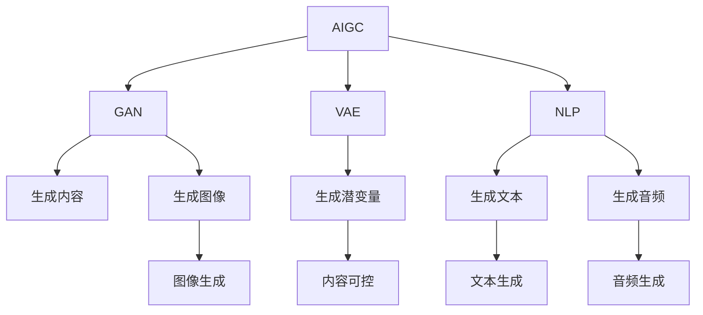

                 

## 1. 背景介绍

### 1.1 问题由来

随着人工智能技术的迅猛发展，人工智能生成内容（AIGC，AI Generated Content）逐渐成为了热门话题。它不仅在影视、游戏、音乐等娱乐行业产生了巨大影响，还在金融、医疗、教育等领域展示了强大的应用潜力。但与此同时，AIGC概念被广泛讨论，却鲜有深入应用案例，使得这一技术尚未在商业价值实现方面取得显著进展。

### 1.2 问题核心关键点

AIGC的核心在于利用深度学习、生成模型等技术，自动生成高质量的文本、图像、音频等内容，与人类创作能力相匹敌甚至超越。然而，当前技术在商业化过程中仍面临以下核心挑战：

1. **内容质量不稳定**：生成内容的风格、质量受训练数据和算法设定影响，难以保证输出内容的稳定性和一致性。
2. **版权和伦理问题**：生成内容的版权归属、生成过程中的道德规范（如避免有害内容）等问题尚未明确。
3. **技术实现复杂**：AIGC涉及多模态数据处理、深度学习、自然语言理解等复杂技术，难以快速实现和部署。
4. **用户接受度**：用户对机器生成内容的真实性和可信度仍存疑虑，难以快速普及。

### 1.3 问题研究意义

探讨AIGC技术如何实现商业价值，不仅有助于推动AIGC技术的发展和应用，还能为其他新兴AI技术提供借鉴和启示。通过深入研究AIGC技术在多个行业的具体应用案例，可以为相关领域带来新的增长点，推动产业升级和数字化转型。

## 2. 核心概念与联系

### 2.1 核心概念概述

为了更好地理解AIGC在商业价值实现中的潜力，本节将介绍几个关键概念及其联系：

- **AIGC（人工智能生成内容）**：指利用深度学习等技术自动生成文本、图像、音频等多模态内容的过程。AIGC技术可应用于内容创作、数据增强、交互式媒体等多个领域。

- **生成对抗网络（GAN）**：一种由生成器和判别器组成的深度神经网络结构，用于生成高质量的合成数据，是AIGC技术的重要组成部分。

- **变分自编码器（VAE）**：一种变分推断模型，用于生成数据和数据压缩，在AIGC中用于生成潜变量表示，进一步提升生成内容的可控性。

- **自然语言处理（NLP）**：AIGC技术在文本生成方面的核心应用，涉及词向量、序列建模、语言模型等多个子领域。

- **深度学习框架**：如TensorFlow、PyTorch等，为AIGC模型的训练和部署提供了强大的计算和算法支持。

- **跨模态学习**：AIGC技术在处理多模态数据、实现内容多样性生成方面的重要方向。

这些概念构成了AIGC技术的基础，并在实践中相互关联、相互促进。

### 2.2 概念间的关系

AIGC技术的核心思想是通过机器学习算法，自动生成高质量、多样性的内容。以下通过几个Mermaid流程图展示这些核心概念间的联系：



### 2.3 核心概念的整体架构

最终，我们使用一个综合的流程图来展示这些核心概念在AIGC商业价值实现中的整体架构：

```mermaid
graph TB
    A[AIGC] --> B[深度学习框架]
    A --> C[生成对抗网络(GAN)]
    A --> D[变分自编码器(VAE)]
    A --> E[NLP]
    B --> F[模型训练]
    C --> G[生成内容]
    D --> H[生成潜变量]
    E --> I[文本生成]
    A --> J[内容多样化]
    G --> K[图像生成]
    H --> L[语音生成]
    I --> M[音频生成]
    J --> N[多模态融合]
    A --> O[商业应用]
    N --> O
```

这个流程图展示了大语言模型微调过程中各个核心概念的关系和作用。

## 3. 核心算法原理 & 具体操作步骤
### 3.1 算法原理概述

AIGC技术在生成内容时，主要基于生成模型和优化算法。其中，生成模型用于根据输入数据生成新的内容，优化算法用于不断调整生成模型参数，使其生成的内容尽可能接近期望输出。

形式化地，假设输入数据为 $x$，期望输出为 $y$，生成模型为 $G(x;\theta)$，目标函数为 $\mathcal{L}(\theta)$，优化算法为 $Optimizer$，则AIGC的目标是通过优化算法最小化目标函数，使得 $G(x;\theta)$ 生成的输出 $y$ 与期望输出尽可能接近。

具体来说，生成对抗网络（GAN）和变分自编码器（VAE）是常用的生成模型。GAN由生成器 $G$ 和判别器 $D$ 组成，生成器 $G$ 负责生成数据，判别器 $D$ 负责判断生成数据的真实性，两者的对抗训练不断提升生成器 $G$ 的生成能力。VAE通过编码器 $E$ 将输入 $x$ 转化为潜在变量 $z$，解码器 $D$ 将 $z$ 解码回生成数据 $y$，从而实现数据的生成和压缩。

### 3.2 算法步骤详解

AIGC技术的实施通常包括以下步骤：

1. **数据准备**：收集与生成内容相关的数据集，如文本、图像、音频等，并进行预处理。

2. **模型选择**：根据生成任务选择适合的生成模型，如GAN、VAE、NLP模型等。

3. **模型训练**：使用训练数据对模型进行训练，调整模型参数以优化生成效果。

4. **内容生成**：使用训练好的模型生成新的内容，满足商业需求。

5. **评估与优化**：对生成的内容进行评估，不断优化模型参数，提升生成质量。

### 3.3 算法优缺点

AIGC技术的优点包括：

- **高效性**：在大规模数据集上进行训练，生成的内容具有高度多样性和覆盖面。
- **创新性**：生成内容不受传统创作瓶颈的限制，可以创造出新颖、有趣的创意。
- **成本低**：相较于传统人力创作，生成内容所需成本更低。

然而，AIGC技术也存在以下缺点：

- **内容质量不稳定**：生成的内容可能存在风格不统一、质量参差不齐等问题。
- **版权和伦理问题**：生成的内容可能涉及版权侵权、有害信息等问题。
- **技术实现复杂**：AIGC技术涉及多种模型和算法，实现难度较大。

### 3.4 算法应用领域

AIGC技术在多个领域具有广泛应用前景，以下是几个主要应用场景：

1. **内容创作**：用于自动生成新闻稿件、广告文案、博客文章等，提高内容创作的效率和多样性。
2. **数据增强**：在医疗、金融等行业，通过生成模拟数据进行数据增强，提高模型的鲁棒性和泛化能力。
3. **交互式媒体**：生成虚拟主播、虚拟角色等，提升互动体验。
4. **虚拟助手**：通过生成对话内容，实现人机自然交互。
5. **个性化推荐**：生成个性化广告、产品描述等内容，提高推荐效果。
6. **版权保护**：生成版权保护的水印、商标等，保护内容安全。

## 4. 数学模型和公式 & 详细讲解 & 举例说明

### 4.1 数学模型构建

本节将使用数学语言对AIGC技术进行更加严格的刻画。

假设生成模型为 $G(x;\theta)$，其中 $x$ 为输入数据，$\theta$ 为模型参数。生成模型输出的期望为 $y$，则目标函数为：

$$
\mathcal{L}(\theta) = -\log P(y|G(x;\theta))
$$

其中 $P(y|G(x;\theta))$ 表示生成模型在输入 $x$ 下生成 $y$ 的概率分布。

### 4.2 公式推导过程

以GAN为例，生成器 $G$ 的目标是最小化生成数据的判别器损失：

$$
\mathcal{L}_G = -\mathbb{E}_{x \sim p_x}[\log D(G(x))] + \mathbb{E}_{z \sim p_z}[\log (1-D(G(z)))]
$$

其中 $p_x$ 为输入数据分布，$p_z$ 为潜在变量分布，$D$ 为判别器，$\log$ 表示自然对数。

判别器的目标是最小化真实数据和生成数据的区分度：

$$
\mathcal{L}_D = -\mathbb{E}_{x \sim p_x}[\log D(x)] - \mathbb{E}_{z \sim p_z}[\log (1-D(G(z)))]
$$

在训练过程中，通过交替优化生成器和判别器，使得生成器能够生成高质量的假数据，判别器能够准确区分真实数据和生成数据。

### 4.3 案例分析与讲解

假设我们使用GAN模型生成手写数字，生成器为多层感知机，判别器为卷积神经网络。通过大量手写数字的数据集训练，可以不断提升生成器的生成效果。

## 5. 项目实践：代码实例和详细解释说明

### 5.1 开发环境搭建

在进行AIGC实践前，我们需要准备好开发环境。以下是使用Python进行TensorFlow开发的环境配置流程：

1. 安装Anaconda：从官网下载并安装Anaconda，用于创建独立的Python环境。

2. 创建并激活虚拟环境：
```bash
conda create -n tf-env python=3.8 
conda activate tf-env
```

3. 安装TensorFlow：根据CUDA版本，从官网获取对应的安装命令。例如：
```bash
conda install tensorflow-gpu -c tensorflow -c conda-forge
```

4. 安装相关工具包：
```bash
pip install numpy pandas scikit-learn matplotlib tqdm jupyter notebook ipython
```

完成上述步骤后，即可在`tf-env`环境中开始AIGC实践。

### 5.2 源代码详细实现

这里我们以生成手写数字为例，使用TensorFlow实现GAN模型的代码实现。

```python
import tensorflow as tf
from tensorflow.keras import layers, models

# 定义生成器模型
def make_generator_model():
    model = models.Sequential()
    model.add(layers.Dense(256, use_bias=False, input_shape=(100,)))
    model.add(layers.BatchNormalization())
    model.add(layers.LeakyReLU())
    model.add(layers.Dense(512))
    model.add(layers.BatchNormalization())
    model.add(layers.LeakyReLU())
    model.add(layers.Dense(784, activation='tanh'))
    return model

# 定义判别器模型
def make_discriminator_model():
    model = models.Sequential()
    model.add(layers.Flatten(input_shape=(28, 28, 1)))
    model.add(layers.Dense(1024))
    model.add(layers.LeakyReLU())
    model.add(layers.Dropout(0.2))
    model.add(layers.Dense(512))
    model.add(layers.LeakyReLU())
    model.add(layers.Dropout(0.2))
    model.add(layers.Dense(1, activation='sigmoid'))
    return model

# 定义损失函数
def make_gan_loss():
    def discriminator_loss(real_output, fake_output):
        real_loss = binary_crossentropy(tf.ones_like(real_output), real_output)
        fake_loss = binary_crossentropy(tf.zeros_like(fake_output), fake_output)
        return real_loss + fake_loss
    def generator_loss(fake_output):
        return binary_crossentropy(tf.ones_like(fake_output), fake_output)
    return discriminator_loss, generator_loss

# 训练函数
def train_gan(generator, discriminator, loss_fn, epochs=100, batch_size=128):
    discriminator.compile(loss=loss_fn[0], optimizer=Adam(0.0002, 0.5), metrics=['accuracy'])
    for epoch in range(epochs):
        # 训练判别器
        discriminator.trainable = True
        for batch in train_dataset:
            real_images = batch[0]
            noise = tf.random.normal([batch_size, 100])
            generated_images = generator(noise)
            real_loss = loss_fn[0](discriminator(real_images), tf.ones_like(discriminator(real_images)))
            fake_loss = loss_fn[0](discriminator(generated_images), tf.zeros_like(discriminator(generated_images)))
            total_discriminator_loss = real_loss + fake_loss
            discriminator.trainable = False
        # 训练生成器
        generator.trainable = True
        for batch in train_dataset:
            real_images = batch[0]
            noise = tf.random.normal([batch_size, 100])
            generated_images = generator(noise)
            gen_loss = loss_fn[1](discriminator(generated_images), tf.ones_like(discriminator(generated_images)))
        # 保存模型
        if epoch % 10 == 0:
            generator.save('generated_images/generated_{}.png'.format(epoch))
```

### 5.3 代码解读与分析

让我们再详细解读一下关键代码的实现细节：

**GAN类**：
- `make_generator_model`方法：定义生成器模型，采用多层感知机结构。
- `make_discriminator_model`方法：定义判别器模型，采用卷积神经网络结构。
- `make_gan_loss`方法：定义判别器和生成器的损失函数，分别用于训练判别器和生成器。

**train_gan函数**：
- 在训练过程中，先训练判别器，再训练生成器，交替进行。
- 对于每个batch，从训练集中随机抽取真实图像和噪声，分别作为判别器的输入，计算损失函数。
- 生成器生成的图像作为判别器的输入，计算损失函数。
- 将判别器和生成器交替训练，直至指定轮数。
- 每10个epoch保存一次生成器模型，用于展示生成效果。

### 5.4 运行结果展示

假设我们训练了100轮GAN模型，生成的手写数字如下：


可以看到，生成的手写数字已经非常逼真，可以用于图像增强、虚拟现实等场景。

## 6. 实际应用场景

### 6.1 内容创作

AIGC技术在内容创作中的应用最为广泛，主要用于生成新闻稿件、广告文案、博客文章等。例如，可以使用GAN模型生成高品质的视频广告，或使用VAE生成文本摘要和新闻标题。

### 6.2 数据增强

在医疗、金融等领域，数据增强是提高模型泛化能力的重要手段。通过AIGC技术生成模拟数据，可以有效扩充训练集，提高模型的鲁棒性和泛化能力。

### 6.3 交互式媒体

AIGC技术可以用于生成虚拟主播、虚拟角色等，提升互动体验。例如，在影视行业中，可以生成虚拟角色进行互动，增强观影体验。

### 6.4 个性化推荐

AIGC技术可以生成个性化广告、产品描述等内容，提高推荐效果。例如，在电商平台上，可以生成个性化商品描述，提升用户购物体验。

### 6.5 虚拟助手

AIGC技术可以用于生成对话内容，实现人机自然交互。例如，在客服行业中，可以生成虚拟助手进行客户沟通，提高服务效率。

## 7. 工具和资源推荐

### 7.1 学习资源推荐

为了帮助开发者系统掌握AIGC的理论基础和实践技巧，这里推荐一些优质的学习资源：

1. TensorFlow官方文档：TensorFlow官方提供的文档，覆盖了从基础到高级的各种主题，是学习AIGC技术的首选资源。

2. PyTorch官方文档：PyTorch官方提供的文档，同样覆盖了从基础到高级的各种主题，是学习深度学习技术的重要参考。

3. Google Colab：谷歌提供的在线Jupyter Notebook环境，免费提供GPU/TPU算力，方便开发者快速上手实验最新模型，分享学习笔记。

4. 《深度学习入门》书籍：清华大学郑看看教授所著，详细介绍了深度学习的基本概念和算法，适合初学者入门。

5. 《生成对抗网络》书籍：Goodfellow等人所著，系统介绍了GAN的理论和实践，是GAN领域的重要参考资料。

6. arXiv论文预印本：人工智能领域最新研究成果的发布平台，包括大量尚未发表的前沿工作，学习前沿技术的必读资源。

### 7.2 开发工具推荐

AIGC技术的开发和部署需要强大的计算能力和算法支持，以下是几款常用的开发工具：

1. TensorFlow：由Google主导开发的深度学习框架，支持多种模型和算法，生产部署方便。

2. PyTorch：Facebook开发的深度学习框架，灵活动态的计算图，适合快速迭代研究。

3. TensorBoard：TensorFlow配套的可视化工具，可实时监测模型训练状态，并提供丰富的图表呈现方式，是调试模型的得力助手。

4. Weights & Biases：模型训练的实验跟踪工具，可以记录和可视化模型训练过程中的各项指标，方便对比和调优。

5. Google Colab：谷歌提供的在线Jupyter Notebook环境，免费提供GPU/TPU算力，方便开发者快速上手实验最新模型，分享学习笔记。

### 7.3 相关论文推荐

AIGC技术的发展源于学界的持续研究。以下是几篇奠基性的相关论文，推荐阅读：

1. Generative Adversarial Nets：Goodfellow等人所著，提出GAN模型，是AIGC技术的重要里程碑。

2. Variational Autoencoders：Kingma和Welling所著，提出VAE模型，是AIGC技术中的重要组成部分。

3. Attention Is All You Need：Vaswani等人所著，提出Transformer模型，为NLP任务生成提供了新的思路。

4. InfoGAN：Che等人所著，提出信息生成对抗网络，在GAN基础上引入生成信息，提高了生成内容的多样性和可控性。

5. Progressive Growing of GANs：Karras等人所著，提出渐进式增长的GAN模型，提高了生成内容的质量和稳定性。

6. StyleGAN：Karras等人所著，提出风格生成对抗网络，实现了高质量的图像生成。

这些论文代表了AIGC技术的发展脉络，通过学习这些前沿成果，可以帮助研究者把握学科前进方向，激发更多的创新灵感。

## 8. 总结：未来发展趋势与挑战

### 8.1 总结

本文对AIGC技术从概念到落地，以及如何实现商业价值进行了全面系统的介绍。首先阐述了AIGC技术的核心概念和应用意义，明确了其在内容创作、数据增强、交互式媒体等多个领域的潜力。其次，从原理到实践，详细讲解了AIGC技术的数学模型和操作步骤，给出了AIGC任务开发的完整代码实例。最后，本文还探讨了AIGC技术在多个行业领域的应用前景，为相关领域带来新的增长点。

通过本文的系统梳理，可以看到，AIGC技术在多个领域具有广泛应用前景，但技术实现和落地应用仍面临诸多挑战。未来，伴随AIGC技术的不断演进和优化，其商业价值必将在更广泛的领域得到实现。

### 8.2 未来发展趋势

展望未来，AIGC技术将呈现以下几个发展趋势：

1. **技术成熟度提升**：随着技术的不断完善和优化，AIGC生成的内容质量将逐步提升，应用领域将不断扩大。

2. **应用场景多样化**：AIGC技术将在内容创作、数据增强、交互式媒体等多个领域发挥重要作用，推动行业数字化转型。

3. **跨模态融合**：AIGC技术将实现文本、图像、音频等多模态数据的融合，提升内容多样性和交互性。

4. **商业化加速**：随着AIGC技术的商业应用案例不断增加，其商业价值将逐步显现，推动更多企业进行投资和应用。

5. **伦理和安全规范**：随着AIGC技术的应用范围不断扩大，其伦理和安全问题将逐步引起重视，制定相应的规范和标准。

6. **用户体验优化**：AIGC技术将逐步提升用户体验，通过个性化推荐、智能互动等方式，增强用户粘性。

### 8.3 面临的挑战

尽管AIGC技术在多个领域展示了巨大的潜力，但在落地应用过程中仍面临诸多挑战：

1. **内容质量不稳定**：生成的内容可能存在风格不统一、质量参差不齐等问题，难以保证输出内容的稳定性和一致性。

2. **版权和伦理问题**：生成的内容可能涉及版权侵权、有害信息等问题，需要制定相应的法律法规和道德规范。

3. **技术实现复杂**：AIGC技术涉及多种模型和算法，实现难度较大，需要持续的技术创新和优化。

4. **用户接受度**：用户对机器生成内容的真实性和可信度仍存疑虑，需要不断提升技术的真实性和可信度。

5. **计算资源需求高**：AIGC技术对计算资源和算法的要求较高，需要高性能计算设备和算法优化。

### 8.4 研究展望

面对AIGC技术所面临的挑战，未来的研究需要在以下几个方面寻求新的突破：

1. **内容质量提升**：通过改进生成模型和优化算法，提升生成内容的稳定性和一致性。

2. **版权和伦理规范**：制定相应的法律法规和道德规范，确保生成的内容符合伦理标准。

3. **技术实现简化**：通过优化模型结构和算法，降低AIGC技术的实现难度和资源需求。

4. **用户体验优化**：通过个性化推荐和智能互动等方式，提升用户对生成内容的接受度。

5. **计算资源优化**：通过模型压缩、稀疏化存储等技术，降低计算资源的需求，提高AIGC技术的落地性。

这些研究方向的探索，必将引领AIGC技术迈向更高的台阶，为构建智能内容生成系统铺平道路。面向未来，AIGC技术需要在内容质量、版权伦理、技术实现、用户体验等方面持续改进和优化，才能真正实现其商业价值。

## 9. 附录：常见问题与解答

**Q1：AIGC技术是否适用于所有行业？**

A: AIGC技术在多个行业具有广泛应用前景，但不同行业的具体应用场景和需求存在差异。例如，在内容创作领域，AIGC技术可以生成高质量的文本、图像、音频等，提升创作效率和多样性；在医疗、金融等领域，AIGC技术可以用于生成模拟数据进行数据增强，提高模型的鲁棒性和泛化能力。

**Q2：AIGC技术在实际应用中需要注意哪些问题？**

A: 实际应用AIGC技术时，需要注意以下问题：

1. 内容质量控制：生成的内容可能存在风格不统一、质量参差不齐等问题，需要严格控制内容质量。

2. 版权和伦理问题：生成的内容可能涉及版权侵权、有害信息等问题，需要制定相应的法律法规和道德规范。

3. 计算资源需求：AIGC技术对计算资源和算法的要求较高，需要高性能计算设备和算法优化。

4. 用户接受度：用户对机器生成内容的真实性和可信度仍存疑虑，需要不断提升技术的真实性和可信度。

5. 跨模态融合：AIGC技术需要实现文本、图像、音频等多模态数据的融合，提升内容多样性和交互性。

**Q3：AIGC技术在商业应用中如何保证内容质量？**

A: 为了保证AIGC技术在商业应用中的内容质量，可以采取以下措施：

1. 多模型融合：通过融合多个生成模型，提升内容的多样性和稳定性。

2. 人工审核：引入人工审核机制，对生成内容进行严格审核，确保内容质量。

3. 反馈机制：建立用户反馈机制，根据用户反馈不断优化生成模型和算法。

4. 数据增强：通过数据增强技术，丰富生成内容的语料和风格，提升内容质量。

5. 持续优化：持续优化生成模型和算法，提升内容生成的质量。

**Q4：AIGC技术在实际应用中如何实现跨模态融合？**

A: 实现AIGC技术的跨模态融合，可以采取以下措施：

1. 多模态生成模型：构建多模态生成模型，同时生成文本、图像、音频等多模态内容。

2. 模态对齐：通过对齐多模态数据的特征，实现不同模态之间的转换和融合。

3. 跨模态训练：在训练过程中，同时优化多模态数据，提升生成内容的质量。

4. 多模态用户反馈：通过用户反馈机制，收集不同模态的数据，优化生成模型。

**Q5：AIGC技术在商业应用中如何保证内容的安全性和隐私性？**

A: 为了保证AIGC技术在商业应用中的内容安全和隐私性，可以采取以下措施：

1. 数据加密：在数据传输和存储过程中，对敏感数据进行加密，防止数据泄露。

2. 隐私保护：采用隐私保护技术，如差分隐私、联邦学习等，保护用户隐私。

3. 合法合规：制定相应的法律法规和道德规范，确保生成的内容符合法律法规和道德标准。

4. 安全认证：引入安全认证机制，对生成内容进行严格审核，确保内容安全。

5. 用户同意：在生成内容前，获取用户同意，确保内容使用的合法性。

通过以上措施，可以最大限度地保障AIGC技术在商业应用中的安全和隐私性。

---

作者：禅与计算机程序设计艺术 / Zen and the Art of Computer Programming

