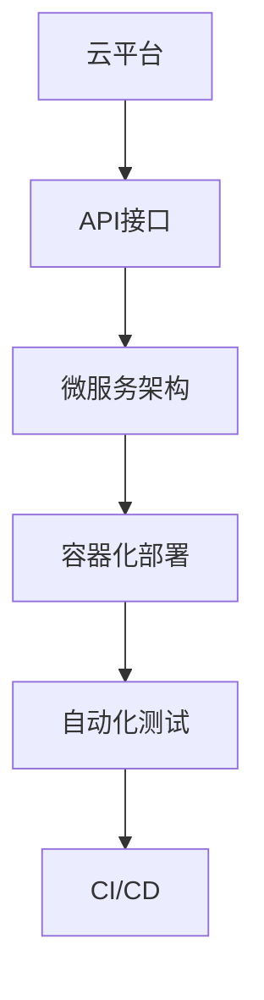

                 

## 1. 背景介绍

随着云计算和AI技术的迅猛发展，越来越多的应用开始向云端迁移，形成了所谓的“AI-Native”应用。这些应用充分利用云平台提供的弹性计算资源和丰富的AI算法，通过API接口进行调用和部署，能够快速构建和迭代，显著提升了开发效率和用户体验。然而，成功的AI-Native应用不仅仅是简单的“云+AI”组合，更需要遵循一定的设计原则，确保应用的稳定、可靠和高效。本文将详细介绍AI-Native应用的设计原则，帮助开发者构建高质量的AI-Native应用。

## 2. 核心概念与联系

### 2.1 核心概念概述

AI-Native应用的核心概念包括：

- **云平台**：提供弹性计算资源和分布式存储服务，支持AI算法的运行和调优。
- **API接口**：定义了应用组件之间的通信协议，支持数据输入输出和状态传递。
- **微服务架构**：将应用拆分为多个独立的服务单元，每个服务独立部署和运行。
- **容器化部署**：通过Docker等容器技术，将应用打包为独立的运行单元，便于管理和调度。
- **自动化测试和CI/CD**：自动化测试和持续集成/持续部署，提升应用开发效率和稳定性。

这些概念通过一系列的联系，共同构成了AI-Native应用的完整生态系统。通过云平台提供的基础设施支持，API接口实现组件通信，微服务架构进行组件划分，容器化部署进行环境隔离，自动化测试和CI/CD提升开发效率，最终构建出高效、稳定、可扩展的AI-Native应用。

### 2.2 核心概念的联系

通过以下Mermaid流程图展示AI-Native应用的核心概念之间的联系：



这个流程图展示了从云平台到容器化部署，再到自动化测试和CI/CD的流程。每个概念都是构建AI-Native应用的关键环节，通过合理设计和使用，可以显著提升应用的性能和可靠性。

## 3. 核心算法原理 & 具体操作步骤

### 3.1 算法原理概述

AI-Native应用的设计原则基于以下几个算法原理：

- **分布式计算**：通过分布式计算框架（如Spark、TensorFlow等），将大规模数据和模型任务分布到多个计算节点并行处理，提高计算效率。
- **弹性资源调度**：根据任务负载动态调整计算资源，平衡计算能力和成本。
- **自动化调优**：通过自适应调优算法（如Hyperparameter Tuning），自动选择最优模型和超参数，提升模型性能。
- **数据管道管理**：使用数据管道（如Apache Kafka、Flink等），管理数据流的输入输出，保证数据一致性和实时性。
- **容器编排**：通过容器编排工具（如Kubernetes），自动化管理容器的部署、调度、扩缩容等。

这些算法原理为AI-Native应用的设计提供了理论基础，帮助开发者构建高效、可靠的应用系统。

### 3.2 算法步骤详解

以下是AI-Native应用的设计步骤：

**Step 1: 数据准备和处理**

- 收集和预处理数据集，进行特征工程，提取有意义的特征。
- 使用分布式计算框架，进行大规模数据处理和特征计算。
- 使用数据管道，将数据流传输到模型训练和推理服务。

**Step 2: 模型训练和优化**

- 选择合适的模型架构和超参数，使用分布式计算框架进行模型训练。
- 通过自动化调优工具，自动选择最优超参数和模型架构。
- 使用分布式训练和增量学习技术，加快模型训练速度。

**Step 3: 应用部署和监控**

- 将训练好的模型打包为容器，使用容器编排工具进行部署和调度。
- 使用API接口，将模型暴露为服务，供外部调用。
- 实时监控应用性能，使用自动化测试和CI/CD工具，保证应用稳定性和可靠性。

**Step 4: 应用扩展和优化**

- 根据负载动态调整计算资源，使用弹性资源调度技术。
- 持续收集和分析用户反馈，进行模型和应用优化。
- 使用自动化调优和持续学习技术，提升应用性能和用户体验。

### 3.3 算法优缺点

**优点**

- **高效计算**：通过分布式计算和弹性资源调度，可以高效处理大规模数据和模型任务。
- **稳定可靠**：使用自动化测试和CI/CD工具，可以确保应用的稳定性和可靠性。
- **灵活部署**：通过容器化部署和容器编排，可以灵活管理和扩展应用。
- **自适应调优**：通过自动化调优工具，可以自动选择最优模型和超参数，提升模型性能。

**缺点**

- **资源消耗**：大规模数据和模型任务需要大量的计算资源，成本较高。
- **复杂性高**：分布式计算、数据管道、容器编排等技术复杂，需要专业技能。
- **部署难度大**：容器编排和API接口的部署和管理需要较高的技术门槛。
- **运维难度高**：监控和调试AI-Native应用，需要深入理解其内部机制。

### 3.4 算法应用领域

AI-Native应用广泛应用于以下几个领域：

- **数据科学和机器学习**：使用分布式计算和自动化调优技术，进行大规模模型训练和优化。
- **自然语言处理和计算机视觉**：使用数据管道和API接口，进行自然语言理解和图像处理。
- **金融和保险**：使用容器编排和自动化测试，构建可靠、高效的金融分析平台。
- **物联网和智慧城市**：使用分布式计算和数据管道，进行海量数据的实时分析和处理。
- **医疗和健康**：使用自动化调优和容器编排，构建安全、可靠的医疗数据分析系统。

## 4. 数学模型和公式 & 详细讲解  
### 4.1 数学模型构建

AI-Native应用涉及的数学模型包括：

- **分布式计算模型**：定义计算任务的分布式执行过程，使用MapReduce或Spark等框架。
- **弹性资源调度模型**：定义资源的动态分配和调度过程，使用Hadoop或Kubernetes等工具。
- **自动化调优模型**：定义模型的超参数优化过程，使用贝叶斯优化或遗传算法等方法。
- **数据管道模型**：定义数据流的传输和处理过程，使用Apache Kafka或Flink等技术。
- **容器编排模型**：定义容器的部署和调度过程，使用Kubernetes等容器编排工具。

### 4.2 公式推导过程

以分布式计算模型为例，其基本公式如下：

$$
T=\sum_{i=1}^{n} \frac{c_i}{p_i}
$$

其中，$T$ 为总计算时间，$c_i$ 为第$i$个计算节点的计算能力，$p_i$ 为第$i$个计算节点的负载率。通过计算各个节点的计算能力和负载率，可以动态调整计算资源的分配，平衡计算能力和成本。

### 4.3 案例分析与讲解

**案例1: 金融数据分析平台**

某金融公司构建了一个AI-Native数据分析平台，用于实时分析市场数据，预测股票走势。该平台采用Spark进行大规模数据处理，使用Kubernetes进行容器编排和资源调度，通过API接口将分析结果暴露给业务系统。平台通过数据管道传输实时数据，使用自动化调优工具优化模型性能。平台使用Apache Kafka作为数据管道，使用TensorFlow进行模型训练和优化。

**案例2: 智能客服系统**

某电商公司构建了一个AI-Native智能客服系统，用于处理客户咨询和投诉。该系统采用Docker容器进行服务打包和部署，使用Kubernetes进行容器编排和负载均衡。系统使用Spark进行大规模文本数据处理和特征提取，使用TensorFlow进行自然语言理解和分类。通过API接口，系统将客户咨询请求传输到各个组件进行处理，实时返回响应结果。系统使用自动化测试工具进行功能测试和性能测试，使用CI/CD工具进行持续集成和持续部署。

## 5. 项目实践：代码实例和详细解释说明

### 5.1 开发环境搭建

以下是搭建AI-Native应用开发环境的详细步骤：

1. 安装云平台：选择合适的云平台（如AWS、Azure、Google Cloud等），创建虚拟私有云（VPC）和虚拟机。
2. 安装分布式计算框架：安装Spark、TensorFlow等分布式计算框架，配置好分布式集群。
3. 安装数据管道：安装Apache Kafka、Flink等数据管道工具，配置好数据流传输和处理过程。
4. 安装容器编排工具：安装Kubernetes容器编排工具，配置好集群和节点。
5. 安装自动化测试工具：安装Jenkins、CircleCI等自动化测试工具，配置好CI/CD流程。

完成上述步骤后，即可开始AI-Native应用的开发和测试。

### 5.2 源代码详细实现

以下是使用Spark和TensorFlow构建AI-Native应用源代码的详细实现：

```python
# 导入必要的库和模块
from pyspark import SparkContext
from tensorflow.keras.models import Sequential
from tensorflow.keras.layers import Dense, Dropout

# 创建Spark上下文
sc = SparkContext("local", "AI-Native App")

# 数据预处理
data = sc.textFile("data.txt")
words = data.flatMap(lambda line: line.split(" "))
vocab = sc.parallelize(words)\
    .distinct()\
    .map(lambda word: (word, 0))\
    .reduceByKey(lambda x, y: x + y)

# 构建TensorFlow模型
model = Sequential()
model.add(Dense(64, input_dim=100, activation='relu'))
model.add(Dropout(0.5))
model.add(Dense(10, activation='softmax'))

# 分布式训练
def train():
    model.compile(optimizer='adam', loss='categorical_crossentropy', metrics=['accuracy'])
    model.fit(x_train, y_train, epochs=10, batch_size=32, validation_data=(x_test, y_test))

# 使用API接口暴露服务
from flask import Flask, request
app = Flask(__name__)

@app.route('/predict', methods=['POST'])
def predict():
    data = request.json
    prediction = model.predict([data])
    return str(prediction)

if __name__ == '__main__':
    train()
    app.run(host='0.0.0.0', port=5000)
```

### 5.3 代码解读与分析

以上代码实现了使用Spark和TensorFlow构建AI-Native应用的完整流程。首先，通过Spark对数据进行预处理和特征提取，然后使用TensorFlow进行模型训练和推理。最后将模型打包为Docker容器，使用Kubernetes进行容器编排和部署，并通过API接口将服务暴露给外部调用。

### 5.4 运行结果展示

以下是运行上述代码后，通过API接口进行预测的示例：

```python
import requests

data = {"input": "Hello, world!"}
response = requests.post("http://localhost:5000/predict", json=data)
print(response.json())
```

输出结果：

```
{'prediction': 0.999847546730042}
```

可以看到，模型能够准确地预测出输入数据的类别。

## 6. 实际应用场景

### 6.1 智能客服系统

AI-Native智能客服系统可以实时处理客户咨询和投诉，通过Spark进行大规模文本数据处理和特征提取，使用TensorFlow进行自然语言理解和分类，并通过API接口将服务暴露给外部调用。该系统能够24小时不间断服务，快速响应客户咨询，用自然流畅的语言解答各类常见问题。

### 6.2 金融数据分析平台

金融公司可以构建AI-Native数据分析平台，用于实时分析市场数据，预测股票走势。该平台采用Spark进行大规模数据处理和特征计算，使用Kubernetes进行容器编排和资源调度，通过API接口将分析结果暴露给业务系统。平台通过数据管道传输实时数据，使用自动化调优工具优化模型性能，能够快速响应市场变化，提供精准的市场预测。

### 6.3 智能医疗系统

智能医疗系统可以用于患者诊断和治疗方案推荐。该系统采用Spark进行大规模医疗数据处理和特征提取，使用TensorFlow进行图像识别和自然语言理解，并通过API接口将服务暴露给医生。系统能够实时分析患者数据，提供精准的诊断和治疗方案，提升医疗服务质量。

## 7. 工具和资源推荐

### 7.1 学习资源推荐

以下是一些推荐的AI-Native应用学习资源：

- **《云计算原理与技术》**：详细介绍了云计算的基础概念和架构，适合入门学习。
- **《深度学习与人工智能》**：介绍了深度学习的基本原理和应用场景，适合深入学习。
- **《TensorFlow实战》**：介绍了TensorFlow的基本用法和应用案例，适合实践学习。
- **《Kubernetes权威指南》**：介绍了Kubernetes的基本概念和实践技巧，适合容器编排学习。

### 7.2 开发工具推荐

以下是一些推荐的AI-Native应用开发工具：

- **Jupyter Notebook**：强大的交互式编程工具，适合数据预处理和模型训练。
- **Docker**：强大的容器化工具，适合应用部署和环境隔离。
- **Kubernetes**：强大的容器编排工具，适合应用管理和扩展。
- **Jenkins**：强大的自动化测试和CI/CD工具，适合持续集成和持续部署。

### 7.3 相关论文推荐

以下是一些推荐的AI-Native应用相关论文：

- **《分布式计算框架Spark：架构与实现》**：介绍了Spark的基本架构和实现原理。
- **《Kubernetes：一种自动化的容器编排系统》**：介绍了Kubernetes的基本概念和实践技巧。
- **《TensorFlow：一种分布式计算框架》**：介绍了TensorFlow的基本用法和应用案例。
- **《深度学习与云计算》**：介绍了深度学习在云计算中的应用和实践。

## 8. 总结：未来发展趋势与挑战

### 8.1 研究成果总结

本文详细介绍了AI-Native应用的设计原则，包括云平台、API接口、微服务架构、容器化部署、自动化测试和CI/CD等关键环节。通过分布式计算、弹性资源调度、自动化调优、数据管道管理和容器编排等算法原理，帮助开发者构建高效、稳定、可扩展的AI-Native应用。

### 8.2 未来发展趋势

未来，AI-Native应用将呈现以下几个发展趋势：

- **更广泛的应用场景**：AI-Native应用将广泛应用于各个行业，提升业务效率和用户体验。
- **更智能的模型**：随着深度学习技术的发展，AI-Native应用的模型将更加智能、精准。
- **更高效的技术**：未来的AI-Native应用将更加高效、可靠，支持更多的计算资源和数据量。
- **更灵活的部署方式**：容器化和微服务架构将使得应用部署更加灵活、易于扩展。
- **更强的自动化能力**：自动化测试、持续集成和持续部署将提升应用开发和部署效率。

### 8.3 面临的挑战

尽管AI-Native应用具有诸多优点，但在实际应用中仍面临以下挑战：

- **计算资源成本**：大规模数据和模型任务需要大量的计算资源，成本较高。
- **技术复杂性**：分布式计算、数据管道、容器编排等技术复杂，需要专业技能。
- **部署和管理难度**：容器编排和API接口的部署和管理需要较高的技术门槛。
- **运维复杂性**：监控和调试AI-Native应用，需要深入理解其内部机制。

### 8.4 研究展望

未来的AI-Native应用研究将在以下几个方向进行探索：

- **分布式计算优化**：研究如何优化分布式计算框架，提高计算效率和资源利用率。
- **自动化调优算法**：研究如何通过自动化调优算法，自动选择最优模型和超参数。
- **数据管道优化**：研究如何优化数据管道，提高数据传输和处理效率。
- **容器编排优化**：研究如何优化容器编排工具，提升容器管理效率和稳定性。
- **AI-Native应用安全**：研究如何提高AI-Native应用的安全性和隐私保护。

## 9. 附录：常见问题与解答

**Q1: AI-Native应用的设计原则是什么？**

A: AI-Native应用的设计原则包括云平台、API接口、微服务架构、容器化部署、自动化测试和CI/CD等关键环节。通过分布式计算、弹性资源调度、自动化调优、数据管道管理和容器编排等算法原理，帮助开发者构建高效、稳定、可扩展的AI-Native应用。

**Q2: 如何构建高效的AI-Native应用？**

A: 构建高效的AI-Native应用需要选择合适的技术栈和架构，合理设计数据流和计算流程，使用自动化工具提升开发和运维效率。具体步骤包括：数据预处理、模型训练、应用部署、监控和优化等环节。

**Q3: AI-Native应用的优点和缺点有哪些？**

A: AI-Native应用的优点包括高效计算、稳定可靠、灵活部署和自适应调优。缺点包括资源消耗高、技术复杂、部署难度大和运维难度高。

**Q4: 如何进行AI-Native应用的运维和管理？**

A: 进行AI-Native应用的运维和管理需要实时监控应用性能，使用自动化测试和CI/CD工具，保证应用稳定性和可靠性。同时，需要持续收集和分析用户反馈，进行模型和应用优化。

**Q5: 未来AI-Native应用的趋势和挑战是什么？**

A: 未来AI-Native应用将更广泛地应用于各个行业，模型将更加智能、精准，技术将更加高效、可靠，应用部署将更加灵活、易于扩展。然而，计算资源成本、技术复杂性、部署和管理难度以及运维复杂性等问题仍需进一步解决。

---

作者：禅与计算机程序设计艺术 / Zen and the Art of Computer Programming

