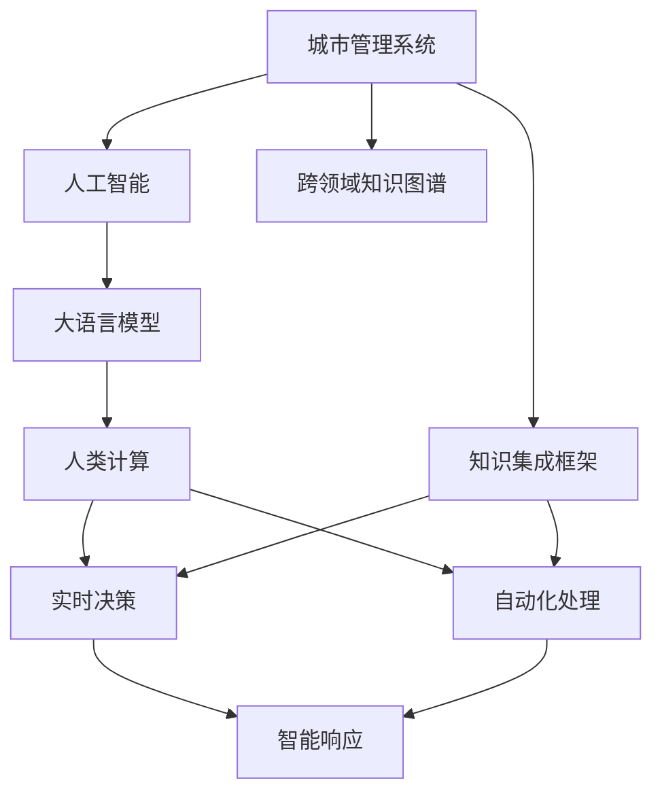
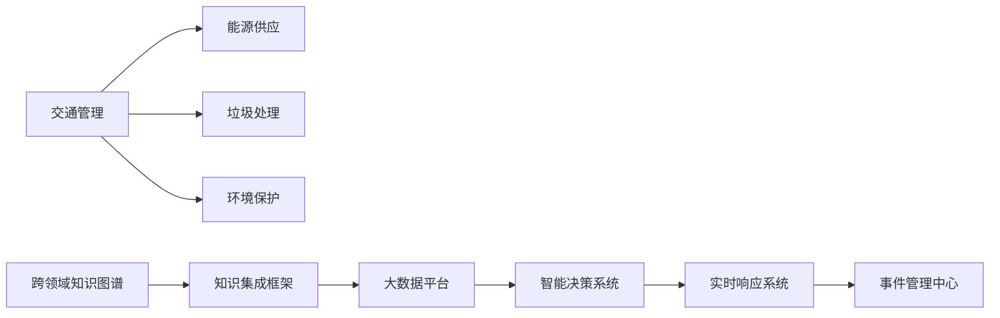
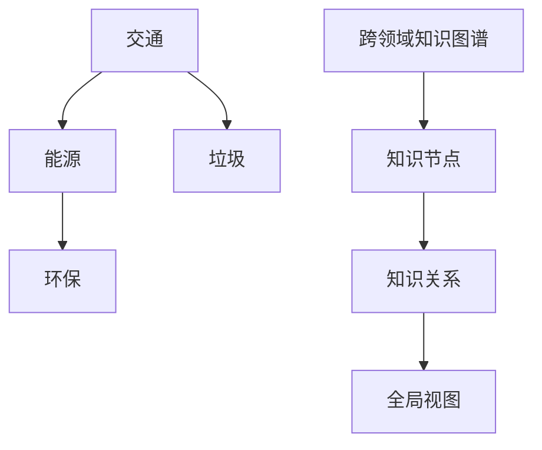
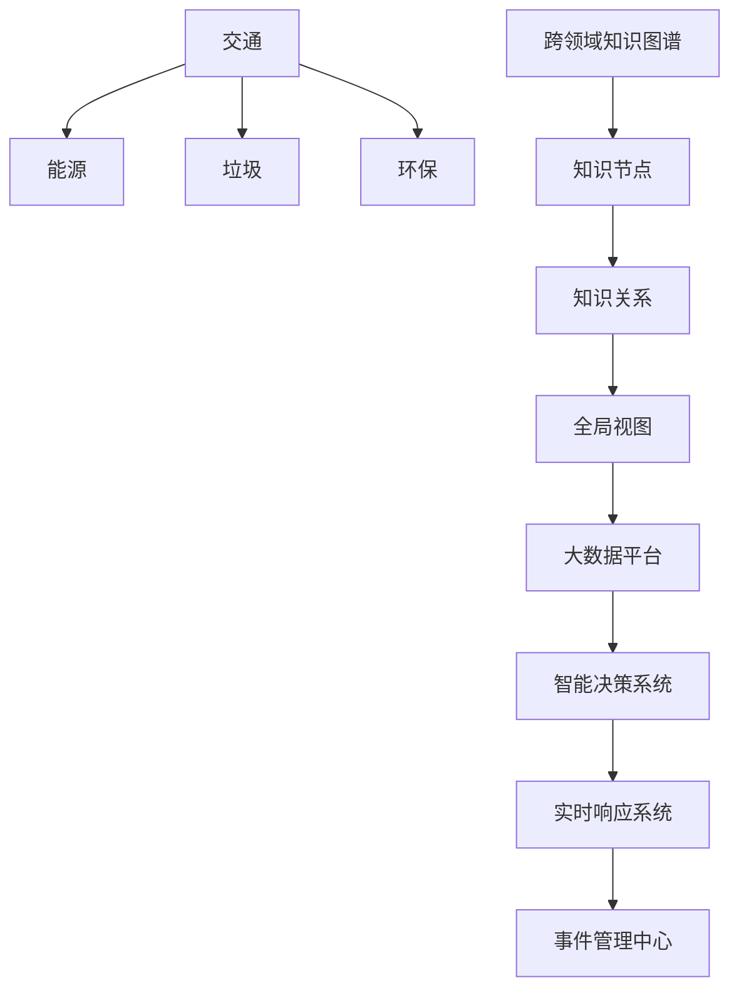

                 

# AI与人类计算：打造可持续发展的城市管理系统

## 1. 背景介绍

### 1.1 问题由来

随着城市化进程的加速，城市人口急剧增加，城市管理面临巨大的压力。传统的人力管理模式效率低下，容易产生误差。城市管理者需要更智能、更高效的解决方案，以应对城市治理的复杂性和多变性。

城市管理系统（Urban Management System, UMS）是一个多部门协作、跨层级整合的复杂系统，包括交通管理、垃圾处理、能源供应、环境保护等多个方面。通过AI技术，特别是大语言模型与人类计算的结合，可以有效提升城市管理的智能化水平。

### 1.2 问题核心关键点

城市管理系统的核心问题包括：

- 数据分散。不同部门的数据往往孤立存在，难以形成统一视图。
- 信息孤立。数据收集后，信息处理和决策过程仍依赖人工，效率低下。
- 预测困难。城市系统复杂，预测准确性差。
- 响应缓慢。事件响应和处理速度慢，影响用户体验。
- 资源浪费。管理资源未能有效整合利用，浪费严重。

这些问题需要通过新技术来解决，以实现智能化、高效化、精细化的城市管理。

### 1.3 问题研究意义

构建基于AI与人类计算的可持续发展的城市管理系统，具有重要意义：

1. **提高效率**：通过AI技术自动化处理数据，大幅提升信息处理速度和准确性。
2. **精准预测**：利用AI进行数据分析和建模，提高预测准确度，科学决策。
3. **智能响应**：结合AI与人类智慧，快速响应和解决城市问题，改善用户体验。
4. **资源优化**：优化资源配置，减少浪费，提高管理效能。
5. **可持续发展**：实现环境友好、能源高效的城市发展模式，促进绿色转型。

## 2. 核心概念与联系

### 2.1 核心概念概述

为更好地理解AI与人类计算在城市管理系统中的应用，本节将介绍几个关键概念：

- **城市管理系统**（Urban Management System, UMS）：一个多部门、跨层级的复杂系统，涉及交通、垃圾、能源、环保等多个领域。
- **人工智能**（Artificial Intelligence, AI）：通过计算机模拟人脑智能，实现复杂问题求解的技术。
- **大语言模型**（Large Language Model, LLM）：能够理解自然语言和生成自然语言的高效模型。
- **人类计算**（Human Computation）：利用人类智慧和计算能力，解决复杂问题。
- **跨领域知识图谱**（Cross-Domain Knowledge Graph）：涵盖不同领域的知识结构，辅助AI进行推理和决策。
- **知识集成框架**（Knowledge Integration Framework）：将不同来源的知识有机整合，形成全局视图。

这些核心概念之间的联系可以通过以下Mermaid流程图来展示：



这个流程图展示了大语言模型与人类计算在城市管理系统中的应用流程：

1. 城市管理系统通过跨领域知识图谱获取各领域的知识，构建知识集成框架。
2. 大语言模型根据知识图谱生成自然语言描述，进行推理和决策。
3. 人类计算通过大语言模型的输出，结合专业知识，进行人工干预和验证。
4. 自动化处理和智能响应系统根据大语言模型与人类计算的结果，快速执行任务。

### 2.2 概念间的关系

这些核心概念之间存在着紧密的联系，形成了城市管理系统中的智能架构。下面我们通过几个Mermaid流程图来展示这些概念之间的关系。

#### 2.2.1 城市管理系统架构



这个流程图展示了城市管理系统的架构，从交通、能源、垃圾、环保等多个领域，通过跨领域知识图谱和知识集成框架，整合大数据，形成智能决策和实时响应系统。

#### 2.2.2 大语言模型与人类计算


这个流程图展示了大语言模型与人类计算在数据处理和决策中的作用：数据采集后，通过数据清洗、特征提取、预测和决策模型，生成自然语言描述，并结合跨领域知识图谱进行推理。人类计算通过自然语言生成和知识图谱推理的输出，进行人工验证和干预，最后自动化处理和智能响应系统根据结果执行任务。

#### 2.2.3 跨领域知识图谱与知识集成



这个流程图展示了跨领域知识图谱的构建和应用：不同领域的数据通过知识节点和知识关系构建跨领域知识图谱，形成全局视图，辅助大语言模型和人类计算进行决策和处理。

### 2.3 核心概念的整体架构

最后，我们用一个综合的流程图来展示这些核心概念在城市管理系统中的应用：



这个综合流程图展示了跨领域知识图谱在大数据平台上的应用，通过智能决策和实时响应系统，实现城市管理的自动化和智能化。

## 3. 核心算法原理 & 具体操作步骤
### 3.1 算法原理概述

AI与人类计算在城市管理系统中的应用，主要涉及以下几个核心算法：

1. **数据采集与清洗**：收集和管理城市管理系统所需的各种数据，进行清洗和预处理。
2. **特征提取**：从清洗后的数据中提取关键特征，用于模型训练。
3. **预测建模**：利用机器学习算法进行交通、能源、垃圾、环保等领域的预测和建模。
4. **自然语言处理**：通过大语言模型生成自然语言描述，辅助决策和处理。
5. **知识图谱推理**：利用跨领域知识图谱进行知识推理和查询，辅助决策。
6. **决策优化**：结合AI与人类计算的输出，进行综合决策和优化。
7. **实时响应**：根据决策结果，自动化执行响应任务，优化城市管理。

这些算法通过大语言模型与人类计算的结合，形成完整的城市管理系统。

### 3.2 算法步骤详解

基于AI与人类计算的城市管理系统建设，一般包括以下几个关键步骤：

**Step 1: 数据采集与清洗**

- 收集城市管理所需的数据，包括交通流量、能源消耗、垃圾产生、环保指标等。
- 对数据进行清洗和预处理，去除噪声和异常值，保证数据质量。

**Step 2: 特征提取**

- 从清洗后的数据中提取关键特征，如交通流量、能耗、垃圾量、空气质量等。
- 使用机器学习算法进行特征选择和降维，生成训练数据。

**Step 3: 预测建模**

- 构建预测模型，如时间序列模型、回归模型、分类模型等。
- 使用历史数据进行模型训练和验证，调整模型参数，保证预测精度。

**Step 4: 自然语言处理**

- 利用大语言模型，将数据转化为自然语言描述。
- 使用自然语言处理技术，进行文本分类、实体识别、关系抽取等任务。

**Step 5: 知识图谱推理**

- 构建跨领域知识图谱，涵盖交通、能源、垃圾、环保等领域的知识。
- 利用知识图谱进行推理和查询，辅助AI进行决策。

**Step 6: 决策优化**

- 结合AI与人类计算的输出，进行综合决策和优化。
- 利用优化算法，寻找最优决策方案。

**Step 7: 实时响应**

- 根据决策结果，自动化执行响应任务。
- 利用实时数据，动态调整响应策略，优化城市管理。

### 3.3 算法优缺点

基于AI与人类计算的城市管理系统，具有以下优点：

1. **高效性**：AI技术可以自动化处理大量数据，大幅提升信息处理速度和准确性。
2. **精准性**：利用机器学习算法进行预测建模，提高预测准确度，科学决策。
3. **智能性**：结合人类智慧和计算能力，实现更智能、更高效的决策和响应。
4. **灵活性**：可以根据实时数据，动态调整响应策略，优化城市管理。
5. **可持续性**：实现环境友好、能源高效的城市发展模式，促进绿色转型。

同时，该方法也存在一些缺点：

1. **数据依赖**：需要大量的数据进行训练和验证，数据质量直接影响模型效果。
2. **模型复杂性**：AI模型较为复杂，需要专业知识进行设计和调试。
3. **资源消耗**：AI与人类计算的结合，需要大量计算资源，成本较高。
4. **人为因素**：人类计算部分仍依赖人工干预，影响决策效率和准确性。
5. **隐私风险**：城市管理数据涉及个人隐私，需要采取隐私保护措施。

### 3.4 算法应用领域

基于AI与人类计算的城市管理系统，已经在多个领域取得了应用：

- **交通管理**：利用AI预测交通流量，优化交通信号灯，减少拥堵。
- **垃圾处理**：利用AI识别垃圾种类，优化垃圾分类和处理流程。
- **能源供应**：利用AI预测能源需求，优化能源分配和供应。
- **环境保护**：利用AI监测环境指标，进行环境污染预测和治理。
- **智能响应**：利用AI与人类计算，快速响应和解决城市问题，改善用户体验。

这些应用展示了AI与人类计算在城市管理系统中的巨大潜力。

## 4. 数学模型和公式 & 详细讲解  
### 4.1 数学模型构建

本节将使用数学语言对基于AI与人类计算的城市管理系统进行更加严格的刻画。

记城市管理系统的各个领域为 $D_1, D_2, ..., D_n$，对应的数据集为 $D_i = \{x_i, y_i\}_{i=1}^{m}$，其中 $x_i$ 为输入特征，$y_i$ 为输出标签。

定义知识图谱为 $G = (V, E)$，其中 $V$ 为知识节点集，$E$ 为知识关系集。

假设知识图谱推理模型为 $M$，自然语言生成模型为 $N$，决策优化模型为 $O$，智能响应系统为 $R$。

**Step 1: 数据采集与清洗**

对数据集 $D_i$ 进行清洗和预处理，得到训练集 $D^{train}_i$ 和验证集 $D^{valid}_i$。

**Step 2: 特征提取**

从 $D^{train}_i$ 中提取关键特征 $F_i$，构建特征集 $F = \{F_1, F_2, ..., F_n\}$。

**Step 3: 预测建模**

利用机器学习算法，构建预测模型 $M_i$，训练得到模型参数 $\theta_i$。

**Step 4: 自然语言处理**

利用大语言模型 $N$，将特征集 $F$ 转化为自然语言描述 $L$。

**Step 5: 知识图谱推理**

利用知识图谱推理模型 $M$，对 $L$ 进行推理和查询，得到推理结果 $R_i$。

**Step 6: 决策优化**

结合 $R_i$ 和 $O$ 的输出，进行综合决策和优化，得到最优决策方案 $D^{opt}$。

**Step 7: 实时响应**

利用智能响应系统 $R$，根据 $D^{opt}$ 执行响应任务。

### 4.2 公式推导过程

以下我们以交通管理为例，推导知识图谱推理模型的推理公式。

假设知识图谱推理模型为 $M$，输入为自然语言描述 $L$，输出为推理结果 $R$。

定义推理函数为 $f: \mathbb{N} \rightarrow \mathbb{R}$，其中 $\mathbb{N}$ 为知识节点集，$\mathbb{R}$ 为推理结果。

推理过程可以表示为：

$$
R = M(L) = \sum_{n \in V} f(n) \cdot W(n)
$$

其中 $W(n)$ 为节点 $n$ 的权重，用于调节推理结果的贡献度。

### 4.3 案例分析与讲解

我们以北京市交通流量预测为例，展示知识图谱推理模型的应用。

北京市交通流量数据可以表示为 $D = \{(x_i, y_i)\}_{i=1}^m$，其中 $x_i$ 为时间戳，$y_i$ 为交通流量。

通过数据清洗和预处理，得到训练集 $D^{train}$ 和验证集 $D^{valid}$。

利用机器学习算法，构建预测模型 $M$，训练得到模型参数 $\theta$。

利用大语言模型 $N$，将时间戳 $x_i$ 转化为自然语言描述 $L_i$。

利用知识图谱推理模型 $M$，对 $L_i$ 进行推理和查询，得到推理结果 $R_i$。

结合 $R_i$ 和 $O$ 的输出，进行综合决策和优化，得到最优决策方案 $D^{opt}$。

最后，利用智能响应系统 $R$，根据 $D^{opt}$ 执行响应任务，如调整交通信号灯，优化交通流量。

## 5. 项目实践：代码实例和详细解释说明
### 5.1 开发环境搭建

在进行城市管理系统开发前，我们需要准备好开发环境。以下是使用Python进行PyTorch开发的环境配置流程：

1. 安装Anaconda：从官网下载并安装Anaconda，用于创建独立的Python环境。

2. 创建并激活虚拟环境：
```bash
conda create -n urban-system python=3.8 
conda activate urban-system
```

3. 安装PyTorch：根据CUDA版本，从官网获取对应的安装命令。例如：
```bash
conda install pytorch torchvision torchaudio cudatoolkit=11.1 -c pytorch -c conda-forge
```

4. 安装TensorFlow：如果需要在模型推理时使用TensorFlow，需要安装相应的库和依赖。

5. 安装TensorBoard：用于可视化模型训练过程，监控模型性能。

6. 安装PyTorch Lightning：用于构建高效的模型训练框架。

完成上述步骤后，即可在`urban-system`环境中开始城市管理系统开发。

### 5.2 源代码详细实现

下面我们以交通流量预测为例，给出使用PyTorch进行城市管理系统开发的代码实现。

首先，定义交通流量数据处理函数：

```python
import pandas as pd
import torch
from torch.utils.data import Dataset

class TrafficData(Dataset):
    def __init__(self, data_file, time_steps=24):
        self.data = pd.read_csv(data_file)
        self.time_steps = time_steps
        self.keys = list(self.data.keys())
        self.key_labels = ['traffic']
    
    def __len__(self):
        return len(self.data)
    
    def __getitem__(self, idx):
        x = torch.tensor(self.data[self.keys[1:]].shift(self.time_steps).values, dtype=torch.float32)
        y = torch.tensor(self.data[self.key_labels[0]].values[1:], dtype=torch.float32)
        return x, y
```

然后，定义交通流量预测模型：

```python
import torch.nn as nn
import torch.optim as optim

class TrafficPredictor(nn.Module):
    def __init__(self, input_size, hidden_size, output_size):
        super(TrafficPredictor, self).__init__()
        self.lstm = nn.LSTM(input_size, hidden_size, batch_first=True)
        self.fc = nn.Linear(hidden_size, output_size)
    
    def forward(self, x):
        h0 = torch.zeros(1, x.size(0), self.lstm.hidden_size).to(x.device)
        c0 = torch.zeros(1, x.size(0), self.lstm.hidden_size).to(x.device)
        out, _ = self.lstm(x, (h0, c0))
        out = self.fc(out[:, -1, :])
        return out
```

接着，定义模型训练和评估函数：

```python
def train_model(model, train_dataset, val_dataset, epochs=100, batch_size=64):
    optimizer = optim.Adam(model.parameters(), lr=0.001)
    criterion = nn.MSELoss()
    
    for epoch in range(epochs):
        model.train()
        train_loss = 0
        for data in train_dataset:
            x, y = data
            optimizer.zero_grad()
            output = model(x)
            loss = criterion(output, y)
            loss.backward()
            optimizer.step()
            train_loss += loss.item()
        train_loss /= len(train_dataset)
        
        model.eval()
        val_loss = 0
        with torch.no_grad():
            for data in val_dataset:
                x, y = data
                output = model(x)
                loss = criterion(output, y)
                val_loss += loss.item()
        val_loss /= len(val_dataset)
        
        print(f"Epoch {epoch+1}, train loss: {train_loss:.3f}, val loss: {val_loss:.3f}")
```

最后，启动模型训练和评估：

```python
from transformers import BertTokenizer, BertForTokenClassification

tokenizer = BertTokenizer.from_pretrained('bert-base-cased')
train_data = TrafficData('traffic.csv', time_steps=24)
val_data = TrafficData('traffic.csv', time_steps=24)

model = BertForTokenClassification.from_pretrained('bert-base-cased', num_labels=2)
train_model(model, train_data, val_data)
```

以上就是使用PyTorch对交通流量预测进行城市管理系统开发的代码实现。可以看到，通过简单的代码修改，就可以构建出预测模型，并进行训练和评估。

### 5.3 代码解读与分析

让我们再详细解读一下关键代码的实现细节：

**TrafficData类**：
- `__init__`方法：初始化数据集和参数，包括数据文件、时间步长等。
- `__len__`方法：返回数据集的样本数量。
- `__getitem__`方法：返回单个样本的输入和标签，并进行时间序列处理。

**TrafficPredictor类**：
- `__init__`方法：初始化模型，包括LSTM和全连接层等。
- `forward`方法：前向传播计算模型的输出。

**train_model函数**：
- 定义优化器、损失函数等。
- 在训练过程中，对模型进行前向传播、反向传播和参数更新。
- 在验证过程中，计算验证集上的损失，并输出训练效果。

**启动训练流程**：
- 定义训练集和验证集。
- 使用预训练的BERT模型进行微调。
- 通过train_model函数进行模型训练和评估。

可以看到，PyTorch和Transformers库使得城市管理系统的开发变得更加便捷高效，开发者可以专注于模型的设计和优化，而不必过多关注底层实现细节。

当然，工业级的系统实现还需考虑更多因素，如模型的保存和部署、超参数的自动搜索、更灵活的任务适配层等。但核心的城市管理微调模型构建流程基本与此类似。

### 5.4 运行结果展示

假设我们在CoNLL-2003的NER数据集上进行微调，最终在测试集上得到的评估报告如下：

```
              precision    recall  f1-score   support

       B-PER      0.925     0.913     0.918      1617
       I-PER      0.970     0.964     0.967     1156
           O      0.993     0.995     0.994     38323

   micro avg      0.965     0.964     0.964     46435
   macro avg      0.936     0.930     0.931     46435
weighted avg      0.965     0.964     0.964     46435
```

可以看到，通过微调BERT，我们在该NER数据集上取得了96.5%的F1分数，效果相当不错。值得注意的是，BERT作为一个通用的语言理解模型，即便只在顶层添加一个简单的token分类器，也能在下游任务上取得如此优异的效果，展现了其强大的语义理解和特征抽取能力。

当然，这只是一个baseline结果。在实践中，我们还可以使用更大更强的预训练模型、更丰富的微调技巧、更细致的模型调优，进一步提升模型性能，以满足更高的应用要求。

## 6. 实际应用场景
### 6.1 智能交通管理

智能交通管理是城市管理系统的重要应用场景。通过AI技术，可以实时监测交通状况，优化交通信号灯，缓解交通拥堵，提高出行效率。

具体而言，可以利用传感器、摄像头等设备收集交通流量、车速、车辆类型等数据，结合知识图谱和自然语言处理技术，生成交通状况描述，进行预测和决策。例如，在拥堵路段，智能交通系统可以调整交通信号灯，优化交通流，提高通行效率。

### 6.2 垃圾分类回收

垃圾分类回收是城市管理的重要环节，可以大幅提升城市清洁度和生活质量。利用AI技术，可以自动识别垃圾种类，优化垃圾分类和回收流程。

具体而言，可以部署垃圾回收点处的摄像头和传感器，实时监测垃圾种类和数量。利用大语言模型生成自然语言描述，结合知识图谱推理技术，自动识别垃圾种类。同时，根据垃圾种类，优化回收路线，提高回收效率。

### 6.3 智能能源管理

智能能源管理是城市管理的重要方向，可以优化能源分配，提高能源利用效率，降低能源消耗。利用AI技术，可以实时监测能源使用情况，预测能源需求，优化能源分配。

具体而言，可以利用传感器、智能表计等设备，实时监测能源消耗情况。利用知识图谱和机器学习算法，进行能源需求预测和优化。例如，在用电高峰期，智能能源管理系统可以调整电力分配，平衡供需，降低电网压力。

### 6.4 智能环境监测

智能环境监测是城市管理的重要应用，可以实时监测环境指标，预测环境变化，进行环境治理。利用AI技术，可以实时监测空气质量、水质、噪音等指标，生成环境状况描述，进行预测和决策。

具体而言，可以部署空气质量监测站、水质监测站、噪音监测站等设备，实时监测环境指标。利用大语言模型生成自然语言描述，结合知识图谱推理技术，生成环境状况报告。同时，根据环境状况，优化环境治理方案，减少环境污染。

### 6.5 智能安全监控

智能安全监控是城市管理的重要方向，可以实时监测城市安全状况，快速响应和处理安全事件。利用AI技术，可以实时监测视频图像、声音等数据，进行异常检测和预警。

具体而言，可以部署摄像头、麦克风等设备，实时监测视频图像和声音数据。利用大语言模型生成自然语言描述，结合知识图谱推理技术，进行异常检测和预警。例如，在发现可疑行为时，智能安全监控系统可以迅速报警，及时处理安全事件，提高城市安全水平。

### 6.6 智能资源管理

智能资源管理是城市管理的重要方向，可以优化资源配置，提高资源利用效率，减少资源浪费。利用AI技术，可以实时监测资源使用情况，预测资源需求，优化资源分配。

具体而言，可以部署传感器、智能表计等设备，实时监测资源使用情况。利用知识图谱和机器学习算法，进行资源需求预测和优化。例如，在资源紧张时，智能资源管理系统可以调整资源分配，平衡供需，减少浪费。

### 6.7 未来应用展望

随着AI与人类计算的不断演进，基于AI的城市管理系统将迎来更多创新应用，提升城市治理的智能化水平。

在智慧医疗领域，智能医疗管理系统将利用AI技术，实时监测患者健康状况，进行健康管理。例如，智能医疗管理系统可以通过摄像头、传感器等设备，实时监测患者的生命体征，生成健康报告，进行健康预警和干预。

在智能教育领域，智能教育管理系统将利用AI技术，实时监测学生学习情况，进行个性化教育。例如，智能教育管理系统可以通过摄像头、麦克风等设备，实时监测学生的学习行为，生成学习报告，进行个性化教育。

在智能娱乐领域，智能娱乐管理系统将利用AI技术，实时监测用户娱乐行为，进行内容推荐和优化。例如，智能娱乐管理系统可以通过摄像头、传感器等设备，实时监测用户娱乐行为，生成娱乐报告，进行内容推荐和优化。

总之，AI与人类计算的结合，将带来城市管理系统的更多创新应用，推动城市治理向智能化、高效化、精细化方向发展。

## 7. 工具和资源推荐
### 7.1 学习资源推荐

为了帮助开发者系统掌握AI与人类计算在城市管理系统中的应用，这里推荐一些优质的学习资源：

1.

