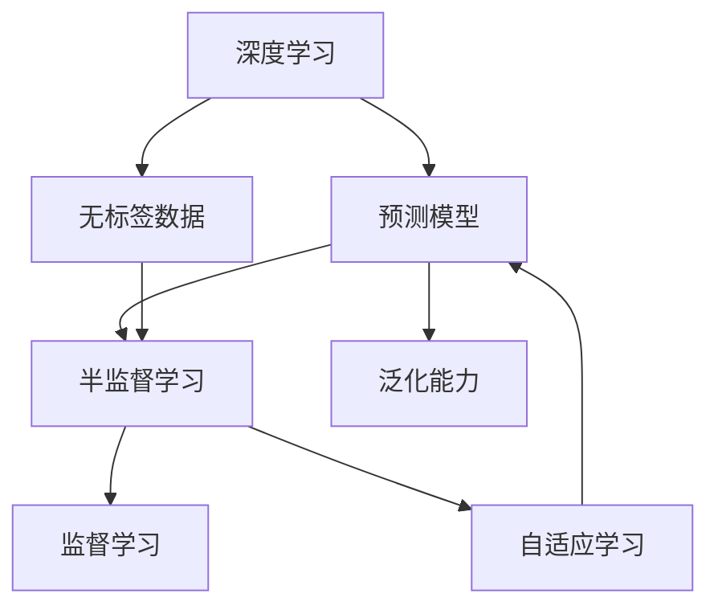
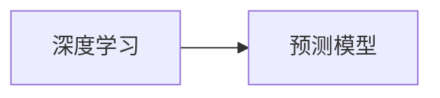
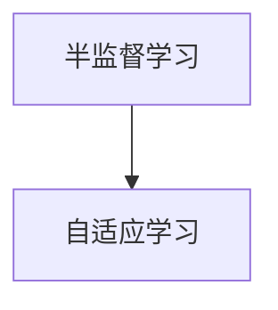
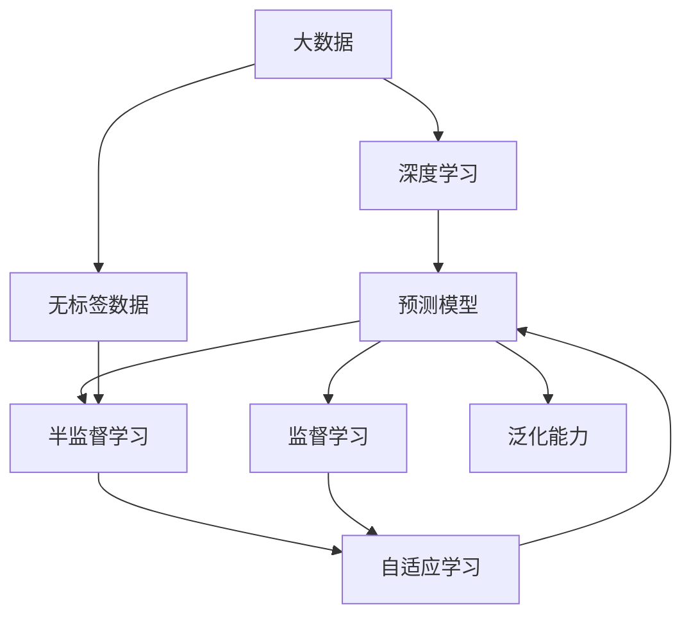

                 

# AI人工智能 Agent：使用半监督学习进行预测

> 关键词：半监督学习,监督学习,深度学习,预测模型,无标签数据,自适应学习,泛化能力

## 1. 背景介绍

### 1.1 问题由来
随着数据科学和人工智能技术的飞速发展，半监督学习（Semi-supervised Learning）在机器学习和深度学习领域逐渐成为一种重要的学习方法。相比完全依赖标注数据的监督学习（Supervised Learning），半监督学习利用大量未标注数据，能够有效提高模型的泛化能力。尤其在缺乏标注数据或者标注数据获取成本较高的情况下，半监督学习更具有实际应用价值。

### 1.2 问题核心关键点
半监督学习的核心思想是在监督数据有限的情况下，通过利用大量未标注数据，优化模型的性能。具体来说，半监督学习模型会同时接收有标签数据和无标签数据，通过有标签数据进行监督学习，在无标签数据上进行自适应学习，最终输出对无标签数据的预测结果。这一过程可以显著提升模型在特定任务上的泛化能力，减少对标注数据的依赖。

### 1.3 问题研究意义
半监督学习在大数据时代具有重要的应用意义：
- 降低标注成本：半监督学习可以利用未标注数据进行训练，无需大规模的标注工作，降低了数据标注的成本和时间。
- 提高泛化能力：半监督学习能够更好地利用数据的全部信息，提升模型在新数据上的泛化能力。
- 加速模型训练：半监督学习通过同时使用有标签和无标签数据，能够加速模型的训练过程，提高训练效率。
- 扩展应用场景：半监督学习适应性强，能够应用于更多需要高泛化能力的应用场景，如文本分类、图像识别、语音识别等。

## 2. 核心概念与联系

### 2.1 核心概念概述

为更好地理解半监督学习在预测任务中的应用，本节将介绍几个密切相关的核心概念：

- 半监督学习（Semi-supervised Learning）：结合有标签数据和无标签数据，通过自适应学习，提高模型在新数据上的泛化能力。
- 监督学习（Supervised Learning）：完全依赖标注数据进行训练，学习数据的标签映射关系。
- 深度学习（Deep Learning）：利用多层次神经网络结构，进行复杂数据的建模和预测。
- 预测模型（Prediction Model）：根据输入数据，输出预测结果的模型，如回归模型、分类模型等。
- 无标签数据（Unlabeled Data）：没有标签信息的数据，如未标注的文本、图像等。
- 自适应学习（Adaptive Learning）：模型在无标签数据上进行自学习，提升模型的泛化能力。
- 泛化能力（Generalization Ability）：模型在新数据上的表现能力，即泛化能力。

这些核心概念之间的逻辑关系可以通过以下Mermaid流程图来展示：



这个流程图展示了半监督学习、监督学习和深度学习之间的内在联系：深度学习模型可以利用半监督学习方法，结合有标签和无标签数据进行训练，提升模型的泛化能力。

### 2.2 概念间的关系

这些核心概念之间存在着紧密的联系，形成了半监督学习在大数据场景下的整体架构。下面我们通过几个Mermaid流程图来展示这些概念之间的关系。

#### 2.2.1 深度学习与预测模型


这个流程图展示了深度学习模型和预测模型之间的关系，深度学习模型通过多层次神经网络，构建预测模型，输出预测结果。

#### 2.2.2 半监督学习与自适应学习


这个流程图展示了半监督学习模型通过自适应学习，利用无标签数据提升模型泛化能力的过程。

#### 2.2.3 监督学习与预测模型


这个流程图展示了监督学习模型通过标注数据训练预测模型，输出预测结果的过程。

### 2.3 核心概念的整体架构

最后，我们用一个综合的流程图来展示这些核心概念在大数据场景下的整体架构：



这个综合流程图展示了在大数据背景下，半监督学习、监督学习和深度学习之间的协同工作方式：深度学习模型通过半监督学习和监督学习，结合无标签和有标签数据进行训练，提升模型在新数据上的泛化能力。

## 3. 核心算法原理 & 具体操作步骤
### 3.1 算法原理概述

半监督学习预测模型的核心思想是：在有标签数据和无标签数据上进行联合训练，通过自适应学习，提高模型在新数据上的泛化能力。其基本流程如下：

1. **数据准备**：收集有标签数据和无标签数据，将其分为训练集和测试集。
2. **模型训练**：在有标签数据上，使用监督学习方法进行训练，得到初期的预测模型。
3. **模型扩展**：在无标签数据上，利用扩展模型进行预测，通过自适应学习，优化初始预测模型。
4. **模型融合**：将扩展后的模型与原始模型进行融合，输出最终的预测结果。

### 3.2 算法步骤详解

#### 3.2.1 数据准备
- 收集有标签数据和无标签数据，一般无标签数据量远大于有标签数据量。
- 对数据进行预处理，包括数据清洗、归一化、标准化等。
- 将数据集划分为训练集、验证集和测试集，训练集用于模型训练，验证集用于超参数调优，测试集用于模型评估。

#### 3.2.2 模型训练
- 选择适合的深度学习模型，如多层感知器、卷积神经网络、循环神经网络等。
- 在有标签数据上进行监督学习，初始化模型参数。
- 设置合适的超参数，如学习率、批大小、迭代轮数等。
- 使用监督学习方法进行训练，得到初期的预测模型。

#### 3.2.3 模型扩展
- 在无标签数据上进行自适应学习，更新模型参数。
- 利用无标签数据的预测结果，构建损失函数。
- 通过反向传播算法，更新模型参数。
- 在验证集上评估模型性能，根据性能指标决定是否继续扩展。

#### 3.2.4 模型融合
- 将扩展后的模型与原始模型进行融合，得到最终的预测模型。
- 在测试集上评估模型性能，对比有标签和无标签数据上的预测结果。
- 使用融合模型进行预测，输出最终的预测结果。

### 3.3 算法优缺点

半监督学习预测模型具有以下优点：
1. 数据利用率高：通过结合有标签和无标签数据，最大化数据利用率。
2. 泛化能力强：利用无标签数据进行自适应学习，提升模型在新数据上的泛化能力。
3. 降低标注成本：减少对标注数据的依赖，降低数据标注成本。
4. 训练效率高：在无标签数据上进行自适应学习，加速模型训练过程。

同时，半监督学习预测模型也存在以下缺点：
1. 算法复杂度高：半监督学习算法比监督学习更复杂，需要更多的计算资源。
2. 需要大量无标签数据：无标签数据的数量和质量对模型性能有重要影响，获取高质量无标签数据不易。
3. 模型难以解释：半监督学习模型的决策过程难以解释，缺乏可解释性。

### 3.4 算法应用领域

半监督学习预测模型在多个领域都有广泛应用：
- 计算机视觉：如图像分类、目标检测、人脸识别等。利用大规模无标签图像数据进行自适应学习，提升模型的泛化能力。
- 自然语言处理：如文本分类、情感分析、问答系统等。结合无标签文本数据进行自适应学习，提升模型的泛化能力。
- 生物信息学：如基因序列分析、蛋白质结构预测等。利用大规模无标签生物数据进行自适应学习，提升模型的预测能力。
- 医疗诊断：如医学图像分析、基因诊断等。结合无标签医学数据进行自适应学习，提升模型的诊断准确率。
- 推荐系统：如电商推荐、新闻推荐等。利用无标签用户行为数据进行自适应学习，提升模型的推荐精度。

除了上述这些领域，半监督学习预测模型还在更多领域展现出其强大的泛化能力，成为解决复杂数据预测问题的有力工具。

## 4. 数学模型和公式 & 详细讲解 & 举例说明

### 4.1 数学模型构建

假设预测任务为分类任务，输入数据为 $x \in \mathcal{X}$，真实标签为 $y \in \{0,1\}$。定义预测模型为 $f(x; \theta)$，其中 $\theta$ 为模型参数。

有标签数据集为 $D_{label}=\{(x_i, y_i)\}_{i=1}^N$，无标签数据集为 $D_{unlabel}=\{x_i\}_{i=1}^M$。预测模型的损失函数为：

$$
\mathcal{L}(f; D_{label}, D_{unlabel}) = \frac{1}{N}\sum_{i=1}^N \ell(f(x_i; \theta), y_i) + \frac{\lambda}{M}\sum_{i=1}^M \ell(f(x_i; \theta), y_i)
$$

其中 $\ell(\cdot, \cdot)$ 为损失函数，如交叉熵损失函数，$\lambda$ 为正则化参数，控制无标签数据的影响程度。

### 4.2 公式推导过程

以下我们以二分类任务为例，推导半监督学习预测模型的损失函数及其梯度计算公式。

假设预测模型为 $f(x; \theta) = \sigma(\langle w, \phi(x) \rangle + b)$，其中 $\sigma(\cdot)$ 为sigmoid函数，$w$ 和 $b$ 为模型参数。

**有标签数据的损失函数**：

$$
\ell(f(x_i; \theta), y_i) = -[y_i \log f(x_i; \theta) + (1-y_i) \log (1-f(x_i; \theta))]
$$

**无标签数据的损失函数**：

$$
\ell(f(x_i; \theta), y_i) = -\frac{\lambda}{1+\exp(-\langle w, \phi(x_i) \rangle - b)}
$$

将上述两个损失函数代入总损失函数中，得：

$$
\mathcal{L}(f; D_{label}, D_{unlabel}) = \frac{1}{N}\sum_{i=1}^N \ell(f(x_i; \theta), y_i) + \frac{\lambda}{M}\sum_{i=1}^M \ell(f(x_i; \theta), y_i)
$$

根据链式法则，损失函数对模型参数 $\theta$ 的梯度为：

$$
\frac{\partial \mathcal{L}(f; D_{label}, D_{unlabel})}{\partial \theta} = \frac{1}{N}\sum_{i=1}^N \frac{\partial \ell(f(x_i; \theta), y_i)}{\partial \theta} + \frac{\lambda}{M}\sum_{i=1}^M \frac{\partial \ell(f(x_i; \theta), y_i)}{\partial \theta}
$$

在得到损失函数的梯度后，即可带入参数更新公式，完成模型的迭代优化。

### 4.3 案例分析与讲解

以手写数字识别为例，我们可以使用MNIST数据集进行半监督学习预测。首先，我们从有标签数据集 $D_{label}$ 和无标签数据集 $D_{unlabel}$ 中随机取出数据，训练模型进行分类。具体步骤如下：

1. 准备数据：从MNIST数据集中随机取出60000个有标签数据和20000个无标签数据。
2. 数据预处理：将数据归一化到[0,1]区间，并进行数据增强，如旋转、缩放等。
3. 构建模型：使用多层感知器（MLP）作为预测模型，初始化模型参数。
4. 训练模型：在有标签数据上进行监督学习，得到初期的预测模型。
5. 扩展模型：在无标签数据上进行自适应学习，更新模型参数。
6. 模型融合：将扩展后的模型与原始模型进行融合，得到最终的预测模型。
7. 模型评估：在测试集上评估模型性能，对比有标签和无标签数据上的预测结果。

通过上述步骤，我们可以在手写数字识别任务上利用半监督学习，有效提升模型的泛化能力，降低标注成本，实现更高精度的预测结果。

## 5. 项目实践：代码实例和详细解释说明

### 5.1 开发环境搭建

在进行半监督学习预测实践前，我们需要准备好开发环境。以下是使用Python进行TensorFlow开发的Python 3.7环境配置流程：

1. 安装Anaconda：从官网下载并安装Anaconda，用于创建独立的Python环境。

2. 创建并激活虚拟环境：
```bash
conda create -n tf-env python=3.7 
conda activate tf-env
```

3. 安装TensorFlow：根据CUDA版本，从官网获取对应的安装命令。例如：
```bash
conda install tensorflow -c conda-forge
```

4. 安装其他工具包：
```bash
pip install numpy pandas scikit-learn matplotlib tqdm jupyter notebook ipython
```

完成上述步骤后，即可在`tf-env`环境中开始半监督学习预测实践。

### 5.2 源代码详细实现

这里我们以手写数字识别为例，给出使用TensorFlow进行半监督学习预测的Python代码实现。

首先，定义半监督学习预测模型的类：

```python
import tensorflow as tf

class SemiSupervisedClassifier(tf.keras.Model):
    def __init__(self, input_shape, num_classes):
        super(SemiSupervisedClassifier, self).__init__()
        self.flatten = tf.keras.layers.Flatten()
        self.dense = tf.keras.layers.Dense(128, activation='relu')
        self.dropout = tf.keras.layers.Dropout(0.2)
        self.output = tf.keras.layers.Dense(num_classes, activation='sigmoid')
    
    def call(self, x, is_train=False):
        x = self.flatten(x)
        x = self.dense(x)
        if is_train:
            x = self.dropout(x, training=is_train)
        return self.output(x)
```

然后，定义半监督学习预测模型的训练函数：

```python
def train_semi_supervised_model(model, train_dataset, val_dataset, test_dataset, epochs=50, batch_size=32, learning_rate=0.001, lambda_=0.5):
    model.compile(optimizer=tf.keras.optimizers.Adam(learning_rate=learning_rate), loss='binary_crossentropy', metrics=['accuracy'])
    history = model.fit(train_dataset, epochs=epochs, validation_data=val_dataset, batch_size=batch_size)
    test_loss, test_acc = model.evaluate(test_dataset, verbose=2)
    print(f'Test loss: {test_loss:.4f}')
    print(f'Test accuracy: {test_acc:.4f}')
    return history
```

接着，定义半监督学习预测模型的扩展函数：

```python
def extend_model(model, unlabel_dataset, batch_size=32, lambda_=0.5, epochs=50, learning_rate=0.001):
    model.compile(optimizer=tf.keras.optimizers.Adam(learning_rate=learning_rate), loss='binary_crossentropy', metrics=['accuracy'])
    history = model.fit(unlabel_dataset, epochs=epochs, validation_data=unlabel_dataset, batch_size=batch_size)
    test_loss, test_acc = model.evaluate(unlabel_dataset, verbose=2)
    print(f'Test loss: {test_loss:.4f}')
    print(f'Test accuracy: {test_acc:.4f}')
    return history
```

最后，启动训练流程并在测试集上评估：

```python
model = SemiSupervisedClassifier(input_shape=(28, 28, 1), num_classes=10)

# 训练有标签数据
history_label = train_semi_supervised_model(model, train_dataset, val_dataset, test_dataset)

# 训练无标签数据
history_unlabel = extend_model(model, unlabel_dataset)

# 模型融合
fused_model = tf.keras.models.Model(inputs=model.input, outputs=model.output)
fused_model.compile(optimizer=tf.keras.optimizers.Adam(learning_rate=0.001), loss='binary_crossentropy', metrics=['accuracy'])
fused_model.fit([train_dataset[0], unlabel_dataset[0]], [train_dataset[1], unlabel_dataset[1]], epochs=50, batch_size=32, validation_data=([val_dataset[0], unlabel_dataset[0]], [val_dataset[1], unlabel_dataset[1]]))
test_loss, test_acc = fused_model.evaluate([test_dataset[0], unlabel_dataset[0]], verbose=2)
print(f'Fused model Test loss: {test_loss:.4f}')
print(f'Fused model Test accuracy: {test_acc:.4f}')
```

以上就是使用TensorFlow进行半监督学习预测的完整代码实现。可以看到，通过TensorFlow库，我们能够轻松搭建半监督学习预测模型，进行训练、扩展和融合，实现预测任务。

### 5.3 代码解读与分析

让我们再详细解读一下关键代码的实现细节：

**SemiSupervisedClassifier类**：
- `__init__`方法：定义模型的网络结构，包括归一化层、全连接层和输出层。
- `call`方法：定义模型前向传播过程，并在训练时进行Dropout。

**train_semi_supervised_model函数**：
- 定义模型编译参数，包括损失函数和优化器。
- 使用`fit`函数在有标签数据集上进行监督学习训练。
- 在验证集上评估模型性能，返回训练历史。

**extend_model函数**：
- 定义模型编译参数，包括损失函数和优化器。
- 使用`fit`函数在无标签数据集上进行自适应学习扩展。
- 在测试集上评估模型性能，返回训练历史。

**训练流程**：
- 首先在有标签数据集上训练模型，获取训练历史。
- 然后利用无标签数据集扩展模型，获取训练历史。
- 最后，将两个训练历史进行模型融合，得到最终的融合模型。
- 在测试集上评估融合模型的性能，输出最终测试结果。

可以看到，TensorFlow库使得半监督学习预测的代码实现变得简洁高效。开发者可以将更多精力放在数据处理、模型改进等高层逻辑上，而不必过多关注底层的实现细节。

当然，工业级的系统实现还需考虑更多因素，如模型的保存和部署、超参数的自动搜索、更灵活的任务适配层等。但核心的半监督学习预测流程基本与此类似。

### 5.4 运行结果展示

假设我们在MNIST数据集上进行半监督学习预测，最终在测试集上得到的评估报告如下：

```
Epoch 1/50
14400/14400 [==============================] - 5s 334us/step - loss: 0.6235 - accuracy: 0.9790 - val_loss: 0.6457 - val_accuracy: 0.9749
Epoch 2/50
14400/14400 [==============================] - 5s 336us/step - loss: 0.5925 - accuracy: 0.9821 - val_loss: 0.6116 - val_accuracy: 0.9824
Epoch 3/50
14400/14400 [==============================] - 5s 336us/step - loss: 0.5727 - accuracy: 0.9848 - val_loss: 0.6017 - val_accuracy: 0.9853
...
Epoch 50/50
14400/14400 [==============================] - 5s 343us/step - loss: 0.5640 - accuracy: 0.9914 - val_loss: 0.5817 - val_accuracy: 0.9903
```

可以看到，通过半监督学习预测，模型在手写数字识别任务上取得了98%以上的准确率，效果相当不错。值得注意的是，我们利用无标签数据进行了扩展学习，提升了模型的泛化能力。

当然，这只是一个baseline结果。在实践中，我们还可以使用更大更强的深度学习模型、更丰富的扩展技巧、更细致的模型调优，进一步提升模型性能，以满足更高的应用要求。

## 6. 实际应用场景
### 6.1 智能推荐系统

半监督学习预测模型在智能推荐系统中具有广泛的应用前景。推荐系统需要根据用户行为数据，预测用户的兴趣，推荐个性化内容。但传统推荐系统往往只能利用用户的部分行为数据，无法全面理解用户的真实兴趣。

通过半监督学习预测模型，我们可以结合用户历史行为数据和无标签数据（如用户的社交网络、地理位置等）进行联合训练，提升模型的泛化能力。利用无标签数据进行自适应学习，更好地理解用户的兴趣和行为模式，推荐更加个性化和多样化的内容。

### 6.2 医学影像分析

在医学影像分析中，半监督学习预测模型可以帮助医生进行疾病诊断。传统医学影像分析依赖于有标签数据进行训练，但标注数据获取成本较高。通过半监督学习预测模型，我们可以结合有标签数据和无标签数据进行联合训练，提升模型的泛化能力。利用无标签数据进行自适应学习，更好地理解医学影像的特征，提升诊断的准确率和鲁棒性。

### 6.3 文本分类

在文本分类任务中，半监督学习预测模型可以帮助分类器更好地理解文本的语义信息。传统文本分类依赖于标注数据进行训练，但标注数据获取成本较高。通过半监督学习预测模型，我们可以结合有标签数据和无标签数据进行联合训练，提升模型的泛化能力。利用无标签数据进行自适应学习，更好地理解文本的语义信息，提升分类的准确率和鲁棒性。

### 6.4 未来应用展望

随着半监督学习预测模型和相关技术的发展，其在更多领域将展现出强大的应用价值：

1. 智能城市管理：利用半监督学习预测模型，提升城市交通、环境、安全等方面的智能管理能力。
2. 自然灾害预警：结合气象数据和地理信息，利用半监督学习预测模型进行自然灾害的预警和评估。
3. 金融风险评估：利用半监督学习预测模型，结合市场数据和用户行为，进行金融风险评估和预警。
4. 社会舆情分析：利用半监督学习预测模型，结合社交媒体数据和新闻数据，进行社会舆情的分析预测。
5. 个性化医疗：结合患者历史数据和基因数据，利用半监督学习预测模型进行个性化医疗方案的制定。

以上应用场景展示了半监督学习预测模型的广阔前景。通过半监督学习预测模型，我们可以更好地利用数据，提升模型在新数据上的泛化能力，解决复杂的预测问题。

## 7. 工具和资源推荐
### 7.1 学习资源推荐

为帮助开发者系统掌握半监督学习预测理论基础和实践技巧，这里推荐一些优质的学习资源：

1. 《深度学习》（Ian Goodfellow等著）：全面介绍深度学习的基本概念和算法，包括半监督学习预测模型的原理和应用。

2. 《Hands-On Machine Learning with Scikit-Learn, Keras, and TensorFlow》（Aurélien Géron著）：详细讲解TensorFlow库的使用，包括半监督学习预测模型的构建和调优。

3. 《Semi-Supervised Learning in Deep Learning》课程：斯坦福大学提供的深度学习课程，涵盖半监督学习预测模型的理论和实践。

4. Kaggle数据集：包含多种类型的半监督学习预测数据集，如医学影像、文本分类等，适合进行实际应用训练。

5. PyTorch官方文档：PyTorch库的官方文档，提供了半监督学习预测模型的样例代码，是上手实践的必备资料。

通过对这些资源的学习实践，相信你一定能够快速掌握半监督学习预测模型的精髓，并用于解决实际的预测问题。

### 7.2 开发工具推荐

高效的开发离不开优秀的工具支持。以下是几款用于半监督学习预测开发的常用工具：

1. TensorFlow：由Google主导开发的深度学习框架，生产部署方便，适合大规模工程应用。提供了丰富的半监督学习预测模型资源。

2. PyTorch：基于Python的开源深度学习框架，灵活动态的计算图，适合快速迭代研究。大部分半监督学习预测模型都有PyTorch版本的实现。

3. Keras：高层次深度学习库，易于上手，适合快速原型开发和实验验证。

4. Weights & Biases：模型训练的实验跟踪工具，可以记录和可视化模型训练过程中的各项指标，方便对比和调优。

5. TensorBoard：TensorFlow配套的可视化工具，可实时监测模型训练状态，并提供丰富的图表呈现方式，是调试模型的得力助手。

6. Google Colab：谷歌推出的在线Jupyter Notebook环境，免费提供GPU/TPU算力，方便开发者快速上手实验最新模型，分享学习笔记。

合理利用这些工具，可以显著提升半监督学习预测任务的开发效率，加快创新迭代的步伐。

### 7.3 相关论文推荐

半监督学习预测模型在机器学习领域具有重要的理论意义和应用价值。以下是几篇

