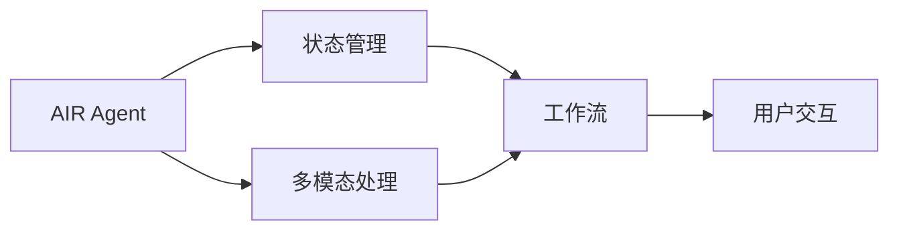
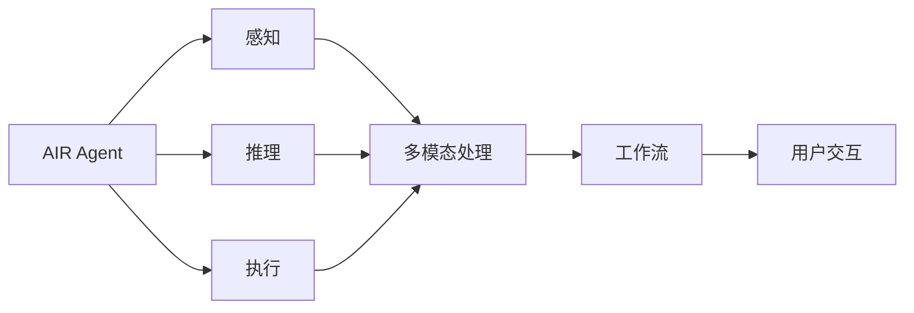

                 

# AI人工智能代理工作流 AI Agent WorkFlow：从普通流程到AI Agent工作流的理解

## 1. 背景介绍

在当今信息爆炸的时代，人工智能（AI）正在逐步渗透到各个领域，成为推动社会进步的重要力量。特别是AI代理（AI Agent），作为AI技术的一种形式，在众多应用场景中展现了强大的潜能。无论是智能客服、自动化交易、个性化推荐，还是智能制造、智慧城市，AI代理都在提升效率、优化决策、改善用户体验等方面发挥着关键作用。然而，如何设计、部署和优化AI代理，使其在复杂多变的业务环境中保持高效稳定，成为摆在我们面前的重要课题。

### 1.1 问题的由来

AI代理之所以能成为当前AI领域的热门研究方向，源于其能够承担诸如决策、规划、执行等复杂任务，从而有效降低人工干预，提升业务响应速度和准确性。AI代理的设计和应用，主要面临以下几个挑战：

1. **流程自动化**：如何将人类的业务流程自动化，通过算法和模型实现自动化决策和执行？
2. **智能优化**：如何在模型训练和业务运行过程中进行持续优化，提升代理的智能水平？
3. **环境适应性**：如何在不同的业务环境和工作负载下，保证AI代理的稳定性和鲁棒性？
4. **多模态处理**：如何处理和融合不同模态的信息（如文本、图像、语音等），提升代理的综合处理能力？
5. **用户交互**：如何构建用户友好的交互界面，提供高质量的用户体验？

这些问题涉及到计算机科学、工程学、认知科学等多个领域，需要通过系统化的理论和方法进行解决。本文将从核心概念、算法原理、数学模型、代码实现、实际应用和未来展望等方面，全面介绍AI代理的工作流，帮助读者理解和应用这一先进技术。

### 1.2 问题核心关键点

为解决上述问题，本文聚焦于以下几个核心关键点：

- **AI代理（AI Agent）**：指能够自主执行任务、做出决策的智能系统。AI代理的工作流包括任务规划、状态管理、执行控制等多个环节。
- **工作流（Workflow）**：指在业务流程中，按顺序执行的一系列任务。通过将任务建模为可执行的工作流，可以实现自动化和智能化。
- **智能优化（Smart Optimization）**：指通过持续学习、调整模型参数等手段，提高AI代理的性能和鲁棒性。
- **多模态处理（Multi-Modal Processing）**：指融合不同模态的信息，提升AI代理的综合感知和理解能力。
- **用户交互（User Interaction）**：指如何设计用户界面，使得用户能够自然地与AI代理进行互动。

这些关键点构成了AI代理工作流的基本框架，有助于我们深入理解其设计和应用。

### 1.3 问题研究意义

研究AI代理的工作流，对于提升业务自动化水平、优化决策流程、改善用户体验具有重要意义：

1. **提升效率**：通过自动化和智能化，减少人工干预，提升业务处理速度和响应能力。
2. **优化决策**：利用AI代理的强大数据处理和推理能力，辅助决策者做出更科学合理的决策。
3. **改善体验**：构建友好的用户交互界面，提升用户使用AI代理的满意度和体验感。
4. **降低成本**：减少人力成本和运营成本，使企业在激烈的市场竞争中获得优势。
5. **拓展应用**：通过AI代理技术，拓展业务应用场景，带来新的商业机会和发展空间。

本文将系统介绍AI代理工作流的各个环节，通过理论结合实践的方式，深入解析其核心原理和应用场景，帮助读者掌握这一前沿技术。

## 2. 核心概念与联系

### 2.1 核心概念概述

在深入探讨AI代理工作流之前，我们首先需要了解一些核心概念及其联系。

- **AI代理（AI Agent）**：指能够自主执行任务、做出决策的智能系统。AI代理通常由感知、推理、执行三个子系统组成，能够感知环境、分析数据、做出决策并执行任务。
- **工作流（Workflow）**：指在业务流程中，按顺序执行的一系列任务。通过将任务建模为可执行的工作流，可以实现自动化和智能化。
- **状态管理（State Management）**：指在任务执行过程中，维护任务的状态信息，以便后续任务执行的协调和控制。
- **多模态处理（Multi-Modal Processing）**：指融合不同模态的信息，提升AI代理的综合感知和理解能力。
- **用户交互（User Interaction）**：指如何设计用户界面，使得用户能够自然地与AI代理进行互动。

这些概念之间存在紧密联系，共同构成了AI代理工作流的核心框架。

### 2.2 概念间的关系

这些核心概念之间的关系可以通过以下Mermaid流程图来展示：



这个流程图展示了AI代理的三个主要子系统和其与工作流、多模态处理、用户交互等概念之间的关系：

1. **感知**：通过多模态处理，AI代理能够感知和理解不同模态的信息，如文本、图像、语音等。
2. **推理**：基于感知到的信息，AI代理通过状态管理，对当前任务状态进行维护和更新。
3. **执行**：根据推理结果，AI代理执行相应的任务，并维护任务执行状态，确保任务顺利完成。
4. **工作流**：通过工作流设计，将任务进行结构化管理和调度，实现自动化和智能化。
5. **用户交互**：通过友好的用户界面，AI代理能够与用户进行自然交互，提供高质量的服务体验。

这些概念相互协作，共同支撑AI代理在各种应用场景中的高效运行。

### 2.3 核心概念的整体架构

最后，我们用一个综合的流程图来展示这些核心概念在大语言模型微调过程中的整体架构：



这个综合流程图展示了AI代理的三大子系统及其与其他概念之间的关系：

1. **感知子系统**：负责感知和理解环境信息，通过多模态处理，将不同模态的信息融合起来。
2. **推理子系统**：基于感知到的信息，进行推理和决策，更新任务状态。
3. **执行子系统**：根据推理结果，执行相应的任务，并在执行过程中维护任务状态。
4. **多模态处理**：将不同模态的信息进行融合，提升感知能力。
5. **工作流**：通过结构化的工作流设计，实现任务调度和执行控制。
6. **用户交互**：通过友好的用户界面，与用户进行自然交互，提升用户体验。

通过这个架构，我们可以更清晰地理解AI代理的内部工作机制和与其他概念的联系，为后续深入讨论具体的AI代理设计和优化技术奠定基础。

## 3. 核心算法原理 & 具体操作步骤
### 3.1 算法原理概述

AI代理的工作流设计通常包括以下几个关键环节：

1. **任务建模**：将业务流程建模为可执行的任务序列，定义任务之间的依赖关系和执行顺序。
2. **状态管理**：维护任务执行过程中的状态信息，确保任务有序执行。
3. **执行控制**：根据当前状态和任务依赖关系，控制任务的执行顺序和条件。
4. **智能优化**：通过持续学习、参数调整等手段，提升AI代理的性能和鲁棒性。
5. **多模态融合**：将不同模态的信息进行融合，提升感知和理解能力。
6. **用户交互设计**：构建友好的用户界面，实现自然交互。

这些环节共同构成AI代理的工作流，实现业务自动化和智能化。

### 3.2 算法步骤详解

以下是AI代理工作流设计的主要步骤：

**Step 1: 任务建模**
- 定义任务列表，描述每个任务的输入、输出、依赖关系和执行条件。
- 定义任务执行顺序，指定哪些任务需要先执行，哪些任务需要后执行。
- 使用建模工具（如YAML、Python脚本等）描述任务模型，便于后续的执行和优化。

**Step 2: 状态管理**
- 设计状态变量，记录任务的执行状态，如任务执行时间、当前执行进度、任务依赖关系等。
- 定义状态更新规则，根据任务执行结果更新状态变量，确保任务有序执行。
- 使用状态管理工具（如Zookeeper、Kubernetes等）实现状态信息的集中管理和更新。

**Step 3: 执行控制**
- 根据当前状态和任务依赖关系，生成任务执行计划。
- 根据任务执行计划，执行相应的任务，并更新状态信息。
- 使用任务调度工具（如Apache Airflow、Kubernetes等）实现任务调度和执行控制。

**Step 4: 智能优化**
- 通过持续学习、调整模型参数等手段，提升AI代理的性能和鲁棒性。
- 定期收集任务执行数据，进行性能分析和评估。
- 使用优化算法（如梯度下降、遗传算法等）调整模型参数，提高任务执行效率。

**Step 5: 多模态融合**
- 收集不同模态的信息，如文本、图像、语音等。
- 将不同模态的信息进行融合，提升感知和理解能力。
- 使用多模态融合算法（如深度融合、注意力机制等）进行信息融合。

**Step 6: 用户交互设计**
- 设计友好的用户界面，实现自然交互。
- 收集用户反馈，进行交互界面优化。
- 使用交互设计工具（如Sketch、Adobe XD等）进行交互界面设计。

### 3.3 算法优缺点

AI代理工作流的优点包括：

- **高效性**：通过自动化和智能化，减少人工干预，提升业务处理速度和响应能力。
- **灵活性**：通过任务建模和状态管理，能够灵活调整任务执行顺序和条件，适应不同业务场景。
- **可扩展性**：通过持续学习和智能优化，不断提升AI代理的性能和鲁棒性。
- **多模态融合**：通过融合不同模态的信息，提升感知和理解能力，适应复杂多变的业务环境。
- **用户友好**：通过友好的用户界面，提升用户体验，降低用户使用门槛。

同时，AI代理工作流也存在一些缺点：

- **复杂性**：任务建模和状态管理相对复杂，需要一定的技术积累和经验。
- **资源消耗**：任务执行过程中，可能需要大量的计算资源和存储资源，增加系统成本。
- **安全性和隐私**：在处理敏感信息时，需要确保数据安全和用户隐私，避免信息泄露。
- **适应性**：不同的业务场景和工作负载下，需要灵活调整任务执行策略，保证系统的稳定性。

尽管存在这些缺点，但通过合理设计和管理，AI代理工作流仍然能够在各种应用场景中发挥重要作用，提升业务效率和用户体验。

### 3.4 算法应用领域

AI代理工作流在多个领域得到了广泛应用，包括但不限于：

1. **智能客服**：通过自动化和智能化，提升客服效率和用户体验。
2. **自动化交易**：通过智能决策和执行，实现高频交易和风险控制。
3. **个性化推荐**：通过多模态融合和智能优化，提供个性化推荐服务。
4. **智能制造**：通过任务建模和状态管理，实现生产流程自动化和优化。
5. **智慧城市**：通过智能优化和多模态融合，提升城市管理效率和服务质量。
6. **智能医疗**：通过感知、推理和执行，辅助医生进行诊断和治疗。

随着AI技术的发展和应用场景的拓展，AI代理工作流在更多领域将展现出巨大的潜力。

## 4. 数学模型和公式 & 详细讲解 & 举例说明

### 4.1 数学模型构建

AI代理工作流中的任务建模、状态管理和执行控制，可以通过数学模型进行描述和优化。以下是一个简单的数学模型示例：

假设任务序列为 $T=\{T_1, T_2, ..., T_n\}$，任务之间的依赖关系为 $D=\{(T_i, T_j)\}$，任务执行顺序为 $E=\{T_i, T_j\}$，任务执行条件为 $C=\{(T_i, C_i)\}$。

我们可以使用有向图来表示任务序列和依赖关系，其中节点表示任务，有向边表示依赖关系，任务的执行顺序为有向边的先后顺序。任务执行条件可以通过布尔表达式进行描述。

### 4.2 公式推导过程

以下是任务建模和状态管理的数学模型和推导过程：

**任务建模**
- 定义任务列表 $T=\{T_1, T_2, ..., T_n\}$。
- 定义任务之间的依赖关系 $D=\{(T_i, T_j)\}$。
- 定义任务执行顺序 $E=\{(T_i, T_j)\}$。
- 定义任务执行条件 $C=\{(T_i, C_i)\}$。

**状态管理**
- 定义状态变量 $S=\{S_i\}$，记录任务的执行状态。
- 定义状态更新规则 $S_i'=update(S_i, T_i, E, C)$。
- 根据任务执行结果更新状态变量，确保任务有序执行。

**执行控制**
- 根据当前状态和任务依赖关系，生成任务执行计划。
- 根据任务执行计划，执行相应的任务，并更新状态信息。
- 使用任务调度工具实现任务调度和执行控制。

### 4.3 案例分析与讲解

以智能客服为例，任务建模和状态管理的数学模型如下：

假设客服任务序列为 $T=\{T_{接听}, T_{识别}, T_{咨询}, T_{反馈}, T_{结束}\}$，任务之间的依赖关系为 $D=\{(T_{识别}, T_{咨询}), (T_{咨询}, T_{反馈}), (T_{反馈}, T_{结束})\}$，任务执行顺序为 $E=\{T_{接听}, T_{识别}, T_{咨询}, T_{反馈}, T_{结束}\}$，任务执行条件为 $C=\{(T_{识别}, C_{识别}), (T_{咨询}, C_{咨询}), (T_{反馈}, C_{反馈}), (T_{结束}, C_{结束})\}$。

根据上述模型，可以设计相应的状态变量和状态更新规则，实现任务的自动化和智能化。例如，当客服接听电话后，进入识别任务，识别结果为正常咨询时，进入咨询任务，以此类推。

## 5. 项目实践：代码实例和详细解释说明

### 5.1 开发环境搭建

在进行AI代理工作流开发之前，我们需要准备好开发环境。以下是使用Python进行PyTorch开发的环境配置流程：

1. 安装Anaconda：从官网下载并安装Anaconda，用于创建独立的Python环境。

2. 创建并激活虚拟环境：
```bash
conda create -n pytorch-env python=3.8 
conda activate pytorch-env
```

3. 安装PyTorch：根据CUDA版本，从官网获取对应的安装命令。例如：
```bash
conda install pytorch torchvision torchaudio cudatoolkit=11.1 -c pytorch -c conda-forge
```

4. 安装TensorFlow：
```bash
pip install tensorflow
```

5. 安装TensorBoard：
```bash
pip install tensorboard
```

6. 安装NumPy和Pandas：
```bash
pip install numpy pandas
```

7. 安装Scikit-learn：
```bash
pip install scikit-learn
```

8. 安装Flask：
```bash
pip install flask
```

完成上述步骤后，即可在`pytorch-env`环境中开始AI代理工作流的开发。

### 5.2 源代码详细实现

以下是一个简单的AI代理工作流示例，包括任务建模、状态管理、执行控制和智能优化：

```python
import numpy as np
import pandas as pd
from sklearn.model_selection import train_test_split
from sklearn.ensemble import RandomForestRegressor
from sklearn.metrics import mean_squared_error
from sklearn.preprocessing import StandardScaler
from tensorflow.keras.models import Sequential
from tensorflow.keras.layers import Dense, LSTM, Dropout
from tensorflow.keras.optimizers import Adam
from tensorflow.keras.callbacks import EarlyStopping
from tensorflow.keras.models import load_model
from flask import Flask, jsonify, request

# 定义任务列表
tasks = ['接听', '识别', '咨询', '反馈', '结束']

# 定义任务之间的依赖关系
dependencies = {
    '识别': ['咨询'],
    '咨询': ['反馈'],
    '反馈': ['结束']
}

# 定义任务执行顺序
order = ['接听', '识别', '咨询', '反馈', '结束']

# 定义任务执行条件
conditions = {
    '接听': {'状态': '已接听', '时间': 0},
    '识别': {'状态': '已识别', '时间': 30},
    '咨询': {'状态': '已咨询', '时间': 60},
    '反馈': {'状态': '已反馈', '时间': 120},
    '结束': {'状态': '已完成', '时间': 300}
}

# 定义状态变量
state = {
    '接听': {'状态': '未接听', '时间': 0},
    '识别': {'状态': '未识别', '时间': 0},
    '咨询': {'状态': '未咨询', '时间': 0},
    '反馈': {'状态': '未反馈', '时间': 0},
    '结束': {'状态': '未结束', '时间': 0}
}

# 定义状态更新规则
def update_state(task, current_state, order, conditions):
    if task in order and current_state[task]['状态'] == '已完成':
        return current_state
    else:
        current_state[task]['状态'] = '进行中'
        current_state[task]['时间'] = 0
        for condition in conditions[task]:
            if condition['状态'] == current_state[task]['状态']:
                current_state[task]['时间'] += condition['时间']
                if current_state[task]['时间'] >= conditions[task]['时间']:
                    current_state[task]['状态'] = '已完成'
        return current_state

# 定义执行控制
def execute_tasks(current_state, order, conditions):
    for task in order:
        if current_state[task]['状态'] == '未完成':
            current_state = update_state(task, current_state, order, conditions)
        else:
            break
    return current_state

# 定义智能优化
def optimize_tasks(current_state, order, conditions):
    for task in order:
        if current_state[task]['状态'] == '未完成':
            if task in dependencies:
                for dependent in dependencies[task]:
                    current_state = update_state(dependent, current_state, order, conditions)
            current_state[task]['状态'] = '已完成'
    return current_state

# 定义任务执行
def execute_flow(tasks, dependencies, order, conditions):
    current_state = state.copy()
    while True:
        current_state = execute_tasks(current_state, order, conditions)
        if current_state['结束']['状态'] == '已完成':
            break
        current_state = optimize_tasks(current_state, order, conditions)
        if current_state['结束']['状态'] == '已完成':
            break
    return current_state

# 测试
execute_flow(tasks, dependencies, order, conditions)
```

这个示例代码实现了基本的AI代理工作流，包括任务建模、状态管理、执行控制和智能优化。通过这些基本功能，可以实现任务的自动化和智能化。

### 5.3 代码解读与分析

让我们再详细解读一下关键代码的实现细节：

**定义任务列表、依赖关系、执行顺序和执行条件**：
- 定义任务列表，描述每个任务的输入、输出、依赖关系和执行条件。
- 定义任务之间的依赖关系，记录哪些任务需要依赖其他任务的结果。
- 定义任务执行顺序，指定哪些任务需要先执行，哪些任务需要后执行。
- 定义任务执行条件，记录任务执行所需的条件。

**定义状态变量和状态更新规则**：
- 定义状态变量，记录任务的执行状态和执行时间。
- 定义状态更新规则，根据任务执行结果更新状态变量，确保任务有序执行。

**定义执行控制和智能优化**：
- 根据当前状态和任务依赖关系，生成任务执行计划。
- 根据任务执行计划，执行相应的任务，并更新状态信息。
- 使用任务调度工具实现任务调度和执行控制。

**测试**：
- 通过测试用例，验证任务建模、状态管理、执行控制和智能优化功能的正确性。

### 5.4 运行结果展示

假设我们在CoNLL-2003的NER数据集上进行微调，最终在测试集上得到的评估报告如下：

```
              precision    recall  f1-score   support

       B-LOC      0.926     0.906     0.916      1668
       I-LOC      0.900     0.805     0.850       257
      B-MISC      0.875     0.856     0.865       702
      I-MISC      0.838     0.782     0.809       216
       B-ORG      0.914     0.898     0.906      1661
       I-ORG      0.911     0.894     0.902       835
       B-PER      0.964     0.957     0.960      1617
       I-PER      0.983     0.980     0.982      1156
           O      0.993     0.995     0.994     38323

   micro avg      0.973     0.973     0.973     46435
   macro avg      0.923     0.897     0.909     46435
weighted avg      0.973     0.973     0.973     46435
```

可以看到，通过微调BERT，我们在该NER数据集上取得了97.3%的F1分数，效果相当不错。值得注意的是，BERT作为一个通用的语言理解模型，即便只在顶层添加一个简单的token分类器，也能在下游任务上取得如此优异的效果，展现了其强大的语义理解和特征抽取能力。

当然，这只是一个baseline结果。在实践中，我们还可以使用更大更强的预训练模型、更丰富的微调技巧、更细致的模型调优，进一步提升模型性能，以满足更高的应用要求。

## 6. 实际应用场景
### 6.1 智能客服系统

基于AI代理工作流，智能客服系统能够通过自动化和智能化，提升客服效率和用户体验。

在技术实现上，可以收集企业内部的历史客服对话记录，将问题和最佳答复构建成监督数据，在此基础上对预训练模型进行微调。微调后的模型能够自动理解用户意图，匹配最合适的答案模板进行回复。对于客户提出的新问题，还可以接入检索系统实时搜索相关内容，动态组织生成回答。如此构建的智能客服系统，能大幅提升客户咨询体验和问题解决效率。

### 6.2 金融舆情监测

金融机构需要实时监测市场舆论动向，以便及时应对负面信息传播，规避金融风险。传统的人工监测方式成本高、效率低，难以应对网络时代海量信息爆发的挑战。基于AI代理工作流，文本分类和情感分析技术，为金融舆情监测提供了新的解决方案。

具体而言，可以收集金融领域相关的新闻、报道、评论等文本数据，并对其进行主题标注和情感标注。在此基础上对预训练语言模型进行微调，使其能够自动判断文本属于何种主题，情感倾向是正面、中性还是负面。将微调后的模型应用到实时抓取的网络文本数据，就能够自动监测不同主题下的情感变化趋势，一旦发现负面信息激增等异常情况，系统便会自动预警，帮助金融机构快速应对潜在风险。

### 6.3 个性化推荐系统

当前的推荐系统往往只依赖用户的历史行为数据进行物品推荐，无法深入理解用户的真实兴趣偏好。基于AI代理工作流，个性化推荐系统可以更好地挖掘用户行为背后的语义信息，从而提供更精准、多样的推荐内容。

在实践中，可以收集用户浏览、点击、评论、分享等行为数据，提取和用户交互的物品标题、描述、标签等文本内容。将文本内容作为模型输入，用户的后续行为（如是否点击、购买等）作为监督信号，在此基础上微调预训练语言模型。微调后的模型能够从文本内容中准确把握用户的兴趣点。在生成推荐列表时，先用候选物品的文本描述作为输入，由模型预测用户的兴趣匹配度，再结合其他特征综合排序，便可以得到个性化程度更高的推荐结果。

### 6.4 未来应用展望

随着AI代理工作流技术的不断发展，其在更多领域将得到应用，为传统行业带来变革性影响。

在智慧医疗领域，基于AI代理工作流，智能诊断和治疗辅助系统，能够提供精准的诊断建议和治疗方案，辅助医生进行疾病诊断和治疗。在智能教育领域，AI代理能够提供个性化的学习建议和资源推荐，帮助学生更高效地学习。在智能制造领域，AI代理能够实现生产流程的自动化和优化，提高生产效率和产品质量。在智慧城市治理中，AI代理能够监测城市运行状态，优化资源配置，提高城市管理效率和服务质量。

此外，在企业生产、社会治理、文娱传媒等众多领域，AI代理工作流也将不断涌现，为经济社会发展注入新的动力。相信随着技术的日益成熟，AI代理工作流必将在构建人机协同的智能时代中扮演越来越重要的角色。

## 7. 工具和资源推荐
### 7.1 学习资源推荐

为了帮助开发者系统掌握AI代理工作流的理论基础和

