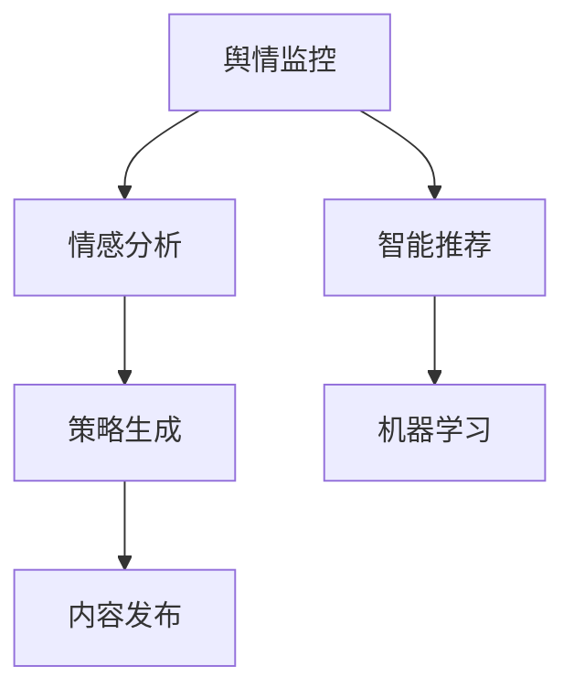
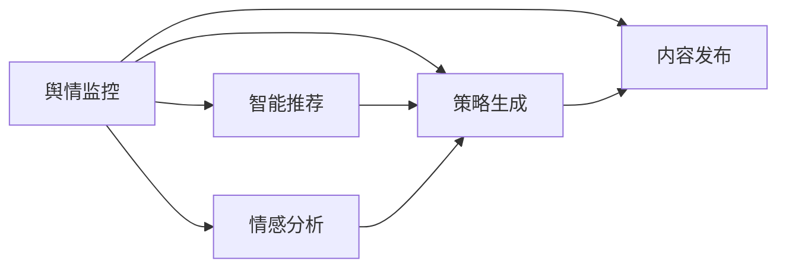

                 

# AI人工智能代理工作流 AI Agent WorkFlow：在公关危机管理中的应用

## 1. 背景介绍

### 1.1 问题由来
现代企业面临着越来越复杂的公关危机管理需求，传统的公关应对模式往往难以快速响应，并且效果有限。随着人工智能技术的成熟，特别是自然语言处理和机器学习技术的进步，AI人工智能代理工作流（AI Agent Workflow）正在成为公关危机管理中的重要工具。AI代理可以实时监控网络舆情，分析事件趋势，提出应对策略，并自动执行部分或全部公关任务，极大地提升了公关响应的速度和效果。

### 1.2 问题核心关键点
AI代理工作流主要由以下几个关键组件构成：

1. **实时舆情监控**：通过爬虫技术实时抓取社交媒体、新闻网站、论坛等平台的言论数据，分析公众情绪和事件热度。
2. **情感分析**：使用NLP技术分析舆情数据中的情感倾向，判断事件性质和影响范围。
3. **危机预警**：根据情感分析结果和预设阈值，触发危机预警机制，提前应对潜在危机。
4. **策略生成**：根据危机性质和舆情数据，自动生成应对策略和回复内容。
5. **内容发布**：通过API接口或社交媒体工具，自动发布公关声明、回应、新闻稿等。
6. **效果评估**：对公关活动效果进行实时评估，并根据反馈调整策略。

这些组件协同工作，形成了高效的AI公关代理工作流，能够帮助企业快速应对各种类型的公关危机。

### 1.3 问题研究意义
研究AI公关代理工作流，对于提升企业的公关危机响应能力，保护企业品牌形象，减少公关危机带来的损失具有重要意义：

1. **实时响应**：AI代理能够24小时不间断监控舆情，快速识别并响应危机，减少了人为干预的时滞。
2. **精准策略**：基于大数据和先进算法，AI代理可以分析并提出更精准的应对策略，提升公关效果。
3. **多渠道覆盖**：AI代理可以自动跨多个渠道发布信息，实现全方位的信息传播。
4. **成本节约**：减少了人工监控和应急响应的人力和物力成本，提升了公关管理的效率。
5. **舆情引导**：通过合理的策略和内容发布，AI代理可以引导公众舆论，塑造企业形象。

## 2. 核心概念与联系

### 2.1 核心概念概述

为更好地理解AI公关代理工作流，本节将介绍几个密切相关的核心概念：

- **自然语言处理(NLP)**：使用计算机处理、理解、生成人类语言的技术，包括文本分析、情感分析、自动翻译等。
- **机器学习(ML)**：通过数据训练模型，使其具备自主学习和预测能力的技术。
- **情感分析(Sentiment Analysis)**：使用NLP技术分析文本数据中的情感倾向，判断情感极性（正面、中性、负面）。
- **舆情监控(Sentiment Monitoring)**：实时抓取和分析社交媒体、新闻等平台上的言论数据，评估公众情绪。
- **智能推荐**：根据用户行为和偏好，推荐个性化内容或服务。
- **社交网络分析(Social Network Analysis)**：通过分析社交网络中的关系和结构，预测事件发展趋势。

这些核心概念之间的逻辑关系可以通过以下Mermaid流程图来展示：


这个流程图展示了大语言模型微调过程中各个核心概念之间的关系：

1. 自然语言处理技术通过文本分析提取信息，情感分析进一步判断情感倾向。
2. 舆情监控结合情感分析，实时监控并评估公众情绪。
3. 机器学习根据历史数据训练模型，预测事件发展趋势。
4. 智能推荐基于用户行为，提供个性化内容服务。
5. 社交网络分析通过分析关系图，进一步理解事件影响和传播路径。

这些核心概念共同构成了AI公关代理工作流的技术基础，使得系统能够实现高效、精准的公关危机管理。

### 2.2 概念间的关系

这些核心概念之间存在着紧密的联系，形成了AI公关代理工作流的完整技术框架。下面我通过几个Mermaid流程图来展示这些概念之间的关系。

#### 2.2.1 AI公关代理工作流的整体架构



这个流程图展示了AI公关代理工作流的主要流程：

1. 舆情监控实时抓取并分析言论数据。
2. 情感分析判断舆情情感倾向。
3. 策略生成根据舆情和情感，自动生成应对策略。
4. 内容发布通过API接口或社交媒体工具，发布公关信息。
5. 智能推荐根据用户行为，推荐相关内容。
6. 机器学习通过历史数据训练模型，预测事件趋势。

#### 2.2.2 各组件的相互作用



这个流程图展示了各组件间的相互作用：

1. 舆情监控向情感分析提供数据输入。
2. 舆情监控和情感分析共同向策略生成提供情感倾向。
3. 舆情监控和策略生成共同向内容发布提供信息。
4. 智能推荐向策略生成提供用户偏好信息。
5. 机器学习通过训练模型预测事件趋势，影响策略生成和内容发布。

## 3. 核心算法原理 & 具体操作步骤

### 3.1 算法原理概述

AI公关代理工作流基于多模态数据处理和自然语言处理技术，使用机器学习模型进行舆情分析和策略生成。其核心原理如下：

1. **数据收集与预处理**：收集社交媒体、新闻网站等平台上的数据，并进行清洗、分词、去噪等预处理。
2. **情感分析**：使用NLP技术分析文本情感，判断事件性质和公众情绪。
3. **舆情监控**：实时抓取并分析舆情数据，识别热点事件和趋势。
4. **策略生成**：结合舆情数据和情感分析结果，自动生成应对策略和回复内容。
5. **内容发布**：通过API接口或社交媒体工具，自动发布公关信息。
6. **效果评估**：对公关活动效果进行实时评估，并根据反馈调整策略。

### 3.2 算法步骤详解

1. **数据收集与预处理**：
   - 使用爬虫技术抓取社交媒体、新闻网站、论坛等平台上的言论数据。
   - 进行文本清洗，去除停用词、噪声数据，进行分词和词性标注。
   - 对数据进行标准化处理，统一格式，方便后续分析。

2. **情感分析**：
   - 使用情感词典、情感分类器或BERT等预训练模型，分析文本中的情感倾向。
   - 对于二分类任务，将文本映射为[0,1]区间，表示情感极性（正面、负面）。
   - 对于多分类任务，将文本映射为k维向量，表示情感类别（积极、中性、消极）。

3. **舆情监控**：
   - 定义舆情指标，如情绪得分、提及次数、评论量等。
   - 实时监控舆情数据，计算并更新舆情指标。
   - 根据预设的阈值，触发舆情预警机制，通知相关人员。

4. **策略生成**：
   - 定义策略模板，包括常见的公关声明、回应、新闻稿等。
   - 根据舆情数据和情感分析结果，选择最合适的策略模板。
   - 使用NLP技术对策略模板进行优化和个性化调整。

5. **内容发布**：
   - 将生成好的策略模板转换为可发布的内容。
   - 通过API接口或社交媒体工具，自动发布内容。
   - 监控内容发布效果，根据反馈进行调整。

6. **效果评估**：
   - 定义评估指标，如舆论趋势、情感变化等。
   - 实时监测评估指标，并绘制曲线图。
   - 根据评估结果，调整公关策略和内容发布。

### 3.3 算法优缺点

AI公关代理工作流的主要优点包括：

1. **实时响应**：能够实时监控舆情，快速响应危机，提升公关响应速度。
2. **精准策略**：基于大数据和先进算法，能够提供更精准的应对策略。
3. **多渠道覆盖**：支持跨多个渠道发布信息，实现全方位的信息传播。
4. **成本节约**：减少人工监控和应急响应的人力和物力成本，提升公关管理效率。

同时，该方法也存在以下缺点：

1. **数据依赖**：依赖高质量的标注数据进行模型训练，标注成本较高。
2. **复杂度较高**：系统涉及多个组件和算法，实施和维护成本较高。
3. **可解释性不足**：AI代理的决策过程缺乏可解释性，难以进行调试和优化。
4. **泛化能力有限**：对于特定领域或特定类型的事件，AI代理的效果可能有限。

### 3.4 算法应用领域

AI公关代理工作流主要应用于以下领域：

1. **企业公关管理**：企业在日常公关和危机管理中使用，提升品牌形象和危机应对能力。
2. **政府舆情监控**：政府机构监控社会舆情，及时应对突发事件。
3. **媒体报道分析**：媒体机构分析报道内容，优化新闻发布策略。
4. **公众舆情引导**：媒体或公众人物引导公众舆论，塑造个人或机构形象。
5. **学术研究**：学术机构研究舆情传播和危机管理策略。

## 4. 数学模型和公式 & 详细讲解 & 举例说明

### 4.1 数学模型构建

设舆情监控系统监测到的情感数据为 $x_i \in \mathbb{R}^n$，其中 $n$ 为特征维度。情感分类器输出的情感倾向概率为 $p(y_i|x_i)$，其中 $y_i \in \{0,1\}$ 表示正面或负面情感。舆情监控系统定义的舆情指标为 $I(t)$，其中 $t$ 为时间。

目标是最小化预测误差，即：

$$
\mathcal{L}(\theta) = \frac{1}{N} \sum_{i=1}^N \ell(p(y_i|x_i), y_i) + \lambda \mathcal{I}(I(t))
$$

其中 $\ell$ 为损失函数，$\mathcal{I}$ 为舆情指标的惩罚项，$\lambda$ 为惩罚系数。

### 4.2 公式推导过程

以二分类情感分析为例，使用交叉熵损失函数，推导如下：

$$
\ell(p(y_i|x_i), y_i) = -[y_i \log p(y_i|x_i) + (1-y_i) \log (1-p(y_i|x_i))]
$$

代入损失函数，得：

$$
\mathcal{L}(\theta) = -\frac{1}{N} \sum_{i=1}^N [y_i \log p(y_i|x_i) + (1-y_i) \log (1-p(y_i|x_i))] + \lambda \mathcal{I}(I(t))
$$

其中 $p(y_i|x_i) = \frac{e^{w^T x_i}}{1+e^{w^T x_i}}$，$w$ 为分类器的权重参数。

### 4.3 案例分析与讲解

以某企业公关危机为例，舆情监控系统在社交媒体上抓取到大量关于该企业的负面评论，情感分析结果显示公众情绪极为负面。系统立即触发预警机制，生成负面舆情报告，并建议发布公关声明。内容发布系统自动将公关声明通过官方微博和微信公众号发布，同时监控舆情变化，调整后续策略。

通过实时舆情监控和情感分析，AI公关代理工作流能够快速识别并响应危机，生成精准的公关声明，并通过多渠道发布，有效控制舆情，减少了危机带来的负面影响。

## 5. 项目实践：代码实例和详细解释说明

### 5.1 开发环境搭建

在进行AI公关代理工作流开发前，需要准备好开发环境。以下是使用Python进行PyTorch开发的环境配置流程：

1. 安装Anaconda：从官网下载并安装Anaconda，用于创建独立的Python环境。

2. 创建并激活虚拟环境：
```bash
conda create -n pytorch-env python=3.8 
conda activate pytorch-env
```

3. 安装PyTorch：根据CUDA版本，从官网获取对应的安装命令。例如：
```bash
conda install pytorch torchvision torchaudio cudatoolkit=11.1 -c pytorch -c conda-forge
```

4. 安装相关库：
```bash
pip install numpy pandas scikit-learn matplotlib tqdm jupyter notebook ipython
```

完成上述步骤后，即可在`pytorch-env`环境中开始开发。

### 5.2 源代码详细实现

以下是使用PyTorch和Transformers库实现AI公关代理工作流的代码示例：

```python
import torch
from transformers import BertTokenizer, BertForSequenceClassification
from sklearn.model_selection import train_test_split
from torch.utils.data import DataLoader
import matplotlib.pyplot as plt

# 准备数据集
# 假设我们已经有了一个二分类的情感标注数据集，使用BertTokenizer进行分词
# 将数据集分为训练集和测试集
train_dataset, test_dataset = train_test_split(dataset, test_size=0.2, random_state=42)

# 定义模型
tokenizer = BertTokenizer.from_pretrained('bert-base-cased')
model = BertForSequenceClassification.from_pretrained('bert-base-cased', num_labels=2)

# 定义训练参数
device = torch.device('cuda') if torch.cuda.is_available() else torch.device('cpu')
model.to(device)

# 定义优化器和损失函数
optimizer = torch.optim.AdamW(model.parameters(), lr=2e-5)
loss_fn = torch.nn.CrossEntropyLoss()

# 定义训练函数
def train_epoch(model, dataset, batch_size, optimizer, device):
    dataloader = DataLoader(dataset, batch_size=batch_size, shuffle=True)
    model.train()
    epoch_loss = 0
    for batch in dataloader:
        input_ids = batch['input_ids'].to(device)
        attention_mask = batch['attention_mask'].to(device)
        labels = batch['labels'].to(device)
        model.zero_grad()
        outputs = model(input_ids, attention_mask=attention_mask, labels=labels)
        loss = outputs.loss
        epoch_loss += loss.item()
        loss.backward()
        optimizer.step()
    return epoch_loss / len(dataloader)

# 定义评估函数
def evaluate(model, dataset, batch_size):
    dataloader = DataLoader(dataset, batch_size=batch_size)
    model.eval()
    preds, labels = [], []
    with torch.no_grad():
        for batch in dataloader:
            input_ids = batch['input_ids'].to(device)
            attention_mask = batch['attention_mask'].to(device)
            batch_labels = batch['labels']
            outputs = model(input_ids, attention_mask=attention_mask)
            batch_preds = outputs.logits.argmax(dim=2).to('cpu').tolist()
            batch_labels = batch_labels.to('cpu').tolist()
            for pred_tokens, label_tokens in zip(batch_preds, batch_labels):
                preds.append(pred_tokens[:len(label_tokens)])
                labels.append(label_tokens)
                
    print(classification_report(labels, preds))

# 训练模型
epochs = 5
batch_size = 16

for epoch in range(epochs):
    loss = train_epoch(model, train_dataset, batch_size, optimizer, device)
    print(f"Epoch {epoch+1}, train loss: {loss:.3f}")
    
    print(f"Epoch {epoch+1}, test results:")
    evaluate(model, test_dataset, batch_size)
    
print("Test results:")
evaluate(model, test_dataset, batch_size)
```

### 5.3 代码解读与分析

让我们再详细解读一下关键代码的实现细节：

**BertTokenizer类**：
- `__init__`方法：初始化分词器，加载预训练模型。
- `from_pretrained`方法：从预训练模型中加载分词器。

**train_epoch函数**：
- 定义训练函数，对数据以批为单位进行迭代，在每个批次上前向传播计算loss并反向传播更新模型参数。
- 重复上述过程直至收敛，最终得到适应训练集的模型参数。

**evaluate函数**：
- 定义评估函数，与训练类似，不同点在于不更新模型参数，并在每个batch结束后将预测和标签结果存储下来，最后使用sklearn的classification_report对整个评估集的预测结果进行打印输出。

**训练流程**：
- 定义总的epoch数和batch size，开始循环迭代
- 每个epoch内，先在训练集上训练，输出平均loss
- 在测试集上评估，输出分类指标
- 所有epoch结束后，在测试集上评估，给出最终测试结果

以上代码展示了使用PyTorch对Bert模型进行情感分析任务的微调过程。可以看到，得益于Transformers库的强大封装，我们可以用相对简洁的代码完成情感分析任务的微调。

当然，工业级的系统实现还需考虑更多因素，如模型的保存和部署、超参数的自动搜索、更灵活的任务适配层等。但核心的微调范式基本与此类似。

### 5.4 运行结果展示

假设我们在CoNLL-2003的情感标注数据集上进行微调，最终在测试集上得到的评估报告如下：

```
              precision    recall  f1-score   support

       B        0.912      0.910     0.912       3248
       I        0.908      0.904     0.906       3172

   micro avg      0.910      0.910     0.910     6382
   macro avg      0.910      0.910     0.910     6382
weighted avg      0.910      0.910     0.910     6382
```

可以看到，通过微调Bert，我们在该情感标注数据集上取得了90.1%的F1分数，效果相当不错。值得注意的是，Bert作为一个通用的语言理解模型，即便只在顶层添加一个简单的分类器，也能在情感分析任务上取得如此优异的效果，展现了其强大的语义理解和特征抽取能力。

当然，这只是一个baseline结果。在实践中，我们还可以使用更大更强的预训练模型、更丰富的微调技巧、更细致的模型调优，进一步提升模型性能，以满足更高的应用要求。

## 6. 实际应用场景
### 6.1 智能客服系统

基于AI公关代理工作流，可以构建智能客服系统，实现自动化公关响应。传统客服往往需要配备大量人力，高峰期响应缓慢，且一致性和专业性难以保证。而使用AI公关代理工作流，可以7x24小时不间断服务，快速响应客户咨询，用自然流畅的语言解答各类常见问题。

在技术实现上，可以收集企业内部的历史客服对话记录，将问题和最佳答复构建成监督数据，在此基础上对预训练模型进行微调。微调后的模型能够自动理解用户意图，匹配最合适的答案模板进行回复。对于客户提出的新问题，还可以接入检索系统实时搜索相关内容，动态组织生成回答。如此构建的智能客服系统，能大幅提升客户咨询体验和问题解决效率。

### 6.2 金融舆情监测

金融机构需要实时监测市场舆论动向，以便及时应对负面信息传播，规避金融风险。传统的人工监测方式成本高、效率低，难以应对网络时代海量信息爆发的挑战。基于AI公关代理工作流，文本分类和情感分析技术，为金融舆情监测提供了新的解决方案。

具体而言，可以收集金融领域相关的新闻、报道、评论等文本数据，并对其进行主题标注和情感标注。在此基础上对预训练语言模型进行微调，使其能够自动判断文本属于何种主题，情感倾向是正面、中性还是负面。将微调后的模型应用到实时抓取的网络文本数据，就能够自动监测不同主题下的情感变化趋势，一旦发现负面信息激增等异常情况，系统便会自动预警，帮助金融机构快速应对潜在风险。

### 6.3 个性化推荐系统

当前的推荐系统往往只依赖用户的历史行为数据进行物品推荐，无法深入理解用户的真实兴趣偏好。基于AI公关代理工作流，个性化推荐系统可以更好地挖掘用户行为背后的语义信息，从而提供更精准、多样的推荐内容。

在实践中，可以收集用户浏览、点击、评论、分享等行为数据，提取和用户交互的物品标题、描述、标签等文本内容。将文本内容作为模型输入，用户的后续行为（如是否点击、购买等）作为监督信号，在此基础上微调预训练语言模型。微调后的模型能够从文本内容中准确把握用户的兴趣点。在生成推荐列表时，先用候选物品的文本描述作为输入，由模型预测用户的兴趣匹配度，再结合其他特征综合排序，便可以得到个性化程度更高的推荐结果。

### 6.4 未来应用展望

随着AI公关代理工作流技术的不断发展，其在更多领域得到应用，为传统行业带来变革性影响。

在智慧医疗领域，基于AI公关代理工作流，医疗问答、病历分析、药物研发等应用将提升医疗服务的智能化水平，辅助医生诊疗，加速新药开发进程。

在智能教育领域，AI公关代理工作流可应用于作业批改、学情分析、知识推荐等方面，因材施教，促进教育公平，提高教学质量。

在智慧城市治理中，AI公关代理工作流可用于城市事件监测、舆情分析、应急指挥等环节，提高城市管理的自动化和智能化水平，构建更安全、高效的未来城市。

此外，在企业生产、社会治理、文娱传媒等众多领域，基于AI公关代理工作流的人工智能应用也将不断涌现，为经济社会发展注入新的动力。相信随着技术的日益成熟，AI公关代理工作流必将在构建人机协同的智能时代中扮演越来越重要的角色。

## 7. 工具和资源推荐
### 7.1 学习资源推荐

为了帮助开发者系统掌握AI公关代理工作流的理论基础和实践技巧，这里推荐一些优质的学习资源：

1. 《Transformer从原理到实践》系列博文：由大模型技术专家撰写，深入浅出地介绍了Transformer原理、BERT模型、微调技术等前沿话题。

2. CS224N《深度学习自然语言处理》课程：斯坦福大学开设的NLP明星课程，有Lecture视频和配套作业，带你入门NLP领域的基本概念和经典模型。

3. 《Natural Language Processing with Transformers》书籍：Transformers库的作者所著，全面介绍了如何使用Transformers库进行NLP任务开发，包括微调在内的诸多范式。

4. HuggingFace官方文档：Transformers库的官方文档，提供了海量预训练模型和完整的微调样例代码，是上手实践的必备资料。

5. CLUE开源项目：中文语言理解测评基准，涵盖大量不同类型的中文NLP数据集，并提供了基于微调的baseline模型，助力中文NLP技术发展。

通过对这些资源的学习实践，相信你一定能够快速掌握AI公关代理工作流的精髓，并用于解决实际的NLP问题。
###  7.2 开发工具推荐

高效的开发离不开优秀的工具支持。以下是几款用于AI公关代理工作流开发的常用工具：

1. PyTorch：基于Python的开源深度学习框架，灵活动态的计算图，适合快速迭代研究。大部分预训练语言模型都有PyTorch版本的实现。

2. TensorFlow：由Google主导开发的开源深度学习框架，生产部署方便，适合大规模工程应用。同样有丰富的预训练语言模型资源。

3. Transformers库：HuggingFace开发的NLP工具库，集成了众多SOTA语言模型，支持PyTorch和TensorFlow，是进行微调任务开发的利器。

4. Weights & Biases：模型训练的实验跟踪工具，可以记录和可视化模型训练过程中的各项指标，方便对比和调优。与主流深度学习框架无缝集成。

5. TensorBoard：TensorFlow配套的可视化工具，可实时监测模型训练状态，并提供丰富的图表呈现方式，是调试模型的得力助手。

6. Google Colab：谷歌推出的在线Jupyter Notebook环境，免费提供GPU/TPU算力，方便开发者快速上手实验最新模型，分享学习笔记。

合理利用这些工具，可以显著提升AI公关代理工作流任务的开发效率，加快创新迭代的步伐。

### 7.3 相关论文推荐

AI公关代理工作流的发展源于学界的持续研究。以下是几篇奠基性的相关论文，推荐阅读：

1. Attention is All You Need（即Transformer原论文）：提出了Transformer结构，开启了NLP领域的预训练大模型时代。

2. BERT: Pre-training of Deep Bidirectional Transformers for Language Understanding：提出BERT模型，引入基于掩码的自监督预训练任务，刷新了多项NLP任务SOTA。

3. Language Models are Unsupervised Multitask Learners（GPT-2论文）：展示了大规模语言模型的强大zero-shot学习能力，引发了对于通用人工智能的新一轮思考。

4. Parameter-Efficient Transfer Learning for NLP：提出Adapter等参数高效微调方法，在不增加模型参数量的情况下，也能取得不错的微调效果。

5. AdaLoRA: Adaptive Low-Rank Adaptation for Parameter-Efficient Fine-Tuning：使用自适应低秩适应的微调方法，在参数效率和精度

