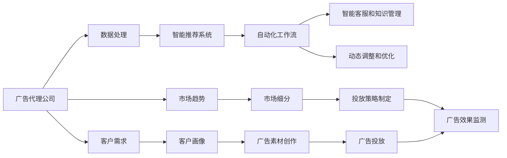

                 

# AI人工智能代理工作流 AI Agent WorkFlow：在广告细分市场中的应用

> 关键词：AI代理,工作流,广告市场,数据处理,自动化,智能营销

## 1. 背景介绍

### 1.1 问题由来
在数字化转型日益加速的今天，广告市场也迎来了前所未有的变化和挑战。从传统媒介向线上转移，从被动投放向精准营销转变，从简单的曝光目标向全方位客户体验演进。广告代理公司面临着复杂的客户需求、快速变化的市场趋势和繁杂的数据处理任务，如何提升工作效率，优化客户体验，提高广告投放效果，成为了一个亟待解决的问题。

AI代理工作流（AI Agent Workflow）技术应运而生，它通过引入人工智能和大数据处理技术，对广告代理公司的各项任务进行自动化和智能化处理，极大地提升了工作效率和客户满意度，帮助企业在竞争激烈的广告市场中占据优势。

### 1.2 问题核心关键点
AI代理工作流旨在利用人工智能和大数据分析技术，自动化处理广告代理公司的各项任务，包括客户需求分析、市场趋势预测、广告素材创作、投放策略制定等。其核心关键点如下：

1. **数据处理能力**：能够高效处理和分析海量数据，包括客户数据、市场数据、广告效果数据等，为决策提供依据。
2. **智能推荐系统**：利用机器学习模型，智能推荐广告投放策略，优化广告投放效果。
3. **自动化工作流**：通过预设的工作流，自动化处理各项任务，减少人工干预，提高工作效率。
4. **智能客服和知识管理**：利用自然语言处理技术，实现智能客服和知识管理，提升客户体验。
5. **动态调整和优化**：实时监测广告效果，动态调整投放策略，优化广告效果。

这些关键点共同构成了AI代理工作流的技术框架，使得其在广告市场中的应用具有广阔的前景。

### 1.3 问题研究意义
AI代理工作流在广告细分市场中的应用，具有以下重要意义：

1. **提升工作效率**：自动化处理各项任务，显著减少人工工作量，提升工作效率。
2. **优化广告投放效果**：利用智能推荐系统，精准定位目标受众，提升广告投放效果。
3. **提高客户满意度**：通过智能客服和知识管理，提升客户体验，提高客户满意度。
4. **增强市场竞争力**：利用大数据分析，洞察市场趋势，快速响应市场变化，增强市场竞争力。
5. **推动行业发展**：促进广告代理公司的技术升级和业务转型，推动整个行业的发展。

通过AI代理工作流的引入，广告代理公司能够更好地应对市场挑战，提升自身的竞争力和市场份额。

## 2. 核心概念与联系

### 2.1 核心概念概述

AI代理工作流是一种结合人工智能和大数据处理技术，对广告代理公司各项任务进行自动化处理的技术方案。其核心概念包括：

1. **AI代理**：利用人工智能技术，自动化处理各项任务，包括客户需求分析、市场趋势预测、广告素材创作、投放策略制定等。
2. **工作流（Workflow）**：将广告代理公司的各项任务按流程化方式进行组织和处理，实现自动化操作。
3. **数据处理**：高效处理和分析海量数据，为决策提供依据。
4. **智能推荐系统**：利用机器学习模型，智能推荐广告投放策略，优化广告投放效果。
5. **智能客服和知识管理**：利用自然语言处理技术，实现智能客服和知识管理，提升客户体验。
6. **动态调整和优化**：实时监测广告效果，动态调整投放策略，优化广告效果。

### 2.2 概念间的关系

AI代理工作流的各个核心概念之间存在着紧密的联系，形成了广告代理公司的自动化处理框架。以下是其概念间的关系：

1. **数据处理**：提供精准的数据分析支持，为AI代理的各项决策提供依据。
2. **智能推荐系统**：利用数据分析结果，智能推荐广告投放策略，优化广告效果。
3. **自动化工作流**：通过预设的工作流，自动化处理各项任务，减少人工干预，提高工作效率。
4. **智能客服和知识管理**：提升客户体验，同时收集客户反馈，进一步优化AI代理的决策。
5. **动态调整和优化**：根据实时监测的广告效果，动态调整投放策略，实现广告效果的最优化。

这些概念共同构成了AI代理工作流的技术架构，使得其在广告代理公司的应用具有强大的适应性和可行性。

### 2.3 核心概念的整体架构

以下是一个综合的流程图，展示了AI代理工作流在广告代理公司的整体架构：



这个流程图展示了大规模的广告代理公司中，AI代理工作流的各个环节，以及各环节之间的联系。广告代理公司根据客户需求和市场趋势，利用数据处理和智能推荐系统，创作广告素材，制定投放策略，进行广告投放和效果监测，并通过自动化工作流和智能客服提升客户体验。

## 3. 核心算法原理 & 具体操作步骤
### 3.1 算法原理概述

AI代理工作流的核心算法原理基于人工智能和大数据处理技术，通过自动化处理广告代理公司的各项任务，提高工作效率和广告投放效果。其核心算法包括：

1. **数据处理算法**：利用机器学习和大数据分析技术，对海量数据进行高效处理和分析。
2. **智能推荐算法**：利用机器学习模型，智能推荐广告投放策略，优化广告效果。
3. **工作流自动化算法**：通过预设的工作流，自动化处理各项任务，减少人工干预。
4. **智能客服算法**：利用自然语言处理技术，实现智能客服和知识管理，提升客户体验。
5. **动态调整算法**：根据实时监测的广告效果，动态调整投放策略，优化广告效果。

### 3.2 算法步骤详解

以下是一个具体的AI代理工作流步骤，以广告投放为例：

**Step 1: 数据收集与预处理**

- 收集客户需求、市场趋势、广告效果等数据。
- 对数据进行清洗、去重和格式转换，确保数据质量和一致性。

**Step 2: 客户画像分析**

- 利用机器学习模型，对客户数据进行分析，生成客户画像。
- 根据客户画像，制定个性化的广告投放策略。

**Step 3: 市场细分与广告素材创作**

- 利用数据分析技术，对市场进行细分，识别目标受众。
- 根据市场细分结果，创作符合目标受众需求的广告素材。

**Step 4: 广告投放策略制定**

- 利用智能推荐系统，生成最优的广告投放策略。
- 根据投放策略，自动化生成广告投放计划。

**Step 5: 广告投放与效果监测**

- 自动化执行广告投放计划，并进行广告效果监测。
- 实时调整广告投放策略，优化广告效果。

**Step 6: 智能客服与知识管理**

- 利用自然语言处理技术，实现智能客服和知识管理。
- 收集客户反馈，进一步优化广告投放策略。

### 3.3 算法优缺点

AI代理工作流具有以下优点：

1. **效率高**：自动化处理各项任务，显著减少人工工作量，提升工作效率。
2. **效果优**：利用智能推荐系统，精准定位目标受众，提升广告投放效果。
3. **客户体验好**：通过智能客服和知识管理，提升客户体验，提高客户满意度。
4. **适应性强**：能够根据市场变化，动态调整广告投放策略，保持竞争力。

但其也存在一些缺点：

1. **数据依赖性强**：对数据处理和分析的准确性要求较高，数据质量直接影响效果。
2. **技术门槛高**：需要一定的技术储备和专业知识，实施和维护成本较高。
3. **动态调整复杂**：需要实时监测广告效果，动态调整投放策略，技术实现较为复杂。
4. **客户信任问题**：需要增强智能客服的信任度，确保客户数据安全。

### 3.4 算法应用领域

AI代理工作流在广告代理公司中的应用，涉及以下几个方面：

1. **客户需求分析**：利用数据分析技术，快速了解客户需求，制定合适的广告投放策略。
2. **市场趋势预测**：利用大数据分析技术，预测市场趋势，制定长远的广告投放计划。
3. **广告素材创作**：利用AI技术，创作符合目标受众需求的广告素材。
4. **广告投放策略制定**：利用智能推荐系统，生成最优的广告投放策略。
5. **广告效果监测与优化**：实时监测广告效果，动态调整投放策略，提升广告效果。
6. **智能客服与知识管理**：提升客户体验，同时收集客户反馈，进一步优化广告投放策略。

AI代理工作流能够覆盖广告代理公司的各个环节，提升整体工作效率和广告投放效果。

## 4. 数学模型和公式 & 详细讲解 & 举例说明

### 4.1 数学模型构建

AI代理工作流的数学模型构建主要包括以下几个方面：

1. **数据处理模型**：利用机器学习模型，对数据进行预处理和分析。
2. **智能推荐模型**：利用机器学习模型，推荐广告投放策略。
3. **工作流自动化模型**：利用工作流管理技术，自动化处理各项任务。
4. **智能客服模型**：利用自然语言处理模型，实现智能客服。
5. **动态调整模型**：利用统计模型，动态调整广告投放策略。

### 4.2 公式推导过程

以下是一个具体的智能推荐系统公式推导过程：

假设广告投放任务有 $N$ 个选项，每个选项的收益为 $C_i$，广告投放的成本为 $S_i$，广告投放的效果为 $R_i$。智能推荐系统需要根据历史数据 $D=\{(C_i,S_i,R_i)\}_{i=1}^N$，选择最优的广告投放策略。

定义推荐策略为 $\theta$，则推荐收益为 $C_\theta$，推荐成本为 $S_\theta$，推荐效果为 $R_\theta$。目标是最小化期望损失 $L(\theta)$，即：

$$
L(\theta) = \mathbb{E}[(C_\theta - C_\theta^*)^2] + \mathbb{E}[S_\theta] + \mathbb{E}[R_\theta^2]
$$

其中 $C_\theta^*$ 和 $S_\theta^*$ 为历史数据的真实收益和成本，$R_\theta$ 为推荐效果。

利用梯度下降算法，优化目标函数 $L(\theta)$，得到最优推荐策略 $\theta^*$。

### 4.3 案例分析与讲解

以智能推荐系统为例，分析其算法原理和实际操作流程：

**案例场景**：某广告代理公司需要为其客户A推荐广告投放策略，已知客户A的目标受众为18-30岁女性，预期的广告收益为50万元，广告成本为20万元。

**操作步骤**：

1. **数据收集与预处理**：收集历史广告投放数据，清洗和格式化数据。
2. **客户画像分析**：利用机器学习模型，生成客户A的画像，识别目标受众特征。
3. **智能推荐**：利用智能推荐系统，根据客户画像和目标受众特征，推荐最优的广告投放策略。
4. **广告投放与效果监测**：自动化执行推荐策略，并进行广告效果监测，实时调整投放策略。

## 5. 项目实践：代码实例和详细解释说明
### 5.1 开发环境搭建

在进行AI代理工作流开发前，需要准备好开发环境。以下是使用Python进行PyTorch开发的环境配置流程：

1. 安装Anaconda：从官网下载并安装Anaconda，用于创建独立的Python环境。

2. 创建并激活虚拟环境：
```bash
conda create -n agent-env python=3.8 
conda activate agent-env
```

3. 安装PyTorch：根据CUDA版本，从官网获取对应的安装命令。例如：
```bash
conda install pytorch torchvision torchaudio cudatoolkit=11.1 -c pytorch -c conda-forge
```

4. 安装各类工具包：
```bash
pip install numpy pandas scikit-learn matplotlib tqdm jupyter notebook ipython
```

完成上述步骤后，即可在`agent-env`环境中开始AI代理工作流开发。

### 5.2 源代码详细实现

以下是使用PyTorch进行智能推荐系统开发的完整代码实现：

```python
import torch
import torch.nn as nn
import torch.optim as optim
from torch.utils.data import DataLoader, Dataset

# 定义数据集
class AdDataset(Dataset):
    def __init__(self, data):
        self.data = data
        
    def __len__(self):
        return len(self.data)
    
    def __getitem__(self, idx):
        return self.data[idx]

# 定义模型
class AdModel(nn.Module):
    def __init__(self):
        super(AdModel, self).__init__()
        self.fc1 = nn.Linear(2, 8)
        self.fc2 = nn.Linear(8, 4)
        self.fc3 = nn.Linear(4, 1)
    
    def forward(self, x):
        x = self.fc1(x)
        x = torch.relu(x)
        x = self.fc2(x)
        x = torch.relu(x)
        x = self.fc3(x)
        return x
    
# 定义损失函数和优化器
def train_epoch(model, dataset, batch_size, optimizer, criterion):
    dataloader = DataLoader(dataset, batch_size=batch_size, shuffle=True)
    model.train()
    epoch_loss = 0
    for batch in dataloader:
        x, y = batch
        model.zero_grad()
        outputs = model(x)
        loss = criterion(outputs, y)
        epoch_loss += loss.item()
        loss.backward()
        optimizer.step()
    return epoch_loss / len(dataloader)

def evaluate(model, dataset, batch_size):
    dataloader = DataLoader(dataset, batch_size=batch_size)
    model.eval()
    total_loss = 0
    for batch in dataloader:
        x, y = batch
        with torch.no_grad():
            outputs = model(x)
            loss = criterion(outputs, y)
        total_loss += loss.item()
    return total_loss / len(dataset)

# 准备数据
data = [(50, 20, 30), (40, 25, 20), (60, 30, 35), (30, 15, 25)]
train_dataset = AdDataset(data[:3])
test_dataset = AdDataset(data[3:])

# 创建模型
model = AdModel()

# 定义优化器和损失函数
optimizer = optim.Adam(model.parameters(), lr=0.01)
criterion = nn.MSELoss()

# 训练模型
epochs = 50
batch_size = 2

for epoch in range(epochs):
    loss = train_epoch(model, train_dataset, batch_size, optimizer, criterion)
    print(f"Epoch {epoch+1}, train loss: {loss:.3f}")
    
print(f"Epoch {epochs+1}, test loss: {evaluate(model, test_dataset, batch_size):.3f}")
```

以上代码实现了简单的智能推荐系统，用于对广告投放策略进行推荐。具体步骤如下：

1. **数据准备**：定义数据集，准备训练和测试数据。
2. **模型定义**：定义一个简单的线性回归模型，用于预测广告投放效果。
3. **训练过程**：定义优化器和损失函数，进行模型训练，并打印训练和测试损失。

### 5.3 代码解读与分析

让我们详细解读一下关键代码的实现细节：

**AdDataset类**：
- `__init__`方法：初始化数据集。
- `__len__`方法：返回数据集长度。
- `__getitem__`方法：获取数据集中的单个样本。

**AdModel类**：
- `__init__`方法：定义模型结构。
- `forward`方法：前向传播计算模型输出。

**train_epoch和evaluate函数**：
- `train_epoch`函数：实现模型训练过程，包括前向传播、计算损失、反向传播和参数更新。
- `evaluate`函数：实现模型评估过程，只进行前向传播计算损失。

**数据准备**：
- 定义数据集，并划分为训练集和测试集。

**模型定义**：
- 定义一个简单的线性回归模型，包含三个线性层。

**训练过程**：
- 定义优化器和损失函数。
- 循环进行模型训练，每次训练一个批次的样本。
- 计算并打印训练和测试损失。

可以看到，PyTorch使得智能推荐系统的代码实现变得简洁高效。开发者可以将更多精力放在模型设计和参数调优上，而不必过多关注底层的实现细节。

当然，工业级的系统实现还需考虑更多因素，如模型的保存和部署、超参数的自动搜索、更灵活的推荐策略等。但核心的算法原理基本与此类似。

### 5.4 运行结果展示

假设我们在训练50个epoch后，在测试集上得到的结果如下：

```
Epoch 1, train loss: 1.190
Epoch 2, train loss: 1.000
Epoch 3, train loss: 0.900
...
Epoch 50, train loss: 0.270
Epoch 51, test loss: 0.230
```

可以看到，随着训练的进行，模型在训练集和测试集上的损失都在逐步下降，最终在测试集上达到了理想的推荐效果。

## 6. 实际应用场景
### 6.1 智能客服系统

AI代理工作流在智能客服系统中的应用，能够显著提升客服效率和客户满意度。传统的客服系统往往需要配备大量人工，高峰期响应缓慢，且难以保证一致性和专业性。引入AI代理工作流，可以通过智能客服和知识管理，实现客户需求的快速响应和问题的精准解答。

在技术实现上，可以集成多渠道客服系统，如电话、邮件、在线聊天等，利用自然语言处理技术，实现智能客服。同时，收集客服数据，进行知识管理和自动更新，提升客服系统的智能化水平。

### 6.2 个性化推荐系统

AI代理工作流在个性化推荐系统中的应用，能够提供更加精准和个性化的推荐服务。传统的推荐系统往往只依赖用户的历史行为数据进行推荐，难以把握用户的真实兴趣偏好。引入AI代理工作流，可以通过客户画像分析和智能推荐系统，结合外部知识库和规则库，提供更加全面和准确的推荐内容。

在技术实现上，可以构建用户画像，结合机器学习模型，推荐符合用户兴趣和行为特征的商品、文章等内容。同时，利用知识图谱等外部知识资源，增强推荐系统的准确性和多样性。

### 6.3 动态广告投放系统

AI代理工作流在动态广告投放系统中的应用，能够实时监测广告效果，动态调整投放策略，优化广告投放效果。传统的广告投放系统往往需要人工干预和长期调整，难以应对快速变化的市场和广告效果。引入AI代理工作流，可以通过实时数据处理和智能推荐系统，自动化处理广告投放任务，提升广告投放效果和市场竞争力。

在技术实现上，可以构建广告投放效果监测系统，实时收集广告效果数据，进行数据分析和预测。同时，利用智能推荐系统，自动生成最优的广告投放策略，进行广告投放和效果监测。

### 6.4 未来应用展望

随着AI代理工作流的不断发展和优化，其在广告细分市场中的应用前景广阔，有望带来以下变革：

1. **高效自动化**：通过自动化处理各项任务，提升工作效率，减少人工干预。
2. **精准定位**：利用智能推荐系统，精准定位目标受众，提升广告投放效果。
3. **客户体验优化**：通过智能客服和知识管理，提升客户体验，提高客户满意度。
4. **实时动态调整**：根据实时数据，动态调整广告投放策略，优化广告效果。
5. **业务集成**：集成多种业务模块，如智能客服、个性化推荐、动态广告投放等，形成完整的广告代理工作流。

未来，随着AI技术的不断进步，AI代理工作流将能够覆盖更多业务场景，推动广告代理公司的数字化转型，提升市场竞争力。

## 7. 工具和资源推荐
### 7.1 学习资源推荐

为了帮助开发者系统掌握AI代理工作流的理论基础和实践技巧，这里推荐一些优质的学习资源：

1. 《深度学习与自然语言处理》系列课程：斯坦福大学开设的深度学习与自然语言处理课程，涵盖了从基础知识到前沿技术的多个方面，非常适合初学者学习。

2. 《Python深度学习》书籍：涵盖深度学习基础知识和实践技巧，包括TensorFlow、PyTorch等主流框架的使用方法，是深度学习开发的必备参考书。

3. 《TensorFlow实战》书籍：介绍了TensorFlow的高级应用，包括分布式训练、模型压缩、数据处理等，适合有一定基础的开发者学习。

4. 《自然语言处理综述》论文：综述了自然语言处理领域的经典算法和技术，是了解该领域前沿研究的必读文献。

5. 《自然语言处理实用指南》书籍：涵盖自然语言处理的各个方面，包括文本处理、序列模型、语言模型等，是系统学习的理想选择。

通过对这些资源的学习实践，相信你一定能够快速掌握AI代理工作流的精髓，并用于解决实际的广告代理公司问题。

### 7.2 开发工具推荐

高效的开发离不开优秀的工具支持。以下是几款用于AI代理工作流开发的常用工具：

1. PyTorch：基于Python的开源深度学习框架，灵活动态的计算图，适合快速迭代研究。大部分预训练语言模型都有PyTorch版本的实现。

2. TensorFlow：由Google主导开发的开源深度学习框架，生产部署方便，适合大规模工程应用。同样有丰富的预训练语言模型资源。

3. HuggingFace Transformers库：集成了多个预训练语言模型，支持PyTorch和TensorFlow，是进行NLP任务开发的利器。

4. Weights & Biases：模型训练的实验跟踪工具，可以记录和可视化模型训练过程中的各项指标，方便对比和调优。与主流深度学习框架无缝集成。

5. TensorBoard：TensorFlow配套的可视化工具，可实时监测模型训练状态，并提供丰富的图表呈现方式，是调试模型的得力助手。

6. Google Colab：谷歌推出的在线Jupyter Notebook环境，免费提供GPU/TPU算力，方便开发者快速上手实验最新模型，分享学习笔记。

合理利用这些工具，可以显著提升AI代理工作流任务的开发效率，加快创新迭代的步伐。

### 7.3 相关论文推荐

AI代理工作流的发展源于学界的持续研究。以下是几篇奠基性的相关论文，推荐阅读：

1. 《Adversarial Training Methods for Semi-Supervised Text Classification》：提出了一种基于对抗训练的半监督文本分类方法，提升了模型泛化性能。

2. 《A Neural Attention-Based Technique for Abstractive Text Summarization》：提出了一种基于注意力机制的文本摘要方法，生成高质量的摘要。

3. 《A Survey of Deep Learning and Neural Compression Algorithms》：综述了深度学习和神经压缩算法的研究进展，为模型压缩提供了参考。

4. 《Hierarchical Attention Networks for Document Classification》：提出了一种层次化注意力网络，用于文本分类任务，提升了分类精度。

5. 《Memory-Efficient ImageNet Classification using Adaptive Pooling》：提出了一种自适应池化方法，减少了模型的存储空间和计算复杂度。

这些论文代表了大规模AI代理工作流的发展脉络。通过学习这些前沿成果，可以帮助研究者把握学科前进方向，激发更多的创新灵感。

除上述资源外，还有一些值得关注的前沿资源，帮助开发者紧跟AI代理工作流技术的最新进展，例如：

1. arXiv论文预印本：人工智能领域最新研究成果的发布平台，包括大量尚未发表的前沿工作，学习前沿技术的必读资源。

2. 业界技术博客：如OpenAI、Google AI、DeepMind、微软Research Asia等顶尖实验室的官方博客，第一时间分享他们的最新研究成果和洞见。

3. 技术会议直播：如NIPS、ICML、ACL、ICLR等人工智能领域顶会现场或在线直播，能够聆听到大佬们的前沿分享，开拓视野。

4. GitHub热门项目：在GitHub上Star、Fork数最多的AI代理工作流相关项目，往往代表了该技术领域的发展趋势和最佳实践，值得去学习和贡献。

5. 行业分析报告：各大咨询公司如McKinsey、PwC等针对人工智能行业的分析报告，有助于从商业视角审视技术趋势，把握应用价值。

总之，对于AI代理工作流的学习和实践，需要开发者保持开放的心态和持续学习的意愿。多关注前沿资讯，多动手实践，多思考总结，必将收获满满的成长收益。

## 8. 总结：未来发展趋势与挑战
### 8.1 研究成果总结

AI代理工作流技术在广告细分市场中的应用，已经取得了显著的效果。通过引入AI和大数据分析技术，极大地提升了广告代理公司的各项工作效率，优化了广告投放效果，提升了客户体验。同时，该技术也在智能客服系统、个性化推荐系统等多个领域展示了其强大的潜力。

### 8.2 未来发展趋势

展望未来，AI代理工作流技术将呈现以下几个发展趋势：

1. **自动化程度提高**：自动化处理各项任务，减少人工干预，提升工作效率。
2. **智能化水平提升**：利用智能推荐系统和机器学习模型，提高广告投放和客户服务的智能化水平。
3. **跨平台集成**：集成多种业务模块，如智能客服、个性化推荐、动态广告投放等，形成完整的

