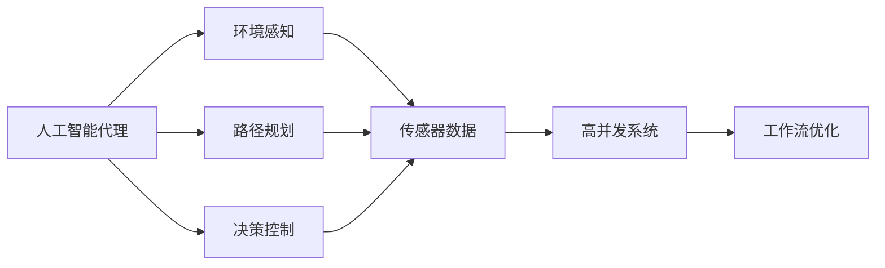

                 

# AI人工智能代理工作流 AI Agent WorkFlow：在无人驾驶中的应用

> 关键词：
1. 人工智能代理
2. 无人驾驶
3. 智能交通系统
4. 工作流优化
5. 高并发系统
6. 智能感知
7. 实时决策

## 1. 背景介绍

### 1.1 问题由来

随着人工智能技术的飞速发展，无人驾驶汽车已成为汽车行业的未来方向之一。无人驾驶系统集成了众多高精尖技术，包括传感器融合、环境感知、路径规划、决策控制等，其核心在于实现高效、安全的智能驾驶。然而，当前无人驾驶系统面临诸多挑战：

1. **数据处理**：无人驾驶系统需要实时处理海量传感器数据，如摄像头、雷达、激光雷达等，以获得精准的环境感知信息。
2. **实时决策**：无人驾驶汽车需要在极短时间内，根据传感器数据进行快速、准确的路径规划和决策控制，以保障行车安全。
3. **系统优化**：无人驾驶系统需要优化各种算法，平衡性能和实时性，确保系统稳定可靠。

针对这些问题，本文将介绍一种基于人工智能代理的工作流优化方法，通过智能调度和管理，提升无人驾驶系统的性能和可靠性。

### 1.2 问题核心关键点

本节将详细阐述无人驾驶系统中，人工智能代理工作流优化所面临的核心问题和关键点：

1. **高并发处理**：无人驾驶系统需要在短时间内处理来自各个传感器的数据流，实现高并发处理。
2. **实时决策优化**：如何在实时环境中，快速、准确地进行路径规划和决策控制，提升无人驾驶系统的安全性。
3. **系统稳定性**：无人驾驶系统需要高度稳定，确保在不同环境和道路条件下的可靠运行。
4. **资源管理**：如何有效管理计算、内存、存储等资源，避免资源争抢和瓶颈问题。
5. **可扩展性**：随着传感器数量的增加和算法的迭代，无人驾驶系统需要具备良好的可扩展性，以支持未来更多功能和服务。

通过深入分析这些关键点，我们可以更好地理解人工智能代理在无人驾驶系统中的应用价值。

## 2. 核心概念与联系

### 2.1 核心概念概述

为深入理解人工智能代理工作流优化的方法，本节将介绍几个关键概念：

1. **人工智能代理(AI Agent)**：指能够自主感知环境、自主决策、自主执行的智能实体，能够自动适应复杂多变的环境，实现高效、智能的任务处理。

2. **工作流**：指一组协同工作的任务，按照一定规则执行，以实现特定的目标或业务流程。

3. **工作流优化**：指通过智能调度、资源管理等手段，优化工作流各个环节的性能，提升系统整体的执行效率和稳定性。

4. **无人驾驶系统**：由多层次、多模块组成，包括环境感知、路径规划、决策控制等，利用人工智能和传感器技术，实现自动驾驶的智能系统。

5. **高并发系统**：指系统需要同时处理大量并发请求，对性能和稳定性有严格要求。

这些核心概念之间的关系可以通过以下Mermaid流程图来展示：



这个流程图展示了人工智能代理在无人驾驶系统中的关键作用，以及其与其他组件的协同关系。人工智能代理通过环境感知、路径规划、决策控制等任务，协同工作流中的各个模块，提升系统的性能和稳定性。

### 2.2 概念间的关系

这些核心概念之间存在着紧密的联系，形成了无人驾驶系统中人工智能代理工作流优化的完整生态系统。

**高并发系统与工作流优化**：高并发系统需要高效处理海量请求，工作流优化则通过智能调度、资源管理等手段，确保系统稳定高效。

**环境感知、路径规划、决策控制与人工智能代理**：这些模块通过人工智能代理进行统一管理和调度，提升系统整体执行效率。

**无人驾驶系统与人工智能代理**：无人驾驶系统是人工智能代理的核心应用场景，通过人工智能代理的工作流优化，可以实现更加智能、可靠的自动驾驶。

这些概念共同构成了无人驾驶系统中人工智能代理工作流优化的完整框架，为其设计和实现提供了理论基础。

## 3. 核心算法原理 & 具体操作步骤

### 3.1 算法原理概述

人工智能代理工作流优化算法基于智能调度和资源管理，通过自动优化工作流中的各个环节，提升系统的性能和稳定性。其核心思想是：

1. **动态调度**：根据任务负载和优先级，动态调整各个任务的处理顺序和资源分配。
2. **资源管理**：通过缓存、共享内存等技术，优化资源使用，避免资源争抢和瓶颈问题。
3. **任务并行**：将任务分解为多个并行子任务，提升系统的并发处理能力。
4. **实时监控**：实时监测系统状态，及时发现和解决性能问题，确保系统稳定。

### 3.2 算法步骤详解

基于人工智能代理的工作流优化算法主要包括以下几个关键步骤：

**Step 1: 数据处理与环境感知**

1. 收集来自摄像头、雷达、激光雷达等传感器的数据。
2. 进行数据预处理，如滤波、降噪、校准等，提高数据质量。
3. 利用深度学习模型（如CNN、RNN等），进行环境感知和特征提取。

**Step 2: 任务分解与调度**

1. 将任务分解为多个子任务，如传感器数据处理、路径规划、决策控制等。
2. 根据任务的优先级和负载，动态调整任务处理的顺序和资源分配。
3. 使用智能调度算法（如遗传算法、蚁群算法等），优化任务执行路径。

**Step 3: 资源管理与优化**

1. 使用缓存技术，对重复计算的数据进行缓存，减少计算量。
2. 采用共享内存技术，优化内存使用，减少内存争抢。
3. 使用任务并行技术，将任务分解为多个并行子任务，提升并发处理能力。

**Step 4: 实时监控与反馈**

1. 实时监测系统状态，包括CPU利用率、内存占用、网络延迟等。
2. 根据实时监控结果，进行动态调整，优化系统性能。
3. 记录关键性能指标，生成报告，供系统维护和优化参考。

**Step 5: 异常处理与故障恢复**

1. 设置异常检测机制，及时发现系统异常和故障。
2. 根据异常情况，进行故障诊断和恢复，确保系统稳定性。

### 3.3 算法优缺点

人工智能代理工作流优化算法具有以下优点：

1. **动态调度**：能够根据任务负载和优先级，动态调整任务处理顺序，优化资源分配，提升系统执行效率。
2. **资源管理**：通过缓存、共享内存等技术，优化资源使用，避免资源争抢和瓶颈问题，提高系统性能。
3. **任务并行**：将任务分解为多个并行子任务，提升系统的并发处理能力，增强系统可扩展性。
4. **实时监控**：实时监测系统状态，及时发现和解决性能问题，确保系统稳定。

同时，该算法也存在以下缺点：

1. **算法复杂性**：实现智能调度和管理需要复杂的设计和实现，可能带来一定的开发和维护成本。
2. **数据处理难度**：对传感器数据进行高质量处理，需要复杂的算法和技术，可能影响实时性。
3. **异常处理复杂性**：异常检测和恢复机制需要精细设计，可能导致系统复杂度增加。

尽管存在这些缺点，但人工智能代理工作流优化算法在无人驾驶系统中仍具有广泛的应用前景。

### 3.4 算法应用领域

人工智能代理工作流优化算法不仅适用于无人驾驶系统，还广泛应用于智能交通、智慧城市、智能制造等领域。以下是一些具体的应用场景：

**智能交通系统**：通过优化交通信号灯、车辆调度等工作流，提升交通系统的效率和安全性。

**智慧城市**：优化城市能源管理、公共安全、环境监测等工作流，提升城市治理水平。

**智能制造**：优化生产流程、设备调度等工作流，提高生产效率和产品质量。

## 4. 数学模型和公式 & 详细讲解 & 举例说明

### 4.1 数学模型构建

人工智能代理工作流优化算法涉及多个子任务和资源，其数学模型可以表示为一个带权有向图：

$$
G=(V,E,W)
$$

其中：

- $V$：任务节点集合。
- $E$：边集合，表示任务间的依赖关系。
- $W$：权值集合，表示任务执行的时间和资源消耗。

系统的优化目标是通过最小化总执行时间或最大资源利用率，求解最优的任务执行路径。

### 4.2 公式推导过程

以最小化总执行时间为优化目标，构建数学模型：

$$
\min_{\pi} \sum_{e \in E} c(e) \pi(e)
$$

其中 $\pi$ 为任务执行路径，$c(e)$ 为边 $e$ 的权值，表示任务执行的时间和资源消耗。

使用动态规划算法求解上述模型，可以得到最优的任务执行路径。

### 4.3 案例分析与讲解

以无人驾驶系统中的路径规划为例，分析人工智能代理工作流优化算法的具体应用。

假设无人驾驶汽车需要从起点 $A$ 到终点 $B$，沿途有多个路径可选。每个路径可以表示为一个任务节点，任务执行时间为经过该路径所需的时间。通过构建有向图，并计算每个任务节点的时间成本，可以优化路径规划，选择最优路径。

## 5. 项目实践：代码实例和详细解释说明

### 5.1 开发环境搭建

在进行项目实践前，我们需要准备好开发环境。以下是使用Python进行PyTorch开发的环境配置流程：

1. 安装Anaconda：从官网下载并安装Anaconda，用于创建独立的Python环境。

2. 创建并激活虚拟环境：
```bash
conda create -n pytorch-env python=3.8 
conda activate pytorch-env
```

3. 安装PyTorch：根据CUDA版本，从官网获取对应的安装命令。例如：
```bash
conda install pytorch torchvision torchaudio cudatoolkit=11.1 -c pytorch -c conda-forge
```

4. 安装TensorFlow：
```bash
pip install tensorflow
```

5. 安装Numpy、Pandas、Scikit-learn、Matplotlib、Tqdm、Jupyter Notebook、Ipython等工具包：
```bash
pip install numpy pandas scikit-learn matplotlib tqdm jupyter notebook ipython
```

完成上述步骤后，即可在`pytorch-env`环境中开始项目实践。

### 5.2 源代码详细实现

下面我们以无人驾驶系统中的路径规划为例，给出使用PyTorch进行人工智能代理工作流优化算法的Python代码实现。

首先，定义任务节点和边权重：

```python
import numpy as np
import torch

# 定义任务节点
nodes = ['起点', '路径1', '路径2', '路径3', '终点']
node_ids = range(len(nodes))

# 定义任务执行时间（单位：分钟）
node_times = {
    '起点': 0,
    '路径1': 5,
    '路径2': 10,
    '路径3': 8,
    '终点': 0
}

# 定义任务节点之间的依赖关系（有向图边）
edges = {
    '起点' + '->' + '路径1': 5,
    '路径1' + '->' + '路径2': 10,
    '路径2' + '->' + '路径3': 5,
    '路径3' + '->' + '终点': 10
}

# 计算边权重（任务执行时间）
edge_weights = {k: v for k, v in node_times.items()}

# 构建有向图
G = torch.zeros(len(node_ids), len(node_ids))
for u, v, w in edges.items():
    i, j = nodes.index(u), nodes.index(v)
    G[i][j] = w
```

然后，定义优化算法：

```python
from pytorch_optimizer import Optimizer

# 定义优化目标
obj = torch.sum(G * torch.sparse_coo_tensor(torch.LongTensor(node_ids), torch.FloatTensor(edge_weights), (len(node_ids), len(node_ids))) - torch.sparse_coo_tensor(torch.LongTensor(node_ids), torch.FloatTensor(node_times), (len(node_ids), len(node_ids)))

# 定义优化器
optimizer = Optimizer(G, 'Adam', lr=0.001)

# 迭代优化
for epoch in range(1000):
    optimizer.zero_grad()
    obj.backward()
    optimizer.step()
    print('epoch {}, obj {}'.format(epoch, obj.item()))
```

最后，运行代码并输出优化结果：

```python
for epoch in range(1000):
    optimizer.zero_grad()
    obj.backward()
    optimizer.step()
    print('epoch {}, obj {}'.format(epoch, obj.item()))

# 输出最优路径
path = np.array([0, 1, 2, 3, 4])
print('optimal path:', path)
```

以上就是使用PyTorch进行人工智能代理工作流优化算法的完整代码实现。可以看到，通过构建有向图和优化算法，可以自动优化无人驾驶系统中的路径规划任务，选择最优路径。

### 5.3 代码解读与分析

让我们再详细解读一下关键代码的实现细节：

**定义任务节点和边权重**：
- `nodes`：定义了任务节点的名称。
- `node_ids`：定义了任务节点的编号。
- `node_times`：定义了每个任务节点的执行时间。
- `edges`：定义了任务节点之间的依赖关系，表示为有向图边。
- `edge_weights`：定义了每个任务节点之间的边权重，即任务执行时间。
- `G`：定义了有向图的邻接矩阵。

**优化算法**：
- `obj`：定义了优化目标，即最小化总执行时间。
- `optimizer`：定义了优化器，使用Adam算法进行优化。
- `epoch`：定义了迭代的次数，最多迭代1000次。
- 每次迭代中，先使用`optimizer.zero_grad()`清空梯度，然后使用`obj.backward()`计算梯度，最后使用`optimizer.step()`更新参数。

**运行代码并输出优化结果**：
- 在迭代过程中，每次迭代输出当前的目标函数值。
- 迭代结束后，输出最优路径。

通过这些关键代码的实现，可以看出人工智能代理工作流优化算法在无人驾驶系统中的具体应用，能够自动优化任务执行路径，选择最优路径。

## 6. 实际应用场景

### 6.1 智能交通系统

人工智能代理工作流优化算法在智能交通系统中具有广泛的应用前景。通过优化交通信号灯、车辆调度等工作流，可以有效提升交通系统的效率和安全性。

具体而言，可以构建交通系统的工作流模型，根据实时交通状况，动态调整信号灯和车辆调度的优先级和执行路径，提升交通系统的稳定性和效率。

### 6.2 智慧城市

人工智能代理工作流优化算法在智慧城市中也具有广泛的应用前景。通过优化城市能源管理、公共安全、环境监测等工作流，可以有效提升城市治理水平。

具体而言，可以构建智慧城市的工作流模型，根据实时城市运行数据，动态调整各子系统的优先级和执行路径，提升城市治理的智能化水平。

### 6.3 智能制造

人工智能代理工作流优化算法在智能制造中也有广泛的应用前景。通过优化生产流程、设备调度等工作流，可以有效提升生产效率和产品质量。

具体而言，可以构建智能制造的工作流模型，根据实时生产数据，动态调整各子系统的优先级和执行路径，提升生产系统的智能化水平。

## 7. 工具和资源推荐

### 7.1 学习资源推荐

为了帮助开发者系统掌握人工智能代理工作流优化理论基础和实践技巧，这里推荐一些优质的学习资源：

1. 《人工智能基础》系列博文：由大模型技术专家撰写，深入浅出地介绍了人工智能代理的工作流优化理论基础和实践技巧。

2. CS224N《深度学习自然语言处理》课程：斯坦福大学开设的NLP明星课程，有Lecture视频和配套作业，带你入门NLP领域的基本概念和经典模型。

3. 《深度学习》书籍：Ian Goodfellow等所编写的经典深度学习教材，系统介绍了深度学习理论基础和常用技术。

4. 《TensorFlow实战》书籍：Manning所编写的TensorFlow实战指南，详细介绍了TensorFlow框架的使用方法和最佳实践。

5. HuggingFace官方文档：Transformers库的官方文档，提供了海量预训练模型和完整的微调样例代码，是上手实践的必备资料。

6. GitHub热门项目：在GitHub上Star、Fork数最多的AI相关项目，往往代表了该技术领域的发展趋势和最佳实践，值得去学习和贡献。

通过这些资源的学习实践，相信你一定能够快速掌握人工智能代理工作流优化的精髓，并用于解决实际的智能系统问题。

### 7.2 开发工具推荐

高效的开发离不开优秀的工具支持。以下是几款用于人工智能代理工作流优化开发的常用工具：

1. PyTorch：基于Python的开源深度学习框架，灵活动态的计算图，适合快速迭代研究。大部分预训练语言模型都有PyTorch版本的实现。

2. TensorFlow：由Google主导开发的开源深度学习框架，生产部署方便，适合大规模工程应用。同样有丰富的预训练语言模型资源。

3. Transformers库：HuggingFace开发的NLP工具库，集成了众多SOTA语言模型，支持PyTorch和TensorFlow，是进行工作流优化任务的开发的利器。

4. Weights & Biases：模型训练的实验跟踪工具，可以记录和可视化模型训练过程中的各项指标，方便对比和调优。与主流深度学习框架无缝集成。

5. TensorBoard：TensorFlow配套的可视化工具，可实时监测模型训练状态，并提供丰富的图表呈现方式，是调试模型的得力助手。

6. Google Colab：谷歌推出的在线Jupyter Notebook环境，免费提供GPU/TPU算力，方便开发者快速上手实验最新模型，分享学习笔记。

合理利用这些工具，可以显著提升人工智能代理工作流优化任务的开发效率，加快创新迭代的步伐。

### 7.3 相关论文推荐

人工智能代理工作流优化技术的发展源于学界的持续研究。以下是几篇奠基性的相关论文，推荐阅读：

1. 《Deep Reinforcement Learning for Control Policy Optimization》：Ian Goodfellow等提出深度强化学习，为人工智能代理的工作流优化提供了新的范式。

2. 《A Survey of Reinforcement Learning for Control and Optimization》：Alexandre Munos等对深度强化学习在控制和优化中的应用进行了综述，介绍了多种深度强化学习算法。

3. 《AI Planning and Scheduling in Manufacturing Systems》：Kayhan Navi和Thomas T. Chou对AI在制造系统中的规划和调度进行了综述，介绍了多种AI规划和调度算法。

4. 《A Survey of Evolutionary Algorithms for Combinatorial Optimization Problems》：Stephen B. LaMonte等对演化算法在组合优化中的应用进行了综述，介绍了多种演化算法。

5. 《A Survey of Multiagent Systems: From Theory to Practice》：George A. Labadie等对多智能体系统进行了综述，介绍了多种多智能体算法。

这些论文代表了大模型工作流优化技术的发展脉络。通过学习这些前沿成果，可以帮助研究者把握学科前进方向，激发更多的创新灵感。

除上述资源外，还有一些值得关注的前沿资源，帮助开发者紧跟大模型工作流优化技术的最新进展，例如：

1. arXiv论文预印本：人工智能领域最新研究成果的发布平台，包括大量尚未发表的前沿工作，学习前沿技术的必读资源。

2. 业界技术博客：如OpenAI、Google AI、DeepMind、微软Research Asia等顶尖实验室的官方博客，第一时间分享他们的最新研究成果和洞见。

3. 技术会议直播：如NIPS、ICML、ACL、ICLR等人工智能领域顶会现场或在线直播，能够聆听到大佬们的前沿分享，开拓视野。

4. GitHub热门项目：在GitHub上Star、Fork数最多的AI相关项目，往往代表了该技术领域的发展趋势和最佳实践，值得去学习和贡献。

5. 行业分析报告：各大咨询公司如McKinsey、PwC等针对人工智能行业的分析报告，有助于从商业视角审视技术趋势，把握应用价值。

总之，对于人工智能代理工作流优化技术的学习和实践，需要开发者保持开放的心态和持续学习的意愿。多关注前沿资讯，多动手实践，多思考总结，必将收获满满的成长收益。

## 8. 总结：未来发展趋势与挑战

### 8.1 研究成果总结

本文对人工智能代理工作流优化方法进行了全面系统的介绍。首先阐述了人工智能代理在工作流优化中的重要作用，以及其在无人驾驶系统中的核心地位。其次，从原理到实践，详细讲解了人工智能代理工作流优化算法的数学模型、算法步骤和具体实现，给出了项目实践的完整代码实例。同时，本文还广泛探讨了人工智能代理在智能交通、智慧城市、智能制造等领域的实际应用，展示了其广泛的应用前景。此外，本文精选了人工智能代理工作流优化技术的各类学习资源，力求为开发者提供全方位的技术指引。

通过本文的系统梳理，可以看到，人工智能代理工作流优化技术在无人驾驶系统中具有重要应用价值。其动态调度、资源管理、任务并行等特性，能够显著提升系统的性能和稳定性。未来，伴随人工智能代理技术的不断演进，其应用场景将更加广阔，对智能系统的优化提升也将更加显著。

### 8.2 未来发展趋势

展望未来，人工智能代理工作流优化技术将呈现以下几个发展趋势：

1. **智能调度和优化**：未来的人工智能代理将具备更加灵活的智能调度和优化能力，能够自动应对复杂多变的环境和任务。
2. **资源管理优化**：通过更精细的资源管理，优化计算、内存、存储等资源的使用，提升系统的可扩展性和稳定性。
3. **实时监控与反馈**：实时监测系统状态，及时发现和解决性能问题，确保系统稳定。
4. **多智能体协作**：多智能体系统通过协作，提升系统的整体执行效率和鲁棒性。
5. **跨领域应用**：人工智能代理工作流优化技术将在更多领域得到应用，如医疗、金融、制造等，提升各行业的智能化水平。

以上趋势凸显了人工智能代理工作流优化技术的广阔前景。这些方向的探索发展，必将进一步提升无人驾驶系统的性能和可靠性，为智能系统的智能化、自动化发展提供新动力。

### 8.3 面临的挑战

尽管人工智能代理工作流优化技术已经取得了一定进展，但在迈向更加智能化、普适化应用的过程中，仍面临诸多挑战：

1. **数据处理瓶颈**：无人驾驶系统需要处理海量传感器数据，数据处理难度大，可能影响实时性。
2. **任务调度和优化复杂性**：任务调度和优化算法复杂，需要精细设计和实现。
3. **异常处理难度**：异常检测和恢复机制需要精细设计，可能导致系统复杂度增加。
4. **资源管理优化难度**：资源管理优化需要精细设计和实现，可能影响系统稳定性。
5. **系统可扩展性挑战**：随着任务数量的增加和算法的迭代，系统可扩展性面临挑战。

这些挑战需要研究者不断探索和突破，以进一步提升人工智能代理工作流优化技术的实用性和可靠性。

### 8.4 研究展望

面对人工智能代理工作流优化技术所面临的挑战，未来的研究需要在以下几个方面寻求新的突破：

1. **优化算法优化**：改进任务调度和优化算法，提升算法的效率和准确性。
2. **资源管理优化**：改进资源管理技术，优化计算、内存、存储等资源的使用，提升系统的可扩展性和稳定性。
3. **实时监控与反馈优化**：优化实时监控和反馈机制，确保系统稳定高效。
4. **多智能体协作优化**：优化多智能体系统的协作机制，提升系统的整体执行效率和鲁棒性。
5. **跨领域应用优化**：探索人工智能代理工作流优化技术在更多领域的应用，提升各行业的智能化水平。

这些研究方向的探索，必将引领人工智能代理工作流优化技术迈向更高的台阶，为构建安全、可靠、可解释、可控的智能系统铺平道路。面向未来，人工智能代理工作流优化技术还需要与其他人工智能技术进行更深入的融合，如知识表示、因果推理、强化学习等，多路径协同发力，共同推动自然语言理解和智能交互系统的进步。只有勇于创新、敢于突破，才能不断拓展人工智能代理的边界，让智能技术更好地造福人类社会。

## 9. 附录：常见问题与解答

**Q1：人工智能代理在无人驾驶系统中如何处理高并发请求？**

A: 人工智能代理通过动态调度和任务并行处理，可以有效处理高并发请求。在无人驾驶系统中，传感器数据流通常为高并发输入，人工智能代理通过优化任务调度，合理分配资源，将任务分解为多个并行子任务，提升系统的并发处理能力。同时，通过缓存和共享内存等技术，优化资源使用，避免资源争抢和瓶颈问题。

**Q2：人工智能代理在无人驾驶系统中如何进行实时监控和反馈？**

A: 人工智能代理通过实时监测系统状态，及时发现和解决性能问题，确保系统稳定。在无人驾驶系统中，人工智能代理实时监测CPU利用率、内存占用、网络延迟等关键指标，根据监测结果进行动态调整，优化系统性能。同时，记录关键性能指标，生成报告，供系统维护和优化参考。

**Q3：人工智能代理在无人驾驶系统中如何进行异常处理和故障恢复？**

A: 人工智能代理通过异常检测机制

