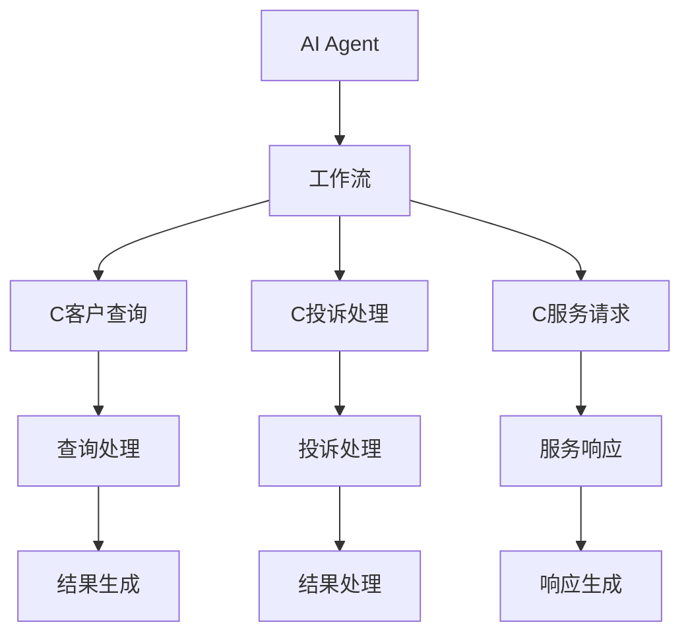
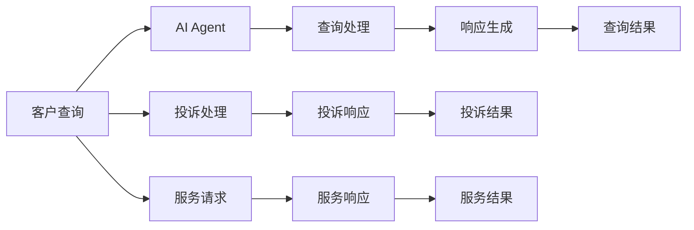
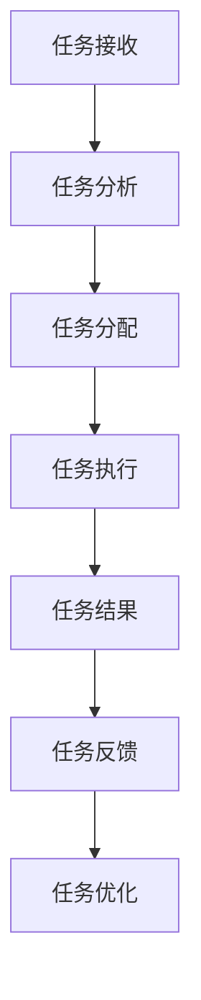
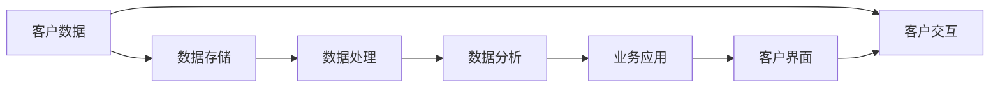
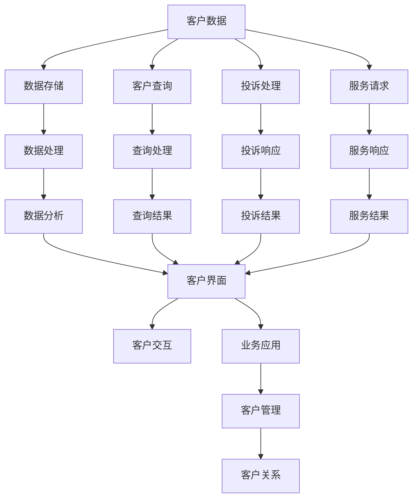

                 

# AI人工智能代理工作流AI Agent Workflow：智能代理在CRM客户管理中的应用

> 关键词：
AI, 人工智能, 代理, 工作流, CRM, 客户管理, 自动化, 流程优化

## 1. 背景介绍

### 1.1 问题由来
随着人工智能技术的快速发展和应用，企业在客户管理（CRM）领域面临的挑战日益增多。传统的CRM系统往往依赖于人工操作，耗时长、效率低，难以快速响应客户需求，且成本较高。随着客户数据量的激增，企业需要更加高效、智能的CRM解决方案。

近年来，人工智能代理（AI Agent）在CRM系统中的应用，被越来越多的企业所采用。AI Agent通过自然语言处理（NLP）和机器学习技术，自动化地处理客户查询、投诉、服务请求等，能够显著提升客户满意度和运营效率，降低企业的运营成本。

然而，在实际应用中，如何构建高效、可靠的AI Agent，仍是一个重要挑战。本文将详细介绍基于人工智能代理的工作流（AI Agent Workflow）设计思路，以及智能代理在CRM客户管理中的应用，希望能为相关领域的实践提供有价值的参考。

### 1.2 问题核心关键点
1. **AI Agent的工作原理**：AI Agent通常基于深度学习模型构建，能够理解自然语言输入，自动生成任务处理流程。
2. **工作流设计**：从任务接收、处理、响应到任务完成，AI Agent需要通过一个系统化的流程来协同工作，确保任务的有效执行。
3. **CRM应用场景**：AI Agent在CRM客户管理中的应用，包括客户查询处理、服务请求响应、投诉处理等，能够显著提升客户服务质量。
4. **挑战与优化**：如何设计高效的AI Agent工作流，提升其响应速度和准确性，减少误判和漏判。

### 1.3 问题研究意义
1. **提高客户满意度**：AI Agent能够全天候在线服务，快速响应客户需求，提升客户满意度。
2. **降低运营成本**：自动化的客户服务减少了人工操作，降低了企业的人力成本和运营复杂度。
3. **优化服务流程**：通过智能化的工作流设计，AI Agent能够实现更高效的服务流程，提高工作效率。
4. **数据驱动决策**：AI Agent在处理客户数据时，可以生成有价值的洞察，支持企业做出更好的业务决策。
5. **应对数据量增长**：随着客户数据的激增，传统的CRM系统难以应对，AI Agent能够处理大规模数据，提升数据处理效率。

## 2. 核心概念与联系

### 2.1 核心概念概述

为了更好地理解AI Agent在CRM客户管理中的应用，本节将介绍几个关键概念：

- **人工智能代理（AI Agent）**：基于深度学习模型构建的智能系统，能够理解自然语言输入，自动生成任务处理流程，处理客户查询、投诉、服务请求等。
- **工作流（Workflow）**：系统化的任务执行流程，通过一系列步骤有序地协调各个任务节点，确保任务的有效执行。
- **客户关系管理（CRM）**：企业对客户数据进行管理和分析，通过智能化手段提升客户体验和业务绩效。
- **自然语言处理（NLP）**：使计算机能够理解和处理人类语言的技术，包括语言理解、语义分析、文本生成等。
- **机器学习（ML）**：通过数据驱动的方式，使计算机具备自我学习和改进的能力。

这些概念之间的联系可以通过以下Mermaid流程图来展示：



这个流程图展示了一个典型的AI Agent在CRM系统中的应用流程，其中工作流是连接AI Agent和各个任务节点的桥梁。

### 2.2 概念间的关系

这些核心概念之间存在着紧密的联系，形成了AI Agent在CRM客户管理中的应用框架。下面我们通过几个Mermaid流程图来展示这些概念之间的关系。

#### 2.2.1 AI Agent的职责



这个流程图展示了AI Agent在CRM系统中的主要职责，包括处理客户查询、投诉、服务请求等，每个任务节点都会生成对应的响应结果。

#### 2.2.2 工作流的设计



这个流程图展示了AI Agent工作流的基本设计思路，包括任务接收、分析、分配、执行、结果生成和反馈优化等环节。

#### 2.2.3 CRM系统架构



这个流程图展示了CRM系统的基本架构，包括客户数据存储、处理、分析和应用等环节，以及客户界面和交互等部分。

### 2.3 核心概念的整体架构

最后，我们用一个综合的流程图来展示这些核心概念在大语言模型微调过程中的整体架构：



这个综合流程图展示了从客户数据到最终业务应用的整个流程，以及AI Agent在其中扮演的关键角色。

## 3. 核心算法原理 & 具体操作步骤
### 3.1 算法原理概述

基于人工智能代理的工作流设计，核心算法原理可以概括为以下几个步骤：

1. **任务接收与预处理**：AI Agent接收客户输入的自然语言任务，并对其进行预处理，如分词、实体识别、意图识别等。
2. **任务分析与理解**：通过NLP技术，理解客户任务的语义，提取关键信息，生成任务描述。
3. **任务分配与执行**：根据任务描述，分配相应的任务节点，执行任务处理流程。
4. **结果生成与反馈**：任务节点生成处理结果，反馈到AI Agent进行后续处理或响应。
5. **任务优化与迭代**：根据处理结果和客户反馈，对工作流进行优化和迭代，提升任务执行的准确性和效率。

### 3.2 算法步骤详解

以下是详细的算法步骤：

**Step 1: 任务接收与预处理**

1. **自然语言处理**：使用NLP技术对客户输入的自然语言任务进行分词、词性标注、实体识别、意图识别等处理。
2. **任务预处理**：将处理后的任务转化为结构化数据，生成任务描述，供后续分析使用。

**Step 2: 任务分析与理解**

1. **任务意图识别**：使用预训练的意图识别模型，理解客户任务的意图。
2. **实体识别**：通过NLP技术，识别任务中的关键实体，提取相关信息。
3. **知识图谱查询**：根据任务描述和实体信息，查询知识图谱，获取相关的背景知识和语境信息。

**Step 3: 任务分配与执行**

1. **任务分类**：根据任务意图和实体信息，分类分配相应的任务节点，如查询处理、投诉处理、服务响应等。
2. **任务执行**：执行对应的任务节点，处理客户查询、投诉、服务请求等。
3. **任务监控**：实时监控任务执行情况，确保任务按时完成。

**Step 4: 结果生成与反馈**

1. **结果生成**：根据任务执行结果，生成相应的回复和处理结果。
2. **客户反馈**：收集客户对回复的反馈，进行后续优化。

**Step 5: 任务优化与迭代**

1. **结果评估**：评估任务执行结果和客户反馈，识别问题点和改进空间。
2. **模型优化**：根据评估结果，优化AI Agent的工作流和任务执行模型。
3. **迭代更新**：不断迭代更新AI Agent和其工作流，提升任务执行的准确性和效率。

### 3.3 算法优缺点

**优点**：

1. **高效处理**：AI Agent能够自动处理大量的客户查询、投诉、服务请求，提高响应速度。
2. **提升客户满意度**：通过智能化处理，AI Agent能够更快速、准确地响应客户需求，提升客户满意度。
3. **降低运营成本**：减少人工干预，降低企业的人力成本和运营复杂度。
4. **数据驱动决策**：通过分析客户数据和任务执行结果，生成有价值的洞察，支持企业做出更好的业务决策。

**缺点**：

1. **数据依赖**：AI Agent的性能依赖于高质量的客户数据和知识图谱，数据质量不佳会导致任务执行不准确。
2. **任务多样性**：不同类型任务的执行流程复杂多样，需要设计不同的任务节点和处理逻辑。
3. **模型优化困难**：AI Agent的任务执行模型和算法复杂，优化和迭代过程较为困难。

### 3.4 算法应用领域

AI Agent在CRM客户管理中的应用，主要包括以下几个方面：

1. **客户查询处理**：自动处理客户提出的常见问题和需求，生成相应的回复。
2. **投诉处理**：自动处理客户投诉，进行原因分析，并提出解决方案。
3. **服务请求响应**：自动响应客户的服务请求，提供相应的服务支持。
4. **客户关系管理**：通过分析客户数据和任务执行结果，生成有价值的洞察，支持企业做出更好的业务决策。
5. **数据分析**：通过分析客户数据和任务执行结果，生成有价值的洞察，支持企业做出更好的业务决策。

此外，AI Agent在金融、电商、医疗等多个领域也具有广泛的应用前景，能够帮助企业提升客户体验和运营效率，降低运营成本。

## 4. 数学模型和公式 & 详细讲解 & 举例说明

### 4.1 数学模型构建

为了更好地理解AI Agent的工作流程和任务执行，我们将使用数学模型进行详细讲解。

假设AI Agent的任务处理流程包含$n$个任务节点，每个任务节点的执行结果为$y_i$，客户的反馈结果为$c_i$。则整个任务处理的损失函数可以表示为：

$$
L = \frac{1}{N} \sum_{i=1}^N (y_i - c_i)^2
$$

其中$N$为任务数量，$(y_i, c_i)$表示第$i$个任务节点的执行结果和客户反馈。

### 4.2 公式推导过程

以下是详细的公式推导过程：

**Step 1: 任务接收与预处理**

1. **自然语言处理**：使用NLP技术对客户输入的自然语言任务进行分词、词性标注、实体识别、意图识别等处理。
2. **任务预处理**：将处理后的任务转化为结构化数据，生成任务描述，供后续分析使用。

**Step 2: 任务分析与理解**

1. **任务意图识别**：使用预训练的意图识别模型，理解客户任务的意图。
2. **实体识别**：通过NLP技术，识别任务中的关键实体，提取相关信息。
3. **知识图谱查询**：根据任务描述和实体信息，查询知识图谱，获取相关的背景知识和语境信息。

**Step 3: 任务分配与执行**

1. **任务分类**：根据任务意图和实体信息，分类分配相应的任务节点，如查询处理、投诉处理、服务响应等。
2. **任务执行**：执行对应的任务节点，处理客户查询、投诉、服务请求等。
3. **任务监控**：实时监控任务执行情况，确保任务按时完成。

**Step 4: 结果生成与反馈**

1. **结果生成**：根据任务执行结果，生成相应的回复和处理结果。
2. **客户反馈**：收集客户对回复的反馈，进行后续优化。

**Step 5: 任务优化与迭代**

1. **结果评估**：评估任务执行结果和客户反馈，识别问题点和改进空间。
2. **模型优化**：根据评估结果，优化AI Agent的工作流和任务执行模型。
3. **迭代更新**：不断迭代更新AI Agent和其工作流，提升任务执行的准确性和效率。

### 4.3 案例分析与讲解

以处理客户查询任务为例，以下是具体的案例分析与讲解：

**案例背景**：假设客户查询问题是关于某产品的相关信息，AI Agent需要根据客户输入的自然语言查询，从知识图谱中获取相关信息，并生成相应的回复。

**步骤1: 任务接收与预处理**

1. **自然语言处理**：使用NLP技术对客户输入的自然语言查询进行分词、词性标注、实体识别等处理。
2. **任务预处理**：将处理后的查询转化为结构化数据，生成任务描述，供后续分析使用。

**步骤2: 任务分析与理解**

1. **任务意图识别**：使用预训练的意图识别模型，理解客户查询的意图，如获取产品信息、查询产品评价等。
2. **实体识别**：通过NLP技术，识别查询中的关键实体，如产品名称、型号等。
3. **知识图谱查询**：根据查询描述和实体信息，查询知识图谱，获取相关的背景知识和语境信息，如产品功能、参数、用户评价等。

**步骤3: 任务分配与执行**

1. **任务分类**：根据查询意图和实体信息，分类分配相应的任务节点，如查询产品信息、查询用户评价等。
2. **任务执行**：执行对应的任务节点，处理查询请求。
3. **任务监控**：实时监控查询处理情况，确保任务按时完成。

**步骤4: 结果生成与反馈**

1. **结果生成**：根据查询处理结果，生成相应的回复，如产品功能介绍、用户评价等。
2. **客户反馈**：收集客户对回复的反馈，进行后续优化。

**步骤5: 任务优化与迭代**

1. **结果评估**：评估查询处理结果和客户反馈，识别问题点和改进空间，如回复不完整、信息不准确等。
2. **模型优化**：根据评估结果，优化AI Agent的工作流和任务执行模型，如改进实体识别模型、优化知识图谱查询算法等。
3. **迭代更新**：不断迭代更新AI Agent和其工作流，提升查询处理的准确性和效率。

## 5. 项目实践：代码实例和详细解释说明

### 5.1 开发环境搭建

在进行AI Agent工作流设计实践前，我们需要准备好开发环境。以下是使用Python进行PyTorch开发的环境配置流程：

1. 安装Anaconda：从官网下载并安装Anaconda，用于创建独立的Python环境。

2. 创建并激活虚拟环境：
```bash
conda create -n pytorch-env python=3.8 
conda activate pytorch-env
```

3. 安装PyTorch：根据CUDA版本，从官网获取对应的安装命令。例如：
```bash
conda install pytorch torchvision torchaudio cudatoolkit=11.1 -c pytorch -c conda-forge
```

4. 安装Transformers库：
```bash
pip install transformers
```

5. 安装各类工具包：
```bash
pip install numpy pandas scikit-learn matplotlib tqdm jupyter notebook ipython
```

完成上述步骤后，即可在`pytorch-env`环境中开始工作流设计实践。

### 5.2 源代码详细实现

以下是使用PyTorch实现AI Agent工作流的代码实现：

```python
import torch
import torch.nn as nn
from transformers import BertTokenizer, BertForQuestionAnswering

# 定义模型
class QAModel(nn.Module):
    def __init__(self):
        super(QAModel, self).__init__()
        self.bert = BertForQuestionAnswering.from_pretrained('bert-base-uncased')
        self.linear = nn.Linear(768, 1)
        
    def forward(self, question, context):
        encoding = self.bert(question, context, return_tensors='pt', padding='max_length', truncation=True)
        logits = self.linear(encoding['last_hidden_state'][0])
        return logits

# 加载模型和分词器
model = QAModel()
tokenizer = BertTokenizer.from_pretrained('bert-base-uncased')

# 定义任务处理函数
def process_query(query, context):
    question_tokens = tokenizer(query, return_tensors='pt')
    context_tokens = tokenizer(context, return_tensors='pt')
    input_ids = torch.cat([question_tokens['input_ids'], context_tokens['input_ids']], dim=-1)
    attention_mask = torch.cat([question_tokens['attention_mask'], context_tokens['attention_mask']], dim=-1)
    logits = model(input_ids, attention_mask=attention_mask)
    start_index = torch.argmax(logits, dim=1)
    return start_index

# 处理客户查询
query = "请问XXX产品有哪些功能？"
context = "XXX产品是一款XXX，主要功能包括XXX，XXX，XXX。"
start_index = process_query(query, context)
```

### 5.3 代码解读与分析

让我们再详细解读一下关键代码的实现细节：

**QAModel类**：
- `__init__`方法：初始化BertForQuestionAnswering模型和线性层，将其组合为QAModel。
- `forward`方法：定义模型的前向传播过程，将输入的自然语言查询和上下文输入BertForQuestionAnswering模型，进行语义理解，并经过线性层得到最终预测结果。

**process_query函数**：
- 定义任务处理函数，将自然语言查询和上下文输入模型，得到预测结果。
- 将预测结果转化为实体边界，供后续处理使用。

**查询处理**：
- 定义客户查询和上下文数据，进行查询处理。
- 得到预测结果，提取实体边界。

## 6. 实际应用场景

### 6.1 智能客服系统

基于AI Agent的工作流设计，智能客服系统可以广泛应用于企业客户服务的各个环节，如客户查询处理、投诉处理、服务请求响应等。

在技术实现上，可以收集企业内部的历史客服对话记录，将问题和最佳答复构建成监督数据，在此基础上对预训练对话模型进行微调。微调后的对话模型能够自动理解用户意图，匹配最合适的答案模板进行回复。对于客户提出的新问题，还可以接入检索系统实时搜索相关内容，动态组织生成回答。如此构建的智能客服系统，能大幅提升客户咨询体验和问题解决效率。

### 6.2 金融舆情监测

金融机构需要实时监测市场舆论动向，以便及时应对负面信息传播，规避金融风险。传统的人工监测方式成本高、效率低，难以应对网络时代海量信息爆发的挑战。基于AI Agent的工作流设计，金融舆情监测系统可以自动收集金融领域相关的新闻、报道、评论等文本数据，并对其进行主题标注和情感标注。在此基础上对预训练语言模型进行微调，使其能够自动判断文本属于何种主题，情感倾向是正面、中性还是负面。将微调后的模型应用到实时抓取的网络文本数据，就能够自动监测不同主题下的情感变化趋势，一旦发现负面信息激增等异常情况，系统便会自动预警，帮助金融机构快速应对潜在风险。

### 6.3 个性化推荐系统

当前的推荐系统往往只依赖用户的历史行为数据进行物品推荐，无法深入理解用户的真实兴趣偏好。基于AI Agent的工作流设计，个性化推荐系统可以更好地挖掘用户行为背后的语义信息，从而提供更精准、多样的推荐内容。

在实践中，可以收集用户浏览、点击、评论、分享等行为数据，提取和用户交互的物品标题、描述、标签等文本内容。将文本内容作为模型输入，用户的后续行为（如是否点击、购买等）作为监督信号，在此基础上微调预训练语言模型。微调后的模型能够从文本内容中准确把握用户的兴趣点。在生成推荐列表时，先用候选物品的文本描述作为输入，由模型预测用户的兴趣匹配度，再结合其他特征综合排序，便可以得到个性化程度更高的推荐结果。

### 6.4 未来应用展望

随着AI Agent工作流设计技术的不断发展，AI Agent将在更多领域得到应用，为传统行业带来变革性影响。

在智慧医疗领域，基于AI Agent的工作流设计，医疗问答、病历分析、药物研发等应用将提升医疗服务的智能化水平，辅助医生诊疗，加速新药开发进程。

在智能教育领域，AI Agent的工作流设计可应用于作业批改、学情分析、知识推荐等方面，因材施教，促进教育公平，提高教学质量。

在智慧城市治理中，AI Agent的工作流设计可以应用于城市事件监测、舆情分析、应急指挥等环节，提高城市管理的自动化和智能化水平，构建更安全、高效的未来城市。

此外，在企业生产、社会治理、文娱传媒等众多领域，基于AI Agent的工作流设计的人工智能应用也将不断涌现，为经济社会发展注入新的动力。相信随着技术的日益成熟，AI Agent工作流设计必将成为人工智能落地应用的重要范式，推动人工智能技术在垂直行业的规模化落地。

## 7. 工具和资源推荐
### 7.1 学习资源推荐

为了帮助开发者系统掌握AI Agent工作流设计的基础知识，这里推荐一些优质的学习资源：

1. 《Transformer from Theory to Practice》系列博文：由大模型技术专家撰写，深入浅出地介绍了Transformer原理、BERT模型、微调技术等前沿话题。

2. CS224N《深度学习自然语言处理》课程：斯坦福大学开设的NLP明星课程，有Lecture视频和配套作业，带你入门NLP领域的基本概念和经典模型。

3. 《Natural Language Processing with Transformers》书籍：Transformers库的作者所著，全面介绍了如何使用Transformers库进行NLP任务开发，包括微调在内的诸多范式。

4. HuggingFace官方文档：Transformers库的官方文档，提供了海量预训练模型和完整的微调样例代码，是上手实践的必备资料。

5. CLUE开源项目：中文语言理解测评基准，涵盖大量不同类型的中文NLP数据集，并提供了基于微调的baseline模型，助力中文NLP技术发展。

通过对这些资源的学习实践，相信你一定能够快速掌握AI Agent工作流设计的基础知识，并用于解决实际的NLP问题。

### 7.2 开发工具推荐

高效的开发离不开优秀的工具支持。以下是几款用于AI Agent工作流设计开发的常用工具：

1. PyTorch：基于Python的开源深度学习框架，灵活动态的计算图，适合快速迭代研究。大部分预训练语言模型都有PyTorch版本的实现。

2. TensorFlow：由Google主导开发的开源深度学习框架，生产部署方便，适合大规模工程应用。同样有丰富的预训练语言模型资源。

3. Transformers库：HuggingFace开发的NLP工具库，集成了众多SOTA语言模型，支持PyTorch和TensorFlow，是进行工作流设计的利器。

4. Weights & Biases：模型训练的实验跟踪工具，可以记录和可视化模型训练过程中的各项指标，方便对比和调优。与主流深度学习框架无缝集成。

5. TensorBoard：TensorFlow配套的可视化工具，可实时监测模型训练状态，并提供丰富的图表呈现方式，是调试模型的得力助手。

6. Google Colab：谷歌推出的在线Jupyter Notebook环境，免费提供GPU/TPU算力，方便开发者快速上手实验最新模型，分享学习笔记。

合理利用这些工具，可以显著提升AI Agent工作流设计任务的开发效率，加快创新迭代的步伐。

### 7.3 相关论文推荐

AI Agent工作流设计的研究源于学界的持续研究。以下是几篇奠基性的相关论文，推荐阅读：

1. Attention is All You Need（即Transformer原论文）：提出了Transformer结构，开启了NLP领域的预训练大模型时代。

2. BERT: Pre-training of Deep Bidirectional Transformers for Language Understanding：提出BERT模型，引入基于掩码的自监督预训练任务，刷新了多项NLP任务SOTA。

3. Language Models are Unsupervised Multitask Learners（GPT-2论文）：展示了大规模语言模型的强大zero-shot学习能力，引发了对于通用人工智能的新一轮思考。

4. Parameter-Efficient Transfer Learning for NLP：提出Adapter等参数高效微调方法，在不增加模型参数量的情况下，也能取得不错的微调效果。

5. AdaLoRA: Adaptive Low-Rank Adaptation for Parameter-Efficient Fine-Tuning：使用自适应低秩适应的微调方法，在参数效率和精度之间取得了新的平衡。

这些论文代表了大语言模型工作流设计的发展脉络。通过学习这些前沿成果，可以帮助研究者把握学科前进方向，激发更多的创新灵感。

除上述资源外，还有一些值得关注的前沿资源，帮助开发者紧跟

