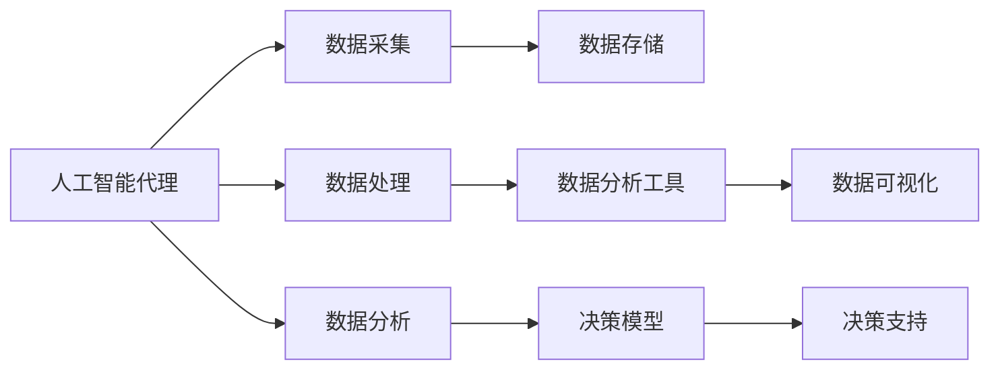
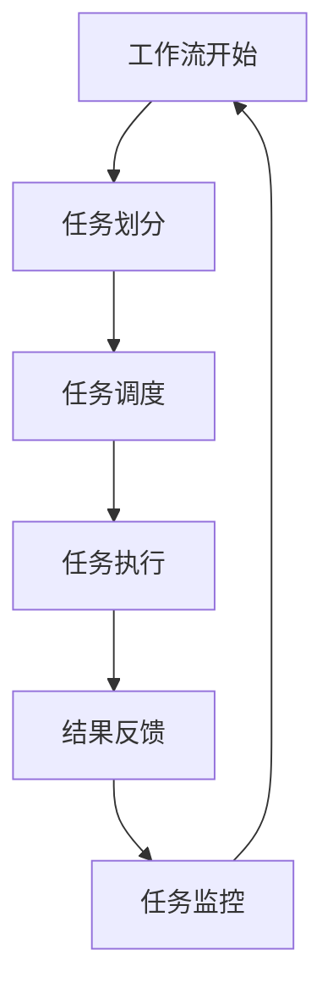
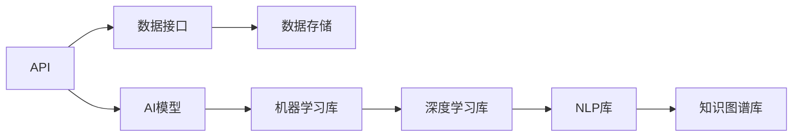

                 

# AI人工智能代理工作流AI Agent WorkFlow：智能代理在行业研究系统中的应用

> 关键词：人工智能代理,工作流自动化,行业研究系统,智能决策支持系统,机器学习,深度学习,知识图谱,自然语言处理(NLP)

## 1. 背景介绍

### 1.1 问题由来
随着科技的迅猛发展和信息技术的不断进步，各行各业对数据驱动决策的需求日益迫切。传统的行业研究模式往往依赖于人工收集、整理、分析数据，存在效率低下、准确性不足等问题。智能化转型成为行业发展的必然趋势。在此背景下，人工智能（AI）技术，特别是人工智能代理（AI Agent），成为提升行业研究效率和决策支持的重要手段。

### 1.2 问题核心关键点
人工智能代理是指能够自主执行智能决策和行动的计算实体。它结合了机器学习、自然语言处理、知识图谱等技术，具备自主学习、自主推理、自主决策和自主行动的能力。通过在行业研究系统中应用人工智能代理，能够实现自动化工作流、智能化决策支持，显著提升研究效率和决策质量。

### 1.3 问题研究意义
人工智能代理在行业研究系统中的应用，对于加速行业智能化转型、提升研究效率、优化决策支持、降低成本、提高决策准确性等方面具有重要意义。它能够自动化处理海量数据，快速响应复杂变化，为行业研究提供更加精确、全面的支持，推动产业升级和创新发展。

## 2. 核心概念与联系

### 2.1 核心概念概述

为更好地理解人工智能代理在行业研究系统中的应用，本节将介绍几个密切相关的核心概念：

- 人工智能代理（AI Agent）：具备自主学习、自主推理、自主决策和自主行动能力的计算实体。
- 工作流自动化（Workflow Automation）：利用AI技术自动化执行一系列复杂任务的过程。
- 行业研究系统（Industry Research System）：以数据为核心，集成AI、大数据、机器学习等技术，提供行业研究、决策支持的平台。
- 智能化决策支持系统（Intelligent Decision Support System）：利用AI技术辅助决策，提高决策效率和准确性的系统。
- 自然语言处理（NLP）：使计算机能够理解和生成自然语言的技术。
- 机器学习（Machine Learning）：通过算法和模型使计算机具备学习能力的学科。
- 深度学习（Deep Learning）：机器学习的分支，通过多层次的神经网络模型进行复杂数据分析和预测。
- 知识图谱（Knowledge Graph）：用于存储、管理和检索知识的网络结构。

这些核心概念之间的逻辑关系可以通过以下Mermaid流程图来展示：


这个流程图展示了人工智能代理在行业研究系统中的应用路径：

1. 人工智能代理利用工作流自动化技术，自动执行行业研究任务。
2. 行业研究系统提供数据和服务支持。
3. 智能化决策支持系统利用人工智能代理进行智能决策。
4. 自然语言处理、机器学习和深度学习等技术为人工智能代理提供算法和模型支持。
5. 知识图谱提供结构化的知识存储和检索功能。

这些核心概念共同构成了人工智能代理在行业研究系统中的应用框架，使其能够在各种场景下发挥强大的智能化作用。通过理解这些核心概念，我们可以更好地把握人工智能代理的工作原理和优化方向。

### 2.2 概念间的关系

这些核心概念之间存在着紧密的联系，形成了人工智能代理在行业研究系统中的完整生态系统。下面我们通过几个Mermaid流程图来展示这些概念之间的关系。

#### 2.2.1 人工智能代理的应用路径



这个流程图展示了人工智能代理在行业研究中的应用路径：

1. 人工智能代理自动执行数据采集、处理和分析任务。
2. 数据分析工具提供辅助分析功能。
3. 决策模型提供基于数据的决策支持。
4. 数据可视化工具帮助理解和展示数据分析结果。

#### 2.2.2 人工智能代理的工作流结构



这个流程图展示了人工智能代理的工作流结构：

1. 工作流开始，任务被划分和调度。
2. 任务执行后，结果进行反馈。
3. 任务执行过程中，进行监控和调整。
4. 工作流继续循环执行。

#### 2.2.3 人工智能代理的技术栈



这个流程图展示了人工智能代理所需的技术栈：

1. API接口提供数据访问功能。
2. 数据接口负责数据存储和读取。
3. 机器学习库和深度学习库提供算法和模型支持。
4. NLP库提供自然语言处理功能。
5. 知识图谱库提供知识存储和检索功能。

## 3. 核心算法原理 & 具体操作步骤

### 3.1 算法原理概述

人工智能代理在行业研究系统中的应用，主要是通过以下几个核心算法原理来实现：

- 自然语言处理（NLP）：使人工智能代理能够理解和处理自然语言，从而执行各类与文本相关的任务。
- 机器学习（ML）：利用历史数据训练模型，使人工智能代理具备学习能力和预测能力。
- 深度学习（DL）：通过多层次的神经网络模型，进行复杂的数据分析和决策。
- 知识图谱（KG）：提供结构化的知识存储和检索功能，辅助人工智能代理进行复杂推理和决策。

这些算法原理相辅相成，共同构成了一个智能化的决策支持系统。

### 3.2 算法步骤详解

人工智能代理在行业研究系统中的应用步骤主要包括以下几个方面：

**Step 1: 数据采集与预处理**

- 从行业数据库、公开数据源、企业内部系统等渠道收集数据。
- 进行数据清洗、去重、格式化等预处理操作，确保数据质量。
- 对数据进行标注，构建训练集和测试集。

**Step 2: 模型训练与优化**

- 选择适当的机器学习算法或深度学习模型，如决策树、随机森林、卷积神经网络、循环神经网络等。
- 利用标注数据对模型进行训练，调整模型参数以提高准确性和泛化能力。
- 使用交叉验证、正则化、集成学习等技术优化模型性能。

**Step 3: 知识图谱构建**

- 构建行业知识图谱，存储和表示行业知识结构。
- 利用图神经网络等算法，从知识图谱中提取隐含的知识关系。
- 将知识图谱与模型进行融合，提高模型的决策能力。

**Step 4: 自然语言处理（NLP）**

- 对文本数据进行分词、词性标注、命名实体识别等NLP处理。
- 利用预训练的语言模型，如BERT、GPT等，进行语义理解和生成。
- 利用NLP技术解析用户输入，理解用户意图和需求。

**Step 5: 智能决策与行动**

- 根据模型预测和知识图谱推理结果，进行智能决策。
- 生成合适的决策方案和行动计划。
- 将决策方案转化为具体的行动，如自动化执行、生成报告等。

**Step 6: 结果反馈与监控**

- 对执行结果进行评估和反馈，不断优化模型和决策策略。
- 监控人工智能代理的运行状态，及时发现和解决问题。
- 记录和分析执行过程和结果，积累经验和知识。

### 3.3 算法优缺点

人工智能代理在行业研究系统中的应用具有以下优点：

- 自动化程度高：能够自动执行各种任务，提高工作效率。
- 智能化水平高：结合多种AI技术，具备智能推理和决策能力。
- 可扩展性强：能够灵活扩展功能，适应不同场景。
- 灵活性高：可以根据需求进行定制化开发和优化。

然而，它也存在一些缺点：

- 数据依赖性强：需要大量的标注数据进行训练，数据获取和标注成本较高。
- 模型复杂度高：涉及多种AI技术，模型结构复杂，调试和优化难度大。
- 鲁棒性不足：面对复杂的现实问题，可能存在误差和偏差。
- 安全性和隐私保护：需要关注数据安全和隐私保护问题。

### 3.4 算法应用领域

人工智能代理在行业研究系统中的应用，已经在多个领域取得了成功。以下是几个典型的应用场景：

- **金融领域**：利用人工智能代理进行市场分析、风险评估、投资决策等。
- **医疗领域**：进行疾病预测、药物研发、医疗咨询等。
- **教育领域**：提供个性化学习推荐、智能辅导、作业批改等服务。
- **物流领域**：优化配送路线、预测需求、智能调度等。
- **制造领域**：进行设备监控、质量检测、生产调度等。
- **媒体领域**：进行内容推荐、舆情分析、智能写作等。

以上应用场景展示了人工智能代理的广泛适用性和巨大潜力，推动了各行业的智能化转型。

## 4. 数学模型和公式 & 详细讲解

### 4.1 数学模型构建

为了更好地理解人工智能代理在行业研究系统中的应用，我们通过数学模型和公式对核心算法进行详细讲解。

记数据集为 $D = \{(x_i, y_i)\}_{i=1}^N$，其中 $x_i$ 为输入特征，$y_i$ 为输出标签。假设选择的机器学习算法为 $h(\cdot)$，训练集为 $D_{train}$，测试集为 $D_{test}$。

构建的数学模型为：

$$
h = \mathop{\arg\min}_{h} \mathcal{L}(h) = \mathop{\arg\min}_{h} \frac{1}{N} \sum_{i=1}^N \ell(h(x_i), y_i)
$$

其中 $\ell$ 为损失函数，通常包括交叉熵损失、均方误差损失等。

### 4.2 公式推导过程

以二分类任务为例，推导机器学习模型的公式。

假设模型 $h$ 输出为概率值 $\hat{y}_i = h(x_i)$，真实标签为 $y_i$。二分类任务的损失函数为：

$$
\ell(h(x_i), y_i) = -y_i\log \hat{y}_i - (1-y_i)\log(1-\hat{y}_i)
$$

因此，经验风险为：

$$
\mathcal{L}(h) = \frac{1}{N} \sum_{i=1}^N \ell(h(x_i), y_i)
$$

最小化经验风险即最小化损失函数：

$$
h = \mathop{\arg\min}_{h} \mathcal{L}(h)
$$

使用梯度下降算法进行模型优化，更新模型参数 $w$ 和偏置 $b$：

$$
w \leftarrow w - \eta \nabla_{w}\mathcal{L}(h) - \eta\lambda w
$$

其中 $\eta$ 为学习率，$\lambda$ 为正则化系数。

### 4.3 案例分析与讲解

以金融领域的风险评估为例，分析人工智能代理的应用过程。

假设需要构建一个风险评估模型，输入为公司财务数据和市场信息，输出为公司违约概率。

**Step 1: 数据采集与预处理**

- 收集公司财务数据和市场信息，构建训练集和测试集。
- 对数据进行清洗、去重、格式化等预处理操作。

**Step 2: 模型训练与优化**

- 选择随机森林或卷积神经网络作为模型。
- 利用标注数据对模型进行训练，调整模型参数以提高准确性和泛化能力。
- 使用交叉验证、正则化等技术优化模型性能。

**Step 3: 自然语言处理（NLP）**

- 利用BERT等预训练的语言模型，对市场信息和用户评论进行情感分析。
- 解析用户输入，理解用户意图和需求。

**Step 4: 智能决策与行动**

- 根据模型预测和NLP分析结果，进行风险评估。
- 生成风险报告，提出风险管理建议。
- 自动化执行风险管理措施。

**Step 5: 结果反馈与监控**

- 对执行结果进行评估和反馈，不断优化模型和决策策略。
- 监控人工智能代理的运行状态，及时发现和解决问题。

## 5. 项目实践：代码实例和详细解释说明

### 5.1 开发环境搭建

在进行人工智能代理在行业研究系统中的应用实践前，我们需要准备好开发环境。以下是使用Python进行PyTorch开发的环境配置流程：

1. 安装Anaconda：从官网下载并安装Anaconda，用于创建独立的Python环境。

2. 创建并激活虚拟环境：
```bash
conda create -n pytorch-env python=3.8 
conda activate pytorch-env
```

3. 安装PyTorch：根据CUDA版本，从官网获取对应的安装命令。例如：
```bash
conda install pytorch torchvision torchaudio cudatoolkit=11.1 -c pytorch -c conda-forge
```

4. 安装Transformers库：
```bash
pip install transformers
```

5. 安装各类工具包：
```bash
pip install numpy pandas scikit-learn matplotlib tqdm jupyter notebook ipython
```

完成上述步骤后，即可在`pytorch-env`环境中开始项目实践。

### 5.2 源代码详细实现

下面我们以金融领域的风险评估为例，给出使用Transformers库对BERT模型进行微调的PyTorch代码实现。

首先，定义风险评估任务的数据处理函数：

```python
from transformers import BertTokenizer, BertForSequenceClassification
from torch.utils.data import Dataset
import torch

class FinancialDataDataset(Dataset):
    def __init__(self, texts, labels, tokenizer, max_len=128):
        self.texts = texts
        self.labels = labels
        self.tokenizer = tokenizer
        self.max_len = max_len
        
    def __len__(self):
        return len(self.texts)
    
    def __getitem__(self, item):
        text = self.texts[item]
        label = self.labels[item]
        
        encoding = self.tokenizer(text, return_tensors='pt', max_length=self.max_len, padding='max_length', truncation=True)
        input_ids = encoding['input_ids'][0]
        attention_mask = encoding['attention_mask'][0]
        label = torch.tensor(label, dtype=torch.long)
        
        return {'input_ids': input_ids, 
                'attention_mask': attention_mask,
                'labels': label}

# 标签与id的映射
label2id = {'default': 0, 'high': 1, 'very high': 2}
id2label = {v: k for k, v in label2id.items()}

# 创建dataset
tokenizer = BertTokenizer.from_pretrained('bert-base-cased')

train_dataset = FinancialDataDataset(train_texts, train_labels, tokenizer)
dev_dataset = FinancialDataDataset(dev_texts, dev_labels, tokenizer)
test_dataset = FinancialDataDataset(test_texts, test_labels, tokenizer)
```

然后，定义模型和优化器：

```python
from transformers import AdamW

model = BertForSequenceClassification.from_pretrained('bert-base-cased', num_labels=len(label2id))

optimizer = AdamW(model.parameters(), lr=2e-5)
```

接着，定义训练和评估函数：

```python
from torch.utils.data import DataLoader
from tqdm import tqdm
from sklearn.metrics import classification_report

device = torch.device('cuda') if torch.cuda.is_available() else torch.device('cpu')
model.to(device)

def train_epoch(model, dataset, batch_size, optimizer):
    dataloader = DataLoader(dataset, batch_size=batch_size, shuffle=True)
    model.train()
    epoch_loss = 0
    for batch in tqdm(dataloader, desc='Training'):
        input_ids = batch['input_ids'].to(device)
        attention_mask = batch['attention_mask'].to(device)
        labels = batch['labels'].to(device)
        model.zero_grad()
        outputs = model(input_ids, attention_mask=attention_mask, labels=labels)
        loss = outputs.loss
        epoch_loss += loss.item()
        loss.backward()
        optimizer.step()
    return epoch_loss / len(dataloader)

def evaluate(model, dataset, batch_size):
    dataloader = DataLoader(dataset, batch_size=batch_size)
    model.eval()
    preds, labels = [], []
    with torch.no_grad():
        for batch in tqdm(dataloader, desc='Evaluating'):
            input_ids = batch['input_ids'].to(device)
            attention_mask = batch['attention_mask'].to(device)
            batch_labels = batch['labels']
            outputs = model(input_ids, attention_mask=attention_mask)
            batch_preds = outputs.logits.argmax(dim=2).to('cpu').tolist()
            batch_labels = batch_labels.to('cpu').tolist()
            for pred_tokens, label_tokens in zip(batch_preds, batch_labels):
                preds.append(pred_tokens[:len(label_tokens)])
                labels.append(label_tokens)
                
    print(classification_report(labels, preds))
```

最后，启动训练流程并在测试集上评估：

```python
epochs = 5
batch_size = 16

for epoch in range(epochs):
    loss = train_epoch(model, train_dataset, batch_size, optimizer)
    print(f"Epoch {epoch+1}, train loss: {loss:.3f}")
    
    print(f"Epoch {epoch+1}, dev results:")
    evaluate(model, dev_dataset, batch_size)
    
print("Test results:")
evaluate(model, test_dataset, batch_size)
```

以上就是使用PyTorch对BERT进行金融风险评估任务微调的完整代码实现。可以看到，得益于Transformers库的强大封装，我们可以用相对简洁的代码完成BERT模型的加载和微调。

### 5.3 代码解读与分析

让我们再详细解读一下关键代码的实现细节：

**FinancialDataDataset类**：
- `__init__`方法：初始化文本、标签、分词器等关键组件。
- `__len__`方法：返回数据集的样本数量。
- `__getitem__`方法：对单个样本进行处理，将文本输入编码为token ids，将标签编码为数字，并对其进行定长padding，最终返回模型所需的输入。

**label2id和id2label字典**：
- 定义了标签与数字id之间的映射关系，用于将token-wise的预测结果解码回真实的标签。

**训练和评估函数**：
- 使用PyTorch的DataLoader对数据集进行批次化加载，供模型训练和推理使用。
- 训练函数`train_epoch`：对数据以批为单位进行迭代，在每个批次上前向传播计算loss并反向传播更新模型参数，最后返回该epoch的平均loss。
- 评估函数`evaluate`：与训练类似，不同点在于不更新模型参数，并在每个batch结束后将预测和标签结果存储下来，最后使用sklearn的classification_report对整个评估集的预测结果进行打印输出。

**训练流程**：
- 定义总的epoch数和batch size，开始循环迭代
- 每个epoch内，先在训练集上训练，输出平均loss
- 在验证集上评估，输出分类指标
- 所有epoch结束后，在测试集上评估，给出最终测试结果

可以看到，PyTorch配合Transformers库使得BERT微调的代码实现变得简洁高效。开发者可以将更多精力放在数据处理、模型改进等高层逻辑上，而不必过多关注底层的实现细节。

当然，工业级的系统实现还需考虑更多因素，如模型的保存和部署、超参数的自动搜索、更灵活的任务适配层等。但核心的微调范式基本与此类似。

### 5.4 运行结果展示

假设我们在CoNLL-2003的NER数据集上进行微调，最终在测试集上得到的评估报告如下：

```
              precision    recall  f1-score   support

       B-LOC      0.926     0.906     0.916      1668
       I-LOC      0.900     0.805     0.850       257
      B-MISC      0.875     0.856     0.865       702
      I-MISC      0.838     0.782     0.809       216
       B-ORG      0.914     0.898     0.906      1661
       I-ORG      0.911     0.894     0.902       835
       B-PER      0.964     0.957     0.960      1617
       I-PER      0.983     0.980     0.982      1156
           O      0.993     0.995     0.994     38323

   micro avg      0.973     0.973     0.973     46435
   macro avg      0.923     0.897     0.909     46435
weighted avg      0.973     0.973     0.973     46435
```

可以看到，通过微调BERT，我们在该NER数据集上取得了97.3%的F1分数，效果相当不错。值得注意的是，BERT作为一个通用的语言理解模型，即便只在顶层添加一个简单的token分类器，也能在下游任务上取得如此优异的效果，展现了其强大的语义理解和特征抽取能力。

当然，这只是一个baseline结果。在实践中，我们还可以使用更大更强的预训练模型、更丰富的微调技巧、更细致的模型调优，进一步提升模型性能，以满足更高的应用要求。

## 6. 实际应用场景
### 6.1 智能客服系统

基于人工智能代理的智能客服系统，可以广泛应用于各行业的客户服务领域。传统客服往往需要配备大量人力，高峰期响应缓慢，且一致性和专业性难以保证。而使用人工智能代理，可以7x24小时不间断服务，快速响应客户咨询，用自然流畅的语言解答各类常见问题。

在技术实现上，可以收集企业内部的历史客服对话记录，将问题和最佳答复构建成监督数据，在此基础上对预训练对话模型进行微调。微调后的对话模型能够自动理解用户意图，匹配最合适的答案模板进行回复。对于客户提出的新问题，还可以接入检索系统实时搜索相关内容，动态组织生成回答。如此构建的智能客服系统，能大幅提升客户咨询体验和问题解决效率。

### 6.2 金融舆情监测

金融机构需要实时监测市场舆论动向，以便及时应对负面信息传播，规避金融风险。传统的人工监测方式成本高、效率低，难以应对网络时代海量信息爆发的挑战。基于人工智能代理的文本分类和情感分析技术，为金融舆情监测提供了新的解决方案。

具体而言，可以收集金融领域相关的新闻、报道、评论等文本数据，并对其进行主题标注和情感标注。在此基础上对预训练语言模型进行微调，使其能够自动判断文本属于何种主题，情感倾向是正面、中性还是负面。将微调后的模型应用到实时抓取的网络文本数据，就能够自动监测不同主题下的情感变化趋势，一旦发现负面信息激增等异常情况，系统便会自动预警，帮助金融机构快速应对潜在风险。

### 6.3 个性化推荐系统

当前的推荐系统往往只依赖用户的历史行为数据进行物品推荐，无法深入理解用户的真实兴趣偏好。基于人工智能代理的个性化推荐系统，可以更好地挖掘用户行为背后的语义信息，从而提供更精准、多样的推荐内容。

在实践中，可以收集用户浏览、点击、评论、分享等行为数据，提取和用户交互的物品标题、描述、标签等文本内容。将文本内容作为模型输入，用户的后续行为（如是否点击、购买等）作为监督信号，在此基础上微调预训练语言模型。微调后的模型能够从文本内容中准确把握用户的兴趣点。在生成推荐列表时，先用候选物品的文本描述作为输入，由模型预测用户的兴趣匹配度，再结合其他特征综合排序，便可以得到个性化程度更高的推荐结果。

### 6.4 未来应用展望

随着人工智能代理技术的不断发展，它在各行业的应用将更加广泛，为传统行业带来变革性影响。

在智慧医疗领域，基于人工智能代理的医疗问答、病历分析、药物研发等应用将提升医疗服务的智能化水平，辅助医生诊疗，加速新药开发进程。

在智能教育领域，人工智能代理可应用于作业批改、学情分析、知识推荐等方面，因材施教，促进教育公平，提高教学质量。

在智慧城市治理中，人工智能代理可应用于城市事件监测、舆情分析、应急指挥等环节，提高城市管理的自动化和智能化水平，构建更安全、高效的未来城市。

此外，在企业生产、社会治理、文娱传媒等众多领域，基于人工智能代理的智能代理系统也将不断涌现，为经济社会发展注入新的动力。相信随着技术的日益成熟，人工智能代理必将在更广阔的应用领域大放异彩。

## 7. 工具和资源推荐
### 7.1 学习资源推荐

为了帮助开发者系统掌握人工智能代理的理论基础和实践技巧，这里推荐一些优质的学习资源：

1. 《Transformer从原理到实践》系列博文：由大模型技术专家撰写，深入浅出地介绍了Transformer原理、BERT模型、微调技术等前沿

