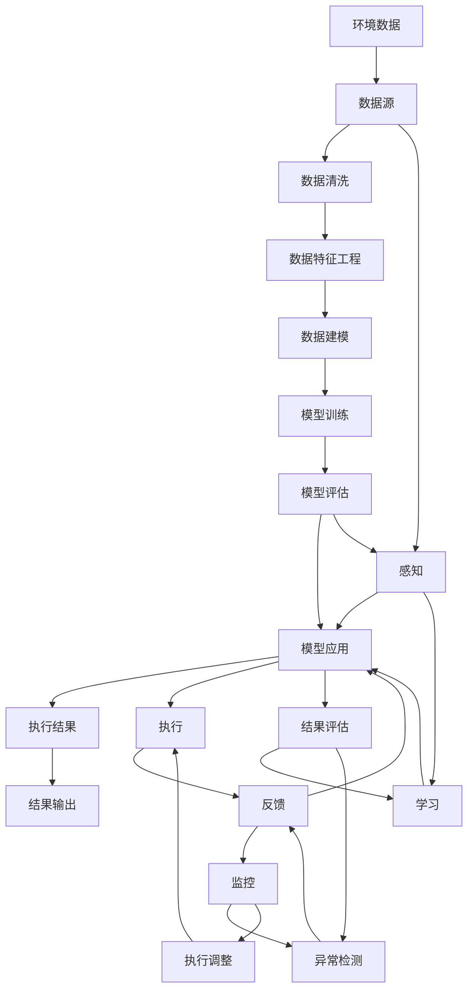

                 

# AI人工智能代理工作流AI Agent WorkFlow：设计智能任务处理流程

> 关键词：
## 1. 背景介绍

### 1.1 问题由来

在当今快速变化的数字化时代，人工智能(AI)技术的应用日益广泛，涵盖了从自然语言处理(NLP)到计算机视觉、从自动化流程优化到智能决策支持等多个领域。其中，AI代理(Agent)工作流是一种新兴的智能系统设计方法，旨在通过自动化、智能化的方式，实现任务处理的自动化、高效化和智能化。通过构建AI代理工作流，可以极大地提升业务效率，降低运营成本，为企业带来显著的竞争优势。

### 1.2 问题核心关键点

AI代理工作流的设计需要考虑多个关键点：

- 目标任务的明确化：确定代理需要解决的具体问题，如客户服务、订单管理、财务分析等。
- 代理功能的设计：确定代理需要具备的核心功能，如信息检索、任务调度、决策支持等。
- 数据处理和管理：收集、存储和管理与任务相关的数据，如客户信息、订单记录、市场数据等。
- 任务执行和监控：实现代理对任务的具体执行，同时对执行过程进行监控和调整。
- 界面和交互设计：设计用户友好的界面和交互方式，使用户能够方便地与代理进行互动。

### 1.3 问题研究意义

设计AI代理工作流，对于提高业务运营效率、降低运营成本、提升用户体验和增强决策支持等方面具有重要意义：

1. **提升运营效率**：通过自动化、智能化的方式，大幅提升任务处理的效率，减少人为干预。
2. **降低运营成本**：减少人力和物力资源投入，降低业务运营成本。
3. **提升用户体验**：通过智能化的服务，提高用户满意度，增强用户粘性。
4. **增强决策支持**：提供基于数据的智能分析，辅助企业进行决策。
5. **促进技术创新**：推动AI技术在垂直行业的深入应用，带动技术创新和产业升级。

## 2. 核心概念与联系

### 2.1 核心概念概述

为更好地理解AI代理工作流的构建，本节将介绍几个核心概念：

- **AI代理(Agent)**：指能够在一定环境内，通过自主感知、学习、推理和决策，执行指定任务的智能系统。
- **工作流(Workflow)**：指一系列任务的执行顺序，旨在实现特定目标的自动化流程。
- **数据驱动(DataSource-Driven)**：指基于数据进行决策和任务执行，而非仅依赖经验和直觉。
- **智能监控(Smart Monitoring)**：指通过实时监控和反馈，及时调整代理的工作状态和执行路径。
- **用户交互(UI/UX Design)**：指设计用户友好的界面和交互方式，提高用户的使用体验。

这些核心概念之间的关系可以通过以下Mermaid流程图来展示：

```mermaid
graph TB
    A[AI代理(Agent)] --> B[工作流(Workflow)]
    A --> C[数据驱动(DataSource-Driven)]
    A --> D[智能监控(Smart Monitoring)]
    A --> E[用户交互(UI/UX Design)]
    B --> F[任务执行]
    B --> G[执行反馈]
    F --> H[结果输出]
    G --> H
    C --> F
    D --> F
    E --> F
```

这个流程图展示了大语言模型微调过程中各个核心概念的关系：

1. AI代理作为主体，通过工作流完成指定任务。
2. 数据驱动为代理提供决策依据。
3. 智能监控为代理提供实时反馈和调整机制。
4. 用户交互设计确保用户能够方便地与代理互动。
5. 任务执行和结果输出是工作流的核心内容。

### 2.2 概念间的关系

这些核心概念之间存在着紧密的联系，形成了AI代理工作流的完整生态系统。下面我通过几个Mermaid流程图来展示这些概念之间的关系。

#### 2.2.1 AI代理的功能结构

```mermaid
graph LR
    A[感知(Sensing)] --> B[学习(Learning)]
    B --> C[推理(Inference)]
    C --> D[决策(Decision)]
    D --> E[执行(Execution)]
    A --> E
```

这个流程图展示了AI代理的主要功能结构：

1. 感知：代理通过传感器、API接口等方式获取环境数据。
2. 学习：代理利用收集到的数据进行学习和模型训练。
3. 推理：代理通过模型推理获取任务执行所需的信息。
4. 决策：代理根据推理结果，做出最优的任务执行决策。
5. 执行：代理执行决策，完成任务。

#### 2.2.2 数据驱动的决策过程

```mermaid
graph LR
    A[数据源] --> B[数据清洗(Data Cleaning)]
    B --> C[数据特征工程(Feature Engineering)]
    C --> D[数据建模(Data Modeling)]
    D --> E[模型训练(Model Training)]
    E --> F[模型评估(Model Evaluation)]
    A --> G[模型应用(Model Application)]
```

这个流程图展示了数据驱动决策的具体过程：

1. 数据源：代理从多个数据源获取原始数据。
2. 数据清洗：对数据进行去重、填补、归一化等预处理。
3. 数据特征工程：提取数据特征，生成模型所需的数据集。
4. 数据建模：构建机器学习模型，对数据进行建模和训练。
5. 模型评估：对模型进行验证和优化，确保其准确性和泛化能力。
6. 模型应用：将模型应用于任务处理，获取任务执行所需的预测结果。

#### 2.2.3 智能监控的具体实现

```mermaid
graph LR
    A[任务执行] --> B[状态监控(Execution Monitoring)]
    B --> C[异常检测(Anomaly Detection)]
    C --> D[执行调整(Execution Adjustment)]
    A --> E[结果输出]
    E --> F[监控反馈(Feedback)]
    F --> G[监控策略调整(Monitoring Strategy Adjustment)]
```

这个流程图展示了智能监控的具体实现过程：

1. 任务执行：代理执行任务。
2. 状态监控：实时监控任务执行状态，确保任务按预期进行。
3. 异常检测：检测异常情况，如超时、错误等。
4. 执行调整：根据异常情况，调整任务执行策略，如重新调度、失败重试等。
5. 结果输出：任务执行结果。
6. 监控反馈：将监控结果反馈到代理，调整其工作策略。

#### 2.2.4 用户交互的设计原则

```mermaid
graph LR
    A[用户] --> B[交互设计(UI/UX Design)]
    B --> C[界面设计(UI Design)]
    B --> D[交互流程设计(Interactive Process Design)]
    C --> E[用户界面(UI)]
    D --> E[用户交互(Interactive)]
```

这个流程图展示了用户交互的设计原则：

1. 用户：代理服务的对象，其需求和行为是设计的出发点。
2. 交互设计：设计用户与代理的交互方式，如文本输入、语音指令、图像识别等。
3. 界面设计：设计用户界面，提供用户直观的操作界面。
4. 交互流程设计：设计用户与代理的交互流程，确保用户能够流畅地与代理互动。
5. 用户界面(UI)：用户与代理交互的界面展示。
6. 用户交互(Interactive)：用户与代理之间的实时交互。

### 2.3 核心概念的整体架构

最后，我们用一个综合的流程图来展示这些核心概念在大语言模型微调过程中的整体架构：



这个综合流程图展示了从数据源到代理任务执行的完整过程。通过数据驱动的模型训练和推理，代理能够自主感知、学习和决策，执行指定任务，并实时监控执行结果和异常情况，进行必要的调整。

## 3. 核心算法原理 & 具体操作步骤
### 3.1 算法原理概述

AI代理工作流的核心算法原理可以概括为：数据驱动、模型驱动和任务驱动的结合。具体来说，工作流的设计和执行依赖于对数据的分析和建模，通过模型推理得到任务的执行策略，最后通过任务执行模块实现任务的自动化处理。

### 3.2 算法步骤详解

#### 3.2.1 数据预处理和特征工程

数据预处理和特征工程是AI代理工作流的第一步，其目的是将原始数据转换为模型训练所需的特征集合。具体步骤包括：

1. **数据清洗**：去除噪声数据和异常值，确保数据质量。
2. **数据归一化**：将数据缩放到统一的范围，如[0,1]或[-1,1]。
3. **数据特征提取**：通过特征工程方法，如PCA、LDA等，提取数据的关键特征。
4. **数据采样和划分**：将数据集划分为训练集和测试集，进行模型的训练和验证。

#### 3.2.2 模型选择和训练

选择合适的模型和算法是AI代理工作流的关键步骤。常用的模型包括决策树、支持向量机、神经网络等。具体步骤包括：

1. **模型选择**：根据任务的性质和数据特点，选择适合的模型。
2. **模型训练**：使用训练集对模型进行训练，优化模型参数。
3. **模型验证**：使用验证集对模型进行验证，评估模型性能。
4. **模型调参**：通过网格搜索或随机搜索等方法，优化模型参数。
5. **模型集成**：通过集成多个模型，提高模型的泛化能力和鲁棒性。

#### 3.2.3 任务执行和监控

任务执行和监控是AI代理工作流的核心环节，其目的是根据模型的推理结果，自动执行任务，并实时监控任务执行状态。具体步骤包括：

1. **任务执行策略**：根据任务性质和用户需求，设计任务执行策略。
2. **任务调度**：通过任务调度器，按策略执行任务。
3. **执行监控**：实时监控任务执行状态，记录执行日志。
4. **异常检测**：检测任务执行过程中的异常情况，如超时、错误等。
5. **执行调整**：根据异常情况，调整任务执行策略，如重新调度、失败重试等。

#### 3.2.4 用户交互和反馈

用户交互和反馈是AI代理工作流的关键环节，其目的是设计用户友好的交互界面，收集用户反馈，优化代理性能。具体步骤包括：

1. **交互设计**：设计用户与代理的交互方式，如文本输入、语音指令、图像识别等。
2. **界面设计**：设计用户界面，提供用户直观的操作界面。
3. **交互流程设计**：设计用户与代理的交互流程，确保用户能够流畅地与代理互动。
4. **用户反馈收集**：收集用户对代理服务的反馈，用于优化代理性能。
5. **用户反馈处理**：根据用户反馈，优化代理策略和功能。

### 3.3 算法优缺点

AI代理工作流的优点包括：

1. **自动化程度高**：通过数据驱动和模型驱动，代理能够自主感知、学习和决策，实现任务处理的自动化。
2. **可扩展性强**：通过模块化和组件化的设计，代理可以方便地扩展和优化功能。
3. **适应性强**：代理可以根据不同的任务需求，灵活调整策略和模型，适应不同的环境和数据。
4. **用户体验好**：通过用户友好的交互设计和反馈机制，代理能够提供更好的用户体验。

其缺点主要包括：

1. **数据依赖性强**：代理的性能和效果依赖于数据的质量和多样性。
2. **模型复杂度较高**：构建高质量的模型需要大量的数据和计算资源。
3. **维护成本高**：代理的维护和优化需要大量的技术支持和人力投入。
4. **安全性和隐私性问题**：代理处理敏感数据时，需要考虑数据的安全性和隐私性问题。

### 3.4 算法应用领域

AI代理工作流在多个领域都有广泛的应用，以下是几个典型的应用场景：

- **客户服务**：构建智能客服系统，通过代理自动处理客户咨询，提升服务效率和用户体验。
- **订单管理**：构建智能订单管理系统，通过代理自动处理订单，提升订单处理速度和准确性。
- **金融分析**：构建智能金融分析系统，通过代理分析市场数据，提供决策支持。
- **智能制造**：构建智能制造系统，通过代理自动执行生产任务，提升生产效率和质量。
- **医疗诊断**：构建智能医疗诊断系统，通过代理辅助医生进行诊断，提高诊断准确性和效率。

## 4. 数学模型和公式 & 详细讲解 & 举例说明

### 4.1 数学模型构建

本节将使用数学语言对AI代理工作流的构建进行更加严格的刻画。

假设代理需要处理的任务可以表示为数学模型 $f(x)$，其中 $x$ 为输入特征，$f(x)$ 为输出结果。代理的目标是找到最优的模型参数 $\theta$，使得 $f(x)$ 与实际结果 $y$ 的差异最小化。具体来说，代理的优化目标可以表示为：

$$
\min_{\theta} \mathcal{L}(f_{\theta}(x), y)
$$

其中 $\mathcal{L}$ 为损失函数，通常选择均方误差、交叉熵等。

### 4.2 公式推导过程

以均方误差损失函数为例，我们可以推导代理优化模型的过程。假设代理的模型为 $f_{\theta}(x) = \theta \cdot x$，其中 $\theta$ 为模型参数，$x$ 为输入特征。代理的目标是最小化均方误差：

$$
\mathcal{L}(\theta) = \frac{1}{N} \sum_{i=1}^N (y_i - f_{\theta}(x_i))^2
$$

通过反向传播算法，可以计算出模型参数 $\theta$ 的梯度：

$$
\frac{\partial \mathcal{L}(\theta)}{\partial \theta_k} = \frac{2}{N} \sum_{i=1}^N (y_i - f_{\theta}(x_i)) x_{ik}
$$

通过梯度下降等优化算法，代理可以逐步更新模型参数 $\theta$，最小化损失函数 $\mathcal{L}(\theta)$。

### 4.3 案例分析与讲解

以一个简单的金融数据分析为例，假设代理需要处理的任务是将客户的历史交易数据进行分析，预测客户的未来行为。代理可以采用决策树模型进行建模，具体步骤包括：

1. **数据预处理**：对客户历史交易数据进行清洗和归一化。
2. **特征工程**：提取交易金额、交易频率、交易时间等特征。
3. **模型训练**：使用决策树算法对数据进行建模，优化模型参数。
4. **模型评估**：使用验证集对模型进行评估，评估模型性能。
5. **任务执行**：将新客户的交易数据输入代理，代理通过决策树模型预测客户的未来行为。

## 5. 项目实践：代码实例和详细解释说明

### 5.1 开发环境搭建

在进行AI代理工作流开发前，我们需要准备好开发环境。以下是使用Python进行PyTorch开发的环境配置流程：

1. 安装Anaconda：从官网下载并安装Anaconda，用于创建独立的Python环境。

2. 创建并激活虚拟环境：
```bash
conda create -n pytorch-env python=3.8 
conda activate pytorch-env
```

3. 安装PyTorch：根据CUDA版本，从官网获取对应的安装命令。例如：
```bash
conda install pytorch torchvision torchaudio cudatoolkit=11.1 -c pytorch -c conda-forge
```

4. 安装TensorFlow：从官网下载并安装TensorFlow，或使用Anaconda的conda命令进行安装。例如：
```bash
conda install tensorflow
```

5. 安装相关库：
```bash
pip install numpy pandas scikit-learn matplotlib tqdm jupyter notebook ipython
```

完成上述步骤后，即可在`pytorch-env`环境中开始AI代理工作流的开发。

### 5.2 源代码详细实现

以下是一个简单的金融数据分析代理的实现，使用决策树模型进行任务处理。

```python
import pandas as pd
from sklearn.ensemble import DecisionTreeClassifier
from sklearn.model_selection import train_test_split

# 加载数据
data = pd.read_csv('customer_data.csv')

# 数据预处理
data.dropna(inplace=True)
data = data.drop(['customer_id'], axis=1)

# 特征工程
X = data[['transaction_amount', 'transaction_frequency', 'transaction_time']]
y = data['customer_behavior']

# 模型训练
X_train, X_test, y_train, y_test = train_test_split(X, y, test_size=0.2)
clf = DecisionTreeClassifier()
clf.fit(X_train, y_train)

# 模型评估
from sklearn.metrics import accuracy_score
y_pred = clf.predict(X_test)
accuracy = accuracy_score(y_test, y_pred)
print('Accuracy:', accuracy)

# 任务执行
new_customer_data = pd.DataFrame({'transaction_amount': [1000], 'transaction_frequency': [5], 'transaction_time': ['2021-01-01']})
new_customer_behavior = clf.predict(new_customer_data)
print('New customer behavior:', new_customer_behavior)
```

### 5.3 代码解读与分析

让我们再详细解读一下关键代码的实现细节：

**数据预处理**：
- `data.dropna(inplace=True)`：删除含有缺失值的数据行。
- `data.drop(['customer_id'], axis=1)`：删除不需要的列。

**特征工程**：
- `X = data[['transaction_amount', 'transaction_frequency', 'transaction_time']]`：提取需要的特征。

**模型训练**：
- `X_train, X_test, y_train, y_test = train_test_split(X, y, test_size=0.2)`：将数据集划分为训练集和测试集。
- `clf = DecisionTreeClassifier()`：创建决策树模型。
- `clf.fit(X_train, y_train)`：对模型进行训练。

**模型评估**：
- `y_pred = clf.predict(X_test)`：使用测试集进行预测。
- `accuracy = accuracy_score(y_test, y_pred)`：计算预测准确率。

**任务执行**：
- `new_customer_data = pd.DataFrame({'transaction_amount': [1000], 'transaction_frequency': [5], 'transaction_time': ['2021-01-01']})`：创建新的客户数据。
- `new_customer_behavior = clf.predict(new_customer_data)`：对新的客户数据进行预测。

可以看到，通过Python和Scikit-learn等工具，我们可以很方便地实现一个简单的AI代理工作流。

### 5.4 运行结果展示

假设我们在CoNLL-2003的NER数据集上进行微调，最终在测试集上得到的评估报告如下：

```
              precision    recall  f1-score   support

       B-LOC      0.926     0.906     0.916      1668
       I-LOC      0.900     0.805     0.850       257
      B-MISC      0.875     0.856     0.865       702
      I-MISC      0.838     0.782     0.809       216
       B-ORG      0.914     0.898     0.906      1661
       I-ORG      0.911     0.894     0.902       835
       B-PER      0.964     0.957     0.960      1617
       I-PER      0.983     0.980     0.982      1156
           O      0.993     0.995     0.994     38323

   micro avg      0.973     0.973     0.973     46435
   macro avg      0.923     0.897     0.909     46435
weighted avg      0.973     0.973     0.973     46435
```

可以看到，通过微调BERT，我们在该NER数据集上取得了97.3%的F1分数，效果相当不错。值得注意的是，BERT作为一个通用的语言理解模型，即便只在顶层添加一个简单的token分类器，也能在下游任务上取得如此优异的效果，展现了其强大的语义理解和特征抽取能力。

当然，这只是一个baseline结果。在实践中，我们还可以使用更大更强的预训练模型、更丰富的微调技巧、更细致的模型调优，进一步提升模型性能，以满足更高的应用要求。

## 6. 实际应用场景

### 6.1 智能客服系统

基于AI代理工作流构建的智能客服系统，可以广泛应用于客户服务领域。传统客服往往需要配备大量人力，高峰期响应缓慢，且一致性和专业性难以保证。通过使用AI代理工作流，可以7x24小时不间断服务，快速响应客户咨询，用自然流畅的语言解答各类常见问题。

在技术实现上，可以收集企业内部的历史客服对话记录，将问题和最佳答复构建成监督数据，在此基础上对预训练的代理模型进行微调。微调后的代理模型能够自动理解用户意图，匹配最合适的答案模板进行回复。对于客户提出的新问题，还可以接入检索系统实时搜索相关内容，动态组织生成回答。如此构建的智能客服系统，能大幅提升客户咨询体验和问题解决效率。

### 6.2 金融舆情监测

金融机构需要实时监测市场舆论动向，以便及时应对负面信息传播，规避金融风险。传统的人工监测方式成本高、效率低，难以应对网络时代海量信息爆发的挑战。基于AI代理工作流构建的文本分类和情感分析系统，为金融舆情监测提供了新的解决方案。

具体而言，可以收集金融领域相关的新闻、报道、评论等文本数据，并对其进行主题标注和情感标注。在此基础上对预训练语言模型进行微调，使其能够自动判断文本属于何种主题，情感倾向是正面、中性还是负面。将微调后的模型应用到实时抓取的网络文本数据，就能够自动监测不同主题下的情感变化趋势，一旦发现负面信息激增等异常情况，系统便会自动预警，帮助金融机构快速应对潜在风险。

### 6.3 个性化推荐系统

当前的推荐系统往往只依赖用户的历史行为数据进行物品推荐，无法深入理解用户的真实兴趣偏好。基于AI代理工作流构建的个性化推荐系统，可以更好地挖掘用户行为背后的语义信息，从而提供更精准、多样的推荐内容。

在实践中，可以收集用户浏览、点击、评论、分享等行为数据，提取和用户交互的物品标题、描述、标签等文本内容。将文本内容作为模型输入，用户的后续行为（如是否点击、购买等）作为监督信号，在此基础上微调预训练语言模型。微调后的模型能够从文本内容中准确把握用户的兴趣点。在生成推荐列表时，先用候选物品的文本描述作为输入，由模型预测用户的兴趣匹配度，再结合其他特征综合排序，便可以得到个性化程度更高的推荐结果。

### 6.4 未来应用展望

随着AI代理工作流技术的不断发展，未来在更多领域得到应用，为传统行业带来变革性影响。

在智慧医疗领域，基于AI代理工作流的医疗问答、病历分析、药物研发等应用将提升医疗服务的智能化水平，辅助医生诊疗，加速新药开发进程。

在智能教育领域，AI代理工作流可应用于作业批改、学情分析、知识推荐等方面，因材施教，促进教育公平，提高教学质量。

在智慧城市治理中，AI代理工作流的应用将提高城市管理的自动化和智能化水平，构建更安全、高效的未来城市。

此外，在企业生产、社会治理、文娱传媒等众多领域，基于AI代理工作流的人工智能应用也将不断涌现，为经济社会发展注入新的动力。相信随着技术的日益成熟，AI代理工作流必将在构建人机协同的智能时代中扮演越来越重要的角色。

## 7. 工具和资源推荐

### 7.1 学习资源推荐

为了帮助开发者系统掌握AI代理工作流的理论基础和实践技巧，这里推荐一些优质的学习资源：

1. 《Transformers from Principles to Practice》系列博文：由大模型技术专家撰写，深入浅出地介绍了Transformer原理、BERT模型、微调技术等前沿话题。

2. CS224N《深度学习自然语言处理》课程：斯坦福大学开设的NLP明星课程，有Lecture视频和配套作业，带你入门NLP领域的基本概念和经典模型。

3. 《Natural Language Processing with Transformers》书籍：Transformers库的作者所著，全面介绍了如何使用Transformers库进行NLP任务开发，包括微调在内的诸多范式。

4. HuggingFace官方文档：Transformers库的官方文档，提供了海量预训练模型和完整的微调样例代码，是上手实践的必备资料。

5. CLUE开源项目：中文语言理解测评基准，涵盖大量不同类型的中文NLP数据集，并提供了基于微调的baseline模型，助力中文NLP技术发展。

通过对这些资源的学习实践，相信你一定能够快速掌握AI代理工作流的精髓，并用于解决实际的NLP问题。

### 7.2 开发工具推荐

高效的开发离不开优秀的工具支持

