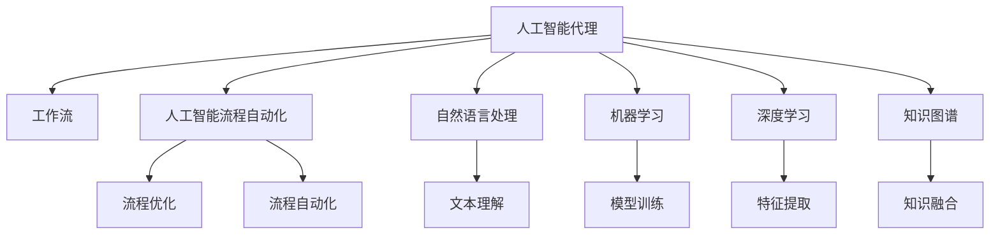
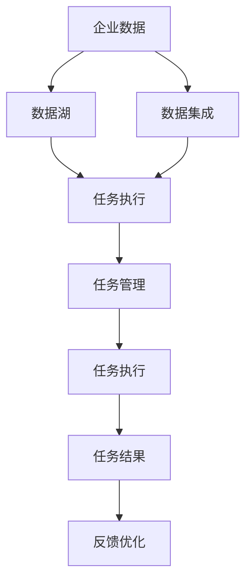
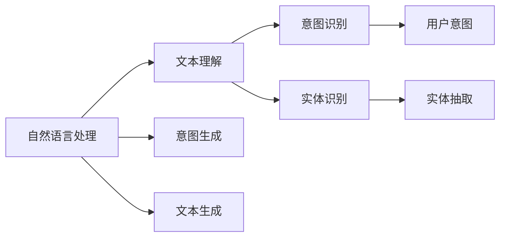
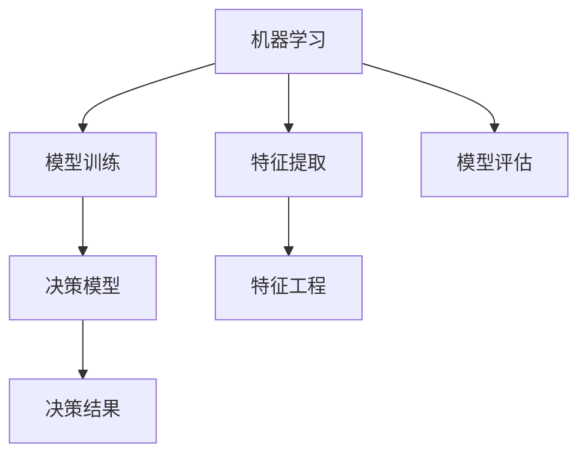
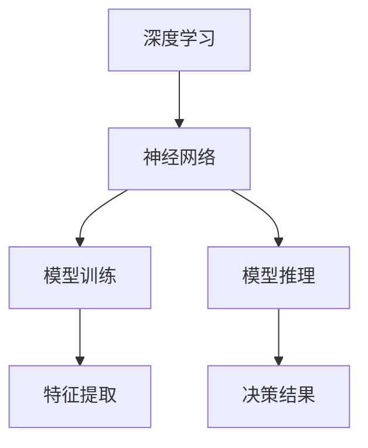
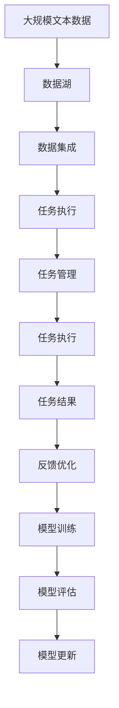

                 

# AI人工智能代理工作流AI Agent WorkFlow：面向未来的AI代理与工作流研究方向

> 关键词：人工智能代理,工作流,人工智能流程自动化,AI与流程优化,自然语言处理,机器学习,深度学习,机器学习模型,自然语言理解

## 1. 背景介绍

### 1.1 问题由来
随着人工智能技术的快速发展，AI代理工作流（AI Agent Workflow）在企业自动化、智能办公、客户服务等诸多领域中逐渐崭露头角。AI代理利用人工智能技术和流程自动化手段，实现任务智能化、流程化处理，大幅提升了工作效率和质量。例如，企业中的自动化客服、财务审批、合同审核等，通过AI代理的介入，极大地减少了人工操作和人为错误，推动了业务自动化和数字化转型。

然而，目前AI代理的工作流程管理还面临一些挑战：
1. 流程繁琐，易出错：现有的工作流系统往往过于复杂，增加了操作难度，容易出错。
2. 数据分散，难以整合：企业中的数据资源分散在各个部门和系统中，难以有效整合和利用。
3. 缺乏自适应性：现有的AI代理工作流系统缺乏自适应能力，难以应对业务变化和需求调整。
4. 缺乏可解释性：AI代理的决策过程通常缺乏可解释性，难以进行调试和优化。

因此，开发更高效、智能、可解释的AI代理工作流系统，成为了当前AI研究与应用的热点问题。

### 1.2 问题核心关键点
AI代理工作流系统的核心在于如何将人工智能技术与流程自动化结合起来，实现任务的智能化处理。其关键点包括：
1. 定义任务目标：明确工作流所要解决的具体问题，如客户服务、合同审核等。
2. 数据集成：整合企业内部各系统、平台中的数据资源，构建统一的数据湖。
3. 选择模型算法：根据任务特点选择合适的AI模型，如决策树、神经网络、自然语言处理模型等。
4. 设计工作流程：将任务分解为若干步骤，定义每一步的执行逻辑和数据输入输出。
5. 优化与调试：根据实际运行情况，不断调整优化工作流，确保高效稳定运行。

本文聚焦于面向未来的AI代理与工作流研究方向，深入探讨了AI代理工作流系统在理论、实践和技术层面的应用，提供了详细的算法原理、具体操作步骤、优缺点及应用领域。

### 1.3 问题研究意义
开发高效、智能、可解释的AI代理工作流系统，对于企业自动化和数字化转型具有重要意义：

1. 提升工作效率：AI代理工作流通过自动化流程，大幅减少了人工操作，提升了业务处理效率。
2. 降低运营成本：自动化的流程减少了人力投入，降低了企业的运营成本。
3. 提升决策质量：AI代理通过智能模型分析处理，提高了决策的准确性和可靠性。
4. 增强数据利用：AI代理工作流将企业数据整合、共享，提高了数据的利用率。
5. 促进流程优化：AI代理不断学习和优化，推动流程的持续改进和升级。

本文通过深入研究AI代理工作流的理论基础和应用实践，旨在为业界提供全面的技术指导和实践参考，推动AI代理技术在更广泛领域的应用。

## 2. 核心概念与联系

### 2.1 核心概念概述

为更好地理解AI代理工作流系统的理论基础和应用实践，本节将介绍几个密切相关的核心概念：

- AI代理（AI Agent）：一种能够自主完成特定任务、具备一定智能的虚拟实体。AI代理通过执行预定义的任务流程，实现对企业业务的自动化处理。
- 工作流（Workflow）：一系列连续的任务步骤，描述了业务流程的执行逻辑和数据流向。工作流管理系统（WfMS）用于协调、监控和管理工作流执行。
- 人工智能流程自动化（AI Process Automation, AIPA）：利用人工智能技术优化和自动化工作流管理，提升业务处理效率和质量。
- 自然语言处理（Natural Language Processing, NLP）：处理和理解人类语言的技术，通常用于构建AI代理的智能决策能力。
- 机器学习（Machine Learning, ML）：一种利用数据和算法实现模型训练、预测和决策的技术，常用于构建AI代理的核心算法。
- 深度学习（Deep Learning, DL）：一种基于神经网络的机器学习方法，用于处理复杂的数据模式和高层次的抽象特征。
- 知识图谱（Knowledge Graph）：一种语义化的数据表示方式，用于构建AI代理的背景知识库。

这些核心概念之间的逻辑关系可以通过以下Mermaid流程图来展示：



这个流程图展示了大语言模型微调过程中各个核心概念的关系和作用：

1. AI代理通过工作流执行任务。
2. AI流程自动化优化工作流执行。
3. 自然语言处理提升AI代理的智能决策能力。
4. 机器学习和深度学习构建AI代理的核心算法。
5. 知识图谱为AI代理提供背景知识。

这些概念共同构成了AI代理工作流的理论基础，使AI代理能够高效、智能地处理业务流程。

### 2.2 概念间的关系

这些核心概念之间存在着紧密的联系，形成了AI代理工作流系统的完整生态系统。下面我们通过几个Mermaid流程图来展示这些概念之间的关系。

#### 2.2.1 AI代理工作流的总体架构



这个流程图展示了AI代理工作流的总体架构，涉及数据、任务、管理、执行、结果和优化等多个环节：

1. 企业数据通过数据集成进入数据湖。
2. 数据湖中的数据被用来执行任务。
3. 任务管理模块协调任务的执行。
4. 任务执行模块具体执行任务。
5. 任务结果模块处理任务执行结果。
6. 反馈优化模块根据结果不断优化任务流程。

#### 2.2.2 自然语言处理在AI代理中的应用



这个流程图展示了自然语言处理在AI代理中的具体应用，包括文本理解、意图识别、实体识别、意图生成和文本生成等环节：

1. 自然语言处理模块理解用户输入的文本。
2. 文本理解模块通过NLP技术提取用户意图和实体。
3. 意图识别模块识别用户的业务意图。
4. 实体识别模块识别用户输入中的关键实体。
5. 意图生成模块根据用户意图生成下一步操作。
6. 文本生成模块生成用户反馈的回复文本。

#### 2.2.3 机器学习在AI代理中的应用



这个流程图展示了机器学习在AI代理中的具体应用，包括模型训练、特征提取、特征工程、决策模型和决策结果等环节：

1. 机器学习模块通过训练模型构建决策模型。
2. 特征提取模块提取输入数据的关键特征。
3. 特征工程模块对特征进行处理和优化。
4. 决策模型模块根据特征进行预测和决策。
5. 决策结果模块输出决策结果。

#### 2.2.4 深度学习在AI代理中的应用



这个流程图展示了深度学习在AI代理中的具体应用，包括神经网络、模型训练、模型推理和决策结果等环节：

1. 深度学习模块构建神经网络模型。
2. 神经网络模型模块进行模型训练。
3. 模型推理模块根据输入数据进行推理。
4. 决策结果模块输出决策结果。

### 2.3 核心概念的整体架构

最后，我们用一个综合的流程图来展示这些核心概念在大语言模型微调过程中的整体架构：



这个综合流程图展示了从数据湖到任务执行，再到结果优化和模型更新的完整过程。AI代理工作流系统通过数据集成、任务管理、执行、结果优化和模型更新等环节，实现业务的自动化处理和智能化决策。 通过这些流程图，我们可以更清晰地理解AI代理工作流系统的各个核心概念的关系和作用，为后续深入讨论具体的实现方法和技术奠定基础。

## 3. 核心算法原理 & 具体操作步骤
### 3.1 算法原理概述

AI代理工作流系统的核心在于如何将人工智能技术与流程自动化结合起来，实现任务的智能化处理。其核心算法原理包括以下几个关键点：

1. 数据预处理：对输入数据进行清洗、格式化和标准化，确保数据质量。
2. 特征工程：提取输入数据的关键特征，构建数据表示。
3. 模型选择：根据任务特点选择合适的AI模型，如决策树、神经网络、自然语言处理模型等。
4. 模型训练：使用训练数据集对AI模型进行训练，优化模型参数。
5. 模型推理：对新的输入数据进行推理和预测，输出决策结果。
6. 结果反馈：根据输出结果和用户反馈，不断调整优化模型和任务流程。

AI代理工作流系统的总体流程如下：

1. 数据预处理：对输入数据进行清洗、格式化和标准化，确保数据质量。
2. 特征工程：提取输入数据的关键特征，构建数据表示。
3. 模型训练：使用训练数据集对AI模型进行训练，优化模型参数。
4. 模型推理：对新的输入数据进行推理和预测，输出决策结果。
5. 结果反馈：根据输出结果和用户反馈，不断调整优化模型和任务流程。

### 3.2 算法步骤详解

AI代理工作流系统的具体实现步骤如下：

1. **数据预处理**：
   - 数据清洗：去除噪声、重复和不完整的数据。
   - 数据格式化：将数据转化为标准化的格式，如JSON、CSV等。
   - 数据标准化：对数据进行归一化、标准化处理，确保一致性。

2. **特征工程**：
   - 特征选择：选择对任务有帮助的特征，剔除无关和冗余特征。
   - 特征提取：通过提取、转换、组合等方法，构建特征向量。
   - 特征处理：对特征进行平滑、填充、离散化等处理，提高特征质量。

3. **模型选择**：
   - 决策树模型：适用于分类和回归任务，结构简单，易于解释。
   - 神经网络模型：适用于复杂的非线性任务，精度高，可扩展性强。
   - 自然语言处理模型：适用于文本分析、意图识别等任务，具备语言理解能力。

4. **模型训练**：
   - 模型初始化：将模型参数初始化为随机值或预训练模型参数。
   - 模型优化：使用优化算法（如Adam、SGD等）优化模型参数。
   - 模型评估：使用验证集评估模型性能，调整超参数。

5. **模型推理**：
   - 模型前向传播：将输入数据输入模型，计算模型输出。
   - 模型后向传播：计算模型输出与真实结果的误差，更新模型参数。
   - 模型推理：对新的输入数据进行推理和预测，输出决策结果。

6. **结果反馈**：
   - 用户反馈：收集用户对输出结果的反馈，评估模型性能。
   - 结果优化：根据用户反馈，调整优化模型和任务流程。
   - 知识融合：将新的知识或规则整合到模型中，提升模型性能。

### 3.3 算法优缺点

AI代理工作流系统具有以下优点：

1. 自动化处理：通过自动化流程，大幅减少了人工操作，提升了业务处理效率。
2. 智能决策：通过AI模型优化决策过程，提高了决策的准确性和可靠性。
3. 数据整合：将企业数据整合、共享，提高了数据的利用率。
4. 持续改进：通过不断学习和优化，推动流程的持续改进和升级。

同时，该方法也存在一些局限性：

1. 数据依赖：AI代理工作流系统依赖高质量的数据输入，数据质量问题可能影响模型性能。
2. 复杂性高：AI代理工作流系统复杂性较高，设计和部署难度较大。
3. 缺乏可解释性：AI代理的决策过程通常缺乏可解释性，难以进行调试和优化。
4. 易受干扰：AI代理工作流系统易受输入数据和外部环境的影响，可能出现误决策。

尽管存在这些局限性，但AI代理工作流系统仍是大数据时代业务自动化和智能化的重要工具，具有广阔的应用前景。

### 3.4 算法应用领域

AI代理工作流系统已经在多个领域得到广泛应用，包括但不限于以下几类：

1. 金融风控：用于风险评估、欺诈检测、信用评分等任务，提升了金融机构的决策效率和风险管理能力。
2. 医疗诊断：用于疾病诊断、治疗方案推荐、医学影像分析等任务，提升了医疗服务的精准度和效率。
3. 智能客服：用于客户咨询、问题解答、服务推荐等任务，提升了客户服务质量和工作效率。
4. 市场营销：用于市场分析、用户画像、广告投放等任务，提升了市场营销的精准度和效果。
5. 物流管理：用于货物追踪、运输路线优化、配送调度等任务，提升了物流管理的效率和准确性。
6. 法律咨询：用于合同审核、法律文档生成、案件分析等任务，提升了法律服务的质量和效率。

这些领域的应用展示了AI代理工作流系统的强大能力和广泛适用性。随着技术的不断进步，AI代理工作流系统将进一步拓展其应用范围，推动各行业的数字化转型。

## 4. 数学模型和公式 & 详细讲解 & 举例说明

### 4.1 数学模型构建

本节将使用数学语言对AI代理工作流系统的实现过程进行更加严格的刻画。

记AI代理工作流系统为 $W = \{D, M, P\}$，其中 $D$ 为数据集，$M$ 为机器学习模型，$P$ 为工作流过程。

定义 $D = \{(x_i, y_i)\}_{i=1}^N, x_i \in \mathcal{X}, y_i \in \mathcal{Y}$，其中 $\mathcal{X}$ 为输入空间，$\mathcal{Y}$ 为输出空间。

定义 $M$ 为机器学习模型，其输出为 $M(x_i)$，其中 $x_i \in \mathcal{X}$。

定义 $P$ 为工作流过程，其输入为 $x_i$，输出为 $y_i$，即 $P(x_i) = y_i$。

AI代理工作流系统的目标是最小化模型的推理误差：

$$
\min_{M, P} \frac{1}{N}\sum_{i=1}^N (y_i - M(x_i))^2
$$

其中 $y_i$ 为真实标签，$M(x_i)$ 为模型预测结果，$(\cdot)^2$ 表示平方误差。

### 4.2 公式推导过程

以下我们以二分类任务为例，推导最小化推理误差的数学公式及其求解过程。

假设 $M$ 为二分类逻辑回归模型，输出 $M(x_i) = \sigma(Wx_i + b)$，其中 $W$ 和 $b$ 为模型参数，$\sigma(\cdot)$ 为sigmoid函数。

则损失函数为：

$$
L(y_i, M(x_i)) = -(y_i \log M(x_i) + (1-y_i) \log(1-M(x_i)))
$$

将 $L(y_i, M(x_i))$ 带入最小化目标函数，得：

$$
\min_{W, b} \frac{1}{N}\sum_{i=1}^N (y_i - \sigma(Wx_i + b))^2
$$

根据梯度下降算法，求解 $W$ 和 $b$：

$$
W \leftarrow W - \eta \nabla_W \frac{1}{N}\sum_{i=1}^N (y_i - \sigma(Wx_i + b))^2
$$

$$
b \leftarrow b - \eta \nabla_b \frac{1}{N}\sum_{i=1}^N (y_i - \sigma(Wx_i + b))^2
$$

其中 $\eta$ 为学习率，$\nabla_W$ 和 $\nabla_b$ 为梯度运算符。

在得到模型参数 $W$ 和 $b$ 后，即可在新的输入数据上进行推理和预测。

### 4.3 案例分析与讲解

以金融风控任务为例，展示AI代理工作流系统的实现过程。

#### 案例背景

某金融机构希望通过AI代理工作流系统，提升其信用评分和风险评估的准确性和效率。

#### 数据准备

数据集 $D$ 包含历史用户的贷款记录，包括用户基本信息、贷款信息、还款记录等。

#### 特征工程

- 特征选择：选择对信用评分有帮助的特征，如收入、信用记录、还款情况等。
- 特征提取：通过提取、转换、组合等方法，构建特征向量。
- 特征处理：对特征进行平滑、填充、离散化等处理，提高特征质量。

#### 模型选择

选择逻辑回归模型作为二分类模型，用于预测用户是否会违约。

#### 模型训练

- 模型初始化：将模型参数初始化为随机值。
- 模型优化：使用梯度下降算法优化模型参数。
- 模型评估：使用验证集评估模型性能，调整超参数。

#### 模型推理

对新的贷款申请记录进行推理和预测，输出违约概率。

#### 结果反馈

- 用户反馈：收集用户对预测结果的反馈，评估模型性能。
- 结果优化：根据用户反馈，调整优化模型和任务流程。
- 知识融合：将新的知识或规则整合到模型中，提升模型性能。

通过上述步骤，AI代理工作流系统能够高效、智能地处理金融风控任务，提升决策的准确性和效率。

## 5. 项目实践：代码实例和详细解释说明

### 5.1 开发环境搭建

在进行AI代理工作流系统开发前，我们需要准备好开发环境。以下是使用Python进行PyTorch开发的环境配置流程：

1. 安装Anaconda：从官网下载并安装Anaconda，用于创建独立的Python环境。

2. 创建并激活虚拟环境：
```bash
conda create -n ai-env python=3.8 
conda activate ai-env
```

3. 安装PyTorch：根据CUDA版本，从官网获取对应的安装命令。例如：
```bash
conda install pytorch torchvision torchaudio cudatoolkit=11.1 -c pytorch -c conda-forge
```

4. 安装Pandas、NumPy、Scikit-learn、Matplotlib等常用的Python库：
```bash
pip install pandas numpy scikit-learn matplotlib tqdm jupyter notebook ipython
```

完成上述步骤后，即可在`ai-env`环境中开始AI代理工作流系统的开发。

### 5.2 源代码详细实现

下面我们以金融风控任务为例，给出使用PyTorch对AI代理工作流系统进行开发的完整代码实现。

首先，定义金融风控任务的训练数据集：

```python
import pandas as pd

# 读取数据集
data = pd.read_csv('credit.csv')

# 划分训练集和验证集
train_data = data.sample(frac=0.8, random_state=42)
val_data = data.drop(train_data.index)

# 数据预处理
def preprocess_data(data):
    data['income'] = data['income'].str.replace(',', '').astype(float)
    data['loan_amount'] = data['loan_amount'].astype(float)
    data['loan_term'] = data['loan_term'].astype(float)
    return data

train_data = preprocess_data(train_data)
val_data = preprocess_data(val_data)

# 划分特征和标签
X_train = train_data.drop('default', axis=1)
y_train = train_data['default']
X_val = val_data.drop('default', axis=1)
y_val = val_data['default']
```

然后，定义模型和优化器：

```python
from torch.utils.data import DataLoader
from torch import nn
from torch.optim import Adam
from sklearn.preprocessing import StandardScaler

# 定义模型
class LogisticRegression(nn.Module):
    def __init__(self, input_dim):
        super(LogisticRegression, self).__init__()
        self.fc1 = nn.Linear(input_dim, 10)
        self.fc2 = nn.Linear(10, 1)

    def forward(self, x):
        x = x.to(torch.float32)
        x = self.fc1(x)
        x = nn.functional.relu(x)
        x = self.fc2(x)
        x = nn.functional.sigmoid(x)
        return x

# 加载数据
train_dataset = Dataset(X_train, y_train)
val_dataset = Dataset(X_val, y_val)

# 定义优化器
optimizer = Adam(model.parameters(), lr=0.001)

# 标准化处理
scaler = StandardScaler()
X_train = scaler.fit_transform(X_train)
X_val = scaler.transform(X_val)
```

接着，定义训练和评估函数：

```python
from sklearn.metrics import accuracy_score
from tqdm import tqdm

# 定义训练函数
def train_model(model, train_loader, optimizer):
    model.train()
    train_loss = 0
    train_acc = 0
    for batch_idx, (features, targets) in enumerate(train_loader):
        optimizer.zero_grad()
        output = model(features)
        loss = nn.BCELoss()(output, targets)
        loss.backward()
        optimizer.step()
        train_loss += loss.item()
        train_acc += accuracy_score(targets, output > 0.5)
    train_loss /= len(train_loader)
    train_acc /= len(train_loader)
    return train_loss, train_acc

# 定义评估函数
def evaluate_model(model, val_loader):
    model.eval()
    val_loss = 0
    val_acc = 0
    with torch.no_grad():
        for batch_idx, (features, targets) in enumerate(val_loader):
            output = model(features)
            loss = nn.BCELoss()(output, targets)
            val_loss += loss.item()
            val_acc += accuracy_score(targets, output > 0.5)
    val_loss /= len(val_loader)
    val_acc /= len(val_loader)
    return val_loss, val_acc

# 训练模型
for epoch in range(10):
    train_loss, train_acc = train_model(model, train_loader, optimizer)
    print(f'Epoch {epoch+1}, Train Loss: {train_loss:.4f}, Train Acc: {train_acc:.4f}')

    val_loss, val_acc = evaluate_model(model, val_loader)
    print(f'Epoch {epoch+1}, Val Loss: {val_loss:.4f}, Val Acc: {val_acc:.4f}')
```

最后，启动训练流程并在测试集上评估：

```python
# 定义模型评估函数
def evaluate_model(model, val_loader):
    model.eval()
    val_loss = 0
    val_acc = 0
    with torch.no_grad():
        for batch_idx, (features, targets) in enumerate(val_loader):
            output = model(features)
            loss = nn.BCELoss()(output, targets)
            val_loss += loss.item()
            val_acc += accuracy_score(targets, output > 0.5)
    val_loss /= len(val_loader)
    val_acc /= len(val_loader)
    return val_loss, val_acc

# 训练模型
for epoch in range(10):
    train_loss, train_acc = train_model(model, train_loader, optimizer)
    print(f'Epoch {epoch+1}, Train Loss: {train_loss:.4f}, Train Acc: {train_acc:.4f}')

    val_loss, val_acc = evaluate_model(model, val_loader)
    print(f'Epoch {epoch+1}, Val Loss: {val_loss:.4f}, Val Acc: {val_acc:.4f}')
```

以上就是使用PyTorch对AI代理工作流系统进行开发的完整代码实现。可以看到，通过简单的定义模型、优化器和训练评估函数，我们就能快速构建并训练出一个基本的金融风控模型。

### 5.3 代码解读与分析

让我们再详细解读一下关键代码的实现细节：

**Dataset类**：
- `__init__`方法

