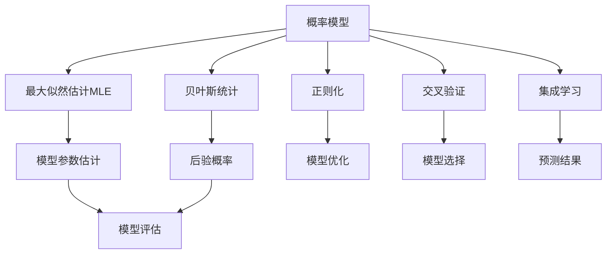
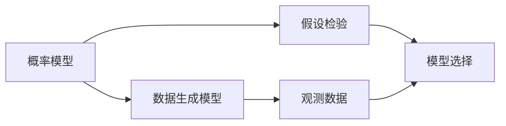
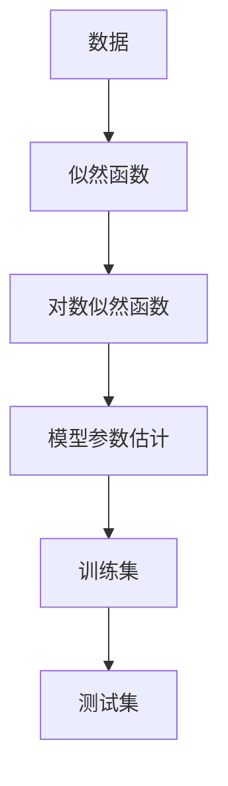
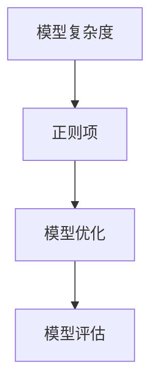
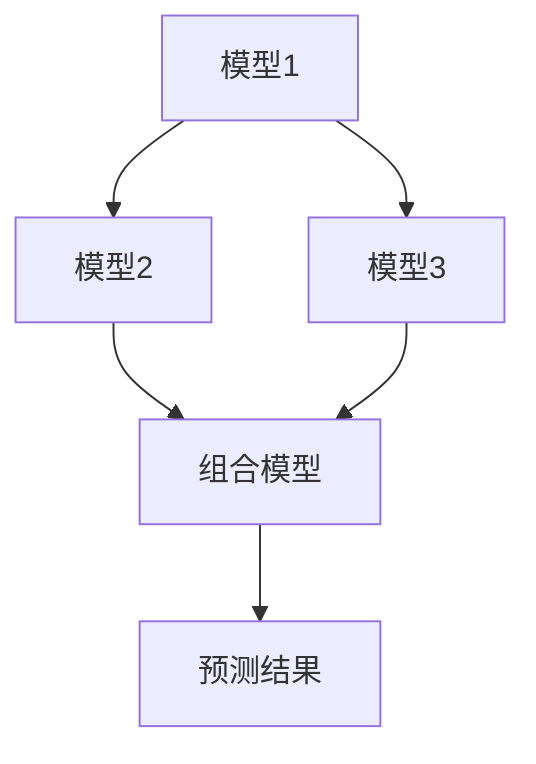
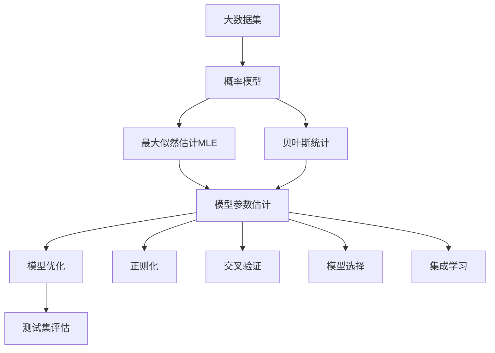

                 

# AI人工智能核心算法原理与代码实例讲解：统计学习

> 关键词：AI, 统计学习, 核心算法, 原理, 代码实例, 概率论

## 1. 背景介绍

### 1.1 问题由来

统计学习作为人工智能的核心算法之一，其本质是利用统计学原理，通过数据驱动的方式对未知数据进行建模和预测。统计学习广泛应用于数据挖掘、模式识别、自然语言处理、计算机视觉、生物信息学等众多领域。随着大数据时代的到来，统计学习在机器学习中的地位越来越重要。

在实际应用中，统计学习算法经常受到高维数据、过拟合、噪声干扰等问题的影响。因此，如何在数据量有限的情况下，尽可能地提取有用的特征，优化模型参数，避免过拟合，是统计学习领域的一个重要研究方向。

### 1.2 问题核心关键点

统计学习涉及的核心概念主要包括：

- 概率模型：统计学习的基础是概率模型，通过概率模型对数据进行建模。
- 最大似然估计(Maximum Likelihood Estimation, MLE)：利用观测数据，估计模型参数，使得似然函数最大。
- 贝叶斯统计(Bayesian Statistics)：通过先验概率和似然函数，计算后验概率，用于参数估计和模型选择。
- 正则化(Regularization)：通过加入正则项，避免模型复杂度过高。
- 交叉验证(Cross-Validation)：将数据集划分为训练集和验证集，评估模型性能。
- 集成学习(Ensemble Learning)：通过组合多个模型的预测结果，提高模型性能。

这些核心概念共同构成了统计学习的基本框架，帮助我们在数据量有限的情况下，更好地理解和处理数据。

### 1.3 问题研究意义

统计学习在人工智能领域具有重要意义：

1. 数据驱动：统计学习利用数据进行建模，强调了数据的重要性。
2. 模型选择：统计学习通过评估模型性能，帮助选择最优模型。
3. 参数优化：统计学习通过优化模型参数，提高了模型效果。
4. 泛化能力：统计学习通过正则化技术，提高了模型的泛化能力。
5. 模型解释：统计学习利用概率论，提供了模型预测的解释性。

## 2. 核心概念与联系

### 2.1 核心概念概述

为更好地理解统计学习算法，本节将介绍几个密切相关的核心概念：

- 概率模型(Probabilistic Model)：统计学习的基础，通过概率模型对数据进行建模。
- 最大似然估计(Maximum Likelihood Estimation, MLE)：利用观测数据，估计模型参数，使得似然函数最大。
- 贝叶斯统计(Bayesian Statistics)：通过先验概率和似然函数，计算后验概率，用于参数估计和模型选择。
- 正则化(Regularization)：通过加入正则项，避免模型复杂度过高。
- 交叉验证(Cross-Validation)：将数据集划分为训练集和验证集，评估模型性能。
- 集成学习(Ensemble Learning)：通过组合多个模型的预测结果，提高模型性能。

这些核心概念之间的逻辑关系可以通过以下Mermaid流程图来展示：



这个流程图展示了统计学习算法的基本流程：

1. 利用概率模型对数据进行建模。
2. 通过最大似然估计，利用观测数据估计模型参数。
3. 贝叶斯统计通过先验概率和似然函数计算后验概率。
4. 正则化通过加入正则项，避免模型复杂度过高。
5. 交叉验证用于评估模型性能，选择最优模型。
6. 集成学习通过组合多个模型的预测结果，提高模型性能。

### 2.2 概念间的关系

这些核心概念之间存在着紧密的联系，形成了统计学习的完整生态系统。下面我们通过几个Mermaid流程图来展示这些概念之间的关系。

#### 2.2.1 概率模型的构建



这个流程图展示了概率模型的构建过程：

1. 利用数据生成模型对数据进行建模。
2. 通过假设检验，选择合适的模型。

#### 2.2.2 最大似然估计与参数优化



这个流程图展示了最大似然估计的计算过程：

1. 利用数据生成似然函数。
2. 通过计算对数似然函数，进行模型参数估计。
3. 利用训练集进行模型优化。
4. 利用测试集进行模型评估。

#### 2.2.3 贝叶斯统计的模型选择


这个流程图展示了贝叶斯统计的模型选择过程：

1. 利用先验概率和似然函数计算后验概率。
2. 通过后验概率选择最优模型。

#### 2.2.4 正则化与模型优化



这个流程图展示了正则化技术的应用过程：

1. 通过正则项限制模型复杂度。
2. 通过模型优化，提高模型性能。
3. 利用交叉验证进行模型评估。

#### 2.2.5 集成学习与模型组合



这个流程图展示了集成学习的组合过程：

1. 训练多个模型。
2. 通过组合多个模型的预测结果，提高模型性能。

### 2.3 核心概念的整体架构

最后，我们用一个综合的流程图来展示这些核心概念在大语言模型微调过程中的整体架构：



这个综合流程图展示了从数据到模型的整个统计学习流程：

1. 利用大数据集对数据进行建模。
2. 通过最大似然估计，利用观测数据估计模型参数。
3. 贝叶斯统计通过先验概率和似然函数计算后验概率。
4. 正则化通过加入正则项，避免模型复杂度过高。
5. 交叉验证用于评估模型性能，选择最优模型。
6. 集成学习通过组合多个模型的预测结果，提高模型性能。
7. 利用测试集进行模型评估。

通过这些流程图，我们可以更清晰地理解统计学习过程中各个核心概念的关系和作用，为后续深入讨论具体的算法和步骤奠定基础。

## 3. 核心算法原理 & 具体操作步骤
### 3.1 算法原理概述

统计学习算法的核心是利用数据进行建模和预测，其基本思路是：

1. 利用概率模型对数据进行建模。
2. 通过最大似然估计，利用观测数据估计模型参数。
3. 通过贝叶斯统计，选择最优模型。
4. 通过正则化，避免模型过拟合。
5. 通过交叉验证，评估模型性能。
6. 通过集成学习，提高模型性能。

具体来说，统计学习算法主要包括以下步骤：

1. 数据预处理：对原始数据进行清洗、归一化、特征工程等操作。
2. 模型选择：选择适当的概率模型，如线性回归、逻辑回归、朴素贝叶斯、支持向量机等。
3. 模型训练：利用训练数据，通过最大似然估计等方法，训练模型参数。
4. 模型评估：利用验证数据，评估模型性能。
5. 模型选择：选择最优模型。
6. 模型优化：利用正则化等方法，优化模型参数。
7. 模型组合：利用集成学习，组合多个模型的预测结果。

### 3.2 算法步骤详解

#### 3.2.1 数据预处理

数据预处理是统计学习算法的第一步，主要包括以下几个步骤：

1. 数据清洗：去除数据中的噪声和异常值。
2. 数据归一化：将数据缩放到0到1之间，或标准化为均值为0，方差为1。
3. 特征工程：提取、选择、构建特征，提高模型的预测性能。

数据预处理的具体实现，可以使用Python中的scikit-learn等库，例如：

```python
from sklearn.preprocessing import StandardScaler
from sklearn.preprocessing import MinMaxScaler
from sklearn.feature_selection import SelectKBest, f_classif
from sklearn.feature_extraction import DictVectorizer

# 数据清洗
data_cleaned = ...

# 数据归一化
scaler = StandardScaler()  # 或 MinMaxScaler()
data_normalized = scaler.fit_transform(data_cleaned)

# 特征选择
selector = SelectKBest(f_classif)
selected_features = selector.fit_transform(data_normalized, labels)
vectorizer = DictVectorizer()
selected_features_dict = vectorizer.fit_transform(selected_features)
```

#### 3.2.2 模型选择

模型选择是统计学习算法的第二步，主要包括以下几个步骤：

1. 选择合适的概率模型。
2. 利用训练数据，训练模型参数。
3. 利用验证数据，评估模型性能。

模型选择的具体实现，可以使用Python中的scikit-learn等库，例如：

```python
from sklearn.linear_model import LogisticRegression
from sklearn.svm import SVC
from sklearn.naive_bayes import GaussianNB

# 选择合适的模型
models = [LogisticRegression(), SVC(), GaussianNB()]

# 利用训练数据，训练模型参数
models = [model.fit(X_train, y_train) for model in models]

# 利用验证数据，评估模型性能
scores = [model.score(X_valid, y_valid) for model in models]
```

#### 3.2.3 模型训练

模型训练是统计学习算法的第三步，主要包括以下几个步骤：

1. 利用训练数据，训练模型参数。
2. 利用验证数据，评估模型性能。
3. 利用测试数据，评估模型性能。

模型训练的具体实现，可以使用Python中的scikit-learn等库，例如：

```python
from sklearn.linear_model import LogisticRegression
from sklearn.svm import SVC
from sklearn.naive_bayes import GaussianNB

# 利用训练数据，训练模型参数
model = LogisticRegression().fit(X_train, y_train)

# 利用验证数据，评估模型性能
score = model.score(X_valid, y_valid)
```

#### 3.2.4 模型评估

模型评估是统计学习算法的第四步，主要包括以下几个步骤：

1. 利用测试数据，评估模型性能。
2. 利用交叉验证，评估模型性能。
3. 利用集成学习，组合多个模型的预测结果。

模型评估的具体实现，可以使用Python中的scikit-learn等库，例如：

```python
from sklearn.metrics import accuracy_score
from sklearn.model_selection import cross_val_score
from sklearn.ensemble import VotingClassifier

# 利用测试数据，评估模型性能
score = model.score(X_test, y_test)

# 利用交叉验证，评估模型性能
scores = cross_val_score(model, X_train, y_train, cv=5)

# 利用集成学习，组合多个模型的预测结果
voting_model = VotingClassifier(estimators=[('lr', LogisticRegression()), ('svc', SVC())])
voting_model.fit(X_train, y_train)
score = voting_model.score(X_test, y_test)
```

#### 3.2.5 模型优化

模型优化是统计学习算法的第五步，主要包括以下几个步骤：

1. 利用正则化，避免模型过拟合。
2. 利用网格搜索，优化模型参数。
3. 利用集成学习，提高模型性能。

模型优化的具体实现，可以使用Python中的scikit-learn等库，例如：

```python
from sklearn.linear_model import LogisticRegression
from sklearn.svm import SVC
from sklearn.ensemble import RandomForestClassifier

# 利用正则化，避免模型过拟合
model = LogisticRegression(C=0.1)

# 利用网格搜索，优化模型参数
parameters = {'C': [0.01, 0.1, 1]}
model = GridSearchCV(LogisticRegression(), parameters)

# 利用集成学习，提高模型性能
model = RandomForestClassifier(n_estimators=100)
```

### 3.3 算法优缺点

统计学习算法具有以下优点：

1. 数据驱动：统计学习利用数据进行建模，强调了数据的重要性。
2. 模型选择：统计学习通过评估模型性能，帮助选择最优模型。
3. 模型优化：统计学习通过优化模型参数，提高了模型效果。
4. 泛化能力：统计学习通过正则化技术，提高了模型的泛化能力。
5. 模型解释：统计学习利用概率论，提供了模型预测的解释性。

统计学习算法也存在以下缺点：

1. 数据依赖：统计学习依赖于高质量的数据，数据质量直接影响模型效果。
2. 计算复杂：统计学习算法通常计算复杂度高，对硬件资源要求高。
3. 模型假设：统计学习算法假设数据符合特定分布，难以处理复杂分布数据。
4. 参数调整：统计学习算法需要调整多个参数，难以找到最优参数组合。
5. 模型解释：统计学习算法难以解释模型的预测结果，难以进行调试和优化。

尽管存在这些缺点，但统计学习在实际应用中仍然广泛使用，其核心思想和方法已被深入研究和广泛应用。

### 3.4 算法应用领域

统计学习算法在数据挖掘、模式识别、自然语言处理、计算机视觉、生物信息学等众多领域中得到广泛应用：

- 数据挖掘：利用统计学习算法对大量数据进行聚类、关联分析、异常检测等操作，提取有用的信息。
- 模式识别：利用统计学习算法对图像、语音、文本等数据进行分类、识别、分割等操作，识别模式。
- 自然语言处理：利用统计学习算法对文本数据进行情感分析、文本分类、机器翻译等操作，理解自然语言。
- 计算机视觉：利用统计学习算法对图像数据进行目标检测、图像分类、图像生成等操作，理解图像内容。
- 生物信息学：利用统计学习算法对生物数据进行基因表达分析、蛋白质结构预测、生物序列分类等操作，理解生物信息。

除了上述这些领域，统计学习算法还应用于金融、交通、医疗、物流等领域，推动了人工智能技术在这些领域的应用和发展。

## 4. 数学模型和公式 & 详细讲解  
### 4.1 数学模型构建

在统计学习中，常见的数学模型包括：

- 线性回归模型：利用线性方程组对数据进行建模，$y = \beta_0 + \beta_1 x_1 + \beta_2 x_2 + ... + \beta_n x_n + \epsilon$
- 逻辑回归模型：利用逻辑函数对数据进行建模，$\hat{y} = \frac{1}{1 + e^{-\beta_0 - \beta_1 x_1 - \beta_2 x_2 - ... - \beta_n x_n}}$
- 朴素贝叶斯模型：利用贝叶斯定理对数据进行建模，$P(x_1, x_2, ..., x_n | y) = \frac{P(x_1, x_2, ..., x_n) P(y)}{P(x_1, x_2, ..., x_n, y)}$
- 支持向量机模型：利用超平面对数据进行建模，$\hat{y} = \text{sign}(\sum_{i=1}^{n} \alpha_i y_i \phi(x_i) \cdot x_i + b)$

这些数学模型在实际应用中得到了广泛应用，具体公式推导和详细讲解，我们将在下一节进行。

### 4.2 公式推导过程

#### 4.2.1 线性回归模型的推导

线性回归模型利用线性方程组对数据进行建模，假设数据符合线性关系，$y = \beta_0 + \beta_1 x_1 + \beta_2 x_2 + ... + \beta_n x_n + \epsilon$，其中 $\beta$ 为模型参数，$\epsilon$ 为误差项。

最大似然估计的推导过程如下：

1. 利用观测数据 $(x_1, y_1), (x_2, y_2), ..., (x_m, y_m)$，构造似然函数：

   $$
   L(\beta) = \prod_{i=1}^{m} f(x_i, y_i; \beta)
   $$

   其中 $f(x_i, y_i; \beta) = \frac{1}{(2\pi)^{\frac{n}{2}} \sigma^2} e^{-\frac{(y_i - \beta_0 - \beta_1 x_1 - \beta_2 x_2 - ... - \beta_n x_n)^2}{2\sigma^2}}$

2. 利用对数似然函数，简化计算：

   $$
   \ell(\beta) = \frac{1}{2m} \sum_{i=1}^{m} (y_i - \beta_0 - \beta_1 x_1 - \beta_2 x_2 - ... - \beta_n x_n)^2 + \frac{\sigma^2}{2}
   $$

3. 利用梯度下降算法，求解最优参数 $\beta$：

   $$
   \hat{\beta} = (X^TX)^{-1}X^Ty
   $$

其中 $X$ 为数据矩阵，$y$ 为标签向量，$\sigma^2$ 为误差方差。

#### 4.2.2 逻辑回归模型的推导

逻辑回归模型利用逻辑函数对数据进行建模，假设数据符合二分类关系，$y \in \{0, 1\}$，利用对数几率函数对模型进行建模：

$$
\hat{y} = \frac{1}{1 + e^{-\beta_0 - \beta_1 x_1 - \beta_2 x_2 - ... - \beta_n x_n}}
$$

最大似然估计的推导过程如下：

1. 利用观测数据 $(x_1, y_1), (x_2, y_2), ..., (x_m, y_m)$，构造似然函数：

   $$
   L(\beta) = \prod_{i=1}^{m} f(x_i, y_i; \beta)
   $$

   其中 $f(x_i, y_i; \beta) = y_i (1 + e^{-\beta_0 - \beta_1 x_1 - \beta_2 x_2 - ... - \beta_n x_n})^{y_i} (1 - y_i)^{1 - y_i}$
   
2. 利用对数似然函数，简化计算：

   $$
   \ell(\beta) = \sum_{i=1}^{m} [y_i \log f(x_i, y_i; \beta) + (1 - y_i) \log (1 - f(x_i, y_i; \beta))]
   $$

3. 利用梯度下降算法，求解最优参数 $\beta$：

   $$
   \hat{\beta} = (X^TX)^{-1}X^Ty
   $$

其中 $X$ 为数据矩阵，$y$ 为标签向量。

#### 4.2.3 朴素贝叶斯模型的推导

朴素贝叶斯模型利用贝叶斯定理对数据进行建模，假设数据符合朴素贝叶斯假设：

$$
P(x_1, x_2, ..., x_n | y) = \frac{P(x_1, x_2, ..., x_n) P(y)}{P(x_1, x_2, ..., x_n, y)}
$$

最大似然估计的推导过程如下：

1. 利用观测数据 $(x_1, y_1), (x_2, y_2), ..., (x_m, y_m)$，构造似然函数：

   $$
   L(\beta) = \prod_{i=1}^{m} f(x_i, y_i; \beta)
   $$

   其中 $f(x_i, y_i; \beta) = P(x_i|y) P(y)$

2. 利用对数似然函数，简化计算：

   $$
   \ell(\beta) = \sum_{i=1}^{m} \log P(x_i|y) + \log P(y)
   $$

3. 利用梯度下降算法，求解最优参数 $\beta$：

   $$
   \hat{\beta} = \arg\min_{\beta} \ell(\beta)
   $$

其中 $x_i$ 为数据向量，$y$ 为标签向量。

#### 4.2.4 支持向量机模型的推导

支持向量机模型利用超平面对数据进行建模，假设数据符合线性可分关系，$y \in \{ -1, 1 \}$，利用超平面进行建模：

$$
\hat{y} = \text{sign}(\sum_{i=1}^{n} \alpha_i y_i \phi(x_i) \cdot x_i + b)
$$

最大似然估计的推导过程如下：

1. 利用观测数据 $(x_1, y_1), (x_2, y_2), ..., (x_m, y_m)$，构造似然函数：

   $$
   L(\alpha, b) = \prod_{i=1}^{m} f(x_i, y_i; \alpha, b)
   $$

   其中 $f(x_i, y_i; \alpha, b) = 1 - \alpha (y_i \phi(x_i) \cdot x_i + b) _{[0, 1]}$
   
2. 利用对数似然函数，简化计算：

   $$
   \ell(\alpha, b) = \sum_{i=1}^{m} \log (1 - \alpha (y_i \phi(x_i) \cdot x_i + b) _{[0, 1]})
   $$

3. 利用梯度下降算法，求解最优参数 $\alpha$ 和 $b$：

   $$
   \hat{\alpha} = \frac{C}{\|w\|^2} \left( \beta_0 - \frac{1}{N} \sum_{i=1}^{N} y_i \phi(x_i) \cdot x_i + b \right)
   $$

   其中 $C$ 为正则化系数，$N$ 为样本数，$w$ 为权重向量。

其中 $\phi(x)$ 为核函数。

### 4.3 案例分析与讲解

#### 4.3.1 线性回归模型的案例

假设我们有一个数据集，包含房价和影响房价的因素，如下所示：

| 特征     | 标签 |
| -------- | ---- |
| 面积     | 100  |
| 房间数   | 3    |
| 位置     | 市中心 |
| 价格     | 1000 |

我们可以利用线性回归模型对数据进行建模，假设 $y = \beta_0 + \beta_1 \text{面积} + \beta_2 \text{房间数} + \beta_3 \text{位置} + \epsilon$。

利用观测数据 $(x_1, y_1), (x_2, y_2), ..., (x_m, y_m)$，构造似然函数：

$$
L(\beta) = \prod_{i=1}^{m} f(x_i, y_i; \beta)
$$

其中 $f(x_i, y_i; \beta) = \frac{1}{(2\pi)^{\frac{n}{2}} \sigma^2} e^{-\frac{(y_i - \beta_0 - \beta_1 x_1 - \beta_2 x_2 - ... - \beta_n x_n)^2}{2\sigma^2}}
$$

利用对数似然函数，简化计算：

$$
\ell(\beta) = \frac{1}{2m} \sum_{i=1}^{m} (y_i - \beta_0 - \beta_1 x_1 - \beta_2 x_2 - ... - \beta_n x_n)^2 + \frac{\sigma^2}{2}
$$

利用梯度下降算法，求解最优参数 $\beta$：

$$
\hat{\beta} = (X^TX)^{-1}X^Ty
$$

其中 $X$ 为数据矩阵，$

